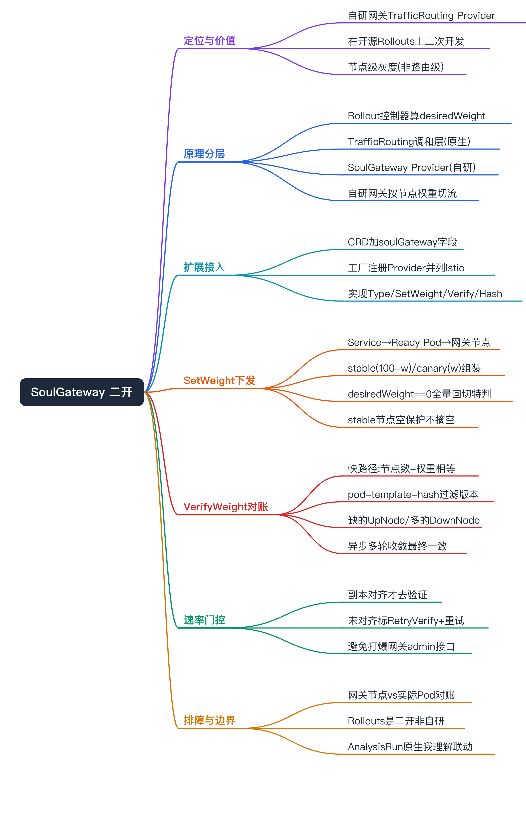
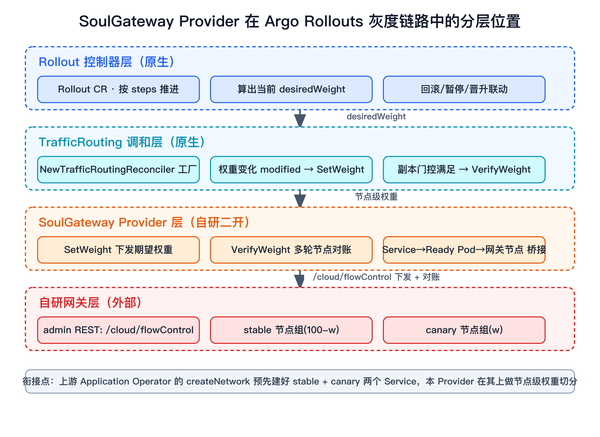
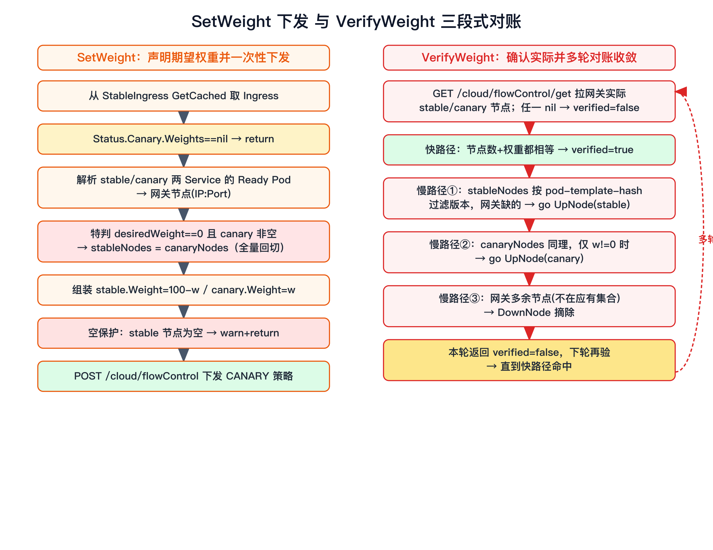
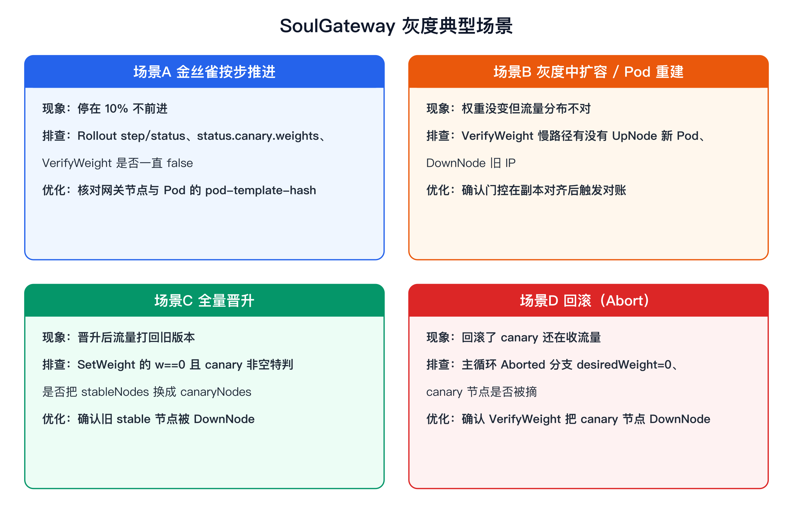
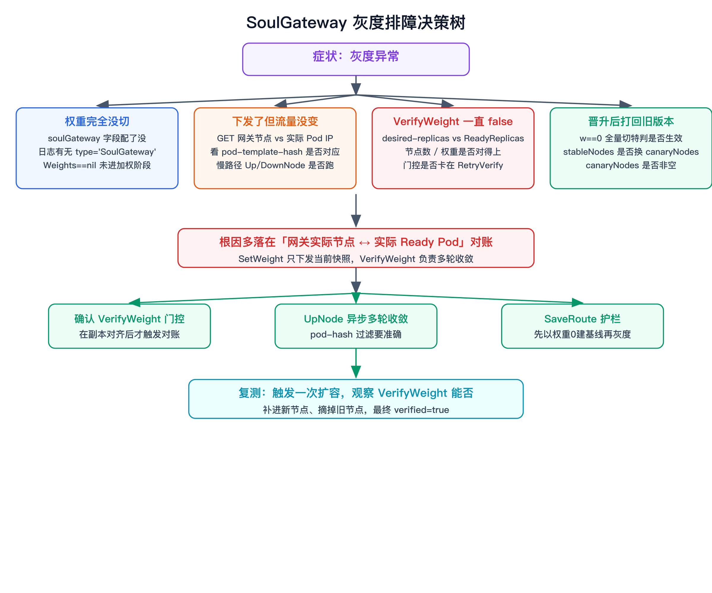
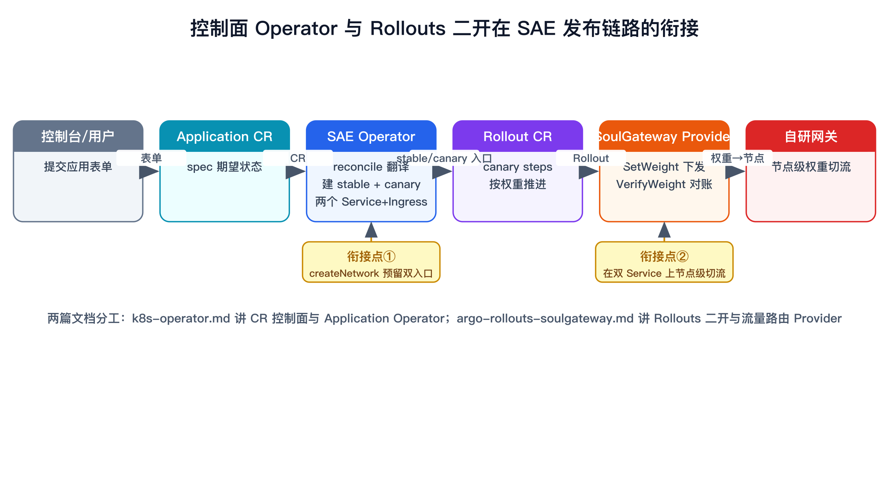

# Argo Rollouts 二次开发：自研 SoulGateway 流量路由 Provider 面试准备

> 这是 SAE 发布链路里「渐进式发布」那条线的深度文档，配套主线 [k8s-operator.md](./k8s-operator.md)（CR 控制面 / Application Operator）。上游 Operator 给一个应用建好 `stable` + `canary` 两个 Service 和 Ingress，本文讲的是在 Argo Rollouts 上做二次开发、自研一个对接公司自研网关的 `TrafficRouting` Provider，把金丝雀权重「节点级」地下发并对账到网关。

# 面试定位卡

- **技术点**：在开源 Argo Rollouts 上做二次开发——新增一个自研的 `SoulGateway` TrafficRouting Provider，实现 Rollouts 的流量路由扩展接口（`Type/SetWeight/VerifyWeight/UpdateHash`），并扩展 Rollout CRD（`spec.strategy.canary.trafficRouting.soulGateway`），把金丝雀按权重切流到公司自研网关。
- **所属领域**：云原生 / 持续发布 / 渐进式交付 / 开源二次开发。
- **面试价值**：能体现「读懂一个成熟开源控制器的扩展点、按它的接口契约接自研系统、并解决节点级流量对账」的真实深度——不是用 Rollouts，而是改 Rollouts。讲扩展接口、声明式权重下发、多轮 VerifyWeight 对账、Pod→网关节点桥接、速率限制门控。
- **常见考法**：Argo Rollouts 灰度原理 / TrafficRouting 怎么扩展 / SetWeight 和 VerifyWeight 各干什么 / 自研网关怎么接 / 节点级灰度和路由级（Istio）有什么不同 / 权重和实际 Pod 漂移怎么对账 / 为什么 VerifyWeight 不每轮都做。
- **适合挂钩项目**：SAE 持续发布平台（灰度发布 / 流量切分）。
- **不适合夸大的地方**：AnalysisRun 指标门禁那套是 Rollouts 原生能力（我理解它和流量切分的联动），我深度参与的是 TrafficRouting Provider 这条线；不要把整套 Rollouts 说成自研；不报没核实的灰度成功率/时长。

# 三十秒回答

我们生产用的流量入口是公司自研网关，Argo Rollouts 原生只支持 Istio/Nginx/ALB/SMI 这些 Provider，没有对接我们网关的，所以我在 Rollouts 上做了二次开发：扩展 Rollout CRD 加了一个 `soulGateway` 流量路由配置，并实现一个 `SoulGateway` TrafficRouting Reconciler。它的核心是两个扩展点——`SetWeight(desiredWeight)` 把 stable/canary 两个 Service 选中的 Ready Pod 解析成网关后端节点（IP:Port），按权重组装成 stable(100-w)/canary(w) 两组，调网关 admin 的 `/cloud/flowControl` 接口下发金丝雀策略；`VerifyWeight` 反向拉网关上实际的节点和权重做对账，对不上时按 Pod 的 `rollouts-pod-template-hash` 标签把该上的节点 UpNode、该摘的节点 DownNode，多轮收敛。和 Istio Provider 最大的不同是：Istio 改的是 VirtualService 上的权重、不管后端实例，我们是「节点级」灰度——网关后端是真实 Pod IP，所以 Pod 扩缩/重建/漂移都要靠 VerifyWeight 持续对账修复。代价就是这套对账逻辑和外部网关协议的强耦合，以及为了不打爆网关 admin 接口要做 VerifyWeight 的速率门控。

# 为什么需要它

- **没有它之前的问题**：Argo Rollouts 的渐进式发布能力（按 step 切权重、停在中间档跑分析、自动回滚）很好，但它的流量切分依赖 TrafficRouting Provider，而内置 Provider（Istio/Nginx/ALB/SMI/Ambassador）都不认我们的自研网关。不接 Provider 就只能退化成「按副本数滚动」，拿不到「按权重精确切流 + 验证」的能力。
- **它的解决方式**：按 Rollouts 定义的 `TrafficRoutingReconciler` 接口实现一个 `SoulGateway` Provider，并在 CRD 的 `RolloutTrafficRouting` 里新增 `soulGateway` 字段，让它和 Istio/Nginx 并列成为可选项；Rollout 控制器在每步灰度里驱动我们的 `SetWeight/VerifyWeight`。
- **它引入的新问题**：网关是「节点级」后端（注册的是 Pod IP:Port），不像 Istio 改个 CRD 权重就完事——Pod 一旦扩缩/重建/IP 变，网关上的节点就和实际 Pod 漂移，必须自己实现持续对账（UpNode/DownNode）；对账要调网关 admin REST 接口，频繁调用有速率压力，得做门控；还多了一条「Rollout 期望 → 网关实际」要排查的链路。
- **必须关注的场景**：权重切了但流量没变（节点漂移）、canary 为空时全量回切、stable 节点被误摘空、副本没对齐就去验证、网关 admin 限流或抖动。

# 核心概念表

- **Argo Rollouts**：用 `Rollout` CR 替代 Deployment 做渐进式发布。展开点：自己管新旧 ReplicaSet，按 `steps`（SetWeight/Pause/Analysis）推进；TrafficRouting 负责按权重切流，AnalysisRun 做指标门禁。
- **TrafficRoutingReconciler 接口**：Rollouts 抽象出来的流量路由扩展点。展开点：`Type() string`、`SetWeight(desiredWeight, ...)`、`VerifyWeight(desiredWeight, ...) (*bool, error)`、`UpdateHash(canaryHash, stableHash, ...)`；任何实现这套接口的 Provider 都能被插进灰度循环。
- **stable / canary Service**：稳定版与灰度版两个 K8s Service（上游 Application Operator 建 `name` 和 `name-canary`）。展开点：Provider 用 Service 的 selector 选出各自的 Pod，作为网关后端节点的来源。
- **节点级灰度（本方案）vs 路由级灰度（Istio）**：展开点：Istio 改 VirtualService 上 stable/canary subset 的权重；我们把 Pod IP:Port 直接注册成网关后端节点，权重切的是「stable 节点组 / canary 节点组」，所以要管节点的上下线。
- **SetWeight / VerifyWeight**：下发与验证两个动作。展开点：SetWeight 是「声明期望权重」，VerifyWeight 是「确认网关实际状态已达期望」并在不达时对账修复——前者一次性下发，后者多轮收敛。
- **rollouts-pod-template-hash**：Rollouts 给每个 ReplicaSet/Pod 打的版本标签。展开点：VerifyWeight 用它区分「这个 Pod 属于 stable 还是 canary 版本」，避免把旧版本 Pod 当成该上线的节点。
- **网关 admin REST API**：自研网关的管控面接口。展开点：`/cloud/flowControl`（下发策略）、`/cloud/flowControl/get/{app}/{domain}`（查策略）、`/cloud/{app}/{ip}/{port}/up/{service}` 与 `/down`（节点上下线）、`/cloud/saveOrUpdate` 与 `/cloud/get`（路由保存/查询）；endpoint 按 env（prod/gray/test）区分，httpClient 超时 5s。

# 原理模型

自上而下理解这条灰度链路：

- **Rollout 控制器层**：`Rollout` CR 按 `steps` 推进，每步算出一个 `desiredWeight`。`NewTrafficRoutingReconciler` 把声明了的 Provider（Istio/Nginx/**SoulGateway**）实例化成一个列表——我们的二开就是往这个工厂里加了一支 `if rollout...TrafficRouting.SoulGateway != nil { append(soulGateway.NewReconciler(...)) }`，让 SoulGateway 和内置 Provider 平起平坐。
- **TrafficRouting 调和层（reconcileTrafficRouting）**：每轮算 `desiredWeight`（全量晋升=0、Aborted=0、newRS 未就绪用上一档、否则 `GetCurrentSetWeight`），权重变化（modified）时调 `reconciler.SetWeight`；满足门控时调 `reconciler.VerifyWeight`。这一层是 Rollouts 原生的，我们的 Provider 被它驱动。
- **SoulGateway Provider 层（自研）**：`SetWeight` 下发期望、`VerifyWeight` 对账网关实际状态。中间通过 `servicePodsToGatewayNodePods` 把「Service → Ready Pod → 网关节点(IP:Port)」桥接起来。
- **自研网关层**：网关 admin 接口接收策略并把流量按节点权重切分；后端是真实 Pod IP，所以网关持有的节点列表必须和 K8s 里实际 Pod 持续对齐。

一句话：Rollouts 负责「灰度推进的节奏和该切多少权重」，我们的 Provider 负责「把这个权重翻译成网关上 stable/canary 两组真实节点 + 持续对账」。

# 关键机制

## TrafficRouting 扩展点：把自研 Provider 插进 Rollouts

解决的问题：在不 fork 重写 Rollouts 灰度逻辑的前提下，接入自研网关。

工作方式：① CRD 扩展——在 `RolloutTrafficRouting` 结构体加 `SoulGateway *SoulGatewayTrafficRouting`（字段含 `StableIngress`、`AnnotationPrefix`），跟着生成 deepcopy；② 工厂注册——`NewTrafficRoutingReconciler` 里判断 `TrafficRouting.SoulGateway != nil` 就 `append` 我们的 `soulGateway.NewReconciler(cfg)`，cfg 带 kubeClient、recorder、IngressWrapper；③ 实现接口——`Reconciler` 实现 `Type()=="SoulGateway"`、`SetWeight`、`VerifyWeight`、`UpdateHash`（我们 UpdateHash 是 no-op）。

代价：跟随 Rollouts 版本——它的接口签名变了我们要跟着改，所以是「二次开发 + 维护一个 fork/补丁」。

面试追问：为什么走扩展点而不是 fork 改主循环？——主循环（按 step 算 desiredWeight、modified 判定、回滚联动）是 Rollouts 的核心价值，我们只在「权重怎么落到网关」这一层接，复用它全部的灰度编排和指标门禁能力。

## SetWeight：把权重翻译成网关 stable/canary 两组节点

解决的问题：把一个 `desiredWeight`（比如 10）变成网关能执行的「stable 节点组权重 90 / canary 节点组权重 10」。

工作方式：

1. 从 `StableIngress`（CRD 配的）GetCached 取 Ingress；`rollout.Status.Canary.Weights == nil` 直接 return（还没进入加权阶段）。
2. 用 `servicePodsToGatewayNode(namespace, stableService)` 和 canaryService 各自解析出节点列表。
3. **全量回切特判**：`desiredWeight == 0 且 canaryNodes 非空` 时，把 `stableNodes = canaryNodes`——因为晋升完成后新版本要成为 stable 承接 100%，不能把流量打回旧 stable 节点。
4. 组装 `stableService{Weight: 100-desiredWeight}`、`canaryService{Weight: desiredWeight, Nodes: canaryNodes}`（desiredWeight==0 时 canary 不带节点）。
5. **空保护**：`stableService.Nodes` 为空直接 warn + return，绝不把 stable 摘空把线上打挂。
6. POST `/cloud/flowControl` 下发 `CANARY` 策略（appStrategy{app, timestamp, strategy{type:CANARY, serviceList:[stable,canary]}}）。

代价：是「按当前快照下发」，下发完不保证网关立刻一致（节点可能还在变），所以必须配 VerifyWeight 收敛。

面试追问：100-w 这个减法在哪做、为什么？——在 Provider 里做，因为网关要的是两组节点各自的绝对权重，stable 永远补足到 100；Rollouts 只给我们 canary 的 desiredWeight。

## VerifyWeight：多轮节点对账，把网关实际拉到期望

解决的问题：网关后端是真实 Pod IP，Pod 扩缩/重建/漂移后网关节点会和实际 Pod 不一致，要持续修复。

工作方式（三段式）：

1. **拉实际**：GET `/cloud/flowControl/get/{app}/{domain}` 拿网关上当前 stable/canary 两组节点；任一为 nil 直接返回 `verified=false`。
2. **快路径**：网关 stable 节点数 == 实际 stableNodes 数、stable 权重 == 100-desiredWeight、canary 节点数 == 实际 canaryNodes 数 → `verified=true` 直接返回。
3. **慢路径对账**：
   - 遍历实际 stableNodes，用 `rollouts-pod-template-hash` 过滤掉不属于 stable 版本的 Pod（hash 不匹配 `continue`）；网关上没有这个 IP 的，异步 `go UpNode(...STABLE_SERVICE)` 上线。
   - canary 同理，但只在 `desiredWeight != 0` 时才 UpNode（权重 0 不该有 canary 节点）。
   - 反向遍历网关上所有节点，不在「实际应有节点（allPodNodes）」里的，`DownNode` 摘除。
   - 这一轮返回 `verified=false`，等下一轮 reconcile 再验，直到快路径命中。

代价：UpNode 是异步 `go` 发起、不等返回，所以单轮不保证一致——这是有意设计成「多轮收敛」的；强一致性让位给了「不阻塞 reconcile + 网关侧幂等」。

面试追问：为什么用 pod-template-hash 过滤？——同一个 stable Service 的 selector 在版本切换瞬间可能选到新旧两版 Pod，用 Rollouts 打的版本 hash 才能精确判断「这个 Pod 是不是这一版该上线的节点」，避免把旧版本节点错误上线。

## VerifyWeight 的速率门控：副本对齐了才去验证

解决的问题：VerifyWeight 要打网关 admin 接口，每轮 reconcile 都验会把网关管控面打爆/触发限流。

工作方式（在 Rollouts `reconcileTrafficRouting` 主循环里，针对 SoulGateway 特判）：读 newRS 的 `rollout.argoproj.io/desired-replicas` 注解；当 `desiredReplicas != newRS.Status.ReadyReplicas`（副本还没拉齐）时，标 `Canary.RetryVerify = true` 并 `enqueueRolloutAfter(重试间隔)`，**这一轮先不验**；等到副本对齐（`desiredReplicas == ReadyReplicas`）且上一轮标了 RetryVerify，才真正 `shouldVerifyWeight=true` 去调 VerifyWeight。验完置 `LastVerified` 时间、清 RetryVerify；没 verified 就再 enqueueAfter 重试。

代价：验证有延迟——副本没齐期间不验，靠重试间隔轮询；但换来网关接口不被高频打。

面试追问：为什么用副本就绪数做门控而不是定时？——副本没拉齐时节点本来就在变，这时候验证必然不一致、纯属浪费调用；用「副本对齐」作为「值得验证」的信号，比纯定时更准。

## Service → 网关节点的桥接

解决的问题：网关要的是后端节点（IP:Port），来源是 K8s Service 选中的 Pod。

工作方式：`servicePodsToGatewayNodePods` 用 `service.Spec.Selector` 列 Pod，过滤掉非 `PodRunning`、有 `DeletionTimestamp`、未 `IsPodReady` 的，端口取 `service.Spec.Ports[0].TargetPort.IntVal`，产出 `gatewayNodePod{IP, Port, Pod}`（保留 Pod 对象是为了后面读 pod-template-hash 标签）。`servicePodsToGatewayNode` 是它的精简版，只取 IP:Port。

代价：只看 selector + Ready，不感知网关侧健康检查；网关另有 health_check，两边健康语义要对齐。

面试追问：为什么过滤 DeletionTimestamp 和未 Ready？——正在删除或没就绪的 Pod 不该承接流量，提前在「注册进网关」这一步就排除，避免把流量打到坏节点。

## SaveRoute 的「先建基线再灰度」护栏

解决的问题：灰度（权重非 0）必须建立在网关已有该应用的基线路由和节点之上，否则灰度无从切起。

工作方式：`SaveRoute` 在权重 `!= 0` 时先 `VerifyApp` 查网关路由；若 `RouteList` 为空或某 service 节点为空，直接报错「网关无路由信息/无节点信息，Ingress 服务权重需先设置为 0」——强制先以权重 0 建好基线路由（`/cloud/saveOrUpdate`），再进灰度。

代价：多一道前置约束，发布流程上要保证基线路由先就位。

面试追问：这个约束本质在防什么？——防「网关里还没这个应用的任何节点，就直接下发 10% canary」导致策略悬空、流量无处可切。

# 横向对比

- **SoulGateway Provider vs Istio Provider**：Istio 改 VirtualService 上 subset 权重，后端实例由 Istio/K8s 管，Provider 不碰节点；我们是节点级，直接把 Pod IP 注册成网关后端，所以要自己做 UpNode/DownNode 对账。注意点：自研的代价就是这套对账，Istio 那套有现成 CRD 兜底。
- **节点级灰度 vs 路由级灰度**：节点级——权重切的是真实 Pod 节点组，精确但要管节点漂移；路由级——权重切的是抽象路由规则，省心但依赖 mesh/ingress 把规则映射到实例。注意点：节点级必须有 VerifyWeight 这种持续对账，否则 Pod 一变就漂。
- **SetWeight vs VerifyWeight**：SetWeight 是「声明期望、一次性下发」，VerifyWeight 是「确认+多轮对账收敛」。注意点：只有 SetWeight 没 VerifyWeight，节点漂移后没人修；这俩是「下发-收敛」一对。
- **Rollouts 二次开发（接 Provider）vs fork 改主循环**：接 Provider 复用全部灰度编排，只接「权重落地」一层；fork 改主循环维护成本高、跟不上上游。注意点：能用扩展点就别 fork。
- **每轮验证 vs 副本对齐门控验证**：每轮验简单但打爆网关 admin；门控验省调用但有延迟。注意点：面试可讲「用副本就绪作为值得验证的信号」这个设计取舍。
- **Rollouts 替代 Deployment vs 替代 Service**：Rollouts 用 `Rollout` CR 替代 Deployment 管 ReplicaSet，不替代 Service。注意点：常见误区是以为 Rollouts 接管了 Service。

# 典型业务场景

- **场景 A：金丝雀按步推进**。为什么相关：Rollouts 按 step 给 desiredWeight，我们 SetWeight 下发到网关。可能现象：停在 10% 不前进。排查方式：看 Rollout step/status、`status.canary.weights`、SoulGateway VerifyWeight 是否一直 false。优化方向：核对网关实际节点与 Pod 的 pod-template-hash 是否对得上。
- **场景 B：灰度中扩容/Pod 重建**。为什么相关：节点级灰度下 Pod IP 变了网关就漂。可能现象：权重没变但流量分布不对。排查方式：看 VerifyWeight 慢路径有没有把新 Pod UpNode、把旧 IP DownNode。优化方向：确认 VerifyWeight 门控在副本对齐后被触发。
- **场景 C：全量晋升**。为什么相关：desiredWeight 归 0，新版本要变 stable 承接 100%。可能现象：晋升后流量打回旧节点。排查方式：看 SetWeight 的 `desiredWeight==0 && canaryNodes>0` 特判有没有把 stableNodes 换成 canaryNodes。优化方向：确认晋升后旧 stable 节点被 DownNode。
- **场景 D：回滚（Abort）**。为什么相关：Aborted 时 desiredWeight=0，流量要全回 stable。可能现象：回滚了 canary 还在收流量。排查方式：看主循环 Aborted 分支、canary 节点是否被摘。优化方向：确认 VerifyWeight 把 canary 节点 DownNode。

# 排障路径

按「症状 → 假设 → 验证 → 指标 → 结论 → 优化 → 复测」走：

- **症状：Provider 没生效，权重完全没切**。
  - 假设1：Provider 没被注册。验证：Rollout `spec.strategy.canary.trafficRouting.soulGateway` 配了没、控制器日志有没有 `Reconciling TrafficRouting with type 'SoulGateway'`。重点看：CRD 字段是否被识别、工厂有没有 append。
  - 假设2：还没进加权阶段。验证：`rollout.Status.Canary.Weights` 是不是 nil。重点看：SetWeight 第一段就因 Weights==nil return。
- **症状：权重下发了但流量没变**。假设：网关节点和实际 Pod 漂移。验证：GET `/cloud/flowControl/get/{app}/{domain}` 看网关 stable/canary 节点 IP vs 实际 Pod IP、Pod 的 pod-template-hash。重点看：VerifyWeight 慢路径 UpNode/DownNode 有没有跑。异常说明：SetWeight 下发了但没人对账。
- **症状：VerifyWeight 一直 false**。假设：副本没对齐没被触发，或节点数对不上。验证：newRS `desired-replicas` 注解 vs `ReadyReplicas`、网关节点数 vs 实际节点数、权重是不是 100-desired。重点看：门控是不是卡在 RetryVerify。
- **症状：晋升后流量打回旧版本**。假设：desiredWeight==0 全量切特判没生效。验证：SetWeight 里 stableNodes 是否被换成 canaryNodes。重点看：canaryNodes 是否非空。
- **症状：stable 被摘空 / 报「需先设置为 0」**。假设：基线路由没建或 stable 节点空。验证：SaveRoute 护栏报错、VerifyApp 返回的 RouteList/节点。重点看：是否先以权重 0 建好基线。
- **结论与优化**：节点级灰度的问题几乎都落在「网关实际节点 ↔ 实际 Ready Pod」的对账。优化：确保 VerifyWeight 门控在副本对齐后触发、UpNode 异步收敛多轮、pod-template-hash 过滤准确。复测：触发一次扩容，观察 VerifyWeight 能否把新节点补进、旧节点摘掉，最终 verified=true。

# 风险、边界和误区

- **说法：「整套 Argo Rollouts 是我自研的」**。问题：Rollouts 是开源项目，我们做的是二次开发。更稳妥：「我在 Argo Rollouts 上做二次开发，深度参与自研 SoulGateway TrafficRouting Provider，复用它的灰度编排」。
- **说法：「灰度的指标门禁自动回滚也是我做的」**。问题：AnalysisRun 是 Rollouts 原生能力。更稳妥：「AnalysisRun 指标门禁是 Rollouts 原生，我理解它和流量切分/暂停回滚的联动；我深度参与的是 TrafficRouting Provider 这条」。
- **做法：「VerifyWeight 一次就强一致」**。问题：UpNode 是异步 go、设计成多轮收敛。更稳妥：讲成「多轮对账最终一致，依赖网关侧幂等」。
- **说法：「和 Istio Provider 一样改个权重就行」**。问题：我们是节点级，要管 Pod→节点的上下线。更稳妥：强调节点级 vs 路由级的本质差异和它带来的对账成本。
- **边界**：网关 admin 协议是外部强依赖，最终一致依赖网关幂等；不编造灰度成功率、回滚耗时、QPS 这类生产指标，只讲机制和对账思路。

# 和项目的安全连接

## 了解型说法

我理解 Argo Rollouts 的渐进式发布模型——`Rollout` CR 管新旧 ReplicaSet、按 step 切权重、AnalysisRun 做指标门禁、TrafficRouting 抽象出 Provider 扩展点，也理解它为什么把流量切分抽象成可插拔接口。

## 排查型说法

灰度卡住时我按 Rollout step/status → `status.canary.weights` → SoulGateway VerifyWeight 返回值 → 网关 admin 上 stable/canary 实际节点与权重 → Pod 的 pod-template-hash 这条链路对账；权重不生效我会先确认是 SetWeight 没下发还是 VerifyWeight 没对上。

## 实践型说法

我深度参与自研 SoulGateway TrafficRouting Provider：扩展 Rollout CRD 加 soulGateway 字段、在工厂里注册 Provider、实现 SetWeight（Service→Ready Pod→网关节点、100-w/w 组装、全量回切特判、stable 空保护、/cloud/flowControl 下发）和 VerifyWeight（三段式节点对账、pod-template-hash 过滤、UpNode/DownNode、多轮收敛），以及在主循环里用「副本对齐」做 VerifyWeight 的速率门控。

## 不能说的话

不能说整套 Rollouts 是我写的；不能说 AnalysisRun 指标门禁/自动回滚是我做的（原生能力，我理解联动）；不能说 VerifyWeight 单轮强一致；不报没核实的灰度指标。

# 高频 Q&A

## Argo Rollouts 的灰度原理是什么

Rollouts 用 `Rollout` CR 替代 Deployment，自己管理新旧（或多个）ReplicaSet，按 `steps`（SetWeight/Pause/Analysis）一档档推进；每步可挂 AnalysisRun 做指标门禁（不达标暂停/回滚），TrafficRouting 负责把权重切到 stable/canary。它替代的是 Deployment 而不是 Service，核心价值是「能停在中间档位做分析再决定继续还是回滚」。

## TrafficRouting 是怎么做成可扩展的，你们怎么接进去

Rollouts 把流量路由抽象成 `TrafficRoutingReconciler` 接口（Type/SetWeight/VerifyWeight/UpdateHash），并在 `NewTrafficRoutingReconciler` 工厂里按 CRD 里声明了哪个 Provider 就实例化哪个。我们做三件事：在 `RolloutTrafficRouting` CRD 加 `soulGateway` 字段、在工厂里加一支 `if SoulGateway != nil { append(NewReconciler) }`、实现这套接口。这样 SoulGateway 和 Istio/Nginx 并列，复用 Rollouts 全部灰度编排。

## SetWeight 和 VerifyWeight 各自干什么

SetWeight 是「声明期望权重并一次性下发」：把 stable/canary 两 Service 的 Ready Pod 解析成网关节点，组装成 stable(100-w)/canary(w) 调 `/cloud/flowControl` 下发。VerifyWeight 是「确认网关实际状态达到期望，不达就对账修复」：拉网关实际节点，数量+权重都对就 verified=true；否则按 pod-template-hash 把该上的 UpNode、该摘的 DownNode，多轮收敛。一个负责下发、一个负责收敛。

## 你们的灰度和 Istio 的流量切分有什么本质不同

Istio 是路由级——改 VirtualService 上 stable/canary subset 的权重，后端实例由 mesh 管，Provider 不碰节点；我们是节点级——把真实 Pod IP:Port 注册成网关后端节点，权重切的是「stable 节点组 / canary 节点组」。本质差异是：节点级下 Pod 扩缩/重建/IP 漂移都会让网关节点和实际 Pod 不一致，所以必须自己实现 VerifyWeight 这种持续对账，而 Istio 改完 CRD 就交给 mesh 了。

## 权重和实际 Pod 漂移了怎么对账

VerifyWeight 慢路径做三件事：① 遍历实际 stable/canary 的 Ready Pod，用 rollouts-pod-template-hash 过滤出该版本该上线的节点，网关上没有的异步 UpNode；② canary 只在 desiredWeight!=0 时上线；③ 反向遍历网关上所有节点，不在「实际应有节点」集合里的 DownNode。UpNode 异步发起、单轮不保证一致，靠多轮 reconcile 收敛到快路径命中。

## 为什么 VerifyWeight 不每轮都做

VerifyWeight 要调网关 admin REST 接口，每轮 reconcile 都验会把管控面打爆或触发限流。所以在主循环里对 SoulGateway 做门控：副本没对齐（newRS 的 desired-replicas 注解 != ReadyReplicas）时只标 RetryVerify 并延迟重试、不验；副本对齐且上轮标了 RetryVerify 才真正验。用「副本对齐」作为「值得验证」的信号——副本还在变时验证必然不一致，纯属浪费调用。

## desiredWeight 是怎么算出来的

这在 Rollouts 原生主循环：全量晋升（IsFullyPromoted）时 desiredWeight=0；Aborted 时 0（除非 DynamicStableScale 按可用副本递减）；newRS 还没就绪时沿用上一档 SetWeight；正常推进时取 `GetCurrentSetWeight`（当前 step 的权重）。算完只有权重变化（modified）才调我们的 SetWeight。我们 Provider 拿到的就是这个 desiredWeight，stable 补足成 100-w。

## desiredWeight==0 为什么要特判

两种情况都可能是 0：还没开始灰度，和已经全量晋升。全量晋升时新版本要成为 stable 承接 100%，如果还按字面把流量给「原 stable 节点」就打回旧版本了。所以 SetWeight 里特判：`desiredWeight==0 且 canaryNodes 非空` 时把 stableNodes 换成 canaryNodes，让新版本节点承接全量；VerifyWeight 侧也对应换 pod-template-hash。

## Service 到网关节点是怎么映射的

`servicePodsToGatewayNodePods` 用 Service 的 selector 列 Pod，过滤掉非 Running、有 DeletionTimestamp、未 IsPodReady 的，端口取 service.Spec.Ports[0].TargetPort，产出 (IP, Port, Pod)。保留 Pod 对象是为了后面读 pod-template-hash。这是「K8s Service 抽象」到「网关后端节点」的桥，只有健康可用的 Pod 才会被注册进网关。

## 上游的 stable/canary 两个 Service 哪来的

是上游 Application Operator 建的——`createNetwork` 一次建 `name`（stable）和 `name-canary` 两个 Service 加 Ingress（见 [k8s-operator.md](./k8s-operator.md)）。这就是控制面和发布面的衔接点：Operator 为灰度预留好两个流量入口，Rollouts 的 SoulGateway Provider 在这两个 Service 上做节点级权重切分。

## UpNode 用异步 go 会不会有问题

会引入「单轮不一致」：UpNode 发起了但网关还没处理完，这轮 VerifyWeight 就返回 false。这是有意的——不阻塞 reconcile、不等网关同步返回，把一致性交给「多轮收敛 + 网关侧幂等」。风险是如果网关一直不收敛会一直 false 卡住，所以排查时要同时看网关 admin 日志和我们的对账日志。更稳可以给 UpNode 加结果校验和重试上限。

# 三档背诵版

**30 秒**：Argo Rollouts 原生不支持我们的自研网关，我做二次开发自研了 SoulGateway TrafficRouting Provider：扩展 Rollout CRD 加 soulGateway 字段、实现 SetWeight（把 stable/canary 两 Service 的 Ready Pod 解析成网关节点、按 100-w/w 下发到 /cloud/flowControl）和 VerifyWeight（拉网关实际节点做对账、按 pod-template-hash UpNode/DownNode、多轮收敛）。和 Istio 不同我们是节点级灰度，Pod 漂移要靠 VerifyWeight 持续修复。

**3 分钟**：在 30 秒上补机制——讲 TrafficRouting 是 Rollouts 抽象的可插拔接口，我们在工厂里 append 自研 Provider；SetWeight 的全量回切特判（desiredWeight==0 把 stableNodes 换成 canaryNodes）和 stable 空保护；VerifyWeight 三段式（快路径数量+权重相等即 verified、慢路径按 pod-template-hash 对账 UpNode/DownNode）；以及为什么不每轮验——用「副本对齐」做速率门控，副本没齐先 RetryVerify 延迟重试。讲 Service→Ready Pod→网关节点的桥接和健康过滤。

**5 分钟**：再补对比、边界和项目连接——节点级 vs 路由级（Istio）的本质差异和对账成本、SetWeight vs VerifyWeight 的下发-收敛分工、接 Provider vs fork 主循环；诚实讲边界：Rollouts 是开源二开不是自研、AnalysisRun 是原生能力我理解联动、VerifyWeight 是多轮最终一致依赖网关幂等；讲上游 Application Operator 建好 stable/canary 双 Service 作为衔接点（接 [k8s-operator.md](./k8s-operator.md)）；最后落到我能讲清扩展接口契约、节点对账算法、速率门控取舍和漂移排查，这是真实深度参与二开的体现。

# 图示清单

- `00_soulgateway_overview_mindmap.png` — 全文总览 XMind。
- `01_soulgateway_principle.png` — SoulGateway Provider 在 Rollouts 灰度链路中的分层位置。
- `02_soulgateway_mechanism.png` — SetWeight 下发 + VerifyWeight 三段式对账机制。
- `03_soulgateway_scenario.png` — 灰度推进/扩容漂移/全量晋升/回滚场景。
- `04_soulgateway_troubleshooting.png` — 灰度排障决策树。
- `05_soulgateway_project_connection.png` — Operator 控制面与 Rollouts 二开在 SAE 发布链路的衔接。

# 面试前检查清单

- [ ] 能 30 秒讲清 Rollouts 灰度原理和我们为什么要做二次开发。
- [ ] 能讲清 TrafficRouting 扩展点（接口四方法 + 工厂注册 + CRD 扩展）。
- [ ] 能讲 SetWeight 的关键细节：100-w 组装、全量回切特判、stable 空保护、/cloud/flowControl 下发。
- [ ] 能讲 VerifyWeight 三段式对账 + pod-template-hash 过滤 + UpNode/DownNode 多轮收敛。
- [ ] 能讲速率门控：为什么用副本对齐而不是定时去验证。
- [ ] 能讲清节点级灰度 vs 路由级（Istio）的本质差异和对账成本。
- [ ] 能讲 ≥3 个场景：按步推进、扩容漂移、全量晋升、回滚。
- [ ] 能按「症状→假设→验证→优化」讲网关节点↔Pod 对账排障。
- [ ] 知道哪些不能夸大：Rollouts 是二开、AnalysisRun 原生、VerifyWeight 多轮最终一致。
- [ ] 能衔接上游 Application Operator 的 stable/canary 双 Service（接主线文档）。
