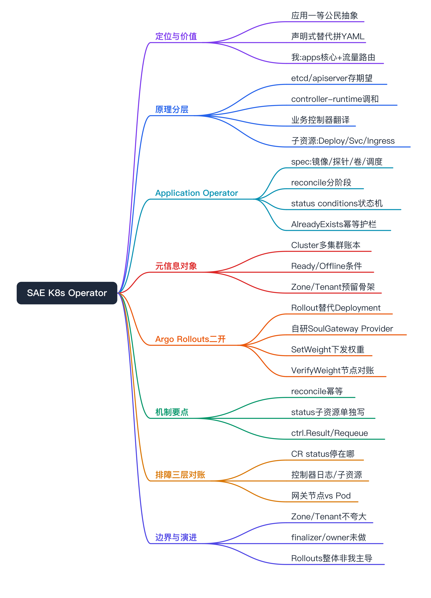
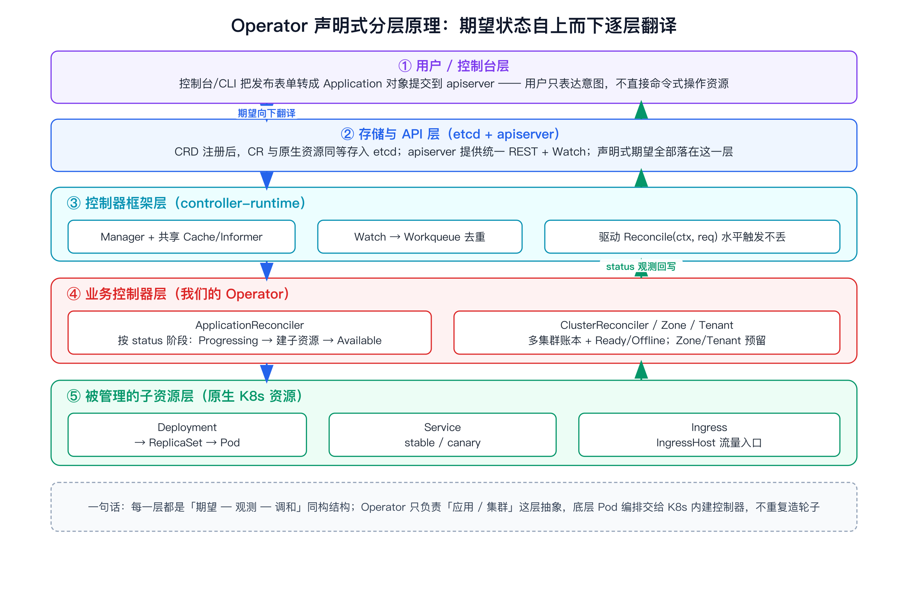
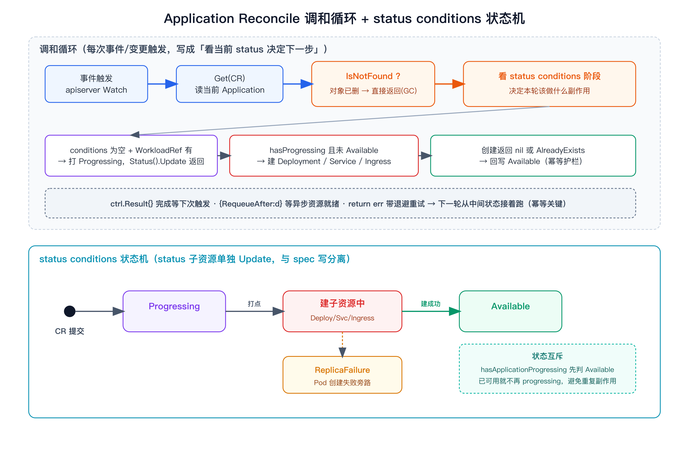
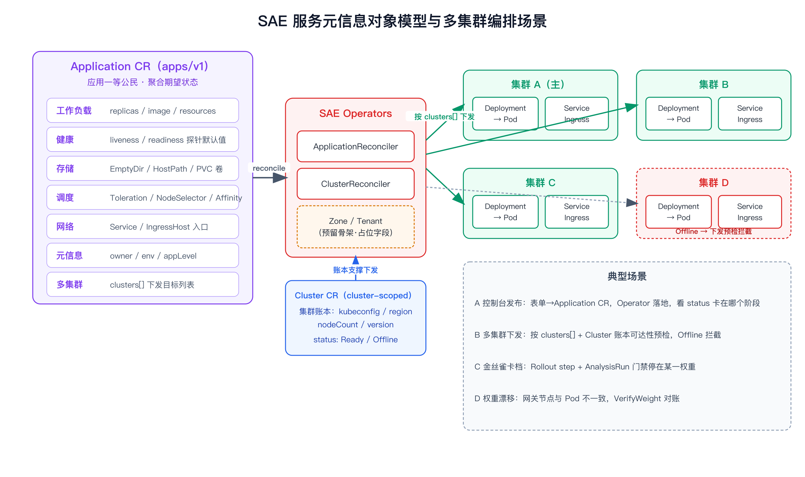
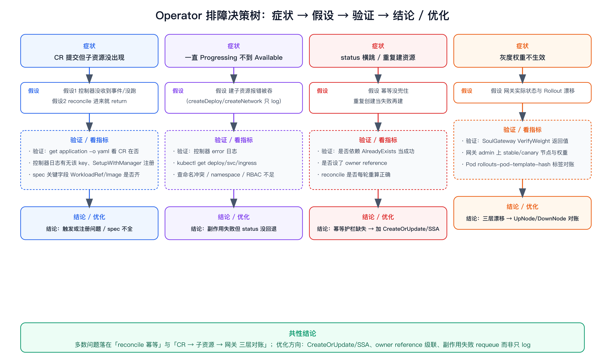
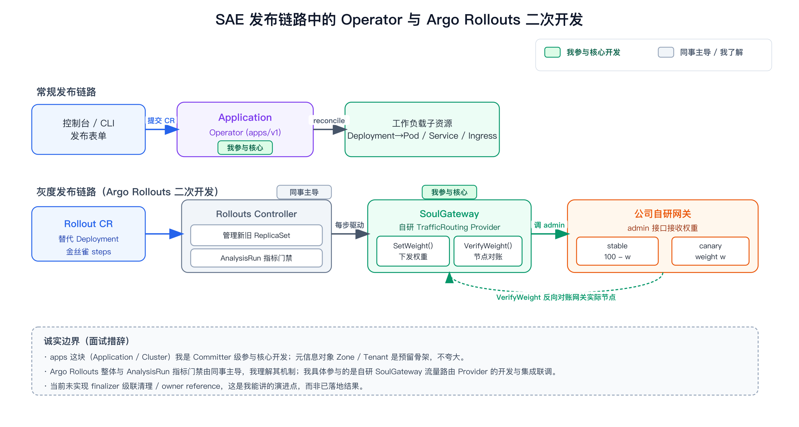

# SAE 平台 K8s Operator 与 CR 控制面 面试准备

> 这是 SAE Operator 主线文档，聚焦 **CR 控制面本体**（Application Operator + 元信息对象 + controller-runtime 落地）。Argo Rollouts 二次开发那条线（自研 SoulGateway 流量路由 Provider）单独成文，见 [argo-rollouts-soulgateway.md](./argo-rollouts-soulgateway.md)，两篇配合讲「声明式控制面 + 渐进式发布」完整链路。

# 面试定位卡

- **技术点**：SAE 发布平台的 Kubernetes 控制面——以应用抽象对象 `Application` Operator 为核心，配套集群/可用区/租户等服务元信息对象（`Cluster` / `Zone` / `Tenant`），用 controller-runtime/kubebuilder 自研一组 CRD + Controller，把「一个应用该长什么样、发到哪些集群」编码成声明式 API + 调和循环。
- **所属领域**：云原生 / K8s 控制器 / 持续发布 / 平台工程。
- **面试价值**：能体现「声明式 API + 控制循环」的真实落地深度——CRD 数据模型设计、reconcile 状态驱动与幂等、status conditions 状态机、子资源翻译（Deployment/Service/Ingress + 三类卷 + 调度）、OpenKruise/EDAS 注册中心复用这种「平台编排」细节，而不是只会 kubectl apply。
- **常见考法**：Operator 和普通 controller 的区别 / CRD 字段怎么设计 / reconcile 幂等怎么保证 / status subresource 为什么单独写 / finalizer 和 owner reference 用在哪 / 为什么不用 Deployment 直接发 / 多集群账本怎么建模 / controller-runtime 帮你做了什么 / ctrl.Result 三种返回值的语义。
- **适合挂钩项目**：SAE 持续发布平台（应用编排 + 多集群 + 灰度发布）。
- **不适合夸大的地方**：`Zone` / `Tenant` 在代码里是预留骨架（占位字段为主），讲成「建模方向」而不是「做深了多租户」；当前 Application 控制器的删除分支是 TODO、子资源未设 owner reference——这些要当成「我清楚的已知技术债与演进点」来讲，反而显深度，别说成已实现。

# 三十秒回答

SAE 是我们的应用发布平台，控制面用 Operator 模式把「一个应用该长什么样」抽象成 `Application` CRD：用户/控制台提交一个对象，描述副本、镜像、探针、三类卷（EmptyDir/HostPath/PVC）、调度（Toleration/NodeSelector/Affinity）、网络入口、下发的目标集群。我深度参与的 Application Controller 在 reconcile 里按 status 当前阶段把它翻译成底层 Deployment、Service、canary Service、Ingress，并通过 status conditions（Progressing/Available/ReplicaFailure/EDASScaled）做状态机回写进度。围绕它有一组服务元信息对象：`Cluster` 是 cluster-scoped 的多集群账本（kubeconfig/region/nodeCount/Ready-Offline），`Zone`/`Tenant` 是预留的可用区/租户建模。底座是 controller-runtime——共享 informer/cache、workqueue 去重、status subresource 分离写。代价是这套抽象比直接用 Deployment 多一层，要自己保证 reconcile 幂等、status 一致性，排查时在 CR → 子资源 → 网关三层之间对账。

# 为什么需要它

- **没有它之前的问题**：直接用原生 Deployment/Service/Ingress 发布，每个应用要拼一大堆 YAML，平台没有「应用」这个一等公民——没法统一挂 owner/env/appLevel 这些业务元信息，没法把探针、资源、调度的默认值收敛到一处，发布策略和灰度也无处承载；多集群更是每个集群各搞一套，没有统一账本。
- **它的解决方式**：用声明式 CRD 把「应用」建模成一个对象，平台只写期望状态，Controller 持续 reconcile 让实际状态向期望收敛；元信息对象（Cluster/Zone/Tenant）把「平台自己的资源账本」也变成声明式对象，复用 K8s 的 etcd 存储、list-watch、RBAC、一致性。
- **它引入的新问题**：多了一层抽象和一个常驻控制器进程；reconcile 必须幂等（同一个 CR 会被反复调和）；status 要自己维护成状态机，否则反复建子资源或卡住；CR 和底层子资源之间会漂移，排查链路变长（CR → Deployment/Service/Ingress → 网关）。
- **必须关注的场景**：reconcile 重复执行导致重复创建、status condition 不收敛导致一直 Progressing、跨集群下发到 Offline 集群、灰度时网关权重和实际 Pod 不一致。

# 核心概念表

- **CRD（CustomResourceDefinition）**：向 apiserver 注册一种新资源类型（如 `applications.apps.sae`）。展开点：注册后用 kubectl/client-go 像原生资源一样 CRUD，自动获得 etcd 存储、list-watch、RBAC；我们的类型用 kubebuilder 注解（`+kubebuilder:object:root=true`、`+kubebuilder:subresource:status`、`+genclient`）+ `controller-gen` 生成 deepcopy 和 CRD yaml。
- **CR（Custom Resource）**：CRD 的一个实例，比如某个具体 `Application`。展开点：spec 是期望状态（用户写），status 是观测状态（控制器写），二者分离是声明式 API 的核心。
- **Controller / Reconciler**：监听某类资源变化，跑调和循环把实际状态拉向期望。展开点：我们用 controller-runtime，`SetupWithManager` 里 `For(&Application{})` 注册，核心是 `Reconcile(ctx, req)`。
- **Operator**：CRD + 专用 Controller，把某个领域的运维知识（怎么发布一个应用、怎么管一个集群）编码进控制器。展开点：Operator = 把人肉运维 SOP 写成代码并自愈。
- **controller-runtime / kubebuilder**：构建 Operator 的标准框架/脚手架。展开点：提供 Manager、Client（带 cache 的读 + 直写的写）、共享 informer Cache、workqueue、EventRecorder，屏蔽 informer/workqueue 细节。
- **status subresource + conditions**：状态子资源，独立于 spec 更新。展开点：用 conditions 数组（Available/Progressing/ReplicaFailure/EDASApplicationScaled）做状态机，`r.Status().Update()` 单独回写，避免和 spec 写冲突。
- **owner reference / finalizer**：级联 GC 与删除前清理钩子。展开点：owner reference 让删 CR 时子资源被 GC 自动回收；finalizer 在删除前拦一道做外部清理（先摘流量再删）。诚实点：当前实现这两者还没接，是明确的演进项。
- **OpenKruise**：增强版工作负载控制器（Advanced StatefulSet/CloneSet 等）。展开点：`SetupWithManager` 里我们额外起了一个 OpenKruise manager，用来承接原生 Deployment 不够用的发布/原地升级能力。

# 原理模型

自底向上理解这套控制面：

- **存储与 API 层（etcd + apiserver）**：CRD 注册后，CR 和原生资源一样落 etcd，apiserver 提供统一 REST + watch。声明式的本质是：所有期望状态都落这一层，控制器只读写对象，不直接命令式操作底层。
- **控制器框架层（controller-runtime）**：Manager 启动一组共享 informer/cache，对关心的资源建 list-watch；资源变化进 workqueue，按 namespace/name 这个 key 去重后驱动 `Reconcile`。这一层保证「最终一致 + 水平触发」——不靠事件不丢，靠变更/重算收敛。读走 cache（informer 本地缓存），写直达 apiserver。
- **业务控制器层（我们的 Operator）**：`ApplicationReconciler` 拿到一个 Application，按 status 当前阶段决定动作：进来无 conditions 先打 Progressing → 看到 Progressing 且未 Available 时建 Deployment/Service/Ingress → 建成功打 Available。`Cluster` 控制器维护多集群账本与 Ready/Offline。`SetupWithManager` 启动时还顺带拉起 SyncManager（外部系统同步）和 OpenKruise manager。
- **被管理的子资源层**：最终落到原生 Deployment / Service / Ingress，再由 K8s 内建控制器（Deployment→ReplicaSet→Pod）继续调和。Operator 只负责「应用」这层抽象，不重复造轮子。

一句话：用户只对最上层「应用对象」表达意图，意图通过控制循环一层层向下翻译成真实资源，每一层都是「期望-观测-调和」的同构结构。

# 关键机制

## Reconcile 状态驱动循环

解决的问题：把「一个 Application 应该对应哪些底层资源」变成可重复、可自愈的过程。

工作方式：`Reconcile` 先 `Get` 当前 CR，`IsNotFound` 直接返回（对象已删，交给 GC）；否则按 status 判断阶段——

1. `WorkloadRef != nil && Status.Conditions == nil`：第一次进来，打 `Progressing` 并 `Status().Update` 后 return，让下一轮接着跑；
2. 下一轮 `hasApplicationProgressing(app) == true && WorkloadRef != nil`：调 `createSaeDeployment`（带探针默认值、三类卷、调度字段），有 `IngressHost` 再调 `createNetwork` 建 Service + canary Service + Ingress；
3. 子资源创建成功后立刻在 `createSaeDeployment` 里回写 `Available`。

代价：状态拆成多轮、靠 status 驱动，逻辑必须写成「看当前状态决定下一步」而不是顺序脚本，否则不幂等。

面试追问：为什么不一轮做完？——reconcile 可能在任意阶段被重新触发（控制器重启、CR 被改、informer resync），必须每一步都能从中间状态接着跑；分阶段 + status 落点就是把「进行到哪了」持久化到 etcd，而不是放在内存里。

## Status conditions 状态机与去重写入

解决的问题：让控制器和外部（控制台/其他控制器）都知道应用当前阶段，且重复 reconcile 不重复执行副作用。

工作方式：用 conditions 数组承载 `Progressing / Available / ReplicaFailure / EDASApplicationScaled`。关键在两个函数：

- `hasApplicationProgressing` 先扫一遍——只要已经有 `Available` condition 就直接返回 false，实现「已可用就不再 progressing」的状态互斥；
- `SetApplicationCondition` 是带去重的写入：同 type 且 status+reason 都没变就不写；status 没变只更 message 时保留原 `LastTransitionTime`，只有真正状态翻转才更新转换时间——这让 conditions 的时间戳语义干净，也避免无意义的 status 写放大。

代价：condition 语义要自己设计清楚，否则会出现「既不是 progressing 也不是 available」的状态空洞。

面试追问：怎么保证 status 更新不和 spec 打架？——用 `+kubebuilder:subresource:status` 开 status 子资源，`r.Status().Update()` 走独立写路径，和 spec 的写互不覆盖；apiserver 层面 spec 和 status 是两个 endpoint。

## 子资源翻译：从 Application 到 Deployment/Service/Ingress

解决的问题：把一个高层「应用对象」确定性地展开成底层一组原生资源，并把平台默认值收敛进来。

工作方式（`createSaeDeployment` / `createNetwork` 的真实细节）：

- **探针默认值收敛**：spec 没给 `LivenessProbe` 就注入默认 HTTPGet `/health_check:8080`（InitialDelay 40s / Period 20s / Failure 3 / Timeout 5s）；没给 `ReadinessProbe` 就注入默认 TCPSocket:8080。平台把「健康检查长什么样」这种最容易写错的东西兜底掉。
- **三类卷统一翻译**：`EmptyDir`→emptyDir 卷、`LocalVolume`→HostPath（只读）、`PVCVolume`→PVC 引用，分别按序号命名 `emptydirvol-i / localvol-i / pvcvol-i` 挂进容器。
- **调度三件套透传**：`Tolerations / NodeSelector / Affinity` 有就塞进 PodSpec。
- **selector 与 labels 一致性**：Arena 模式下用 `spec.Selector.MatchLabels` 时，同时覆盖 matchLabels 和 template labels，规避 `selector does not match template labels` 报错。
- **网络层为灰度预留**：`createNetwork` 一次建两个 Service——`name`（stable）和 `name-canary`，再建 Ingress。这正是给下游 Argo Rollouts 的金丝雀切流准备的稳定/灰度两个入口（详见 SoulGateway 文档）。

代价：翻译逻辑是命令式硬编码（一段段 if），spec 加字段就要改翻译；目前是 `Create`（首次创建）语义，spec 改了不会自动 patch 已存在子资源——见「边界」。

面试追问：默认值放在哪一层最合适？——放在 Operator 翻译这层，比放在控制台或每个业务 YAML 里更收敛，且能随平台演进统一升级。

## 幂等与重复创建防护

解决的问题：同一个 Application 会被反复调和，不能每次都新建 Deployment。

工作方式：创建子资源时把 `apierrors.IsAlreadyExists` 当成功路径（`err == nil || IsAlreadyExists` 都回写 Available）；用固定命名（`WorkloadRef.Name`）让重复创建命中 AlreadyExists 而不是产生副本；status 侧用 `SetApplicationCondition` 去重避免反复写。

代价：这是「乐观幂等」——能防重复创建，但防不了配置漂移（spec 改了、已存在的 Deployment 不会被更新）。

面试追问：更稳的做法是什么？——`controllerutil.CreateOrUpdate` 或 Server-Side Apply（SSA），把「期望子资源」声明出来让框架算 diff 并 patch，幂等性从「创建去重」升级到「持续收敛」。这是我能讲清的演进方向。

## 服务元信息对象（Cluster / Zone / Tenant）

解决的问题：把平台自身的资源账本也声明式化。

工作方式：`Cluster` 是 **cluster-scoped**（`+genclient:nonNamespaced`）对象，spec 存 kubeconfig、clusterType、nodeCount、region、version，status 用 Ready/Offline conditions 表达可达性，作为多集群下发的注册表；Application 的 spec 里有 `Clusters []*AppCluster`（cluster_name / is_main / app_id）指定下发目标。`Zone`/`Tenant` 目前是预留骨架（占位字段），表达可用区/租户的建模方向。

代价：元信息对象多了要管好生命周期与一致性；当前 `ClusterReconciler.Reconcile` 还是空实现（账本主要靠外部写入 + 控制台消费），这是真实状态，别说成「控制器自动探活」。

面试追问：为什么不用配置中心存集群信息？——用 CRD 能复用 K8s 的 watch/RBAC/一致性，下游控制器能直接 list-watch 集群变化，账本和工作负载在同一套 API 模型里，权限和审计也统一。

## 平台编排：OpenKruise 接入与 EDAS 注册中心复用

解决的问题：原生 Deployment 不够用（要原地升级/灰度增强），以及历史上要复用 EDAS 注册中心做平滑迁移。

工作方式：`SetupWithManager` 启动时除了注册 Application 控制器，还 `Run` 了一个 `openkruise.NewOpenkruiseManager` 和一个 `SyncManager`。EDAS 那条线（代码里以 `edasApplicationHandler / edasScaleHandler / syncEdasDeployment` 形式存在）的设计是：调外部 EDAS OpenAPI `GetOrCreate` 应用、把 EDAS 侧 Deployment 同步回 SAE 集群、再把 EDAS 实例缩到 0，用 `RequeueAfter`（创建后 5s、缩容等待 120s）处理「外部异步资源还没就绪」的等待。

代价：跨外部系统编排引入了 panic 兜底（`recover`）、异步等待、双写一致性这些复杂度；这块当前在主干是注释/灰度态，讲的时候要说清是「为复用注册中心做的迁移编排设计」，不是常态主链路。

面试追问：`RequeueAfter` 在这里解决什么？——外部系统创建是异步的，立刻读会拿不到，用 `RequeueAfter` 让控制器过几秒带退避重试，而不是阻塞 reconcile 或者忙等。

# 横向对比

- **Operator vs 普通 Controller**：普通 controller 也跑调和循环，但 Operator 特指「自定义 CRD + 把领域运维知识编码进控制器」。注意点：别把「写了个 watch Pod 的程序」叫 Operator。
- **Application CRD vs 直接用 Deployment**：Deployment 只描述工作负载；Application 是更高层抽象，一个对象聚合工作负载 + 网络 + 元信息 + 多集群 + 发布语义。什么时候用：平台要统一治理「应用」这个概念时。注意点：抽象层不是免费的，要自己维护翻译和 status。
- **status subresource vs 把状态塞 spec/annotation**：status 子资源有独立写路径和 RBAC，避免和 spec 互相覆盖；塞 annotation 会和用户/其他控制器抢写。注意点：面试常问「status 和 spec 谁写」——spec 用户写、status 控制器写。
- **乐观幂等（AlreadyExists 当成功）vs CreateOrUpdate/SSA**：前者只防重复创建，后者持续收敛配置漂移。注意点：要诚实说现状是前者，后者是演进方向。
- **Create 语义 vs 声明式 reconcile**：当前子资源是首次 Create，spec 改了不自动 patch；理想是每轮算 desired 与 observed 的 diff。注意点：这是「半声明式」的真实取舍。
- **CRD 做集群账本 vs 配置中心**：CRD 复用 K8s list-watch/RBAC/一致性，配置中心要自己做 watch 和权限。注意点：账本和工作负载同模型是关键收益。
- **controller-runtime Cache 读 vs 直接 apiserver 读**：默认 Client 读走 informer 本地 cache（低延迟、可能短暂 stale），写直达 apiserver。注意点：刚写完立刻用 cache 读可能读到旧值，强一致读要用 APIReader。

# 典型业务场景

- **场景 A：控制台发布一个应用**。为什么相关：控制台把表单转成 Application CR 提交，Operator 负责落地。可能现象：CR 建了但 Pod 没起。排查方式：看 Application status conditions 停在哪个阶段、控制器日志、子资源是否创建。优化方向：把默认探针、资源、调度策略收敛到 Operator 默认值（已做探针默认值）。
- **场景 B：多集群下发**。为什么相关：`Cluster` 对象是集群账本，Application.spec.clusters 指定目标。可能现象：某集群 Offline 导致下发失败。排查方式：看对应 Cluster 的 Ready/Offline condition、kubeconfig 可达性。优化方向：下发前用 Cluster status 做可达性预检（当前 ClusterReconciler 为空，是演进点）。
- **场景 C：改了 spec 但 Pod 没变**。为什么相关：当前子资源是 Create 语义，已存在不 patch。可能现象：改了镜像/资源，Deployment 没动。排查方式：对比 Application.spec 和实际 Deployment、看控制器是不是命中 AlreadyExists 直接当成功。优化方向：引入 CreateOrUpdate/SSA。
- **场景 D：金丝雀发布卡在某一档权重**。为什么相关：下游 Rollouts 按步进切权重，依赖 stable/canary 两个 Service 和 Ingress（由本 Operator 建）。可能现象：停在 10% 不前进。排查方式：先确认 canary Service 选中的 Pod 对、再看 Rollout step 与 SoulGateway VerifyWeight（详见 Rollouts 文档）。优化方向：核对网关实际节点与 Pod 的 pod-template-hash。

# 排障路径

按「症状 → 假设 → 验证 → 指标 → 结论 → 优化 → 复测」走：

- **症状：提交了 CR 但底层资源没出现**。
  - 假设1：控制器没收到事件 / 没在跑。验证：`kubectl get application -o yaml` 看 CR 在不在、控制器 Pod 日志有没有这个 key、`SetupWithManager` 是否注册了该类型。重点看：reconcile 有没有被触发。
  - 假设2：reconcile 进来但提前 return。验证：看 status conditions——`WorkloadRef` 为空时控制器第一段就不会进创建分支。重点看：spec 关键字段（WorkloadRef/Image）是否齐。
- **症状：一直 Progressing 不到 Available**。假设：建子资源报错被吞。验证：看控制器 error 日志（`createSaeDeployment`/`createNetwork` 的 error 是 log 出来、不 requeue 的）、`kubectl get deploy/svc/ingress`。重点看：是不是命名冲突、namespace 不对、RBAC 不足。异常说明：副作用失败但 status 没回退，这是当前实现的坑。
- **症状：status 反复横跳或重复建资源**。假设：幂等没兜住。验证：看是否依赖 `IsAlreadyExists` 当成功、`SetApplicationCondition` 去重是否生效、有没有 owner reference。重点看：reconcile 是不是把「已存在」当失败再建。
- **症状：改了 spec 不生效**。假设：Create 语义不 patch。验证：diff Application.spec vs 实际 Deployment。重点看：是不是命中 AlreadyExists 路径。结论：需要 CreateOrUpdate/SSA。
- **症状：删了 CR 子资源还在**。假设：没设 owner reference、删除分支是 TODO。验证：`kubectl get deploy` 看孤儿资源。重点看：ownerReferences 字段为空。结论：加 owner reference 做级联 GC、加 finalizer 做删前清理。
- **结论与优化**：多数问题落在「reconcile 幂等/收敛」和「CR↔子资源↔网关三层对账」。优化：引入 CreateOrUpdate/SSA、给子资源加 owner reference、副作用失败时 requeue 而不是只 log。复测：改完重新提交 CR，观察 status 能否单调走到 Available 且改 spec 能收敛。

# 风险、边界和误区

- **说法：「SAE 整套控制面都是我一个人写的」**。问题：会被一问就穿，Rollouts 二开、servicemesh/gateway 各有同事。更稳妥：「Application 这条控制面我深度参与/主导核心实现，元信息对象我参与建模，Rollouts 二开里我深度参与自研流量路由 Provider」（措辞按你真实参与度，深参可以说主导这块）。
- **说法：「Zone/Tenant 我做了完整多租户隔离」**。问题：代码里这俩是只有占位字段的预留骨架，ClusterReconciler 也是空实现。更稳妥：「Zone/Tenant 是预留的可用区/租户建模方向，当前承载主要在 Cluster 和 Application 上；多租户是规划项」。
- **做法：「我用了 finalizer + owner reference 做级联清理」**。问题：当前删除分支是 TODO、子资源没设 owner reference。更稳妥：把它讲成「我清楚更稳的做法是 owner reference 级联 GC + finalizer 删前清理，这是我们已知的技术债与演进点」——作为深度参与者，能讲清自己系统的缺口比假装完美更可信。
- **做法：「子资源用声明式持续收敛」**。问题：当前是 Create 语义、乐观幂等。更稳妥：诚实说现状是「创建去重式幂等」，演进到 CreateOrUpdate/SSA。
- **说法：「EDAS 同步是常态主链路」**。问题：那段在主干是注释/灰度态的迁移编排。更稳妥：讲成「为复用 EDAS 注册中心做的应用同步/缩容编排设计，体现跨外部系统的异步 RequeueAfter 编排」。
- **边界**：不编造灰度成功率、发布时长、集群规模这类生产指标；可以讲机制、数据模型和排查思路，不报没核实过的数字。

# 和项目的安全连接

## 了解型说法

我了解 SAE 用 Operator 模式把应用、集群、可用区、租户都建模成声明式 CRD，理解每个对象的 spec/status 设计意图、为什么用 CRD 而不是配置中心来存这些元信息，以及 controller-runtime 在底下帮我们做了 informer/cache/workqueue 哪些事。

## 排查型说法

应用发不出去时，我按 CR status conditions → 控制器日志 → 子资源（Deployment/Service/Ingress）→ 网关三层对账定位；改 spec 不生效我会去看是不是 Create 语义命中 AlreadyExists；删 CR 残留我会去看 owner reference 缺失。

## 实践型说法

我深度参与 Application Controller：reconcile 状态驱动循环、status conditions 状态机与去重写入（SetApplicationCondition）、子资源翻译（探针默认值收敛、EmptyDir/HostPath/PVC 三类卷、Toleration/NodeSelector/Affinity 调度、stable+canary 双 Service 为灰度预留）、乐观幂等防护，以及 SetupWithManager 里 OpenKruise/SyncManager 的接入和 EDAS 注册中心复用的异步编排设计。

## 不能说的话

不能说 Zone/Tenant 做了完整多租户；不能说已用 finalizer/owner reference 做级联清理（演进项）；不能说子资源是声明式持续收敛（现状是 Create 乐观幂等）；不能说 ClusterReconciler 自动探活（现状空实现）；不报没核实的发布指标。

# 高频 Q&A

## Operator 和普通 Controller 有什么区别

Controller 是任何跑调和循环、让实际状态向期望状态收敛的程序；Operator 特指「自定义 CRD + 把某个领域的运维知识编码进专用 Controller」。我们的 Application Operator 就是把「怎么发布并维护一个应用」这套运维知识写进控制器，用户只声明期望，控制器负责落地和自愈。

## Application 的 CRD 怎么设计的，spec 里放了什么

spec 聚合一个应用的完整描述：Replicas、Image、Env/Owner/AppLevel 等元信息、Resources、Liveness/Readiness 探针、PostStart/PreStop 钩子、EmptyDir/LocalVolume(HostPath)/PVCVolume 三类卷、Tolerations/NodeSelector/Affinity 调度、Service 和 IngressHost 网络入口、WorkloadRef（指向底层工作负载的引用）、Clusters 多集群列表。设计原则是「一个应用对象聚合工作负载+网络+元信息+发布语义」，把原本散在多个原生 YAML 里的东西收敛到一个一等公民对象上。status 用 conditions 数组做状态机。

## reconcile 怎么保证幂等

核心是写成「看当前 status 决定下一步」而不是顺序脚本：进来先 Get，NotFound 直接返回；按 conditions 判断阶段，副作用只在特定状态组合下触发；创建子资源时把 AlreadyExists 当成功路径，用固定命名让重复创建命中已存在而不产生副本；`SetApplicationCondition` 对 status 写做去重；建成功立刻回写 Available 作为幂等护栏。我也清楚现在是「乐观幂等」，只防重复创建不防配置漂移，更稳的是 CreateOrUpdate / Server-Side Apply。

## status 是怎么维护的，为什么用 conditions

用 status subresource 单独更新，和 spec 写路径分离避免互相覆盖。status 里用 conditions 数组（Available/Progressing/ReplicaFailure/EDASApplicationScaled）做状态机，`hasApplicationProgressing` 先看是否已 Available 实现状态互斥，`SetApplicationCondition` 做去重并保留未翻转时的 LastTransitionTime。conditions 模式的好处是可扩展、每个维度独立表达，外部观察者能知道应用当前阶段。

## finalizer 和 owner reference 是干什么的，你们用了吗

owner reference 做级联 GC——子资源 owner 指向 CR，删 CR 时子资源自动回收；finalizer 在对象删除前做清理（先摘流量、清外部资源再放行删除）。要诚实说：当前 Application 控制器删除分支还是 TODO，子资源也没设 owner reference，这是我清楚的演进点——加 owner reference 做级联、加 finalizer 做删前清理。能讲清自己系统的缺口，本身就是深度参与的体现。

## 为什么不直接用 Deployment 发布，非要套一层 Operator

Deployment 只描述工作负载，平台缺一个「应用」一等公民来统一挂业务元信息（owner/env/appLevel）、收敛默认值、统一多集群和发布策略。套一层 Operator 后，控制台只产出一个 Application 对象，治理、灰度（stable/canary 双 Service）、多集群都围绕它做。代价是多一层抽象和一个常驻控制器，要自己保证幂等和 status 一致性——这是有意识的取舍。

## 多集群是怎么管的

用 cluster-scoped 的 `Cluster` CRD 做集群账本，spec 存 kubeconfig、region、clusterType、nodeCount、version，status 用 Ready/Offline conditions 表达可达性；Application.spec.clusters（AppCluster：cluster_name/is_main/app_id）指定下发目标。用 CRD 而不是配置中心，是为了复用 K8s 的 list-watch、RBAC 和一致性。要补一句：当前 ClusterReconciler 是空实现，账本主要靠外部写入 + 控制台消费，自动探活是演进项。

## controller-runtime 帮你做了哪些事

它提供 Manager（统一启动控制器和共享 cache）、基于 informer 的 list-watch 和本地 cache、workqueue 去重与退避重试、Client（带 cache 的读、直写的写）、EventRecorder。我只要在 `SetupWithManager` 里 `For(&Application{})` 注册关心的类型并实现 `Reconcile`，informer/workqueue 这些细节被框架屏蔽。要注意默认读走 cache 可能短暂 stale，强一致读要用 APIReader。

## reconcile 返回值 ctrl.Result 怎么用

返回 `{}` + nil 表示这轮调和完成、等下次事件触发；返回 `{RequeueAfter: d}` 让控制器在 d 之后重试（比如等外部异步资源就绪）；返回 error 触发带退避的重试。我们 EDAS 同步那段就用 `RequeueAfter`（创建后 5s、缩容等待 120s）来等异步创建完成。一个常见坑是副作用失败时只 log 不 requeue，会导致 status 卡住——这是我会改进的点。

## 子资源的默认值（探针、卷、调度）为什么放在 Operator 里

因为 Operator 翻译这层是「应用」的唯一收敛点：spec 没给探针就注入默认 HTTPGet /health_check:8080（liveness）和 TCPSocket:8080（readiness），三类卷按序号命名挂载，调度三件套透传。放这里比放控制台或每个业务 YAML 更统一，平台升级默认值时所有应用一起受益，也避免业务写错健康检查导致发布翻车。

## 你们的幂等现在有什么坑，怎么演进

现状是「乐观幂等」：靠固定命名 + AlreadyExists 当成功来防重复创建，但 spec 改了不会 patch 已存在的子资源（Create 语义）、删 CR 不级联 GC（无 owner reference）、副作用失败只 log 不 requeue。演进三步：① 子资源改 CreateOrUpdate/SSA 做持续收敛；② 加 owner reference + finalizer 做生命周期；③ 副作用失败走 requeue 让 status 能回退重试。

## OpenKruise 在这套里扮演什么角色

`SetupWithManager` 启动时我们额外拉起一个 OpenKruise manager。原生 Deployment 在原地升级、灰度增强、分批发布这些能力上不够用，OpenKruise 的 CloneSet/Advanced StatefulSet 等增强工作负载补这块。Application 翻译出的工作负载可以走原生 Deployment，也可以接 OpenKruise 增强类型，控制面是统一的。

# 三档背诵版

**30 秒**：SAE 控制面用 Operator 把应用抽象成 `Application` CRD，我深度参与的控制器在 reconcile 里按 status 阶段把它翻译成 Deployment/Service/canary Service/Ingress 并维护 conditions 状态机；配套有 cluster-scoped 的 Cluster 多集群账本和 Zone/Tenant 预留模型；底座是 controller-runtime（共享 informer/cache、workqueue、status 子资源）。

**3 分钟**：在 30 秒上补背景和机制——没有 Operator 之前发布全靠拼原生 YAML、平台没有「应用」一等公民；引入 CRD 后用户只声明期望，控制器持续 reconcile 收敛。讲 reconcile 分阶段：Progressing 打点 → 建子资源（探针默认值收敛、三类卷、调度三件套、stable+canary 双 Service 为灰度预留）→ Available。讲 status subresource + conditions 状态机和去重写入（SetApplicationCondition）、乐观幂等护栏（AlreadyExists 当成功）。讲 Cluster 是 cluster-scoped 集群注册表。排障按 CR status → 控制器日志 → 子资源 → 网关三层对账。

**5 分钟**：再补对比、限制和项目连接——对比 Operator vs 普通 controller、Application vs Deployment、status vs spec、乐观幂等 vs CreateOrUpdate/SSA、CRD 账本 vs 配置中心；诚实讲边界：Zone/Tenant 预留骨架、ClusterReconciler 空实现、未用 finalizer/owner reference、子资源 Create 语义不收敛漂移——这些都作为「我清楚的技术债与演进路线」来讲；展开 OpenKruise 接入和 EDAS 注册中心复用的异步 RequeueAfter 编排；最后落到我能讲清数据模型、reconcile 取舍、三层排障和演进方向，这是深度参与的体现。下游灰发那条线接 [Argo Rollouts SoulGateway 文档](./argo-rollouts-soulgateway.md)。

# 图示清单

- `00_operator_overview_mindmap.png` — 全文总览 XMind。
- `01_operator_principle.png` — Operator 声明式分层原理（etcd/apiserver → controller-runtime → 业务控制器 → 子资源）。
- `02_operator_mechanism.png` — Application reconcile 状态驱动循环 + status conditions 状态机。
- `03_operator_scenario.png` — SAE 应用编排与多集群/元信息对象模型。
- `04_operator_troubleshooting.png` — Operator 排障决策树。
- `05_operator_project_connection.png` — SAE 发布链路里 Operator 与 Argo Rollouts 二次开发的位置。

# 面试前检查清单

- [ ] 能 30 秒讲清 Operator 是什么、SAE 为什么用它。
- [ ] 能解释为什么不直接用 Deployment（应用一等公民 + 元信息 + 默认值收敛 + 灰度预留）。
- [ ] 能讲 ≥3 个核心机制：reconcile 状态驱动、status conditions 状态机与去重、子资源翻译、乐观幂等。
- [ ] 能讲清和相邻概念区别：Operator vs controller、Application vs Deployment、status vs spec、乐观幂等 vs SSA。
- [ ] 能讲 ≥3 个典型场景：控制台发布、多集群下发、改 spec 不生效、灰度卡档。
- [ ] 能按「症状→假设→验证→优化」讲三层对账排障。
- [ ] 知道哪些是已知技术债/演进点：Zone/Tenant 预留、ClusterReconciler 空、finalizer/owner reference 未做、Create 语义不收敛——能当深度而不是当短板讲。
- [ ] 能安全连接项目（了解型/排查型/实践型分档措辞）。
- [ ] 文档含原理图 + 机制图 + 排障图，且能接续到 Rollouts SoulGateway 文档。
