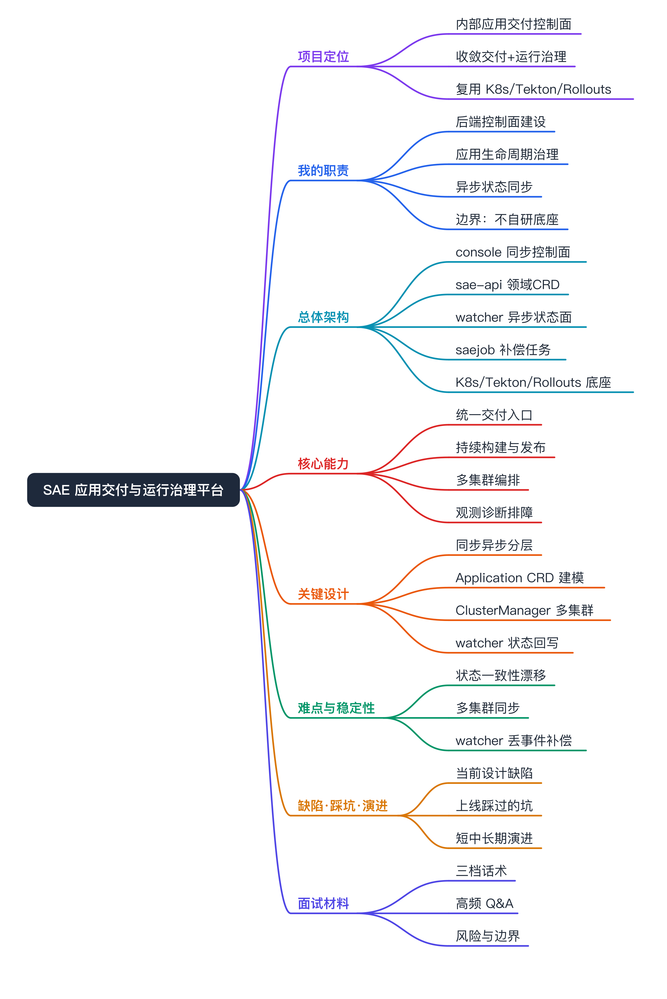
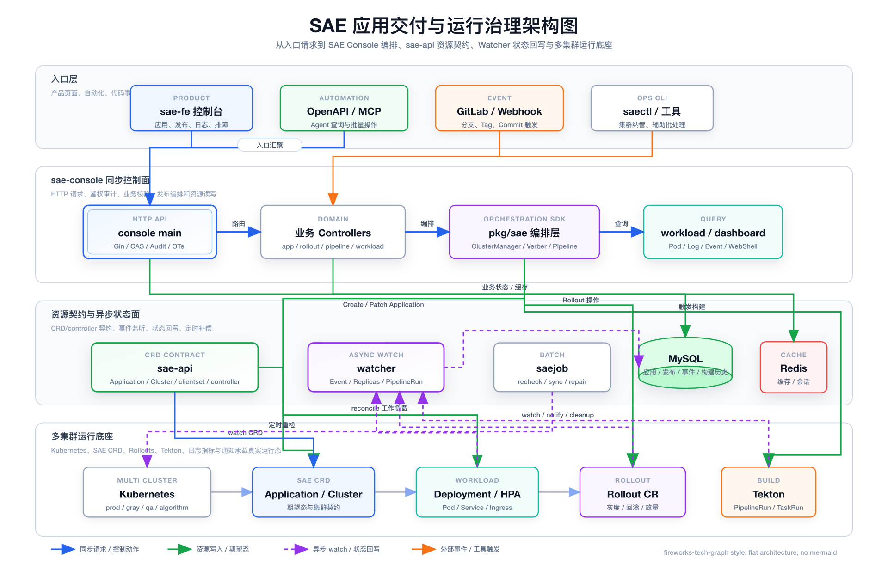
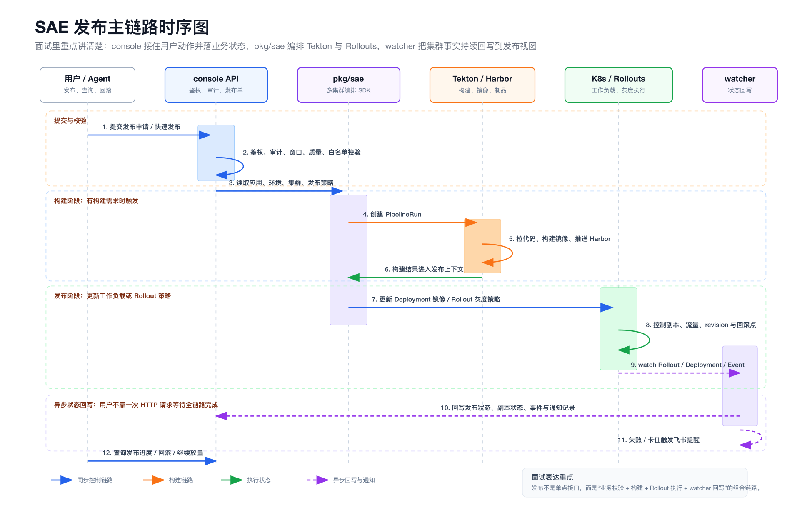
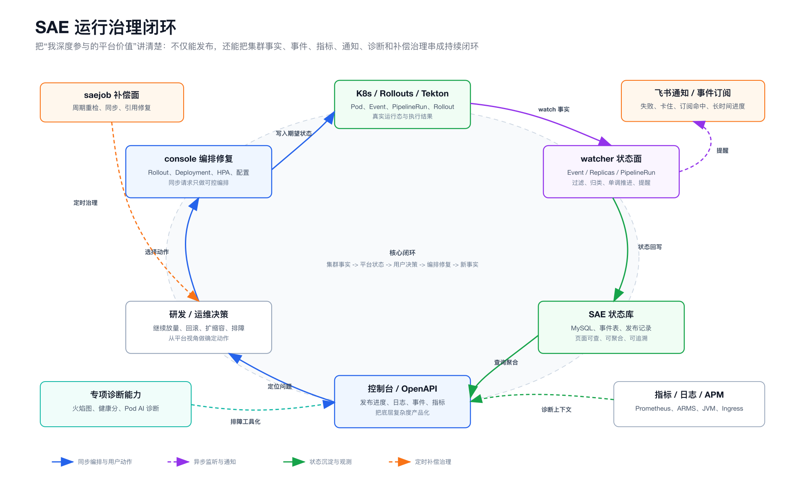

# SAE 应用交付与运行治理平台 面试准备

说明：本文按 interview-doc 的 project 模式组织，目标是面试表达材料，不是源码导览。已有架构图和关键代码锚点保留，源码级细节放在「关键设计」「技术难点」用于追问展开。

面试主线不要从路由表、controller 文件、CRD 字段开始。先讲 SAE 是什么平台、解决什么交付与运行治理问题、为什么要拆成同步控制面和异步状态面，再按追问进入 console、sae-api、watcher、job 和具体代码锚点。

# 项目定位

- 项目名称：SAE（Soul Application Engine）
- 所属领域：云原生平台工程 / 应用交付（CICD）/ 运行治理
- 项目类型：公司内部应用交付与运行治理控制面
- 核心目标：把应用创建、构建、发布、回滚、扩缩容、日志、事件、指标、诊断收敛到统一控制面，让研发通过一个平台完成应用交付与线上治理
- 服务对象：公司内部研发与运维团队
- 关键词：控制面、Application CRD、多集群、Tekton、Rollouts、watcher、状态一致性
- 面试价值：能讲清「平台为什么这么拆」「同步控制面 vs 异步状态面」「领域资源建模 vs 纯 MySQL」这些平台工程里的核心取舍，而不是停留在功能罗列

SAE 不是一个简单的 Kubernetes 管理后台，也不只是发布页面。它向下复用 Kubernetes 作为运行底座，复用 Tekton 做持续构建，复用 Argo Rollouts / 内部 Rollouts 能力做持续发布，复用 sae-api 定义 Application、Cluster 等领域资源契约；向上通过 sae-console 提供控制台 API、OpenAPI、MCP / Agent 入口、鉴权、审计和排障能力。它的核心价值不是替代这些基础设施，而是把分散的云原生能力产品化、流程化、标准化。

# 项目背景

在 SAE 之前，研发要完成一次完整交付，需要直接面对一长串异构系统：用 Kubernetes 管工作负载，用 Tekton 跑构建，用 Rollouts 做灰度，用 GitLab / Harbor 管代码和镜像，用 Prometheus、日志和通知系统排障。这些系统各有各的模型和状态，直接暴露给研发会形成多套操作手册，接入和排障成本很高。

随着应用和集群数量增长，几个问题被放大：

- 交付动作分散：发布一个应用要在多个系统之间手工串联，缺乏统一入口、统一权限和统一审计。
- 状态不可补偿：发布、构建、事件、副本状态都在异步变化，如果只靠用户请求实时查询，平台拿不到稳定一致的运行态。
- 底层差异扩散：多集群、多底座的差异如果不收敛，会一路扩散到上层业务代码，每个接口都要重复处理 client 初始化和资源映射。

如果不做平台化，结果就是研发被云原生组件的原生复杂度淹没，线上故障定位回到人工拼系统。SAE 的存在就是把这条长链路收敛成「通过一个平台完成应用交付和运行管理」。

# 项目目标

- 平台化统一入口：用 sae-console 作为统一控制面，把底层资源和外部系统封装成面向应用生命周期的操作语义。
- 应用领域模型标准化：把「应用」从 MySQL 记录上升为可声明、可 watch、可调谐的领域资源，复用 Kubernetes 的 watch / status / RBAC / reconcile 能力。
- 多集群治理：通过 Cluster CRD 和 ClusterManager 维护稳定的多集群访问层，支持应用在主集群与目标集群之间映射与同步。
- 持续构建与发布治理：把 Tekton 构建、Rollouts 灰度封装成研发能稳定使用的发布流程，纳入审批、质量校验、发布窗口、暂停 / 继续 / 回滚等治理动作。
- 状态一致性：通过 console + watcher + saejob 分层治理，保证期望状态、运行态、事件、通知之间最终一致。
- 运行治理与可观测：集成日志、事件、指标、WebShell、Profile、POD 诊断、通知和审计，把「发布平台」升级为「交付与运行治理平台」。

# 我的职责

我的参与级别是 SAE 后端控制面的核心模块建设，不是平台负责人，也不自研底层引擎。措辞上守住「参与 / 负责部分能力」的边界。

- 控制面建设：
  - 具体工作：围绕 sae-console 参与统一 API 控制面建设，承接控制台、OpenAPI、MCP / Agent 等入口，把应用管理、发布、流水线、工作负载、事件、指标、权限、审计和诊断组织成统一后端服务。
  - 面试可展开点：为什么不是「单个页面接口」，而是把研发日常交付动作收敛到一个控制面。
- 应用生命周期治理：
  - 具体工作：通过 sae-console 与 sae-api 的配合，把应用抽象成领域资源，console 处理用户请求和业务规则，sae-api 的 Application controller 把 Application CRD 调谐成 Deployment、Service、Ingress。
  - 面试可展开点：领域资源建模 vs 纯 MySQL 记录的取舍。
- 异步状态同步与补偿：
  - 具体工作：参与 cmd/watcher、K8sWatcher、Event watcher、Replicas watcher、PipelineRun watcher、Rollout notification 等能力，把集群事实同步回数据库、事件中心和通知系统。
  - 面试可展开点：为什么要拆同步控制面和异步状态面。
- 多集群资源编排：
  - 具体工作：通过 Cluster CRD、ClusterManager、typed SAE client、dynamic client、Rollouts client 维护多集群访问和资源编排入口。
  - 面试可展开点：稳定的多集群 client 池 vs 每个接口临时建 client。

## 我不负责的部分

1. 不自研 Kubernetes，底层资源编排仍复用 Kubernetes。
2. 不自研 Tekton，构建执行仍由 Tekton Pipeline / PipelineRun 承接。
3. 不自研 Rollouts 控制器，持续发布底座依赖 Argo Rollouts / 内部 Rollouts 能力。
4. 不把 sae-api 说成面向前端的 HTTP API，它本质是 SAE 领域 CRD、typed client、informer、lister 和 controller 契约。
5. 不把 watcher 说成用户操作入口。console 处理用户要做什么，watcher 处理集群实际发生了什么。

# 总体架构

SAE 的架构拆分核心是：用户动作走 console 同步控制面，应用领域对象由 sae-api 定义和调谐，构建交给 Tekton，发布交给 Rollouts，运行态变化交给 watcher，周期性补偿交给 job，底层资源访问通过 ClusterManager 和 pkg/sae 收敛。这样拆的原因是应用交付链路长、外部系统多、状态变化异步，如果全部塞进一次 HTTP 请求，会导致请求阻塞、状态不可补偿，也会让底层平台差异扩散到上层。

## 架构分层

- 入口层：控制台用户、OpenAPI、MCP / Agent 调用方都进入 sae-console。
- 同步控制面：`cmd/console/main.go` 启动主 API 服务，初始化配置、MySQL、Redis、OpenTelemetry、GitLab client、K8sWatcher、ClusterWatcher、PipelineManager，再由 `cmd/console/routes/routemanager.go` 注册 `/api/v1/*`、`/open/api/v1/*`、`/mcp/v1/*` 等路由。
- 领域资源契约层：sae-api 定义 Application、Cluster、Zone、Tenant 等 CRD，并生成 typed client、informer、lister 和 controller。
- 领域编排层：`sae-console/pkg/sae` 消费 sae-api 和 Kubernetes client，封装应用创建、Rollout、Pipeline、ClusterManager、ResourceVerber、Ingress、Gateway、弹性等能力。
- 异步状态面：`cmd/watcher/main.go` 默认启用 Event watcher 与 Replicas watcher，可通过配置启用 PipelineRun watcher 和 Rollout notification。
- 补偿任务面：`cmd/job/main.go` 启动 saejob，用于周期性、一次性、补偿类任务。
- 底座层：Kubernetes 承载真实工作负载，Tekton 承载构建，Rollouts 承载灰度发布，GitLab / Harbor 承载代码与镜像，MySQL / Redis / 通知 / 指标系统承载控制面状态。

## 架构选型如何服务治理

| 层次 | 主要选型 / 代码锚点 | 面试表达 |
| --- | --- | --- |
| 同步控制面 | `cmd/console/main.go`、`cmd/console/routes/routemanager.go` | 面向用户和自动化入口，负责 API、权限、审计、编排和查询 |
| 领域资源模型 | `sae-api/apis/apps/v1/Application`、`sae-api/apis/core/v1/Cluster` | 把应用和集群变成 Kubernetes 原生可声明、可 watch、可调谐的资源 |
| 领域编排层 | `sae-console/pkg/sae`、ClusterManager、PipelineManager | 统一多集群 client、Pipeline、Rollout、Application 和通用资源访问 |
| 持续构建 | Tekton Pipeline / PipelineRun | 构建执行交给 Tekton，平台负责触发、状态、历史、日志和治理 |
| 持续发布 | Rollouts | 发布执行交给 Rollouts，平台负责策略、进度、通知、回滚和治理 |
| 异步状态面 | `cmd/watcher/main.go`、`pkg/sae/watcher/watcher.go` | 监听集群事实并回写状态、事件、通知和清理结果 |
| 补偿任务面 | `cmd/job/main.go` | 承接定时重检、引用修复、历史数据修复等批处理任务 |

# 核心能力

每个能力对应一个平台问题，可在面试里按追问展开。

- 应用交付控制面统一：把研发日常交付动作（应用、构建、镜像、发布、回滚、日志、事件、指标、权限、审计）收敛到 `routes.NewRouteManager(...).Run()` 注册的统一控制面，研发不必直接面对各底座系统的原生模型。面试展开点：用户想做的是「发布一个应用、看进度、失败怎么排查」，而不是直接操作 Deployment、PipelineRun、Rollout、Event。
- 领域资源模型与 CRD 契约：sae-api 把应用、集群、可用区、租户抽象成 CRD，提供 typed client / informer / lister / reconciler。面试展开点：sae-api 名字里有 API，但它不是前端 HTTP 服务，而是 SAE 的领域资源协议层。
- 持续构建与持续发布治理：`controller/pipeline` 与 `pkg/sae/pipeline` 封装 Tekton；`controller/rollouts` 与 `pkg/sae/rollouts` 封装 Rollout 的查询、暂停、继续、promote、abort、rollback、set image、canary rate 等动作。面试展开点：平台不自研发布引擎，而是把底座能力封装成可治理的发布流程。
- 多集群资源编排：ClusterManager watch Cluster CRD，为每个集群维护 kubeClient、dynamicClient、saeClient、apiExtensionsClient；SyncManager 负责多集群运行态同步。面试展开点：稳定的多集群访问层 vs 每个接口临时建 client。
- 运行治理与可观测：集成事件中心、通知器、Prometheus 指标、日志、WebShell、Profile、POD 诊断、审计、质量校验。面试展开点：一键火焰图、应用健康分、POD AI 诊断应归到运行治理闭环，而不是发布功能列表。

# 核心流程

## 应用创建链路

1. 用户或 Agent 调用应用创建接口。
2. `controller/application` 校验应用名、团队、负责人、仓库、集群、环境等参数。
3. `pkg/sae/apps.CreateApp()` 创建 Application CRD，并写入应用 MySQL 元数据。
4. sae-api 的 Application controller 监听到 CRD 后创建 Deployment / Service / Ingress。
5. watcher 后续监听副本和事件，把运行态回写到 DB 与事件中心。
- 失败处理：参数校验失败直接返回；CRD 创建成功但底层资源未就绪时，靠 controller reconcile 重试 + condition 暴露状态，不靠一次请求兜底。

## 发布链路

1. 用户提交发布申请或快速发布。
2. `controller/application/deploy.go` 记录发布单，执行白名单、时间窗口、质量校验等规则。
3. 需要构建时通过 `controller/pipeline` 触发 Tekton PipelineRun。
4. 需要发布时更新 Deployment 或 Rollout 镜像 / 灰度策略。
5. watcher 监听 PipelineRun、Rollout、Deployment 状态，回写发布状态、发送通知、清理历史资源。
- 失败处理：构建失败 / 灰度卡住的真实状态由 watcher 回写，发布单据此置为失败；长时间 Progressing 的 Rollout 由 Rollout notification 扫描提醒，而不是让用户对着页面干等。

## 排障查询链路

1. 页面或 Agent 查询 Pod、日志、事件、指标、诊断。
2. `controller/workload` 通过 ClusterManager 找到目标集群 client。
3. 查询 K8s Pod / Event / Deployment / ReplicaSet / PVC / ConfigMap 等资源。
4. 日志、WebShell、Profile、Prometheus 指标、启动诊断分别走对应 controller 和外部系统。

# 关键设计

## 设计一：同步控制面与异步状态面分层

- 解决的问题：应用交付链路里有很多长生命周期动作（构建、发布、灰度推进、事件沉淀、副本同步、PipelineRun 清理、长时间 Rollout 提醒），不适合放在一次 HTTP 请求里同步完成。
- 方案设计：console 只处理用户动作、参数校验、业务编排和期望状态写入；watcher 通过 Event watcher、Replicas watcher、PipelineRun watcher、Rollout notification 持续同步运行态；saejob 承接定时补偿和批处理。
- 为什么这样做：请求延迟和后台状态同步被隔离，控制面能快速响应，watcher 和 job 负责最终一致性、事件留痕、通知和资源清理。
- 取舍：引入了「状态最终一致而非强一致」的代价，用户看到的状态有秒级延迟；换来的是控制面不被后台抖动拖垮。
- 面试追问：我会用「用户要做什么」和「集群实际发生了什么」来解释边界，console 管前者，watcher 管后者。

## 设计二：Application CRD 领域建模

- 解决的问题：如果应用只存在 MySQL，缺少 Kubernetes 原生的声明式、watch、status、RBAC、reconcile 能力；SAE 的「应用」又不是单个 Deployment，还包含负责人、环境、多集群映射、镜像、资源、仓库、Ingress、环境变量、卷、探针、Service 等语义。
- 方案设计：sae-api 独立定义 Application / Cluster / Zone / Tenant 等 CRD，ApplicationSpec 沉淀上述字段；ApplicationReconciler 根据 spec 创建底层资源并通过 condition 表达状态。
- 为什么这样做：业务对象可被 Kubernetes 存储、watch 和调谐，console、watcher、后台任务都能用 typed client 访问，减少手写资源路径和字段拼接。
- 取舍：CRD 演进有 schema 兼容成本，字段变更要考虑存量；好处是状态机和多端复用统一。
- 面试追问：为什么不直接用 Deployment？因为 SAE 的应用语义远超工作负载本身。

## 设计三：ClusterManager 多集群访问层

- 解决的问题：每个请求里临时解析 kubeconfig、创建 client，会造成性能、稳定性和权限管理问题。
- 方案设计：ClusterManager watch `clusters.core.sae`，解析 `cluster.spec.kubeConfig`，为每个集群维护 kubeClient、dynamicClient、saeClient、apiExtensionsClient；sae-api 的 SyncManager 负责多集群运行态同步。
- 为什么这样做：多集群访问能力集中维护，应用同步有统一入口，避免每个 controller 重复处理集群连接和资源映射。
- 取舍：client 池要处理集群增删、kubeconfig 轮换、连接失效；好处是上层代码不感知多集群细节。
- 面试追问：集群下线 / kubeconfig 变更怎么处理？靠 watch Cluster CRD 增量更新 client 池。

# 技术难点

- 状态一致性漂移：
  - 为什么难：平台数据库、Kubernetes 运行态、Tekton 状态、Rollout 状态和通知记录分布在不同系统，任何一处异步变化都可能造成漂移。
  - 解决思路：console 写期望状态，watcher 同步运行态，saejob 周期性补偿与修复，形成「写入 + 同步 + 兜底」三层。
  - 面试展开点：为什么不能只靠 watcher——进程重启、事件丢失、长时间无变化都需要 job 兜底。
- 多集群运行态同步：
  - 为什么难：多集群下 client 初始化、资源版本、Rollout 配置、镜像、资源规格、目标集群运行态都可能不一致，灰度态还容易卡住。
  - 解决思路：SyncManager 通过 ReplicaSet / Rollout / Deployment watcher，在旧 ReplicaSet 副本归零且属于 Rollout 控制时找到对应 Application，按多集群配置同步镜像、资源和 Rollout 配置，处理 paused、grayReplicas 等状态。
  - 面试展开点：同步时机选在 ReplicaSet 归零，是为了避免在灰度推进中途造成目标集群状态错乱。
- watcher 丢事件与可靠性：
  - 为什么难：watcher 是异步进程，重启、网络抖动、事件积压都会导致漏同步。
  - 解决思路：事件监听负责及时同步，job / 定时任务负责修复事件丢失、进程重启或状态漂移，做到最终一致。
  - 面试展开点：watcher 不是强一致组件，设计上就假设它会丢事件。

# 稳定性与治理

- 状态收敛：console + watcher + saejob 三层，期望状态、运行态、补偿分离。
- 重试与补偿：reconcile 幂等重试 + saejob 周期补偿，覆盖事件丢失与进程重启。
- 故障隔离：同步控制面与异步状态面进程分离，后台抖动不影响用户请求。
- 发布回滚：Rollouts 提供 abort / rollback，watcher 回写真实进度，平台据此置发布单状态。
- 多集群隔离：ClusterManager 维护独立 client，单集群异常不扩散到其它集群。
- 可观测与审计：集成事件中心、Prometheus、日志、Profile、POD 诊断、审计，排障闭环不回到人工拼系统。

# 数据模型 / 资源模型

sae-api 当前核心交付物：

| 类型 | 代码 / 资源 | 作用 |
| --- | --- | --- |
| Application CRD | `apis/apps/v1/application_types.go`、`config/crd/bases/apps.sae_applications.yaml` | 表达 SAE 应用期望状态 |
| Cluster CRD | `apis/core/v1/cluster_types.go`、`config/crd/bases/core.sae_clusters.yaml` | 表达纳管集群和 kubeconfig |
| Zone CRD | `apis/core/v1/zone_types.go` | 承载可用区类平台元信息 |
| Tenant CRD | `apis/core.sae/v1/tenant_types.go` | 承载租户类平台元信息 |
| generated client | `client/clientset`、`client/informers`、`client/listers` | typed client、informer、lister |
| controller-runtime | `main.go`、`controllers/apps`、`controllers/core` | 启动 manager 和 reconciler |

- ApplicationSpec 沉淀副本、环境、负责人、多集群映射、WorkloadRef、镜像、资源、仓库、Ingress、环境变量、卷、探针、Service 等字段。
- ApplicationReconciler 监听 Application，在 Progressing 且存在 WorkloadRef 时创建 Deployment，并按声明创建 Service、Ingress，补默认 liveness / readiness probe，最终通过 condition 表达状态。
- `ApplicationReconciler.SetupWithManager()` 会启动 `SyncManager.Run(...)` 和 OpenKruise manager，再注册 `For(&appsv1.Application{})`。

# 指标与收益

按当前口径用定性表达，不编造提升百分比：

- 统一入口：研发不必直接面对 Kubernetes、Tekton、Rollouts、GitLab、Harbor 的原生模型，降低接入与认知成本。
- 降低排障成本：日志、事件、指标、Profile、POD 诊断在一个平台闭环，减少跨系统人工拼接。
- 提升状态可见性：发布进度、构建状态、事件留痕、副本状态通过 watcher 持续同步，一致性更好。
- 减少重复实现：多集群 client、Pipeline、Rollout 访问集中维护，避免每个 controller 重复造轮子。

# 和岗位的匹配点

- 云原生平台工程 / 容器云：控制面 + CRD + controller + 多集群 client 池是这个方向的核心能力。
- SRE / 稳定性平台：同步异步分层、reconcile 补偿、运行治理闭环直接对应稳定性建设。
- 平台工程（Platform Engineering）：把底座能力产品化、自助化，正是 IDP（内部开发者平台）的典型形态。
- 不强行往 AI Infra 靠；如果对方是 AI 平台岗，可以讲 SAE 的控制面范式如何迁移到训推平台。

# 面试讲法

## 三十秒

SAE 是公司内部的应用交付与运行治理控制面，向下复用 Kubernetes、Tekton、Rollouts，向上把应用创建、构建、发布、回滚、观测、排障收敛到一个平台。我主要参与后端控制面，包括应用生命周期治理、异步状态同步和多集群编排。

## 三分钟

在上面基础上补架构和流程：控制面 console 处理用户动作和期望状态写入，sae-api 用 Application CRD 做领域建模和调谐，watcher 异步同步运行态，saejob 做补偿。一次发布从发布单、质量校验、Tekton 构建、Rollout 灰度，到 watcher 回写状态、通知、清理。最难的是状态一致性，我用 console + watcher + saejob 三层来收敛。

## 五分钟

再补取舍和失败处理：为什么拆同步异步（控制面不被后台拖垮，代价是最终一致）、为什么用 CRD 而不是 MySQL（拿到 watch/status/reconcile，代价是 schema 演进成本）、watcher 丢事件怎么兜（job 周期补偿）、多集群灰度卡住怎么同步（SyncManager 在 ReplicaSet 归零时机同步）。再讲后续演进方向。

# 高频 Q&A

## SAE 是什么，不是什么

SAE 是公司内部应用交付与运行治理控制面，不是简单的 Kubernetes Portal。它复用 Kubernetes、Tekton、Rollouts 等底座能力，对上收敛应用交付、发布、回滚、排障、观测和自动化入口。

## sae-console 和 sae-api 的关系是什么

sae-console 是用户请求入口和业务编排层；sae-api 是 SAE 领域资源模型和 Kubernetes API 扩展层。console 决定用户要做什么，sae-api 规定 Application / Cluster 等资源长什么样、如何被 watch 和调谐。

## 为什么要有 sae-api，只用 MySQL 不行吗

MySQL 适合业务查询和记录，但不适合声明式资源调谐。sae-api 把 SAE 应用和集群变成 CRD，获得 Kubernetes 的 watch、status、RBAC、controller 和 typed client 能力。

## 为什么要拆 console 和 watcher

console 处理用户动作和同步编排，watcher 处理集群事实和异步状态同步。发布、构建、事件、副本变化都有长生命周期，不能全部塞进 HTTP 请求，否则会拖慢控制面，也让后台抖动影响用户请求。

## SAE 是不是自研发布系统

不是从零自研发布控制器。SAE 复用 Tekton 做构建、复用 Rollouts 做灰度发布，平台负责流程编排、权限、发布记录、策略、状态观测、通知和排障。

## 多集群怎么治理

通过 Cluster CRD 表达纳管集群，通过 ClusterManager watch 集群资源并维护多集群 client 池，通过 SyncManager 和应用多集群配置同步镜像、资源和 Rollout 配置。

## watcher 挂了怎么办

watcher 是异步状态面，结合事件监听和周期性补偿。事件监听用于及时同步，job / 定时任务用于修复事件丢失、进程重启或状态漂移。设计上就假设 watcher 会丢事件，靠 saejob 兜底最终一致。

## 状态一致性怎么保证

console 写期望状态，watcher 同步运行态，saejob 周期补偿。三层分工保证期望、运行态、事件、通知之间最终一致，而不是追求强一致。

## 多集群灰度发布卡住怎么处理

SyncManager 在旧 ReplicaSet 副本归零且属于 Rollout 控制时触发同步，处理 paused、grayReplicas 等状态，避免目标集群卡在灰度态；长时间 Progressing 的 Rollout 由 Rollout notification 扫描提醒。

## SAE 和普通 Kubernetes Portal 的区别

普通 Portal 更偏资源 CRUD。SAE 的重点是以应用交付为中心，把构建、发布、灰度、回滚、事件、日志、指标、通知和治理规则串成完整生命周期。

## 如果重做你会改什么

我会优先补强 watcher 的可观测性和补偿的可视化（见后续演进），让「同步到哪了 / 哪条没同步上」可观测；并收敛多入口（console / watcher / job / pod / nas）的配置和 client 初始化逻辑，减少重复。

# 风险与边界

- 容易被追问的说法：「我做了 SAE 控制面」
  - 风险：被理解为平台负责人 / 全栈自研。
  - 更稳妥的表达：我参与 SAE 后端控制面的核心模块建设，重点在应用生命周期治理、异步状态同步和多集群编排。
- 容易被追问的说法：「我们自研了发布系统」
  - 风险：被追问发布控制器实现细节而答不上。
  - 更稳妥的表达：平台封装和治理 Tekton / Rollouts 能力，不自研底层控制器。
- 容易被追问的说法：「sae-api 是我们的 API 服务」
  - 风险：混淆领域 CRD 层和前端 HTTP API。
  - 更稳妥的表达：sae-api 是 SAE 的领域资源契约层（CRD + typed client + controller），不是前端调用的 HTTP 服务。
- 不要主动展开过多路由和 controller 文件路径，除非面试官追问实现细节。

# 当前设计的缺陷

- 异步状态面缺乏端到端可观测：watcher 同步「同步到哪了 / 哪条没同步上 / 积压多少」缺少统一可视化，状态漂移往往要靠人工对账才能发现。这是当前最大的设计短板。（→ 见后续演进 中期）
- 多入口配置与 client 初始化重复：console / watcher / job / pod / nas 多个入口各自初始化配置、client、ClusterWatcher，逻辑分散、容易出现初始化口径不一致。（→ 见后续演进 短期）
- 状态一致性依赖 saejob 兜底，补偿口径分散：不同补偿任务的触发周期、修复范围缺少统一框架，新增补偿场景靠各自实现，缺乏统一的「对账 + 修复」抽象。
- CRD schema 演进成本：ApplicationSpec 字段多且持续增长，字段变更要兼容存量对象，缺少明确的版本演进与 default/conversion 策略时容易踩兼容坑。

# 上线后踩过的坑

诚实边界：以下是我参与排查或观察到的典型问题，按真实参与度措辞，不把团队踩的坑都说成自己救的火。

## 多集群灰度同步时机不当导致目标集群卡灰度

- 现象：主集群发布推进后，目标集群 Rollout 停在灰度态（paused / grayReplicas 不收敛），看起来「发布成功了但目标集群没跟上」。
- 根因：早期同步时机选得不好，在灰度推进中途同步镜像 / 资源 / Rollout 配置，造成目标集群状态错乱。
- 当时怎么兜的：人工介入 resume / 重新触发同步，先把卡住的应用救回来。
- 真正的解：把同步时机收敛到旧 ReplicaSet 副本归零且属于 Rollout 控制时，并显式处理 paused、grayReplicas 状态，避免中途同步。

## watcher 重启后状态漂移

- 现象：watcher 进程重启或事件积压后，部分应用副本数、事件、发布状态与集群真实态不一致。
- 根因：watcher 是异步进程，重启窗口内的事件会丢，纯事件驱动无法自愈。
- 当时怎么兜的：重启后靠 list 全量 resync 拉平一次，临时缓解。
- 真正的解：用 saejob 做周期性对账与补偿，把「事件驱动 + 周期兜底」作为常态设计，而不是依赖单次 resync。

## 长时间 Progressing 的 Rollout 无人感知

- 现象：个别 Rollout 长时间停在 Progressing，研发不主动看就一直挂着。
- 根因：平台只回写状态，缺少主动提醒。
- 当时怎么兜的：人工巡检发布列表。
- 真正的解：启用 Rollout notification，扫描长时间 Progress 的 Rollout 主动发送提醒。

# 后续演进

- 短期（工程化止血）：
  - 收敛多入口（console / watcher / job / pod / nas）的配置加载和 client 初始化，抽出统一初始化层，减少重复和口径不一致。（对应缺陷：多入口重复）
  - 给关键补偿任务补充指标和日志，先让「补偿做了什么、修了多少」可观测。
- 中期（架构升级）：
  - 建设异步状态面的端到端可观测：同步进度、积压、漂移检测统一上报，提供对账视图。（对应缺陷：缺乏可观测）
  - 抽象统一的「对账 + 修复」补偿框架，让新增补偿场景按统一范式接入，而不是各写各的。
  - 明确 CRD 版本演进策略（conversion webhook、default、字段废弃流程）。
- 长期（能力扩展）：
  - 把控制面范式沉淀成可复用的平台底座，向更多应用形态（如训推、Agent 类工作负载）扩展。
  - 增强发布与治理的策略化、自动化能力（自动回滚判定、健康分驱动发布门禁），减少人工介入。

# 图示清单

- `00_sae_overview_mindmap.png`：全文总览思维导图。
- `diagrams-sae/sae/output/sae-architecture.png`：总体架构。
- `diagrams-sae/sae/output/sae-release-main-chain.png`：发布主链路。
- `diagrams-sae/sae/output/sae-runtime-governance-loop.png`：运行治理闭环。
- 上游 yuque 架构图（保留的 CDN 引用）。

# 面试前检查清单

- [ ] 能 30 秒讲清 SAE 是什么、解决什么问题。
- [ ] 能说清自己负责哪部分（控制面核心模块，参与级别）。
- [ ] 能画 / 讲总体架构（console + sae-api + watcher + saejob + 底座）。
- [ ] 能讲至少一个核心流程（发布链路）并说明失败处理。
- [ ] 能说至少 3 个关键设计（同步异步分层、CRD 建模、多集群 client 池）。
- [ ] 能说至少 2 个技术难点（状态一致性、多集群同步）。
- [ ] 能解释失败补偿（watcher + saejob）。
- [ ] 知道哪些不能夸大（不自研 K8s/Tekton/Rollouts，sae-api 不是 HTTP API）。
- [ ] 能连接目标岗位（平台工程 / 容器云 / SRE）。
- [ ] 准备了三档话术。

# 代码锚点

- 主 API 入口：`sae-console/cmd/console/main.go`
- 路由汇聚：`sae-console/cmd/console/routes/routemanager.go`
- 应用控制器：`sae-console/controller/application`
- 发布控制器：`sae-console/controller/application/deploy.go`
- Rollout 控制器：`sae-console/controller/rollouts`
- Pipeline 控制器：`sae-console/controller/pipeline`、`sae-console/pkg/sae/pipeline`
- Workload / 排障：`sae-console/controller/workload`
- watcher 入口：`sae-console/cmd/watcher/main.go`
- watcher 装配器：`sae-console/pkg/sae/watcher/watcher.go`
- 多集群管理：`sae-console/pkg/sae/core/cluster/manager.go`
- 应用 CRD：`sae-api/apis/apps/v1/application_types.go`
- 集群 CRD：`sae-api/apis/core/v1/cluster_types.go`
- Application reconciler：`sae-api/controllers/apps/application_controller.go`
- SyncManager：`sae-api/pkg/apps/syncManager.go`、`sae-api/pkg/apps/syncSae.go`

# 深水区（被追问再展开）

## sae-console 仓库入口程序

当前 sae-console 仓库可见 7 个 main.go 入口：

| 入口 | 路径 | 定位 |
| --- | --- | --- |
| console | `cmd/console/main.go` | 主 API 控制面，承接页面、OpenAPI、MCP / Agent |
| watcher | `cmd/watcher/main.go` | 异步状态面，监听事件、副本、PipelineRun、Rollout 通知 |
| saejob | `cmd/job/main.go` | 批处理和补偿任务入口 |
| pod | `cmd/pod/main.go` | Pod 专项服务入口 |
| nas | `cmd/nas/main.go` | NAS / 存储专项服务入口 |
| saectl | `cmd/saectl/main.go` | 运维 CLI，用于集群注册 / 纳管等 |
| clone-batch | `cmd/clone-batch/main.go` | 批量克隆 / 迁移辅助工具 |

主链路不要讲成 7 个入口都同等重要。面试主线是 console + sae-api + watcher + saejob + K8s/Tekton/Rollouts。

## watcher 能力边界

`pkg/sae/watcher/watcher.go` 里的 K8sWatcher 是异步能力装配器：

| 方法 | 实际能力 | 作用 |
| --- | --- | --- |
| `EnableClusterWatcher()` | `pkg/sae/core/cluster` | 初始化多集群 client 缓存 |
| `EnableAppWatcher()` | `pkg/sae/apps` | watch Application 并同步应用信息 |
| `EnableEventWatcher()` | `pkg/sae/core/event` | watch Kubernetes Event，落库、订阅、通知 |
| `EnableReplicasWatcher()` | `pkg/sae/rollouts` | watch Rollout / Deployment 副本状态 |
| `EnablePipelineRunWatcher()` | `pkg/sae/pipeline` | watch Tekton PipelineRun，更新构建历史并清理资源 |
| `EnableRolloutNotify()` | `pkg/sae/rollouts/notify` | 扫描长时间 Progress 的 Rollout 并发送提醒 |

注意：`cmd/watcher/main.go` 默认启用 Event watcher 和 Replicas watcher；Rollout notification 由开关控制；PipelineRun watcher 由 `--enablePipelineRun` 或 `enablePipelineRun=true` 控制。ClusterWatcher 主要在 console、pod、saejob 等启动时用于初始化多集群 client。

## sae-api SyncManager

`sae-api/pkg/apps/SyncManager` 创建 ClusterWatcher、ApplicationWatcher、DeploymentWatcher、ReplicaSetWatcher、RolloutWatcher 等能力，当前 `Run()` 重点启动 syncSae。syncSae 通过 ReplicaSet 变化触发同步：当旧 ReplicaSet 副本归零且属于 Rollout 控制时找到对应 Application；如果 `Application.spec.clusters` 存在多集群配置，就同步主集群与目标集群的镜像、资源和 Rollout 配置，并处理 paused、grayReplicas 等状态。

# 简历口径

## 推荐简历片段

Soul Application Engine｜应用交付与运行治理平台

面向公司内部研发和运维场景的应用交付控制面，统一承接应用创建、构建流水线、灰度发布、回滚、运行观测、事件通知和排障诊断能力，底层复用 Kubernetes、Tekton、Rollouts、GitLab / Harbor 等基础设施。

- 参与 SAE 后端控制面建设，围绕 sae-console 统一收口应用管理、发布、Pipeline、Rollout、Workload、事件、指标、诊断、OpenAPI 和 MCP / Agent 等平台入口。
- 基于 sae-api 的 Application / Cluster 等 CRD 契约，参与应用生命周期治理和多集群资源编排，将应用期望状态、集群访问和底层 Kubernetes 资源调谐纳入统一平台模型。
- 参与持续构建与持续发布治理，封装 Tekton PipelineRun 和 Rollouts 灰度发布能力，支撑发布申请、质量校验、发布窗口、暂停 / 继续、回滚、状态观测和通知等流程。
- 建设异步状态同步与补偿链路，通过 watcher 同步 Event、Replicas、PipelineRun、Rollout 等运行态，提升发布进度、构建状态、事件留痕和副本状态的一致性。

## 简历风险控制

- 写「控制面建设」，要能讲清 console、watcher、sae-api 的边界。
- 写「持续发布治理」，不要说自研 Rollouts，要说平台封装和治理。
- 写「多集群治理」，要准备 Cluster CRD、ClusterManager 和多集群 client 池的关系。
- 写「异步状态同步」，要准备 watcher 默认启用哪些能力，以及哪些由环境变量或参数控制。
