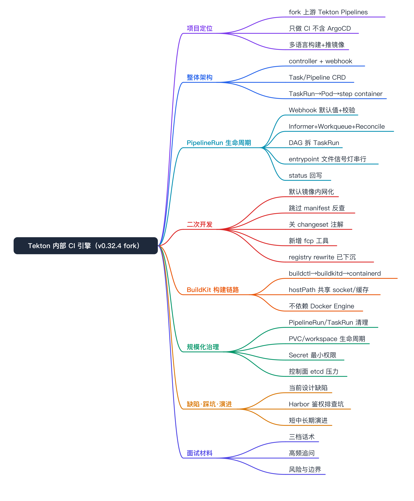
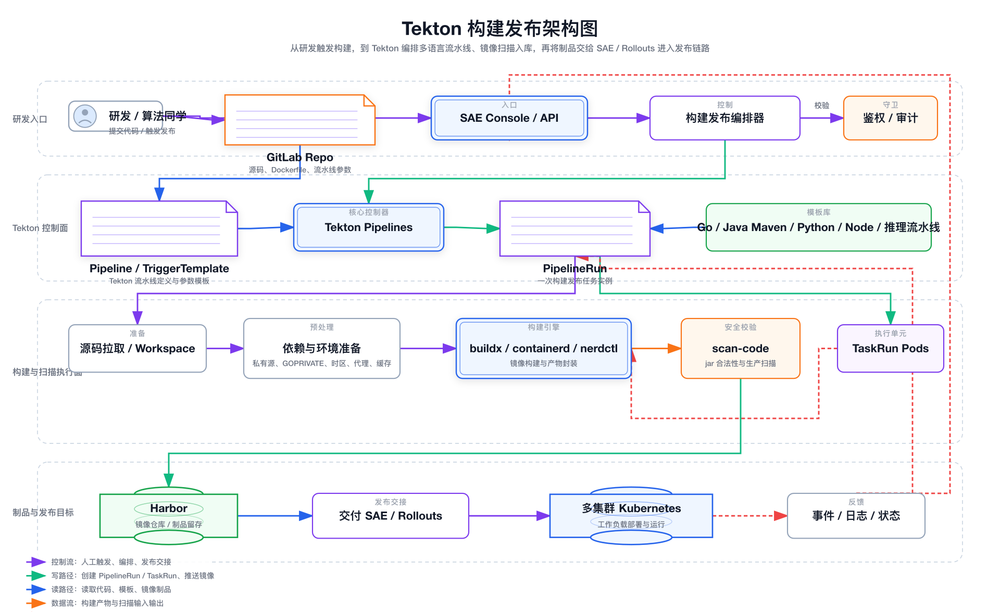
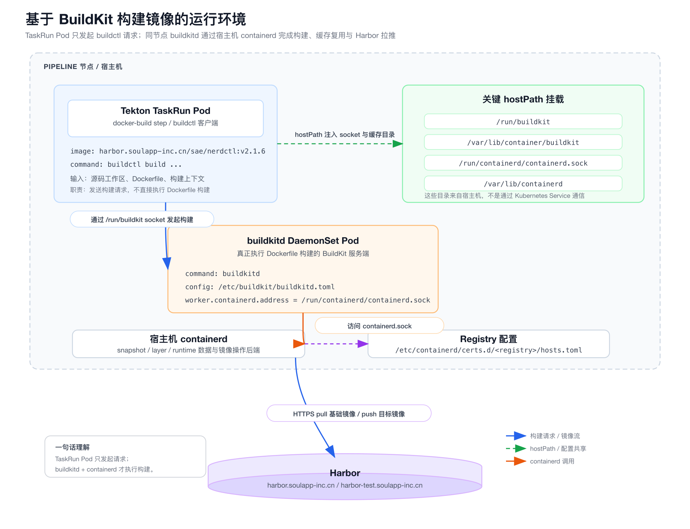

# Tekton 内部 CI 引擎（v0.32.4 fork）面试准备



说明：本文按 interview-doc 的 project 模式组织，是面试口述稿，覆盖 Tekton 整体架构、一次 PipelineRun 的运行原理、我们在上游基础上改了什么，以及规模化治理与 BuildKit 构建链路。已有架构图、ASCII 关系图和关键代码 / YAML 片段保留。

# 项目定位

- 项目名称：内部 CI 引擎（基于 tektoncd/pipeline v0.32.4 fork）
- 所属领域：云原生 CICD / 构建平台
- 项目类型：fork 上游 Tekton Pipelines 的内部分支，作为公司统一构建执行引擎
- 核心目标：把内部所有语言（Go / JDK / Node / Python / 算法）的「构建 + 推镜像 + 制品上传」流水线统一跑在 K8s 上，对外提供 Task / Pipeline / TaskRun / PipelineRun 等 CRD
- 服务对象：公司内部各业务线研发，作为 SAE 发布系统的构建底座
- 关键词：Tekton、Operator、Reconcile、entrypoint 文件信号灯、BuildKit、buildctl、containerd、Harbor
- 面试价值：能讲清「K8s 不保证 container 串行，Tekton 怎么实现 step 串行」「fork 上游改了什么、为什么改得很克制」「buildctl → buildkitd → containerd 这条不依赖 Docker 的构建链路」

这个仓库只用到 Tekton，没有 ArgoCD。控制器是标准的 K8s Operator —— Informer + Workqueue + Reconcile —— 把 PipelineRun 拆成 TaskRun，再把每个 TaskRun 拆成一个 Pod，每个 step 是 container；通过统一 `/tekton/bin/entrypoint` + 共享 emptyDir 的文件信号灯实现 step 串行和 results 回传。

# 项目背景

公司内部需要一套统一的构建执行引擎：多语言、多版本、构建后推镜像到内网 Harbor、再上传制品。直接用上游 Tekton 有几个不适配点：

- 上游默认辅助镜像（entrypoint、git-init 等）必须启动时用一长串 flag 传入，否则 `Images.Validate()` 直接 fatal，部署体验差。
- 上游默认行为会去镜像仓库拉 manifest 反查 ENTRYPOINT，内网 Harbor 走 robot 账号鉴权链路复杂、走外网慢且不稳定。
- 上游用 ko 打镜像并塞 `kodata/HEAD` 拿 git commit，我们改用普通 Dockerfile 打包，没有 kodata，相关逻辑会 fatal。

更重要的是，Tekton 落地最大的坑不是能不能跑起来，而是规模化之后的治理问题（控制面压力、PVC 生命周期、Secret 权限、镜像构建、平台化能力）。所以我们的定位是：把 Tekton 当执行引擎，控制器侧改动尽量少，业务能力主要靠 deploy/ 下的大量 Pipeline / Task 模板沉淀，这样上游升级时合并冲突小。

# 项目目标

- 统一执行引擎：所有语言的构建流水线收敛到一套 Tekton CRD，可 RBAC、可 audit、可 watch。
- 内网化与稳定化：默认镜像内网化、关掉对外网 / manifest 的隐式依赖，让流水线在内网环境稳定起跑。
- 关注点分层：把「在控制器里 hack」的逻辑尽量下沉到容器运行时（containerd hosts.toml），减少控制器侵入。
- 规模化治理：解决 PipelineRun / TaskRun / PVC 的清理、缓存治理、Secret 最小权限和控制面压力。
- 不依赖 Docker 的构建：用 buildctl → buildkitd → 宿主机 containerd 完成构建，使 K8s 全量切 containerd 后链路依然成立。

# 我的职责

参与级别：我们团队维护这个 fork、负责其落地与治理。措辞守住「参与 / 负责治理 / 负责模板沉淀」，不夸大成自研 Tekton。

- 控制器二次开发：
  - 具体工作：参与上游基础上的少量关键改动（默认镜像内网化、跳过 manifest 反查、关 changeset 注解、新增 fcp 辅助二进制）。
  - 面试可展开点：为什么改得很克制、每处改动的动机和代价。
- 流水线模板沉淀（主战场）：
  - 具体工作：按语言 / 场景在 deploy/ 下沉淀几十个 Pipeline / Task 模板，统一 git-init → 构建 → buildctl push 流程。
  - 面试可展开点：模板化怎么降低上游升级的合并成本。
- 构建链路与运维治理：
  - 具体工作：参与 buildkit / Harbor / containerd / scancode 等周边集成与排障，治理 PipelineRun / PVC 清理和缓存。
  - 面试可展开点：buildctl / buildkitd / containerd 三者关系、Harbor 鉴权排障路径。

## 我不负责 / 不夸大的部分

1. 不自研 Tekton，只是 fork 上游并做克制的二开。
2. 不自研 BuildKit / containerd，构建执行依赖节点上的 buildkitd + containerd。
3. 不把 Tekton 说成完整发布平台，它是执行引擎；状态机、日志聚合、审批、并发控制由上层 SAE 平台承担。
4. 不涉及 ArgoCD，这个仓库本身就只是 CI 引擎。

# 总体架构



## 部署形态

Tekton 在集群里就是一组 Deployment + 一堆 CRD：

- `tekton-pipelines-controller`：核心控制器，承载所有 Reconcile 逻辑，watch CRD 与 Pod。
- `tekton-pipelines-webhook`：Admission Webhook，做 CRD 的默认值填充与校验、版本转换（v1alpha1 ↔ v1beta1）。
- CRD：Task、ClusterTask、Pipeline、TaskRun、PipelineRun、Run、PipelineResource 等。
- 辅助镜像：entrypoint、nop、git-init、kubeconfig-writer、pullrequest-init、imagedigest-exporter —— 由控制器在创建 Pod 时按需注入。

## 抽象层次

| 层 | 对象 | 类比 |
| --- | --- | --- |
| 模板层 | Task、Pipeline | 类、函数定义 |
| 执行层 | TaskRun、PipelineRun | 一次调用、运行实例 |
| 承载层 | Pod（每个 TaskRun 对应一个 Pod，每个 Step 是一个 container） | 真正干活的进程 |

面试一句话：Tekton 把 CI 流水线当成「K8s 一等资源」，模板和触发分离，可 RBAC、可 audit、可 watch。

## Pipeline 内的依赖与编排

- DAG：Task 之间用 `runAfter` 或 `params/results` 引用形成有向无环图，Reconcile 时按拓扑顺序逐批触发。
- Finally：无论成功失败都会跑的收尾任务（通知、清理、上报指标）。
- When / Conditions：条件跳过。
- Workspaces：在 Pipeline 内多个 Task 之间共享的目录（同一个 PVC / emptyDir）。


# 核心能力

- 多语言流水线编排：按语言 / 场景沉淀 Task / Pipeline 模板，统一构建 + 推镜像 + 制品上传流程。
- step 串行与 results 传递：用统一 entrypoint + 文件信号灯实现不依赖 K8s 调度顺序的 step 串行，并支持 step 间小数据传递。
- 不依赖 Docker 的镜像构建：buildctl 发起 → 同节点 buildkitd 执行 → 宿主机 containerd 拉推 Harbor。
- 历史资源治理：PipelineRun / TaskRun / Pod / PVC 的 TTL、history limit、orphan 清理。
- 缓存治理：BuildKit content store / snapshotter / cache mount + registry cache，配合 CronJob 定期 prune。
- 内网化与运维工具链：默认镜像内网化、containerd hosts.toml mirror、私有 registry pull-through cache、fcp 制品收集工具。

# 核心流程

一条 PipelineRun 的全生命周期：


## 用户 / 平台创建 PipelineRun

通过 `kubectl apply` 或上层平台调 K8s API 写入 PipelineRun，里面引用 pipelineRef，传 params、绑 workspaces。经 Webhook：默认值填充（默认 ServiceAccount、默认 timeout）+ 校验（参数是否齐、workspace 是否绑全）。

## Controller 看到事件

控制器内部典型 Operator 套路：

- Informer 通过 List + Watch 把 PipelineRun 对象同步到本地缓存；
- 事件回调把 `<namespace>/<name>` 丢进 Workqueue；
- 多个 worker 协程从 queue 里取 key，调用 Reconcile 函数。

Reconcile 是幂等的：每次都重新算一遍「期望状态 vs 实际状态」，差什么补什么。

## PipelineRun → 多个 TaskRun

Reconcile 解析 DAG，按依赖顺序为每个就绪的 Task 创建 TaskRun 子对象（OwnerReference 指向 PipelineRun）。TaskRun 创建后触发 TaskRun controller 的 Reconcile，进入下一层。

## TaskRun → Pod（核心改写发生在这里）

TaskRun controller 干的事：

1. 解析 Task（Task / ClusterTask / 远端 bundle）。
2. 构造 Pod：每个 step 变成 Pod 里的一个 container；sidecars 直接是 sidecar container。
3. 重写 entrypoint：把每个 step 的 command 改成统一二进制 `/tekton/bin/entrypoint`，原来的命令变成 entrypoint 的参数。
4. 挂工作目录：`/workspace`、`/tekton/results`、`/tekton/run/<idx>` 等约定路径，用 emptyDir 或 PVC 实现。
5. 挂凭据：从 ServiceAccount 关联的 Secret（git/docker 类型）拷贝到 `/tekton/creds`，业务进程读 `$(credentials.path)` 即可。
6. 注入 init container：把 entrypoint 二进制 cp 到 `/tekton/bin/`，把 nop / working-dir 等准备好。

## Step 串行 + 入口进程协作（必背）

- K8s 本身不能保证 container 串行 —— 所有 container 是并行启动的。
- Tekton 用 `/tekton/bin/entrypoint` 包装每个 step，做了一套「文件信号灯」：
    - 第 N 个 step 启动后先阻塞等 `/tekton/run/<N-1>/out`；
    - 等到了再 exec 真正的命令；
    - 命令退出后写 out（成功）/ err（失败），同时把退出码、终止信息写到 `/tekton/termination`；
    - 下一个 step 的 entrypoint 据此放行或终止。
- 这样在不依赖 K8s 调度顺序的前提下，实现了 step 串行、可超时、可断点、可上报 results。

面试金句：Tekton 的 step 串行不是靠 K8s 排序，而是靠统一入口 + 共享 emptyDir + 文件信号实现的。这也解释了为什么每个 step 的 command 都被改写成 `/tekton/bin/entrypoint`。

## 状态回写与资源回收

- 控制器持续 watch Pod 状态，把容器退出码、Step 状态、Results、原因等聚合写回 TaskRun.status；
- TaskRun 完成 → PipelineRun 重新 Reconcile → 触发下一批 Task → …… 直到 DAG 跑完；
- 终态打 `Succeeded=True/False` 到 `status.conditions`，外部系统 watch 一下就知道结果；
- Finalizer 处理收尾；Pod 默认保留（便于看日志），由 GC 或上层平台按策略清理；大规模场景下要关注 PVC、emptyDir、Pod 数量对集群的压力。

# 关键设计

## 设计一：控制器源码改动（核心，一共 4~5 处）

二开范围分三块：Go 控制器代码改动（少而关键）/ 流水线 YAML 模板（大头）/ 构建与运维工具链。控制器侧改动尽量少，是为了降低上游升级的合并冲突。

### 默认镜像全部内网化（cmd/controller/main.go）

- 上游：entrypoint-image、nop-image、git-image、kubeconfig-writer-image、shell-image、pr-image、imagedigest-exporter-image 默认空，必须启动时通过 flag 传入，否则 `Images.Validate()` 直接 `log.Fatal`。
- 我们的改动：把这 7 个默认值都写成 `harbor.soulapp-inc.cn/sae/pipeline-*:v0.32.4`，并注释掉 `Images.Validate()`。
- 为什么：内部环境镜像固定，不想每次部署都堆一长串 flag；同时方便没填某些次要镜像时也能起来。
- 可能被追问：「为什么不放 ConfigMap？」答：可以，但当前以默认值 + 内部镜像规范约束足够；ConfigMap 改动需要 reload，收益不明显。

### 跳过 resolveEntrypoints（pkg/pod/pod.go）

- 上游逻辑：如果 step 没写 command，控制器会真的去镜像仓库拉 manifest，反查容器 ENTRYPOINT 来填上。
- 我们的改动：注释掉 `resolveEntrypoints` 调用，强制要求所有 step 显式写 command。
- 为什么：
    1. 内网 Harbor 走 robot 账号，控制器去 manifest 时鉴权链路复杂、容易报权限错误；
    2. 走外网拉 manifest 慢且不稳定；
    3. 显式 command 在 YAML 里更可读、可审计。
- 代价：所有内部模板必须写明 command（不是技术债，是规范）。

### 关掉 changeset.Get() 注入版本注解（pkg/pod/pod.go、pkg/reconciler/taskrun/taskrun.go）

- 上游：用 `knative.dev/pkg/changeset` 读 `kodata/HEAD` 拿 git commit，写到 Pod / TaskRun 的 `pipeline.tekton.dev/release` 注解里。
- 我们的改动：注释掉这两处。
- 为什么：上游用 ko 打镜像，自动塞 kodata/；我们改用普通 Dockerfile（debian-slim）ADD 二进制（见 `deploy/Dockerfile` + `deploy/build.sh`），镜像里没有 kodata/HEAD，调用会 fatal，最简单的处理就是注释掉。
- 可能被追问：「为什么不改用 ko？」答：内网构建、推镜像、基础镜像规范都已经走 Harbor 流水线，引入 ko 收益小、改动面大。

### 新增 cmd/fcp/main.go（自定义辅助二进制）

- 上游 cmd 列表里没有 fcp，是我们加的。
- 功能：按 glob 文件名（如 `soul-*.war`）在某目录递归找文件，复制到目标目录；目标已存在则跳过。
- 用法：在制品流水线（如 JAR/WAR 上传 OSS 之前）作为一个 step，把 `output/` 下的产物按通配收齐，避免每条流水线都手写一段 `find ... -exec cp ...`。
- 为什么独立做二进制：在 alpine/scratch 等极简基础镜像里也能跑（静态编译、无依赖）；比一段 shell 更可控、错误码语义清晰（找不到返回 404 等）。

### 历史上做过 Image Registry Rewrite（已下线，体现关注点分层）

- 一段时期内引入过 `pkg/registry/repace.go` + `pkg/apis/pipeline/options.go` 的 `--registry-*` 启动参数，用于把 step 镜像里的 `docker.io / k8s.gcr.io / gcr.io` 自动改写到内部 Harbor 缓存仓。
- 后来在 `clear image registry` 提交里整体撤掉了，原因是改用 containerd `hosts.toml` 的 mirror 配置（见 `deploy/containerd/certs.d/...`）：在节点级配置 mirror 更通用，所有 Pod 都能受益，不用控制器侵入。
- 面试金句：能展示一次「在控制器里 hack」→「下沉到容器运行时配置」的演进过程，体现对关注点分层的理解。

## 设计二：流水线 YAML 模板（业务侧主战场）

这块占比最大，按语言 / 场景分目录沉淀模板：

- `deploy/pipeline/go/`：Go 1.17 ~ 1.25 多版本、`go1-22-nerdctl.yaml` 等；统一 git-init → go build → buildctl build + push=true。
- `deploy/pipeline/jdk/`：Maven 3.6（JDK 8 / 17）+ scancode（代码扫描，含禁止 `-Ptest` 进 prod 的安全策略）+ testcase（对接内部 Jarvis/SAE 用例平台）。
- `deploy/pipeline/node14|node16/`：Node 流水线 + npm 内网源。
- `deploy/pipeline/python/` 与 `deploy/pipeline/algo/`：算法侧 —— 含 NAS 下载、推理服务部署（在线发布、灰度发布）等。
- `deploy/pipeline/artifact/`：JAR/WAR 制品 → OSS / 内部 artifact API 回调。
- 以及配套的可复用 Task（`deploy/task/`）：制品 push、testcase-java（结果回调发布门户）等。

## 设计三：buildctl → buildkitd → containerd 的构建链路

这套链路从一开始就不依赖 Docker Engine：不是 docker build，不是 dind，而是 buildctl → buildkitd → 宿主机 containerd → Harbor。所以 K8s 全量切到 containerd 后，这套流水线依然成立。出了问题，优先怀疑 buildkitd / containerd / Harbor 鉴权 / 入口协议，而不是「没有 Docker 了」。

- buildkitd：BuildKit 的守护进程，真正负责执行 Dockerfile、管理缓存、拉基础镜像、推目标镜像；以 DaemonSet 跑在每个 pipeline 节点上。
- buildctl：BuildKit 的客户端；流水线模板里 docker-build step 直接执行的就是它。
- nerdctl：面向 containerd 的 Docker 风格 CLI；`harbor.soulapp-inc.cn/sae/nerdctl:v2.1.6` 之所以常见，是因为这张工具镜像同时带了 nerdctl、buildctl、buildkitd 二进制，不是说流水线真在执行 `nerdctl build`。

### 构建环境与宿主机关系图

```latex
+--------------------------------------------------------------------------------+
| pipeline 节点 / 宿主机                                                          |
|                                                                                |
|  +--------------------------- Tekton TaskRun Pod ---------------------------+  |
|  | docker-build step                                                      |  |
|  | image: harbor.soulapp-inc.cn/sae/nerdctl:v2.1.6                        |  |
|  | command: buildctl build ...                                            |  |
|  |                                                                        |  |
|  | 挂载的 hostPath:                                                       |  |
|  |   /run/buildkit                                                        |  |
|  |   /var/lib/container/buildkit                                          |  |
|  |   /run/containerd/containerd.sock                                      |  |
|  |   /var/lib/containerd                                                  |  |
|  +----------------------------------+-------------------------------------+  |
|                                     |                                        |
|                                     | 通过共享的 /run/buildkit socket        |
|                                     v                                        |
|  +---------------------------- buildkitd DaemonSet Pod --------------------+  |
|  | command: buildkitd                                                    |  |
|  | config: /etc/buildkit/buildkitd.toml                                  |  |
|  | worker.containerd.address   = /run/containerd/containerd.sock         |  |
|  | worker.containerd.namespace = buildkit                                |  |
|  +----------------------------------+-------------------------------------+  |
|                                     |                                        |
|                                     | 访问宿主机 containerd.sock             |
|                                     v                                        |
|                          宿主机 containerd                                   |
|                          读取 /etc/containerd/certs.d/<registry>/...         |
+------------------------------------+-------------------------------------------+
                                     |
                                     | HTTPS pull / push
                                     v
                           harbor.soulapp-inc.cn / harbor-test.soulapp-inc.cn
```




关键点只有一句话：Task Pod 只是带着源码和 buildctl 客户端；真正完成 Dockerfile 构建、缓存复用、Harbor 拉推的是同节点上的 buildkitd + 宿主机 containerd。

交互顺序：

1. 平台创建 TaskRun Pod；
2. docker-build step 拿到源码和 Dockerfile；
3. step 里执行 buildctl build；
4. buildctl 通过 `/run/buildkit` 连到同节点 buildkitd；
5. buildkitd 根据 buildkitd.toml，通过 `/run/containerd/containerd.sock` 调宿主机 containerd；
6. containerd 拉基础镜像、使用缓存、产出镜像层；
7. 再根据 registry 配置把结果 push 到 Harbor。

共享的是：buildkit socket、containerd socket、BuildKit cache 目录、containerd runtime 数据目录。不共享的是 TaskRun Pod 的源码 workspace 本身 —— 源码上下文是 buildctl 从 Pod 本地送给 buildkitd，不是让 buildkitd 去读同一个 workspace 目录。

### 这套关系在仓库里落在哪些文件

1. `deploy/buildkit.yaml`：以 DaemonSet 部署 buildkitd，一个节点一个 Pod，只调度到 `app_type=pipeline` 节点，容器直接 `command: [buildkitd]`，挂载 `/run/containerd/containerd.sock`、`/var/lib/containerd`、`/var/lib/container/buildkit`、`/run/buildkit`。
2. `images/nerdctl/buildkitd.toml`：`root = "/var/lib/container/buildkit"`，`[worker.containerd] address = "/run/containerd/containerd.sock"`，`namespace = "buildkit"`，打开 containerd worker 并设置较激进的缓存容量与 GC 策略。
3. `deploy/pipeline/*` 里的 docker-build step，实际命令是：

```bash
buildctl build \
  --frontend=dockerfile.v0 --progress=plain \
  --opt filename=Dockerfile --local context=. --local dockerfile=/workspace/.pipeline \
  --output type=image,name=$(params.docker-image),push=true \
  --export-cache type=inline
```

   也会挂同一套 hostPath：`containerd.sock`、`/var/lib/containerd`、`/var/lib/container/buildkit`、`/run/buildkit`。
4. `deploy/buildkit-prune.yaml`：用单独的 CronJob 做 `buildctl prune` / `buildctl prune-histories`，清理节点共享的 buildkit cache。
5. `deploy/containerd/certs.d/.../hosts.toml(.example)`：节点级 registry 鉴权 / mirror / 协议配置；文档里只写「机制与路径」，不要贴任何明文账号、密码或 Basic Token。

# 技术难点

- step 串行与 K8s 并行的矛盾：
  - 为什么难：K8s 不保证 container 串行，所有 container 并行启动，而 CI step 必须按序执行并能传 results。
  - 解决思路：统一 entrypoint + 共享 emptyDir + 文件信号灯，前一个 step 写 out 文件，后一个 step 阻塞等待再 exec。
  - 面试展开点：这也解释了为什么所有 step 的 command 都被改写。
- 内网 Harbor 鉴权与协议问题：
  - 为什么难：真正对 Harbor 发起 OCI 交互的是 buildkitd / containerd，不是 Pod 自己 docker login，凭据「看不到」不等于「没有」；pull 成功 push 失败、`WWW-Authenticate` 给的是 http:// 等问题根因常在 Harbor / Ingress 配置层。
  - 解决思路：分层排查 —— 先认清不是 Tekton 在 login，再区分网络 / 权限 / scope / 协议，定位到 Harbor external_url、Ingress 是否透传 `X-Forwarded-Proto: https`。
  - 面试展开点：该改的是 Harbor / Ingress 配置，不是 Tekton Controller 或 buildctl 参数。
- 大规模 Run 对集群的压力：
  - 为什么难：PipelineRun / TaskRun 都是 CRD，高频流水线产生大量对象，压力集中在 API Server / etcd、控制器单点、节点 Pod 上限。
  - 解决思路：历史清理（TTL / history limit）、namespace 隔离、状态归档、限制并发、Pod GC、Workspace 用瞬时存储、考虑分 namespace 多控制器实例。
  - 面试展开点：控制器默认单副本，HA 需要 lease 选主。
- 构建环境过大与缓存：
  - 为什么难：只靠 BuildKit 缓存解决不了「构建环境很大」的问题。
  - 解决思路：把稳定的大环境前置成基础镜像、易变业务层后置，再用 registry cache 和 cache mount 加速增量构建。
  - 面试展开点：基础镜像版本化、cache ref 单独命名、避免所有项目共用一个巨大 cache tag。

# 稳定性与治理

## 历史资源清理

Tekton 的历史资源主要包括 PipelineRun、TaskRun、TaskRun 对应 Pod，以及 workspace 产生的 PVC。清理不能只删 PipelineRun，因为 TaskRun 才承载很多 step 执行明细和日志索引；PVC 也可能因为 workspace 声明方式不同而不会自动回收。

```yaml
PipelineRun
  └── TaskRun
        └── Pod
              ├── step containers
              ├── init containers
              └── sidecar containers
```

如果集群是 Operator 管理，优先启用 TektonConfig 里的 Pruner 或新版 Tekton Pruner，按 namespace 配置 TTL 和 history limit；要注意 job-based pruner 和 event-based pruner 不能同时启用。没有内置 Pruner 的版本，用 CronJob 定期扫描 completionTime 删除过期对象，并兜底清理 orphan PVC 和异常残留 Pod。

```yaml
成功的 PipelineRun / TaskRun：
  保留 3~7 天，或者每个 Pipeline 保留最近 10~20 条

失败的 PipelineRun / TaskRun：
  保留 7~30 天，或者每个 Pipeline 保留最近 50 条

运行中的：
  绝对不删

卡死中的：
  单独处理，比如超过 24h 仍 Running 的标记/终止/告警
```

原则：K8s 里的 Tekton CR 只保留短期排障现场，长期审计和日志必须落外部存储（Loki、ClickHouse、S3 或 Tekton Results），否则资源一清，Dashboard 历史日志也会丢，排障会断。

## BuildKit 缓存治理


BuildKit 缓存主要进入 containerd 的内容存储和 snapshotter 体系：

```yaml
buildkitd
  ├── content store        # blob、layer、cache 数据
  ├── snapshotter          # overlayfs/native/stargz 等快照
  ├── metadata db          # cache key、依赖关系、LLB graph 结果
  └── gc policy            # 按容量/时间清理缓存
```

完整缓存方案分层：

```yaml
1. 基础环境镜像
   - CUDA / Python / Java / Go / Node
   - 系统依赖 / 大型 ML 框架 / 公司通用 SDK
   - 低频更新

2. 业务构建镜像
   - requirements.txt / pom.xml / package-lock.json 单独 COPY
   - 使用 RUN --mount=type=cache 缓存包管理器目录
   - 业务代码最后 COPY

3. CI 外部缓存
   - registry cache，main cache + branch cache，mode=max，定期 GC

4. 镜像仓库治理
   - 基础镜像版本化，cache ref 单独命名，过期 cache 清理
   - 避免所有项目共用一个巨大 cache tag
```


## 其它治理维度

- Secret 最小权限：构建、推镜像、部署生产不共用一个高权限 ServiceAccount，按场景拆分，避免 CI 任务拿到过大的生产权限。
- 控制器幂等与可恢复：Reconcile 幂等，关键状态全在 CRD status，重启控制器不丢；HA 靠 lease 选主。
- 工具链运维：`deploy/Dockerfile` + `deploy/build.sh` 出 pipeline-controller 塞进 debian-slim（tag 形如 `v0.32.4-251023`）；`deploy/registry/` 提供 docker-compose + redis 的 pull-through cache 作离线兜底。

# 数据模型 / 资源模型

| 层 | 对象 | 关键字段 / 关系 |
| --- | --- | --- |
| 模板 | Task / Pipeline | steps、params、results、workspaces、runAfter（DAG）、finally |
| 实例 | TaskRun / PipelineRun | pipelineRef / taskRef、params、workspaces 绑定、status.conditions |
| 承载 | Pod | OwnerReference 指向 TaskRun，每个 step = container，init container 注入 entrypoint |
| 约定路径 | emptyDir / PVC | `/workspace`、`/tekton/results`、`/tekton/run/<idx>`、`/tekton/termination`、`/tekton/creds` |

- 单 Pipeline 跨 Task 共享必须用 PVC（不同 TaskRun = 不同 Pod，emptyDir 出不了 Pod）；单 Task 内 step 共享 emptyDir 即可；大文件 / 缓存场景用 PVC + RWX 或直接挂 NAS（算法 pipeline 就是这么干的）。

# 指标与收益

按当前口径用定性表达，不编造提升百分比：

- 统一执行引擎：所有语言构建收敛到一套 CRD，可 RBAC / audit / watch，研发不必各自维护 CI agent。
- 上游升级成本低：控制器侧改动克制（4~5 处），业务能力沉在模板里，上游升级合并冲突小。
- 不依赖 Docker：buildctl → buildkitd → containerd 链路使 K8s 切纯 containerd 后无需改造流水线。
- 缓存与清理治理：CronJob prune + 分层缓存 + TTL 清理，控制 etcd / 节点存储压力。

# 和岗位的匹配点

- 云原生 CICD / 构建平台：Tekton fork、Operator、模板沉淀、BuildKit 链路是这个方向的硬核能力。
- SRE / 平台工程：规模化治理（清理、缓存、Secret 权限、控制面压力）和分层排障直接对应稳定性建设。
- 容器 / 运行时方向：buildctl / buildkitd / containerd / hosts.toml 这条链路能体现对容器运行时的理解。

# 面试讲法

## 三十秒

我们维护一个基于 Tekton Pipelines v0.32.4 fork 的内部 CI 引擎，作为 SAE 发布系统的构建底座。控制器是标准 K8s Operator，把 PipelineRun 拆成 TaskRun 再拆成 Pod。二开很克制：镜像内网化、关掉 manifest 反查和 changeset 注解、加了个 fcp 工具，业务能力主要靠 deploy/ 下的模板沉淀。

## 三分钟

补架构和运行原理：模板层 Task/Pipeline、执行层 TaskRun/PipelineRun、承载层 Pod。一次 PipelineRun 经 Webhook 校验 → Informer+Workqueue+Reconcile → 按 DAG 拆 TaskRun → 构造 Pod 并重写 entrypoint → 文件信号灯实现 step 串行 → status 回写。构建走 buildctl → buildkitd → 宿主机 containerd，不依赖 Docker。

## 五分钟

再补治理和取舍：为什么改得克制（降低上游升级合并成本）、registry rewrite 为什么下沉到 hosts.toml（关注点分层）、大规模 Run 的 etcd 压力怎么治理（TTL + namespace 隔离 + 外部日志归档）、Harbor 鉴权 push 失败怎么分层排查（根因常在 Harbor/Ingress 协议配置）。再讲后续演进。

# 高频 Q&A

## Tekton 怎么保证多个 step 按顺序执行，K8s 不是并行起容器吗

统一 entrypoint + 文件信号灯 + emptyDir 共享卷。第 N 个 step 阻塞等 `/tekton/run/<N-1>/out`，等到再 exec，退出后写 out/err 放行下一个。好处是 step 还能拿到上一个 step 的 results 文件，做 DAG 内的小数据传递。

## Tekton Controller 是怎么实现的

标准 K8s Operator —— client-go Informer / Lister + Workqueue + Reconcile loop，内部用 knative 的 controller 框架包了一层。Reconcile 幂等，关键状态全在 CRD 的 status 里，重启控制器不丢。

## PipelineRun 失败了怎么排查

PipelineRun.status.conditions → 看哪个 Task 挂了 → 对应 TaskRun → 对应 Pod → 看哪个 step container 退出码非 0 → 看 `/tekton/termination` 终止信息或 step 日志。注意 step 是串行的，前面卡住会让后面 step 一直在 entrypoint 等文件，看起来像「Pod 是 Running 但其实没动」。

## 你们这个 fork 改了上游哪些东西，为什么不直接用上游

四条：默认镜像内网化 + 关掉 Images 校验；关掉镜像 manifest 反查 entrypoint（避开内网 Harbor 鉴权 + 加速调谐）；关掉 changeset 版本注解（我们用 Dockerfile 而非 ko 打包）；加了一个 fcp 辅助二进制。战术总结：控制器侧改动尽量少，业务能力靠 deploy/ 模板沉淀，上游升级合并冲突小。

## Tekton vs Jenkins / GitLab CI

K8s 原生（调度、隔离、弹性、RBAC 直接用 K8s，Jenkins 还得自己维护 master/agent）；声明式 + 可复用 Task（Pipeline/Task 是 CRD，可 watch、可 RBAC、可 GitOps）；代价是 YAML 写法相对啰嗦，没有 Jenkins Groovy 那种灵活，但换来可治理。

## Workspace 用 PVC 还是 emptyDir

单 Pipeline 跨 Task 共享必须 PVC（不同 TaskRun = 不同 Pod）；单 Task 内 step 共享 emptyDir 即可；大文件 / 缓存场景用 PVC + RWX 或直接挂 NAS。

## 大规模 Run 并发对集群的压力

主要压力点：API Server / etcd（CRD 事件量大）、控制器单点（默认单副本，HA 需 lease 选主）、节点 Pod 数量上限。缓解：限制并发、Pod GC、Workspace 用瞬时存储、分 namespace 多控制器实例。

## 为什么不用 ArgoCD

这个仓库本身就只是 CI 引擎。Tekton 解决「在集群里把流水线跑起来」，ArgoCD 解决「集群里的应用配置和 Git 是否一致」。要做完整 GitOps 可以叠加 ArgoCD，但不是这个项目的范围。

## PipelineRun / TaskRun / Pod / PVC 怎么清理

优先用 TektonConfig Pruner 或新版 Tekton Pruner，按 namespace 配 TTL 和 history limit（成功保留少、失败保留久）；没有内置 Pruner 就用 CronJob 扫 completionTime 删过期对象，并兜底清 orphan PVC 和残留 Pod。前提是先把日志和结果归档到外部存储，否则清完历史日志就断了。

## docker-build step 是在 Pod 里自己构建镜像吗

不是。Pod 里执行的是 buildctl 客户端，真正的构建发生在同节点的 buildkitd + 宿主机 containerd。最容易讲错的就是把它说成「Pod 里 docker build」。这也是 K8s 切纯 containerd 后链路依然成立的原因。

## Harbor push 失败但 pull 成功，怎么排查

pull 成功说明到 Harbor 的网络 / DNS / TLS 通；push 报 unauthorized 更常见的根因是目标项目没有 push 权限、节点只配了旧域名 auth、pull 和 push 不是同一套 Harbor scope。如果 `WWW-Authenticate: Bearer realm="http://..."` 给的是 http://，那是 Harbor external_url 配成 http 或 Ingress 没透传 `X-Forwarded-Proto: https`，该改 Harbor / Ingress 而不是 Tekton。

## nerdctl build 和 buildctl build 是一回事吗

不是。nerdctl build 更像 Docker 用户熟悉的体验；buildctl build 直接打到 buildkitd，链路更短。当前仓库生产模板主路径是 buildctl build，nerdctl 更多是文档对照或手工排障备用。

# 风险与边界

- 容易被追问的说法：「我们自研了 CI 引擎」
  - 风险：被理解为从零自研 Tekton。
  - 更稳妥的表达：我们 fork 上游 Tekton 并做了克制的二开 + 大量模板沉淀。
- 容易被追问的说法：「构建是我们做的」
  - 风险：被追问 BuildKit / containerd 实现细节。
  - 更稳妥的表达：构建执行依赖节点上的 buildkitd + containerd，我们负责链路集成、模板和治理。
- 容易被追问的说法：「Tekton 是我们的发布平台」
  - 风险：混淆执行引擎和发布平台。
  - 更稳妥的表达：Tekton 是执行引擎，状态机 / 审批 / 并发控制 / 日志聚合由上层 SAE 平台承担。
- `deploy/containerd/certs.d/.../hosts.toml` 涉及 registry 鉴权，文档里只写机制与路径，不要贴明文账号 / 密码 / Basic Token。

# 当前设计的缺陷

- 控制器单副本：默认单副本，HA 依赖 lease 选主，控制器异常时调谐会中断，缺少多副本验证。
- 历史资源治理依赖外挂：清理靠 Pruner / CronJob 外挂，没有统一的「日志归档 + CR 清理」一体化流程，配置分散容易漏配，导致 etcd 积压或日志断档。（→ 见后续演进 中期）
- 凭据 / Harbor 配置在节点级且不易自检：Harbor 鉴权依赖节点 containerd hosts.toml，缺少集中下发与一致性校验，新节点 / 新域名容易漏配，push 失败时排查成本高。（→ 见上线后踩过的坑）
- 二开靠注释代码而非配置开关：跳过 resolveEntrypoints、关 changeset 等改动是直接注释上游代码，上游升级时要重新比对、手工保留这些改动，缺少 feature flag 化。
- 缓存 GC 偏激进：buildkitd.toml 设了较激进的缓存容量与 GC 策略，极端情况下可能误清还在用的 cache，命中率波动。

# 上线后踩过的坑

诚实边界：以下是我参与排查或团队遇到的典型问题，按真实参与度措辞。

## Harbor push 报 unauthorized，实为 token 地址协议错

- 现象：基础镜像 pull 成功，但 push 目标镜像报 unauthorized / authentication required。
- 根因：访问 `https://harbor.../v2/` 返回 401 是正常 challenge，但 `WWW-Authenticate` 里的 token realm 给成了 `http://`，客户端被引导去 HTTP token endpoint 拿 token，push 阶段掉鉴权。本质是 Harbor external_url 配成 http:// 或前置 Ingress / Tengine / Nginx 没透传 `X-Forwarded-Proto: https`。
- 当时怎么兜的：用调试模板 `deploy/pipeline/jdk/task-maven3-6-scancode-debug.yaml` curl 探测 https/http `/v2/`、`buildctl debug workers`、临时加 `registry.insecure=true` 做协议层定位。
- 真正的解：改 Harbor / Ingress 配置（external_url 用 https、Ingress 透传 X-Forwarded-Proto），不是改 Tekton Controller 或 buildctl 参数；调试模板只做短期排障，不常驻。

## 误以为「Pod 里看不到凭据」就是没凭据

- 现象：docker-build step 没显式 docker login，排查时一度以为缺凭据。
- 根因：真正对 Harbor 发起 OCI 交互的是 buildkitd / containerd，认证依赖节点 certs.d/hosts.toml 和 robot 账号，不在 Pod 里。
- 当时怎么兜的：先确认链路主体是 buildkitd/containerd，再去节点查 hosts.toml。
- 真正的解：建立「认证在节点运行时层」的排查心智，新节点 / 新域名上线时校验 hosts.toml。（→ 对应缺陷：凭据节点级不易自检）

## Task Pod 调度到无 buildkitd 的节点

- 现象：buildctl 连不上 worker，构建直接失败。
- 根因：buildkitd 以 DaemonSet 只跑在 `app_type=pipeline` 节点，Task Pod 若没正确约束调度就会落到无 buildkitd 的节点。
- 当时怎么兜的：`buildctl debug workers` 确认 worker，检查 Task Pod 是否在 pipeline 节点。
- 真正的解：流水线模板统一约束调度到 pipeline 节点，并把 worker 探测纳入排障清单。

# 后续演进

- 短期（工程化止血）：
  - 把跳过 resolveEntrypoints、关 changeset 等改动 feature flag 化（启动参数 / ConfigMap 开关），减少上游升级时手工比对注释的成本。（对应缺陷：靠注释代码）
  - 把 Harbor hosts.toml 一致性校验和 worker 探测纳入新节点上线检查清单。（对应坑：节点级配置漏配）
- 中期（架构升级）：
  - 建设「日志 / 结果归档 + CR 清理」一体化流程：接 Tekton Results / Loki / S3，让清理和归档统一编排，避免日志断档。（对应缺陷：治理依赖外挂）
  - 验证控制器多副本 / lease 选主的稳定性，降低单点风险。
  - 缓存 GC 策略按命中率调参，避免误清在用 cache。
- 长期（能力扩展）：
  - 评估远程缓存 / 分布式 BuildKit，进一步提升大体积镜像的增量构建效率。
  - 与上层 SAE 平台的状态机 / 审批 / 并发控制更紧耦合，把 Tekton 纯化为执行层，治理能力上移到平台。

# 图示清单

- `00_tekton_overview_mindmap.png`：全文总览思维导图。
- `diagrams-tekton/output/tekton-architecture.png`：Tekton 整体架构。
- `diagrams-sae/tekton/output/buildkit-build-environment.png`：构建环境与宿主机关系。
- 文中保留的 yuque CDN 图（DAG、生命周期、buildkit 缓存与清理）。

# 面试前检查清单

- [ ] 能 30 秒讲清这是什么（Tekton fork 的内部 CI 引擎）、自己负责哪部分（参与级别）。
- [ ] 能说为什么 fork 而不直接用上游（四条改动 + 克制原则）。
- [ ] 能画 / 讲整体架构（模板层 / 执行层 / 承载层）。
- [ ] 能讲一次 PipelineRun 全生命周期，并说清 step 串行机制。
- [ ] 能说至少 3 个关键设计（控制器改动、模板沉淀、buildctl→buildkitd→containerd）。
- [ ] 能说至少 2 个技术难点（step 串行、Harbor 鉴权 / 大规模治理）。
- [ ] 能解释历史资源清理和缓存治理。
- [ ] 知道哪些不能夸大（不自研 Tekton/BuildKit，Tekton 不是发布平台，不涉密）。
- [ ] 能连接目标岗位（CICD / 构建平台 / SRE / 运行时）。
- [ ] 准备了三档话术。

# 深水区（被追问再展开）

## buildkitd / buildctl / nerdctl 三者关系

- buildkitd：守护进程，真正执行 Dockerfile、管缓存、拉基础镜像、推目标镜像。
- buildctl：客户端，docker-build step 直接执行的就是它。
- nerdctl：containerd 的 Docker 风格 CLI，`nerdctl build` 底层也走 BuildKit，但仓库主路径不是它。
- `images/nerdctl/Dockerfile` 基于官方 `ghcr.io/containerd/nerdctl:v2.1.6`，额外装 curl、git 并覆盖 buildkitd.toml；这张工具镜像同时带 nerdctl、buildctl、buildkitd 二进制。

## FROM 拉谁和 push 到谁是两码事

- Dockerfile 里的 `FROM harbor.soulapp-inc.cn/...` 决定基础镜像从哪拉；
- `--output type=image,name=$(params.docker-image),push=true` 决定结果镜像往哪推。
- 把目标镜像改成 harbor-test 不代表基础镜像自动从 test 拉，除非 Dockerfile 的 FROM 也一起改。

## buildkit 侧排障优先看两点

- `buildctl debug workers`：能不能看到 worker；
- Task Pod 是否跑在有 buildkitd 的 pipeline 节点上；
- 调试模板：`deploy/pipeline/jdk/task-maven3-6-scancode-debug.yaml`，curl 探测 `/v2/`、`buildctl debug workers`、临时加 `registry.insecure=true` 做协议层定位（仅短期排障）。
