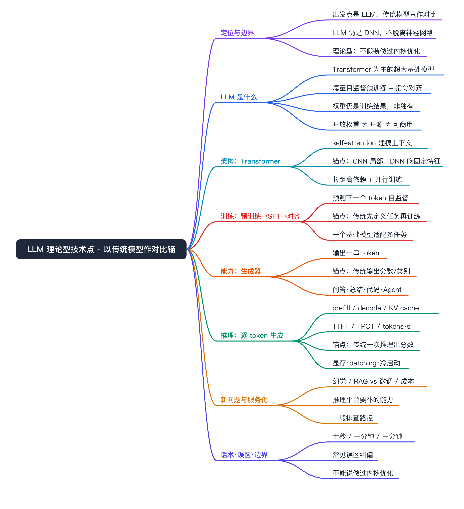
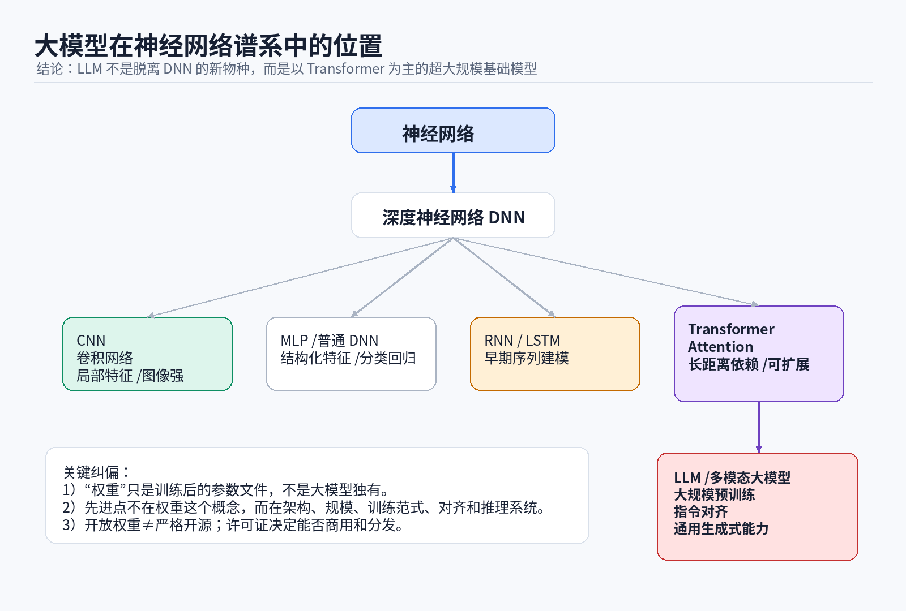
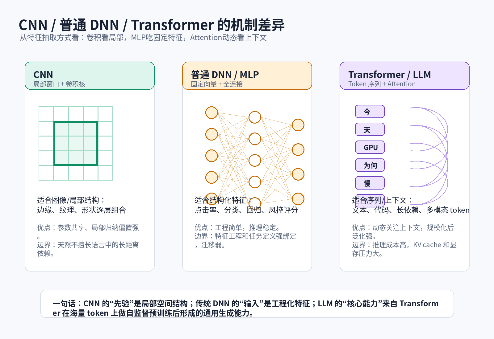
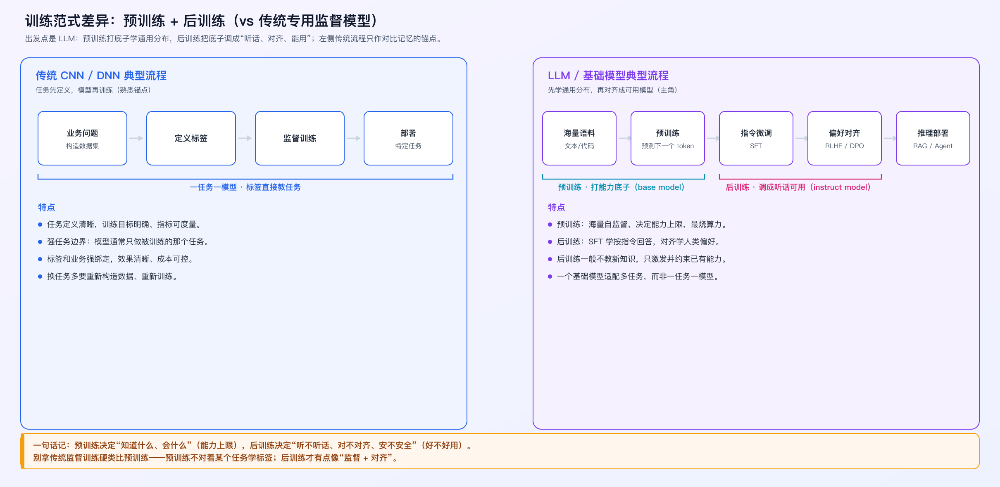
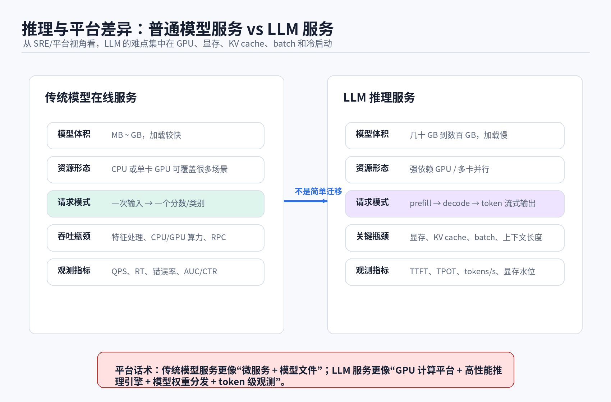
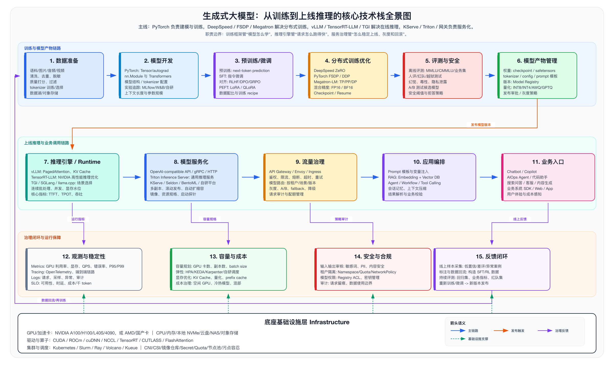
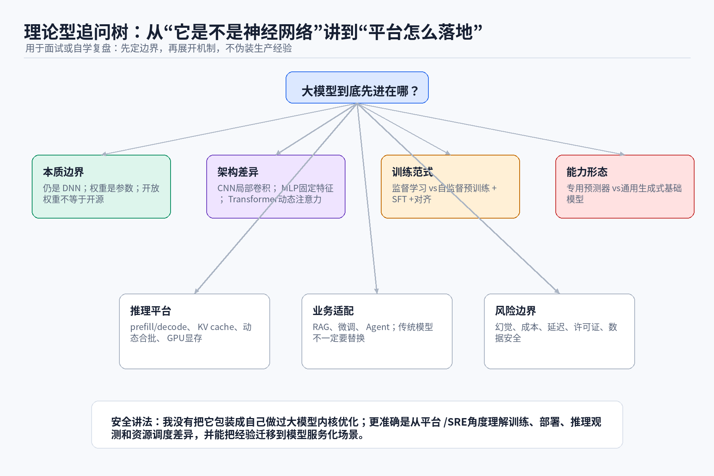

# LLM 是什么 · 理论型技术点（以传统模型作对比锚）



定位：纯科普概念型技术点，出发点是 LLM 本身。提到 CNN/DNN 等传统模型，只是为了从我熟悉的点切入、做对比记忆，不是把两者并列当主角。读完应该能自洽地讲清——LLM 仍然是神经网络，但从专用预测模型演进成了通用生成式基础模型。

# 定位与边界

先把话说清楚，避免被追问击穿：

- **出发点是 LLM**：本文讲 LLM 是什么、怎么训出来、怎么推理、有什么新问题。传统模型只在每节作为“记忆锚点”出现。
- **本质上没变的**：LLM 仍然是深度神经网络，权重仍然是训练后的参数文件，这点和我熟悉的 CNN/DNN 没有本质差别。
- **真正变了的**：架构（Transformer）、训练范式（自监督预训练 + 对齐）、能力形态（生成式）、推理工程（GPU/显存/KV cache/token 级）。
- **边界**：本文是概念理解，不假装做过 Transformer 内核或推理引擎（vLLM/SGLang）的算子/调度优化。

# 一句话讲清 LLM 是什么

LLM 是以 Transformer 为主、用海量文本/代码做自监督预训练、再经过指令微调和偏好对齐的超大规模基础模型。它的核心结果仍然是一堆训练好的权重；它的特别之处不在“有权重”，而在架构、数据规模、训练范式和推理系统共同带来的通用生成能力。

记忆锚点：你熟悉的 CTR/图像分类模型，是“为一个任务训练一个模型”；LLM 是“训练一个基础模型，再用 Prompt/RAG/微调/工具调用适配很多任务”。

# LLM 的本质：仍然是神经网络

从我熟悉的传统模型切入最好记：LLM 没有脱离神经网络范畴，训练时还是在不断调整矩阵里的浮点数，让输出更接近训练目标；训练结束保存下来的 `.bin`、`.safetensors`、checkpoint 主要就是权重。

记忆锚点：CNN、MLP、RNN、推荐模型也都有权重——**权重不是 LLM 独有**。所以 LLM 先进的不是“有权重”这件事本身。

## 顺带分清：权重、开放权重、开源

这是高频送分点，也是高频翻车点：

- **权重（Weight）**：模型训练后的参数文件，是 LLM 的核心结果，但任何神经网络都有。
- **开放权重（Open-weight）**：厂商/社区把训练好的参数放出来，能下载到本地，用 vLLM、SGLang、Transformers、llama.cpp 加载推理，或在许可范围内做 LoRA/SFT。它只说明**模型成品文件能拿到**。
- **开源（Open-source）**：使用、修改、分发、商用等权利被许可证充分放开。

开放权重不自动等于：训练数据公开、训练代码公开、RLHF/DPO/SFT 细节公开、允许任意商用、符合 OSI 严格开源。严谨说法：**开放权重是“能拿到模型参数”，开源是“使用权利被许可证放开”，两者不能混用。** 按“能拿到什么 / 典型限制”分层：

- 闭源 API 模型：只能调用 API，无法下载权重、无法本地部署。
- 开放权重模型：能下载权重，但许可证可能限制商用、分发、竞品训练。
- 开源模型：权重、代码、许可证相对自由，但仍可能不公开完整训练数据。
- 开放训练全流程：权重、代码、数据、训练配方较完整，很少见、成本极高。



这张图记三点：LLM 仍属于深度神经网络；CNN/MLP/RNN/Transformer 是不同架构路线；LLM 的能力跃迁来自 Transformer 架构 + 海量数据 + 规模化训练 + 指令对齐 + 推理系统的合力。

# LLM 的架构：Transformer



LLM 的核心是 self-attention：序列中每个 token 根据当前语义动态关注其他 token。一句话里“它”“这个变量”“上面的异常”“前一个函数”都要跨很远上下文理解，attention 天然适合这种长距离依赖。

- 优势：能建模长距离依赖；训练并行度比 RNN 好；可统一处理文本/代码/图像 patch/音频 token；规模扩大后涌现更强多任务能力。
- 局限：注意力成本和上下文长度相关，开销高；推理需保存 KV cache；显存压力大；长上下文不等于可靠理解，仍可能幻觉。

记忆锚点，对照你熟悉的两类传统结构记 Transformer 为什么换路线：

- **CNN（强局部先验，适合图像）**：卷积核滑动提取局部特征再多层组合。参数共享、计算高效、适配图像，但天然偏局部，不擅长任意远距离依赖，换到语言/代码这类序列任务时不如 Transformer 自然。
- **普通 DNN / MLP（吃固定特征，适合结构化输入）**：把用户/item/上下文特征拼成向量映射到输出。工程成熟、推理稳定、对结构化特征直接，但强依赖特征工程，多数只能解决训练时定义好的任务。
- **一句话**：CNN 局部窗口吃亏、RNN 难高效并行，Transformer 在“长上下文 + 规模化并行训练”上更合适，这是 LLM 选它的根因。

# LLM 怎么训练出来：预训练 + 后训练



LLM 的训练分两大阶段——**预训练（pre-training）**和**后训练（post-training）**。后训练是个统称，指预训练之后的所有调教步骤，主要是 SFT 和偏好对齐。完整链路：

```text
[预训练] 海量语料自监督  →  [后训练] 指令微调 SFT → 偏好对齐 RLHF/DPO  →  推理部署 / RAG / Agent
```

## 预训练做啥：把底子打出来

在海量无标注语料（文本/代码）上做自监督，目标常见是预测下一个 token：

```text
输入：Kubernetes Pod 一直 Pending，常见原因包括
输出：资源不足、污点不容忍、亲和性约束……
```

目标看起来朴素，但语料规模巨大，模型为降低预测误差，被迫学到语言结构、世界知识、代码模式、推理模板、格式规则。

- **它决定的是“模型知道多少、底子多强”——能力的上限**。
- **产物是 base model**：会续写、知识广，但不会乖乖听指令，你问它它可能继续帮你编下一句，而不是回答。
- 这一步最贵：占绝大部分算力和数据，是大厂的核心壁垒。

## 后训练做啥：把底子调成“能用、听话、安全”

在 base model 上，用相对少量、高质量的数据，把已有能力激发并约束到“按人类意图办事”。两步：

- **SFT（指令微调）**：用「指令→理想回答」样本，教模型按指令的格式和任务范式输出（学会“被问就回答”，而不是续写）。
- **偏好对齐（RLHF / DPO）**：用「人更喜欢 A 还是 B」的偏好数据，让模型在多个合理回答里挑人类更满意、更安全、更少幻觉的那种。

- **它决定的是“模型好不好用”——听不听话、对不对齐、安不安全**。
- **产物是 chat / instruct model**：就是你日常用的那种会对话、会按要求做事的模型。
- 后训练**一般不教新知识**，主要是激发和约束预训练已经学到的能力；数据量比预训练小得多，但对体验影响极大。

## 一句话记住

预训练决定**能力上限**（知道什么、会什么），后训练决定**好不好用**（听不听话、对不对齐、安不安全）。

## 记忆锚点：别拿传统监督训练硬类比

这是容易翻车的地方。传统监督训练是 `业务问题 → 构造数据集 → 定义标签 → 训练模型 → 部署到特定任务`，一个任务一个模型、标签直接教任务。

但 LLM 不一样，别直接套：

- 预训练**不对着某个任务学标签**，更像“无监督地把整个互联网读一遍学规律”，所以不能类比成“传统监督训练只是数据更多”。
- 后训练才有点像“监督 + 对齐”，但它教的是“怎么把已有能力用出来”，不是从零教一个新任务。
- LLM 是“先学通用分布，再对齐成可用模型”，反过来才看起来“会很多事”——这不是真实理解或事实数据库，而是统计模式、上下文学习和对齐训练共同形成的通用生成能力。

# LLM 的能力形态：生成器

LLM 输出的是一串 token：

```text
这个 Pod Pending 可能由三类原因导致：资源不足、污点不容忍、亲和性约束过强。建议先看 describe pod 的 Events……
```

所以它适合问答、总结、代码生成、日志解释、SQL 生成、工单摘要、RCA 辅助、Agent 规划。

记忆锚点：你熟悉的传统模型更像“预测器”，输出可直接嵌入业务链路的明确分数或类别：

```text
点击率 = 0.183    分类 = 猫    异常概率 = 0.91    排序分 = 7.26
```

差别在于：传统输出是可验证的概率/分数，LLM 输出是一段自然语言——很容易看起来合理但事实未必正确。这正是生成式带来的新问题来源。

# LLM 的推理：逐 token 生成



LLM 请求不是一次矩阵计算结束，而是 token 逐步生成：

```text
请求进入 → 分词 → prefill 处理上下文 → decode 逐 token 生成 → 流式返回
```

关键概念：

- **prefill**：处理输入 prompt/context，建立初始 KV cache。
- **decode**：每次生成一个或多个 token，循环直到停止。
- **KV cache**：保存注意力的 key/value，避免每步重算全部上下文（代价是吃显存）。
- **TTFT**（Time To First Token）：首 token 延迟。
- **TPOT**（Time Per Output Token）：每个输出 token 平均耗时。
- **tokens/s**：token 吞吐，可看单请求也可看整体服务。
- **continuous batching**：不同请求动态合批，提高 GPU 利用率。

记忆锚点：你熟悉的传统模型服务是 `请求 → 特征处理 → 模型推理 → 输出分数/类别 → 业务决策`，一次推理就出结果，关注 QPS、P95/P99、错误率、特征缺失率、模型版本灰度。LLM 因为逐 token 生成，平台复杂度明显上升：

- 权重很大，冷启动慢。
- GPU 显存比 CPU 内存更容易成为瓶颈。
- KV cache 随并发和上下文增长。
- batch 策略影响吞吐和延迟。
- 多卡并行带来通信开销。
- 长上下文拉高成本。
- token 级指标比普通 HTTP 指标更关键。

一句话对照：传统模型服务像“微服务 + 模型文件 + 特征链路”；LLM 服务像“GPU 计算平台 + 高性能推理引擎 + 权重分发 + 显存管理 + token 级观测”。

# 从训练到上线推理：技术栈全景



这张图把前面讲的训练范式和推理平台串成一条工程链路：数据准备、模型开发、预训练/微调、分布式训练优化、评测安全、模型产物管理，最后进入推理引擎、模型服务化、流量治理、应用编排和业务入口。面试里不要把它讲成“我每层都做过”，更适合讲成 AI Infra 的职责分层：训练框架管模型怎么学，推理引擎管请求怎么跑得快，服务治理管怎么稳定上线、灰度、回滚和持续反馈。

# LLM 带来的新问题：幻觉 / RAG / 成本

生成式相对传统预测模型，引入了一组传统平台里不突出的新问题：

- **幻觉**：基本机制是基于上下文生成概率最高的 token 序列，不是查询事实数据库，可能生成语言上合理、事实上错误的内容。RAG、工具调用、引用校验、结构化约束、人工审核能降低风险，但不能从根上消灭。
- **RAG vs 微调**：RAG 是推理时检索外部知识、把文档塞进上下文，让模型基于材料回答；微调是改变模型权重，让模型在某类任务或风格上更适配。一句话——RAG 改上下文，微调改参数。两者常配合使用。
- **成本与长上下文**：注意力开销随上下文长度上升，长上下文不是越长越好，会拉高成本、引入噪声和注意力稀释。需要在召回质量、上下文长度和成本之间权衡。
- **可控性**：输出是自然语言而非可验证分数，需要结构化输出约束（JSON/工具调用）、校验和审计来保证可用性。

# LLM 服务化平台一般要补哪些能力（概念视角）

把一个 LLM 稳定服务化，平台一般需要在传统模型服务之上补齐这些能力（行业通行做法，非特定平台）：

- **推理引擎**：通常直接接 vLLM/SGLang 这类开源引擎（PagedAttention、continuous batching 已成熟），一般不自研内核。
- **服务协议**：走 OpenAI 兼容 API + 流式输出，方便上层 Agent/RAG 接入。
- **权重分发与冷启动**：大权重走对象存储 + 节点本地缓存/分片分发，配合预热降低冷启动延迟尖刺。
- **显存与 KV cache 治理**：按显存而非仅 QPS 做调度决策；KV cache 容量预估与上限保护；长上下文做截断/分级，防止单请求拖垮整卡。
- **batch 与队列**：continuous batching 在吞吐和延迟间取舍；区分在线交互（低 TTFT 优先）与离线批量（高吞吐优先）队列。
- **观测**：在传统 RT/QPS 之外增加 token 级指标——TTFT、TPOT、tokens/s、队列长度、截断率、显存水位、OOM 次数。
- **安全与治理**：模型网关统一计费、限流、灰度；接 RAG/工具调用时把检索质量和工具成功率纳入治理。

# LLM 推理服务一般怎么排查（概念视角）

逐 token 生成让排查路径和传统 RPC 不同，可操作下钻顺序：

- **用户侧现象**：超时 / 首 token 慢 / 输出被截断 / 报错。先分清是 TTFT 慢（prefill/排队问题）还是 TPOT 慢（decode/显存/合批问题）。
- **网关层**：限流、路由、超时配置；是否在网关排队。
- **推理服务**：引擎日志，看 batch 是否打满、是否有请求被 evict、上下文是否超长。
- **显存与 KV cache**：显存水位、是否 OOM、KV cache 是否被并发和长上下文挤爆。
- **GPU 与调度**：卡型/拓扑、多卡通信、是否和其他任务挤占同一池。
- **权重与冷启动**：新实例是否在拉权重/预热，导致冷启动期延迟尖刺。

# LLM 不会替代传统模型

出发点是 LLM，但要避免“LLM 万能、替代一切”的说法。两类模型各有地盘：

- **传统模型更合适**：CTR/CVR、延迟极敏感的在线排序、需要稳定分数的风控/推荐、训练标签明确的闭环场景。
- **LLM 更合适**：非结构化输入、文档理解、工单总结、日志解释、人机交互、运维助手、代码/SQL 生成、多步工具调用。

正确说法是：**传统模型解决确定性强的预测问题，LLM 解决开放式语言和推理交互问题，两者会长期共存。**

# 面试话术

## 十秒版

LLM 是以 Transformer 为主、海量自监督预训练加指令对齐的超大基础模型。它本质上还是 DNN，权重也还是训练后的参数；先进的地方不是“有权重”，而是架构、训练范式、对齐和推理系统让它从专用预测模型变成了通用生成式基础模型。

## 一分钟版

我会从 LLM 本身讲，再拿熟悉的传统模型作对比记忆。LLM 主要基于 Transformer，用海量文本/代码做自监督预训练，再通过 SFT 和偏好对齐学会按指令回答，输出是一串 token，所以能做问答、总结、代码生成、日志解释和 Agent 任务。对照传统 CNN/DNN：它们多是面向特定任务的监督模型，输入固定特征、输出分数或类别，比如图像分类、CTR 预估、排序打分。从平台角度看，LLM 的难点变成 GPU 显存、KV cache、prefill/decode、TTFT/TPOT、batch 和模型冷启动。

## 三分钟版

我从 LLM 出发，传统模型只作对比锚点。先说本质：LLM 没有脱离神经网络范畴，权重仍然是训练结果，这点和 CNN/DNN 一样。再说四层差异。第一是架构，LLM 以 Transformer 为主、通过 Attention 处理上下文依赖，对照 CNN 擅长局部空间特征、普通 DNN 适合结构化特征。第二是训练范式，LLM 先用海量语料自监督预训练，再通过指令微调和偏好对齐，对照传统“任务先定义、模型再训练”。第三是能力形态，LLM 输出 token、是生成器，对照传统输出分数或类别、是预测器。第四是平台工程，LLM 服务要处理超大权重、GPU 显存、KV cache、长上下文、continuous batching、TTFT/TPOT 和 token 成本，对照传统服务更像微服务加载模型文件。所以 LLM 不是替代传统模型，而是在开放式语言交互和复杂任务编排上更有优势，两者长期共存。

# 面试追问树



## 既然 LLM 还是 DNN，为什么能力强这么多

不是简单把 DNN 变大，而是同时改了架构、数据、训练目标和使用方式。Transformer 适合序列和上下文建模，海量自监督语料提供广泛训练信号，指令微调和偏好对齐让模型更会按人类意图输出。规模只是其中一个因素，不是唯一原因。

## LLM 是不是一定比传统模型好

不是。LLM 适合开放式生成、文本理解、代码生成、多步交互；传统模型在 CTR、CVR、风控评分、图像检测、低延迟分类等明确任务上仍可能更便宜、更稳定、更可控。

## 预训练和后训练分别做什么

预训练在海量无标注语料上做自监督（预测下一个 token），把语言结构、世界知识、代码模式学进去，决定模型的能力上限，产物是只会续写、不听指令的 base model，这一步最烧算力和数据。后训练是预训练之后所有调教的统称，主要是 SFT（指令微调，教模型按指令回答而非续写）和偏好对齐 RLHF/DPO（用人类偏好数据让回答更满意、更安全、更少幻觉），决定模型好不好用，产物是日常用的 chat/instruct 模型。一句话：预训练决定“知道什么、会什么”，后训练决定“听不听话、对不对齐”；后训练一般不教新知识，只是把已有能力激发并约束出来。注意别拿传统监督训练硬类比预训练——预训练不对着某个任务学标签，后训练才有点像“监督 + 对齐”。

## 为什么 LLM 推理比传统模型复杂

LLM 是逐 token 生成，要处理 prefill、decode、KV cache、batch 调度、长上下文、显存管理和流式返回；传统模型更多是固定输入到固定输出，服务形态接近普通 RPC。

## 开放权重能不能直接商用

不能默认这么认为。开放权重只是能下载参数，是否能商用取决于许可证。很多模型限制商用、用途、分发，或要求超过一定规模后申请授权。

## LLM 为什么会幻觉

基本机制是基于上下文生成概率最高的 token 序列，不是查询事实数据库，可能生成语言上合理、事实上错误的内容。RAG、工具调用、引用校验、结构化约束和人工审核能降低风险，但不能从根上消灭。

## RAG 和微调有什么区别

RAG 是推理时检索外部知识，把相关文档塞进上下文，让模型基于材料回答；微调是改变模型权重，让模型在某类任务或风格上更适配。简单说，RAG 改上下文，微调改参数。

## LLM 平台最应该监控什么

基础层看 GPU 利用率、显存、OOM、队列长度、模型加载耗时；服务层看 QPS、错误率、TTFT、TPOT、tokens/s、上下文长度、输出长度、截断率；业务层看命中率、采纳率、人工纠错率、幻觉率、工具调用成功率。

# 不能怎么说

| 不要这么说 | 风险 | 应该这么说 |
|---|---|---|
| 我做过大模型内核优化 | 没源码和线上证据，必被击穿 | 我理解推理引擎解决什么问题，能讲取舍，但没自建内核 |
| LLM 完全替代了传统模型 | 不严谨，易被追问 | 两者长期共存，各自适合不同问题域 |
| 开放权重就是开源，能随便商用 | 概念混淆 + 合规风险 | 开放权重只是能下载参数，商用看许可证 |
| RAG 能消除幻觉 | 绝对化 | RAG 降低幻觉，检索错/上下文污染仍会出错 |
| 我优化了 vLLM 的调度算法 | 没落地证据 | 我理解 continuous batching/PagedAttention 解决什么问题 |
| 长上下文越长越好 | 忽略成本与稀释 | 长上下文拉高成本、引入噪声，要权衡 |

# 常见误区

| 误区 | 更准确说法 |
|---|---|
| LLM 不是神经网络了 | 仍是深度神经网络，主流 LLM 基于 Transformer |
| 权重是 LLM 特有概念 | CNN/DNN/推荐模型也都有权重 |
| 开放权重就是开源 | 开放权重只是能下载参数，开源还要看许可证和使用权利 |
| LLM 一定比传统模型强 | 只在某些开放式、非结构化、生成式任务上更合适 |
| Prompt 可以替代训练 | Prompt 是推理时控制，不等于模型学会了新知识 |
| RAG 可以消除幻觉 | 能降低，但检索错、上下文污染、模型误读仍会出错 |
| 长上下文越长越好 | 成本更高，也可能引入噪声和注意力稀释 |
| GPU 利用率高就代表服务好 | 还要看 TTFT、TPOT、队列、成功率、输出质量和成本 |

# 一页对比：传统模型平台 vs LLM 平台

| 方面 | 传统模型平台（熟悉锚点） | LLM 平台（主角） |
|---|---|---|
| 模型大小 | 通常较小 | 通常很大 |
| 启动方式 | 加载模型文件后服务化 | 权重加载慢，可能需分片、多卡、预热 |
| 服务协议 | HTTP/gRPC/RPC | HTTP/gRPC + 流式输出 + OpenAI 兼容 API |
| 推理输出 | 分数/类别/embedding | token 流、文本、JSON、工具调用结果 |
| 弹性 | 按 QPS/CPU/GPU 扩缩 | 还要考虑显存、队列、batch、上下文长度 |
| 观测 | RT/QPS/错误率/模型效果 | TTFT/TPOT/tokens·s/KV cache/截断率/幻觉指标 |
| 成本 | CPU/GPU 都可能 | GPU 成本主导更明显 |
| 风险 | 数据漂移、特征错配、模型退化 | 幻觉、Prompt 注入、数据泄露、许可证限制 |

# 面试前检查清单

- [ ] 能用一句话讲清 LLM 是什么（Transformer + 自监督预训练 + 对齐）。
- [ ] 能说明“LLM 仍然是 DNN”，并用权重这件事对照传统模型记住。
- [ ] 能解释“权重 / 开放权重 / 开源”三者的区别。
- [ ] 能用 CNN/MLP 作锚点说清 Transformer 为什么换路线。
- [ ] 能一句话说清预训练 vs 后训练分别做啥（能力上限 vs 好不好用）。
- [ ] 能说清 base model 和 instruct model 的区别（会续写 vs 会听指令）。
- [ ] 能解释自监督预训练为什么重要，且不把它硬类比成传统监督训练。
- [ ] 能解释 SFT、RLHF/DPO 大概解决什么问题。
- [ ] 能说明为什么 LLM 推理要关注 TTFT 和 TPOT。
- [ ] 能解释 KV cache 是什么、为什么吃显存。
- [ ] 能讲清 LLM 的新问题（幻觉/RAG/成本）以及缓解手段。
- [ ] 能说清 LLM 不替代传统模型，明确没做过推理内核优化。

# 关键词速查

- **Weight / 权重**：模型训练后的参数文件，神经网络能力的主要载体。
- **Checkpoint**：训练过程或结束时保存的模型状态。
- **Open-weight / 开放权重**：可下载参数，但不代表开源或可商用。
- **Transformer**：以 Attention 为核心的序列建模架构，LLM 的主流骨架。
- **Attention**：动态计算 token 之间相关性的机制。
- **Token**：模型处理文本的基本单位，可以是字、词片段、符号。
- **Pretraining / 预训练**：海量无标注语料自监督学通用分布，决定能力上限，产物是 base model。
- **Post-training / 后训练**：预训练之后所有调教的统称（SFT + 对齐），决定好不好用，产物是 chat/instruct model。
- **Base model / Instruct model**：base 只会续写、不听指令；instruct 经后训练，会按指令对话。
- **SFT**：指令微调，让模型学会按指令回答。
- **RLHF**：基于人类反馈的强化学习对齐方式。
- **DPO**：直接偏好优化，常用于偏好对齐。
- **RAG**：检索增强生成，推理时把外部知识塞进上下文。
- **KV cache**：推理时缓存 Attention 的 key/value，减少重复计算，代价是吃显存。
- **TTFT**：首 token 延迟。
- **TPOT**：每个输出 token 的平均耗时。
- **Continuous batching**：连续动态合批，提高 GPU 推理吞吐。
- **PagedAttention**：vLLM 的显存分页机制，缓解 KV cache 碎片。

# 最终结论

出发点是 LLM，传统模型只是帮我对比记忆的锚。一句话收尾：

```text
传统 CNN/DNN（熟悉锚点）：面向特定任务的专用预测模型。
LLM（主角）：基于 Transformer、海量预训练和对齐训练形成的通用生成式基础模型。
```

LLM 的权重仍然是训练结果，开放权重只是参数可下载，不代表严格开源。真正要掌握的是 LLM 的四层特征——架构、训练范式、能力形态、推理平台，以及这些如何影响 AI Infra 的资源调度、服务稳定性和成本治理。每一层都可以从我熟悉的传统模型切进去记，但落点始终是 LLM。
