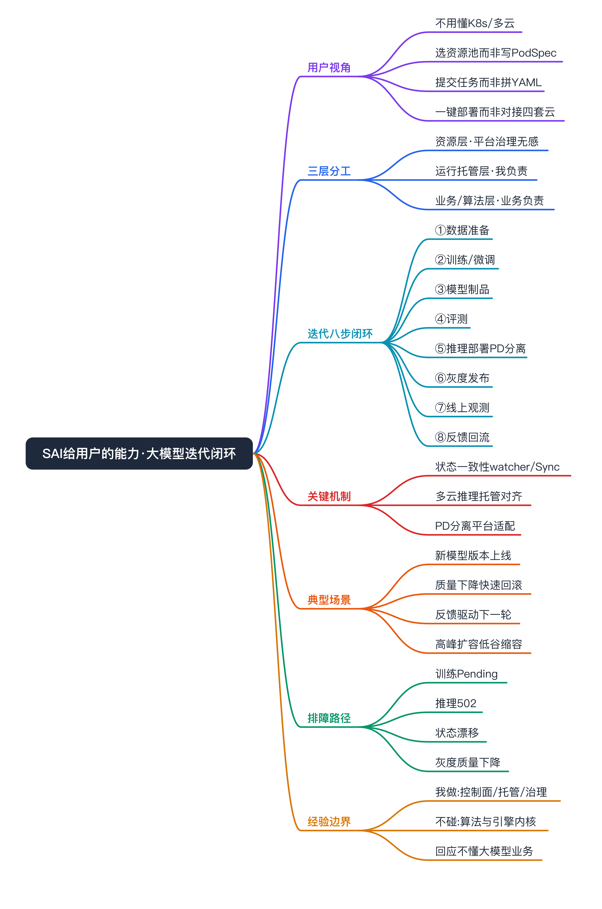
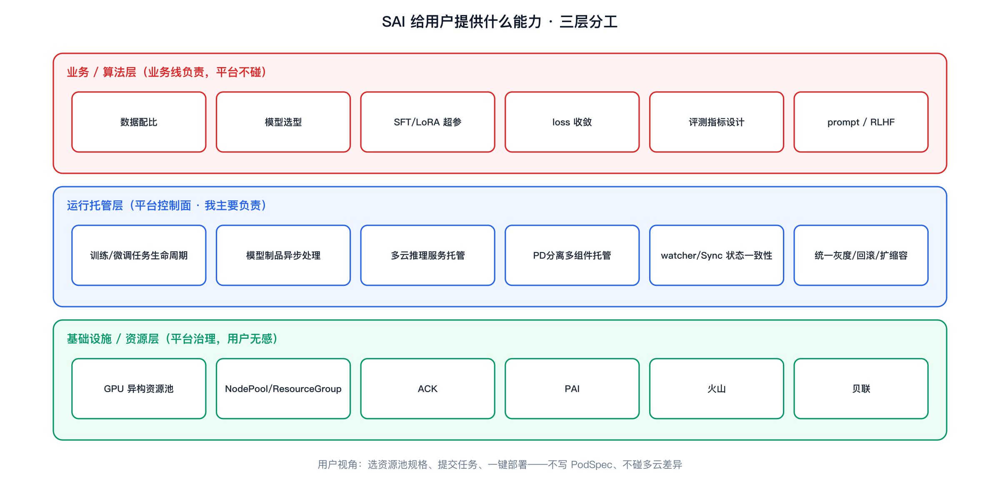
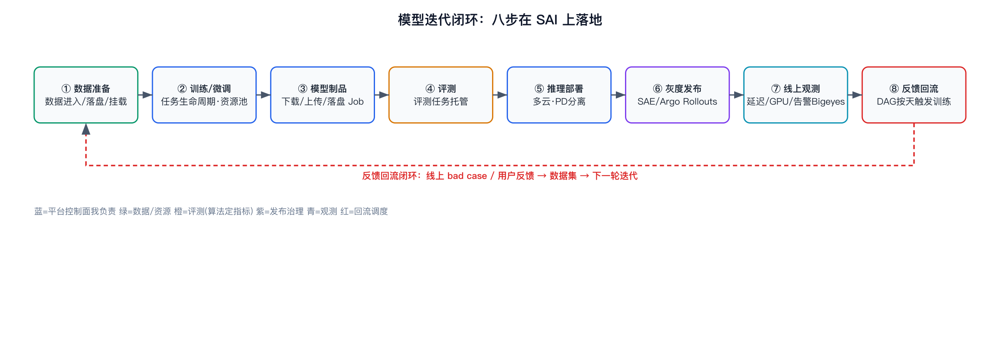
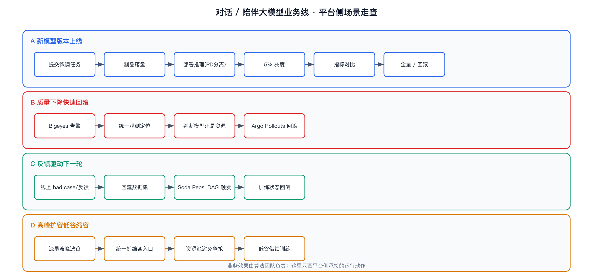
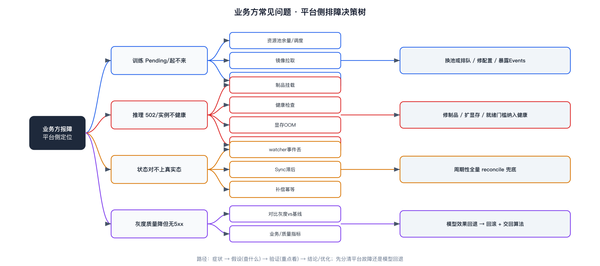

SAI 给用户提供了什么能力 · 一个大模型业务线如何在 SAI 上闭环模型迭代



```yaml
positioning: tech_point_inside_real_project
# 这是 SAI 真实项目里的技术点，写法是「用户/业务视角」而不是控制面代码导览。
# 我真做的：SAI 平台控制面、资源池、任务/服务生命周期、状态一致性、多云推理托管、
#           PD 分离平台侧适配、发布灰度回滚、观测/告警接入、调度 DAG 打通。
# 我不做的：模型选型/数据配比/SFT 超参/loss 收敛、评测指标设计、推理引擎内核(vLLM/SGLang)。
# 写这篇的目的：回应「你不懂大模型业务」——我证明的不是我会调模型，
#           而是我清楚一个大模型业务线的模型迭代闭环里，平台每一步在托管和治理什么。
```

# 面试定位卡

- **技术点**：从用户（算法 / 业务线）视角看 SAI 提供了什么能力，以及一个大模型业务线如何在 SAI 上把「数据 → 训练 → 制品 → 评测 → 推理 → 灰度 → 观测 → 反馈回流」这条模型迭代闭环跑完。
- **所属领域**：AI 平台 / MLOps·LLMOps、训推托管、多云推理、发布治理、可观测。
- **面试价值**：证明我理解大模型业务的**价值链和迭代节奏**，知道平台在其中的边界与价值——不是只会摆控制面接口，也不是假装会调模型。
- **常见考法**：SAI 到底解决了算法同学什么痛点；一次模型迭代在平台上怎么走完；模型上线为什么不是 `kubectl apply`；新模型怎么灰度、怎么回滚；线上反馈怎么回流再训练；你在这条链路里到底做了哪段。
- **适合挂钩项目**：SAI 训练任务生命周期、模型制品异步处理、多云推理托管、PD 分离平台适配、watcher 状态同步、SAE/Argo Rollouts 灰度回滚、Soda Pepsi 调度 DAG 触发训练。
- **不适合夸大的地方**：不要说我定模型方案 / 调超参 / 设计评测指标；不要把算法团队的数据与效果包装成我的成果；不要把 Soul 具体业务的算法细节讲成我掌握的东西。

# 三十秒回答

SAI 给算法和业务线提供的核心能力，是把一次大模型迭代里所有「跟模型质量无关、但又绕不过去」的运行环节产品化：提交训练 / 微调任务、把训练产出变成可复用制品、把模型一键部署成推理服务、灰度放量、线上观测、再把反馈回流触发下一轮训练。算法同学不用分别理解 TFJob、KServe、PAI、火山、贝联和多个集群的差异，看到的是统一的服务画像和统一的运维动作。以一个对话 / 陪伴类大模型业务线为例，模型迭代就是在这条闭环上转圈：算法负责数据和效果，SAI 负责让每一圈都跑得起来、出问题能定位、上线能灰度能回滚、状态不丢。我做的是这条链路的平台控制面和运行治理，不是模型本身。

# 为什么需要它

- **没有它之前的问题**：算法同学要自己面对一堆异构底座——训练得懂 TFJob/PyTorchJob 和节点标签污点，部署得分别学 KServe/PAI/火山/贝联的 API 和状态语义，模型搬运得自己跑 HuggingFace/OSS 下载，上线没有统一灰度回滚，出问题日志事件指标散在各处。模型迭代的瓶颈不在训练本身，而在这些「工程摩擦」。
- **它的解决方式**：SAI 把这些动作收敛成统一控制面——选资源池而不是写 PodSpec，提交任务而不是拼 YAML，一键部署而不是对接四套云 API，统一灰度而不是手工切流量，统一观测入口而不是翻四个平台。底层是 K8s 原生工作负载还是云托管服务，用户无感。
- **它引入的新问题**：统一抽象要付出「语义对齐」的代价——多云的状态、规格、扩缩容、日志口径必须在适配层对齐；长周期任务的真实运行态和平台元数据会漂移，要靠 watcher/Sync 做最终一致性和补偿；统一抽象也意味着平台要为底层每一种新形态（如 PD 分离多组件推理）做适配。
- **必须关注的场景**：模型迭代频繁、需要快速灰度和回滚；推理跨多云多集群；训练是长周期任务、状态不能丢；线上反馈要能稳定回流驱动下一轮迭代。

# 核心概念表

- **用户视角 vs 控制面视角**
  - 解释：用户要的是「把一次迭代跑完」，控制面要的是「把异构底座收敛成统一语义」。这篇通篇站用户视角讲。
  - 面试展开点：面试官质疑「不懂业务」，往往是因为你只会讲控制面接口。把同一套能力翻译成算法同学的动作，就能证明你懂业务。
- **模型迭代闭环（Model Iteration Loop）**
  - 解释：数据 → 训练/微调 → 制品 → 评测 → 推理部署 → 灰度 → 线上观测 → 反馈回流 → 再训练，是大模型业务的基本节奏。
  - 面试展开点：业务竞争力来自「转得快、转得稳」，平台的价值就是缩短和稳住这个圈。
- **模型制品（Model Artifact）**
  - 解释：训练产出的 checkpoint / 权重，经下载、落盘、挂载后成为可被推理服务复用的制品。
  - 面试展开点：制品是训练和推理之间的「交接物」，SAI 这里做的是基础治理（进入平台、落盘、挂载、复用），不是完整 Model Registry，别夸大。
- **多云推理托管**
  - 解释：对上提供统一服务规格 / 状态 / 扩缩容 / 重启 / 迁移，对下适配 KServe/PAI/火山/贝联。
  - 面试展开点：最难的不是调 API，是状态语义、资源规格、日志事件、扩缩容、网络接入口径对齐。
- **PD 分离（Prefill/Decode 分离）**
  - 解释：大模型推理把 Prefill 和 Decode 拆成多组件分别扩缩容。我做的是平台侧把这种多组件形态纳入统一服务托管，不是推理引擎实现。
  - 面试展开点：能讲清「为什么要分离（计算/访存特征不同）」+「我在平台侧适配了什么（多组件部署、资源池划分、状态聚合、观测）」即可。
- **灰度与回滚**
  - 解释：新模型版本按比例放量，对比指标，异常回滚。复用 SAE / Argo Rollouts 能力，叠加变更风控红线。
  - 面试展开点：模型上线和普通服务发布不同——要对比的是业务/质量指标，不只是 5xx。
- **反馈回流**
  - 解释：线上 bad case、用户反馈、对话日志回到数据集，由调度 DAG（Soda Pepsi）按天触发下一轮训练并回传状态，闭环。
  - 面试展开点：这是「闭环」的关键一笔——没有自动回流，迭代就靠人工搬运，转不快。

# 原理模型



自底向上看「SAI 给用户提供什么能力」，关键是分清每一层谁负责：

## 基础设施 / 资源层（平台治理，用户无感）

- GPU 异构资源池：独占 / 共享显存 / 抢占 / CPU 池，通过 NodePool / ResourceGroup 抽象，把节点标签、污点容忍、GPU 插件字段收敛成「选资源池」。
- 多云多集群：ACK、PAI、火山、贝联，底座差异由适配层隔离。
- 用户在这层只做一个动作：选资源池规格。不写 PodSpec、不碰节点标签。

## 运行托管层（平台控制面，我主要负责）

- 训练 / 微调任务：创建、多角色副本、镜像、数据挂载、TensorBoard、克隆、重启、迁移、变配、状态/日志/事件。
- 模型制品：HuggingFace/OSS 下载、上传、落盘、挂载（长耗时走 Job Runtime，不堵同步 API）。
- 推理服务：统一规格、实例状态、扩缩容、重启、迁移、状态同步；PD 分离多组件托管。
- 状态一致性：watcher/Sync 处理长周期任务的运行态回写与补偿。

## 业务 / 算法层（业务线负责，平台不碰）

- 数据配比、模型选型、SFT/LoRA 超参、loss 收敛、评测指标设计、prompt/RLHF。
- 业务效果指标的定义和达标判断。
- 这层是算法团队的主场，我能讲「平台怎么承接它的运行需求」，不讲「模型怎么调」。

# 关键机制

## 模型迭代闭环：八步在平台上怎么落地



解决的问题：让一个大模型业务线的每一轮迭代都能在平台上自助跑完，且每步状态可见、出错可补偿。

工作方式（以对话 / 陪伴类大模型为例）：

- **① 数据准备**：算法准备对话语料 / 反馈数据。平台提供数据进入、落盘、挂载（OSS / 存储）。
- **② 训练 / 微调**：算法提交 SFT/LoRA 训练任务，选 GPU 资源池、多角色副本、镜像、数据挂载，TensorBoard 看曲线。平台管任务生命周期、资源池、状态/日志/事件、watcher 补偿。
- **③ 模型制品**：训练产出 checkpoint → 经下载/上传/落盘成为可部署制品。长耗时走 Job Runtime，不堵同步控制面。
- **④ 评测**：算法定义评测，平台把评测当作一个可运行的任务 / 服务托管起来；指标好坏由算法判定。
- **⑤ 推理部署**：把模型部署成推理服务，多云无感（KServe/PAI/火山/贝联），大模型走 PD 分离多组件。平台提供统一规格、状态、扩缩容。
- **⑥ 灰度发布**：新模型版本按比例放量（SAE / Argo Rollouts），对比业务与质量指标，异常回滚，叠加变更风控红线。
- **⑦ 线上观测**：QPS、延迟（含 TTFT / TPS）、GPU 利用、错误率，告警走 Bigeyes，排障有统一入口。
- **⑧ 反馈回流**：线上 bad case / 用户反馈 / 对话日志回到数据集 → Soda Pepsi 调度 DAG 按天触发下一轮训练并回传状态 → 回到 ①。

代价：闭环里每一步的「状态」都要可靠回传，否则平台元数据和真实运行态漂移，灰度和回流会基于错误状态做决策；多云让「同一个动作」在四套底座上语义不同，适配层是长期维护成本。

面试追问：哪一步最容易掉链子？我的回答是 ②④⑧ 这类长周期 / 跨系统环节——它们不是一个同步 API 能返回的，靠 watcher/Sync 和调度 DAG 兜最终一致性。

## 状态一致性：闭环转得动的前提

解决的问题：训练任务、推理服务、定时任务、制品下载都是长周期，真实运行态变化不会同步回到平台。

工作方式：watcher 监听底层（K8s 事件 / 云托管状态）→ Sync 回写平台元数据 → 对失败 / 漂移做补偿重试。短链路动作同步返回，长周期状态交给异步层。

代价：异步带来「最终一致」的时间窗，平台展示的状态可能短暂落后真实态；补偿逻辑要幂等，否则重复动作会放大故障。

面试追问：watcher 挂了怎么办？答：要有兜底全量对账（周期性 reconcile），不能只靠事件流，事件会丢。

## 多云推理托管：一键部署背后的对齐

解决的问题：让用户「部署一个推理服务」时不用关心底层是 KServe 还是 PAI 还是贝联。

工作方式：适配层把每种托管形态的 API、资源模型、状态语义、扩缩容、日志事件、网络接入口径统一成平台服务画像。

代价：每接入一种新底座 / 新形态（如 PD 分离），都要补一遍适配，抽象不是免费的。

面试追问：PD 分离你做了什么？答：平台侧把 Prefill/Decode 多组件表达成一个统一服务、做资源池划分、状态聚合、扩缩容入口和观测接入；推理引擎内部的调度和显存我不碰。

# 横向对比

- **普通微服务发布 vs 大模型版本迭代**：普通发布看 5xx / 延迟就够；模型迭代还要对比业务与质量指标（回答质量、bad case 率），灰度判据更复杂，回滚要连模型版本一起回。
- **训练任务 vs 推理服务（平台视角）**：训练是长周期批任务、可重试、状态终态明确（成功/失败）；推理是常驻服务、看 SLA、要扩缩容和滚动更新。平台对两者的生命周期语义不同。
- **同步控制面 vs 异步状态层**：短链路动作（创建、变配、重启）同步返回；长周期状态（训练进度、下载、第三方服务态）交给 watcher/Sync，否则请求阻塞、状态不可补偿。
- **模型制品基础治理 vs 完整 Model Registry**：SAI 做的是制品进入平台、落盘、挂载、复用；版本血缘、审批、签名这类完整 Registry 能力不要包装成已做。
- **平台能力 vs 算法能力**：平台缩短和稳住迭代圈（工程摩擦），算法决定每一圈的效果（模型质量）。两者都重要，但别越界。

# 典型业务场景



以一个对话 / 陪伴类大模型业务线为例（业务效果由算法团队负责，这里讲平台侧怎么承接）：

- **场景 A：业务要上线一个新的对话模型版本**
  - 为什么相关：典型一次完整迭代。
  - 平台侧动作：算法提交微调任务 → 制品落盘 → 部署成推理服务（PD 分离）→ 5% 灰度 → 指标对比 → 全量或回滚。
  - 我的角色：训练任务托管、制品处理、多云推理部署、灰度回滚链路。
- **场景 B：线上对话质量下降，要快速回滚**
  - 现象：bad case 上升 / 延迟变高 / 错误率上升。
  - 平台侧动作：Bigeyes 告警 → 统一观测入口定位是模型版本还是资源问题 → Argo Rollouts 回滚到上一个稳定版本。
  - 优化方向：灰度阶段就把质量指标纳入判据，不要等全量才发现。
- **场景 C：反馈数据要驱动下一轮迭代**
  - 现象：线上积累了 bad case 和用户反馈。
  - 平台侧动作：数据回流到数据集 → Soda Pepsi DAG 按天触发训练 → 状态回传平台 → 新制品进入下一轮。
  - 我的角色：调度 DAG 与训练任务的打通、状态回传。
- **场景 D：推理高峰扩容、低谷缩容**
  - 现象：对话流量有明显波峰波谷。
  - 平台侧动作：统一扩缩容入口调整推理实例；资源池治理避免和训练任务争抢 GPU。
  - 优化方向：训推资源协同（见训推混部），低谷把空闲 GPU 借给训练。

# 排障路径



站在平台侧，业务同学最常抛过来的几类问题，按「症状 → 假设 → 验证 → 指标 → 结论 → 优化」走：

- **症状：训练任务提交后一直 Pending / 起不来**
  - 假设：资源池无可用 GPU / 镜像拉取失败 / 数据挂载失败 / 配额限制。
  - 验证：看任务事件（Events）、Pod 调度状态、资源池余量、镜像与挂载报错。
  - 重点看：是调度阶段卡住（资源/亲和）还是启动阶段卡住（镜像/挂载/权限）。
  - 结论 / 优化：资源不足→换池或排队；镜像/挂载→修配置；给用户在控制台直接暴露事件，减少来回问。
- **症状：推理服务部署后 502 / 实例不健康**
  - 假设：模型制品没挂上 / 健康检查不过 / 显存 OOM / PD 多组件没就绪。
  - 验证：看实例状态、日志、事件、GPU 显存利用；PD 分离要看 Prefill 和 Decode 是否都就绪。
  - 重点看：是制品/启动问题，还是运行期 OOM，还是多组件协同未就绪。
  - 结论 / 优化：制品路径/挂载修复；规格不足扩显存；多组件就绪门槛纳入服务健康判定。
- **症状：平台显示状态和真实运行态对不上**
  - 假设：watcher 事件丢失 / Sync 滞后 / 补偿未触发。
  - 验证：看 watcher/Sync 链路是否健康、最后同步时间、是否有兜底对账。
  - 重点看：是事件流断了，还是补偿幂等出问题。
  - 结论 / 优化：周期性全量 reconcile 兜底，不只依赖事件流。
- **症状：新模型灰度后质量下降但 5xx 正常**
  - 假设：模型效果回退（算法问题），不是工程故障。
  - 验证：对比灰度组与基线组的业务 / 质量指标，而不只看 HTTP 错误。
  - 重点看：分清「平台故障」还是「模型效果回退」——这是平台和算法的分工边界。
  - 结论 / 优化：回滚模型版本，把质量指标接入灰度判据；问题交回算法团队。

# 风险、边界和误区

- **说法：「Soul AI 陪伴大模型是我做的」** → 问题：会被追问算法细节当场击穿。更稳妥：「这个业务线的模型迭代是在 SAI 上托管的，我负责平台控制面和运行治理，模型方案和效果是算法团队的。」
- **说法：「我做了 Model Registry」** → 问题：SAI 只做制品基础治理。更稳妥：「我做的是模型制品进入平台、落盘、挂载、复用，不是完整的版本血缘 / 审批 Registry。」
- **说法：「PD 分离是我实现的」** → 问题：那是推理引擎能力。更稳妥：「PD 分离的推理引擎不是我做的，我做的是平台侧把多组件形态纳入统一服务托管和观测。」
- **说法：「灰度能保证模型零风险上线」** → 问题：过度承诺。更稳妥：「灰度降低风险，关键是把业务 / 质量指标纳入判据并能快速回滚。」
- **说法：随口给业务指标（如「迭代效率提升 X%」）** → 问题：编造数据。更稳妥：只讲机制和我承接的环节，不报没有依据的业务收益。
- **边界**：算法侧（数据配比、超参、收敛、评测指标、prompt/RLHF）和推理引擎内核（vLLM/SGLang 调度与显存）我不碰，老老实实说。

# 和项目的安全连接

## 了解型说法

我理解一个大模型业务线的模型迭代闭环：数据 → 训练 → 制品 → 评测 → 推理 → 灰度 → 观测 → 反馈回流。我清楚每一步对平台提出什么运行需求，以及平台和算法团队的分工边界。

## 排查型说法

业务同学的问题我能从平台侧定位：训练起不来看调度/镜像/挂载，推理 502 看制品/健康/显存/多组件就绪，状态对不上看 watcher/Sync 和兜底对账，灰度质量下降先分清是平台故障还是模型回退。

## 实践型说法

我真实做的是这条链路的平台控制面和运行治理：训练任务生命周期、模型制品异步处理、多云推理托管、PD 分离平台侧适配、watcher 状态同步、SAE/Argo Rollouts 灰度回滚、Soda Pepsi 调度 DAG 触发训练并回传状态。

## 不能说的话

不说我定模型方案 / 调超参 / 设计评测；不说我实现了推理引擎或 PD 分离引擎；不说我做了完整 Model Registry；不报没有依据的业务效果数据；不把 Soul 具体业务的算法细节讲成我掌握的。

# 面试追问树

- 基础概念
  - SAI 到底给用户提供了什么？→ 把模型迭代里跟模型质量无关但绕不过去的运行环节产品化。
  - 用户是谁？→ 算法、模型服务、平台运维团队。
- 原理
  - 为什么要分三层（资源 / 运行托管 / 业务）？→ 谁负责什么要分清，平台不越界碰算法。
  - 为什么短链路同步、长周期异步？→ 长周期任务一个 API 返不了，会阻塞且不可补偿。
- 机制
  - 模型迭代八步哪步最容易掉链子？→ 长周期 / 跨系统的训练、评测、回流，靠 watcher/Sync 和 DAG 兜底。
  - watcher 挂了 / 事件丢了怎么办？→ 周期性全量 reconcile 兜底。
  - 多云推理统一难在哪？→ 状态语义、规格、扩缩容、日志、网络口径对齐。
- 场景
  - 新模型上线完整走一遍？→ 微调 → 制品 → 部署(PD分离) → 灰度 → 对比 → 全量/回滚。
  - 反馈怎么回流？→ bad case/反馈回数据集 → Soda Pepsi DAG 触发训练 → 状态回传。
- 排障
  - 训练 Pending / 推理 502 / 状态漂移 / 灰度质量下降分别怎么查？→ 见排障路径。
- 项目连接
  - 这条链路里你具体做了哪段？→ 平台控制面、资源池、生命周期、状态一致性、多云托管、PD 适配、灰度回滚、调度打通。
- 边界
  - 模型效果是你负责的吗？→ 不是，算法团队负责，我负责让迭代跑得起来、稳得住。

# 高频 Q&A

- **SAI 一句话给用户提供什么？** 把一次大模型迭代里所有「跟模型质量无关但绕不过去」的运行环节产品化成统一动作，让算法同学不用理解 K8s 和多云差异。
- **一次模型迭代在 SAI 上怎么走完？** 数据挂载 → 提交训练 → 制品落盘 → 评测托管 → 多云部署推理 → 灰度放量 → 线上观测 → 反馈回流触发下一轮，八步成环。
- **模型上线为什么不是 kubectl apply？** 要管制品挂载、多云适配、灰度判据（含业务/质量指标）、回滚、状态一致性和观测，这些 apply 不解决。
- **新模型怎么灰度怎么回滚？** SAE/Argo Rollouts 按比例放量，对比业务与质量指标，异常回滚到上一个稳定版本，叠加变更风控红线。
- **线上反馈怎么回流再训练？** bad case / 反馈 / 对话日志回到数据集，Soda Pepsi 调度 DAG 按天触发训练并回传状态，形成闭环。
- **平台怎么保证状态不丢？** 短链路同步返回，长周期交给 watcher/Sync 做最终一致和补偿，再加周期性全量对账兜底。
- **PD 分离你做了什么？** 平台侧把 Prefill/Decode 多组件纳入统一服务托管：多组件部署、资源池划分、状态聚合、扩缩容入口、观测接入；引擎内核不碰。
- **多云推理统一最难的是什么？** 不是调 API，是状态语义、资源规格、扩缩容、日志事件、网络接入口径对齐。
- **灰度质量下降但没 5xx 怎么判断？** 对比灰度组和基线组的业务/质量指标，分清是平台故障还是模型效果回退，后者交回算法团队。
- **你在这条链路里到底做了哪段？** 平台控制面、资源池、训练/推理生命周期、状态一致性、多云托管、PD 适配、灰度回滚、调度 DAG 打通——不碰算法和引擎内核。
- **怎么回应「你不懂大模型业务」？** 我证明的不是会调模型，而是清楚这个业务的模型迭代闭环里平台每一步在托管和治理什么，以及平台和算法的边界。

# 三档背诵版

- **30 秒**：SAI 把大模型迭代里跟模型质量无关、但绕不过去的运行环节产品化——提交训练、制品落盘、一键部署推理、灰度、观测、反馈回流。算法负责效果，平台负责让每一圈迭代跑得起来、稳得住、出错能定位。我做的是这条链路的控制面和运行治理。
- **3 分钟**：+ 背景（算法同学原来要自己面对 TFJob/多云/制品搬运/无统一灰度的工程摩擦）+ 机制（八步闭环怎么在平台落地、长周期靠 watcher/Sync 和调度 DAG 兜最终一致）+ 排障（训练 Pending、推理 502、状态漂移、灰度质量下降怎么查）。
- **5 分钟**：+ 对比（普通发布 vs 模型迭代、训练 vs 推理、制品治理 vs Registry、平台 vs 算法）+ 边界（算法和引擎内核我不碰）+ 项目连接（训练生命周期、制品异步、多云托管、PD 适配、SAE/Rollouts 灰度、Soda Pepsi 触发训练都是我真做的）。

# 图示清单

- `00_llm_business_iteration_overview_mindmap.png` — 全文总览思维导图。
- `01_llm_business_iteration_principle.png` — 平台在模型生命周期中的三层位置。
- `02_llm_business_iteration_mechanism.png` — 模型迭代八步闭环。
- `03_llm_business_iteration_scenario.png` — 对话/陪伴大模型业务线场景走查。
- `04_llm_business_iteration_troubleshooting.png` — 业务方常见问题平台侧排障决策树。

# 面试前检查清单

- [ ] 能 30 秒讲清 SAI 给用户提供什么能力（用户视角，不是接口清单）。
- [ ] 能完整说出模型迭代八步闭环并指出哪步最易掉链子。
- [ ] 能讲清平台 / 算法的分工边界，不越界也不缩水。
- [ ] 能说明短链路同步、长周期异步、兜底对账的取舍。
- [ ] 能讲多云推理统一和 PD 分离平台侧适配各做了什么。
- [ ] 能按「症状→假设→验证→优化」讲至少 3 个业务方常见问题排障。
- [ ] 知道哪些不能夸大（模型方案 / Registry / 引擎 / 业务指标）。
- [ ] 能用一句话回应「你不懂大模型业务」并守住边界。
- [ ] 含原理图、机制图、排障图。
