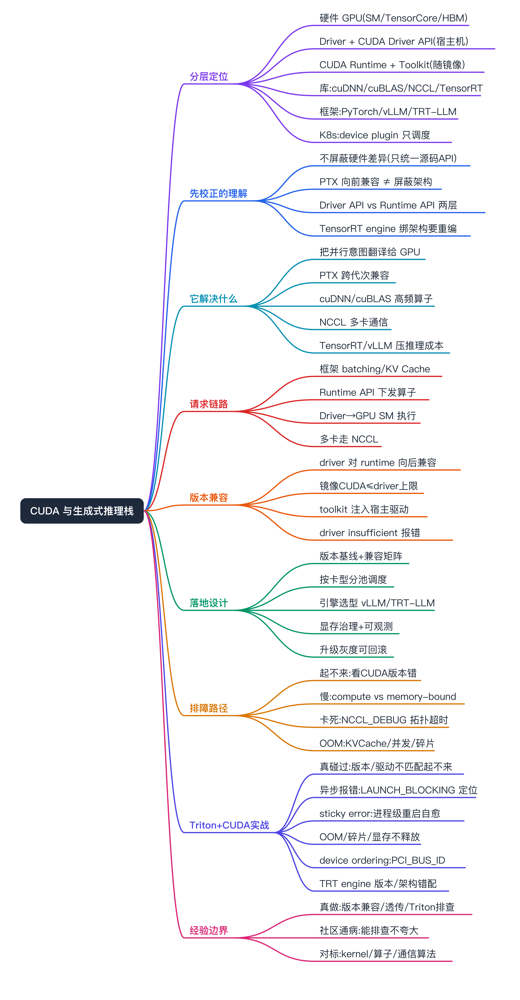
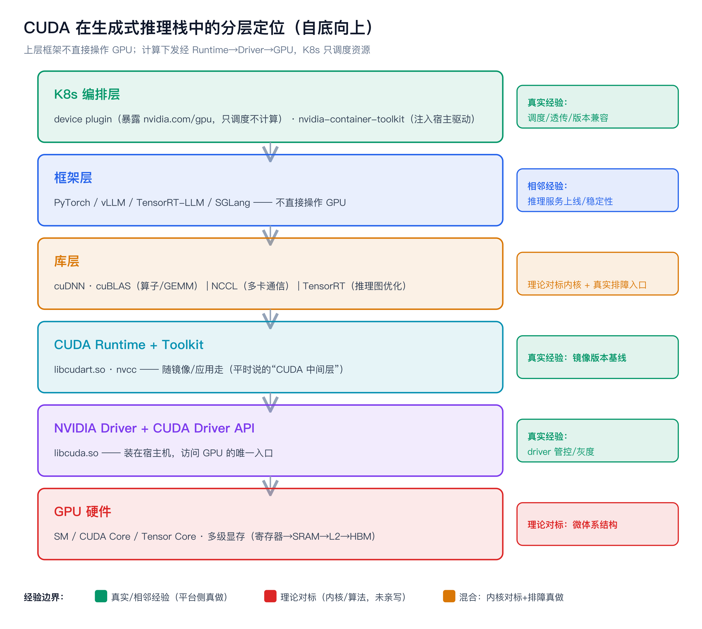
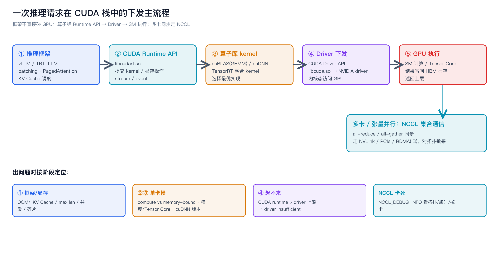
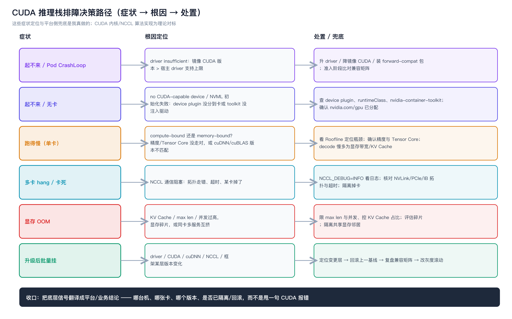
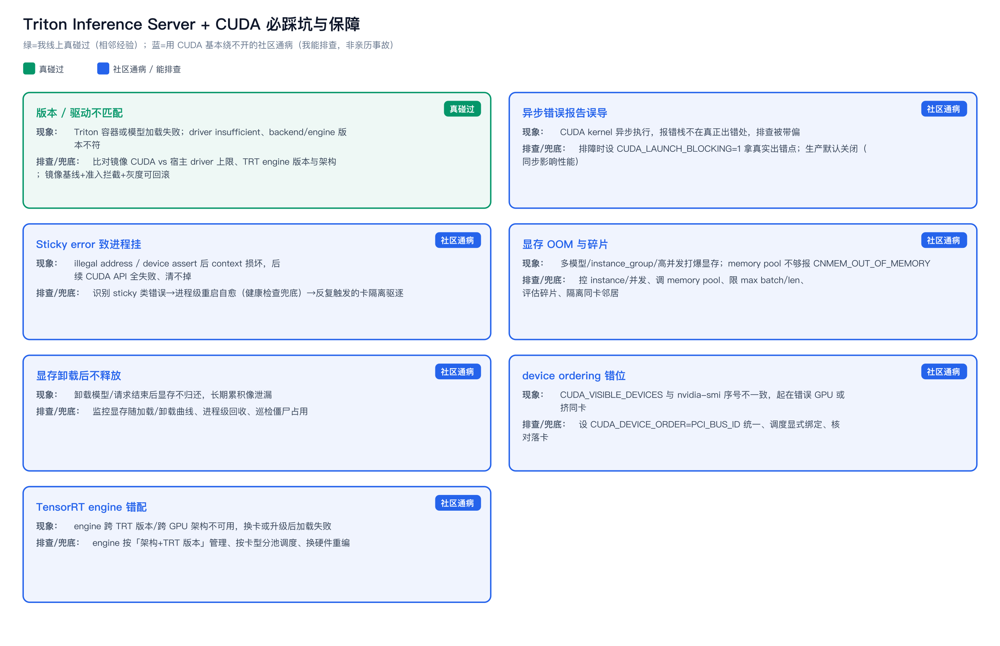

CUDA 与生成式推理技术栈（面试对标）



```yaml
experience_level: adjacent_production_experience
# 平台/SRE 侧（GPU 资源池、device plugin 调度、推理服务上线、镜像与 driver/CUDA 版本兼容、显存 OOM / 起不来 / NCCL 卡死的排障兜底）是我真实做过的相邻经验。
# 线上 Triton Inference Server 真碰过的：CUDA/驱动版本不匹配导致服务起不来 / 模型加载失败（这一类我有实操印象，写成相邻经验）。
# 其余「用 CUDA 基本绕不开」的社区通病（sticky error、异步报错误导、显存碎片/不释放、device ordering、TensorRT engine 版本错配）：我能讲清原理与排查路径，但不包装成自己亲历的故障。
# 内核侧（CUDA kernel / cuDNN 算子开发、PTX/SASS 编译细节、TensorRT 图优化内部实现、NCCL 通信算法）是理论对标，不是我写的。
# 这篇把「CUDA 在生成式推理栈里到底是哪一层、上下怎么对接、版本怎么兼容、出问题从哪查」拼成一篇，给散在各处的 GPU/推理文档补上 CUDA 这块地基。
```

# 经验边界

先把边界说清楚，避免被一插到底击穿：

- **我真实做过的（相邻经验，能讲数据模型和取舍）**：推理/训练服务在 K8s 上的上线与运维、GPU 资源池与 device plugin 调度（`nvidia.com/gpu`、nodeSelector/taint/affinity）、镜像里 CUDA/cuDNN 版本与宿主机 driver 的兼容性问题、**线上 Triton Inference Server 因 CUDA/驱动版本不匹配起不来 / 模型加载失败的排查**、显存 OOM / Pod 起不来这类故障的排障与兜底、推理服务的容量与稳定性接入。
- **我没直接做过的（理论对标，不能包装）**：CUDA kernel 与 cuDNN/cuBLAS 算子开发、PTX/SASS 编译与寄存器调优、TensorRT 图优化与 plugin 开发、NCCL 通信算法实现、vLLM 调度器内核改造——这些我能讲清「为什么这么设计、对运维意味着什么」，但不是我写的。
- **面试一句话**：「CUDA 内核和算子层我是对标理解；CUDA 在推理栈里处于哪一层、driver/runtime/库/框架怎么版本对齐、容器里怎么透传驱动、显存和 NCCL 出问题怎么排查兜底，是我平台侧真做的。哪些真做、哪些理论我会说清。」
- **配套文档**：GPU 原理底座见 [gpu-fundamentals](../gpu-fundamentals/gpu-fundamentals.md)、稳定性体系见 [gpu-stability](../../apm-sre/gpu-stability/gpu-stability.md)、排障细节见 [gpu-troubleshooting](../gpu-troubleshooting/gpu-troubleshooting.md)、卡间/机间通信见 [gpu-rdma](../gpu-rdma/rdma.md)、推理服务化见 [inference-serving-sre](../inference-serving-sre/inference_serving_framework_sre.md)、Prefill/Decode 分离见 [pd-separation](../pd-separation/pd-separation.md)。本篇是它们共用的「CUDA 软件栈」地基。

# 为什么需要掌握

- **面试高频底座**：生成式推理 SRE / AI Infra 岗，几乎所有「服务起不来、跑得慢、多卡卡死、升级后挂了」的问题，最后都落到 CUDA 这一层的版本对齐、显存、通信上。说不清 CUDA 在栈里的位置，稳定性问题就讲不到根因。
- **和我经验相邻**：我做的是推理服务上线和排障兜底，理解 CUDA 栈才能解释「为什么这个镜像在这台机器起不来」「为什么换了卡 TensorRT engine 要重编」「为什么 NCCL 超时」。
- **能解释云托管/框架背后的通用语义**：把「vLLM 帮我跑起来了、平台帮我选了镜像」翻译成「driver → CUDA runtime → cuDNN/NCCL → 框架」这条链路本来要解决什么、哪一环会断。

# 先校正几条常见理解（面试易被追问）

这几条是我之前的直觉，对标后做了修正，正好是面试官爱挖的点：

- **「CUDA 屏蔽了不同型号 GPU 差异，暴露统一 API」——半对，要修正。**
  - 对的部分：CUDA 统一了**编程模型和源码级 API**，并通过 **PTX 中间表示 + 驱动 JIT 编译**提供**向前兼容**（老二进制能在新架构上跑）。
  - 要修正的部分：它**没有屏蔽硬件差异**。你仍要面对 **compute capability（`sm_70/sm_80/sm_90`…）**、Tensor Core 有无与代次、显存大小、是否要为目标架构编译。同一份代码能跑 ≠ 跑得一样快、功能一样全（比如 FP8 只有较新架构有）。
  - 反例锤：**TensorRT engine 绑定 GPU 架构 + TRT 版本，跨架构不能直接搬**；为 A100 编的 engine 拿到 H100/L20 上要重编。这说明「统一 API」止步于源码层，二进制/性能层差异是实打实的。
- **「CUDA 是一个中间层」——要拆成两层说。**
  - **CUDA Driver API**：底层，`libcuda.so`，**随 NVIDIA driver 一起装在宿主机**。
  - **CUDA Runtime API**：上层、更易用，`libcudart.so`，**随 CUDA toolkit / 应用镜像走**。
  - 绝大多数「版本不匹配起不来」都出在：容器里的 CUDA runtime 版本 > 宿主机 driver 能支持的上限。
- **「cuDNN/NCCL/TensorRT 都是加速库」——职责不同，别混。**
  - **cuDNN / cuBLAS**：算子 / 数学库（卷积、矩阵乘、attention 原语）。
  - **NCCL**：多卡多机**集合通信**库（all-reduce / all-gather），分布式训练和大模型张量并行推理的通信底座。
  - **TensorRT**：推理**图优化 + runtime**（算子融合、精度量化、kernel 自动选择）。
  - 排障入口完全不同：慢 → 看算子/cuDNN；多卡卡死 → 看 NCCL；engine 编不出/跑不了 → 看 TensorRT。
- **「K8s 负责 GPU 计算」——不负责，只调度。**
  - K8s 通过 **device plugin** 把 GPU 暴露成可调度资源（`nvidia.com/gpu`），只管「把卡分给哪个容器」。
  - 容器真正用上 GPU 还靠 **nvidia-container-toolkit 把宿主机 driver 库注入容器**；容器镜像里只装 CUDA runtime/cuDNN/框架。计算本身全在 GPU + driver + CUDA 这条链上。

# 它解决什么问题（CUDA 为什么存在）

按问题域理解，而不是背 API：

- **GPU 是专用并行硬件，不能像 CPU 那样直接跑通用代码**
  - 对应能力：CUDA 提供 SIMT 编程模型（grid / block / thread、kernel 启动），让开发者用类 C++ 描述大规模并行计算，再由编译器/驱动下发到 SM 执行。
  - 面试表达：CUDA 是「把并行计算意图翻译成 GPU 能执行的指令」的那一层，没有它每家框架都要直接写硬件。
- **GPU 架构每代都在变，软件不能每代重写**
  - 对应能力：源码编成 **PTX（虚拟 ISA）**，运行时由驱动 JIT 成具体架构的 **SASS**，提供向前兼容；同时允许为特定架构 AOT 编译拿到最佳性能。
  - 面试表达：PTX 是 CUDA 的「字节码」，这是它能跨代次的关键，但不等于屏蔽了架构差异。
- **DNN / 大模型的核心算子要极致优化，框架自己写不划算**
  - 对应能力：cuDNN（卷积/attention）、cuBLAS（GEMM）把高频算子做成厂商深度优化的库，框架直接调。
  - 面试表达：PyTorch 的矩阵乘最终大多落到 cuBLAS/cuDNN，不是它自己手写 kernel。
- **单卡装不下 / 算不动，要多卡多机协同**
  - 对应能力：NCCL 在 NVLink/PCIe/RDMA 之上做集合通信，框架（DDP、张量并行、vLLM 多卡）调它做梯度/激活同步。
  - 面试表达：分布式的瓶颈常在通信，NCCL + 拓扑决定了 all-reduce 走得快不快，详见 [gpu-rdma](../gpu-rdma/rdma.md)。
- **推理要在固定硬件上压成本、提吞吐**
  - 对应能力：TensorRT（图优化/量化/kernel 选择）、以及 vLLM 这类引擎（PagedAttention、continuous batching）把通用框架的推理压到生产可用。
  - 面试表达：训练框架直接上线推理往往又慢又贵，推理引擎是专门解决 latency/吞吐/显存的。
- **生产要在容器和 K8s 里跑这一切，环境必须可复现**
  - 对应能力：driver 装宿主机、CUDA/cuDNN 装镜像、nvidia-container-toolkit 做透传、device plugin 做调度，把「这台机器能不能跑这个模型」变成可声明、可调度的问题。
  - 面试表达：CUDA 栈的版本对齐 + 容器透传，是推理服务能不能稳定上线的前提。

# 核心概念（分层理解）



从下到上一层层说，每层只讲面试相关的，附「和我经验的映射 / 可能被追问点」。

## 硬件层：GPU

- **一句话**：SM（流多处理器）+ CUDA Core / Tensor Core + 多级显存（寄存器 / shared memory / L2 / HBM）。
- **面试关键**：compute capability（`sm_90` 等）标识架构能力；Tensor Core 决定低精度矩阵乘吞吐；HBM 带宽决定 memory-bound 任务上限。详见 [gpu-fundamentals](../gpu-fundamentals/gpu-fundamentals.md)。
- **追问点**：为什么大模型 decode 阶段是 memory-bound（卡显存带宽，不是算力）。

## 驱动层：NVIDIA Driver + CUDA Driver API

- **一句话**：内核态驱动 + `libcuda.so`（CUDA Driver API），是 OS/用户态访问 GPU 的唯一入口，随驱动安装在**宿主机**。
- **面试关键**：driver 有「最高支持的 CUDA 版本」；driver 对 CUDA runtime 是**向后兼容**（新 driver 能跑老 runtime），反过来不行。
- **可能被追问**：`CUDA driver version is insufficient for CUDA runtime version` 是什么意思、怎么解（升 driver 或降镜像 CUDA，或用 forward-compat 包）。

## 平台层：CUDA Runtime + Toolkit

- **一句话**：`libcudart.so`（Runtime API，更易用）+ nvcc 编译器 + 一堆头文件/库，**随镜像/应用走**。
- **面试关键**：这是「CUDA 中间层」里大家平时说的那层；它把 kernel 启动、显存管理、stream/event 封装成好用的 API。
- **可能被追问**：Driver API 和 Runtime API 区别（一个随驱动、一个随应用；Runtime 基于 Driver 之上）。

## 库层：cuDNN / cuBLAS / NCCL / TensorRT / CUTLASS

- **cuDNN**：DNN 算子（卷积、attention、归一化等）的深度优化库。
- **cuBLAS / CUTLASS**：GEMM（矩阵乘）库 / 模板库；大模型几乎所有线性层都落在这里。
- **NCCL**：集合通信（all-reduce/all-gather/broadcast），多卡多机训练与张量并行推理的通信底座；对拓扑（NVLink/PCIe/IB）敏感。
- **TensorRT**：推理图优化 + runtime；engine 绑定架构 + 版本，不可跨架构搬。
- **追问点**：「服务变慢」从哪查起——单卡慢看算子（cuDNN/cuBLAS、是否走 Tensor Core、精度）；多卡慢/卡死看 NCCL（拓扑、超时、`NCCL_DEBUG`）。

## 框架层：PyTorch / vLLM / TensorRT-LLM / SGLang

- **一句话**：上层框架**不直接操作 GPU**，而是通过 CUDA Runtime / Driver API + cuDNN/cuBLAS/NCCL/TensorRT 把计算和通信下发到 GPU。
- **面试关键**：训练多用 PyTorch（+ DDP/FSDP，底层 NCCL）；推理多用 vLLM / TensorRT-LLM / SGLang（PagedAttention、continuous batching、量化）。
- **追问点**：vLLM 为什么比「PyTorch 裸跑」省显存、吞吐高（PagedAttention 管 KV Cache、continuous batching 提利用率）。详见 [inference-serving-sre](../inference-serving-sre/inference_serving_framework_sre.md)。

## 编排层：K8s GPU 调度

- **device plugin**：把 GPU 注册成 `nvidia.com/gpu` 可调度资源，K8s 据此把卡分给 Pod；不做计算。
- **nvidia-container-toolkit / runtime**：容器启动时把宿主机 driver 用户态库注入容器，让容器内 CUDA runtime 能找到 driver。
- **版本兼容三要素**：宿主机 driver 版本 ≥ 镜像 CUDA runtime 需要的下限；cuDNN/NCCL 与框架版本匹配；MIG/MPS/共享显存的隔离方式。
- **追问点**：节点升级 driver 后部分 Pod 起不来 / CUDA 报错怎么定位（见排障章节）。

# 一次推理请求在这套栈里怎么走



把链路串起来，面试能讲清「请求到底经过哪些层」：

- 请求进入推理框架（vLLM/TRT-LLM）→ 框架做 batching / KV Cache 调度（PagedAttention、continuous batching）。
- 框架把算子（attention、GEMM）通过 **CUDA Runtime API** 提交，落到 **cuBLAS/cuDNN/TensorRT kernel**。
- Runtime API 经 **Driver API → NVIDIA driver** 把 kernel 启动和显存操作下发到 **GPU 的 SM** 执行，结果写回 HBM 显存。
- 多卡场景：跨卡的张量并行/数据同步通过 **NCCL** 走 NVLink/PCIe/RDMA 完成。
- 容器/K8s 视角：这台 Pod 能跑，前提是 device plugin 把卡分给了它、toolkit 把 driver 注入了容器、镜像里的 CUDA/cuDNN/NCCL 与宿主 driver 对齐。

# 如果让我落地，我会怎么设计（假设落地，不是已落地）

以「在 K8s 上稳定跑生成式推理服务」为目标：

- **镜像与版本基线**：固定一套「driver 版本 ↔ CUDA runtime ↔ cuDNN/NCCL ↔ 框架」兼容矩阵，镜像里只装 CUDA runtime/库，driver 由节点统一管控；用基线镜像而不是让业务各编各的。
- **节点与调度**：device plugin 暴露 `nvidia.com/gpu`；按卡型分池（A100/H100/L20 等）打 label/taint，避免「engine 编给 A 架构却调度到 B 架构」；需要细粒度共享时评估 MIG（硬隔离）vs MPS（软隔离）vs time-slicing（无显存隔离、慎用）。
- **推理引擎选型**：通用大模型在线服务优先 vLLM/SGLang（PagedAttention + continuous batching）；极致延迟/固定模型考虑 TensorRT-LLM（但 engine 绑架构、构建成本高、灵活性低）。先给约束再给结论，不说「某个最好」。
- **显存治理**：限制 max model len / KV Cache 占比、设置并发上限，避免长上下文打爆显存；监控显存碎片与 OOM。
- **可观测**：DCGM exporter 出 GPU 利用率/显存/温度/XID/ECC；框架侧出 token 吞吐、首 token 延迟、batch 利用率、NCCL 通信耗时；driver/CUDA 错误进日志告警。
- **故障诊断与兜底**：标准化排查路径（见下节）；坏卡（XID/ECC）自动隔离驱逐；版本不匹配在 CI/准入阶段拦截。
- **风险控制**：driver/CUDA 升级灰度（按节点池滚动）、可回滚镜像、保留旧基线一段时间，避免一次性全量升级把推理打挂。

# 如果线上出问题，我怎么排查



可操作的路径，按「从平台到底层」收敛：

- **Pod 起不来 / CUDA 报错**：看 Pod event 与容器日志 → `CUDA driver version is insufficient for CUDA runtime version` → 比对节点 driver 支持的 CUDA 上限 vs 镜像 CUDA 版本 → 升 driver 或降镜像 / 用 forward-compat；`failed to initialize NVML / no CUDA-capable device` → device plugin 没分到卡或 toolkit 注入失败。
- **跑得慢（单卡）**：先确认 compute-bound 还是 memory-bound（[gpu-fundamentals](../gpu-fundamentals/gpu-fundamentals.md) 的 Roofline）→ 是否走了 Tensor Core / 精度是否如预期 → cuDNN/cuBLAS 版本 → batch 是否打满；decode 慢通常是显存带宽和 KV Cache，不是算力。
- **多卡卡死 / hang**：开 `NCCL_DEBUG=INFO` 看通信日志 → 检查拓扑（NVLink/PCIe/IB 走对没）、NCCL 超时、是否某卡掉了 → 对照 [gpu-rdma](../gpu-rdma/rdma.md)。
- **显存 OOM**：看 KV Cache / max len / 并发 → 显存碎片 → 是否多服务共享同卡互相挤（共享显存池的邻居问题）。
- **升级后批量挂**：定位是 driver、CUDA、cuDNN、NCCL 还是框架版本变化 → 回滚到上一基线 → 复盘兼容矩阵。
- **TensorRT engine 跑不了**：engine 是否在当前 GPU 架构 + TRT 版本下构建 → 换架构/换卡要重编。
- **收口**：把底层信号翻译成平台/业务能懂的结论（哪台机、哪张卡、哪个版本、是否已隔离/回滚），而不是甩一句 CUDA 报错。

# 线上 Triton Inference Server + CUDA 实战（相邻真实经验 + 社区必踩坑）

把抽象的 CUDA 栈落到一个真实载体：Triton 是我们线上跑过的推理服务框架。下面分两块——**我真碰过的**，和**只要用 CUDA/Triton 基本绕不开、我能排查的社区通病**——边界写清，不混。



## 我真碰过的：CUDA / 驱动版本不匹配（相邻经验）

- **现象**：Triton 容器起不来或模型加载失败；典型报错 `CUDA driver version is insufficient for CUDA runtime version`，或加载 TensorRT/ONNX backend 时 backend 初始化失败。
- **根因**：Triton 官方镜像（如 `nvcr.io/nvidia/tritonserver:xx.yy`）内置的 CUDA/cuDNN/TensorRT 版本，和宿主机 driver 支持上限、或和模型导出时的 backend 版本对不上。换节点、升级 driver、换 Triton 镜像 tag 后最容易触发。
- **怎么排查**：先看 Pod event 和容器日志锁定是「driver insufficient」还是「backend/engine 版本不符」→ 比对宿主机 driver 支持的 CUDA 上限 vs 镜像 CUDA 版本 → TensorRT 模型再比对 engine 构建时的 TRT 版本与架构。
- **怎么兜底/保障（SRE 侧）**：固定 Triton 镜像 tag 与 driver 的兼容基线、上线前在准入/CI 比对版本矩阵、driver 升级走灰度滚动、保留可回滚的上一镜像；不让业务随意换 tag。

## 社区必踩坑：用 CUDA 基本绕不开的几类（我能排查，非亲历故障）

这些是社区高频、谁用 CUDA 都会撞上的坑，面试当「我了解并能排查」讲，不说成自己线上事故：

- **异步错误报告误导排查**
  - 现象：报错栈指向的 API 调用并不是真正出错的地方（CUDA kernel 异步执行，错误延迟到后续调用才浮现）。
  - 排查：设 `CUDA_LAUNCH_BLOCKING=1` 让 kernel 同步，拿到真实出错点；生产默认关掉（同步影响性能），仅排障时开。
- **Sticky error 不可恢复 → 整进程挂**
  - 现象：触发 illegal address（700）/ device-side assert / misaligned（716）这类**粘性错误**后，CUDA context 损坏，后续所有 CUDA API 都返回同一错误，连 `cudaGetLastError` 也清不掉。对 Triton 来说就是整个进程/这张卡不可用。
  - 排查/兜底：识别是 sticky 类错误 → 进程级重启恢复（健康检查失败自动重启 Pod）→ 反复触发的卡做隔离驱逐；这也是为什么推理服务要做进程级自愈而不是 catch 了继续跑。
- **显存 OOM 与碎片**
  - 现象：多模型共享同卡、`instance_group` 实例多、dynamic batching 并发高时显存被打爆；Triton ensemble 里 `--cuda-memory-pool-byte-size` 不够会报 `CNMEM_STATUS_OUT_OF_MEMORY`；加载超大 engine 也可能 OOM。
  - 排查/兜底：控 instance 数与并发、调 memory pool 大小、限 max batch / max len、评估碎片；同卡多服务时隔离「邻居打爆显存」。
- **显存卸载后不释放**
  - 现象：卸载模型或请求结束后 GPU 显存不归还，长期累积像内存泄漏（社区有明确 issue）。
  - 排查/兜底：监控显存随加载/卸载的变化曲线、必要时进程级回收、定期巡检僵尸占用。
- **device ordering 错位 → 起在错误的卡**
  - 现象：`CUDA_VISIBLE_DEVICES` 的编号和 `nvidia-smi` 看到的物理序号不一致（默认按性能排序而非 PCI 总线），导致服务起在非预期 GPU、或多实例挤同一张卡。
  - 排查/兜底：设 `CUDA_DEVICE_ORDER=PCI_BUS_ID` 统一序号，调度时显式绑定，核对实际落卡。
- **TensorRT engine 版本/架构错配**
  - 现象：engine 在不同 TRT 版本或不同 GPU 架构下不可用，换卡/升级 TRT 后模型加载失败。
  - 排查/兜底：engine 跟「架构 + TRT 版本」绑定管理，按卡型分池调度避免错配，换硬件就重编。

## 这套保障怎么搭（SRE 视角小结）

- **版本基线**：Triton 镜像 ↔ driver ↔ 模型 backend（TRT/ONNX）三者锁兼容矩阵，准入拦截、灰度升级、可回滚。
- **资源治理**：按卡型分池、显存配额与并发上限、memory pool 调参、model warmup 预热。
- **自愈**：sticky error / 健康检查失败 → 进程级重启；坏卡（XID/ECC）自动隔离驱逐。
- **可观测**：DCGM 出 GPU 利用率/显存/温度/XID/ECC，Triton metrics 出 queue time、推理耗时、显存占用、加载状态，错误进日志告警。

# 和我现有经验的映射（后置）

- **CUDA / cuDNN / TensorRT 内核与算子**：无直接生产映射；能怎么说=理论对标，理解它解决什么问题、对运维意味着什么，不包装成我写过。
- **driver/CUDA 版本兼容、容器透传、device plugin 调度**：真实经验映射=推理/训练服务上线与排障兜底、GPU 资源池治理；能讲清问题怎么发生、怎么定位、怎么兜底。
- **Triton Inference Server 版本/驱动不匹配**：真实经验映射=线上真碰过的起不来/加载失败排查，写成相邻经验；Triton 内部实现与 backend 源码不是我做的。
- **sticky error / 显存碎片 / device ordering / TRT engine 错配**：社区通病，我能讲原理和排查路径；非我亲历的线上事故，不包装。
- **NCCL 多卡卡死、显存 OOM、起不来**：真实经验映射=我处理过的这类故障的排查与兜底；通信算法本身是对标理解。
- **vLLM/TensorRT-LLM 推理引擎**：相邻经验=推理服务化与稳定性接入；引擎内核改造不是我做的。

弱关联部分明确写「仅作理论对标，和我项目无直接生产关联」，不硬蹭。

# 面试话术

## 30 秒版

CUDA 是 NVIDIA GPU 的并行计算平台，处在框架和 GPU 驱动之间。它分两层：随驱动走的 Driver API 和随应用走的 Runtime API。上层 PyTorch、vLLM 不直接碰 GPU，而是通过 CUDA Runtime 加上 cuDNN、cuBLAS、NCCL、TensorRT 这些库，把矩阵计算、通信、推理优化下发到 GPU。K8s 只做 GPU 资源调度，计算本身全在 GPU + driver + CUDA 这条链上。我内核层是对标理解，平台侧的版本兼容、容器透传、显存和 NCCL 排障是我真做的。

## 3 分钟版

我把这套栈从下到上拆开讲。最底是 GPU 硬件，SM 加 Tensor Core 加多级显存。往上是 NVIDIA driver 和 CUDA Driver API，装在宿主机，是访问 GPU 的唯一入口。再往上是 CUDA Runtime 和 toolkit，随镜像走，封装 kernel 启动和显存管理——大家平时说的 CUDA 中间层主要指这层。再往上是库层：cuDNN/cuBLAS 是算子和矩阵乘，NCCL 是多卡通信，TensorRT 是推理图优化。最上是 PyTorch、vLLM 这些框架，它们不直接操作 GPU，全靠下面这些库。

这里有个常见误区我要修正：CUDA 统一的是编程模型和源码级 API，靠 PTX 加驱动 JIT 做向前兼容，但它不屏蔽硬件差异——compute capability、Tensor Core 代次、是否要为架构编译都还在。最锤的例子是 TensorRT engine 绑架构和版本，换卡要重编。

放到 K8s 上，K8s 只通过 device plugin 把卡调度给容器，不管计算；容器能真正用卡还靠 nvidia-container-toolkit 把宿主 driver 注入容器。所以推理服务能不能稳定上线，前提是 driver、CUDA runtime、cuDNN、NCCL、框架这条链版本对齐。我平台侧真做的就是这块：版本基线、容器透传、显存 OOM 和多卡 NCCL 卡死的排障兜底。

## 5 分钟版

在 3 分钟版基础上展开两块。一是版本兼容：driver 对 CUDA runtime 是向后兼容，新 driver 能跑老 runtime，反过来不行；最常见的起不来就是镜像 CUDA 版本超过宿主 driver 支持上限，报 driver insufficient。我们线上 Triton 真碰过这类——容器或模型加载因 CUDA/驱动、backend 版本对不上起不来，我会用统一镜像基线加上兼容矩阵，driver 节点统一管控、灰度升级、可回滚，避免业务各换 tag。二是排障路径：起不来先看 event 和 CUDA 报错比对版本和架构；单卡慢分 compute-bound 还是 memory-bound，看精度和 Tensor Core；多卡卡死开 NCCL_DEBUG 看拓扑和超时；OOM 看 KV Cache、max len、并发、memory pool 和显存碎片。还有几个用 CUDA 基本绕不开的坑我也能讲：异步报错栈对不上要用 CUDA_LAUNCH_BLOCKING 定位、sticky error 会让 context 损坏只能进程级重启自愈、CUDA_VISIBLE_DEVICES 和物理序号不一致要用 PCI_BUS_ID 统一。最后我会把底层信号翻译成平台能懂的结论——哪台机、哪张卡、哪个版本、是否已隔离回滚。这里边界我会说清：Triton 版本不匹配是我真碰过的，sticky error、碎片这些是社区通病我能排查，内核算子和通信算法我是对标理解。

## 短问快答

- **你写过 CUDA kernel 吗**：没有，内核和算子层我是对标理解。我真做的是推理服务上线、版本兼容、显存和 NCCL 的排障兜底。
- **CUDA 和 driver 什么关系**：driver 装宿主机、含 Driver API（libcuda.so）；CUDA runtime（libcudart.so）随镜像走，建在 Driver API 之上。
- **CUDA 屏蔽 GPU 差异了吗**：屏蔽了编程模型和源码 API，靠 PTX 做向前兼容；但没屏蔽硬件差异，TensorRT engine 换架构要重编就是反例。
- **K8s 管 GPU 计算吗**：不管，只做调度，通过 device plugin 暴露 `nvidia.com/gpu`；计算靠 GPU+driver+CUDA，容器还要 toolkit 注入驱动。
- **服务起不来先查啥**：Pod event 和容器日志里的 CUDA 报错，最常见是 runtime 版本超 driver 上限。

# 不能怎么说

| 不要这么说 | 风险 | 应该这么说 |
|---|---|---|
| 我做过 CUDA kernel / cuDNN 算子优化 | 没源码和线上证据会被击穿 | 内核算子层我是对标理解，能讲它解决什么问题 |
| CUDA 完全屏蔽了 GPU 型号差异 | 概念错误，被一问就穿 | 屏蔽源码 API、靠 PTX 向前兼容，但不屏蔽架构差异 |
| 我们用 TensorRT 把推理提速 N 倍 | 编造收益 | 收益要从延迟/吞吐/显存度量；我能讲优化原理和取舍 |
| 我优化了 NCCL 通信算法 | 没实现证据 | 我理解 NCCL 解决的问题，能从拓扑和超时排查多卡卡死 |
| 我们 Triton 出过 N 次重大 CUDA 事故 | 夸大亲历故障 | 真碰过的是版本/驱动不匹配；其余是社区通病，我能讲排查 |
| K8s 负责 GPU 计算调度优化 | 概念错误 | K8s 只调度资源，计算在 GPU+driver+CUDA |

# 高频 QA

- **CUDA 到底是什么、在栈里哪一层**：NVIDIA GPU 的并行计算平台，处在框架和 driver/硬件之间；分 Driver API（随驱动）和 Runtime API（随应用）两层。
- **CUDA 和 driver 怎么兼容**：driver 有最高支持的 CUDA 版本，对 runtime 向后兼容；镜像 CUDA 不能超过宿主 driver 上限，否则报 driver insufficient。
- **cuDNN/cuBLAS/NCCL/TensorRT 各管什么**：算子库 / 矩阵乘 / 多卡通信 / 推理图优化；排障入口各不同。
- **PyTorch/vLLM 直接操作 GPU 吗**：不直接操作，通过 CUDA runtime + 库下发计算和通信。
- **CUDA 屏蔽 GPU 差异了吗**：屏蔽编程模型和源码 API（PTX 向前兼容），不屏蔽硬件差异（compute capability、Tensor Core、为架构编译）。
- **PTX 和 SASS 是什么**：PTX 是 CUDA 的虚拟 ISA（类字节码），SASS 是具体架构的机器码；驱动可把 PTX JIT 成 SASS，这是向前兼容的基础。
- **容器里怎么用上 GPU**：device plugin 调度卡 + nvidia-container-toolkit 注入宿主 driver 库 + 镜像内 CUDA runtime/库；三者缺一不可。
- **K8s 管不管 CUDA 计算**：不管，只调度 GPU 资源；计算在 GPU+driver+CUDA。
- **MIG/MPS/time-slicing 区别**：MIG 硬切隔离、MPS 软隔离有干扰、time-slicing 无显存隔离风险高。
- **推理为什么不用训练框架裸跑**：通用框架推理又慢又费显存；vLLM/TRT-LLM 专门做 KV Cache 管理、continuous batching、量化。
- **TensorRT engine 能跨卡搬吗**：不能，绑 GPU 架构 + TRT 版本，换架构要重编。
- **多卡推理慢/卡死怎么查**：开 NCCL_DEBUG 看拓扑和超时，确认走 NVLink/IB、是否掉卡。
- **节点升级 driver 后 Pod 挂了怎么办**：定位是 driver/CUDA/cuDNN/NCCL/框架哪层变了，回滚基线，灰度升级。
- **你没写过 CUDA 为什么还要懂**：推理稳定性问题最后都落到这层的版本对齐、显存、通信；不懂这层根因就讲不到底。
- **显存 OOM 从哪入手**：KV Cache 占比、max model len、并发上限、显存碎片、是否同卡多服务互挤。
- **Triton 起不来你怎么查的**：先分清是 driver insufficient（版本超上限）还是 backend/engine 版本不符，比对镜像 CUDA 与宿主 driver、TRT engine 的版本与架构；我们真碰过的是这一类版本不匹配。
- **CUDA 报错栈对不上怎么办**：CUDA kernel 异步，错误延迟浮现；设 CUDA_LAUNCH_BLOCKING=1 拿真实出错点，生产默认关掉只排障时开。
- **什么是 sticky error，对服务什么影响**：illegal address / device assert 这类粘性错误会让 CUDA context 损坏、后续 API 全失败、清不掉，整个 Triton 进程/这张卡不可用，只能进程级重启自愈、坏卡隔离。
- **服务起在了错误的 GPU 怎么回事**：CUDA_VISIBLE_DEVICES 默认按性能排序、和 nvidia-smi 物理序号不一致，设 CUDA_DEVICE_ORDER=PCI_BUS_ID 统一并显式绑定。

# 面试前检查清单

- [ ] 明确声明：内核/算子/通信算法是对标理解，平台侧版本兼容与排障兜底是真做的。
- [ ] 没编造性能收益、规模、故障案例。
- [ ] 能把 CUDA 拆成 Driver API / Runtime API 两层并说清版本兼容方向。
- [ ] 能纠正「CUDA 屏蔽 GPU 差异」这个误区，并给出 TensorRT engine 反例。
- [ ] 能说清 cuDNN/cuBLAS/NCCL/TensorRT 各自职责和排障入口。
- [ ] 能讲清容器用 GPU 的三要素（device plugin / toolkit / 镜像内 CUDA）。
- [ ] 有一条可操作的「起不来 / 慢 / 卡死 / OOM」排障路径。
- [ ] 能回答「你没写过 CUDA 为什么还懂」。
- [ ] 把真实经验映射到推理服务上线与排障，弱关联处明确标理论对标。
- [ ] Triton 的版本/驱动不匹配讲成真碰过的；sticky error、碎片、device ordering、TRT 错配讲成「社区通病我能排查」，不夸大成亲历事故。
- [ ] 能说清 sticky error 为什么要进程级重启、CUDA_LAUNCH_BLOCKING 何时用、PCI_BUS_ID 解决什么。
- [ ] 适合口述，不照背 API 列表。
