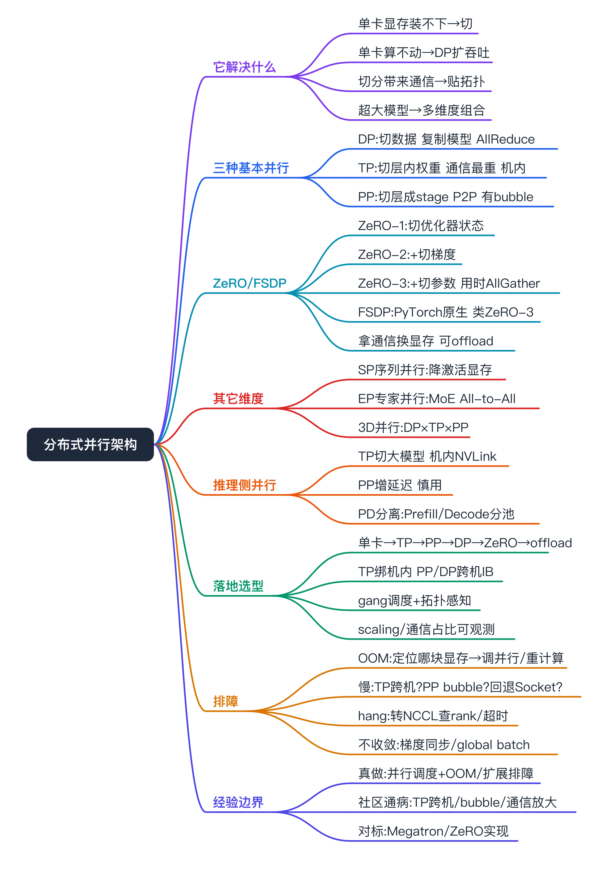
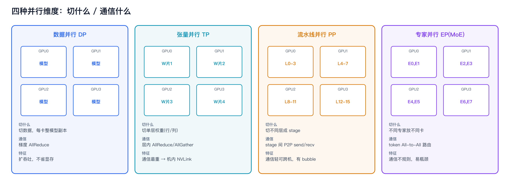
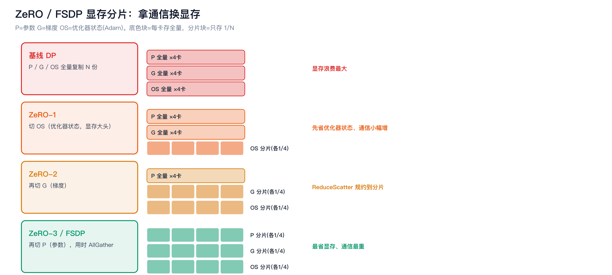
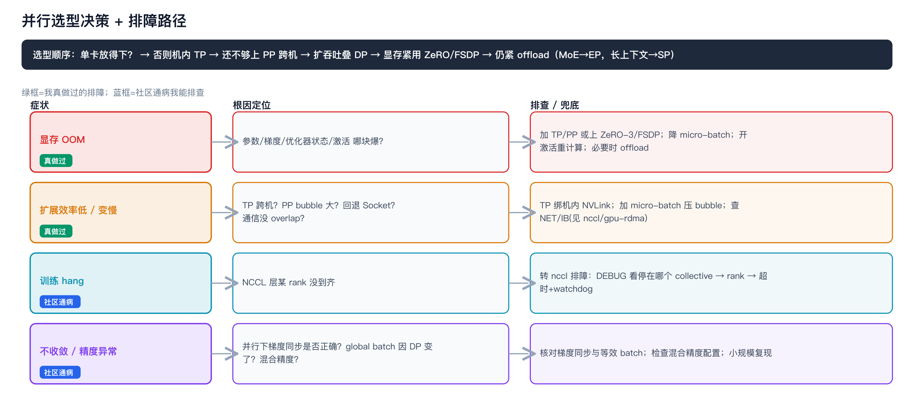

大模型分布式训练与推理并行架构（面试对标）



```yaml
experience_level: adjacent_production_experience
# 平台/SRE 侧（多机多卡训练/推理任务上线、显存 OOM / scaling efficiency 低 / 多机变慢的排障兜底、按并行规格做调度与拓扑感知、版本兼容）是我真实做过的相邻经验。
# 「做大模型多卡基本绕不开」的社区通病（TP 跨机变慢、PP 流水线 bubble、ZeRO 通信放大、显存切分配比不当 OOM）：我能讲原理与排查，不包装成亲历事故。
# 内核侧（Megatron/DeepSpeed 并行实现、ZeRO 分片算法、PP 调度算法、通信-计算 overlap 工程）是理论对标，不是我写的。
# 通信原语见 nccl；传输/拓扑见 gpu-rdma；推理 Prefill/Decode 分离见 pd-separation。本篇聚焦「并行维度怎么切、各自通信什么、怎么选、怎么排障」。
```

# 经验边界

先把边界说清楚，避免被一插到底击穿：

- **我真实做过的（相邻经验）**：多机多卡训练/推理任务在平台上的上线与运维、按并行规格（几机几卡、TP/PP 大小）做调度与拓扑感知、显存 OOM / 多机扩展效率低 / step time 异常这类故障的排障兜底、并行配置与 GPU 资源池/版本基线的对齐。
- **社区必踩坑（我能排查，非亲历事故）**：TP 跨机导致通信打爆、PP 流水线 bubble 拉低利用率、ZeRO/FSDP 通信放大、并行维度配比不当 OOM 或不收敛。
- **我没直接做过的（理论对标）**：Megatron-LM/DeepSpeed 的并行实现、ZeRO 分片与 offload 算法、PP 的 1F1B 调度、通信与计算 overlap 的工程——能讲清「解决什么、对运维意味着什么」，不是我写的。
- **配套文档**：集合通信原语见 [nccl](../nccl/nccl.md)、传输/拓扑见 [gpu-rdma](../gpu-rdma/rdma.md)、GPU/显存原理见 [gpu-fundamentals](../gpu-fundamentals/gpu-fundamentals.md)、推理 Prefill/Decode 分离见 [pd-separation](../pd-separation/pd-separation.md)、推理服务化见 [inference-serving-sre](../inference-serving-sre/inference_serving_framework_sre.md)。

# 为什么需要掌握

- **面试高频且 JD 点名**：大模型 SRE / AI Infra，绕不开「模型放不下怎么切、为什么多机不线性加速、ZeRO 是什么、推理怎么多卡」。说不清并行，分布式稳定性就讲不到根因。
- **和我经验相邻**：我做的是多机多卡任务的上线和排障，理解并行策略才能解释「为什么这个配置 OOM、为什么扩展效率低、为什么 TP 不能跨机」。
- **串起整条链**：并行策略决定了通信需求（[nccl](../nccl/nccl.md)）、通信需求决定了对拓扑/RDMA 的依赖（[gpu-rdma](../gpu-rdma/rdma.md)）、显存切分决定了能不能放下——这是把上面几篇串起来的「为什么」。

# 它解决什么问题（并行为什么存在）

按问题域理解，而不是背框架：

- **单卡显存装不下模型 / 优化器状态**
  - 对应能力：把模型参数、梯度、优化器状态、激活按不同维度切到多卡（TP、PP、ZeRO/FSDP）。
  - 面试表达：大模型训练显存大头是参数 + 梯度 + 优化器状态（Adam 约 2 份）+ 激活，单卡放不下就得切。
- **单卡算不动 / 要更高吞吐**
  - 对应能力：数据并行（DP）复制模型、切数据，多卡同时算，AllReduce 同步梯度。
  - 面试表达：DP 解决吞吐和加速，但不省单卡显存（每卡仍是整模型）。
- **切分会带来通信，通信要贴合拓扑**
  - 对应能力：不同并行的通信模式不同（[nccl](../nccl/nccl.md)），TP 通信最重要放机内 NVLink，PP 通信轻可跨机。
  - 面试表达：并行选型本质是在显存、通信、计算三者间权衡，再贴硬件拓扑。
- **超大模型要多维度组合**
  - 对应能力：3D 并行（DP × TP × PP）+ MoE 的专家并行（EP）+ 序列并行（SP），组合放下千亿级模型。
  - 面试表达：真正的大模型训练是几种并行叠加，不是单一策略。

# 核心概念

## 三种基本并行（最该讲清的）



- **数据并行 DP（Data Parallel）**
  - 切什么：切数据，每卡一份完整模型副本。
  - 通信什么：每 step **AllReduce** 同步梯度（[nccl](../nccl/nccl.md)）。
  - 优缺点：实现简单、扩吞吐好；**不省单卡显存**（每卡整模型），大模型放不下。
- **张量并行 TP（Tensor / Intra-layer Parallel）**
  - 切什么：把**单层内**的权重矩阵按行/列切到多卡（Megatron 的 column/row parallel）。
  - 通信什么：层内 **AllReduce / AllGather**，每层前/反向都通信，**通信最频繁**。
  - 优缺点：省显存、单层算力叠加；通信重，**一般只在机内 NVLink，不跨机**。
- **流水线并行 PP（Pipeline / Inter-layer Parallel）**
  - 切什么：把**不同层**分成若干 stage，放到不同卡 / 不同机。
  - 通信什么：相邻 stage 间 **P2P send/recv**，通信轻。
  - 优缺点：能跨机扩展、通信省；有**流水线 bubble**（首尾空泡），靠 micro-batch + 1F1B 调度压低。

## ZeRO 与 FSDP（DP 的省显存升级）

- **ZeRO（DeepSpeed）**：在数据并行基础上，把冗余的状态分片到各卡而不是每卡都存全量。
  - **ZeRO-1**：切**优化器状态**（Adam 动量/方差，显存大头）。
  - **ZeRO-2**：再切**梯度**。
  - **ZeRO-3**：再切**参数**本身（用时 AllGather 临时收齐）。
  - 代价：通信放大（ReduceScatter + AllGather），ZeRO-3 通信最重；可配 offload 到 CPU/NVMe 进一步省显存换速度。
- **FSDP（PyTorch 原生）**：思路类似 ZeRO-3，按层 shard 参数/梯度/优化器状态，前向/反向时临时 AllGather 再释放。
- **面试一句话**：ZeRO/FSDP 让「数据并行也能省显存」，本质是拿通信换显存。

## 其它维度

- **序列并行 SP（Sequence Parallel）**：沿序列维切，常与 TP 配合（Megatron-SP）降低激活显存，长上下文场景重要。
- **专家并行 EP（Expert Parallel，MoE）**：把不同专家放不同卡，token 经 **All-to-All** 路由到对应专家再收回（[nccl](../nccl/nccl.md)），通信不规则易成瓶颈。
- **3D / 混合并行**：DP × TP × PP（+EP/SP）组合，千亿级模型标配；Megatron-LM、DeepSpeed 是代表实现。

## 推理侧并行（和训练不完全一样）

- **推理常用 TP**：大模型单卡放不下时按 TP 切到多卡（vLLM 的 `tensor_parallel_size`），机内 NVLink 为主。
- **PP 在推理**：可用但会增加延迟，更多用于超大模型或吞吐场景。
- **Prefill/Decode 分离**：Prefill compute-bound、Decode memory-bound，分池部署是推理特有的「并行/分离」思路，详见 [pd-separation](../pd-separation/pd-separation.md)。

## 核心权衡（贯穿全文的一句话）

并行选型 = 在**显存 / 通信 / 计算**三者间权衡，再贴**硬件拓扑**：TP 省显存但通信最重（放机内）、PP 通信轻但有 bubble（可跨机）、DP/ZeRO 扩吞吐省显存但通信随阶段放大。

# ZeRO / FSDP 显存分片是怎么省的



- 基线（纯 DP）：每卡都存**全量**参数 + 梯度 + 优化器状态，冗余 N 份，显存浪费最大。
- ZeRO-1：优化器状态按卡分片，每卡只存 1/N，更新时各管各的分片。
- ZeRO-2：梯度也分片，配合 ReduceScatter 把梯度规约到对应分片所在卡。
- ZeRO-3 / FSDP：参数也分片，前向/反向**用到某层时临时 AllGather 收齐、用完释放**，显存最省、通信最重。
- 直觉：从「人人存全量」到「各存一片、用时凑齐」，拿通信换显存；offload 再把分片挪到 CPU/NVMe，进一步换速度。

# 如果让我落地，我会怎么设计（假设落地）

以「让大模型多机多卡训练/推理跑得下、跑得快、稳得住」为目标：

- **并行选型决策**：先看模型能否单卡放下→放不下优先机内 TP（吃 NVLink）→还不够上 PP 跨机→需要扩吞吐叠 DP→显存仍紧用 ZeRO/FSDP（必要时 offload）；MoE 用 EP，长上下文配 SP。
- **贴拓扑调度**：TP 组绑同机 NVLink、PP/DP 跨机走 IB（[gpu-rdma](../gpu-rdma/rdma.md)）；按并行规格做 gang 调度，避免拆散导致通信打爆。
- **版本与基线**：锁框架（Megatron/DeepSpeed/PyTorch）↔ CUDA ↔ NCCL ↔ 驱动兼容矩阵，全节点一致（[nccl](../nccl/nccl.md)、[cuda-inference-stack](../cuda-inference-stack/cuda-inference-stack.md)）。
- **可观测**：采 scaling efficiency、通信耗时占比、显存水位、PP bubble 率、各 rank 心跳，和 GPU 利用率一起看。
- **故障自愈**：rank 掉队 / 卡坏隔离重调度 + checkpoint 续训，避免一卡拖死整组（[nccl](../nccl/nccl.md)）。
- **风险控制**：并行配置变更先小规模验证 scaling 再放大，不直接上千卡。

# 如果线上出问题，我怎么排查



可操作路径：

- **显存 OOM**：定位是参数/梯度/优化器状态/激活哪块爆 → 调并行（加 TP/PP 或上 ZeRO-3/FSDP）、降 micro-batch、开激活重计算（activation checkpointing）、必要时 offload。
- **多机扩展效率低 / 变慢**：看通信占比 → TP 是不是跨机了（应在机内 NVLink）→ PP bubble 是否过大（micro-batch 太少）→ 是否回退 Socket（[nccl](../nccl/nccl.md)、[gpu-rdma](../gpu-rdma/rdma.md)）→ 通信有没有和计算 overlap。
- **训练 hang**：多半是 NCCL 层某 rank 没到齐，转 [nccl](../nccl/nccl.md) 的排障路径（DEBUG → rank → 超时）。
- **不收敛 / 精度异常**：检查并行下的梯度同步是否正确、混合精度配置、global batch size 是否因并行改变（DP 数变了等效 batch 也变）。
- **收口**：把现象翻译成平台结论——哪种并行配比、卡在显存还是通信、哪台机/哪个 stage，给出调并行或调度的建议，而不是甩一句「OOM」。

# 和我现有经验的映射（后置）

- **显存 OOM / scaling 低 / 多机变慢的排障、按并行规格调度与拓扑感知、版本基线**：真实经验映射=多机多卡训练/推理任务平台侧上线与排障；能讲清问题怎么发生、怎么定位、怎么兜底。
- **TP 跨机变慢 / PP bubble / ZeRO 通信放大 / 配比不当 OOM**：社区通病，我能讲原理与排查路径，非亲历事故。
- **Megatron/DeepSpeed 并行实现、ZeRO/PP 调度算法**：无直接生产映射；理论对标，不包装成自己写过。

# 面试话术

## 30 秒版

分布式并行解决两件事：模型单卡放不下、单卡算不动。基本就三种切法——数据并行复制模型切数据、靠 AllReduce 同步梯度，扩吞吐但不省显存；张量并行切单层权重，通信最重要放机内 NVLink；流水线并行按层切成 stage，通信轻能跨机但有 bubble。再加 ZeRO/FSDP 把优化器状态、梯度、参数分片省显存，拿通信换显存。大模型一般是 3D 并行叠加。本质是在显存、通信、计算间权衡再贴拓扑。我做的是平台侧的并行调度和 OOM/扩展效率排障，并行算法实现是对标理解。

## 3 分钟版

我从「为什么要并行」讲起。大模型训练显存大头是参数加梯度加优化器状态加激活，单卡放不下；算力也不够。所以要切。

三种基本并行：数据并行每卡一份完整模型、切数据、每 step AllReduce 同步梯度，好扩吞吐但不省单卡显存；张量并行把单层的权重矩阵按行列切到多卡，每层前反向都要 AllReduce 或 AllGather，通信最频繁，所以一般只在机内走 NVLink，不跨机；流水线并行把不同层分成 stage 放到不同机器，stage 之间只做 P2P 传递，通信轻、能跨机，代价是流水线 bubble，用 micro-batch 加 1F1B 调度压低。

显存还不够就上 ZeRO 或 FSDP，把优化器状态、梯度、参数依次分片，ZeRO-3 连参数都切、用的时候临时 AllGather 收齐，最省显存但通信最重，本质是拿通信换显存。MoE 用专家并行加 All-to-All，长上下文配序列并行。真正的大模型是 DP 乘 TP 乘 PP 的 3D 并行。

放到我的经验：我做的是多机多卡任务的上线、按并行规格调度、和 OOM、扩展效率低这类排障。比如 TP 被拆到跨机就会通信打爆，我会把 TP 组绑在同机 NVLink、PP/DP 跨机走 IB。算法实现我是对标理解，这条边界我会说清。

## 5 分钟版

在 3 分钟版基础上展开选型和排障。选型我有个决策顺序：先看能不能单卡放下，放不下先机内 TP 吃 NVLink，还不够上 PP 跨机，要扩吞吐叠 DP，显存仍紧用 ZeRO/FSDP 甚至 offload，MoE 用 EP、长上下文配 SP。核心是显存、通信、计算三者权衡再贴拓扑。排障上：OOM 我会定位是哪块显存爆、调并行或开激活重计算；扩展效率低先看通信占比、TP 是不是跨机了、PP bubble 大不大、是不是回退了 Socket、通信有没有和计算 overlap；hang 转到 NCCL 那套查 rank 和超时；不收敛查并行下梯度同步和 global batch 是否变了。推理侧我会提 TP 切大模型、PD 分离。边界我会讲清：Megatron/DeepSpeed 实现和 ZeRO/PP 调度算法是对标理解，平台侧并行调度和排障是真做的。

## 短问快答

- **三种并行区别**：DP 切数据复制模型、TP 切层内权重、PP 切层成 stage。
- **TP 为什么不跨机**：每层都通信、通信最重，跨机带宽不够会打爆，放机内 NVLink。
- **ZeRO 1/2/3 切什么**：优化器状态 / + 梯度 / + 参数。
- **FSDP 和 ZeRO 关系**：FSDP 是 PyTorch 原生、思路类似 ZeRO-3。
- **PP 的 bubble 怎么压**：增加 micro-batch、用 1F1B 调度。
- **MoE 用什么并行/通信**：专家并行 EP + All-to-All。

# 不能怎么说

| 不要这么说 | 风险 | 应该这么说 |
|---|---|---|
| 我实现/改了 Megatron 的并行 | 没源码和线上证据 | 并行实现我是对标理解，能讲取舍 |
| 我们自研了分布式训练框架 | 没事实 | 用的是开源框架，我做平台侧调度和排障 |
| 我把千卡训练效率提了 N% | 编造收益 | 收益要从 scaling efficiency 度量；我能讲优化方向 |
| 我设计了 ZeRO 分片算法 | 夸大 | 我理解 ZeRO 各阶段切什么、通信代价 |
| 并行随便配都行 | 暴露不懂 | 并行选型是显存/通信/计算权衡 + 贴拓扑 |

# 高频 QA

- **为什么要分布式并行**：模型单卡放不下、单卡算不动，要按维度切到多卡。
- **三种基本并行及通信**：DP→AllReduce、TP→AllReduce/AllGather、PP→P2P（[nccl](../nccl/nccl.md)）。
- **DP 省显存吗**：不省，每卡整模型；要省显存用 TP/PP 或 ZeRO/FSDP。
- **TP 和 PP 区别**：TP 切层内（通信重、机内）、PP 切层间（通信轻、可跨机有 bubble）。
- **ZeRO 三个阶段**：切优化器状态 / + 梯度 / + 参数，通信递增。
- **FSDP 是什么**：PyTorch 原生、类似 ZeRO-3 的按层分片。
- **激活重计算/checkpointing**：用计算换显存，反向时重算激活而不是全存。
- **什么是 3D 并行**：DP × TP × PP 组合，超大模型标配。
- **MoE 怎么并行**：专家并行 EP，token 经 All-to-All 路由。
- **序列并行干嘛**：沿序列切降激活显存，长上下文有用，常配 TP。
- **推理怎么多卡**：常用 TP（vLLM tensor_parallel_size），机内 NVLink；还有 PD 分离（[pd-separation](../pd-separation/pd-separation.md)）。
- **OOM 怎么办**：定位哪块显存爆→加 TP/PP 或 ZeRO-3、降 micro-batch、激活重计算、offload。
- **扩展效率低原因**：TP 跨机、PP bubble、回退 Socket、通信没 overlap。
- **你没写过并行为什么还懂**：多卡稳定性问题都落到并行配比、显存、通信，不懂讲不到根因；我做平台侧调度和排障。

# 面试前检查清单

- [ ] 能讲清 DP/TP/PP 各切什么、通信什么、优缺点，并对应 [nccl](../nccl/nccl.md) 的原语。
- [ ] 能说清 ZeRO 1/2/3 和 FSDP 切什么、为什么拿通信换显存。
- [ ] 能解释 TP 为什么放机内、PP 为什么可跨机但有 bubble。
- [ ] 有一条并行选型决策顺序（单卡→TP→PP→DP→ZeRO→offload）。
- [ ] 有 OOM / 扩展效率低的排障路径，并能转接到 NCCL/RDMA。
- [ ] 明确声明：框架实现和调度算法是对标理解，平台侧并行调度和排障是真做的；TP 跨机等是社区通病能排查、不夸大。
- [ ] 没编造性能收益、规模、故障次数。
- [ ] 能讲推理侧并行（TP + PD 分离）和训练的差别。
- [ ] 适合口述，不照背框架参数。
