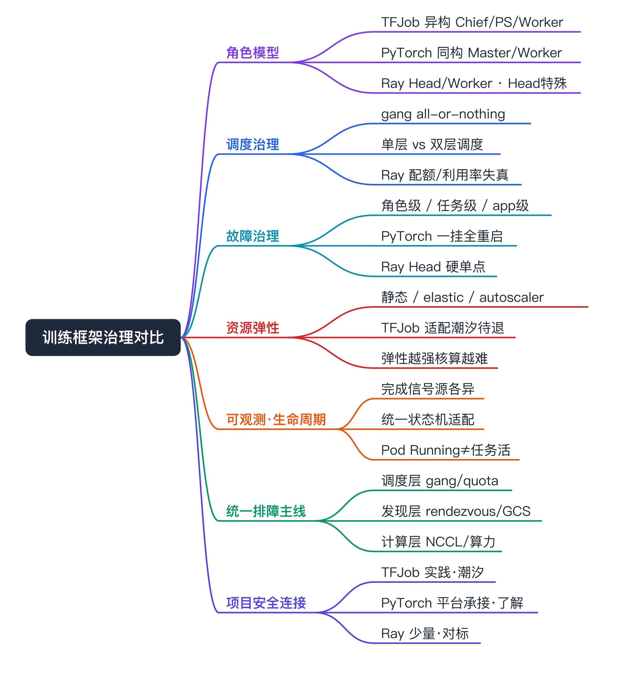
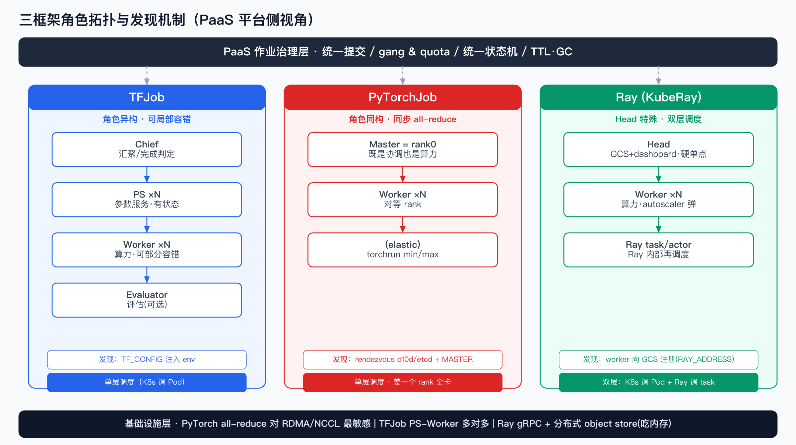
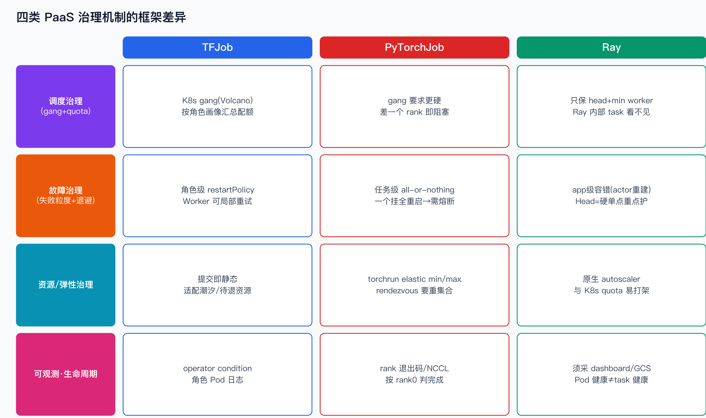
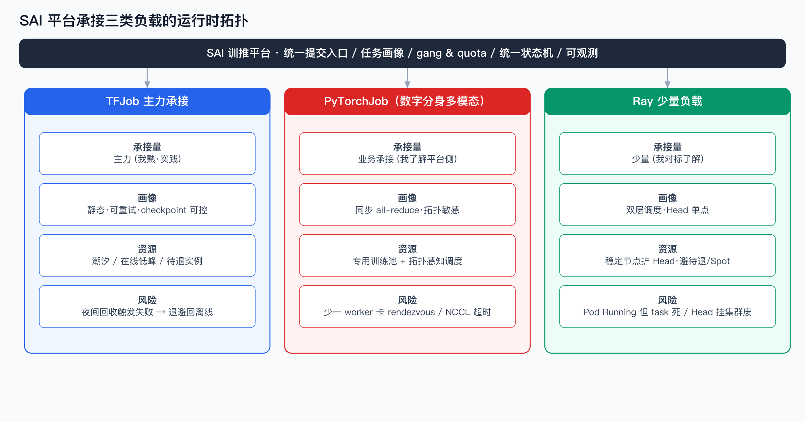
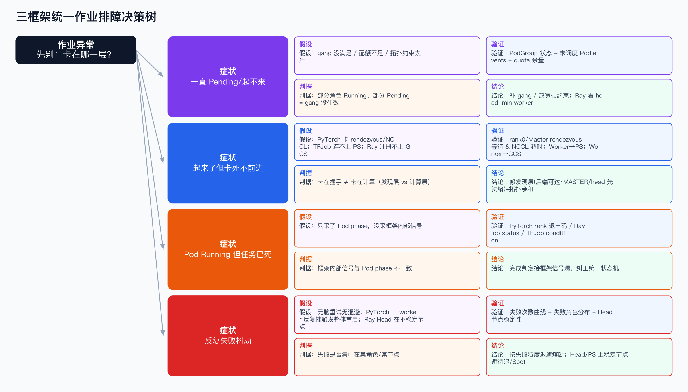
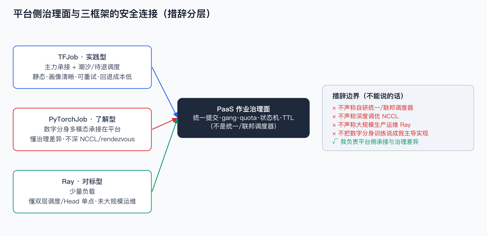

# TFJob / PyTorchJob / Ray 工作负载治理对比 面试准备

# 面试定位卡

- **技术点**：从 SAI PaaS 平台侧视角，对比 TFJob / PyTorchJob / Ray 三类训练工作负载在云原生场景下的治理差异（调度、故障、资源、可观测、生命周期），不下沉到业务/模型层。
- **所属领域**：AI Infra / MLOps / Kubernetes Operator / 训练平台工作负载治理。
- **面试价值**：证明我不是只会“创建一个 TFJob”，而是能站在平台侧，把异构训练 CRD 的角色模型、调度耦合、失败语义、弹性、完成判定统一抽象成一套作业治理能力。
- **常见考法**：为什么 PyTorchJob 一个 worker 挂了整个任务要重启而 TFJob 不一定；Ray 在 K8s 上的“双层调度”会带来什么治理问题；平台怎么统一这三种作业的状态机和配额。
- **适合挂钩项目**：SAI 训推平台、TFJob 主力承接与潮汐调度、数字分身/虚拟人多模态训练（PyTorch）承接、少量 Ray 负载。
- **不适合夸大的地方**：PyTorchJob 的 NCCL/rendezvous 内部细节、Ray 内部 task/actor 调度细节我不深入；我的强项在平台侧治理差异，不是框架内核。

# 三十秒回答

这三类负载在 PaaS 侧最大的差别不在“怎么训练”，而在“平台要怎么治理它”。TFJob 是角色异构的 PS-Worker（或 Chief-Worker），角色之间容错语义不同，平台可以按角色做资源画像和部分容错；PyTorchJob 是同步 all-reduce，角色基本同构，但一个 worker 挂掉默认全任务重启，对 gang 调度和失败退避的要求更硬；Ray 是一个自带调度器的分布式运行时，KubeRay 只编排 head/worker 这层 Pod，真正的 task/actor 调度在 Ray 内部，平台看不见也管不到，于是出现“K8s 调度 Pod、Ray 再调度 task”的双层调度，配额核算、利用率口径、head 单点都成了新的治理问题。我在 SAI 主力承接的是 TFJob，PyTorch 是数字分身那边的多模态训练承接在平台上、我了解平台侧接入和治理差异，Ray 是少量负载。

# 为什么需要它

- **没有它之前的问题**：平台如果对每种训练框架各做一套提交、调度、监控、清理逻辑，运维面会随框架数量线性膨胀，且每种框架的失败语义、完成判定都不一样，作业状态经常对不齐。
- **它的解决方式**：把三类 CRD 抽象成统一的“作业治理面”——统一提交入口、统一 gang/quota 调度策略、统一状态机（Running/Succeeded/Failed）、统一可观测口径、统一 TTL/GC，差异只在适配层处理。
- **它引入的新问题**：不同框架的角色模型、失败粒度、调度层次差异太大，统一抽象会“漏语义”——比如把 Ray 的双层调度硬塞进 K8s 单层配额模型，会出现配额给了但 Ray 不扩、或 Ray 想扩但配额不放的拧巴。
- **必须关注的场景**：gang 调度（差一个角色就整体卡死）、单角色失败的爆炸半径、head/PS 单点、完成信号源、按量/潮汐资源回收。

# 一张表速查（治理维度 × 三框架）

> 这是唯一一张密集对照表，正文用列表展开。面试时按这张表的列（治理维度）逐行讲，比按框架讲更显平台视角。

| 治理维度 | TFJob | PyTorchJob | Ray (KubeRay) |
|---|---|---|---|
| Operator | training-operator（Kubeflow，与 PyTorchJob 同一个） | training-operator（同上） | KubeRay operator（独立） |
| 角色模型 | Chief / PS / Worker / Evaluator（异构） | Master / Worker，rank0=Master（基本同构） | Head / Worker（Head 含 GCS、dashboard） |
| 启动发现 | TF_CONFIG（cluster spec 注入 env） | rendezvous（c10d/etcd）+ MASTER_ADDR/PORT | GCS head 地址（RAY_ADDRESS） |
| 通信模式 | 异步 PS 或同步 all-reduce | 同步 all-reduce（NCCL，对 RDMA 敏感） | gRPC + 分布式 object store |
| 调度层次 | 单层（K8s 调 Pod） | 单层 | **双层**（K8s 调 Pod + Ray 调 task/actor） |
| Gang 需求 | 强（PS+Worker 都要起） | 很强（差一个 worker 直接卡死） | head 必起，worker 可弹性 |
| 失败语义 | 角色级 restartPolicy，Worker 可部分容错 | 默认 all-or-nothing，一个挂全挂（非 elastic） | app 级容错，**Head=SPOF** |
| 弹性 | 基本静态 | torchrun Elastic（min/max） | 原生 autoscaling |
| 完成判定 | Chief / Worker 退出 | Master(rank0) 退出 | entrypoint / RayJob 退出 |
| TTL/GC | ttlSecondsAfterFinished | 同左 | RayJob shutdownAfterJobFinishes |

# 核心概念表

- **Operator / Reconcile 面**：TFJob 与 PyTorchJob 共用 Kubeflow training-operator，一个控制器按 CRD kind 走不同 reconcile 分支；Ray 是独立的 KubeRay operator。面试展开点：统一治理时，前两者复用同一套生命周期事件，Ray 要单独适配。
- **角色（replica role）模型**：决定了平台要给每种角色配什么资源画像、容忍什么失败。TFJob 角色异构（PS 有状态聚合、Worker 算力密集）；PyTorchJob 角色同构（每个 rank 对等）；Ray 分 Head（控制+状态）和 Worker（算力）。
- **发现/握手（discovery / rendezvous）**：作业能不能跑起来的关键。TFJob 靠 TF_CONFIG 静态注入；PyTorch 靠 rendezvous 后端动态集合（elastic 时尤其重要）；Ray 靠 worker 向 head 的 GCS 注册。面试展开点：rendezvous 后端（c10d/etcd）的可用性是 PyTorch elastic 的隐藏依赖。
- **Gang / 协同调度**：所有角色“要么一起起、要么都不起”，否则资源被占住但任务跑不起来（部分 Pod 等不到对端）。TFJob/PyTorchJob 靠 K8s 侧 gang（Volcano/coscheduling）；Ray 的 gang 只能保到 head+min worker。
- **双层调度（two-level scheduling）**：Ray 独有。K8s 决定 Pod 落在哪，Ray 的 GCS 再决定 task/actor 落在哪个 Ray worker。面试展开点：平台拿到的利用率是 Pod 级的，Ray 内部的真实利用率平台看不到，配额和成本核算会失真。
- **完成判定信号源**：平台的作业状态机靠它收敛。三者“以谁退出为准”不同，统一状态机必须按 CRD 适配，否则会出现“任务其实结束了但平台还显示 Running”。

# 原理模型

不要把这三者理解成“都是一堆 Pod 在训练”。从平台侧看，差异从下往上分四层：

- **基础设施层（网络/存储）**：PyTorch all-reduce 对 RDMA/NCCL 高带宽低延迟最敏感，平台要保证同任务 worker 尽量同交换机/同 RDMA 域；TFJob PS-Worker 是多对多参数同步，对带宽敏感但容忍度高于 all-reduce；Ray 走 gRPC + object store，对网络拓扑没那么挑，但 object store 吃内存。
- **角色拓扑层**：TFJob = Chief + 若干 PS + 若干 Worker（+Evaluator），是星型/多对多；PyTorchJob = Master + Worker，逻辑上对等的 ring/tree all-reduce；Ray = Head + Worker，星型注册但运行时是 task 图。
- **发现/编排层**：决定平台“注入什么、等什么就绪”。TFJob 注入 TF_CONFIG 即可；PyTorch 要保证 rendezvous 后端可达 + MASTER 先就绪；Ray 要保证 Head（GCS）先就绪，Worker 才能注册。
- **作业治理层（平台侧）**：统一提交、gang、quota、状态机、TTL。这一层就是“漏语义”最容易出问题的地方——三种框架的失败粒度和调度层次硬抹平会出问题。

# 关键机制

## 调度治理（gang + quota）

- 解决的问题：避免部分角色起来、部分起不来，资源被占死但任务跑不起来。
- 工作方式：TFJob/PyTorchJob 在 K8s 侧用 Volcano/coscheduling 做 all-or-nothing；配额按角色资源画像汇总成 gang 配额。Ray 只能保 head+min worker 的 gang，autoscaler 之后扩出来的 worker 走的是 Ray 自己的扩缩，和 K8s 配额是两套口径。
- 代价：Ray 双层调度下，K8s 配额和 Ray autoscaler 可能互相拧（配额放了 Ray 不扩 / Ray 要扩配额不放），需要把 Ray 的 maxReplicas 和 K8s quota 对齐。
- 面试追问：为什么 PyTorchJob 的 gang 要求比 TFJob 更硬？因为 all-reduce 是同步集合通信，少一个 rank 整个集合操作阻塞，TFJob 异步 PS 模式下少个 Worker 还能继续。

## 故障治理（失败粒度 + 退避）

- 解决的问题：一个角色挂了，平台是重启单角色、重启整任务，还是回退资源池。
- 工作方式：TFJob 按角色 restartPolicy，Worker 失败可局部重试，PS 失败影响大；PyTorchJob 非 elastic 时一个 worker 挂 = 整任务失败重启，elastic 时缩到 min 继续；Ray 是 app 级容错（actor 重建），但 Head 挂 = 整个 RayCluster 报废。
- 代价：PyTorchJob 的整体重启代价高，退避策略要更激进（多次失败要熔断而不是无脑重启）；Ray 要把 Head 当一类特殊负载重点保护（反亲和、稳定节点、不上抢占实例）。
- 面试追问：Ray Head 单点怎么治理？放稳定节点、不放在待退/Spot、做反亲和、关键集群考虑 GCS 容错（外部 Redis 持久化）。

## 资源/弹性治理

- 解决的问题：作业要不要弹、能弹多少、回收时机。
- 工作方式：TFJob 基本静态，副本数提交时定死，适合做潮汐/待退资源承接（任务画像可控）；PyTorchJob elastic 用 min/max，平台要处理 rendezvous 在 worker 变化时的重新集合；Ray 原生 autoscaler 按负载扩缩 worker。
- 代价：弹性越强，平台对“真实占用 vs 配额”的核算越难，Ray 尤其明显。
- 面试追问：为什么我们更倾向把 TFJob 放潮汐/待退资源？因为它静态、画像清晰、可重试、checkpoint 可控，失败回退成本低。

## 可观测与生命周期治理

- 解决的问题：统一 metrics/log/event、统一完成判定与清理。
- 工作方式：TFJob/PyTorchJob 复用 training-operator 的 condition 和角色 Pod 日志；Ray 多一层 dashboard/GCS metrics，平台要额外采。完成判定按各自信号源映射到统一状态机；TTL 用各自的 finished 清理字段。
- 代价：Ray 的可观测要采两层（K8s Pod 层 + Ray 运行时层），否则只看 Pod 会误判“健康但其实 task 全失败”。
- 面试追问：怎么避免“Pod Running 但任务已死”？要采框架内部信号（PyTorch rank 退出码、Ray job status），不能只看 Pod phase。

# 横向对比

- **角色模型：异构 vs 同构**：TFJob 异构（PS/Worker 资源画像、容错语义不同，平台要分角色治理）；PyTorchJob 同构（每个 rank 对等，配额好做但失败牵一发动全身）；Ray 半异构（Head 特殊、Worker 同构）。面试注意点：同构不等于好治理，PyTorch 同构反而让失败爆炸半径变大。
- **调度层次：单层 vs 双层**：TFJob/PyTorchJob 单层，平台的 Pod 级视图就是真实视图；Ray 双层，Pod 级视图 ≠ 真实利用率。面试注意点：这是 Ray 在 PaaS 侧最容易被追问、也最容易被忽略的治理坑。
- **失败粒度：角色级 vs 任务级 vs app 级**：TFJob 角色级（可局部容错）；PyTorchJob 任务级（默认全挂全重启）；Ray app 级（actor 可重建，但 Head 是硬单点）。面试注意点：退避/熔断策略要按这个粒度分别设计，不能一套重试逻辑套三框架。
- **弹性来源：提交即定死 vs 框架 elastic vs 原生 autoscaler**：决定平台配额核算难度，从易到难是 TFJob < PyTorchJob < Ray。
- **网络敏感度：all-reduce(NCCL/RDMA) vs PS 多对多 vs gRPC+object store**：PyTorch 对拓扑亲和最敏感，平台要做拓扑感知调度；Ray 反而对网络拓扑最宽容但吃内存。
- **完成信号：Chief/Worker 退出 vs Master 退出 vs RayJob 退出**：易混点——别假设“所有角色退出才算完成”，TFJob 看 Chief、PyTorch 看 rank0、Ray 看 entrypoint。

# 典型业务场景

- **场景 A：TFJob 主力承接 + 潮汐/待退资源**：为什么相关——TFJob 静态、画像清晰、可重试，适合夜间在线低峰/待退实例。可能现象——夜间被回收触发失败。排查方式——看角色重启与 checkpoint 恢复。优化方向——按任务画像路由 + 失败退避回离线（即潮汐调度）。
- **场景 B：数字分身/虚拟人多模态训练（PyTorchJob）承接**：为什么相关——多模态训练用 PyTorch all-reduce，对 NCCL/RDMA 拓扑敏感、对 gang 要求硬。可能现象——少一个 worker 整任务卡在 rendezvous；NCCL 超时。排查方式——看 rendezvous 后端可达性、worker 就绪数、NCCL 网络。优化方向——拓扑感知调度 + 强 gang + elastic 兜底。边界：这块是数字分身团队的训练负载承接在平台上，我了解平台侧治理差异，框架内部 NCCL/rendezvous 细节我不深。
- **场景 C：少量 Ray 负载**：为什么相关——Ray 双层调度 + Head 单点带来不同治理诉求。可能现象——Pod 都 Running 但 task 全失败；Head 挂导致整集群废。排查方式——采 Ray dashboard/GCS 而非只看 Pod。优化方向——Head 反亲和上稳定节点、对齐 K8s quota 与 Ray maxReplicas。边界：Ray 是少量承接，我属于了解/对标层面，没大规模运维。

# 排障路径

通用主线：症状 → 假设 → 验证 → 指标 → 结论 → 优化 → 复测。关键是先判断“卡在哪一层”。

- **症状：作业一直 Pending / 起不来**
  - 假设：gang 没满足 / 配额不足 / 拓扑约束太严。
  - 验证：看 PodGroup（Volcano）状态、未调度 Pod 的 events（验证是不是差一个角色）；看 quota 余量。
  - 重点看：是否“部分角色 Running、部分 Pending”——这正是 gang 没生效的典型。
  - 结论/优化：补 gang 调度或放宽拓扑硬约束；Ray 注意 head+min worker 是否满足。

- **症状：作业起来了但卡死不前进**
  - 假设：PyTorch 卡在 rendezvous（worker 没集齐）/ NCCL 握手失败；TFJob PS 连不上；Ray worker 注册不上 GCS。
  - 验证：看 rank0/Master 日志的 rendezvous 等待、NCCL 超时报错；TFJob 看 Worker 连 PS 的报错；Ray 看 worker 连 head 的报错。
  - 重点看：是“网络/发现层”问题还是“算力层”问题——卡在握手 ≠ 卡在计算。
  - 结论/优化：修发现层（后端可达、MASTER/head 先就绪）+ 拓扑亲和。

- **症状：Pod Running 但任务实际已死**
  - 假设：只采了 Pod phase，没采框架内部信号。
  - 验证：看 PyTorch rank 退出码 / Ray job status / TFJob condition，而不是 Pod phase。
  - 重点看：框架内部完成/失败信号与 Pod phase 是否一致。
  - 结论/优化：完成判定接框架信号源，纠正统一状态机。

- **症状：作业反复失败抖动**
  - 假设：无脑重试没有退避；PyTorchJob 一个 worker 反复挂触发整体重启；Ray Head 在不稳定节点上。
  - 验证：看失败次数曲线、失败角色分布、Head 所在节点稳定性。
  - 重点看：失败是不是集中在某一角色/某一节点。
  - 结论/优化：按失败粒度做退避熔断；Head/PS 上稳定节点、避开待退/Spot。

# 风险、边界和误区

- **说法“我们做了统一的训练框架调度器”**：问题——容易被追问是不是自研了联邦/统一调度器。更稳妥：我们在 PaaS 侧做的是统一作业治理面（提交/gang/quota/状态机/TTL），调度仍落在 K8s（Volcano/coscheduling）和 Ray 各自的调度器上。
- **说法“PyTorch 和 TFJob 治理差不多”**：问题——忽略了失败粒度和 gang 强度差异。更稳妥：同构反而让 PyTorch 失败爆炸半径更大，gang 和退避要求更硬。
- **说法“Ray 就是一堆 Pod，K8s 调度就够了”**：问题——忽略双层调度。更稳妥：Ray 内部 task 调度平台看不到，配额/利用率核算要单独处理，Head 是硬单点。
- **不能说的话**：不要声称我深度调优过 NCCL/rendezvous、或大规模运维过 Ray 生产集群。PyTorch 是承接在平台上的负载、我懂平台侧治理；Ray 是少量负载、我属于对标了解。

# 和项目的安全连接

## 了解型说法

数字分身/虚拟人的多模态训练用 PyTorchJob 承接在 SAI 平台上，我了解它和 TFJob 在平台侧治理上的差异——尤其是失败粒度（all-or-nothing vs 角色级）、gang 强度和拓扑敏感度。Ray 是少量负载，我了解它双层调度和 Head 单点带来的治理挑战。

## 排查型说法

不管哪种框架，我会先判断卡在“调度层（gang/quota）/ 发现层（rendezvous/GCS）/ 计算层”哪一层：部分角色 Pending 多半是 gang；卡在握手多半是发现层；Pod Running 但任务死多半是只看了 Pod phase 没采框架内部信号。

## 实践型说法

TFJob 是我在 SAI 主力承接的负载，围绕它做过任务画像驱动的提交路由和潮汐/待退资源承接（潮汐调度），因为它静态、画像清晰、可重试、checkpoint 可控，失败回退成本低，最适合放低保障资源。

## 不能说的话

不声称自研了跨框架统一调度器/联邦调度；不声称深度调优 NCCL 或大规模生产运维 Ray；不把数字分身的多模态训练说成是我主导实现的训练逻辑——我负责的是平台侧承接与治理差异。

# 面试追问树

- 基础概念
  - TFJob/PyTorchJob/Ray 各自的角色模型是什么？→ Chief/PS/Worker | Master/Worker | Head/Worker。
  - 它们的 Operator 是同一个吗？→ 前两者同属 training-operator，Ray 是 KubeRay。
- 原理
  - 为什么 PyTorch 一个 worker 挂要整任务重启？→ 同步 all-reduce，少一个 rank 集合通信阻塞。
  - Ray 的双层调度具体指什么？→ K8s 调 Pod，Ray GCS 再调 task/actor。
- 机制
  - gang 为什么对 PyTorch 比 TFJob 更关键？→ all-reduce 同步 vs PS 异步。
  - Ray autoscaler 和 K8s quota 怎么对齐？→ maxReplicas 对齐 quota，否则互相拧。
- 场景
  - 为什么把 TFJob 放潮汐/待退资源而不是 PyTorch？→ TFJob 静态、画像清晰、回退成本低。
  - 数字分身多模态训练为什么对拓扑敏感？→ NCCL all-reduce 吃带宽。
- 排障
  - 部分角色 Pending 怎么查？→ PodGroup + events，判断 gang。
  - Pod Running 但任务死怎么发现？→ 采框架内部信号而非 Pod phase。
- 项目连接
  - 你在这块的真实角色是什么？→ TFJob 主力承接/潮汐调度；PyTorch 平台承接+治理差异了解；Ray 少量+对标。
- 边界
  - 你们做的是统一调度器吗？→ 不是，是统一作业治理面，调度仍在各自调度器。

# 高频 Q&A

- **TFJob 和 PyTorchJob 在平台侧最大的治理差异是什么？** 失败粒度和 gang 强度。TFJob 角色异构、可按角色局部容错；PyTorchJob 同步 all-reduce，默认一个 worker 挂全任务重启，gang 和退避要求更硬。
- **为什么说 Ray 在 K8s 上是双层调度，它带来什么问题？** K8s 调度 Pod，Ray 的 GCS 再在这些 Pod 内调度 task/actor。问题是平台只拿得到 Pod 级利用率，Ray 内部真实占用看不到，配额和成本核算会失真，且 Ray autoscaler 可能和 K8s quota 打架。
- **PyTorchJob 的 elastic 模式给平台带来什么新负担？** rendezvous 后端（c10d/etcd）成了隐藏依赖，worker 数变化时要重新集合，平台要保证后端可用并处理副本在 min/max 间波动时的状态。
- **Ray Head 为什么要特殊治理？** Head 含 GCS（全局控制状态），是硬单点，挂了整个 RayCluster 报废。要放稳定节点、反亲和、不上待退/Spot，关键集群可做 GCS 外部持久化容错。
- **平台统一这三种作业的状态机，难点在哪？** 完成判定信号源不同（Chief / rank0 / RayJob），失败粒度不同。必须按 CRD 适配 condition，否则会出现“任务结束了但平台还 Running”或“Pod Running 但任务已死”。
- **为什么把 TFJob 放潮汐/待退资源更合适？** 它提交即静态、任务画像清晰（耗时/优先级/可重试/checkpoint），失败回退成本低，适合承接低保障资源；PyTorch 整体重启代价高、Ray 弹性核算复杂，都不如 TFJob 可控。
- **三种框架对网络拓扑的敏感度排序？** PyTorch all-reduce（NCCL/RDMA）最敏感，需要拓扑感知调度；TFJob PS-Worker 多对多次之；Ray gRPC+object store 对拓扑最宽容，但 object store 吃内存。
- **如果只看 Pod phase 会漏掉什么？** 会漏掉框架内部失败：PyTorch rank 已退出非零码、Ray job 已 FAILED、TFJob 角色已失败，但 Pod 可能还在 Running。完成/失败判定必须接框架信号源。
- **统一作业治理面具体包含哪些能力？** 统一提交入口、gang/quota 调度策略、统一状态机、统一可观测口径、TTL/GC，框架差异收敛在适配层。
- **你在这三类负载里的真实分工？** TFJob 是我在 SAI 主力承接并做潮汐调度；PyTorchJob 是数字分身多模态训练承接在平台、我了解平台侧治理差异；Ray 是少量负载、我属于对标了解，不声称深度运维。

# 三档背诵版

- **30 秒**：三类训练负载在 PaaS 侧的治理差异——TFJob 角色异构可局部容错、适合潮汐/待退资源；PyTorchJob 同步 all-reduce、一个 worker 挂全任务重启、gang 要求硬、拓扑敏感；Ray 双层调度 + Head 单点、配额利用率核算难。平台做的是统一作业治理面，不是统一调度器。
- **3 分钟**：在 30 秒基础上补背景（SAI 主力 TFJob、数字分身 PyTorch、少量 Ray）+ 四类治理机制（调度 gang/quota、故障失败粒度+退避、资源弹性、可观测+生命周期）+ 排障主线（先判调度层/发现层/计算层）。
- **5 分钟**：再补横向对比（异构 vs 同构、单层 vs 双层、角色级/任务级/app 级失败、网络敏感度、完成信号源）+ 边界（不是联邦调度器、不深 NCCL/Ray 内核）+ 项目安全连接（TFJob 实践 / PyTorch 了解 / Ray 对标）。

# 图示清单

- `00_framework_governance_overview_mindmap.png` — 全文总览思维导图（P0）。
- `01_framework_governance_principle.png` — 三框架角色拓扑与发现机制（P0）。
- `02_framework_governance_mechanism.png` — 四类 PaaS 治理机制的框架差异（P0）。
- `03_framework_governance_scenario.png` — SAI 承接三类负载运行时拓扑（P1）。
- `04_framework_governance_troubleshooting.png` — 统一作业排障决策树（P0）。
- `05_framework_governance_project_connection.png` — 治理面与三框架安全连接（P1）。

# 面试前检查清单

- [ ] 能 30 秒讲清三框架在 PaaS 侧治理差异（不是讲怎么训练）。
- [ ] 能解释为什么 PyTorch 一个 worker 挂要整任务重启（同步 all-reduce）。
- [ ] 能说清 Ray 双层调度带来的配额/利用率/Head 单点问题。
- [ ] 能讲 ≥3 个治理机制（gang、失败退避、弹性核算、可观测信号源）。
- [ ] 能区分角色级/任务级/app 级失败粒度，并据此设计退避。
- [ ] 能按“先判调度层/发现层/计算层”讲统一排障。
- [ ] 清楚哪些不能夸大：不自研统一调度器、不深 NCCL/Ray 内核。
- [ ] 能安全连接项目：TFJob 实践、PyTorch 了解、Ray 对标。
- [ ] 文档含原理图 + 机制图 + 排障图。
