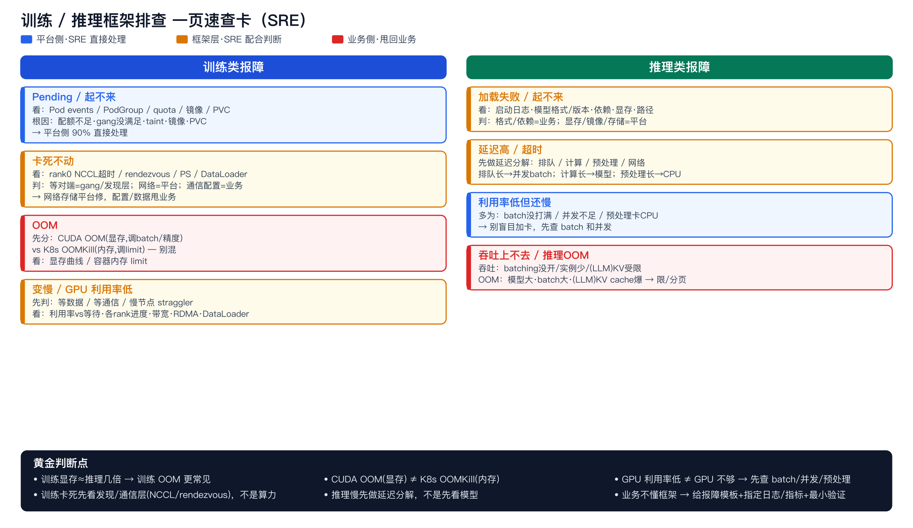

# 训练 / 推理框架排查 一页速查卡（SRE）

> 一页带走版。配合 [训练/推理框架科普](./training_inference_framework_sre_intro.md) 与 [推理服务专项](../inference-serving-sre/inference_serving_framework_sre.md) 使用。核心心法一句话：**先分层定位（基础设施 / 框架 / 业务），再决定谁来修。** 颜色＝责任方：蓝＝平台侧 SRE 直接处理，黄＝框架层 SRE 配合判断，红＝业务侧甩回业务。

# 训练类报障

- **Pending / 起不来** 〔平台侧〕
  - 看：Pod events / PodGroup / quota / 节点资源 / 镜像 / PVC。
  - 根因多为：GPU 配额不足、gang 没满足、taint、镜像拉取失败、PVC 挂不上。
  - 处置：平台侧 90% 直接处理。

- **卡死不动** 〔框架层·配合〕
  - 看：rank0/Master 日志的 NCCL 超时 / rendezvous 等待 / PS 连接 / DataLoader 数据读取。
  - 判：部分 worker 在等对端＝gang/发现层；NCCL/网络不通＝平台；通信配置/数据代码＝业务。
  - 处置：网络/存储平台修，通信配置/数据代码甩业务。

- **OOM** 〔业务侧（多）〕
  - 先分：`CUDA out of memory`（显存，业务调 batch/混合精度/梯度累积）vs `K8s OOMKill`（内存，调 request/limit）。两者别混。
  - 看：显存占用曲线、容器内存 limit。

- **变慢 / GPU 利用率低** 〔跨层〕
  - 先判：是「等数据」还是「等通信」还是「慢节点」。
  - 看：GPU 利用率 vs 等待、各 rank 进度（找 straggler）、网络带宽、是否用 RDMA、DataLoader 吞吐。

# 推理类报障

- **加载失败 / 起不来** 〔框架/平台〕
  - 看：serving 启动日志、模型格式/版本、依赖、显存余量、路径。
  - 判：格式/依赖＝业务；显存/镜像/存储＝平台。

- **延迟高 / 超时** 〔框架层·配合〕
  - 先做延迟分解：排队 / GPU 计算 / 预处理(CPU) / 网络 哪段长。
  - 排队长→并发或 batch 不够/过载；计算长→模型重或没加速；预处理长→CPU 瓶颈；冷启动→没预热。

- **GPU 利用率低但还慢** 〔配置/预处理〕
  - 多为：batch 没打满 / 并发上不去 / 预处理卡 CPU。**别盲目加卡。**
  - 看：batch 命中率、并发数、CPU 使用、GPU 曲线。

- **吞吐上不去** 〔框架配置〕
  - 看：dynamic batching 是否开/配小、模型实例数、（LLM）continuous batching 是否生效、KV cache 占用。

- **OOM（推理）** 〔业务/配置〕
  - 根因：模型大 / batch 大 /（LLM）长序列 KV cache 爆。
  - 处置：限 batch/并发/序列长度，或上更大显存/分片；LLM 用 PagedAttention 类分页省显存。

# 黄金判断点（背下来）

- 训练显存 ≈ 推理的几倍（要存激活+梯度+优化器状态）→ 训练 OOM 更常见。
- `CUDA OOM`（显存）≠ `K8s OOMKill`（内存）。
- GPU 利用率低 ≠ GPU 不够；先查 batch / 并发 / 预处理，再考虑加卡。
- 训练卡死先看「发现/通信层」（NCCL / rendezvous），不是先看算力。
- 推理慢先做「延迟分解」，不是先看模型。
- 业务不懂框架时：给报障模板（任务 ID + 现象 + 报错截图 + 训练/推理 + 复现步骤），指定要看的日志/指标，做最小验证。

# 报障模板（甩给业务填）

- 任务/服务 ID：
- 训练 还是 推理：
- 现象（一句话）：
- 报错截图/关键日志：
- 何时开始 / 是否可复现 / 复现步骤：
- 最近改动（代码 / 镜像 / 配置 / 数据）：
