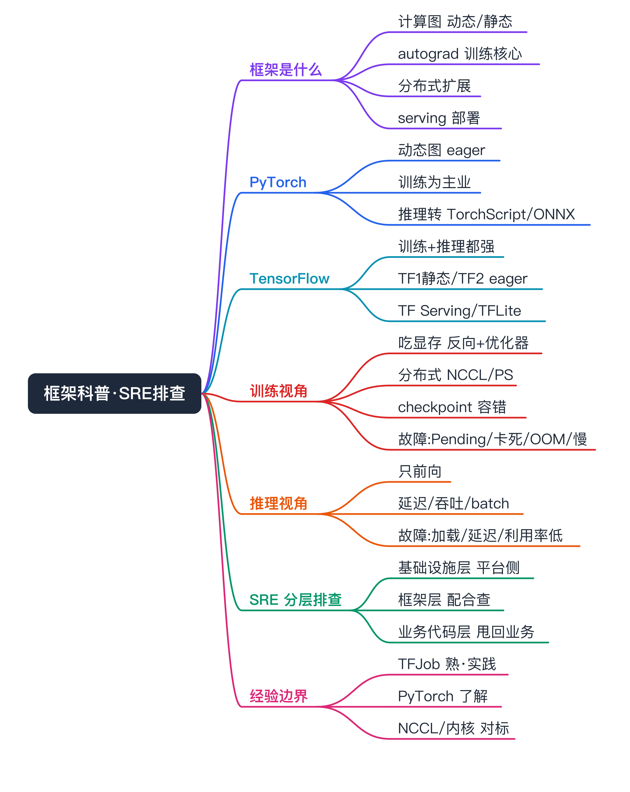
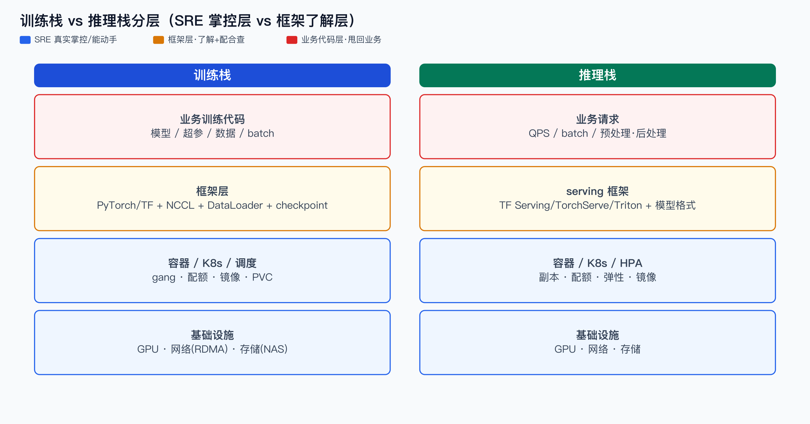
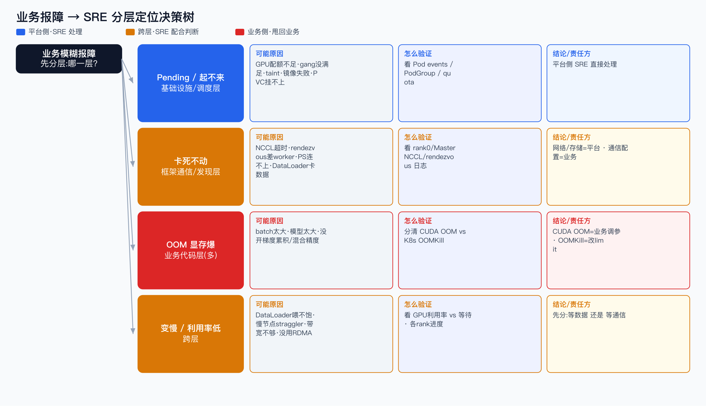

# PyTorch / TensorFlow 框架科普（SRE 协助排查视角）面试准备



> 一句话先纠偏：PyTorch 本质就是个**训练框架**，训练是它的主业（也能做推理，但生产推理常另配 serving 框架）；TensorFlow 训练、推理都是主业。下面从训练、推理两个视角，按 SRE「怎么帮业务把问题定位到对的层」来讲。

```yaml
experience_level: adjacent_production_experience
# SRE：在 SAI 平台承接过训练/推理负载，处理过 GPU/网络/存储/Pending/OOM 这类同类基础设施问题；
# 但不写框架代码、不深框架内核（NCCL/autograd/图编译），框架内部属于理论对标 + 运维了解。
```

# 经验边界

- **有相邻生产经验**：作为 SRE/平台侧，承接过训练（TFJob 为主）和推理负载，处理过资源不足、Pending、OOM 表象、节点/网络/存储异常这类基础设施层问题。
- **没有直接经验**：我不写训练/推理框架代码，不深入 NCCL 集合通信、autograd、图编译、算子这些框架内核；这些属于我「能对标理解、能配合排查」的范围，不是我主导实现的。
- **面试中怎么声明**：框架内部细节我以「理解工程语义 + 能帮业务缩小问题范围」为边界，不包装成框架研发经验。我的价值在于：业务方常常对框架理解不够，我能主动跟进、问对问题、判断问题到底落在基础设施层、框架层还是业务代码层。

# 为什么需要掌握

- **SRE 的真实痛点**：业务报「训练跑不起来 / 卡住 / 变慢 / OOM」，但业务方往往说不清是平台问题还是他们代码问题。SRE 如果不懂框架的基本工作方式，就只能在基础设施层瞎试，定位不下去。
- **协助排查的关键是分层**：懂框架科普 = 知道一个现象「可能由哪一层引起」，从而快速排除/锁定，把问题甩回正确的责任方（平台 or 业务），而不是来回扯皮。
- **主动跟进**：业务方框架知识不足时，SRE 要能提出「贴对的日志、看对的指标、做对的最小验证」，把模糊报障变成可定位问题。

# 它解决什么问题（框架到底在干嘛）

- **把数学计算变成可执行的计算图**
  - 对应能力：PyTorch 动态图（eager，边算边构图）/ TensorFlow 静态图（graph，先构后跑，TF2 用 tf.function 折中）。
  - SRE 关注点：动态图更好调试、报错栈直观；静态图更好优化/部署。报错风格不同，看日志要知道差异。
- **自动求导，支撑训练**
  - 对应能力：autograd（PyTorch）/ GradientTape（TF）。这是「训练」区别于「推理」的核心——训练要前向+反向+更新参数，推理只有前向。
  - SRE 关注点：训练显存 ≈ 推理显存 ×3~4（要存激活/梯度/优化器状态），所以训练 OOM 比推理常见得多。
- **把单卡算力扩展到多卡多机**
  - 对应能力：分布式训练（PyTorch DDP/FSDP、TF MirroredStrategy/MultiWorker/ParameterServer）。
  - SRE 关注点：这是平台侧最容易出问题的地方——通信（NCCL）、发现（rendezvous/PS）、慢节点（straggler）。
- **把训练好的模型部署成在线服务**
  - 对应能力：推理 serving（TF Serving、TorchServe、Triton、vLLM(LLM)）+ 模型格式（SavedModel/TFLite、TorchScript/ONNX）。
  - SRE 关注点：推理关心延迟/吞吐/显存/GPU 利用率，故障形态和训练完全不同。

# 核心概念

- **训练 vs 推理（最该先分清的）**：训练=前向+反向+参数更新，吃显存、长时间、分布式、要 checkpoint；推理=只前向，关注延迟/吞吐/并发。一句话定义清楚，能避免一半误判。可能追问：为什么训练 OOM 多？因为要存梯度+激活+优化器状态。
- **PyTorch**：动态图、eager 为主，训练是主业，研究和生产训练都主流；生产推理常转 TorchScript/ONNX 或用 TorchServe/Triton。和我经验的映射：数字分身多模态训练用 PyTorch，承接在平台、我了解平台侧表现。可能追问：PyTorch 支持训练吗？支持，且是主业。
- **TensorFlow**：训练+推理都强，TF1 静态图、TF2 转 eager+tf.function；推理生态成熟（TF Serving 工业级、TFLite 端侧）。和我经验的映射：SAI 主力 TFJob 就是 TF 的分布式训练（PS-Worker）。可能追问：TF1/TF2 差异？eager 化 + Keras 收编。
- **分布式训练范式**：数据并行（最常见，每卡一份模型、切数据、all-reduce 同步梯度）/ 模型并行 / 张量并行 / 流水线并行（大模型才用）。SRE 关注点：数据并行对应 all-reduce(NCCL)，PS 模式对应参数服务器。可能追问：DDP 和 PS 区别？DDP 去中心 all-reduce、PS 中心化参数服务。
- **NCCL / 集合通信**：GPU 间高速通信库，all-reduce/all-gather 等。SRE 关注点：NCCL 超时、网卡/RDMA 不通、拓扑不对是分布式训练卡死的高频根因。这是我「了解+配合排查」而非深入的部分。
- **checkpoint**：训练中途保存权重，用于断点续训/容错。SRE 关注点：checkpoint 写哪（NAS/对象存储）、能否跨节点恢复，直接关系到训练能不能容错、能不能上潮汐/待退资源。
- **模型格式与 serving**：SavedModel/TorchScript/ONNX 是模型的「可部署产物」；serving 框架负责加载、batch、并发。SRE 关注点：推理故障常在加载、显存、batch 配置、预处理这几处。

# 核心架构



不要把框架理解成「一个黑盒在跑」。从 SRE 协助排查的角度，训练和推理各是一个分层栈，每层的责任方不同：

- **训练栈（自底向上）**：GPU/网络(RDMA)/存储(NAS) → 容器/K8s/调度(gang) → 框架(PyTorch/TF + NCCL + DataLoader) → 业务训练代码(模型/超参/数据)。
- **推理栈**：GPU/网络/存储 → 容器/K8s/HPA → serving 框架(TF Serving/TorchServe/Triton) + 模型格式 → 业务请求(QPS/batch/预处理)。
- **SRE 的边界**：基础设施层 + 容器/调度层是我真实掌控、能直接动手的；框架层我「了解工作方式、能看懂日志、能配合定位」；业务代码层我帮缩小范围但改不了，要甩回业务。

# 核心主流程（SRE 协助排查）



核心方法：**先分层定位是哪一层，再决定谁来修。** 业务方往往一句「跑不起来」，SRE 要把它拆成可定位的问题。

## 训练类报障

- **症状：任务起不来 / 一直 Pending**
  - 多半是基础设施/调度层（我能直接查）：GPU 配额不足、gang 没满足、节点 taint、镜像拉取失败、PVC 挂不上。
  - 验证：看 Pod events、PodGroup、quota、节点资源。
  - 结论：这层 90% 是平台侧问题，SRE 直接处理。

- **症状：起来了但卡死不动**
  - 多半是框架通信/发现层（我配合查）：NCCL 超时、rendezvous 没集齐（差一个 worker）、PS 连不上、DataLoader 卡在数据读取。
  - 验证：看 rank0/Master 日志的 NCCL/rendezvous 报错；看是不是「部分 worker 在等对端」；看数据所在存储是否慢。
  - 结论：网络/存储是平台侧，集合通信配置/数据代码是业务侧——SRE 要能区分并主动跟进。

- **症状：OOM（显存爆）**
  - 多半是业务代码层（我帮判断，业务改）：batch size 太大、模型太大、没开梯度累积/混合精度。训练显存是推理的几倍，OOM 很常见。
  - 验证：看 OOM 报错来自框架（CUDA out of memory）还是被 K8s OOMKill（内存 vs 显存要分清）；看显存占用曲线。
  - 结论：CUDA OOM 是业务侧调参，K8s OOMKill 是内存 request/limit 设置——两者别混。

- **症状：训练变慢 / GPU 利用率低**
  - 跨层：可能是 DataLoader 喂不饱(业务)、慢节点 straggler(平台)、网络带宽不够(平台)、没用 RDMA(平台)。
  - 验证：看 GPU 利用率 vs 等待、各 rank 进度是否一致(找慢节点)、网络带宽。
  - 结论：GPU 利用率低先看「是算力没打满还是在等数据/等通信」。

## 推理类报障

- **症状：服务起不来 / 模型加载失败**
  - 框架/格式层：模型格式不对、版本不匹配、显存不够装模型、依赖缺失。
  - 验证：看 serving 启动日志、模型路径、显存余量。
- **症状：延迟高 / 超时**
  - 跨层：batch 配置不当、预处理/后处理 CPU 瓶颈、显存换页、QPS 超容量、冷启动。
  - 验证：看 P99 延迟分解（排队 vs 计算 vs 预处理）、GPU 利用率、batch 命中。
- **症状：GPU 利用率低但延迟还高**
  - 多半是 batch 没打满 / 请求并发上不去 / 预处理在 CPU 卡住，不是 GPU 不够。

# 如果让我从平台侧支撑，我会怎么做（假设，非已落地）

- **可观测先行**：统一采 GPU(利用率/显存)、训练进度(各 rank step)、NCCL/通信指标、DataLoader 吞吐、推理 P99/QPS/batch，让「卡在哪一层」一眼可见。
- **报障模板化**：给业务一个报障模板（任务 ID、现象、报错截图、是训练还是推理、复现步骤），把模糊报障变成可定位问题。
- **分层 Runbook**：沉淀「Pending→看配额/gang」「卡死→看 NCCL/rendezvous」「OOM→分 CUDA vs OOMKill」「慢→分等数据/等通信/慢节点」的决策树，降低对框架专家的依赖。
- **责任边界清晰化**：在排查路径里标清每层责任方（平台 vs 业务），避免来回扯皮，SRE 主动把业务侧问题连同证据甩回去。

# 和我现有经验的映射（后置）

- **TFJob / TF 分布式训练**：真实经验映射=SAI 主力承接 + 潮汐调度；能怎么说=我熟，做过平台侧治理和排查。
- **PyTorchJob / PyTorch 训练**：真实经验映射=数字分身多模态训练承接在平台；能怎么说=了解平台侧表现，框架内核不深。
- **NCCL / autograd / 图编译 / 算子**：无直接生产映射；能怎么说=理论对标 + 运维配合了解，不包装成框架研发。
- **推理 serving（TF Serving/TorchServe/Triton/vLLM）**：弱映射；能怎么说=了解工作方式和故障形态，按场景对标，未深度运维全部。

# 面试话术

主回答：框架内核我不写代码，这点先说清楚。但作为 SRE，我承接过训练和推理负载，核心能力是「把业务模糊的报障分层定位」。比如业务说训练跑不起来，我会先判是 Pending（基础设施/调度，平台侧）、卡死（NCCL/rendezvous，网络平台侧或通信配置业务侧）、还是 OOM（多为业务调参，且要分清 CUDA OOM 和 K8s OOMKill）。训练和推理的故障形态完全不同——训练吃显存、长任务、分布式通信；推理关心延迟/吞吐/batch。业务方常对框架了解不够，我会主动给报障模板、贴对的日志、做最小验证，把问题缩小到正确的层和责任方。

简答：

- **你写框架代码吗？** 不写，我是 SRE，负责把框架跑在平台上、出问题帮业务定位到对的层。
- **PyTorch 支持训练吗？** 支持，训练就是它的主业；推理也行，但生产推理常配 TorchServe/Triton/ONNX。
- **训练和推理排查有什么不同？** 训练看显存/通信/慢节点/checkpoint，推理看延迟/吞吐/batch/加载，故障形态不一样。
- **业务说"训练卡住"你怎么查？** 先分层：Pending 看配额/gang；卡死看 NCCL/rendezvous 是不是差 worker；OOM 分 CUDA vs OOMKill；慢看是等数据还是等通信。
- **业务不懂框架你怎么办？** 我主动跟进，给报障模板、指定要看的日志和指标、做最小复现，把模糊问题变可定位。

# 不能怎么说

| 不要这么说 | 风险 | 应该这么说 |
|---|---|---|
| 我做过 PyTorch/TF 框架研发 | 没源码经验会被击穿 | 我是 SRE，负责框架在平台上的承接与排查 |
| 我深度调优过 NCCL/集合通信 | 没内核证据 | 我了解 NCCL 解决的问题，能配合定位通信类故障 |
| 我优化了推理引擎性能 X% | 编造收益 | 我能从延迟/吞吐/利用率分解定位推理瓶颈 |
| 训练和推理排查差不多 | 暴露不懂 | 两者故障形态完全不同，要分别讲 |

# 高频 QA

- **为什么 SRE 要懂框架科普？** 不懂就只能在基础设施层瞎试，定位不下去；懂了才能把现象映射到「可能由哪一层引起」，快速锁定责任方。
- **PyTorch 和 TensorFlow 最大区别？** PyTorch 动态图、训练为主、调试友好；TF 训练推理都强、静态图历史、推理生态成熟（TF Serving/TFLite）。
- **为什么训练比推理更容易 OOM？** 训练要存激活、梯度、优化器状态，显存是推理的几倍；推理只前向。
- **训练任务卡死，最可能哪几类原因？** NCCL 通信超时、rendezvous 没集齐（差 worker）、PS 连不上、DataLoader 卡数据读取。
- **CUDA OOM 和 K8s OOMKill 怎么区分？** CUDA OOM 是显存爆（框架报 CUDA out of memory，业务调 batch/精度）；OOMKill 是容器内存超 limit（K8s 杀，调 request/limit）。别混。
- **GPU 利用率低一定是 GPU 不够吗？** 不是。更常见是 DataLoader 喂不饱、在等通信、batch 没打满、预处理 CPU 卡住。
- **推理延迟高怎么分解？** 拆成排队 vs 计算 vs 预处理/后处理，看是 QPS 超容量、batch 没配好，还是 CPU 预处理瓶颈。
- **业务方不懂框架，你怎么推进？** 给报障模板、指定日志/指标、做最小复现，把模糊报障变成可定位问题，并标清每层责任方。
- **分布式训练为什么对网络敏感？** 数据并行每步要 all-reduce 同步梯度，走 NCCL，带宽/延迟/RDMA 直接决定训练速度，慢节点会拖垮整批。
- **哪些你不该夸大？** 不声称写框架代码、深调 NCCL、自研推理引擎；我的边界是平台承接 + 分层排查 + 主动跟进。

# 图示清单

- `00_framework_sre_overview_mindmap.png` — 全文总览思维导图（P0）。
- `01_framework_sre_architecture.png` — 训练栈 vs 推理栈分层 + SRE 掌控/了解边界（强制）。
- `02_framework_sre_troubleshooting.png` — 业务报障分层定位决策树（强制）。
- `03_framework_sre_train_vs_infer.png` — 训练 vs 推理故障形态横向对标（P1）。

# 面试前检查清单

- [ ] 明确声明：我是 SRE，不写框架代码，框架内核是对标了解。
- [ ] 能 30 秒说清训练 vs 推理的本质区别（反向/显存/故障形态）。
- [ ] 能说清 PyTorch 训练为主、TF 训练推理都强。
- [ ] 能按「Pending / 卡死 / OOM / 变慢」分层定位训练故障。
- [ ] 能区分 CUDA OOM 和 K8s OOMKill。
- [ ] 能讲推理延迟分解（排队/计算/预处理）。
- [ ] 没编造框架研发经验、收益数据。
- [ ] 能把现象映射到真实经验（TFJob 熟 / PyTorch 了解 / NCCL 对标）。
- [ ] 能说清业务不懂框架时怎么主动跟进。
- [ ] 文档含架构分层图 + 排障决策树图。
