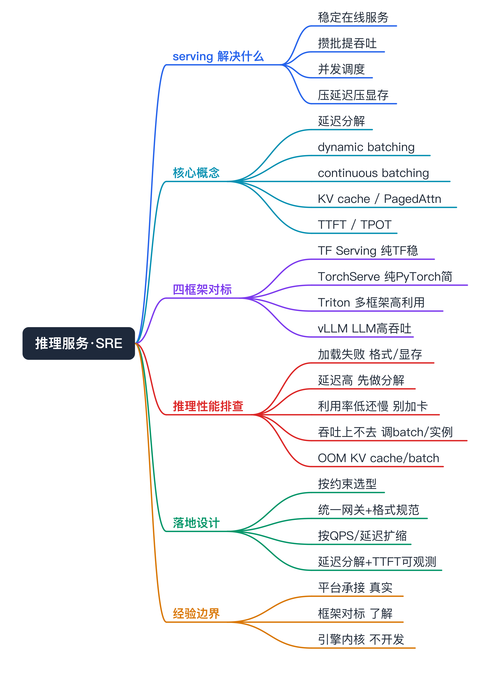
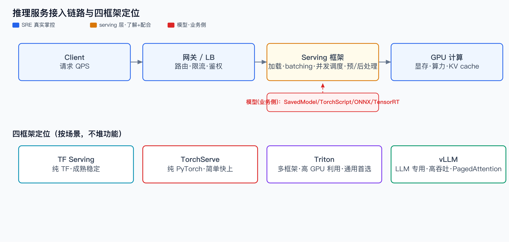
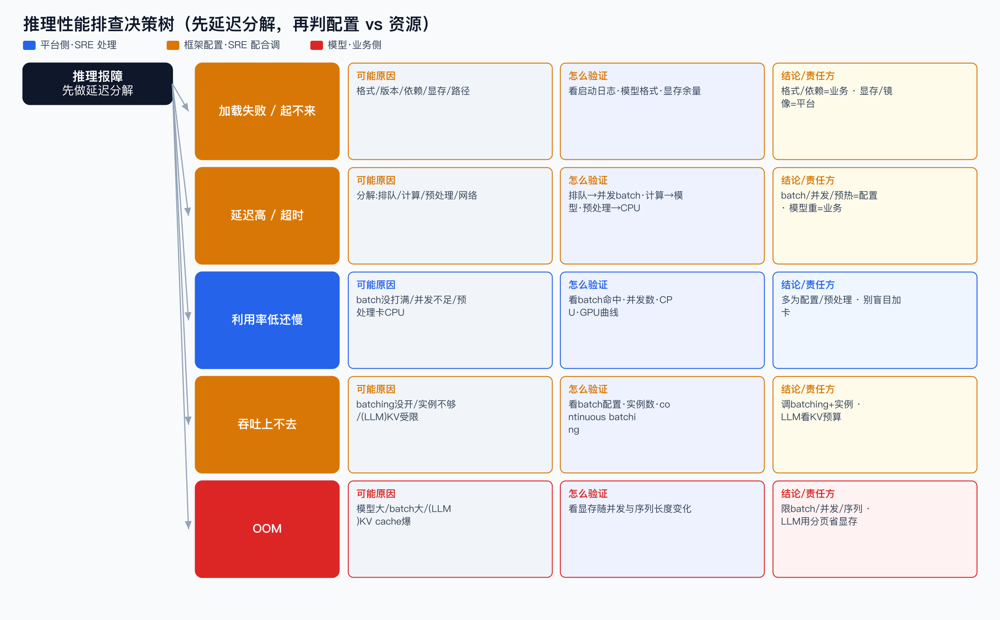

# 推理服务框架对标与推理性能排查（SRE 视角）面试准备



> 接「训练/推理框架科普」的下半场：训练讲完了，这篇专攻**推理侧**——模型训练好之后怎么部署成在线服务，主流 serving 框架（TF Serving / TorchServe / Triton / vLLM）各自定位，以及 SRE 怎么排查推理性能问题。

```yaml
experience_level: adjacent_production_experience
# SRE：在平台承接过推理负载，处理过加载失败、显存、延迟、GPU 利用率这类基础设施/平台层问题；
# 但不深各 serving 框架内核（dynamic batching 实现、PagedAttention、TensorRT 编译），属对标了解 + 配合排查。
```

# 经验边界

- **有相邻生产经验**：承接过推理服务负载，处理过模型加载、显存不足、副本扩缩、GPU 利用率、延迟超时这类平台侧问题。
- **没有直接经验**：我不开发 serving 框架，不深入 dynamic batching 内部实现、TensorRT 图编译、vLLM 的 PagedAttention 等内核；这些是「对标理解 + 配合定位」的范围。
- **面试中怎么声明**：serving 框架我以「懂各自定位、能选型对标、能分层排查推理性能」为边界，不包装成推理引擎研发。各框架内部最新版本/性能数字我不下断言。

# 为什么需要掌握

- **推理和训练故障形态完全不同**：训练看显存/通信/慢节点，推理看延迟/吞吐/batch/加载。SRE 不能用一套训练思路套推理。
- **业务方常分不清「是模型慢还是服务配置差」**：很多推理延迟问题根因在 batch 配置、并发、预处理 CPU 瓶颈，不在 GPU 算力。SRE 懂 serving 才能把延迟拆开定位。
- **选型背后是通用工程语义**：理解 Triton/vLLM 为什么存在，就能理解云厂商推理托管能力背后在做什么，支撑后续选型与平台演进。

# 它解决什么问题（推理 serving 在干嘛）

- **把模型变成稳定的在线服务**
  - 对应能力：模型加载、版本管理、健康检查、热更新。
  - SRE 关注点：加载失败、版本不一致、热更新抖动是上线高频故障。
- **把零散请求攒成 GPU 友好的批**
  - 对应能力：dynamic batching（动态批处理）/ continuous batching（LLM）。
  - SRE 关注点：batch 没开或配不好，GPU 利用率上不去、吞吐打不满——这是推理性能第一大坑。
- **在有限 GPU 上塞更多并发**
  - 对应能力：concurrent model execution、多实例、GPU 共享（MPS/MIG）。
  - SRE 关注点：并发不足导致排队延迟高，但 GPU 其实没满。
- **压低延迟、压实显存**
  - 对应能力：TensorRT 编译加速、量化、KV cache 管理（LLM 的 PagedAttention）。
  - SRE 关注点：LLM 长序列 KV cache 爆显存是 OOM 高频根因。

# 核心概念

- **推理延迟的构成**：端到端延迟 = 排队(queue) + 预处理(CPU) + GPU 计算 + 后处理 + 网络。一句话定义清楚，排查就有了分解维度。可能追问：延迟高先看哪段？先拆排队 vs 计算 vs 预处理。
- **dynamic batching（动态批处理）**：把短时间内到达的多个请求攒成一个 batch 一次推理，提升 GPU 吞吐。代价是单请求多等一点（攒批延迟）。和我经验映射：平台侧我关注它有没有开、max_batch/延迟阈值配得对不对。可能追问：batch 越大越好吗？不，吞吐和单请求延迟要权衡。
- **continuous batching（连续批处理，LLM 专用）**：LLM 生成是逐 token 的，传统 batch 要等最长的那个；continuous batching 让先生成完的请求立刻让位、新请求随时加入，大幅提升 LLM 吞吐。可能追问：和普通 dynamic batching 区别？粒度从「整条请求」细到「每个 decode step」。
- **KV cache（LLM）**：自回归生成时缓存历史 token 的 K/V，避免重算。问题是它随序列长度线性涨，长上下文/高并发会爆显存。vLLM 的 PagedAttention 就是把 KV cache 分页管理省显存。可能追问：LLM 推理 OOM 多在哪？KV cache。
- **prefill vs decode（LLM）**：prefill = 处理输入 prompt（一次性、算力密集）；decode = 逐 token 生成（访存密集、长尾）。对应指标 TTFT（首 token 延迟）vs TPOT（每 token 延迟）。SRE 关注点：首 token 慢和生成慢是两类问题。
- **模型格式**：SavedModel(TF) / TorchScript·.mar(PyTorch) / ONNX(通用) / TensorRT engine(NVIDIA 加速)。SRE 关注点：格式/版本/依赖不匹配是加载失败的高频原因。
- **GPU 利用率 ≠ 吞吐打满**：利用率高可能在空转，利用率低可能在等数据/等并发。要结合吞吐和延迟一起看。

# 核心架构



推理服务从请求到 GPU 是一条链路，每一段都可能成为瓶颈：

- **接入链路**：Client → 网关/LB → 推理服务（serving 框架：加载模型 + batching + 并发调度）→ GPU 计算 → 返回。
- **serving 框架这一层**负责：模型加载/版本、动态批处理、并发调度、预处理/后处理编排。SRE 看懂这层才能定位是「框架配置问题」还是「GPU 不够」。
- **SRE 的边界**：网关/LB、副本/HPA、GPU/显存、镜像/存储是我真实掌控；serving 框架内部（batching 算法、TensorRT 编译）是了解+配合；模型本身（结构/量化）是业务侧。

# 横向对标（先给评价维度，再给结论）

> 本轮为轻量对标（基于公开定位，未做完整 benchmark）；不下版本级/性能级断言。先看维度，再看在什么约束下选什么。

评价维度：支持的框架范围、batching 能力、GPU 利用/并发、是否 LLM 专用、生态成熟度、接入成本、典型场景。

- **TF Serving**
  - 定位：TensorFlow 官方 serving，工业级、成熟稳定。
  - 解决问题：TF/SavedModel 模型的高性能在线服务、版本管理。
  - 适合：模型栈纯 TF、要稳定成熟方案的场景。注意点：主要面向 TF，多框架支持弱。
- **TorchServe**
  - 定位：PyTorch 官方 serving，.mar 模型归档 + 自定义 handler。
  - 解决问题：PyTorch 模型快速上线、自定义预处理/后处理。
  - 适合：纯 PyTorch、模型不复杂、想快速起服务。注意点：社区活跃度需关注，复杂高性能场景常被 Triton 取代（具体维护状态以官方最新为准）。
- **Triton Inference Server（NVIDIA）**
  - 定位：多框架通用推理服务器，生产推理的「通用首选」。
  - 解决问题：一套服务同时跑 TF/PyTorch/ONNX/TensorRT；dynamic batching、并发多实例、model ensemble、高 GPU 利用率。
  - 适合：异构模型栈、追求 GPU 利用率和吞吐、需要统一推理平台。注意点：功能多、接入和调优有学习成本。
- **vLLM**
  - 定位：LLM 专用高吞吐推理引擎。
  - 解决问题：continuous batching + PagedAttention 解决 LLM 吞吐和 KV cache 显存。
  - 适合：大模型在线推理、高并发文本生成。注意点：不是通用 CV/小模型 serving，场景专一。

结论（约束式，不说「谁最好」）：

- 模型栈异构 + 要高 GPU 利用率 + 统一推理平台 → 更适合 **Triton**。
- 纯 TF、求稳 → **TF Serving**；纯 PyTorch、简单快上 → **TorchServe**。
- LLM 高吞吐文本生成 → **vLLM**（或 Triton + vLLM backend）。
- 不下「Triton 一定比 X 快多少」这类断言——要落地会按自己流量做 benchmark。

# 如果让我从平台侧支撑推理，我会怎么设计（假设，非已落地）

- **选型**：按模型栈和场景定——异构/高利用率走 Triton，LLM 走 vLLM，纯单框架可用官方 serving。先明确约束再选，不堆功能。
- **接入**：统一推理网关（鉴权/路由/限流）+ 标准化模型格式与版本规范 + 健康检查/就绪探针。
- **资源治理**：GPU 配额、显存预留、副本与 HPA（按 QPS/延迟而非 CPU 扩缩）、必要时 MIG/MPS 做 GPU 切分提利用率。
- **可观测**：采 P50/P95/P99 延迟（且分解排队/计算/预处理）、QPS、batch 命中率、GPU 利用率/显存、LLM 的 TTFT/TPOT/KV cache 占用。
- **故障诊断**：沉淀「加载失败 / 延迟高 / 吞吐上不去 / OOM」的分层 Runbook。
- **风险控制**：灰度发布、版本回滚、模型预热（避冷启动）、过载保护（排队上限+快速失败）。

# 如果线上出问题，我怎么排查



核心：**先做延迟分解，定位瓶颈段，再判是框架配置还是资源不够。**

- **症状：服务起不来 / 模型加载失败**
  - 假设：模型格式/版本不匹配、依赖缺失、显存不够装模型、路径错。
  - 验证：看 serving 启动日志、模型路径与格式、显存余量、依赖版本。
  - 结论：格式/依赖=业务侧，显存/镜像/存储=平台侧。

- **症状：延迟高 / 超时**
  - 假设：先延迟分解——排队 / 计算 / 预处理 / 网络哪段长。
  - 验证：排队长→并发/batch 不够或过载；计算长→模型重/没加速；预处理长→CPU 瓶颈；冷启动→没预热。
  - 结论：batch/并发/预热是框架配置（SRE 配合调），模型本身重是业务侧。

- **症状：GPU 利用率低但延迟还高**
  - 假设：batch 没打满 / 请求并发上不去 / 预处理在 CPU 卡住。
  - 验证：看 batch 命中率、并发数、CPU 使用、GPU 利用率曲线。
  - 结论：多半是 serving 配置或预处理瓶颈，不是 GPU 不够——别盲目加卡。

- **症状：吞吐上不去**
  - 假设：dynamic batching 没开/配小、单模型实例数不够、（LLM）KV cache/并发受限。
  - 验证：看 batch 配置、实例数、（LLM）continuous batching 是否生效、KV cache 占用。
  - 结论：调 batching 和实例数；LLM 看 KV cache 显存预算。

- **症状：OOM（推理）**
  - 假设：模型太大、batch 太大、（LLM）长序列 KV cache 爆。
  - 验证：看显存占用随并发/序列长度变化；LLM 看 max_seq_len 与并发。
  - 结论：限 batch/并发/序列长度，或上更大显存/分片；LLM 用 PagedAttention 类能力省显存。

# 和我现有经验的映射（后置）

- **推理平台承接 / GPU 显存 / 副本扩缩 / 延迟超时**：真实经验映射=平台侧承接与基础设施排查；能怎么说=我处理过这类平台层问题。
- **TF Serving / TorchServe / Triton / vLLM**：弱映射；能怎么说=懂各自定位和故障形态，能选型对标、配合排查，未深度运维全部、不开发引擎。
- **dynamic/continuous batching、PagedAttention、TensorRT**：无直接生产映射；能怎么说=理论对标，理解它解决的工程问题，不包装成内核研发。

# 面试话术

主回答：推理引擎我不开发，这点先说清楚。作为 SRE，我承接过推理负载，核心能力是把推理性能问题分层定位。比如业务说「服务慢」，我会先做延迟分解——是排队、GPU 计算、还是 CPU 预处理长。很多时候 GPU 利用率其实不高，根因在 batch 没打满或并发上不去，盲目加卡没用。serving 框架我懂各自定位：纯 TF 用 TF Serving，纯 PyTorch 简单场景 TorchServe，异构高利用率走 Triton，LLM 高吞吐走 vLLM——但具体性能数字我会按自己流量 benchmark，不下断言。

简答：

- **你开发过推理引擎吗？** 没有，我是 SRE，负责推理服务在平台上的承接和性能排查。
- **Triton 和 vLLM 区别？** Triton 是多框架通用推理服务器，vLLM 是 LLM 专用高吞吐引擎，场景不同。
- **推理延迟高怎么查？** 先延迟分解：排队/计算/预处理/网络，定位哪段长，再判框架配置还是资源。
- **GPU 利用率低还慢，加卡有用吗？** 通常没用，先查 batch 和并发，多半是没打满或在等 CPU 预处理。
- **LLM 推理为什么容易 OOM？** KV cache 随序列长度和并发线性涨，长上下文高并发会爆显存。

# 不能怎么说

| 不要这么说 | 风险 | 应该这么说 |
|---|---|---|
| 我开发/优化了推理引擎 | 没内核证据会被击穿 | 我是 SRE，做推理服务承接与性能排查 |
| 我们用 Triton 提升吞吐 50% | 编造收益 | 收益要按自己流量 benchmark 度量 |
| Triton 比 vLLM 快 | 无依据断言 | 两者场景不同，LLM 高吞吐 vLLM 更对口 |
| 推理和训练排查差不多 | 暴露不懂 | 故障形态完全不同，推理看延迟/batch/显存 |

# 高频 QA

- **推理 serving 框架到底解决什么？** 把模型变稳定在线服务 + 攒批提吞吐 + 并发调度 + 压延迟压显存。
- **dynamic batching 为什么关键？** 攒批喂满 GPU 提吞吐；没开或配不好是推理性能第一大坑，代价是单请求多等攒批延迟。
- **continuous batching 和 dynamic batching 区别？** 粒度不同：前者细到 LLM 每个 decode step，先完成的请求立刻让位，吞吐更高。
- **KV cache 是什么，为什么重要？** LLM 缓存历史 token 的 K/V 避免重算，但随序列/并发线性涨显存，是 LLM OOM 主因；PagedAttention 分页省显存。
- **TTFT 和 TPOT 分别对应什么？** TTFT=首 token 延迟（prefill 段），TPOT=每 token 延迟（decode 段），首 token 慢和生成慢是两类问题。
- **延迟高怎么分层定位？** 分解成排队/计算/预处理/网络，排队长查并发/batch/过载，计算长查模型/加速，预处理长查 CPU。
- **GPU 利用率低还慢，怎么回事？** batch 没打满、并发上不去、预处理 CPU 卡住，不是 GPU 不够，加卡无效。
- **Triton 为什么常被当生产首选？** 多框架、dynamic batching、并发多实例、高 GPU 利用率，能做统一推理平台。
- **怎么选 serving 框架？** 按约束：异构高利用率→Triton，纯 TF→TF Serving，纯 PyTorch 简单→TorchServe，LLM 高吞吐→vLLM。
- **哪些不该夸大？** 不声称开发推理引擎、不下性能断言、不编造收益；边界是承接+对标+分层排查。

# 图示清单

- `00_inference_serving_overview_mindmap.png` — 全文总览思维导图（P0）。
- `01_inference_serving_architecture.png` — 推理接入链路 + 四框架定位（强制）。
- `02_inference_serving_troubleshooting.png` — 推理性能排查决策树（强制）。
- `03_inference_serving_comparison.png` — 四框架定位象限横向对标（P1）。

# 面试前检查清单

- [ ] 明确声明：我是 SRE，不开发推理引擎，框架是对标了解。
- [ ] 能说清推理延迟构成（排队/计算/预处理/网络）并据此分层定位。
- [ ] 能讲 dynamic batching 与 continuous batching 区别。
- [ ] 能讲 KV cache / TTFT / TPOT（LLM 推理基本盘）。
- [ ] 能说清「GPU 利用率低还慢，加卡无效」的判断逻辑。
- [ ] 能按约束选 serving 框架，不说「谁最好」。
- [ ] 没编造性能收益、没下版本级断言。
- [ ] 能映射真实经验（平台承接 + 基础设施排查）。
- [ ] 文档含接入链路图 + 推理排查决策树图。
