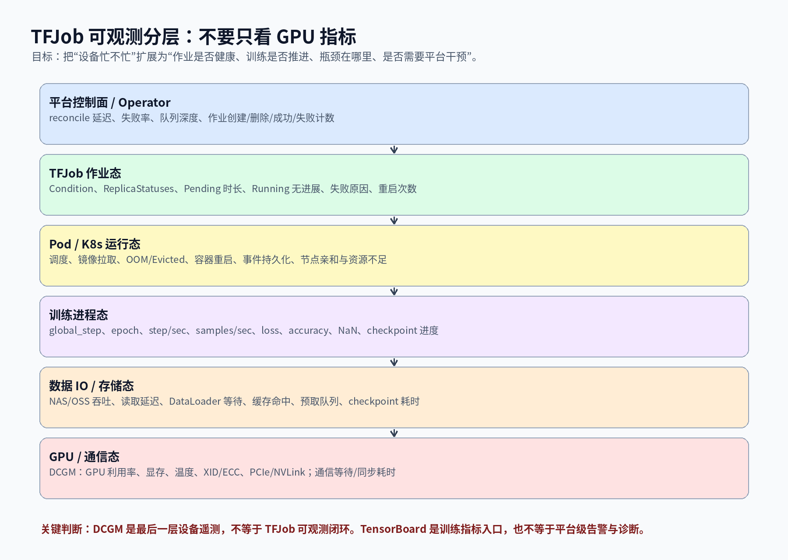
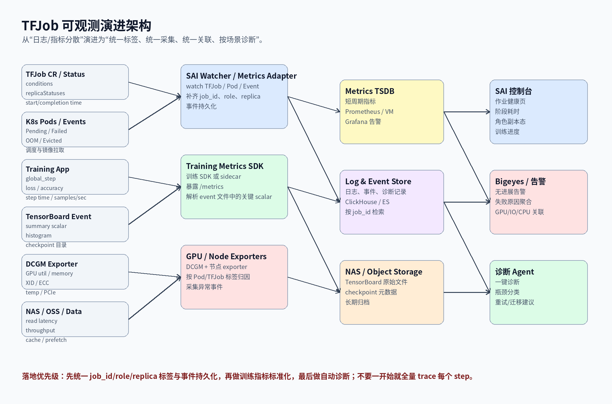

# TFJob 可观测体系演进

## 1. 背景与问题

这次面试里只围绕 GPU 指标展开，方向没有错，但不完整。GPU 指标只能回答“卡是否忙、显存是否够、设备是否异常”，不能直接回答 TFJob 作为一个分布式训练作业是否健康。

你们当前已经具备三类能力：

- TensorBoard：能看到训练侧主动写出的 loss、accuracy、step 等指标。
- 业务日志写 NAS，再由 Notebook 读取：能做事后排查，但不是强实时的平台级观测。
- GPU 指标依赖 DCGM：能看到设备层面的 GPU 利用率、显存、温度、XID/ECC 等。

这里的问题是：这三类能力之间缺少统一的作业视角。平台无法稳定回答：

- TFJob 是 Pending、Running、Restarting、Failed，还是训练已经无进展？
- Chief、Worker、PS、Evaluator 等角色分别处于什么状态？
- 训练慢是 GPU 不够、数据读取慢、CPU 预处理慢、通信慢，还是 checkpoint 慢？
- 作业失败是业务代码失败、资源不足、节点异常、镜像拉取失败、OOM，还是存储不可用？
- 是否需要重试、迁移、降级、退回离线队列，还是直接通知算法同学修代码？

所以 TFJob 可观测的目标不应只是“接入更多 GPU 指标”，而是建设一个围绕 Job 生命周期的观测闭环。

## 2. 现状能力的边界

### 2.1 TensorBoard 的边界

TensorBoard 的价值是训练过程可视化。它依赖训练代码主动写 summary，例如 loss、accuracy、global_step、histogram、embedding、profile 等。它适合算法同学看训练效果，但平台不能完全依赖它做运行治理。

原因有三个：

- 写什么指标由业务代码决定，平台不可控。
- event 文件通常落在 NAS 或对象存储，平台侧实时性、标准化和告警能力不足。
- TensorBoard 更偏“看图和分析”，不是统一的作业状态机，也不是告警系统。

### 2.2 NAS 日志 + Notebook 自助读取的边界

日志写 NAS 适合保留业务细节，尤其是 Pod 被删除后仍能保留训练日志。但它的问题是：

- 排查链路依赖人工进入 Notebook 读取。
- 日志格式不统一，无法稳定聚合错误类型。
- 很难直接生成平台级指标，比如“最近 10 分钟 global_step 是否推进”。
- 对控制面来说，它不是一个结构化、可订阅、可告警的数据源。

因此它更像取证能力，不是完整的 observability。

### 2.3 DCGM 的边界

DCGM 能覆盖 GPU 设备遥测，包括 GPU 利用率、显存、温度、错误、XID、ECC、PCIe/NVLink 等。但它仍然是设备视角。

如果没有把 DCGM 指标和 TFJob、Pod、role、replica index 关联起来，平台只能看到“某张卡有问题”，但很难回答：

- 哪个 TFJob 占用了这张卡？
- 是 Chief、Worker 还是 PS？
- 这个 GPU 低利用率是正常等待、数据 IO 慢，还是分布式同步拖慢？
- 训练无进展时，GPU 指标是因还是果？

## 3. 目标：从设备监控扩展为 TFJob 作业可观测

建议把 TFJob 可观测分成六层。

### 3.1 控制面与 Operator 指标

这一层回答：平台控制面和 TFJob Operator 自己是否健康。

建议观测：

- controller reconcile 次数、失败率、延迟分布。
- workqueue depth、retry 次数、处理延迟。
- TFJob 创建、删除、成功、失败计数。
- webhook 调用失败、校验失败、默认值注入失败。
- SAI 控制面创建、重启、迁移、资源变配、删除等操作耗时。

价值：如果训练任务没有被正确拉起，先判断是控制面问题、Operator 问题，还是底层调度问题。

### 3.2 TFJob 作业状态指标

这一层回答：TFJob 生命周期是否符合预期。

建议采集：

- TFJob condition：Created、Running、Restarting、Succeeded、Failed。
- condition transition time：各状态切换耗时。
- replicaStatuses：各角色 Active、Succeeded、Failed 数量。
- startTime、completionTime、运行时长。
- restartPolicy、生效的重试次数、最后失败原因。
- Chief / Worker / PS / Evaluator 角色状态。
- Job 是否长时间 Pending、Running 但无进展、Restarting 过多。

这些指标可以通过 watcher 监听 TFJob CR，也可以通过 kube-state-metrics 的 custom resource state metrics 暴露。

### 3.3 Pod 与 Kubernetes 运行态指标

这一层回答：作业是否被 Kubernetes 正常调度和运行。

建议采集：

- Pod Pending 原因：资源不足、调度约束不满足、PVC 未绑定、镜像拉取失败。
- Pod 状态：Running、Succeeded、Failed、Unknown。
- 容器重启次数、lastState、exitCode、OOMKilled。
- Evicted、NodeLost、DiskPressure、MemoryPressure。
- 镜像拉取耗时、容器启动耗时。
- Pod 到 TFJob role / replica 的映射。
- Kubernetes Event 持久化。

这里要特别注意：Kubernetes Event 默认保留时间有限，不能依赖 `kubectl describe` 作为长期排障入口。平台应该把关键事件消费并落库。

### 3.4 训练进程指标

这一层回答：训练是否真的在推进。

建议定义一套最小训练指标规范，让 TensorFlow / PyTorch / 自研训练脚本都能通过 SDK 或 sidecar 暴露。

核心指标：

- global_step。
- epoch。
- step/sec。
- samples/sec。
- loss。
- accuracy / auc / recall 等业务指标。
- learning_rate。
- gradient norm。
- 是否出现 NaN / Inf。
- 最近一次 checkpoint 时间。
- checkpoint 耗时、大小、失败次数。
- 训练阶段：init、load_data、train、eval、save_checkpoint、exit。

这类指标不一定全都要强制业务接入。平台可以先定义 P0 标准：global_step、loss、step_time、samples_per_sec、last_checkpoint_time。没有这几个指标，平台很难判断“Running 但无进展”。

### 3.5 数据 IO 与存储指标

这一层回答：训练慢是不是数据供给慢。

建议观测：

- NAS / OSS 读取吞吐。
- 读取延迟 p50 / p95 / p99。
- DataLoader / tf.data pipeline 等待时间。
- 预取队列长度。
- cache 命中率。
- 样本解析耗时。
- 单 step 中数据读取耗时占比。
- checkpoint 写入耗时和失败原因。

面试时可以明确说：很多 GPU 低利用率不是 GPU 问题，而是输入 pipeline 没喂满。只看 DCGM 会误判，需要把 GPU util、step time、data wait time 放在一起看。

### 3.6 GPU 与通信指标

这一层回答：设备、显存、通信是否成为瓶颈。

建议保留 DCGM 作为设备层基础能力，但要做两件事：

- 标签归因：把 GPU 指标补齐 cluster、namespace、tfjob、role、replica、pod、container、gpu uuid。
- 场景关联：把 GPU 指标与训练 step、数据 IO、Pod 重启、节点事件放在同一作业视图里。

核心指标：

- GPU utilization。
- GPU memory used / total。
- SM 活跃度。
- 显存带宽。
- GPU 温度、功耗。
- XID、ECC 错误。
- PCIe / NVLink 吞吐。
- 多机多卡场景下的通信等待、allreduce 耗时、同步 barrier 等。

## 4. 推荐演进架构

### 4.1 数据源

平台需要把以下数据源统一到 Job 维度：

- TFJob CR：状态机、角色副本、失败原因。
- Pod / Container：调度、启动、重启、退出码、OOM、Evicted。
- Kubernetes Event：调度失败、镜像失败、节点异常、PVC 异常。
- TensorBoard event 文件：loss、accuracy、global_step 等训练指标。
- 训练 SDK / sidecar：标准化训练进程指标。
- DCGM：GPU 设备指标。
- NAS / OSS：数据读取和 checkpoint 写入指标。

### 4.2 采集方式

建议分三条链路：

第一条，状态链路：

- SAI watcher 监听 TFJob、Pod、Event。
- 统一补齐 job_id、cluster、namespace、role、replica、pod 标签。
- 将状态快照写入 metrics，将事件写入事件库。

第二条，训练指标链路：

- 优先提供轻量 SDK，让训练代码暴露 `/metrics` 或写标准 JSON line。
- 对已使用 TensorBoard 的任务，可以解析 event 文件中的核心 scalar，转成平台指标。
- 不建议一开始强推全量 OpenTelemetry trace 到每个 step，成本和侵入性都偏高。

第三条，设备与存储链路：

- DCGM exporter 继续负责 GPU 指标。
- 节点 exporter / cAdvisor / kube-state-metrics 负责节点与 Pod 运行态。
- NAS / OSS 侧补充吞吐、延迟、错误码、限流等指标。

### 4.3 存储与查询

建议分层存储：

- Prometheus / VictoriaMetrics：短周期指标、告警、Grafana dashboard。
- ClickHouse / ES：日志、事件、诊断结果、失败原因聚合。
- NAS / OSS：TensorBoard 原始 event 文件、checkpoint、长周期日志归档。
- SAI DB：作业元数据、运行记录、资源规格、调度配置、迁移记录。

不要把所有训练日志都塞进指标系统，也不要把所有 step 都打成 trace。训练任务的吞吐和日志量会很大，平台应该先沉淀最小关键指标。

## 5. 核心指标设计

### 5.1 TFJob 生命周期指标

| 指标 | 含义 | 用途 |
|---|---|---|
| tfjob_created_total | 创建数量 | 平台规模统计 |
| tfjob_running | 当前运行中作业数 | 容量与水位 |
| tfjob_succeeded_total | 成功数量 | 成功率统计 |
| tfjob_failed_total | 失败数量 | 稳定性统计 |
| tfjob_phase_duration_seconds | 各阶段耗时 | 定位卡点 |
| tfjob_pending_duration_seconds | Pending 时长 | 调度/资源问题 |
| tfjob_restart_total | 重启次数 | 训练稳定性 |
| tfjob_role_active_replicas | 各角色活跃副本数 | 分布式角色观测 |
| tfjob_role_failed_replicas | 各角色失败副本数 | 定位角色异常 |

### 5.2 训练进程指标

| 指标 | 含义 | 用途 |
|---|---|---|
| train_global_step | 当前 step | 判断训练是否推进 |
| train_step_duration_seconds | 单 step 耗时 | 性能退化判断 |
| train_samples_per_second | 样本吞吐 | 训练效率 |
| train_loss | loss | 收敛趋势 |
| train_accuracy / auc | 业务精度指标 | 训练效果 |
| train_data_wait_seconds | 数据等待耗时 | IO 瓶颈 |
| train_checkpoint_age_seconds | 距离上次 checkpoint 时间 | 恢复风险 |
| train_checkpoint_duration_seconds | checkpoint 写入耗时 | 存储瓶颈 |
| train_nan_total | NaN/Inf 次数 | 训练异常 |

### 5.3 资源与设备指标

| 指标 | 含义 | 用途 |
|---|---|---|
| gpu_utilization | GPU 利用率 | 算力利用判断 |
| gpu_memory_used_bytes | 显存使用 | OOM/容量判断 |
| gpu_xid_errors_total | GPU XID 错误 | 硬件/驱动异常 |
| gpu_ecc_errors_total | ECC 错误 | 设备稳定性 |
| pod_cpu_usage | CPU 使用 | 数据预处理瓶颈 |
| pod_memory_usage | 内存使用 | OOM 风险 |
| container_restart_total | 容器重启 | 运行稳定性 |
| storage_read_latency_seconds | 存储读取延迟 | 数据 IO 瓶颈 |
| storage_read_throughput_bytes | 读取吞吐 | 数据供给能力 |

## 6. 典型诊断规则

### 6.1 TFJob 长时间 Pending

判断链路：

1. TFJob condition 长时间停留 Created。
2. Pod Pending。
3. 查看 Pod Event：Insufficient GPU、PVC 未绑定、节点亲和不满足、镜像拉取失败。
4. 如果是资源不足，关联队列水位和调度策略。
5. 如果是 PVC / NAS 问题，转存储告警。

平台动作：

- 在 SAI 控制台显示 Pending 原因聚合。
- 告警给平台或算法团队。
- 支持建议切换资源规格、节点池或回退队列。

### 6.2 Running 但训练无进展

判断链路：

1. TFJob 处于 Running。
2. Pod 也处于 Running。
3. global_step 在 N 分钟内没有增长。
4. loss / samples/sec 无更新。
5. 再关联 GPU util、CPU util、data wait、存储延迟。

可能结论：

- GPU util 低，data wait 高：数据读取慢。
- GPU util 低，CPU 高：CPU 预处理慢。
- GPU util 高，step time 变长：计算压力或 batch 配置问题。
- 多卡场景单卡利用率不均：通信或数据切分问题。
- checkpoint age 过大：写 checkpoint 慢或失败，恢复风险上升。

### 6.3 Worker 频繁重启

判断链路：

1. tfjob_role_failed_replicas 或 container_restart_total 上升。
2. 读取 lastState.exitCode。
3. 判断是否 OOMKilled、业务异常、节点驱逐、GPU XID、存储错误。
4. 结合 restartPolicy 判断是否可恢复。

平台动作：

- 将失败归因聚合成几类：业务代码、资源不足、节点问题、GPU 问题、存储问题、镜像问题。
- 对可恢复问题自动重试。
- 对不可恢复问题尽早失败并通知，避免长时间占用 GPU。

### 6.4 GPU 利用率低

不能直接下结论说 GPU 有问题。建议按顺序判断：

1. global_step 是否推进。
2. step time 是否变长。
3. data wait 是否升高。
4. CPU 是否打满。
5. 存储读取延迟是否升高。
6. 是否处于 checkpoint / eval 阶段。
7. 分布式训练是否在等待慢 worker。

只有排除输入 pipeline、CPU 预处理、checkpoint、通信等待后，才进一步怀疑 GPU 设备、驱动或模型计算配置。

## 7. 与现有能力的结合方式

### 7.1 TensorBoard 不废弃，而是平台化

建议保留 TensorBoard 作为算法同学的细节分析入口，但平台要做增强：

- 在 SAI 作业页直接跳转 TensorBoard。
- 解析关键 scalar：global_step、loss、accuracy、step_time。
- 对关键 scalar 生成告警规则，比如 loss NaN、global_step 无增长、samples/sec 明显下降。
- 将 TensorBoard event 文件路径、checkpoint 路径和 TFJob 元数据绑定。

### 7.2 NAS 日志不废弃，而是结构化

建议保留 NAS 日志，但平台应补一层索引与结构化解析：

- 按 job_id / role / replica / pod 建索引。
- 抽取 ERROR、Exception、Traceback、OOM、CUDA error、NCCL error 等错误模式。
- 训练失败时自动展示最近 N 行关键日志。
- 对高频失败原因做聚合，沉淀成诊断知识库。

### 7.3 DCGM 不废弃，而是补齐作业归因

DCGM 继续作为 GPU 指标主来源，但必须和 Kubernetes 元数据 join：

- GPU UUID -> Node -> Pod -> TFJob。
- Pod -> role / replica index。
- TFJob -> 业务方、任务类型、资源规格、调度队列。

只有这样，GPU 指标才能变成“作业维度”的指标，而不是“节点维度”的设备图。

## 8. 落地路线

### 8.1 P0：统一标签与状态页

目标：先把已有数据串起来。

建设内容：

- 统一 job_id、cluster、namespace、tfjob、role、replica、pod、gpu_uuid 标签。
- SAI watcher 采集 TFJob status、Pod status、Event。
- 作业详情页展示 TFJob 状态、角色副本、Pod、GPU、TensorBoard、日志入口。
- Kubernetes Event 持久化。

收益：低侵入、见效快，能解决“信息分散”的问题。

### 8.2 P1：TFJob 指标与告警规则

目标：把生命周期和失败原因指标化。

建设内容：

- 暴露 TFJob lifecycle metrics。
- 建立 Pending、Restarting、Failed、无副本、角色副本不齐等告警。
- 失败原因归类。
- 按团队、任务类型、资源规格统计成功率和失败率。

收益：平台开始具备主动发现问题的能力。

### 8.3 P2：训练进程指标规范

目标：判断训练是否真的在推进。

建设内容：

- 提供训练 metrics SDK。
- 定义最小指标：global_step、loss、step_time、samples/sec、checkpoint_time。
- 支持 TensorBoard scalar 解析兜底。
- 作业页展示训练进度曲线和吞吐趋势。

收益：能识别 Running 但无进展、训练吞吐下降、checkpoint 失败等问题。

### 8.4 P3：数据 IO 与 GPU 关联诊断

目标：从“发现慢”到“定位为什么慢”。

建设内容：

- 采集 NAS / OSS 吞吐和延迟。
- 训练 SDK 增加 data_wait、preprocess_time、checkpoint_time。
- GPU util、CPU util、data wait、step time 联合展示。
- 增加典型规则：IO 慢、CPU 预处理慢、GPU 设备异常、通信等待。

收益：形成训练性能退化的标准排查路径。

### 8.5 P4：诊断 Agent 与闭环治理

目标：从告警走向自动诊断和治理建议。

建设内容：

- 失败事件、日志片段、指标趋势、调度事件统一输入诊断 Agent。
- 输出可解释结论：资源不足、数据慢、GPU 异常、业务异常、存储异常。
- 对可恢复场景触发重试、迁移、退避、回退队列。
- 对不可恢复场景提前失败，释放 GPU。

收益：减少人工排障，提升 GPU 利用率和训练平台稳定性。

## 9. 面试表达

可以这样讲：

我们之前 TFJob 的可观测主要分成三块：TensorBoard 看训练指标，业务日志落 NAS 后通过 Notebook 自助查看，GPU 设备层依赖 DCGM。这个体系能满足基础排查，但它的问题是没有形成以 TFJob 为中心的统一作业视角。DCGM 只能说明 GPU 设备状态，TensorBoard 只能说明训练代码主动写出的指标，NAS 日志更多是事后取证。

后续我会把 TFJob 可观测拆成几层演进：第一层是 TFJob 自身的生命周期状态，包括 condition、replicaStatuses、各角色副本状态、Pending/Running/Restarting/Failed 的状态转移耗时；第二层是 Pod 和 Kubernetes Event，包括调度失败、镜像拉取失败、OOM、Evicted、节点异常；第三层是训练进程指标，包括 global_step、step/sec、samples/sec、loss、checkpoint 时间；第四层是数据 IO 和存储指标，比如 NAS 读取延迟、吞吐、DataLoader 等待；最后才是 GPU 和通信指标。

这样做的好处是，平台可以从“看到 GPU 利用率低”升级为“解释为什么低”。比如 GPU util 低但 data wait 高，可能是数据读取慢；GPU util 低但 CPU 高，可能是预处理瓶颈；TFJob Running 但 global_step 不增长，说明作业表面运行但训练没有推进；Worker 频繁重启，就结合 exitCode、Pod Event、GPU XID、日志片段判断是业务异常、资源问题还是节点/GPU 问题。

落地上我不会一开始做很重的全链路 trace，而是先做统一标签和状态事件采集，把 TFJob、Pod、Event、DCGM、TensorBoard 关联到同一个 job_id。然后补训练 SDK 或解析 TensorBoard event 文件，把 global_step、loss、step_time、checkpoint_time 变成平台指标。最后再做性能退化诊断和自动化治理，比如重试、迁移、退避、提前失败释放 GPU。

## 10. 容易被追问的问题

### 10.1 为什么不只依赖 DCGM？

因为 DCGM 是设备视角，不是作业视角。GPU 利用率低可能是数据读取慢、CPU 预处理慢、checkpoint、通信等待，也可能是训练代码本身没有推进。没有 TFJob 状态、训练 step、数据 IO 指标，DCGM 只能提供现象，不能给出归因。

### 10.2 为什么不把所有训练日志都采到 OTel？

训练日志量可能很大，全量采集成本高，而且日志非结构化，不适合作为实时指标和告警依据。更合理的是：关键指标走 metrics，关键事件结构化落库，原始日志保留在 NAS/对象存储，失败时按 job_id 拉取关键片段。

### 10.3 TensorBoard 已经有 loss 和 step，为什么还要训练 SDK？

TensorBoard 是算法视角，平台需要稳定、标准、可告警的指标。训练 SDK 的目标不是替代 TensorBoard，而是把最小关键指标标准化，比如 global_step、step_time、samples/sec、checkpoint_time。对历史任务可以先解析 TensorBoard event 文件兜底。

### 10.4 TFJob 内部指标从哪里来？

主要有三类来源：

- TFJob CR status：condition、replicaStatuses、startTime、completionTime。
- Pod / Event：调度、启动、重启、失败、退出码、OOM、Evicted。
- 训练进程：global_step、loss、step_time、samples/sec、checkpoint 等。

Operator 自身也可以暴露控制面指标，比如创建、删除、成功、失败计数，以及 reconcile 相关指标。

### 10.5 如何判断训练慢是 IO 慢还是 GPU 慢？

看组合指标，不看单点指标：

- GPU util 低 + data_wait 高：偏数据 IO。
- GPU util 低 + CPU 高：偏数据预处理。
- GPU util 高 + step_time 变长：偏计算压力或 batch/model 配置。
- 多卡利用率不均 + 同步等待高：偏通信或慢 worker。
- checkpoint_duration 高：偏存储写入慢。

## 11. 总结

TFJob 可观测的核心不是“再接几个 GPU 指标”，而是从训练作业的完整生命周期出发，把控制面、TFJob CR、Pod/Event、训练进程、数据 IO、GPU 设备指标统一到 job_id 维度。

短期最值得做的是：统一标签、采集 TFJob status、持久化 K8s Event、把 DCGM 和 TFJob 关联、在作业详情页汇总 TensorBoard 与日志入口。

中期再做训练 SDK 和 TensorBoard scalar 解析，解决 Running 但无进展、训练吞吐下降、checkpoint 失败这些问题。

长期可以把指标、事件、日志、失败原因输入诊断 Agent，形成训练平台的自动化 RCA 和治理闭环。
