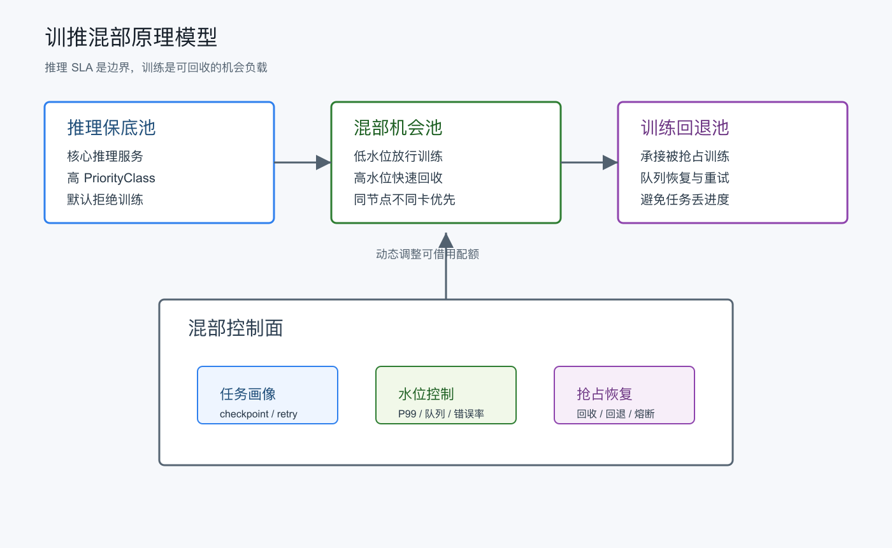
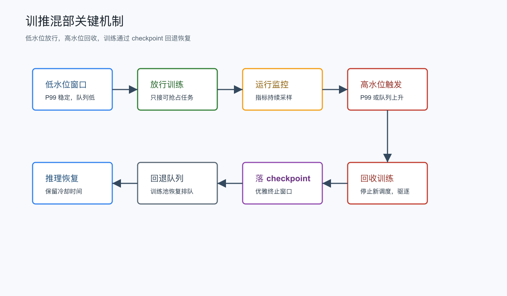
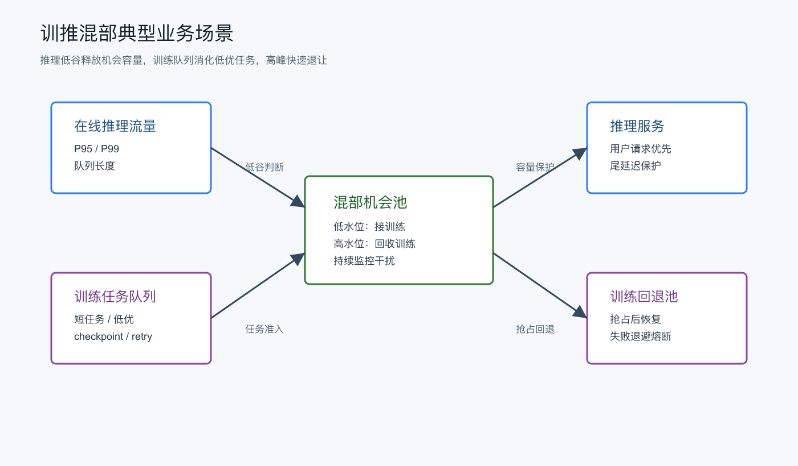
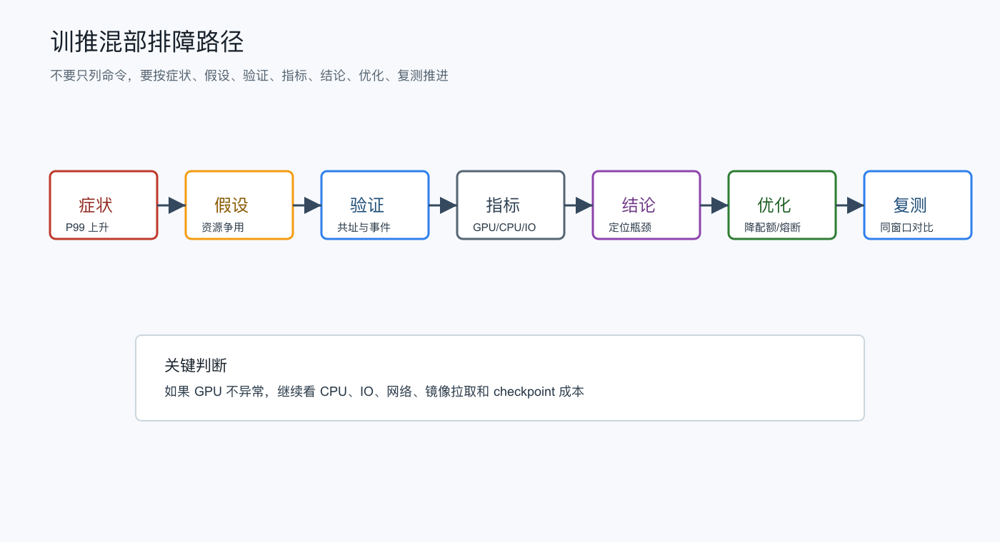
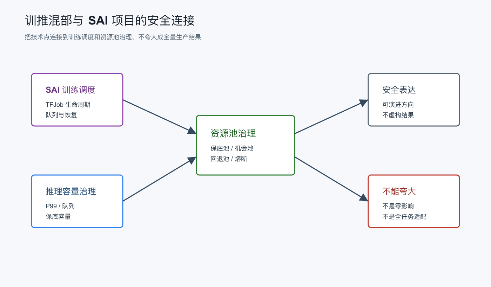

# 面试定位卡

- **技术点**：训推混部，也可以表述为训练推理资源协同调度。
- **所属领域**：AI Infra、GPU 资源调度、Kubernetes 批任务治理、在线服务稳定性。
- **面试价值**：能体现你不只关注训练吞吐，也能把在线推理 SLA、资源利用率、抢占恢复和收益评估放到一个框架里讲。
- **常见考法**：为什么不能简单把训练任务塞到推理 GPU 上；如何保护推理 P95/P99；如何判断哪些训练适合混部；训练被回收后怎么恢复；如何证明 ROI。
- **适合挂钩项目**：SAI 的训练任务调度、TFJob 生命周期、GPU 资源池治理、在线推理平台容量治理、潮汐调度方案。
- **不适合夸大的地方**：不要说做到了推理零影响；不要说所有训练都适合混部；不要把同卡并发当默认方案；不要只用 GPU 利用率证明收益。

# 三十秒回答

> 训推混部不是把训练任务硬塞到推理集群，而是在推理 SLA 保护水位之下，把可中断、可 checkpoint、可重试的训练作为机会负载放进去。
> 它解决的是推理低谷期 GPU 空闲和训练排队并存的问题。
> 代价是调度系统必须处理训练抢占、恢复、退避和收益核算。
> 面试里我会重点讲三件事：推理保护水位、训练可回收机制、以及是否真的有 ROI。

# 为什么需要它

- **没有它之前的问题**：推理服务为了峰值预留 GPU，低谷期资源空闲；训练任务又经常排队，整体 GPU 利用率和任务交付效率都不理想。
- **它的解决方式**：把推理资源分成保底池和可借用池，低谷时允许低优训练进入，推理升高时快速回收训练。
- **它引入的新问题**：训练会带来显存、算力、PCIe、CPU、IO、镜像拉取和网络干扰，控制不好会放大推理尾延迟。
- **必须关注的场景**：在线推理 P95/P99 敏感、长耗时请求占比高、GPU 型号相对统一、训练任务能 checkpoint 且失败代价可控。

# 核心概念表

- **推理保底池**
  - 解释：为在线推理保留的 GPU 容量，默认不承接训练。
  - 面试展开点：这是 SLA 底线，不应该为了利用率随意打穿。
- **混部机会池**
  - 解释：推理低谷时可以借给训练的 GPU 池，推理上升时优先回收。
  - 面试展开点：核心不是“能不能跑训练”，而是“什么时候能放，什么时候必须收”。
- **训练回退池**
  - 解释：被抢占训练恢复排队的兜底位置。
  - 面试展开点：回收训练不能等于任务丢失，需要配合 checkpoint 和重试。
- **推理保护水位**
  - 解释：由 P95/P99、队列长度、活跃请求、GPU util、错误率等指标组成的保护阈值。
  - 面试展开点：单看 GPU util 不够，尾延迟和队列堆积更关键。
- **可抢占训练**
  - 解释：支持优雅终止、checkpoint、重试和恢复的低优训练任务。
  - 面试展开点：没有可恢复能力，混部风险会被放大。
- **ROI**
  - 解释：混部带来的额外 GPU 利用和训练吞吐收益，扣除 checkpoint、重试、延期和稳定性成本后的净收益。
  - 面试展开点：ROI 不能只看平均 GPU 使用率。

# 原理模型



## 基础设施层

- GPU 节点按资源属性划分为推理保底池、混部机会池和训练回退池。
- 在 4090 这类不以 MIG 为主路线的假设下，优先考虑节点级或卡级隔离，不把同卡强并发作为第一阶段目标。
- 资源干扰不只来自 GPU core，还包括显存、PCIe、CPU 预处理、磁盘缓存、镜像拉取和网络。

## 容器 / Kubernetes 层

- 通过 `PriorityClass` 保证推理 Pod 优先级高于训练 Pod。
- 通过 `taint/toleration`、`nodeSelector`、`affinity` 控制训练只能进入可借用资源池。
- 通过批任务队列系统承接训练排队、抢占、恢复和回退，例如 Kueue 或 Volcano。

## AI Infra 层

- 画像服务判断训练是否可混部：是否 checkpoint、是否可重试、最大可接受回收时延、任务时长和失败代价。
- 水位控制器根据推理指标调整可借用 GPU 配额。
- 抢占控制器在推理接近高水位时暂停新训练、驱逐低优训练，并把任务放回训练队列。

## 应用 / 业务层

- 推理侧看的是请求成功率、P95/P99、队列等待和超时率。
- 训练侧看的是吞吐、恢复成功率、重试次数、checkpoint 开销和交付延期。
- 平台侧需要把稳定性和利用率一起验收，不能只展示“GPU 忙起来了”。

# 关键机制



## GPU 配额分层

解决的问题：

防止训练直接侵入推理安全余量，让混部从一开始就有资源边界。

工作方式：

- 将 GPU 容量拆成 `reserved`、`burstable`、`fallback` 三类。
- `reserved` 只服务核心推理。
- `burstable` 在低水位窗口借给训练。
- `fallback` 承接被抢占训练的恢复排队。

代价：

训练吞吐不是稳定值，调度结果会随着推理流量变化。

面试追问：

为什么不把所有 GPU 都做成动态共享池？

## 水位驱动的放行与回收

解决的问题：

让训练进入和退出推理资源池有明确触发条件，而不是靠人工判断。

工作方式：

- 低水位持续一段时间后，放行可混部训练。
- 高水位触发后，先停止新训练调度，再优雅回收低优训练。
- 使用高低双阈值和冷却时间，避免负载在阈值附近来回震荡。

代价：

阈值设计过保守会浪费资源，过激进会影响推理尾延迟。

面试追问：

如何避免高低水位反复触发导致调度抖动？

## 训练任务可抢占化

解决的问题：

推理扩容时，训练能够让路，但不应该丢失大量进度。

工作方式：

- 准入时要求 `checkpointEnabled=true`、`retryable=true`，并声明最大可接受回收时延。
- 回收时先发优雅终止信号，给任务短窗口落 checkpoint。
- checkpoint 完成或超时后，任务回到训练队列恢复。

代价：

checkpoint 会增加 IO 和训练框架复杂度，频率过高会吞掉混部收益。

面试追问：

如果一个大模型训练 checkpoint 很重，还适合进入混部池吗？

## 失败退避与熔断

解决的问题：

避免训练反复进入混部池又反复被抢占，造成平台抖动和无效重试。

工作方式：

- 按任务维度记录抢占次数、恢复耗时和失败原因。
- 按资源池维度记录推理高水位触发频率。
- 超过阈值后，将任务或资源池临时熔断，回退到训练池。

代价：

熔断会降低短期利用率，但可以换取系统稳定性。

面试追问：

什么时候应该认为混部策略失效，而不是继续调参？

# 横向对比

- **池级混部 vs 同卡并发**
  - 区别：池级混部主要控制任务能否进入某类节点；同卡并发会在同一张 GPU 上争用算力和显存。
  - 什么时候用：第一阶段优先池级混部；同卡并发只在压测充分、任务 QoS 很低、资源隔离明确时尝试。
  - 面试注意点：不要把“GPU 空着”直接推导成“同卡并发一定赚”。
- **平均 GPU 利用率 vs 推理尾延迟**
  - 区别：平均利用率体现资源是否忙；尾延迟体现用户请求是否被拖慢。
  - 什么时候用：收益评估看利用率，准入和回收看尾延迟、队列和错误率。
  - 面试注意点：在线推理场景下，P95/P99 比均值更能说明风险。
- **训练抢占 vs 训练失败**
  - 区别：抢占是预期内的资源回收；失败是任务异常或恢复不符合预期。
  - 什么时候用：混部场景应把抢占做成一等状态，而不是都归类为失败。
  - 面试注意点：抢占必须配合 checkpoint、重试和状态机。
- **调度时决策 vs 运行时治理**
  - 区别：调度时决定任务能不能进；运行时决定负载变化后要不要收。
  - 什么时候用：训推混部必须两者都有，只靠调度准入无法应对流量突增。
  - 面试注意点：混部不是一次性调度问题，而是持续控制问题。
- **可中断短任务 vs 强同步长任务**
  - 区别：短任务恢复成本低，长任务被抢占后可能损失大量进度。
  - 什么时候用：小规模增量训练、补数据、评估任务更适合；多机多卡强同步训练默认谨慎。
  - 面试注意点：不要承诺所有训练都能通过 checkpoint 低成本恢复。

# 典型业务场景



- **推理夜间低谷，训练任务排队**
  - 为什么相关：推理保留了峰值容量，但夜间 GPU 空闲。
  - 可能现象：推理 P95 稳定，GPU util 偏低，训练队列等待时间长。
  - 排查方式：看推理低水位是否持续、训练任务是否可 checkpoint、混部池是否有可借用配额。
  - 优化方向：放行低优短训练，并设置高水位回收。
- **推理突然升高，需要回收训练**
  - 为什么相关：混部必须保证推理优先。
  - 可能现象：请求队列增长、P99 上升、训练 Pod 被驱逐或进入恢复队列。
  - 排查方式：看高水位触发指标、抢占耗时、checkpoint 完成率和恢复成功率。
  - 优化方向：缩短回收链路，调整 checkpoint 周期，必要时降低混部配额。
- **训练频繁被抢占，收益不明显**
  - 为什么相关：混部不是只要能跑就值得跑。
  - 可能现象：训练重试次数高、有效训练时长低、checkpoint IO 增大。
  - 排查方式：计算有效训练时间和恢复成本，按任务画像聚合抢占原因。
  - 优化方向：把长任务拆分，限制进入混部池的任务类型，或者对该时间段熔断。
- **推理延迟被非 GPU 资源拖慢**
  - 为什么相关：训练可能争用 CPU、磁盘、网络和镜像缓存。
  - 可能现象：GPU util 不高但 P99 上升，CPU steal、IO wait 或网络重传异常。
  - 排查方式：同时看节点级 CPU、内存、磁盘、网络和容器指标。
  - 优化方向：限制训练 sidecar、数据加载并发、镜像拉取窗口和本地缓存策略。

# 排障路径



- **症状**：推理 P99 上升，训练刚进入混部池。
- **初始假设**：训练争用了 GPU、CPU、IO、网络中的某类资源，或者回收水位触发过慢。
- **验证命令**：

```bash
kubectl get pod -n <namespace> -o wide
```

这条命令用于验证什么：

确认推理 Pod 和训练 Pod 是否落在同一批节点或同一个混部池。

重点看什么：

节点分布、Pod 状态、重启次数、是否有训练 Pod 正在与推理服务共址。

异常说明什么：

如果训练进入了推理保底池，优先检查 `taint/toleration`、`nodeSelector` 和准入策略。

```bash
kubectl describe pod <pod-name> -n <namespace>
```

这条命令用于验证什么：

确认训练或推理 Pod 的调度原因、优先级、驱逐事件和资源声明。

重点看什么：

`PriorityClass`、事件中的 `Preempted` / `Evicted` / `FailedScheduling`、资源 request/limit。

异常说明什么：

如果推理没有更高优先级，说明调度层保护不够；如果训练无法被驱逐，说明抢占链路不完整。

```bash
kubectl top pod -n <namespace>
kubectl top node
```

这条命令用于验证什么：

快速判断 CPU 和内存是否出现共址争用。

重点看什么：

训练数据加载进程、推理服务 CPU 使用、节点内存压力。

异常说明什么：

如果 GPU 指标正常但 CPU 或内存异常，问题可能不在 GPU，而在预处理、缓存或 sidecar。

```bash
nvidia-smi dmon -s pucm
```

这条命令用于验证什么：

观察 GPU 利用率、显存和温度等运行状态。

重点看什么：

推理进程和训练进程是否同时占用同卡，显存是否接近上限，GPU util 是否持续打满。

异常说明什么：

如果同卡竞争明显，应回退到同节点不同卡或池级隔离，不要继续扩大同卡并发。

- **关键指标**：推理 P95/P99、队列长度、超时率、错误率、GPU util、显存使用、CPU 使用、IO wait、训练抢占次数、checkpoint 成功率、恢复耗时。
- **可能结论**：混部准入过宽、回收水位过高、训练任务画像不适合、资源池隔离失效、或者非 GPU 资源成为瓶颈。
- **优化动作**：降低混部配额；收紧训练准入；增加高低水位滞回；缩短回收超时；将长任务移出混部池；补充节点级资源隔离。
- **复测方式**：用同一流量窗口对比混部前后 P99、训练有效运行时长、抢占恢复成功率和净 GPU 利用收益。

# 风险、边界和误区

- **说法 / 做法**：训推混部能保证推理零影响。
  - 问题：任何共址和共享都会有干扰风险，只是可以通过水位和隔离控制在可接受范围。
  - 更稳妥的表达：目标是在 SLA 保护水位内提升利用率，而不是承诺零影响。
- **说法 / 做法**：4090 空闲就应该做同卡并发。
  - 问题：4090 不适合作为 MIG 主路线，同卡争用显存和算力会直接影响尾延迟。
  - 更稳妥的表达：优先池级或卡级隔离，同卡并发只作为压测后的低优优化。
- **说法 / 做法**：checkpoint 开了就都适合混部。
  - 问题：checkpoint 成本、恢复时间和任务同步方式差异很大。
  - 更稳妥的表达：还要看 checkpoint 周期、恢复耗时、任务时长和失败代价。
- **说法 / 做法**：ROI 看 GPU 利用率提升就够。
  - 问题：利用率提升可能伴随推理抖动、训练反复重试和 IO 成本。
  - 更稳妥的表达：ROI 要扣除稳定性成本、恢复成本和任务延期成本。
- **说法 / 做法**：混部只是调度器策略。
  - 问题：运行时流量变化、抢占恢复和熔断都不是一次性调度能解决的。
  - 更稳妥的表达：它是调度准入、运行时水位控制和任务生命周期治理的组合。

# 和项目的安全连接



## 了解型说法

我理解训推混部的核心不是追求 GPU 利用率数字，而是在推理 SLA 有保护的前提下，把可中断训练作为机会负载。这个问题和 SAI 的训练任务调度、TFJob 生命周期、GPU 资源池治理是相关的，但不能简单说所有训练都能直接搬到推理资源上跑。

## 排查型说法

如果线上出现“训练进入混部池后推理尾延迟上升”，我会先确认推理和训练是否共址，再看 P95/P99、队列长度、错误率、GPU 显存、CPU、IO 和网络指标。然后判断是 GPU 竞争、非 GPU 资源争用、回收水位过慢，还是训练任务画像不适合。

## 实践型说法

如果要在平台里落地，我会先做低风险版本：推理保底池、混部机会池、训练回退池三类资源池；只允许可 checkpoint、可重试、低优短任务进入；推理高水位时回收训练；训练恢复交给队列系统。等指标稳定后，再考虑更细粒度的卡级共享。

## 不能说的话

- 不能说我已经验证过所有模型和所有训练任务都适合训推混部。
- 不能说混部后推理一定没有任何影响。
- 不能说只靠 Kubernetes 调度器就能完整解决运行时回收。
- 不能说 4090 可以像具备成熟 MIG 能力的卡一样做强隔离。
- 不能说 GPU 利用率提升就是最终收益。

# 面试追问树

```text
Q1：训推混部解决什么问题？
  └── Q2：为什么不能直接把训练放到推理 GPU 上？
        └── Q3：推理保护水位应该看哪些指标？
              └── Q4：训练任务被抢占后怎么恢复？
                    └── Q5：如何避免频繁放行和回收造成抖动？
                          └── Q6：哪些训练任务适合混部，哪些不适合？
                                └── Q7：如果 P99 上升，你怎么排查？
                                      └── Q8：这个技术点怎么和 SAI 项目安全连接？
```

# 高频 Q&A

## 训推混部一句话怎么解释？

它是在推理 SLA 保护水位下，把可中断训练作为机会负载借用推理低谷期 GPU。重点不是“混在一起跑”，而是“能放、能收、能恢复、能证明收益”。

## 为什么推理优先级必须高于训练？

推理面对在线请求，尾延迟和超时会直接影响用户体验；训练通常更偏吞吐，可以延迟、重试和恢复。所以混部里推理是边界条件，训练是机会负载。

## 为什么不建议一开始做同卡并发？

同卡并发会直接竞争显存和算力，推理尾延迟风险更高。更稳妥的路径是先做资源池级混部或同节点不同卡，等压测证明可控后再考虑同卡低优共享。

## 推理保护水位应该看什么？

不能只看 GPU util。至少要看 P95/P99、队列长度、活跃请求数、超时率、错误率、显存、CPU、IO 和网络。在线推理里，尾延迟比平均利用率更敏感。

## 哪些训练任务适合进入混部池？

适合的是低优、短耗时、可 checkpoint、可重试、失败代价低的任务，比如小规模增量训练、补数据、离线评估。多机多卡强同步、超长任务、恢复成本高的任务要谨慎。

## 训练被抢占后怎么保证不丢进度？

准入时要求任务支持 checkpoint 和重试，回收时先发优雅终止信号，让任务在短窗口内落 checkpoint。之后任务回到训练队列，从 checkpoint 恢复，而不是从头开始。

## 如何避免水位反复触发？

用高低双阈值、持续窗口和冷却时间。比如低水位连续一段时间才放行训练，高水位触发后先停止新训练，再逐步回收，并在恢复前等待指标稳定。

## 如果混部后推理 P99 上升，你怎么排查？

先看推理和训练是否共址，再看是否同卡竞争；如果 GPU 不异常，就看 CPU、IO、网络和镜像拉取。然后检查水位触发是否滞后、抢占是否成功、训练任务是否不适合混部。

## 怎么证明训推混部有 ROI？

要同时看收益和成本。收益包括低谷期额外消化的训练量、GPU 空闲回收时长和训练等待时间下降；成本包括推理抖动、checkpoint IO、训练重试、恢复耗时和延期。

## 这个技术点和 SAI 怎么连接才安全？

可以说它和 SAI 的训练调度、TFJob 生命周期、GPU 资源池和推理容量治理相关，是一个可演进方向。除非有明确生产落地证据，不要说已经全量实现或验证了所有场景。

# 三档背诵版

## 三十秒版

训推混部是在推理 SLA 保护水位下，把可中断训练作为机会负载借用推理低谷期 GPU。核心是三件事：推理水位保护、训练可抢占恢复、以及 ROI 评估。它适合低优短训练，不适合一上来做所有任务的同卡并发。

## 三分钟版

我会把训推混部拆成资源池、控制面和任务画像三层。资源池上有推理保底池、混部机会池和训练回退池；控制面用 P95/P99、队列长度、错误率、GPU、CPU、IO 等指标做高低水位；任务画像要求训练可 checkpoint、可重试、可接受回收。推理低谷时放训练，高水位时先停新训练，再优雅抢占，最后回退到训练池。排障时先确认共址和资源竞争，再看水位触发、抢占恢复和 checkpoint 成本。收益不能只看 GPU 利用率，还要扣除推理抖动和训练恢复成本。

## 五分钟版

训推混部本质是在线服务稳定性和离线训练吞吐之间的控制问题。它不是单纯调度策略，也不是简单共址。落地上我会先做低风险池级混部：推理保底池保证核心容量，混部机会池在低水位窗口放行低优训练，训练回退池承接被抢占任务。训练准入要看是否 checkpoint、是否可重试、最大回收时延、任务时长和失败代价。运行时用高低双阈值、冷却时间和熔断避免抖动。排障时按“症状、假设、验证、指标、结论、优化、复测”走，尤其关注 P99、队列长度、CPU/IO/网络争用和抢占恢复成功率。和 SAI 项目连接时，我会把它说成训练调度和 GPU 资源池治理的演进方向，而不是夸大成所有场景已经验证的生产结果。

# 图示清单

| 图片 | 对应章节 | 目的 | 优先级 |
|---|---|---|---|
| `01_training_inference_principle.png` | 原理模型 | 说明推理保底池、混部机会池、训练回退池和控制面的关系 | 高 |
| `02_training_inference_reclaim_mechanism.png` | 关键机制 | 说明低水位放行、高水位回收、checkpoint 和回退流程 | 高 |
| `03_training_inference_scenario.png` | 典型业务场景 | 说明推理流量、训练队列和混部资源池的生产链路 | 中 |
| `04_training_inference_troubleshooting.png` | 排障路径 | 说明从 P99 上升到复测的排障方法 | 高 |
| `05_training_inference_project_connection.png` | 和项目的安全连接 | 说明技术点如何安全连接到 SAI 平台能力 | 中 |

# 面试前检查清单

- [ ] 我能用三十秒讲清楚训推混部是什么。
- [ ] 我能解释它为什么存在。
- [ ] 我能说出推理保底池、混部机会池和训练回退池的区别。
- [ ] 我能解释水位驱动、训练抢占、checkpoint 恢复和熔断退避。
- [ ] 我能说明池级混部和同卡并发的边界。
- [ ] 我能说出至少三个适合混部和不适合混部的任务画像。
- [ ] 我能按“症状 → 假设 → 验证 → 指标 → 结论 → 优化 → 复测”讲排障。
- [ ] 我知道不能把 GPU 利用率提升直接等同于 ROI。
- [ ] 我知道如何和 SAI 的训练调度、TFJob、GPU 资源池治理安全连接。
- [ ] 文档包含原理模型图、关键机制图、业务场景图、排障流程图和项目连接图。
