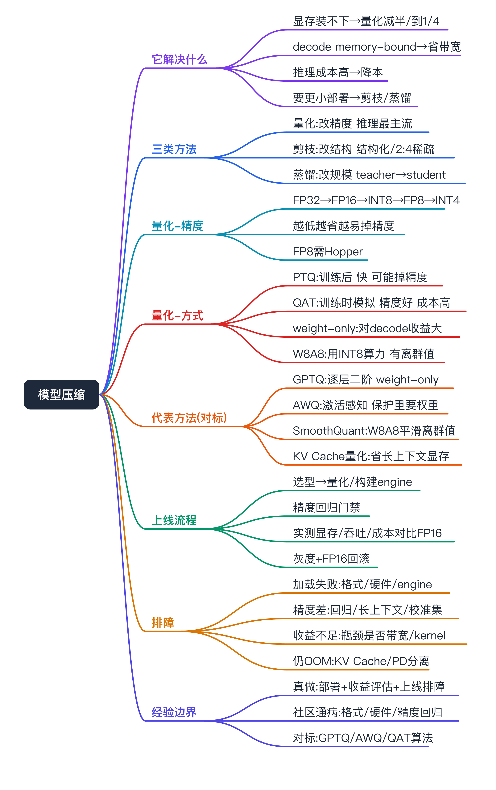
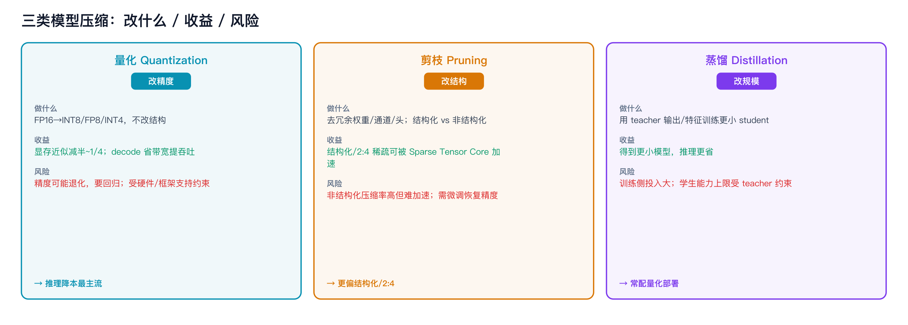
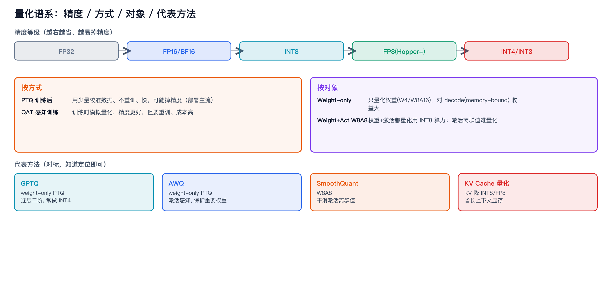
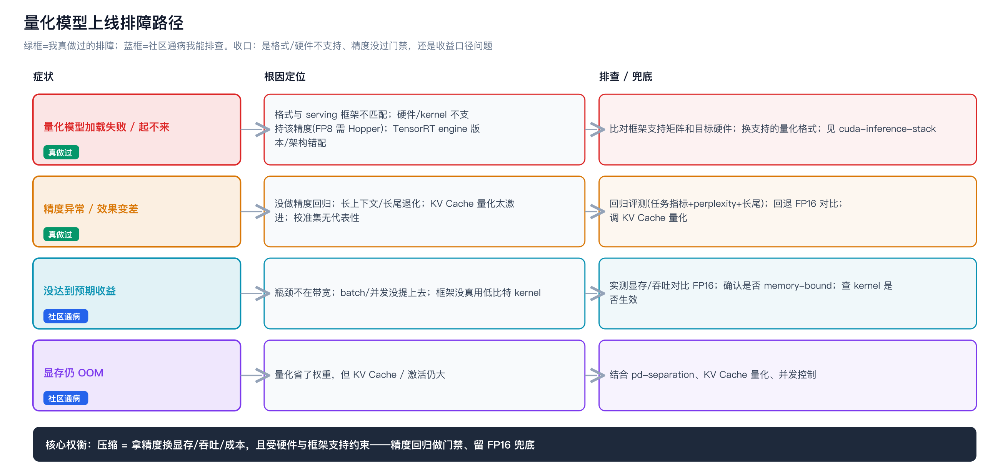

模型压缩（量化 / 剪枝 / 蒸馏，面试对标）



```yaml
experience_level: adjacent_production_experience
# 平台/推理服务侧（部署量化模型、评估显存/吞吐/成本收益与精度回归、量化模型上线的加载/兼容/精度排查、容量评估时把量化纳入成本测算）是我真实做过的相邻经验。
# 「上量化基本绕不开」的社区通病（量化模型加载/格式不匹配、kernel/硬件不支持某精度、精度回归没测、KV Cache 量化影响长上下文）：我能讲原理与排查，不包装成亲历事故。
# 内核侧（GPTQ/AWQ/SmoothQuant 量化算法实现、QAT 训练、剪枝与蒸馏算法）是理论对标，不是我写的。
# 推理服务化见 inference-serving-sre；Prefill/Decode 与 memory-bound 见 pd-separation；CUDA/精度/Tensor Core 见 cuda-inference-stack。本篇聚焦「压缩怎么省、收益与精度怎么权衡、上线怎么排障」。
```

# 经验边界

先把边界说清楚，避免被一插到底击穿：

- **我真实做过的（相邻经验）**：推理服务上线时部署量化模型、从显存/吞吐/成本角度评估量化收益、把量化纳入容量与成本测算、量化模型「加载失败 / 精度异常 / 框架不支持」这类上线问题的排查兜底。
- **社区必踩坑（我能排查，非亲历事故）**：量化格式与 serving 框架不匹配、目标硬件/kernel 不支持某精度（如 FP8 需 Hopper）、精度回归没评估就上线、KV Cache 量化拖累长上下文质量。
- **我没直接做过的（理论对标）**：GPTQ/AWQ/SmoothQuant 的量化算法实现、QAT 训练、结构化剪枝与知识蒸馏的算法工程——能讲清「解决什么、对部署意味着什么」，不是我写的。
- **配套文档**：推理服务化见 [inference-serving-sre](../inference-serving-sre/inference_serving_framework_sre.md)、Prefill/Decode 与 memory-bound 见 [pd-separation](../pd-separation/pd-separation.md)、数值精度/Tensor Core/TensorRT 见 [cuda-inference-stack](../cuda-inference-stack/cuda-inference-stack.md)、GPU 显存与带宽见 [gpu-fundamentals](../gpu-fundamentals/gpu-fundamentals.md)、容量/成本测算见 [capacity-evaluation](../../apm-sre/capacity-evaluation/capacity-evaluation.md)。

# 为什么需要掌握

- **面试高频且 JD 点名**：大模型 SRE / AI Infra，推理降本就绕不开量化。说不清量化的收益来源和精度风险，成本和稳定性那块就讲不深。
- **和我经验相邻**：我做的是推理服务上线和容量/成本评估，理解压缩才能解释「为什么量化后能装更大模型 / 更高并发」「为什么精度要回归」「为什么这张卡不支持 FP8」。
- **直接连成本与显存**：压缩本质是拿精度换显存/吞吐/成本，正好接上 [pd-separation](../pd-separation/pd-separation.md) 的 memory-bound 和 [capacity-evaluation](../../apm-sre/capacity-evaluation/capacity-evaluation.md) 的成本测算。

# 它解决什么问题（压缩为什么存在）

按问题域理解，而不是背算法：

- **大模型显存装不下 / 装不大**
  - 对应能力：量化把权重从 FP16 降到 INT8/INT4，显存近似减半 / 减到 1/4，能装更大模型、更长上下文、更高并发。
  - 面试表达：7B 模型 FP16 约 14GB，INT4 约 3.5GB，单卡能力差很多。
- **推理 decode 阶段卡显存带宽（memory-bound）**
  - 对应能力：weight-only 低比特量化减少每步要搬的权重字节数，直接提 decode 吞吐（[pd-separation](../pd-separation/pd-separation.md)、[gpu-fundamentals](../gpu-fundamentals/gpu-fundamentals.md)）。
  - 面试表达：decode 是 memory-bound，量化省的是带宽，所以 weight-only 收益明显。
- **推理成本高，要降本**
  - 对应能力：同样卡能服务更多请求 / 更大模型，单 token 成本下降。
  - 面试表达：量化是推理降本最直接的手段之一，但要拿精度评估兜底。
- **模型太大、要更小的部署形态**
  - 对应能力：剪枝去掉冗余结构、蒸馏训练更小的学生模型。
  - 面试表达：量化改精度不改结构，剪枝/蒸馏改结构/规模，常组合使用。

# 核心概念

## 三类压缩方法（先建立全景）



- **量化 Quantization**：降低权重/激活的数值精度（FP16→INT8/FP8/INT4）。改精度不改结构，**推理降本最主流**。
- **剪枝 Pruning**：去掉冗余的权重/通道/注意力头。改结构。
  - 非结构化（稀疏单个权重）：压缩率高但**不规则、难在 GPU 上加速**。
  - 结构化（去整通道/头/层）：规则、**易加速**；**2:4 结构化稀疏**可被 Ampere+ 的 Sparse Tensor Core 加速。
- **蒸馏 Distillation**：用大模型（teacher）的输出/中间特征训练小模型（student），让小模型逼近大模型能力。改规模。

## 量化的关键维度（最该讲清的一块）



- **精度等级**：FP32 → FP16/BF16 → INT8 → FP8（Hopper+）→ INT4/INT3。越低越省、越容易掉精度。
- **PTQ vs QAT**：
  - **PTQ（训练后量化）**：不重训，用少量校准数据定量化参数，快、便宜，可能掉精度；推理部署主流。
  - **QAT（量化感知训练）**：训练时模拟量化，精度更好，但要重训、成本高。
- **量化对象**：
  - **Weight-only（W4/W8A16）**：只量化权重、激活保持高精度。对 LLM decode（memory-bound）收益大，精度损失相对小。**AWQ、GPTQ** 属于这类。
  - **Weight + Activation（W8A8）**：权重和激活都量化，能用 INT8 算力，但激活有离群值（outlier）难量化。**SmoothQuant** 把激活离群值迁移到权重来缓解。
- **代表方法（理论对标，知道定位即可）**：
  - **GPTQ**：逐层、基于二阶信息的权重 PTQ，常做到 INT4。
  - **AWQ**：激活感知的权重量化，保护「重要权重」少量高精度，掉精度小。
  - **SmoothQuant**：W8A8，平滑激活离群值。
  - **KV Cache 量化**：把 KV Cache 降到 INT8/FP8，省长上下文显存，但可能影响长序列质量。

## 剪枝与蒸馏（点到为止）

- **剪枝粒度**：结构化（易加速、压缩率有限）vs 非结构化（压缩率高、难加速）；生产更偏结构化或 2:4 稀疏。
- **蒸馏形式**：logits 蒸馏（学输出分布）、特征蒸馏（学中间层）；常和量化/剪枝组合，先蒸出小模型再量化部署。
- **面试一句话**：量化改精度、剪枝改结构、蒸馏改规模；推理降本最常用量化，剪枝/蒸馏更重训练侧投入。

## 核心权衡（贯穿全文）

压缩 = 拿**精度**换**显存 / 吞吐 / 成本**，且受**硬件与框架支持**约束：低比特省得多但要评估精度回归；某些精度（FP8/INT4）依赖特定硬件和 kernel；serving 框架（vLLM/TensorRT-LLM）只支持部分量化格式。

# 一个量化模型上线要走哪些环节

- **选方法**：按目标（省显存还是提吞吐）、硬件（是否支持 FP8/INT4 kernel）、框架支持选 PTQ weight-only（AWQ/GPTQ）还是 W8A8（SmoothQuant）。
- **量化/构建**：PTQ 用校准集生成量化模型；TensorRT-LLM 等需构建 engine（绑架构+版本，见 [cuda-inference-stack](../cuda-inference-stack/cuda-inference-stack.md)）。
- **精度评估**：在任务指标 / perplexity / 业务评测上做回归，关注长尾和长上下文退化，过线才上。
- **部署与收益核算**：在 serving 框架（vLLM/TRT-LLM）加载，实测显存、吞吐、单 token 成本，对比 FP16 基线（[capacity-evaluation](../../apm-sre/capacity-evaluation/capacity-evaluation.md)）。
- **灰度上线**：小流量对比精度和延迟，再放量，可回滚到 FP16。

# 如果让我落地，我会怎么设计（假设落地）

以「用量化给推理稳定降本」为目标：

- **方法选型**：在线大模型 decode 优先 weight-only（AWQ/GPTQ，W4A16）拿带宽收益；需要 INT8 算力且能控离群值时考虑 W8A8（SmoothQuant）；长上下文显存紧再评估 KV Cache 量化。
- **硬件/框架对齐**：先确认目标卡支持的精度（FP8 需 Hopper）和 serving 框架支持的量化格式，避免量化完发现跑不起来。
- **精度门禁**：把精度回归做成上线门禁（业务评测 + perplexity + 长尾用例），不过线不上，留 FP16 兜底。
- **收益与成本核算**：量化纳入容量模型，按显存/吞吐/单 token 成本算 ROI（[capacity-evaluation](../../apm-sre/capacity-evaluation/capacity-evaluation.md)）。
- **可观测**：监控量化模型的延迟、吞吐、显存，以及（有评测管道时）精度漂移。
- **灰度与回滚**：量化版本灰度对比再放量，保留 FP16 可回滚。
- **风险控制**：不同量化格式/精度变更走小流量验证，不一刀切全量替换。

# 如果线上出问题，我怎么排查



可操作路径：

- **量化模型加载失败 / 起不来**：量化格式与 serving 框架不匹配、kernel/硬件不支持该精度（FP8 需 Hopper、INT4 需对应 kernel）、TensorRT engine 版本/架构错配（[cuda-inference-stack](../cuda-inference-stack/cuda-inference-stack.md)）→ 比对框架支持矩阵和目标硬件。
- **精度异常 / 效果变差**：是否做了精度回归、是否长上下文/长尾退化、是否 KV Cache 量化太激进、校准集是否有代表性 → 回退 FP16 对比定位。
- **没达到预期收益**：是不是 weight-only 但瓶颈不在带宽、batch/并发没提上去、框架没真正用低比特 kernel → 实测显存和吞吐对比基线。
- **显存仍 OOM**：量化省了权重但 KV Cache / 激活仍大 → 结合 [pd-separation](../pd-separation/pd-separation.md)、KV Cache 量化、并发控制。
- **收口**：把现象翻译成结论——是格式/硬件不支持、还是精度没过门禁、还是收益评估口径问题，给出换格式/补评测/调部署的建议，而不是甩一句「量化没用」。

# 和我现有经验的映射（后置）

- **部署量化模型、评估显存/吞吐/成本收益、量化上线的加载/精度/兼容排查、容量成本测算**：真实经验映射=推理服务上线与容量/成本评估；能讲清问题怎么发生、怎么定位、怎么兜底。
- **量化格式不匹配 / 硬件不支持 / 精度没回归 / KV Cache 量化退化**：社区通病，我能讲原理与排查路径，非亲历事故。
- **GPTQ/AWQ/SmoothQuant 算法、QAT、剪枝/蒸馏实现**：无直接生产映射；理论对标，不包装成自己写过。

# 面试话术

## 30 秒版

模型压缩三类：量化降数值精度、剪枝去冗余结构、蒸馏训更小的模型。推理降本最常用量化，本质是拿精度换显存、吞吐和成本。比如 7B 模型 FP16 约 14G、INT4 约 3.5G，能装更大模型、更高并发。decode 是 memory-bound，weight-only 低比特量化省的是带宽，收益直接。代价是精度可能退化，要做回归，还受硬件和框架支持约束。我做的是平台侧部署量化模型、评估收益和精度、排查上线问题，量化算法本身是对标理解。

## 3 分钟版

我从「为什么压缩」讲起。大模型推理两个痛点：显存装不下、成本高。压缩三条路：量化改精度、剪枝改结构、蒸馏改规模，推理降本最主流是量化。

量化的关键维度我会讲清。精度从 FP16 往下到 INT8、FP8、INT4，越低越省也越容易掉精度。方式上 PTQ 是训练后量化，用少量校准数据、不重训、快，部署主流；QAT 训练时模拟量化、精度更好但要重训。对象上 weight-only 只量化权重，对 LLM decode 这种 memory-bound 场景收益大、掉精度小，AWQ 和 GPTQ 属于这类；W8A8 把激活也量化能用 INT8 算力，但激活有离群值，SmoothQuant 就是来平滑离群值的。还有 KV Cache 量化省长上下文显存。

核心权衡是拿精度换显存吞吐成本，且受硬件和框架约束——FP8 要 Hopper，serving 框架只支持部分格式。

放到我的经验：我做的是推理服务上线和容量成本评估，部署过量化模型、从显存吞吐成本算收益、把精度回归做成上线门禁、排查过量化模型加载失败和框架不支持这类问题。算法实现我是对标理解，边界我会说清。

## 5 分钟版

在 3 分钟版基础上展开上线流程和排障。一个量化模型上线我会走：按目标和硬件框架选方法、PTQ 量化或构建 engine、做精度回归门禁、在 serving 框架实测显存吞吐成本对比 FP16、灰度再放量、留 FP16 回滚。排障上：加载失败先查量化格式和框架支持、目标硬件是否支持该精度、engine 是否版本架构错配；精度变差查有没有做回归、是不是长上下文或 KV Cache 量化太激进、校准集是否有代表性；收益不及预期查瓶颈是不是真在带宽、框架有没有真用低比特 kernel；显存还 OOM 就结合 PD 分离和 KV Cache 量化。边界我会讲清：GPTQ/AWQ/SmoothQuant 算法和 QAT、剪枝蒸馏实现是对标理解，平台侧部署、收益评估、上线排障是真做的。

## 短问快答

- **量化省的是什么**：显存（装更大/更长/更高并发）和带宽（decode 提吞吐），代价是精度。
- **PTQ 和 QAT 区别**：PTQ 不重训、快、可能掉精度；QAT 重训、精度好、成本高。
- **weight-only 和 W8A8 区别**：前者只量化权重、对 decode 收益大；后者权重激活都量化、用 INT8 算力但有离群值。
- **AWQ/GPTQ/SmoothQuant 定位**：AWQ/GPTQ 是 weight-only PTQ，SmoothQuant 是 W8A8。
- **量化为什么要回归精度**：低比特可能退化，尤其长尾和长上下文，要评测过门禁再上。

# 不能怎么说

| 不要这么说 | 风险 | 应该这么说 |
|---|---|---|
| 我实现/改了 GPTQ/AWQ 算法 | 没源码和线上证据 | 算法我是对标理解，能讲定位与取舍 |
| 我们自研了量化框架 | 没事实 | 用开源量化 + serving 框架，我做部署和评估 |
| 量化白嫖、没有代价 | 暴露不懂 | 拿精度换收益，要做回归和门禁 |
| 量化提速 N 倍且无损 | 编造收益 | 收益按显存/吞吐/成本度量，精度要评测 |
| 任何卡都能跑 FP8/INT4 | 概念错误 | 受硬件和框架支持约束，FP8 需 Hopper |

# 高频 QA

- **模型压缩有哪几类**：量化（改精度）、剪枝（改结构）、蒸馏（改规模）。
- **推理降本最常用哪个**：量化，拿精度换显存/吞吐/成本。
- **量化精度等级**：FP32/FP16/BF16/INT8/FP8/INT4，越低越省越易掉精度。
- **PTQ vs QAT**：训练后量化（快、可能掉精度）vs 量化感知训练（重训、精度好）。
- **weight-only 为什么对 LLM 好**：decode 是 memory-bound，省权重带宽直接提吞吐，掉精度相对小。
- **W8A8 难点**：激活离群值难量化，SmoothQuant 把离群值迁移到权重缓解。
- **AWQ 和 GPTQ**：都是 weight-only PTQ；AWQ 保护重要权重、GPTQ 用二阶信息逐层量化。
- **KV Cache 量化干嘛**：省长上下文显存，但可能影响长序列质量。
- **结构化和非结构化剪枝**：结构化易加速压缩率有限、非结构化压缩率高难加速；2:4 稀疏可被 Sparse Tensor Core 加速。
- **蒸馏是什么**：用大模型输出训小模型逼近其能力，常配量化部署。
- **量化模型起不来怎么查**：格式与框架是否匹配、硬件是否支持该精度、engine 是否版本架构错配（[cuda-inference-stack](../cuda-inference-stack/cuda-inference-stack.md)）。
- **量化后精度掉了怎么办**：查回归、长上下文/KV Cache 量化、校准集代表性，回退 FP16 对比。
- **量化和 PD 分离关系**：都为推理降本提效；量化省带宽显存、PD 分离按 compute/memory-bound 分池（[pd-separation](../pd-separation/pd-separation.md)）。
- **你没做过量化算法为什么还懂**：推理降本和稳定性都落到压缩的收益与精度权衡、硬件框架支持，我做的是部署、评估和上线排障。

# 面试前检查清单

- [ ] 能讲清三类压缩（量化/剪枝/蒸馏）各改什么、推理为什么最常用量化。
- [ ] 能讲清 PTQ/QAT、weight-only/W8A8、并说出 AWQ/GPTQ/SmoothQuant 定位。
- [ ] 能说清量化收益来源（显存 + 带宽）和精度代价，以及硬件/框架约束。
- [ ] 有量化模型上线流程（选型→量化/构建→精度门禁→实测收益→灰度回滚）。
- [ ] 有加载失败 / 精度退化 / 收益不及预期的排障路径。
- [ ] 明确声明：量化/剪枝/蒸馏算法是对标理解，平台侧部署、收益评估、上线排障是真做的；格式/硬件不支持等是社区通病能排查、不夸大。
- [ ] 没编造性能收益、精度数据、故障次数。
- [ ] 能把压缩接到 [pd-separation](../pd-separation/pd-separation.md) 的 memory-bound 和 [capacity-evaluation](../../apm-sre/capacity-evaluation/capacity-evaluation.md) 的成本测算。
- [ ] 适合口述，不照背算法公式。
