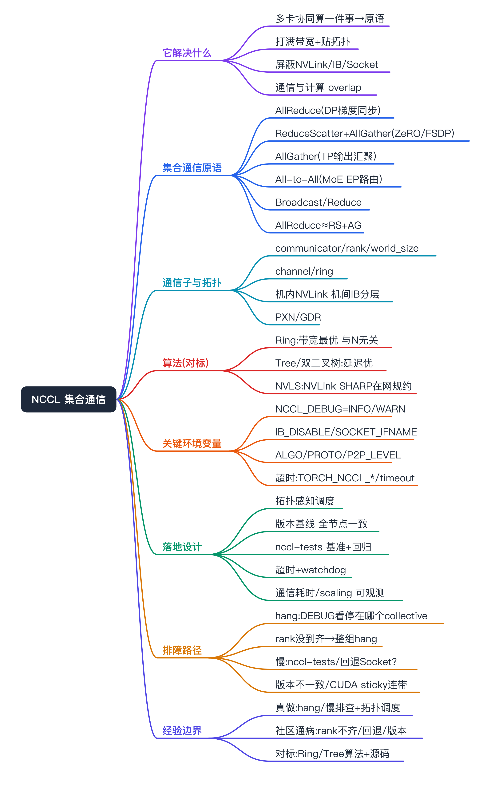
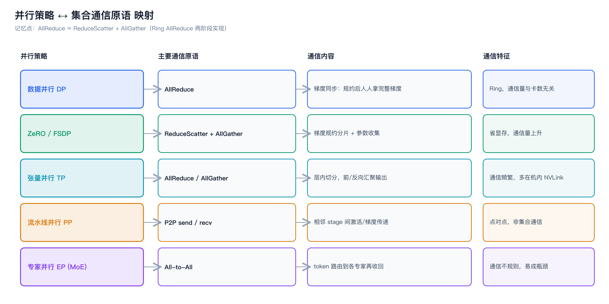
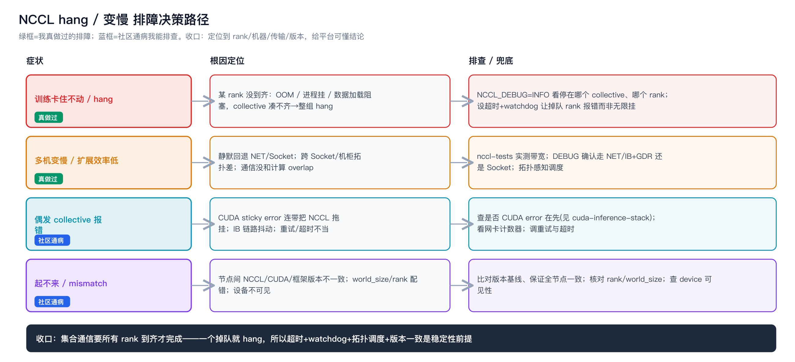

NCCL 集合通信（面试对标）



```yaml
experience_level: adjacent_production_experience
# 平台/SRE 侧（多机多卡训练任务上线与排障、NCCL hang/超时/变慢的定位、NCCL_DEBUG 看日志、拓扑感知调度、版本兼容兜底）是我真实做过的相邻经验。
# 「只要做多卡基本绕不开」的社区通病（NCCL 超时/死锁、rank 不齐、静默回退 Socket、版本不匹配）：我能讲原理与排查，不包装成亲历事故。
# 内核侧（Ring/Tree/NVLS 通信算法实现、NCCL 传输层源码、SHARP 在网计算）是理论对标，不是我写的。
# 传输层（RDMA/GPUDirect RDMA/IB vs Socket）见 gpu-rdma；本篇聚焦「集合通信语义 + 与并行策略的映射 + hang 排障」。
```

# 经验边界

先把边界说清楚，避免被一插到底击穿：

- **我真实做过的（相邻经验）**：多机多卡训练任务在平台上的上线与运维、训练「卡住不动 / step time 异常长 / 多机扩展效率低」这类 NCCL 相关故障的排查与兜底、用 `NCCL_DEBUG` 日志和 nccl-tests 定位、拓扑感知调度与节点画像、NCCL/CUDA 版本兼容。
- **社区必踩坑（我能排查，非亲历事故）**：NCCL collective 超时 / 死锁、某 rank 掉队导致整组 hang、静默回退 Socket 导致变慢、`world_size`/rank 配置不一致、版本不匹配。
- **我没直接做过的（理论对标）**：Ring/Tree/双二叉树/NVLS 通信算法的实现、NCCL 传输层与 proxy 线程源码、SHARP 在网规约——能讲清「解决什么、对运维意味着什么」，不是我写的。
- **配套文档**：传输层（RDMA/GPUDirect RDMA/IB vs Socket/拓扑）见 [gpu-rdma](../gpu-rdma/rdma.md)、GPU 原理见 [gpu-fundamentals](../gpu-fundamentals/gpu-fundamentals.md)、CUDA 栈见 [cuda-inference-stack](../cuda-inference-stack/cuda-inference-stack.md)、分布式并行架构见 [distributed-parallelism](../distributed-parallelism/distributed-parallelism.md)。本篇是「集合通信」这一层。

# 为什么需要掌握

- **面试高频且 JD 点名**：AI Infra / 大模型 SRE 岗，多卡训练和分布式推理的稳定性问题，根因常落在 NCCL 的通信原语、拓扑、超时上。说不清 NCCL，分布式那块就立不住。
- **和我经验相邻**：我做的是多机多卡任务的上线和排障，理解集合通信才能解释「为什么这个训练 hang、为什么扩展效率上不去、为什么换了机型变快」。
- **承上启下**：往下接 RDMA/拓扑（[gpu-rdma](../gpu-rdma/rdma.md)），往上接并行策略（[distributed-parallelism](../distributed-parallelism/distributed-parallelism.md)）——NCCL 是把「并行策略的通信需求」落到「网络/拓扑」的中间层。

# 它解决什么问题（NCCL 为什么存在）

按问题域理解，而不是背 API：

- **多块 GPU 要交换 / 规约数据，且不能各写各的**
  - 对应能力：集合通信原语（AllReduce / AllGather / ReduceScatter / Broadcast / All-to-All），把「N 张卡协同算一件事」标准化。
  - 面试表达：梯度同步、参数广播、激活交换，本质都是几种固定的集合通信模式。
- **通信要打满带宽，还要贴合硬件拓扑**
  - 对应能力：Ring（带宽最优）、Tree / 双二叉树（延迟与大规模更优）、NVLS（NVLink SHARP 在网规约）等算法 + 拓扑探测，自动选 channel。
  - 面试表达：同样是 AllReduce，算法和拓扑选不对，有效带宽差一个量级。
- **用户不想手写 Verbs / 适配每种互联**
  - 对应能力：NCCL 屏蔽 NVLink/PCIe/IB/RoCE/Socket 差异，框架（PyTorch DDP/FSDP、Megatron、vLLM 多卡）直接调，传输自动选择与回退。
  - 面试表达：NCCL 之于多卡通信，类似 cuBLAS 之于矩阵乘——框架调库，不自己写。
- **通信和计算要能重叠，别互相等**
  - 对应能力：NCCL 在 CUDA stream 上异步执行，框架可把通信和反向计算 overlap。
  - 面试表达：scaling efficiency 上不去，常是通信没和计算 overlap 或被拓扑拖慢。

# 核心概念

## 集合通信原语（最该背熟的一块）

每个原语：一句话语义 + 对应哪种并行策略（与 [distributed-parallelism](../distributed-parallelism/distributed-parallelism.md) 呼应）。

- **AllReduce**：所有 rank 的数据按位规约（求和等）后，结果分发回所有 rank。对应**数据并行 DP 的梯度同步**，最高频。
- **ReduceScatter**：规约后把结果**分片**散给各 rank（每个 rank 只拿一片）。对应 **ZeRO / FSDP** 的梯度规约。
- **AllGather**：把各 rank 的分片**收齐**拼成完整数据分发给所有 rank。对应 **ZeRO/FSDP** 参数收集、**张量并行 TP** 的输出汇聚。
- **Broadcast**：从一个 root rank 把数据发给所有 rank。对应参数初始化 / 权重广播。
- **Reduce**：规约结果只汇到一个 root rank。
- **All-to-All**：每个 rank 给每个 rank 发不同的数据。对应 **MoE 专家并行 EP** 的 token 路由、序列并行的重排。
- **关系记忆**：AllReduce ≈ ReduceScatter + AllGather（Ring AllReduce 正是这么实现的）。

## 通信子与拓扑

- **communicator / rank / world_size**：一个通信组、组内编号、组内总数。多数 hang 和「rank 不齐」「world_size 配错」有关。
- **channel / ring**：NCCL 把 GPU 组织成一个或多个环 / 树，数据沿 channel 流动；通道数影响带宽利用。
- **intra-node vs inter-node**：机内走 NVLink/NVSwitch（高带宽），机间走 IB/RoCE（[gpu-rdma](../gpu-rdma/rdma.md)）；NCCL 分层选择，机内规约后再机间。
- **PXN / GDR**：跨 NUMA 经一张近的 NIC 中转、GPUDirect RDMA 直达显存，都靠环境变量与拓扑控制。

## 算法（理论对标）

- **Ring AllReduce**：数据切片沿环传 2(N-1) 步，**带宽最优、与 N 无关**，是 DP 梯度同步的主力。
- **Tree / 双二叉树**：延迟随规模增长更慢，大规模、小消息更优。
- **NVLS（NVLink SHARP）**：在 NVSwitch 上做在网规约，减少数据搬运，新硬件上对 AllReduce 提升明显。
- **追问点**：为什么 Ring AllReduce 的通信量和卡数无关（每步只传 1/N，共 2(N-1) 步）。

## 关键环境变量（排障必备）

- `NCCL_DEBUG=INFO/WARN`：看拓扑、传输、channel、出错点。
- `NCCL_SOCKET_IFNAME` / `NCCL_IB_DISABLE` / `NCCL_IB_HCA`：指定网卡 / 关 IB / 选 HCA。
- `NCCL_P2P_LEVEL` / `NCCL_ALGO` / `NCCL_PROTO`：控制 P2P 范围 / 算法（Ring/Tree）/ 协议。
- `NCCL_IB_GDR_LEVEL`：GPUDirect RDMA 生效层级（见 [gpu-rdma](../gpu-rdma/rdma.md)）。
- 超时相关（PyTorch 侧）：`TORCH_NCCL_BLOCKING_WAIT` / `TORCH_NCCL_ASYNC_ERROR_HANDLING` / `init_process_group(timeout=...)`，决定 hang 多久后报错而不是无限挂。

# 一次梯度同步在 NCCL 里怎么走



以最常见的 DP 梯度 AllReduce（Ring 实现）为例：

- 反向算出梯度后，框架（DDP）在 CUDA stream 上发起 AllReduce，NCCL 把梯度张量切成 N 片。
- **ReduceScatter 阶段**：沿环传 N-1 步，每步每张卡把一片加到邻居，结束后每张卡持有「某一片的全局规约结果」。
- **AllGather 阶段**：再沿环传 N-1 步，把各自那片散给所有卡，结束后每张卡都拿到完整规约梯度。
- 机内先走 NVLink 规约，再机间走 IB/RoCE（[gpu-rdma](../gpu-rdma/rdma.md)）分层完成。
- 通信与反向计算 overlap，理想情况下通信被计算「藏住」，scaling efficiency 接近线性。

# 如果让我落地，我会怎么设计（假设落地）

以「让多机多卡训练 / 多卡推理通信稳定高效」为目标：

- **拓扑感知调度**：按 `nvidia-smi topo -m` 给节点打 NVLink/NIC 拓扑画像，调度尽量同机柜 / 同 leaf，避免跨 Socket、跨机柜拼凑（[gpu-rdma](../gpu-rdma/rdma.md)）。
- **版本基线**：锁 NCCL ↔ CUDA ↔ 框架 ↔ 驱动兼容矩阵，多机所有节点版本一致（rank 间版本不一致是经典 hang 源）。
- **基准与回归**：用 nccl-tests 测 all_reduce / all_gather 带宽建基线，机型变更和升级后回归，防静默回退 Socket。
- **超时与 watchdog**：合理设 NCCL/Torch 超时，让掉队 rank 在可控时间内报错而非无限 hang；接 watchdog 自动拉起。
- **可观测**：采通信耗时占比、scaling efficiency、是否走 IB+GDR、各 rank 心跳；和 GPU 利用率/显存一起看。
- **故障自愈与兜底**：rank 掉队 / 卡坏自动隔离重调度，checkpoint 续训，避免一张卡拖死整组。
- **风险控制**：环境变量调优（NCCL_ALGO 等）灰度验证，不在生产随意改。

# 如果线上出问题，我怎么排查



可操作路径，按「从作业到拓扑」收敛：

- **训练卡住不动（疑似 NCCL hang）**：开 `NCCL_DEBUG=INFO/WARN` 看最后停在哪个 collective → 是不是某个 rank 没到齐（某 rank OOM / 进程挂 / 数据加载阻塞，导致 collective 凑不齐 → 整组 hang）→ 看超时是否设了（没设会无限挂）→ 各 rank 是否同版本、`world_size`/rank 是否一致。
- **多机变慢 / 扩展效率低**：跑 nccl-tests 实测带宽 → `NCCL_DEBUG` 确认走的是 `NET/IB`+GDR 还是静默回退 `NET/Socket` → 拓扑是否差（跨 Socket/机柜）→ 通信有没有和计算 overlap。
- **偶发 collective 报错**：看是否 CUDA error 连带（sticky error 会让后续 NCCL 全挂，见 [cuda-inference-stack](../cuda-inference-stack/cuda-inference-stack.md)）→ 网络抖动 / IB 链路 → 重试与超时配置。
- **起不来 / mismatch**：NCCL 版本与 CUDA/框架不匹配、节点间版本不一致、设备不可见 → 比对版本基线。
- **收口**：把底层信号翻译成平台/业务结论——哪个 rank、哪台机、走的什么传输、是否已隔离重调度，而不是甩一句「NCCL timeout」。

# 和我现有经验的映射（后置）

- **NCCL hang / 超时 / 变慢的排查与兜底、拓扑感知调度、版本兼容**：真实经验映射=多机多卡训练任务平台侧上线与排障；能讲清问题怎么发生、怎么定位、怎么兜底。
- **rank 不齐 / 静默回退 Socket / 版本不匹配**：社区通病，我能讲原理与排查路径，非亲历事故。
- **Ring/Tree/NVLS 算法、NCCL 源码、SHARP**：无直接生产映射；理论对标，不包装成自己写过。

弱关联部分明确写「仅作理论对标，和我项目无直接生产关联」。

# 面试话术

## 30 秒版

NCCL 是 NVIDIA 的集合通信库，多卡训练和分布式推理的通信底座。它把「N 张卡协同算一件事」标准化成几种原语——AllReduce、AllGather、ReduceScatter、All-to-All，分别对应数据并行的梯度同步、ZeRO/FSDP、张量并行、MoE 专家并行。底层用 Ring、Tree 这些算法贴合 NVLink/IB 拓扑打满带宽，传输层走 RDMA。我内核算法是对标理解，平台侧多机训练 hang、变慢的排查和拓扑调度是我真做的。

## 3 分钟版

我从「它解决什么」讲起。多块 GPU 要交换和规约数据——梯度、参数、激活——不能各写各的，NCCL 把这些固定成集合通信原语。最高频的是 AllReduce，数据并行每个 step 同步梯度就靠它；ZeRO/FSDP 用 ReduceScatter 加 AllGather；张量并行用 AllReduce/AllGather；MoE 专家并行用 All-to-All 做 token 路由。一个记忆点是 AllReduce 约等于 ReduceScatter 加 AllGather，Ring AllReduce 就是这么实现的，通信量和卡数无关，带宽最优。

底层 NCCL 把卡组织成环或树，机内走 NVLink、机间走 IB/RoCE 分层规约，传输细节在 RDMA 那块。它还在 CUDA stream 上异步执行，让通信和反向计算 overlap，否则 scaling efficiency 上不去。

放到我的经验：我做的是多机多卡训练任务的上线和排障。最常见的两类问题，一是训练卡住不动，多半是某个 rank 没到齐——OOM、进程挂、数据阻塞——整组 collective 凑不齐就 hang，我会用 NCCL_DEBUG 看停在哪、查 rank 和超时；二是多机变慢，常是静默回退了 Socket，我会用 nccl-tests 实测带宽、确认是不是走了 IB 加 GDR。算法实现我是对标理解，这条边界我会说清。

## 5 分钟版

在 3 分钟版基础上展开排障和落地。排障我有一套从作业到拓扑收敛的路径：hang 先看 NCCL_DEBUG 停在哪个 collective、再查是不是某 rank 掉队、有没有设超时——没设超时会无限挂，这是大坑；变慢就 nccl-tests 实测、确认传输路径和拓扑、看通信有没有和计算 overlap；偶发报错要警惕是 CUDA sticky error 连带把 NCCL 全拖挂。落地上我会做拓扑感知调度、锁版本基线保证所有节点 NCCL 一致、用 nccl-tests 建带宽基线做升级回归、配合理超时加 watchdog 让掉队 rank 可控报错而不是拖死整组、采通信耗时和 scaling efficiency 做可观测。边界我会讲清：Ring/Tree/NVLS 算法和 NCCL 源码我是对标理解，平台侧的排障、调度、版本治理是我真做的。

## 短问快答

- **AllReduce 和 AllGather 区别**：AllReduce 规约后人人拿完整结果；AllGather 只是把各自分片收齐拼起来，不做规约。
- **DP/TP/PP/EP 各用什么通信**：DP→AllReduce、ZeRO/FSDP→ReduceScatter+AllGather、TP→AllReduce/AllGather、PP→P2P send/recv、EP→All-to-All。
- **Ring AllReduce 为什么带宽最优**：每步只传 1/N 数据、共 2(N-1) 步，通信量与卡数无关。
- **训练 hang 第一步查什么**：NCCL_DEBUG 看停在哪个 collective、哪个 rank 没到齐。
- **多机变慢最常见原因**：静默回退 Socket、跨 Socket/机柜拓扑差、通信没和计算 overlap。

# 不能怎么说

| 不要这么说 | 风险 | 应该这么说 |
|---|---|---|
| 我实现/优化了 NCCL 通信算法 | 没源码和线上证据 | 算法我是对标理解，能讲 Ring/Tree 取舍 |
| 我们自研了集合通信库 | 没事实 | 用的是 NCCL，我做平台侧排障和调度 |
| 我把多机训练提速 N 倍 | 编造收益 | 收益要从 scaling efficiency / 带宽度量；我能讲优化方向 |
| NCCL 出过 N 次重大事故我都修了 | 夸大亲历 | hang/变慢排查是我真做的；rank 不齐等是社区通病我能排查 |
| 我调 NCCL 环境变量优化了网络 | 易被追实现 | 我理解各变量作用，能在排障时定位传输路径 |

# 高频 QA

- **NCCL 是什么、在栈里哪一层**：NVIDIA 集合通信库，处在框架和互联（NVLink/IB/RoCE）之间，把多卡协同标准化成原语。
- **常用集合通信原语有哪些**：AllReduce / ReduceScatter / AllGather / Broadcast / Reduce / All-to-All。
- **AllReduce ≈ 什么**：ReduceScatter + AllGather，Ring AllReduce 的实现方式。
- **各并行策略用哪种通信**：DP→AllReduce、ZeRO/FSDP→ReduceScatter+AllGather、TP→AllReduce/AllGather、PP→P2P、EP→All-to-All。
- **Ring 和 Tree 算法区别**：Ring 带宽最优、与 N 无关；Tree/双二叉树延迟更优、大规模小消息更好。
- **机内机间通信怎么走**：机内 NVLink/NVSwitch、机间 IB/RoCE，分层规约。
- **NCCL 和 RDMA 什么关系**：NCCL 是上层通信库，RDMA 是它机间用的传输之一；见 [gpu-rdma](../gpu-rdma/rdma.md)。
- **训练 hang 怎么排查**：NCCL_DEBUG 看停在哪个 collective、哪个 rank 没到齐、超时是否设置、版本是否一致。
- **多机变慢怎么查**：nccl-tests 实测带宽、确认走 IB+GDR 还是回退 Socket、看拓扑和 overlap。
- **为什么某 rank 掉队会拖死整组**：集合通信要所有 rank 都到齐才能完成，一个不到整组就 hang，所以要设超时和 watchdog。
- **NCCL 版本要注意什么**：多机所有节点 NCCL/CUDA/框架版本必须一致，否则容易 hang 或起不来。
- **你没写过 NCCL 为什么还懂**：多卡训练稳定性问题最后都落到通信这层，不懂 NCCL 根因就讲不到底；我做的是平台侧排障和调度。
- **怎么验证用了 GPUDirect RDMA**：NCCL_DEBUG 看 GDR/NET/IB 信息，配合 NCCL_IB_GDR_LEVEL 和 peermem（[gpu-rdma](../gpu-rdma/rdma.md)）。
- **scaling efficiency 上不去原因**：通信没和计算 overlap、拓扑差、回退 Socket、通信占比过高。

# 面试前检查清单

- [ ] 能默写 6 个集合通信原语的语义，并对应到 DP/TP/PP/EP/ZeRO。
- [ ] 能说清 AllReduce ≈ ReduceScatter + AllGather，以及 Ring 为什么带宽最优。
- [ ] 能讲清机内 NVLink / 机间 IB 的分层通信，和 [gpu-rdma](../gpu-rdma/rdma.md) 串得起来。
- [ ] 有一条可操作的 hang / 变慢排障路径（NCCL_DEBUG → rank → 超时 → 传输 → 版本）。
- [ ] 明确声明：算法/源码是对标理解，平台侧排障和调度是真做的；rank 不齐等是社区通病能排查、不夸大。
- [ ] 能解释「某 rank 掉队拖死整组」和为什么要设超时 + watchdog。
- [ ] 没编造性能收益、规模、故障次数。
- [ ] 适合口述，不照背环境变量列表。
