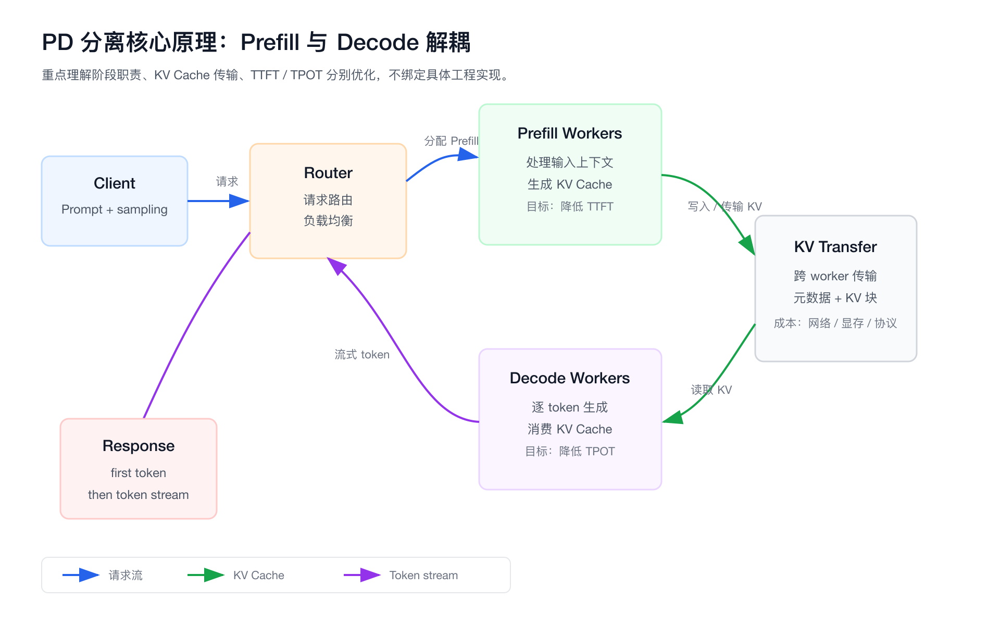
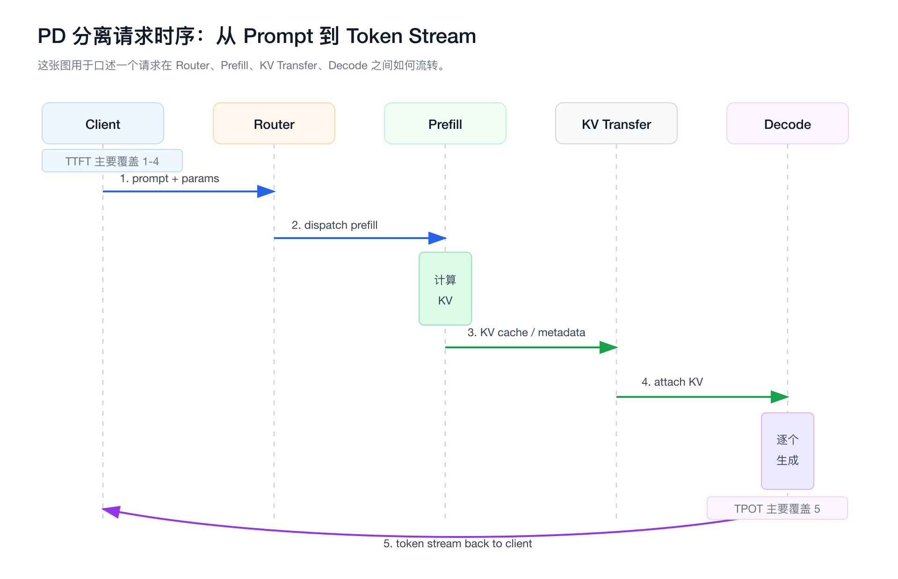
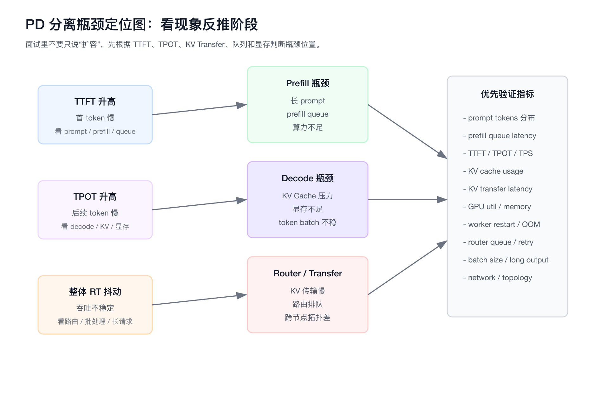
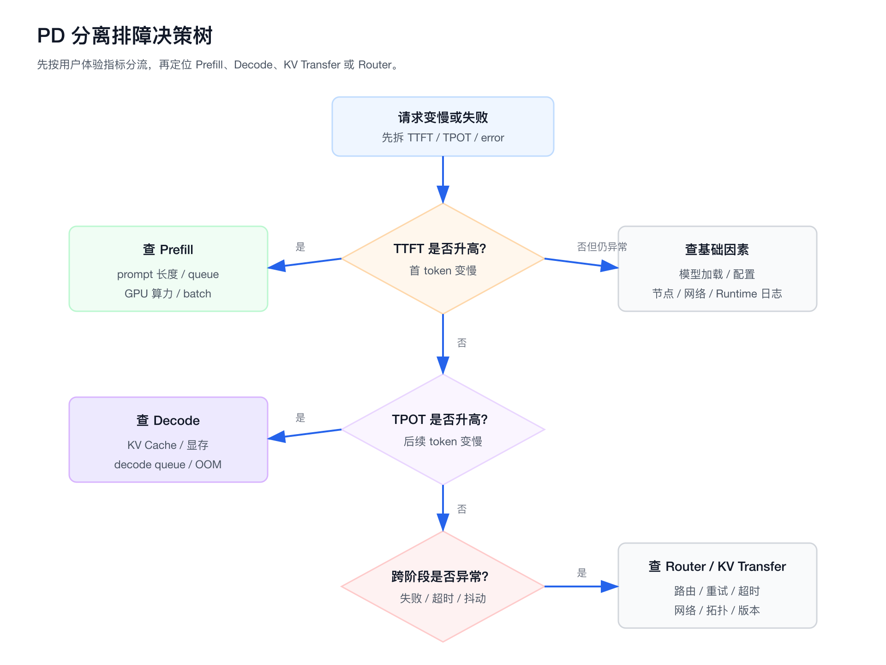
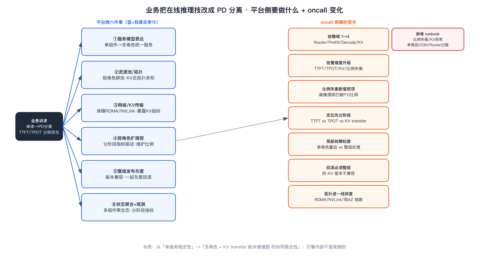

# 经验边界

```yaml
topic: PD 分离 / Prefill-Decode Disaggregation
engine_layer: theory_only          # 推理引擎内部（KV Cache 实现、vLLM/SGLang 内核、KV transfer 协议）是理论储备
platform_layer: real_experience    # 平台侧适配（多组件服务表达、资源池划分、状态聚合、扩缩容入口、观测接入）是 SAI 真实参与
interview_positioning: 引擎原理对标理解；平台侧「业务把在线推理技改成 PD 分离时平台要做什么、oncall 怎么变」是我真实做的边界
```

这篇分两层来准备，边界要说清楚：

- **引擎层（理论）**：Prefill/Decode 阶段解耦、KV Cache、KV transfer 的原理、收益、代价、适用场景和排障思路，作为大模型 Serving 架构演进来理解。不要说“我实现过 PD 分离”“我优化过 KV Cache”“我改过 vLLM / SGLang 内核”。
- **平台层（真实经验）**：作为 SAI 平台方，当业务要把在线推理从单体技改成 PD 分离架构时，平台侧的多组件服务表达、资源池/拓扑划分、状态聚合、按角色扩缩容、发布灰度、观测告警接入，以及 oncall 保障的变化——这部分是我真实参与的运行治理工作，见后文「平台侧视角」与「oncall 保障的变化」两节。引擎内部实现不是我做的，但平台怎么承接这种多组件形态是我做的。

# 为什么需要掌握

- **大模型推理不再只是部署一个 HTTP 服务**
  - LLM Serving 要同时关注首 token、后续 token、KV Cache、连续批处理、长上下文和流式输出。

- **Prefill 和 Decode 的瓶颈不同**
  - Prefill 更容易受 prompt 长度、batch 和算力影响。
  - Decode 更容易受 KV Cache、显存、调度稳定性和逐 token 延迟影响。

- **面试容易从概念追到工程取舍**
  - 面试官通常不会只问“PD 分离是什么”，还会追问为什么要分、分了以后怎么传 KV、什么时候不适合、慢请求怎么定位。

- **它能串起多个 LLM Serving 关键词**
  - TTFT、TPOT、KV Cache、Router、continuous batching、chunked prefill、disaggregated serving、KV transfer、worker pool。

# 三十秒回答

PD 分离是把大模型推理里的 Prefill 和 Decode 两个阶段拆到不同 worker 或资源池中执行。Prefill 负责处理输入 prompt、生成上下文状态和 KV Cache，更影响首 token 时间 TTFT；Decode 负责基于 KV Cache 逐 token 生成输出，更影响 TPOT 和流式生成速度。它的价值是减少两个阶段互相干扰，让资源、批处理和扩缩容可以按阶段优化。代价是系统复杂度上升，需要 Router 协调请求流转，需要传输 KV Cache，也会引入网络、版本兼容和跨组件故障。

# 它解决什么问题

- **长 prompt 拖慢首 token**
  - **对应机制**：把 Prefill 独立出来，让长上下文处理不直接挤占 Decode 的生成路径。
  - **面试表达**：Prefill 主要影响 TTFT，长 prompt 会放大这个阶段的计算压力。

- **生成阶段被 Prefill 干扰**
  - **对应机制**：Decode 独立运行，专注逐 token 生成。
  - **面试表达**：Decode 更关注 TPOT、token latency、KV Cache 和显存稳定性。

- **单体推理服务无法按阶段扩容**
  - **对应机制**：Prefill worker pool 和 Decode worker pool 分别扩缩容。
  - **面试表达**：输入长、输出短和输入短、输出长的业务，请求画像不同，容量规划也不同。

- **整体 RT 无法解释瓶颈**
  - **对应机制**：分阶段观测 TTFT、TPOT、queue latency、KV transfer latency、GPU utilization、memory usage。
  - **面试表达**：慢请求要先判断慢在 Prefill、Decode、Router 还是 KV Transfer。

- **资源配置目标冲突**
  - **对应机制**：不同阶段可以使用不同并行度、batch 策略、GPU 规格和调度参数。
  - **面试表达**：PD 分离的本质不是“拆组件”，而是把不同阶段的性能目标解耦。

# 核心概念

## Prefill

- **定义**：处理输入 prompt，计算上下文表示，并生成后续 Decode 需要的 KV Cache。
- **关注指标**：TTFT、prefill queue latency、prompt tokens、prefill throughput、GPU compute utilization。
- **典型瓶颈**：长上下文、prefill batch 过大、算力不足、排队过长。
- **面试追问**：为什么长 prompt 会拉高 TTFT？

## Decode

- **定义**：基于已有上下文和 KV Cache，自回归地逐 token 生成输出。
- **关注指标**：TPOT、TPS、output tokens、decode queue latency、KV Cache usage、GPU memory。
- **典型瓶颈**：KV Cache 占用高、显存不足、batch 策略不稳、长输出请求拖慢整体生成。
- **面试追问**：为什么 Decode 更关注低时延和显存？

## KV Cache

- **定义**：保存 attention 中 Key / Value 中间结果，避免每生成一个 token 都重复计算完整历史上下文。
- **价值**：降低重复计算，让长上下文和多 token 生成可承受。
- **代价**：占用显存，随上下文长度、batch、并发、模型层数增长。
- **面试追问**：KV Cache 为什么既是优化点，也是显存压力来源？

## KV Transfer

- **定义**：Prefill worker 生成 KV Cache 后，把相关数据或元信息交给 Decode worker 使用。
- **价值**：让 Prefill 和 Decode 可以运行在不同 worker 上。
- **代价**：引入网络、GPU 互联、序列化、协议、版本兼容、超时和故障处理。
- **面试追问**：为什么 PD 分离不一定总是更快？

## Router

- **定义**：接收请求，选择 Prefill worker 和 Decode worker，并维护请求在两个阶段之间的流转。
- **价值**：做负载均衡、请求调度、超时控制、失败处理和流式返回。
- **代价**：Router 自身会成为关键路径，需要观测和容错。
- **面试追问**：Prefill 成功但 Decode 失败时，请求应该怎么处理？

## TTFT

- **定义**：Time To First Token，从请求发出到收到第一个 token 的时间。
- **常见关联**：Router 排队、Prefill 排队、prompt 长度、Prefill 算力、KV Transfer。
- **面试追问**：TTFT 高一定是 Decode 问题吗？不是，通常优先看 Prefill 和排队。

## TPOT

- **定义**：Time Per Output Token，后续每个输出 token 的平均生成耗时。
- **常见关联**：Decode worker、KV Cache、显存、batch 策略、长输出请求。
- **面试追问**：首 token 很快但输出慢应该看什么？优先看 TPOT 和 Decode 侧瓶颈。

# 原理图



这张图要讲清三件事：

- 请求先进入 Router，再进入 Prefill。
- Prefill 生成 KV Cache，Decode 消费 KV Cache。
- TTFT 和 TPOT 的优化目标不同，PD 分离的价值在于阶段解耦。

# 请求时序图



口述顺序：

- Client 发起 prompt 和 sampling 参数。
- Router 选择 Prefill worker。
- Prefill 处理上下文并生成 KV Cache。
- KV Cache 或相关 metadata 传给 Decode。
- Decode 逐 token 生成，并把 token stream 返回给用户。

这个时序里，TTFT 主要覆盖请求进入、排队、Prefill 和首 token 准备；TPOT 主要覆盖后续 Decode 的 token 生成速度。

# 关键机制

## 阶段解耦

- **解决的问题**：Prefill 和 Decode 放在同一个执行池里，会互相抢占算力和 batch 空间。
- **工作方式**：拆成 Prefill worker pool 和 Decode worker pool。
- **收益**：TTFT 和 TPOT 可以分别优化。
- **代价**：组件更多，请求链路更长，故障点更多。

## KV Cache 传输

- **解决的问题**：Decode 需要 Prefill 产生的上下文状态。
- **工作方式**：Prefill 完成后，把 KV Cache 或可定位 KV Cache 的元信息交给 Decode。
- **收益**：两个阶段可以跨 worker 解耦。
- **代价**：传输成本可能抵消分离收益。

## 独立批处理

- **解决的问题**：Prefill 和 Decode 对 batch 的要求不同。
- **工作方式**：Prefill 可以偏吞吐，Decode 可以偏低时延和稳定输出。
- **收益**：减少长 prompt 或长输出请求对彼此的影响。
- **代价**：batch 参数更多，调优复杂度更高。

## 独立扩缩容

- **解决的问题**：单体服务只能整体扩容，无法判断该补 Prefill 还是补 Decode。
- **工作方式**：根据 TTFT、TPOT、队列和显存分别扩 Prefill 或 Decode。
- **收益**：资源使用更精细。
- **代价**：容量比例需要持续校准，业务输入 / 输出长度分布变化会打破原来的比例。

## 分阶段可观测

- **解决的问题**：整体 RT 变差无法定位具体瓶颈。
- **工作方式**：按 Router、Prefill、KV Transfer、Decode 拆指标和日志。
- **收益**：可以快速判断慢在首 token、后续 token、传输还是排队。
- **代价**：需要 Runtime 暴露足够细的指标。

# 横向对比

## 单体推理 vs PD 分离

- **单体推理**
  - Prefill 和 Decode 在同一个引擎和资源池中执行。
  - 架构简单，部署和排障成本低。
  - 阶段间容易互相干扰，容量规划偏粗。

- **PD 分离**
  - Prefill 和 Decode 拆到不同 worker pool。
  - 可以按阶段优化 TTFT、TPOT 和资源配置。
  - 需要 Router、KV Transfer 和更复杂的故障处理。

## Chunked Prefill vs PD 分离

- **Chunked Prefill**
  - 把长 prompt 拆成块，减少 Prefill 长时间占用计算资源。
  - 改造相对轻，适合先缓解长上下文干扰。
  - Prefill 和 Decode 仍然可能共享同一执行池。

- **PD 分离**
  - 直接把 Prefill 和 Decode 分到不同 worker。
  - 阶段级资源规划更清晰。
  - KV Transfer 和跨组件调度成本更高。

## Continuous Batching vs PD 分离

- **Continuous Batching**
  - 解决请求动态进入和退出 batch 的吞吐问题。
  - 重点是提高单个 serving engine 的调度效率。

- **PD 分离**
  - 解决 Prefill 和 Decode 阶段资源目标不同的问题。
  - 重点是把阶段拆开，分别调度和扩容。

两者不是互斥关系。一个系统可以同时使用 continuous batching 和 PD 分离。

# 瓶颈定位图



记忆方式：

- **TTFT 高**：先看 Router 排队、Prefill 排队、prompt 长度、Prefill 算力。
- **TPOT 高**：先看 Decode、KV Cache、显存、decode queue、长输出请求。
- **整体抖动**：看 Router、KV Transfer、网络拓扑、batch 参数和长尾请求。
- **扩容无效**：说明瓶颈可能不在你扩的那个阶段，或者共享链路已经成为瓶颈。

# 典型业务场景

## 长上下文问答

- **现象**：输入 prompt 很长，首 token 等待时间明显升高。
- **原因**：Prefill 计算量随输入长度增长。
- **PD 分离价值**：把 Prefill 压力隔离出来，避免影响 Decode。
- **关注指标**：prompt tokens、TTFT、prefill queue latency、Prefill GPU utilization。

## 高并发流式输出

- **现象**：第一个 token 不慢，但后续 token 输出速度不稳定。
- **原因**：Decode 侧 KV Cache、显存、batch 和调度压力较大。
- **PD 分离价值**：Decode 独立扩容，优化 TPOT 和 token latency。
- **关注指标**：TPOT、TPS、decode queue latency、KV Cache usage、GPU memory。

## 输入输出长度分布变化

- **现象**：某段时间 TTFT 高，另一段时间 TPOT 高，扩容效果不稳定。
- **原因**：请求画像变化导致 Prefill / Decode 容量比例不匹配。
- **PD 分离价值**：根据输入和输出 token 分布调整两个 worker pool 的比例。
- **关注指标**：input tokens、output tokens、prefill/decode utilization、queue depth。

## KV Transfer 变成瓶颈

- **现象**：Prefill 和 Decode 单看都不慢，但跨阶段延迟高，失败率或超时上升。
- **原因**：KV 传输链路、网络拓扑、协议实现或版本兼容问题。
- **PD 分离价值**：只有当传输成本可控时才成立。
- **关注指标**：KV transfer latency、transfer failure、network throughput、retry、timeout。

# 排障决策树



## TTFT 升高

- 看 Router 是否排队或限流。
- 看 Prefill worker 是否繁忙。
- 看 prompt tokens 是否突然变长。
- 看 prefill queue latency 是否升高。
- 看 GPU compute utilization 是否打满。
- 看 Prefill 日志是否有 batch、OOM、模型加载或超时异常。

## TPOT 升高

- 看 Decode worker 是否繁忙。
- 看 KV Cache 使用率和显存是否接近上限。
- 看 decode queue latency 是否升高。
- 看是否有长输出请求拖慢 batch。
- 看 Decode worker 是否 OOM、重启或频繁超时。
- 看 Runtime 是否有调度异常。

## KV Transfer 异常

- 看 KV transfer latency 是否升高。
- 看 transfer failure、timeout、retry 是否增加。
- 看 Prefill 和 Decode 的 Runtime 版本是否兼容。
- 看跨节点网络、RDMA / UCX / NIXL 等传输路径是否异常。
- 看 worker 是否跨可用区、跨机架或拓扑距离过远。

## 扩容后没有改善

- 如果 TTFT 没降，说明 Prefill、Router 或 KV Transfer 仍是瓶颈。
- 如果 TPOT 没降，说明 Decode、KV Cache、显存或 batch 仍是瓶颈。
- 如果两边指标都正常，检查客户端、网络、限流、流式返回和长尾请求。
- 不要默认“加 GPU 就能解决”，先定位阶段瓶颈。

# 适用边界

## 适合考虑 PD 分离

- prompt 长、并发高，TTFT 受 Prefill 明显影响。
- 流式输出要求高，TPOT 和 token latency 需要单独优化。
- 输入和输出 token 分布差异大，需要阶段级容量规划。
- GPU 资源充足，且有能力维护 Router、KV Transfer 和分阶段观测。
- Runtime 已经支持较成熟的 PD 分离能力。

## 不一定适合 PD 分离

- 模型规模较小，单体推理已经满足 SLO。
- 请求量不大，拆分后资源利用率反而下降。
- KV Transfer 成本高于阶段解耦收益。
- 团队缺少 Runtime 运维和观测能力。
- 当前瓶颈在模型加载、网络出口、客户端消费速度或业务限流，而不是 Prefill / Decode 干扰。

# 平台侧视角：业务把在线推理技改成 PD 分离，平台方要做什么



这一节是我作为 SAI 平台方真实参与的边界。业务侧的诉求很简单——「把现在单体的在线推理服务改成 PD 分离，TTFT/TPOT 要能分别优化」。但对平台方来说，这不是「多部署两个 Deployment」，而是服务模型、调度、网络、扩缩容、发布、观测六个口径同时升级。引擎内部不是我做的，平台怎么承接这种多组件形态是我做的。

## 服务模型表达升级

- **问题**：原来平台的服务画像是「一个服务 = 一组同质副本」。PD 分离后是「一个逻辑服务 = Prefill pool + Decode pool + Router 多角色，各自规格、副本、镜像、启动参数都不同」。
- **平台要做**：把服务抽象从单组件扩成多组件（多角色 worker 的统一服务表达），让用户在一个服务下声明多个角色，而不是手工拼三个互不相关的工作负载。
- **代价 / 注意**：多组件意味着「部分就绪」「部分故障」是新常态，服务画像必须能表达「逻辑一个、物理多组件」。

## 资源池与拓扑划分

- **问题**：Prefill 偏算力（compute-bound）、Decode 偏显存与带宽（memory-bound），两者适合的 GPU 规格和资源池可能不同；KV transfer 又要求 Prefill 和 Decode 在拓扑上足够近。
- **平台要做**：支持按角色绑定不同资源池 / GPU 规格；把 KV transfer 的拓扑约束（同可用区、同机架、走 NVLink/RDMA）表达成调度亲和，避免把 Prefill 和 Decode 调度到拓扑很远的节点。
- **代价 / 注意**：拓扑亲和会降低可调度性，要在「传输性能」和「资源碎片」之间平衡。RDMA/NVLink 细节见 [gpu-rdma](../gpu-rdma/rdma.md)。

## 网络与 KV 传输保障

- **问题**：单体推理没有跨 worker 的关键数据通路；PD 分离后 KV transfer 是请求关键路径，链路抖动会直接放大跨阶段超时。
- **平台要做**：保证 Prefill/Decode 间的高速链路（RDMA/NVLink/同 AZ）并把网络拓扑约束下发给调度；把 KV transfer latency / failure / timeout 作为平台一等观测指标暴露出来。
- **代价 / 注意**：这是单体形态完全没有的新故障域，平台不暴露它，oncall 就会两眼一抹黑。

## 扩缩容入口升级

- **问题**：原来扩缩容是「整服务调副本数」，PD 分离后要「按角色分别扩，且要维护 Prefill:Decode 比例」。
- **平台要做**：扩缩容入口从单一副本数升级为按角色独立扩缩，并支持配置/校准比例；弹性触发指标从 QPS 升级为分阶段指标——TTFT / prefill queue 驱动 Prefill 扩容，TPOT / KV cache / 显存驱动 Decode 扩容。
- **代价 / 注意**：请求画像（输入/输出长度分布）漂移会打破原比例，比例校准是长期运营项，不是一次配好。

## 发布与灰度升级

- **问题**：多组件之间有版本兼容约束——Router、Prefill、Decode 的 KV 格式/协议必须匹配，单独回滚一个组件可能导致 KV 不兼容。
- **平台要做**：把灰度/回滚从单组件升级为「整组协调发布」：同一逻辑服务的多角色作为一个发布单元一起灰度、一起回滚；版本兼容校验前置到发布流程。
- **代价 / 注意**：发布粒度变粗、回滚必须整组，复用 SAE/Argo Rollouts 时要把多组件绑成一个发布单元。

## 健康/就绪与状态聚合升级

- **问题**：单体「实例就绪 = 服务就绪」；PD 分离后任一关键角色未就绪、Router 路由不通、KV 链路不通，服务就不可用。
- **平台要做**：就绪判定升级为「Prefill 和 Decode 都就绪 + Router 可路由 + KV 链路通」；把多组件状态聚合成一个用户可理解的服务态（任一关键角色不健康 → 服务降级/不可用），而不是让用户自己看三组 Pod。
- **代价 / 注意**：状态聚合规则要明确「哪些角色是关键路径」，否则会误报或漏报。

## 观测与成本口径升级

- **问题**：单体看 QPS/RT 就够；PD 分离的瓶颈藏在阶段里，整体 RT 无法定位。
- **平台要做**：统一接入分阶段指标（TTFT、TPOT、各 pool queue、KV transfer latency、各 pool GPU util/显存）到观测与告警（Bigeyes）；从 FinOps 角度给比例失衡和利用率视图，PD 分离比单体更容易因比例失衡浪费 GPU。
- **代价 / 注意**：需要 Runtime 暴露足够细的指标，平台只能转译和聚合，拿不到的指标不能假装有。

# oncall 保障的变化

从单体推理到 PD 分离，值班保障不是「沿用旧 runbook」，故障域、告警维度、定位路径、处置动作都要变。这里把「平台侧真实接入过的（观测/告警/状态聚合）」和「应该这么演进的设计」分开讲。

- **故障域从 1 个变成 4 类**：单体一个进程，PD 分离有 Router / Prefill / Decode / KV transfer 四类故障点。告警和 runbook 要按角色拆，不能只有一个「服务不可用」告警。
- **告警维度升级**：不能只告 5xx/RT。要新增 TTFT、TPOT、KV transfer latency/failure、各 pool 显存/排队、Prefill:Decode 比例失衡告警。这是平台观测接入要补的部分。
- **定位路径变化**：慢请求先分阶段——TTFT 高看 Router/Prefill/prompt 长度，TPOT 高看 Decode/KV cache/显存，两边都正常看 KV transfer/网络拓扑。oncall 要会读分阶段指标，而不是盯整体 RT。（决策树见前文排障章节）
- **新增「比例失衡」值班项**：请求输入/输出长度分布漂移会打破 Prefill:Decode 比例，导致扩容无效。这是单体完全没有的新值班项，要监控比例并能调。
- **局部故障的处置粒度变了**：单角色挂不一定整服务挂，但可能整服务降级。oncall 要清楚哪个角色能单独重启/扩容，哪个必须整组处理（涉及版本/KV 兼容的不能单独动）。
- **回滚动作变了**：必须整组回滚，oncall 不能单独回滚一个组件造成 KV 不兼容——这要写进预案，否则容易踩。
- **网络拓扑进入一线排查**：KV transfer 依赖 RDMA/NVLink/同 AZ，链路降级会表现为跨阶段超时，oncall 要把网络拓扑/链路健康纳入一线排查项。
- **新增 runbook**：比例失衡、KV transfer 异常、单角色 OOM、Router 过载，至少这四类要有独立预案。

面试可以这么收口：PD 分离对平台和 oncall 的本质影响，是把「一个服务的稳定性」拆成「多角色 + 一条新的关键数据通路（KV transfer）的协同稳定性」。平台侧我能讲清服务表达、资源池/拓扑、扩缩容、发布、状态聚合、观测这六件要做的事，以及 oncall 的故障域、告警、比例失衡、整组回滚这几个变化；引擎内部的 KV 实现我不碰，老实说清。

# 常见误区

- **误区：PD 分离一定更快**
  - 更准确：它减少阶段干扰，但会引入 KV Transfer 和 Router 成本。

- **误区：Prefill 和 Decode 只是两个名字**
  - 更准确：它们的计算模式、指标、资源诉求和排障路径都不同。

- **误区：TTFT 和 TPOT 都是普通 RT**
  - 更准确：TTFT 反映首 token 体验，TPOT 反映持续生成速度。

- **误区：KV Cache 只带来优化**
  - 更准确：KV Cache 减少重复计算，但会消耗显存，并带来传输和管理复杂度。

- **误区：PD 分离等于多部署几个进程**
  - 更准确：PD 分离的核心是推理阶段解耦、KV Cache 传输和分阶段调度，不只是部署形态变化。

# 面试话术

## 主回答

我会把 PD 分离当作大模型 Serving 的理论知识点来讲。LLM 推理可以拆成 Prefill 和 Decode：Prefill 处理输入上下文，影响 TTFT；Decode 基于 KV Cache 逐 token 生成，影响 TPOT。两者的资源画像不同，如果放在同一个执行池里，长 prompt、长输出和 batch 策略会互相干扰。PD 分离通过独立 Prefill / Decode worker pool、Router 和 KV Transfer，把阶段解耦，从而分别优化首 token 和后续 token 生成。它不是无成本优化，核心代价是 KV 传输、跨组件失败、路由复杂度和观测复杂度。所以判断是否使用，要看业务输入输出长度、SLO、并发、传输成本和 Runtime 成熟度。

## 面试官问“你实现过吗？”

没有把它作为生产实现经验来讲。我把它作为理论知识储备，重点讲清 Prefill / Decode 的差异、KV Cache 传输、收益代价、适用边界和排障路径。

## 面试官问“为什么要分 Prefill 和 Decode？”

因为两个阶段目标不同。Prefill 主要处理 prompt，影响首 token；Decode 逐 token 生成，影响持续输出速度。拆开后可以分别调度、扩容和调参。

## 面试官问“PD 分离最大代价是什么？”

最大代价是复杂度。请求链路多了 Router 和 KV Transfer，故障点更多；KV 传输如果慢，可能抵消阶段解耦收益。

## 面试官问“什么时候不适合？”

单体推理已经满足 SLO、请求量不大、KV Transfer 成本高、团队没有 Runtime 观测和运维能力时，不一定适合直接上 PD 分离。

## 面试官问“慢请求怎么查？”

先拆 TTFT 和 TPOT。TTFT 高看 Router、Prefill、prompt 长度和 prefill queue；TPOT 高看 Decode、KV Cache、显存和 decode queue；两者都正常再查 KV Transfer、网络、客户端和长尾请求。

# 不能怎么说

| 不要这么说 | 风险 | 应该这么说 |
|---|---|---|
| 我实现了 PD 分离 | 如果没有真实代码和线上经验，会被追问击穿 | 我把 PD 分离作为理论知识储备，理解它的原理和工程取舍 |
| PD 分离一定提升性能 | 忽略 KV Transfer 和 Router 成本 | PD 分离适合阶段干扰明显且传输成本可控的场景 |
| KV Cache 就是普通缓存 | 容易暴露对 attention 和显存模型理解不足 | KV Cache 是注意力中间状态，减少重复计算但消耗显存 |
| TTFT / TPOT 都看整体 RT 就行 | 无法解释首 token 和持续生成的不同瓶颈 | TTFT 看首 token，TPOT 看后续 token 生成速度 |
| PD 分离就是多部署几个服务 | 把 Runtime 架构问题说成部署问题 | PD 分离的核心是阶段解耦、KV 传输和分阶段调度 |

# 高频 Q&A

## PD 分离是什么？

把大模型推理中的 Prefill 和 Decode 拆到不同 worker 或资源池里执行，让首 token 和后续 token 生成可以分别优化。

## Prefill 做什么？

Prefill 处理输入 prompt，计算上下文表示并生成 KV Cache，主要影响 TTFT。

## Decode 做什么？

Decode 基于 KV Cache 逐 token 生成输出，主要影响 TPOT 和流式输出速度。

## 为什么 KV Cache 重要？

它避免每个 token 都重复计算完整历史上下文，但会占用显存，并在 PD 分离后带来传输问题。

## PD 分离的收益是什么？

减少 Prefill / Decode 阶段间干扰，支持独立扩容、独立调参和更精细的瓶颈定位。

## PD 分离的代价是什么？

Router、KV Transfer、多 worker 协同、分阶段指标、跨组件故障和版本兼容都会增加复杂度。

## TTFT 高通常看哪里？

看 Router 排队、Prefill queue、prompt 长度、Prefill 算力和 KV Transfer。

## TPOT 高通常看哪里？

看 Decode worker、KV Cache、显存、decode queue、batch 策略和长输出请求。

## Chunked Prefill 和 PD 分离什么关系？

Chunked Prefill 是把长 prompt 拆块来缓解干扰；PD 分离是把 Prefill 和 Decode 放到不同 worker。两者可以组合，但解决层次不同。

## Continuous Batching 和 PD 分离什么关系？

Continuous Batching 优化动态 batch 调度，PD 分离优化阶段解耦。一个系统可以同时有两者。

## PD 分离一定需要 RDMA 吗？

不一定，但 KV Transfer 的性能很关键。高性能网络或 GPU 互联能降低传输成本，否则收益可能变差。

## 怎么判断扩 Prefill 还是 Decode？

TTFT、prefill queue、prompt tokens 高，优先看 Prefill；TPOT、decode queue、KV Cache、显存压力高，优先看 Decode。

## 为什么不能只看 QPS 和 RT？

QPS 和 RT 太粗，不能区分首 token 慢、后续 token 慢、传输慢还是排队慢。

# 三档背诵版

## 三十秒版

PD 分离是把 LLM 推理的 Prefill 和 Decode 拆到不同 worker 中执行。Prefill 处理 prompt，影响 TTFT；Decode 逐 token 生成，影响 TPOT。它的收益是阶段解耦、独立扩容和更清晰的瓶颈定位；代价是 Router、KV Transfer 和跨组件故障更复杂。

## 三分钟版

LLM 推理不是一个均匀过程。Prefill 负责处理输入上下文，通常受 prompt 长度和算力影响；Decode 基于 KV Cache 逐 token 输出，通常受显存、KV Cache 和调度稳定性影响。如果两个阶段混在同一个执行池里，长 prompt 可能影响后续 token 生成，长输出也可能影响整体 batch。PD 分离把两个阶段拆成 Prefill worker pool 和 Decode worker pool，通过 Router 串联请求，再把 Prefill 生成的 KV Cache 传给 Decode。这样可以分别优化 TTFT 和 TPOT，但会引入 KV Transfer、路由、观测和故障处理复杂度。

## 五分钟版

PD 分离的核心是 Prefill-Decode Disaggregation。它不是简单多部署几个服务，而是把 LLM 推理中的两个不同阶段解耦。Prefill 主要处理输入 prompt，生成 KV Cache，它决定首 token 之前的大部分计算；Decode 则基于 KV Cache 自回归生成输出，它决定流式输出速度。拆开后，Prefill 和 Decode 可以有不同的 worker pool、batch 策略、并行度和扩缩容策略。好处是减少阶段间干扰，并且能根据 TTFT 和 TPOT 判断瓶颈。代价是请求链路更复杂：Router 要管理阶段流转，KV Cache 要跨 worker 传输，跨组件失败和版本兼容都要处理。所以面试中要讲清收益、代价和适用边界：当长上下文、高并发、首 token 和持续生成都有明确 SLO 时，PD 分离有价值；如果请求规模小、单体推理已满足要求，或者 KV Transfer 成本过高，就未必值得引入。

# 图示清单

| 图片 | 对应章节 | 目的 | 优先级 |
|---|---|---|---|
| `./01_pd_separation_principle.png` | 原理图 | 展示 Client、Router、Prefill、KV Transfer、Decode 的关系 | P0 |
| `./02_pd_request_timeline.png` | 请求时序图 | 展示一个请求从 prompt 到 token stream 的时序 | P0 |
| `./03_pd_bottleneck_map.png` | 瓶颈定位图 | 用 TTFT / TPOT / RT 抖动反推瓶颈阶段 | P0 |
| `./04_pd_troubleshooting_flow.png` | 排障决策树 | 面试口述慢请求排查路径 | P1 |
| `./05_pd_platform_responsibilities.png` | 平台侧视角 / oncall 变化 | 讲清平台方六件事和 oncall 四类变化 | P0 |

# 参考资料

- vLLM 官方文档：Disaggregated Prefilling 说明通过独立 prefill / decode vLLM 实例分别调优 TTFT 和 ITL，并通过 connector 传输 KV cache；文档也标注该能力仍是实验特性。https://docs.vllm.ai/en/latest/usage/disagg_prefill.html
- SGLang 官方文档：PD Disaggregation 将 Prefill / Decode 分开，Prefill 偏计算密集，Decode 偏 KV Cache 和 token generation，并提供 Router 集成。https://docs.sglang.ai/advanced_features/pd_disaggregation.html
- NVIDIA Dynamo 文档：Disaggregated Serving 将 Prefill 和 Decode 放入专门 worker pool / engine，核心链路是 Prefill 生成 KV cache、传输 KV cache、Decode 继续计算。https://docs.nvidia.com/dynamo/design-docs/disaggregated-serving
- DistServe OSDI 2024：论文从 TTFT / TPOT、阶段干扰、资源与并行度解耦角度系统阐述 Prefill-Decode Disaggregation 的动机。https://www.usenix.org/conference/osdi24/presentation/zhong-yinmin

# 面试前检查清单

- [ ] 我能说明这篇是理论知识储备，不包装成生产落地经验。
- [ ] 我能用 30 秒讲清 Prefill、Decode、KV Cache、TTFT、TPOT。
- [ ] 我能解释为什么 Prefill 和 Decode 会互相干扰。
- [ ] 我能说出 PD 分离的收益和代价。
- [ ] 我能区分 PD 分离、chunked prefill、continuous batching。
- [ ] 我能根据 TTFT / TPOT 判断瓶颈阶段。
- [ ] 我能说明 KV Transfer 为什么可能抵消收益。
- [ ] 我不会把引擎内部实现（KV Cache/vLLM 内核）说成我做的。
- [ ] 我能讲清平台侧六件事：服务表达、资源池/拓扑、网络/KV 传输、按角色扩缩容、整组发布、状态聚合+观测。
- [ ] 我能讲清 oncall 的四类变化：故障域变多、告警维度升级、比例失衡新值班项、整组回滚。
- [ ] 我能把「平台真实接入过的」和「应该这么演进的设计」分开说，不含糊。
