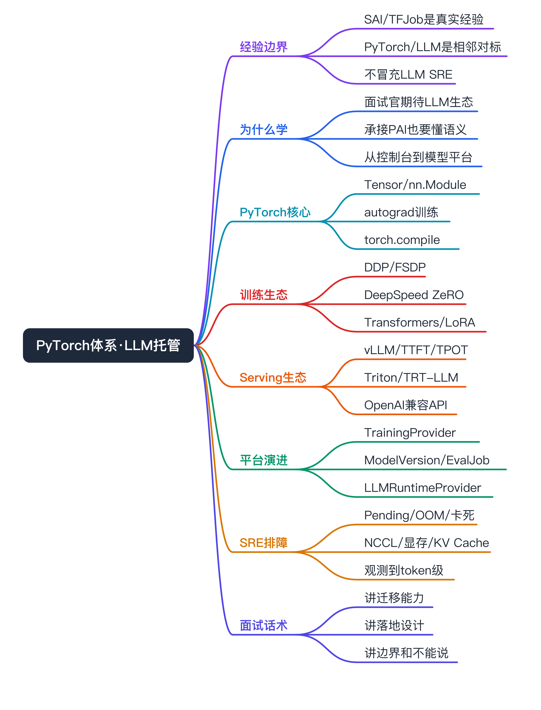
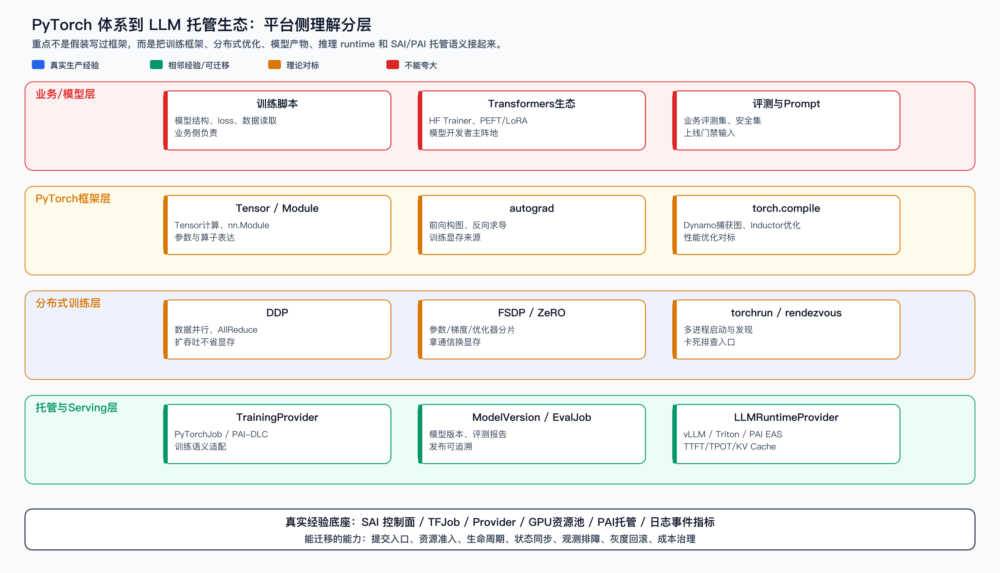
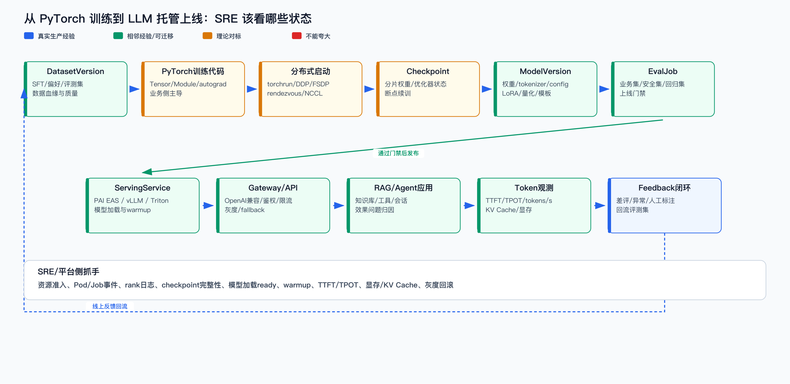
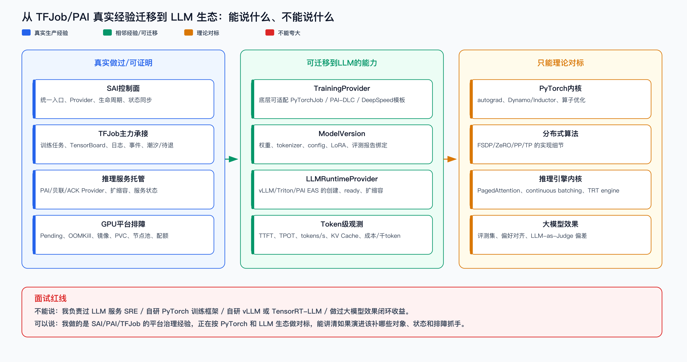

# PyTorch 体系与 LLM 托管生态演进（SAI 面试补强）



```yaml
experience_level: adjacent_production_experience
# 真实经验：SAI/TFJob/推理服务/Provider/PAI托管/GPU资源池/日志事件指标/平台侧排障。
# 相邻经验：PyTorchJob 承接、分布式训练治理、推理服务托管、模型产物下载与运行时状态同步。
# 理论对标：PyTorch autograd/torch.compile/FSDP 内部实现、DeepSpeed ZeRO 算法、vLLM/TensorRT-LLM 内核。
# 面试原则：不说“负责过 LLM 服务 SRE”，而说“我的真实经验能迁移到 LLM 托管生态，能讲清平台该补哪些对象、状态和排障抓手”。
```

# 面试定位卡

- **技术点**：从 SAI 以 TensorFlow/TFJob 为核心的传统推荐训练平台，演进到能托管 PyTorch 与生成式模型/LLM 生态的平台能力。
- **所属领域**：AI Infra、MLOps、LLMOps、PyTorch 训练生态、模型制品、LLM Serving、SRE 可观测与排障。
- **面试价值**：回答“你们 SAI 能不能承载生成式模型生态”时，不再只说“我们现在主要是 TFJob / 实际跑在 PAI 上”，而是能讲清 PyTorch 体系、LLM 全生命周期对象、PAI/自托管的 Provider 边界和 SRE 排障抓手。
- **真实边界**：我没有主导过生产级 LLM 服务 SRE，没有自研 PyTorch 训练框架、vLLM、TensorRT-LLM 或模型评测闭环；我能讲的是平台治理经验如何迁移、如果演进会怎么设计、线上问题怎么分层定位。
- **一句话目标**：把“我没负责过 LLM 服务”换成“我负责过 AI 平台控制面和 SRE 治理，正在按 PyTorch/LLM 生态补齐训练、产物、评测、Serving 和 token 级观测的语义”。

# 经验边界

- **我真实能讲的**：SAI 控制面、TFJob 训练任务、推理服务托管、PAI/贝联/ACK Provider、GPU 资源池、生命周期状态同步、日志事件指标、Pending/OOM/镜像/PVC/节点池这类平台侧问题。
- **我可以迁移的**：TrainingProvider、ModelVersion、EvalJob、LLMRuntimeProvider、RuntimeReady、ModelCache、token 级观测、灰度发布、成本治理。这些不是凭空新概念，而是把原有 Job/Service/Provider/观测能力换成 LLM 语义。
- **我只能对标的**：PyTorch 内部 autograd、Dynamo/Inductor、FSDP 实现，DeepSpeed ZeRO 分片算法，vLLM PagedAttention / continuous batching，TensorRT-LLM engine 构建。
- **面试声明方式**：先说边界，再说迁移能力。比如：“我们核心生产链路还是 TFJob 和 PAI 托管，我不把它包装成自研 LLM 平台。但从平台侧看，PyTorch/LLM 要治理的提交、资源、状态、模型产物、观测和发布闭环，和我做过的 SAI 控制面是一类问题。”

# 配套深水文档

- **PyTorchJob 稳定性治理**：[pytorchjob-stability-governance](../pytorchjob-stability/pytorchjob-stability-governance.md)。用于回答 PyTorchJob 的 API Resource、GPU 调度、gang、rendezvous、NCCL 和 SRE 排障。
- **PyTorchJob 字段阅读地图**：[pytorchjob-api-resources](../pytorchjob-stability/pytorchjob-api-resources.md)。用于刚开始看 `kubectl api-resources` / `kubectl explain pytorchjob` 时快速建立字段模型。
- **PyTorchJob GPU 调度 runbook**：[pytorchjob-gpu-scheduling](../pytorchjob-stability/pytorchjob-gpu-scheduling.md)。用于把 SAI 的 NodePool / 资源池经验迁移到 PyTorchJob 的队列、gang、PodSpec 和拓扑治理。

# 为什么需要掌握

- **面试官期待的是平台演进能力**：他们问 SAI 能不能承载生成式模型，不是在问你是否会写 Transformer，而是在问你能不能从传统训练任务托管升级到模型全生命周期治理。
- **“都在 PAI 上”不是减分点，关键是能讲托管语义**：PAI 可以是执行面/托管底座，SAI 仍然可以做控制面、准入、状态聚合、评测门禁、灰度回滚和统一观测。
- **PyTorch 是 LLM 生态入口**：多数 LLM 微调、Transformers、PEFT/LoRA、DeepSpeed、FSDP、vLLM 周边都以 PyTorch 为主语；不懂 PyTorch 体系，讲 LLM 托管会停在“起一个镜像”。
- **SRE 的价值不是改模型，而是把问题分层**：业务报“微调卡住 / 模型加载慢 / 首 token 慢 / 显存爆”，SRE 要能判断是平台资源、分布式通信、模型产物、runtime 配置还是业务数据问题。

# PyTorch 体系：SRE 必须能讲到哪一层



## Tensor / nn.Module / state_dict

- **一句话**：PyTorch 用 Tensor 表达数据和参数，用 `nn.Module` 组织模型结构，用 `state_dict` 保存参数状态。
- **SRE 关注点**：模型产物不是“一个普通文件”，至少要关心权重、结构配置、tokenizer、dtype、device、依赖版本和加载方式。
- **迁移到平台**：SAI 的模型路径/模型下载能力要升级成 `ModelVersion`，记录权重、tokenizer、config、LoRA、量化配置、chat template、runtime 参数和评测报告。
- **面试可说**：我不写模型结构，但我要知道模型产物由哪些部分组成，否则服务起不来时无法判断是路径、格式、依赖、显存还是 runtime 参数问题。

## autograd：为什么训练比推理更吃显存

- **一句话**：autograd 会在前向过程中保留反向求导需要的中间状态，反向时计算梯度，再由优化器更新参数。
- **SRE 关注点**：训练显存不是只装权重，还包括激活、梯度、优化器状态；所以训练 OOM 和推理 OOM 根因不同。
- **常见抓手**：batch size、micro-batch、gradient accumulation、activation checkpointing、mixed precision、optimizer state sharding。
- **面试可说**：业务说 PyTorch 训练 OOM，我会先判断是 CUDA 显存爆还是 K8s OOMKill；如果是 CUDA OOM，再推动业务确认 batch、精度、激活重计算和 FSDP/ZeRO，而不是直接加卡。

## eager / torch.compile：别把编译优化说成自己做过

- **一句话**：PyTorch 默认 eager 模式便于调试，`torch.compile` 是 PyTorch 2.x 之后的重要优化入口，通过捕获图并交给后端编译优化来提升性能。
- **SRE 关注点**：`torch.compile` 可能带来图捕获失败、graph break、首轮编译耗时、动态 shape 兼容等问题；SRE 可以识别症状，但不要说自己做编译器优化。
- **平台意义**：训练/推理镜像要锁 PyTorch、CUDA、驱动、NCCL、Triton/Inductor 相关版本，否则同一份代码在不同节点行为可能不一致。
- **安全表达**：我理解 `torch.compile` 解决什么问题和可能带来的排障点，但它属于框架优化能力，不是我的生产项目成果。

## torch.distributed / DDP / FSDP / torchrun

- **DDP**：每个 rank 一份模型副本，切分数据，每步通过 AllReduce 同步梯度；扩吞吐，但不省单卡显存。
- **FSDP**：PyTorch 原生分片训练思路，按参数/梯度/优化器状态做 shard，用通信换显存，工程语义接近 ZeRO-3。
- **torchrun / rendezvous**：多进程分布式启动与发现入口；训练卡死时要看 rank 是否齐、master 地址是否通、NCCL 是否超时。
- **SRE 关注点**：gang 调度、rank 日志、NCCL/RDMA、节点拓扑、慢节点、checkpoint、失败退避。
- **平台迁移**：TFJob 的角色治理迁移到 PyTorch 生态时，不能只把 CRD 从 TFJob 换成 PyTorchJob；要补 rendezvous、NCCL、rank、FSDP checkpoint、分布式失败语义。

## Transformers / PEFT / LoRA / safetensors

- **一句话**：LLM 业务开发通常不会直接从 `nn.Module` 从零写起，而是站在 Transformers、PEFT/LoRA、Accelerate、DeepSpeed、safetensors 等生态上。
- **SRE 关注点**：模型版本不仅是 base weights，还可能叠 LoRA adapter、量化格式、tokenizer、chat template、generation config。
- **平台意义**：上线时必须能回答“这个服务加载的是哪个 base model、哪个 LoRA、哪个 tokenizer、哪个量化配置、通过哪份评测集”。
- **面试可说**：这是 SAI 从模型文件管理升级到 ModelVersion 治理的关键，不然模型效果回归时无法追溯。

# 从训练到托管上线：平台应该补哪些对象



- **DatasetVersion**：记录 SFT 数据、偏好数据、评测集、RAG 知识数据的版本、schema、来源、清洗和脱敏状态。
- **TrainingJob**：平台层训练任务语义，底层可以映射到 PyTorchJob、PAI-DLC、普通 K8s Job、DeepSpeed/FSDP 模板。
- **Checkpoint**：训练中间状态和恢复点，包含分片权重、优化器状态、step、完整性和保留策略。
- **ModelVersion**：可评测、可发布、可回滚的模型版本，绑定权重、tokenizer、config、LoRA、量化配置、chat template、评测报告。
- **EvalJob**：把模型上线从“训练完成”升级为“评测通过”，包含业务集、安全集、回归集、人工抽检、LLM-as-Judge 但要承认评测偏差。
- **ServingService / LLMRuntimeProvider**：统一管理 PAI EAS、vLLM、Triton、TensorRT-LLM、ACK Native 等 runtime 的创建、ready、扩缩容、日志、指标和状态。
- **ModelApplication**：RAG/Agent 层对象，治理知识库、Embedding、Reranker、Prompt、工具调用、权限和会话轨迹。
- **Feedback**：线上差评、异常、人工标注回流到评测集或下一轮训练数据，形成闭环。

# 现在都在 PAI 上，面试怎么讲才不减分

核心口径：**PAI 是执行面，SAI 可以是控制面和治理面**。

- **不能说**：我们自研了 LLM 训练/推理平台。
- **可以说**：我们生产上大量能力会复用 PAI 这类托管底座，SAI 的价值是把多底座能力收敛成统一入口、统一资源准入、统一状态和统一排障体验。
- **不能说**：我们负责 vLLM / TensorRT-LLM 内核。
- **可以说**：如果接 LLM Serving，我会把 vLLM、Triton、PAI EAS 抽象成 `LLMRuntimeProvider`，上层统一服务生命周期、ready 状态、灰度、token 级指标和成本治理。
- **不能说**：训练跑完就能上线。
- **可以说**：LLM 上线需要 ModelVersion + EvalJob + ServingService + Feedback，训练成功只是候选模型产物，不是发布结论。

# 如果让我落地，我会怎么设计

## 第一阶段：不换执行面，先补平台语义

- 在 SAI 侧新增 `TrainingProvider`，底层优先接 PAI-DLC / PyTorchJob / 模板化 Job，不自研训练框架。
- 把原有模型路径升级为 `ModelVersion`，记录权重、tokenizer、config、LoRA、量化、chat template 和 runtime 参数。
- 把 TensorBoard / 日志 / 事件 / GPU 指标扩展到 PyTorch rank 维度，支持 rank0、worker、NCCL、checkpoint 状态聚合。
- 对每次训练输出建立 `Checkpoint` 和 `ModelVersion` 关联，支持恢复、复跑、回滚和清理。

## 第二阶段：把“能跑”升级成“能证明可上线”

- 引入 `EvalJob`，用业务评测集、安全集、回归集做版本对比。
- 发布流程要求 ModelVersion 绑定评测报告，不允许“只给一个 OSS 路径就发布”。
- 支持人工抽检和线上反馈回流，但不夸大 LLM-as-Judge 的准确性。
- 模型发布后保留版本、评测、runtime 配置和流量策略，便于回滚和复盘。

## 第三阶段：LLMRuntimeProvider 与 token 级 SRE

- 将 PAI EAS、vLLM、Triton、TensorRT-LLM 等作为 Provider capability，不把某个 runtime 写死到控制面。
- Runtime ready 拆成：Pod Running、模型文件拉取完成、权重加载完成、warmup 通过、可接流量。
- 指标从普通 HTTP 维度扩展到 TTFT、TPOT、tokens/s、输入/输出 token、KV cache、显存水位、排队长度、截断率、成本/千 token。
- 发布策略补充灰度、fallback、热模型缓存、预热、限流和快速回滚。

## 第四阶段：RAG / Agent 应用治理

- 把 RAG/Agent 看成模型应用，不只看一次模型推理。
- 观测链路覆盖 retrieval、rerank、prompt 拼接、tool calling、LLM 调用、结果解析。
- 效果问题分层：检索错、上下文污染、工具失败、权限过滤、模型幻觉、prompt 版本问题。
- 和 Bigeyes / OTel / SRE Agent 可以结合，但要说“演进方向”，不能说已完成闭环收益。

# 如果线上出问题，我怎么排查

## PyTorch 训练 Pending / 起不来

- **先看平台层**：quota、GPU 卡型、节点池、taint/toleration、PVC、镜像、PodGroup/gang。
- **再看分布式层**：rank 数是否齐，master/rendezvous 地址是否可达。
- **结论表达**：Pending 多数是平台准入和调度问题；卡在 rendezvous 才进入框架/通信层。

## 训练卡死 / NCCL 超时

- **看现象**：所有 rank 卡住还是某个 rank 掉队；rank0/Master 日志有没有 rendezvous waiting、NCCL timeout。
- **看基础设施**：同任务是否被调到不合适拓扑，RDMA/NCCL 是否可用，节点网络是否异常。
- **看业务配置**：world size、rank、master addr、端口、容器启动命令是否一致。
- **安全边界**：我能按日志和拓扑分层定位，不声称深调 NCCL 内核。

## CUDA OOM / K8s OOMKill

- **先分清类型**：CUDA out of memory 是 GPU 显存；OOMKill 是容器内存。
- **CUDA OOM 抓手**：batch/micro-batch、seq length、precision、activation checkpointing、FSDP/ZeRO、LoRA/量化、显存碎片。
- **K8s OOMKill 抓手**：DataLoader workers、CPU 内存、缓存、request/limit。
- **面试表达**：不要把所有 OOM 都甩给平台，也不要业务一说 OOM 就盲目加 GPU。

## 模型加载慢 / 服务 ready 慢

- **看模型产物**：权重大小、分片数量、safetensors、tokenizer/config 是否完整。
- **看存储链路**：对象存储/NAS/本地缓存命中、并发拉取、镜像预热。
- **看 runtime**：vLLM/Triton/PAI EAS 是否完成加载和 warmup；Pod Running 不等于模型 ready。
- **平台优化**：ModelCache、热点模型预拉取、ready 状态拆分、发布前预热。

## 首 token 慢 / 生成慢 / 显存爆

- **TTFT 慢**：多半在排队、prefill、长 prompt、冷启动或模型加载。
- **TPOT 慢**：decode 段慢，可能是 batch 策略、KV cache、显存带宽、并发过高。
- **显存爆**：模型权重 + KV cache + batch + context length 共同决定；高并发长上下文最危险。
- **平台抓手**：限制 max input/output tokens、并发上限、队列上限、模型副本、KV cache 指标、fallback。

# 和现有经验的映射



- **SAI 控制面 → LLM 控制面**：真实经验是 Provider、生命周期、状态同步；迁移到 TrainingProvider / LLMRuntimeProvider / RuntimeReady。
- **TFJob 训练任务 → PyTorch/LLM 训练任务**：真实经验是训练任务托管、日志、TensorBoard、事件、资源调度；迁移到 PyTorch rank、rendezvous、NCCL、checkpoint 状态。
- **推理服务托管 → LLM Serving**：真实经验是服务创建、扩缩容、状态、日志、指标；迁移到模型加载、warmup、TTFT/TPOT、KV cache、OpenAI 兼容 API。
- **GPU 平台排障 → LLM SRE 排障**：真实经验是 Pending/OOMKill/镜像/PVC/节点池/配额；迁移到 CUDA OOM、长上下文显存、KV cache 和 token 成本。
- **不能迁移成“已负责过”**：PyTorch autograd/compile/FSDP 内核、DeepSpeed ZeRO 算法、vLLM PagedAttention、TensorRT-LLM engine、模型效果收益，这些只能理论对标。

# 面试话术

## 30 秒版

我这块不会包装成“做过生产级 LLM 服务 SRE”。真实情况是我们核心生产经验在 SAI、TFJob、推理服务托管和 PAI Provider 上。但面试官问生成式模型生态，我会从平台演进讲：PyTorch 侧要理解 Tensor/autograd、DDP/FSDP、checkpoint 和 Transformers/LoRA；平台侧要把 Job/Service 升级成 DatasetVersion、TrainingJob、Checkpoint、ModelVersion、EvalJob、LLMRuntimeProvider 和 token 级观测。我的价值是把已有 SAI 控制面经验迁移到 LLM 托管治理，而不是自研训练框架或推理引擎。

## 3 分钟版

我会先说边界：我们生产核心还是 TFJob/推荐训练和 PAI 托管，我没有主导自研 LLM 平台。但我能讲清如果 SAI 要承载生成式模型生态，平台要补什么。

第一层是 PyTorch 体系。Tensor/nn.Module 表达模型，autograd 决定训练显存和反向求导，torch.distributed/DDP/FSDP 解决多机多卡，Transformers/PEFT/LoRA 是 LLM 微调常用生态。SRE 不一定改这些代码，但必须知道现象落在哪层，比如 Pending、rendezvous 卡住、NCCL 超时、CUDA OOM、checkpoint 慢。

第二层是平台对象。原来 SAI 管 Job/Service 不够了，要补 DatasetVersion、TrainingJob、Checkpoint、ModelVersion、EvalJob、ServingService 和 Feedback。训练完成不等于可上线，模型版本必须绑定权重、tokenizer、LoRA、量化配置和评测报告。

第三层是 Serving。底层可以用 PAI EAS、vLLM、Triton 或 TensorRT-LLM，但 SAI 要统一 Provider 能力、RuntimeReady、warmup、灰度回滚和 token 指标。LLM 服务不能只看 P99，还要看 TTFT、TPOT、tokens/s、KV cache 和成本/千 token。

所以我的表达是：我不是 LLM 内核专家，但我能把传统 AI 平台治理经验迁移到 LLM 托管生态，知道如果落地该补哪些对象、状态、观测和排障路径。

## 5 分钟版

在 3 分钟基础上，我会进一步展开“PAI 上也能讲清楚”。PAI 是执行面，SAI 可以做控制面。比如训练侧，SAI 不必自研 FSDP/DeepSpeed，而是抽象 TrainingProvider，底层适配 PAI-DLC、PyTorchJob 或模板化 Job；模型产物侧，SAI 要做 ModelVersion，把 base model、LoRA、tokenizer、config、量化和评测报告绑在一起；推理侧，抽象 LLMRuntimeProvider，底层可以是 PAI EAS、vLLM 或 Triton；应用侧再把 RAG/Agent 的检索、工具调用、prompt 和反馈纳入治理。

排障我会按层讲：起不来先看平台调度和资源；卡住看 torchrun/rendezvous/NCCL；显存爆先分 CUDA OOM 和 K8s OOMKill；加载慢看模型文件和缓存；首 token 慢看 prefill、排队和长上下文；生成慢看 decode、KV cache 和 batch。这样讲能体现 SRE 价值：不是说我改了模型，而是把复杂 LLM 链路拆成可观测、可定位、可回滚的平台问题。

# 不能怎么说

| 不要这么说 | 风险 | 应该这么说 |
|---|---|---|
| 我负责过 LLM 服务 SRE | 目前没有直接生产事实，容易被追问击穿 | 我负责过 SAI/PAI/TFJob 的平台治理，正在按 LLM 托管生态做对标和演进设计 |
| 我们自研 PyTorch 训练框架 | 没有框架研发证据 | 我们可以通过 TrainingProvider 适配 PyTorchJob/PAI-DLC/DeepSpeed 模板 |
| 我优化过 autograd / torch.compile | 属于框架内核 | 我理解它们解决什么问题，以及对版本、镜像和排障的影响 |
| 我们自研 vLLM / TensorRT-LLM | 没有推理引擎研发事实 | vLLM/TRT-LLM 是底层 runtime，SAI 做运行治理、ready、观测和发布 |
| 训练跑完就能上线 | 忽略评测与安全 | 训练产出候选 ModelVersion，必须经过 EvalJob 和发布门禁 |
| PAI 上跑就和 SAI 没关系 | 放弃平台价值 | PAI 是执行面，SAI 可以做控制面、Provider、观测、灰度和成本治理 |

# 高频 QA

## 面试官问：你负责过 LLM 服务 SRE 吗？

我不会这么包装。我的直接经验是 SAI 训练/推理平台和 PAI 托管能力，主要处理控制面、资源、生命周期、状态和观测问题。LLM 服务这块我按相邻经验学习和设计：如果要支撑，需要补 LLMRuntimeProvider、RuntimeReady、ModelVersion、EvalJob 和 token 级指标。我能讲落地设计和排障路径，但不说自己已经负责过生产级 LLM 服务。

## PyTorch 和 TensorFlow 对平台治理最大的差异是什么？

TensorFlow/TFJob 常见是 PS-Worker 或 Chief-Worker 语义，角色异构，平台可按角色治理；PyTorch 分布式训练更常见是 DDP/FSDP/all-reduce，rank 同构，一个 rank 掉队影响整个任务，对 gang、rendezvous、NCCL 和拓扑更敏感。平台不能只换 CRD，要补 rank、通信和 checkpoint 语义。

## 为什么 SAI 支持 LLM 不是“接个 vLLM 镜像”？

vLLM 只是推理执行面。生产托管还要模型版本、权重缓存、tokenizer/config、ready/warmup、灰度发布、限流、fallback、TTFT/TPOT、KV cache、成本、审计和回滚。平台治理的是服务全生命周期，不是单个容器。

## 如果训练任务卡在 torchrun/rendezvous，你怎么查？

先看 world size、rank 数是否齐、master 地址和端口是否可达，再看 Pod events 和 worker 启动顺序。若所有 Pod 都 Running 但 rank0 一直 waiting，就进入框架发现/通信层；如果有 Pod Pending，则回到资源/gang/配额层。

## CUDA OOM 和 K8s OOMKill 怎么区分？

CUDA OOM 是 GPU 显存爆，框架日志会有 CUDA out of memory；K8s OOMKill 是容器 CPU 内存超 limit，被 kubelet 杀。前者要看 batch、seq length、precision、activation checkpointing、FSDP/ZeRO；后者看 DataLoader workers、缓存和 request/limit。

## 为什么 LLM 服务不能只看 HTTP P99？

LLM 是逐 token 生成。P99 只能看端到端，定位不了首 token 慢还是生成慢。要拆 TTFT、TPOT、tokens/s、排队、prefill、decode、KV cache、输入/输出 token 长度和显存水位。

## PAI 托管下 SAI 还能做什么价值？

SAI 可以做统一控制面：资源准入、Provider 路由、模型版本、评测门禁、状态聚合、日志事件指标、灰度回滚、权限审计和成本治理。底层执行交给 PAI，平台价值不消失。

## ModelVersion 为什么不能只是模型路径？

LLM 模型版本包含权重、tokenizer、config、LoRA、量化、chat template、generation config、评测报告和 runtime 参数。只记录路径无法解释效果回归、加载失败或线上版本差异。

## EvalJob 为什么比传统训练平台更重要？

LLM loss 下降不代表回答质量好。上线要看业务评测、安全违规、幻觉、工具调用、成本和时延。EvalJob 是从“训练成功”到“可发布”的门禁。

## 你不懂 PyTorch 内核，为什么还要学 PyTorch？

因为 SRE 排障不需要改 autograd 内核，但必须知道现象属于哪层。业务说训练慢、卡、OOM、加载失败，如果我不知道 PyTorch 训练和分布式的基本语义，就无法把问题定位到平台、框架配置还是业务代码。

## 如果从 0 到 1 支撑 LLM Serving，你先做什么？

先不追求自研 runtime，先统一对象和状态：ModelVersion、ServingService、LLMRuntimeProvider、RuntimeReady、token metrics、灰度回滚。底层先接 PAI EAS 或 vLLM，等控制面和观测闭环稳定后，再做更细的缓存、容量和成本优化。

# 面试前检查清单

- [ ] 开场能明确边界：没有直接负责过生产级 LLM 服务 SRE，不自研训练/推理内核。
- [ ] 能讲清 PyTorch 四层：Tensor/Module、autograd、torch.compile、distributed/FSDP。
- [ ] 能把 TFJob 经验迁移到 PyTorchJob/TrainingProvider，但不说“我们已经完整落地 LLMOps”。
- [ ] 能解释 PAI 是执行面，SAI 可以做控制面和治理面。
- [ ] 能说清 ModelVersion 为什么不等于模型路径。
- [ ] 能说清 EvalJob 为什么是 LLM 上线门禁。
- [ ] 能讲 TTFT/TPOT/KV cache，说明为什么普通 P99 不够。
- [ ] 能按 Pending / rendezvous / NCCL / CUDA OOM / ready 慢 / TTFT 慢分层排障。
- [ ] 不编造性能收益、模型规模、线上故障案例和已负责范围。
- [ ] 能自然连接到已有文档：[框架科普](../framework-sre-intro/training_inference_framework_sre_intro.md)、[推理服务 SRE](../inference-serving-sre/inference_serving_framework_sre.md)、[分布式并行](../distributed-parallelism/distributed-parallelism.md)、[SAI 适配 LLM](../sai_core_topics/07_original_model_vs_llm.md)。

# 参考资料（官方/一手，轻量对标）

本篇是面试补强稿，不是完整 benchmark。版本级性能和生产选型需要在目标环境实测，以下只用于校准概念口径：

- [PyTorch `torch` API](https://docs.pytorch.org/docs/stable/torch.html)
- [PyTorch `torch.compile`](https://docs.pytorch.org/docs/stable/generated/torch.compile.html)
- [PyTorch Distributed](https://docs.pytorch.org/docs/stable/distributed.html)
- [PyTorch FSDP](https://docs.pytorch.org/docs/stable/fsdp.html)
- [PyTorch Distributed Checkpoint](https://docs.pytorch.org/docs/stable/distributed.checkpoint.html)
- [PyTorch Profiler](https://docs.pytorch.org/docs/stable/profiler.html)
- [vLLM Documentation](https://docs.vllm.ai/)
- [DeepSpeed ZeRO Documentation](https://deepspeed.readthedocs.io/en/latest/zero3.html)
- [KServe Documentation](https://kserve.github.io/website/)
- [NVIDIA TensorRT-LLM Documentation](https://docs.nvidia.com/tensorrt-llm/index.html)
