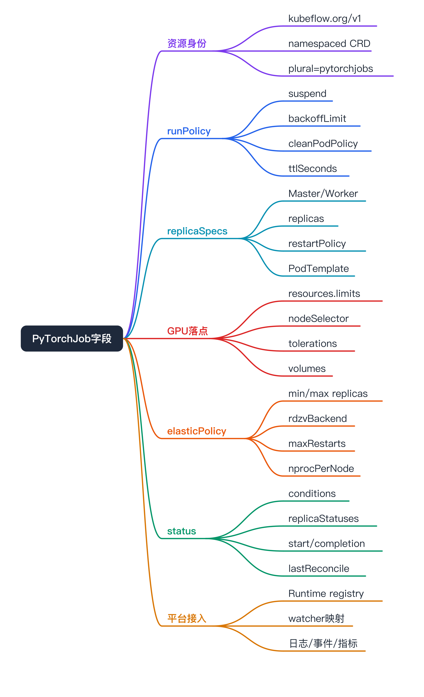

# PyTorchJob API Resources 与字段阅读地图 面试准备



这篇是给“刚开始看 PyTorchJob 有哪些字段”用的。目标不是背完 CRD，而是能在面试里说清：

- `kubectl api-resources` 里 PyTorchJob 是什么。
- `kubectl explain pytorchjob.spec` 应该重点看哪些字段。
- 哪些字段影响稳定性、调度、恢复和可观测。
- SAI 如果接 PyTorchJob，控制面和 watcher 要补哪些对象。

## 本机验证备注

我尝试在本机直接跑：

```bash
kubectl api-resources | rg -i 'pytorch|kubeflow|training'
kubectl explain pytorchjob.spec --recursive
```

当前机器的 kubeconfig 不可用，错误是：

```text
error loading config file "/Users/a1021500303/.kube/config": read /Users/a1021500303/.kube/config: is a directory
```

所以本文字段基于 Kubeflow Training Operator `release-1.9` 的官方 CRD schema 和 Kubeflow/Kueue 官方文档整理。真实集群里要以线上 CRD 为准，尤其注意 Training Operator 版本差异。

## api-resources 应该怎么读

官方 CRD 的资源身份：

```yaml
apiVersion: apiextensions.k8s.io/v1
kind: CustomResourceDefinition
metadata:
  name: pytorchjobs.kubeflow.org
spec:
  group: kubeflow.org
  names:
    kind: PyTorchJob
    listKind: PyTorchJobList
    plural: pytorchjobs
    singular: pytorchjob
  scope: Namespaced
  versions:
    - name: v1
```

换成 `kubectl api-resources` 的口径，大概应该理解成：

```text
NAME          APIVERSION       NAMESPACED   KIND
pytorchjobs   kubeflow.org/v1  true         PyTorchJob
```

面试表达：

PyTorchJob 是 namespaced CRD，group 是 `kubeflow.org`，version 是 `v1`，kind 是 `PyTorchJob`，plural 是 `pytorchjobs`。平台要 watch 的不是 batch/v1 Job，而是这个 Training Operator 自定义资源。

## kubectl 常用命令

确认 CRD 是否存在：

```bash
kubectl api-resources | grep -i pytorch
kubectl get crd pytorchjobs.kubeflow.org -o yaml
```

看字段：

```bash
kubectl explain pytorchjob
kubectl explain pytorchjob.spec
kubectl explain pytorchjob.spec.runPolicy
kubectl explain pytorchjob.spec.pytorchReplicaSpecs
kubectl explain pytorchjob.spec.elasticPolicy
```

看作业实例：

```bash
kubectl get pytorchjob -n <ns>
kubectl get pytorchjob -n <ns> <name> -o yaml
kubectl describe pytorchjob -n <ns> <name>
```

看对应 Pod：

```bash
kubectl get pod -n <ns> -l training.kubeflow.org/job-name=<name> -o wide
kubectl logs -n <ns> <pod> -c <container>
kubectl describe pod -n <ns> <pod>
```

这些命令分别验证什么：

- `api-resources`：集群里有没有 PyTorchJob 这种资源。
- `explain`：字段 schema 和版本是否符合预期。
- `get pytorchjob -o yaml`：operator 看到的作业状态。
- `get pod -l ...`：operator 创建出来的真实 Pod 分布。
- `describe pod`：调度、镜像、PVC、taint、OOM、退出码等 Kubernetes 事件。

## 顶层结构

一个 PyTorchJob 最小上可以这么读：

```yaml
apiVersion: kubeflow.org/v1
kind: PyTorchJob
metadata:
  name: example
  namespace: training
spec:
  runPolicy: {}
  nprocPerNode: "gpu"
  pytorchReplicaSpecs:
    Master:
      replicas: 1
      restartPolicy: OnFailure
      template:
        spec:
          containers: []
    Worker:
      replicas: 2
      restartPolicy: OnFailure
      template:
        spec:
          containers: []
  elasticPolicy: {}
status:
  conditions: []
  replicaStatuses: {}
```

面试记忆：

`metadata` 是 Kubernetes 资源身份；`spec` 是期望态；`status` 是 operator 写回的观测态。稳定性治理重点看 `runPolicy`、`pytorchReplicaSpecs`、`elasticPolicy` 和 `status`。

## spec.runPolicy

官方 CRD 中 `runPolicy` 的子字段包括：

- `activeDeadlineSeconds`
- `backoffLimit`
- `cleanPodPolicy`
- `managedBy`
- `schedulingPolicy`
- `suspend`
- `ttlSecondsAfterFinished`

### activeDeadlineSeconds

控制作业最长运行时间。

稳定性影响：

- 防止任务无限 hang 住占用 GPU。
- 对低优/抢占池任务尤其重要。
- 过短会误杀慢任务，过长会拖住资源。

SAI 应该怎么用：

把它和任务画像里的最大运行时长、队列优先级、资源池类型绑定，不让用户随便留空。

### backoffLimit

控制失败重试上限。

稳定性影响：

- PyTorchJob 失败成本高，无脑重试会反复浪费 GPU。
- 重试次数要和失败类型结合：镜像/PVC/参数错误不应一直重试；节点/GPU 异常可以换节点重试。

面试表达：

PyTorchJob 的重试要比普通 Job 谨慎，因为一次 worker 失败可能导致整组重启。平台应该把失败原因分类后再决定退避。

### cleanPodPolicy

控制作业完成后保留或清理 Pod。

稳定性影响：

- 立刻清理会释放资源，但丢失现场。
- 保留失败 Pod 有利于排障，但会占资源和对象。

SAI 应该怎么用：

失败保留一段时间，成功按 TTL 清理；日志和事件要先落库/归档，不能只依赖 Pod 还在。

### schedulingPolicy

调度相关策略字段，具体能力取决于 Training Operator 和调度器集成。

稳定性影响：

- 可能和 queue、priority、minAvailable、调度插件关联。
- 如果平台用了 Volcano/Kueue，要确认它和 `schedulingPolicy` / labels / annotations 的边界。

面试表达：

调度策略不能只靠 PyTorchJob 字段本身，实际要看集群接的是 Kueue、Volcano、coscheduling 还是原生 scheduler。

### suspend

控制 Job controller 是否创建 Pod。Kueue 官方示例里常用 `spec.runPolicy.suspend: true`，由 Kueue admission 后再 unsuspend。

稳定性影响：

- 区分“队列未准入”和“Pod 调度失败”。
- 对 GPU 队列很重要，避免作业未获准入就创建 Pod 抢资源。

SAI 应该怎么用：

如果接 Kueue，创建时默认 suspend，由队列准入后放开；控制台状态要显示“排队中/已准入/调度中/运行中”。

### ttlSecondsAfterFinished

控制完成后多久清理。

稳定性影响：

- 防止历史 Pod/对象堆积。
- 也避免过早删除影响排障。

SAI 应该怎么用：

平台侧保留状态快照、日志索引、事件和失败原因，Kubernetes 对象按 TTL 清理。

## spec.nprocPerNode

官方 CRD 中 `nprocPerNode` 是字符串，描述每个节点启动多少 worker，支持 `auto`、`cpu`、`gpu`、整数等值。

稳定性影响：

- 多卡单机时，常见是每张 GPU 一个进程。
- 配错可能导致进程数、GPU 可见数、world size 不一致。

面试表达：

`nprocPerNode` 影响 torchrun 每个节点起多少训练进程，它要和 Pod 里的 GPU limit、CUDA_VISIBLE_DEVICES、训练脚本 world size 对齐。

## spec.pytorchReplicaSpecs

这是 PyTorchJob 最核心的训练拓扑字段。它是一个 map，key 是 replica type，常见为 `Master` 和 `Worker`；value 是 ReplicaSpec。

每个 ReplicaSpec 关键字段：

- `replicas`
- `restartPolicy`
- `template`

### replicas

控制某类角色的副本数。

稳定性影响：

- Master 通常 1。
- Worker 数决定多机规模。
- Worker 数、每 Pod GPU 数、`nprocPerNode` 一起决定总 world size。

面试表达：

PyTorchJob 的总训练进程数不是只看 replicas，要看 Worker 副本数、每个 Pod 的 GPU 数和 `nprocPerNode`。

### restartPolicy

控制该 replica 的重启策略。

稳定性影响：

- PyTorch 分布式训练里单个 worker 重启可能导致整体通信组重建。
- restartPolicy 不能替代训练框架的 checkpoint 和 elastic 能力。

### template

这是真正的 PodTemplate，GPU 调度、镜像、启动命令、env、volume 都在里面。

重点看：

```yaml
template:
  metadata:
    labels: {}
    annotations: {}
  spec:
    restartPolicy: Never
    nodeSelector: {}
    tolerations: []
    affinity: {}
    containers:
      - name: pytorch
        image: <image>
        command: []
        args: []
        env: []
        resources:
          limits:
            nvidia.com/gpu: 8
        volumeMounts: []
    volumes: []
```

稳定性影响：

- `resources.limits.nvidia.com/gpu` 决定独占 GPU 卡数。
- `nodeSelector` / `tolerations` 决定进入哪个 NodePool。
- `affinity` / topology 影响跨节点通信质量。
- `volumes` / `volumeMounts` 决定数据集、checkpoint 和日志能否落盘。
- `annotations` 可能要关闭 service mesh sidecar，否则分布式训练端口和性能可能受影响。

SAI 应该怎么用：

平台表单不要直接暴露全部 PodSpec。应该提供资源池、镜像、启动命令、数据路径、checkpoint 路径、环境变量、优先级等高层字段，再由模板生成 PodSpec。

## spec.elasticPolicy

官方 CRD 中 `elasticPolicy` 子字段包括：

- `minReplicas`
- `maxReplicas`
- `maxRestarts`
- `metrics`
- `nProcPerNode`
- `rdzvBackend`
- `rdzvConf`
- `rdzvHost`
- `rdzvId`
- `rdzvPort`
- `standalone`

字段怎么理解：

- `minReplicas` / `maxReplicas`：Elastic 允许的 worker 范围。
- `maxRestarts`：elastic 训练可重启上限。
- `rdzvBackend`：rendezvous 后端，如 c10d/etcd 等，具体取决于训练入口。
- `rdzvHost` / `rdzvPort` / `rdzvId` / `rdzvConf`：rendezvous endpoint 和参数。
- `nProcPerNode`：旧字段提示使用 `spec.nprocPerNode`，说明版本里存在迁移痕迹。
- `standalone`：单节点独立 rendezvous 场景。
- `metrics`：和自动伸缩/指标相关，实际能否使用取决于 operator 和环境。

稳定性影响：

- Elastic 不是“资源不足自动好起来”，而是要训练代码、rendezvous、checkpoint 和收敛策略都支持。
- `minReplicas` 太低可能影响训练效果，`maxReplicas` 太高可能导致队列长期等不到资源。
- rendezvous 后端不可用会直接导致训练起不来或中途重集合失败。

面试表达：

我会把 elasticPolicy 当成“有条件的弹性训练能力”，而不是默认打开。平台要先确认任务是否支持 elastic 和 checkpoint，再开放 min/max。

## status

官方 CRD status 顶层字段包括：

- `conditions`
- `replicaStatuses`
- `startTime`
- `completionTime`
- `lastReconcileTime`

### conditions

作业状态条件，CRD additionalPrinterColumns 里用的是：

```yaml
jsonPath: .status.conditions[-1:].type
name: State
```

也就是说 `kubectl get pytorchjob` 常看的 State 来自最后一个 condition type。

稳定性影响：

- 这是平台列表页最应该同步的字段。
- 但 condition 太粗，不能替代 Pod / rank / GPU / checkpoint 指标。

### replicaStatuses

按角色统计 active / succeeded / failed 等数量。

稳定性影响：

- 能快速判断 Master/Worker 是否齐。
- 比单看 Pod 列表更接近训练语义。
- 如果 Worker active 不等于期望值，要进入调度/gang/rendezvous 排查。

### startTime / completionTime / lastReconcileTime

用于判断生命周期耗时和 controller 是否还在 reconcile。

稳定性影响：

- Pending 时长、Running 时长、完成耗时、reconcile 停滞都可以从这些字段衍生。

## Labels 与对象关联

常见 Training Operator 生成的对象会带类似标签：

- `training.kubeflow.org/job-name=<name>`
- `training.kubeflow.org/replica-type=master|worker`
- `training.kubeflow.org/replica-index=<index>`

Kueue 接入时常见 queue label：

- `kueue.x-k8s.io/queue-name=<queue>`

这些标签的价值：

- 从 PyTorchJob 反查 Pod。
- 从 Pod 反查 rank 角色。
- 聚合 GPU 指标和日志到 Job 维度。
- 区分队列、租户、资源池、优先级。

## SAI 控制面应该补什么

- **Runtime registry**：记录 `group=kubeflow.org`、`version=v1`、`kind=PyTorchJob`、plural、namespace、watch scope。
- **模板字段**：Master/Worker replicas、GPU per pod、nprocPerNode、image、command、env、volume、checkpoint、NodePool。
- **调度字段**：queue、priority、gang、nodeSelector、tolerations、affinity、topology、suspend。
- **状态映射**：conditions、replicaStatuses、Pod phase、Event reason、container exitCode。
- **日志入口**：rank0/Master 日志、Worker 日志、previous logs。
- **指标关联**：GPU util/memory、Pod CPU/memory、NCCL、data IO、checkpoint。
- **失败归因**：Pending、rendezvous、NCCL、CUDA OOM、K8s OOMKill、PVC、image、业务异常。

## 面试可背的字段总结

30 秒版：

PyTorchJob 的字段我主要看四块：`runPolicy` 管运行策略，比如重试、清理、暂停和 TTL；`pytorchReplicaSpecs` 管 Master/Worker 副本和 Pod template，GPU、nodeSelector、tolerations 都在这里落地；`elasticPolicy` 管 PyTorch Elastic 和 rendezvous；`status` 管 condition、replicaStatuses 和生命周期时间。平台稳定性治理就是把这四块和 Pod/Event/GPU/NCCL 指标串起来。

## 参考资料

- Kubeflow PyTorchJob legacy v1 文档：https://www.kubeflow.org/docs/components/trainer/legacy-v1/user-guides/pytorch/
- Kubeflow Trainer v2 migration：https://www.kubeflow.org/docs/components/trainer/operator-guides/migration/
- Kueue 运行 PyTorchJob：https://kueue.sigs.k8s.io/docs/tasks/run/kubeflow/pytorchjobs/
- Kubeflow Training Operator PyTorchJob CRD：https://raw.githubusercontent.com/kubeflow/training-operator/release-1.9/manifests/base/crds/kubeflow.org_pytorchjobs.yaml
