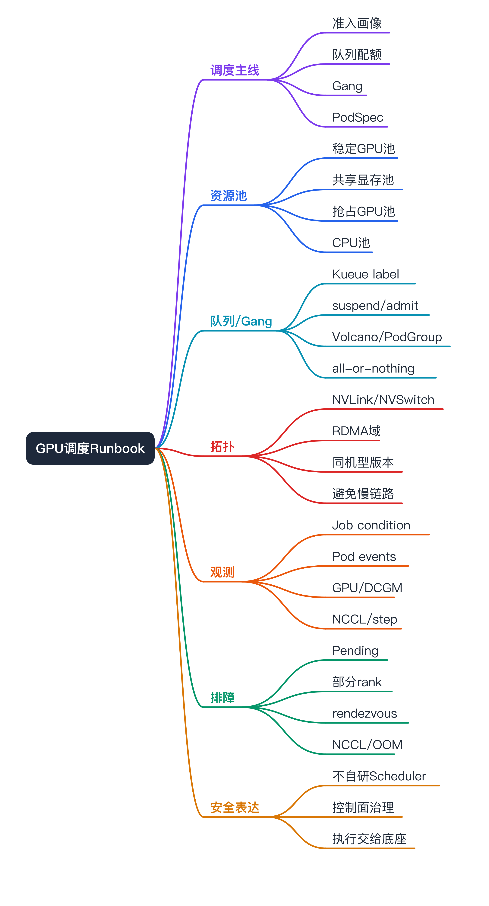

# PyTorchJob GPU 调度与稳定性 Runbook 面试准备



这篇专门补“GPU 调度相关”。核心口径：

PyTorchJob 的 GPU 调度不是只写 `nvidia.com/gpu: 8`，而是从平台资源意图到队列准入、gang、PodSpec、节点拓扑、NCCL 运行时和失败恢复的一条链路。

## 一句话主线

SAI 不自研 GPU Scheduler。SAI 做的是把用户的资源意图产品化：用户选择训练资源池、GPU 卡型、卡数、优先级、队列和 checkpoint 策略；控制面把它翻译成 PyTorchJob 的 Pod template、queue/gang 约束和运行观测口径；最终调度交给 Kubernetes / Kueue / Volcano / GPU device plugin。

## 为什么 PyTorchJob 对 GPU 调度更敏感

- **同步 all-reduce**：DDP/FSDP 训练中所有 rank 要同步通信，少一个 rank 可能拖住整组。
- **强 gang 需求**：部分 worker 抢到 GPU 但剩余 worker Pending，会占资源却没有有效训练。
- **拓扑敏感**：多机多卡要考虑 NVLink/NVSwitch、PCIe、NIC、IB/RDMA、同 rack、同可用区。
- **版本敏感**：PyTorch、CUDA、NCCL、driver、OFED/RDMA 版本不一致会导致 hang、变慢或起不来。
- **恢复成本高**：一个 worker 失败常导致整组重启，checkpoint 和退避策略比普通 Job 更重要。

## 调度链路


## 1. 提交前准入

平台在创建 PyTorchJob 前要判断：

- 训练规模：节点数、每节点 GPU 数、总 world size。
- GPU 资源：卡型、显存、独占/共享、是否允许抢占。
- 队列配额：租户、项目、优先级、ClusterQueue / ResourceFlavor。
- 拓扑需求：单机多卡、多机多卡、是否要求 RDMA、是否允许跨可用区。
- 存储需求：数据集、checkpoint、日志、TensorBoard event、PVC/NAS/OSS。
- 镜像与版本：PyTorch/CUDA/NCCL/driver 兼容矩阵。
- 恢复能力：是否 checkpoint、是否 retryable、最大可接受重试次数。

面试表达：

GPU 调度的第一步不是调度器，而是准入。准入不做，后面就是各种 Pending、NCCL timeout 和无效重试。

## 2. NodePool / ResourceGroup 到 PodSpec

SAI 侧资源池口径可以是：

- 稳定 GPU 池：关键训练和在线推理，优先保障稳定性。
- 共享显存池：小模型或低风险服务，资源字段可能是厂商扩展资源。
- 抢占 GPU 池：低 QoS、可 checkpoint、可重试任务。
- CPU 池：数据预处理、下载、评测或不需要 GPU 的任务。

落到 PodSpec 常见字段：

```yaml
spec:
  nodeSelector:
    nodepool.soulapp/type: gpu-training
    accelerator: nvidia-a100
  tolerations:
    - key: dedicated
      operator: Equal
      value: gpu-training
      effect: NoSchedule
  affinity:
    nodeAffinity: {}
    podAffinity: {}
    podAntiAffinity: {}
  containers:
    - name: pytorch
      resources:
        limits:
          nvidia.com/gpu: 8
        requests:
          cpu: "32"
          memory: 256Gi
```

字段含义：

- `resources.limits.nvidia.com/gpu`：请求独占 GPU 卡数。
- `nodeSelector`：进入指定节点池或卡型。
- `tolerations`：容忍训练专用污点或抢占池污点。
- `affinity`：更细的节点/Pod 亲和或反亲和。
- `requests.cpu/memory`：避免数据加载或 CPU 预处理把节点打爆。

稳定性风险：

- 只写 GPU limit，不写 CPU/memory request，会导致 DataLoader 争抢 CPU 或内存。
- nodeSelector 太宽，会落到不同卡型/不同网络域。
- toleration 太宽，可能误入抢占池或在线池。
- affinity 太硬，可能长期 Pending。

## 3. Queue / Kueue 接入

Kueue 官方 PyTorchJob 示例使用：

```yaml
metadata:
  labels:
    kueue.x-k8s.io/queue-name: user-queue
spec:
  runPolicy:
    suspend: true
```

含义：

- queue label 表示作业进入哪个队列。
- `suspend: true` 表示先不创建 Pod，等 Kueue admission。
- admission 后再 unsuspend，避免未获资源配额就创建 Pod。

平台价值：

- 展示“排队中 / 已准入 / 调度中 / 运行中”。
- 把队列等待和 Pod Pending 分开。
- 支持租户配额和优先级。
- 减少 GPU 资源碎片化争抢。

排障抓手：

```bash
kubectl get pytorchjob -n <ns> <name> -o yaml | grep -A20 runPolicy
kubectl get workloads -A | grep <name>
kubectl describe workload -n <ns> <workload-name>
kubectl get localqueue,clusterqueue,resourceflavor -A
```

实际命令要以集群安装的 Kueue 版本和 CRD 为准。

## 4. Gang / Volcano / Coscheduling

PyTorchJob 需要 gang 的原因：

```text
8 worker 训练
  -> 5 个 worker 调度成功并占用 GPU
  -> 3 个 worker 因资源不足 Pending
  -> 5 个 worker 等 rendezvous
  -> 训练没有推进，但 GPU 已经被占住
```

平台应该避免这种状态。

治理方式：

- 使用 Kueue admission 先保证资源配额。
- 使用 Volcano / PodGroup / coscheduling 做 all-or-nothing。
- 对 PyTorchJob 显示期望 replicas、active replicas、pending replicas。
- 如果 gang 不满足，不要让部分 Pod 长期占卡。

面试表达：

Gang 是 PyTorchJob 的稳定性能力，不只是利用率优化。它避免部分 rank 占卡但训练不推进。

## 5. 拓扑感知调度

拓扑要分层看：

- **单机多卡**：优先同 NVLink/NVSwitch 拓扑，避免跨 NUMA/PCIe 慢链路。
- **多机多卡**：优先同 rack、同 leaf、同 RDMA 域，减少跨慢链路通信。
- **网卡与 GPU 亲和**：RDMA/NIC 与 GPU 的 NUMA 关系影响 GPUDirect RDMA。
- **版本拓扑**：同作业节点尽量同驱动、同 CUDA、同 NCCL、同 PyTorch 镜像。

平台字段：

- node label：卡型、机型、rack、RDMA 域、驱动版本、资源池。
- nodeSelector / affinity：软硬约束。
- queue flavor：不同资源池/卡型的 quota。
- schedulerName / plugin：是否使用 Volcano 或其它调度器。

风险：

- 拓扑硬约束过多会导致 Pending。
- 拓扑约束过少会导致 NCCL 慢或 timeout。
- 最稳妥是把拓扑做成“资源规格/队列等级”，不是让用户手填复杂 label。

## 6. Sidecar / Service Mesh 风险

Kubeflow PyTorchJob 官方文档提醒，在启用 Istio 的环境里可能需要给 Pod 加：

```yaml
metadata:
  annotations:
    sidecar.istio.io/inject: "false"
```

为什么：

- 分布式训练依赖进程间端口和低延迟通信。
- sidecar 可能影响端口、网络路径、启动顺序或性能。
- 训练任务通常不需要业务 mesh 流量治理。

面试表达：

如果集群默认注入 service mesh sidecar，PyTorchJob 模板要显式评估是否关闭，否则可能出现端口或通信层面的非预期问题。

## 7. 运行时观测指标

调度成功后还要看：

- PyTorchJob condition：Created / Running / Restarting / Failed / Succeeded。
- replicaStatuses：Master / Worker active、failed、succeeded。
- Pod phase：Pending / Running / Failed / Unknown。
- Event reason：FailedScheduling、ImagePullBackOff、FailedMount、OOMKilled、Evicted。
- GPU：utilization、memory、XID/ECC、温度、功耗。
- NCCL：timeout、是否走 IB/GDR、是否回退 Socket、通信耗时。
- 训练：global_step、step time、samples/sec、loss、checkpoint time。
- 存储：NAS/OSS 读写吞吐、checkpoint 写入耗时、失败率。

面试表达：

稳定性判断不是“Pod 起了”，而是“rank 到齐、训练 step 推进、GPU/NCCL 正常、checkpoint 能落盘”。

## Runbook：Pending

症状：

PyTorchJob 长时间不进入 Running，或者 Worker 数不齐。

排查顺序：

1. 看 PyTorchJob condition。
2. 看 queue 是否 admission。
3. 看 Pod 是否创建。
4. 看 Pod events。
5. 看 nodeSelector/tolerations/affinity。
6. 看 GPU quota 和卡型。
7. 看 PVC/image。
8. 看 gang / PodGroup。

命令：

```bash
kubectl get pytorchjob -n <ns> <name> -o yaml
kubectl get pod -n <ns> -l training.kubeflow.org/job-name=<name> -o wide
kubectl describe pod -n <ns> <pod>
kubectl get events -n <ns> --sort-by=.lastTimestamp
```

结论：

- queue 未准入：容量/配额问题。
- Pod 未创建：operator 或 suspend/admission 问题。
- FailedScheduling：资源池/taint/affinity/GPU 不满足。
- FailedMount：PVC/NAS 问题。
- ImagePullBackOff：镜像仓库/权限/镜像名问题。

## Runbook：部分 rank Running

症状：

部分 Master/Worker Running，部分 Worker Pending，训练日志显示 waiting。

排查顺序：

1. 看 expected replicas 与 active replicas。
2. 看是否启用了 gang。
3. 看 Pending worker 的 events。
4. 看已 Running worker 是否占用 GPU 但无 step 推进。

结论：

这是 PyTorchJob 里很典型的资源碎片/无 gang 问题。平台优化方向是先 admission 再创建 Pod，或者启用 PodGroup/coscheduling。

## Runbook：rendezvous 卡住

症状：

所有或大部分 Pod Running，但 rank0 日志一直 waiting for workers。

排查顺序：

1. Master/rank0 日志。
2. Worker 日志。
3. Service/Endpoint 是否存在。
4. MASTER_ADDR / MASTER_PORT / world size / rank 环境变量。
5. NetworkPolicy / sidecar / DNS。

命令：

```bash
kubectl logs -n <ns> <master-pod>
kubectl logs -n <ns> <worker-pod>
kubectl get svc,endpoints -n <ns> | grep <job-name>
kubectl exec -n <ns> <worker-pod> -- env | grep -E 'MASTER|RANK|WORLD|LOCAL'
```

结论：

如果 rank 参数或 master 地址错误，属于模板/启动参数问题；如果网络不通，属于 Service/NetworkPolicy/sidecar 问题。

## Runbook：NCCL timeout / 训练变慢

症状：

训练进入后卡住、报 NCCL timeout，或者扩到多机后 step time 明显变慢。

排查顺序：

1. `NCCL_DEBUG` 日志。
2. 哪个 rank 最后到达 collective。
3. Pod 分布在哪些节点、卡型、rack、可用区。
4. 是否走 IB/GDR，还是回退 Socket。
5. CUDA/NCCL/PyTorch/driver 版本是否一致。
6. GPU XID/ECC/节点网络是否异常。

命令：

```bash
kubectl logs -n <ns> <pod> | grep -i "NCCL\\|rank\\|timeout"
kubectl get pod -n <ns> -l training.kubeflow.org/job-name=<name> -o wide
kubectl describe node <node>
```

结论：

- 某 rank 掉队：查该 rank OOM、数据加载、节点问题。
- 回退 Socket：查 RDMA/NIC/NCCL 环境变量和驱动。
- 跨慢拓扑：收紧拓扑或调整资源池。
- 版本不一致：锁镜像和节点基线。

## Runbook：CUDA OOM / OOMKill

症状：

容器重启、训练退出、日志里出现 CUDA out of memory 或 Pod 被 OOMKilled。

先分清：

- CUDA OOM：GPU 显存不足。
- K8s OOMKill：容器内存不足。

排查命令：

```bash
kubectl describe pod -n <ns> <pod>
kubectl logs -n <ns> <pod> --previous
```

CUDA OOM 常见抓手：

- batch size / micro batch。
- sequence length。
- dtype / mixed precision。
- activation checkpointing。
- FSDP / ZeRO / gradient accumulation。
- LoRA/量化。

K8s OOMKill 常见抓手：

- DataLoader workers。
- CPU 内存 request/limit。
- 数据缓存。
- checkpoint/日志缓冲。

平台侧动作：

- 显示 GPU memory 水位和容器内存水位。
- 给出“显存 OOM vs 容器 OOM”的明确归因。
- 不把所有 OOM 都推荐加 GPU。

## Runbook：checkpoint 慢或恢复失败

症状：

训练失败后恢复很慢，或 checkpoint 写入耗时拖慢 step。

排查顺序：

1. checkpoint 路径是否挂载。
2. NAS/OSS 吞吐和延迟。
3. checkpoint 大小和分片数量。
4. 是否保存 optimizer state。
5. 多 worker 是否同时写造成热点。

优化方向：

- checkpoint 频率按任务风险配置。
- 大模型分片 checkpoint 要有完整性校验。
- 抢占池任务必须要求 checkpoint。
- 恢复失败要回退稳定资源池或通知业务。

## SAI 如果落地应该补哪些能力

- **资源准入**：GPU 卡型、卡数、显存、NodePool、queue、priority、checkpoint 校验。
- **模板生成**：Master/Worker、nprocPerNode、env、volume、sidecar 注入策略。
- **队列/gang 接入**：Kueue/Volcano/coscheduling 的统一状态表达。
- **拓扑画像**：节点卡型、NVLink/RDMA/rack、驱动/CUDA/NCCL 版本。
- **观测聚合**：PyTorchJob -> Pod -> GPU -> rank log -> checkpoint。
- **失败分类**：Pending、ImagePull、PVC、rendezvous、NCCL、CUDA OOM、OOMKill、业务异常。
- **恢复策略**：retry、backoff、熔断、换节点、换资源池、checkpoint resume。

## 面试安全表达

可以说：

SAI 的 GPU 调度能力不是自研 scheduler，而是控制面把训练资源意图收敛成 NodePool、queue、PodSpec 和观测口径。PyTorchJob 接进来后，重点要补 gang、rank/rendezvous、NCCL/topology 和 checkpoint 的稳定性治理。

不要说：

我们自己实现了 GPU 调度器，或者我调优了 NCCL 内核。

更稳妥：

调度执行仍依赖 K8s/Kueue/Volcano/GPU 插件；我负责或能设计的是平台侧准入、模板、状态和排障闭环。

## 参考资料

- Kueue 运行 PyTorchJob：https://kueue.sigs.k8s.io/docs/tasks/run/kubeflow/pytorchjobs/
- Kubeflow PyTorchJob legacy v1 文档：https://www.kubeflow.org/docs/components/trainer/legacy-v1/user-guides/pytorch/
- Kubeflow Trainer overview：https://www.kubeflow.org/docs/components/trainer/overview/
- Kubeflow Training Operator PyTorchJob CRD：https://raw.githubusercontent.com/kubeflow/training-operator/release-1.9/manifests/base/crds/kubeflow.org_pytorchjobs.yaml
