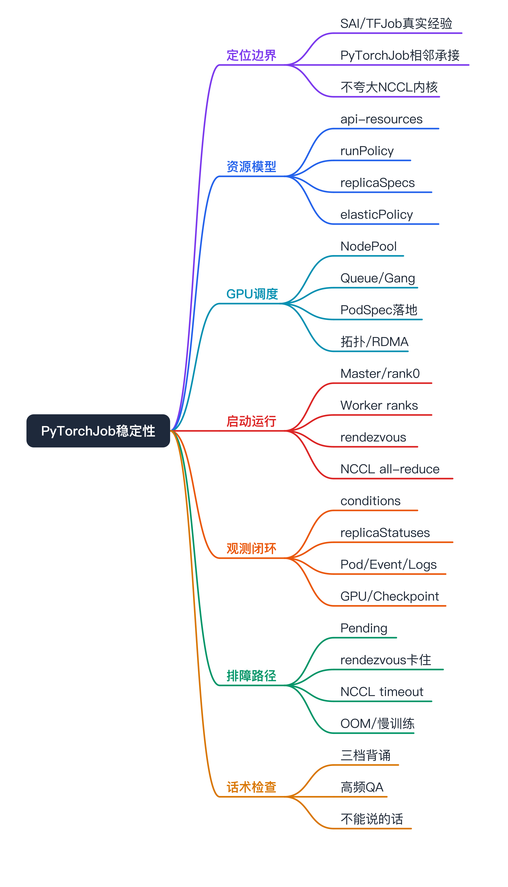
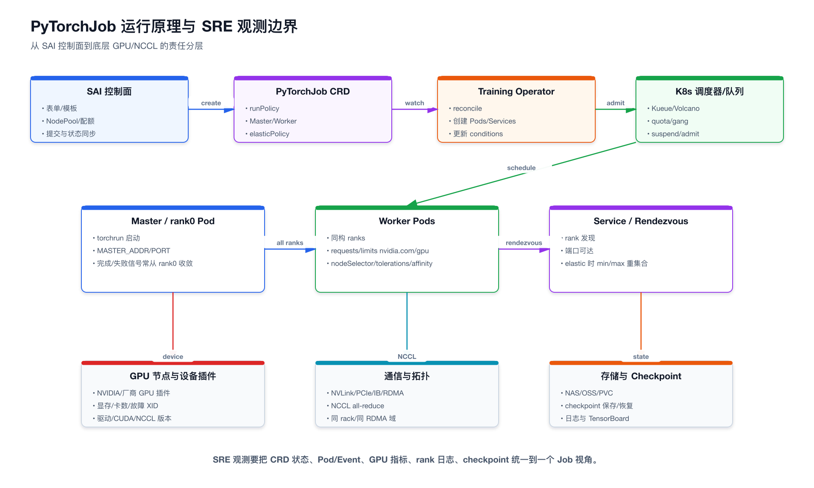
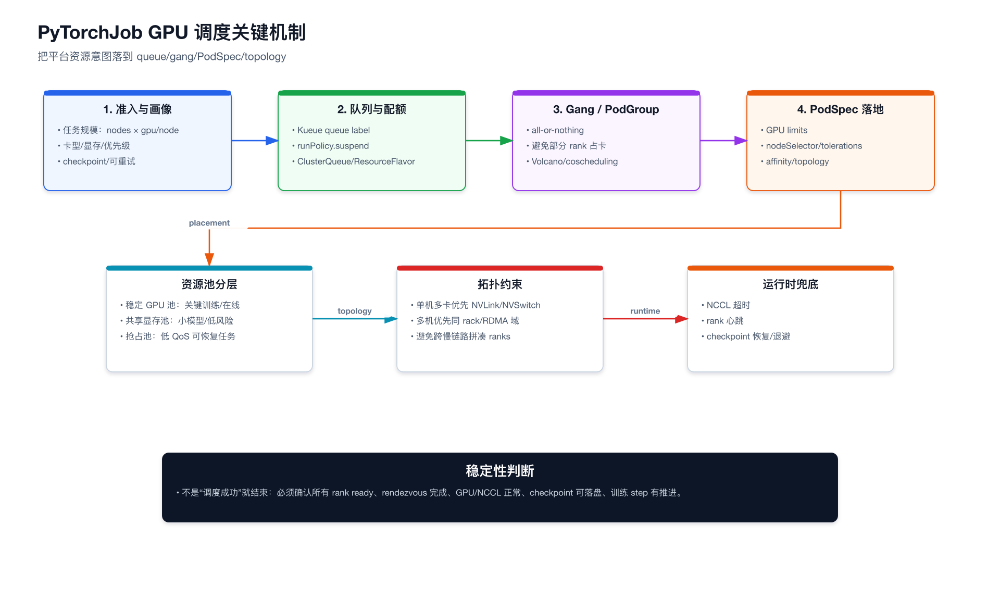
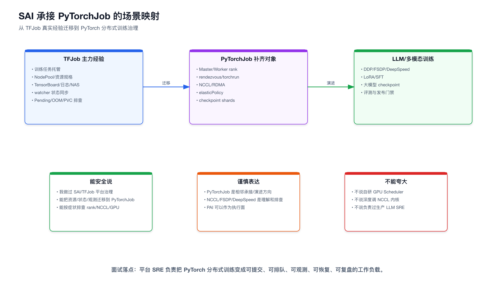
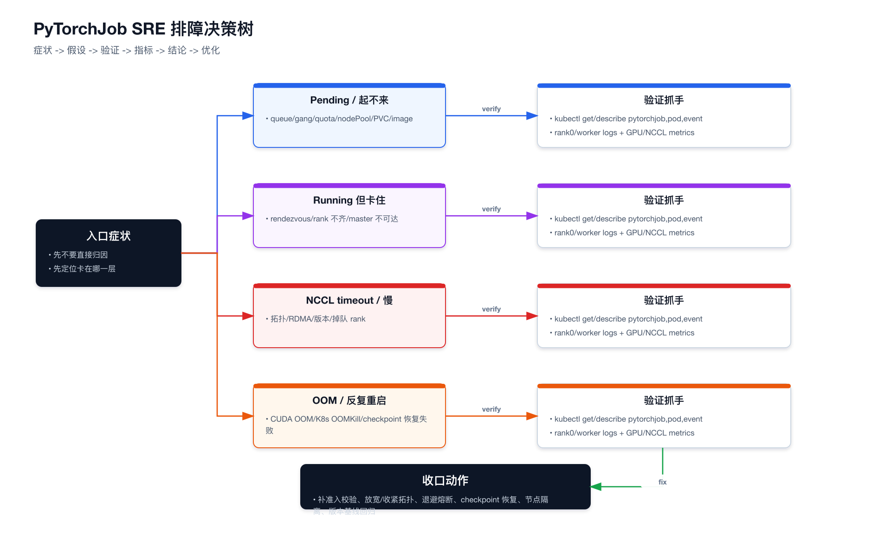

# PyTorchJob 稳定性治理 面试准备



```yaml
experience_level: adjacent_production_experience
# 真实经验：SAI 控制面、TFJob 训练任务托管、NodePool/GPU 资源池、watcher 状态同步、日志/事件/Pod/GPU 平台侧排障。
# 相邻经验：PyTorchJob 作为 Training Operator 工作负载的承接方式、Master/Worker/rank/gang/rendezvous/NCCL 的平台治理语义。
# 理论对标：PyTorch DDP/FSDP/Elastic 内部实现、NCCL 算法与通信库源码、Kueue/Volcano 调度器内部算法。
# 面试原则：不说“我主导了 PyTorchJob 生产 SRE”，而说“我能把 TFJob/SAI 的平台治理经验迁移到 PyTorchJob，并讲清要补哪些字段、状态和排障抓手”。
```

# 面试定位卡

- **技术点**：PyTorchJob 在 AI 训练平台里的稳定性治理，覆盖 CRD 资源模型、GPU 调度、gang、rendezvous、NCCL、状态观测、失败退避和 checkpoint 恢复。
- **所属领域**：AI Infra / MLOps / Kubernetes Operator / GPU 调度 / 分布式训练 SRE。
- **面试价值**：证明我不是只会 TFJob，也不是只停留在“PyTorch 是 LLM 生态主流”这句，而是能讲清 PyTorchJob 进入平台后有哪些新的稳定性问题。
- **常见考法**：PyTorchJob 有哪些字段；为什么 PyTorchJob 比 TFJob 更依赖 gang；GPU 调度怎么落到 PodSpec；Pending / rendezvous 卡住 / NCCL timeout 怎么排查；平台怎么做统一状态和资源治理。
- **适合挂钩项目**：SAI 训推平台、TFJob 训练任务托管、NodePool/GPU 资源池治理、数字分身/多模态训练的 PyTorch 生态承接、PAI-DLC / PyTorchJob Provider 演进设计。
- **不适合夸大的地方**：不声称自研 PyTorch 训练框架、GPU Scheduler、NCCL 内核，也不把 PyTorchJob 说成我已经大规模生产运维过的主力负载。

# 三十秒回答

PyTorchJob 是 Kubeflow Training Operator 里用于承接 PyTorch 分布式训练的 CRD。平台侧治理它，核心不是“能不能创建一个 YAML”，而是把多机多卡同步训练变成可控的工作负载：提交前要校验 GPU 卡型、配额、checkpoint、镜像和存储；调度时要保证 gang，避免部分 rank 占住 GPU 但整体卡死；启动时要关注 Master/rank0、Worker、rendezvous、world size；运行中要把 CRD condition、replicaStatuses、Pod/Event、rank 日志、GPU 和 NCCL 指标合成一个 Job 视角；失败后要能区分平台调度问题、分布式握手问题、通信问题、显存问题和业务代码问题。我的真实经验在 SAI/TFJob 平台治理，PyTorchJob 是同一类训练工作负载向 PyTorch/LLM 生态演进时必须补齐的治理面。

# 为什么需要它

- **没有它之前的问题**：平台只会创建训练任务，但无法回答 PyTorch 训练为什么 Pending、为什么所有 Pod Running 但训练没推进、为什么一个 worker 掉队导致整组 hang、为什么 GPU 有卡却排不上。
- **它的解决方式**：把 PyTorchJob 拆成 API 资源模型、GPU 调度模型、分布式启动模型、运行观测模型和失败恢复模型，分别建立字段、指标、事件和 runbook。
- **它引入的新问题**：PyTorchJob 比 TFJob 更容易把失败放大成全局失败。同步 all-reduce 要求所有 rank 到齐，拓扑和通信更敏感，checkpoint / elastic / gang 也更难治理。
- **必须关注的场景**：多机多卡训练、DDP/FSDP/DeepSpeed、LoRA/SFT、多模态训练、LLM 微调、GPU 队列排队、抢占资源、NCCL/RDMA 和大 checkpoint。

# 核心概念表

- **PyTorchJob CRD**：`kubeflow.org/v1` 下的 namespaced 资源，`kind=PyTorchJob`。面试展开点：`kubectl api-resources` 看到的不是普通 Job，而是由 Training Operator reconcile 的自定义资源。
- **runPolicy**：控制作业运行策略，如清理、超时、重试、暂停、调度策略。面试展开点：稳定性治理不是只看 replica，`cleanPodPolicy`、`backoffLimit`、`ttlSecondsAfterFinished`、`suspend` 影响排障和资源回收。
- **pytorchReplicaSpecs**：Master / Worker 等 replica 模板，内部包含 `replicas`、`restartPolicy`、`template`。面试展开点：真正的 GPU、nodeSelector、tolerations、env、volume 都落在 Pod template。
- **elasticPolicy**：PyTorch Elastic 相关字段，包含 min/max replicas、rendezvous、maxRestarts 等。面试展开点：elastic 降低资源 rigid，但引入 rendezvous 后端和状态波动。
- **Master / rank0**：协调入口和常见完成信号源，不等于“只负责控制不算力”。面试展开点：看 rank0 日志是排查 rendezvous、NCCL 和训练进度的入口。
- **Worker / rank**：同构训练进程，负责计算和集合通信。面试展开点：一个 rank 掉队可能拖住整个 collective。
- **rendezvous**：分布式进程集合和发现机制。面试展开点：Pod Running 不代表训练启动，rank 必须完成 rendezvous 才能进入训练。
- **gang 调度**：所有关键 Pod 要么一起拿到资源，要么都不启动。面试展开点：PyTorchJob 比 TFJob 更需要强 gang，否则部分 worker 占卡、整体不前进。
- **NCCL / RDMA / topology**：多机多卡通信底座和拓扑约束。面试展开点：GPU 调度不只是卡数，还要考虑节点、网卡、NVLink、IB/RDMA 和版本。

# 原理模型



从下往上理解：

- **基础设施层**：GPU 节点、设备插件、驱动、CUDA、NCCL、RDMA/NIC、NAS/OSS/PVC。PyTorchJob 的很多问题最后落到这层，比如 GPU 不可见、驱动版本不一致、RDMA 不通、checkpoint 写入慢。
- **Kubernetes 层**：调度器、队列系统、Pod、Service、Event、PVC、NodePool、taint/toleration、affinity。平台负责把用户选择的资源池转成 PodSpec，而不是直接替代调度器。
- **Training Operator 层**：监听 PyTorchJob CRD，创建 Master/Worker Pod 和相关 Service，并更新 condition / replicaStatuses。
- **PyTorch 分布式层**：torchrun、rendezvous、rank、world size、DDP/FSDP/NCCL。SRE 不一定改训练代码，但必须能看懂卡在哪个环节。
- **SAI 控制面层**：任务模板、资源准入、Provider、状态同步、日志事件、GPU 指标、失败归因和 runbook。

关键判断：Pod Running 只是 Kubernetes 层健康，不代表 PyTorch 分布式训练健康。平台必须把 CRD、Pod、rank、GPU、NCCL 和 checkpoint 聚合到一个 Job 视角。

# 关键机制



## API 资源模型机制

解决的问题：

让平台知道 PyTorchJob 不是普通 Kubernetes Job，而是有 Master/Worker、runPolicy、elasticPolicy 和 status 的训练 CRD。

工作方式：

- 通过 `kubectl api-resources` 确认 `pytorchjobs.kubeflow.org` 是否存在。
- 通过 `kubectl explain pytorchjob.spec --recursive` 或 CRD schema 读取字段。
- 平台侧把 PyTorchJob 纳入 Runtime registry：资源名称、group/version/kind、watcher、状态映射、日志入口、资源模板。

代价：

不同 Training Operator 版本字段会有差异；Kubeflow Trainer v2 正在用 `TrainJob` / `TrainingRuntime` 替代旧的框架专属 CRD，平台要把 PyTorchJob 当 legacy v1 能力管理，不要写死未来形态。

面试追问：

为什么不直接用 batch Job？因为 PyTorchJob 提供训练语义：replica role、restartPolicy、runPolicy、elasticPolicy、operator 状态和框架级完成判定。

## GPU 准入与资源池翻译机制

解决的问题：

用户说“我要 4 机 8 卡 A100 训练”，平台不能只创建 YAML，要先判断资源池、配额、卡型、拓扑、存储和优先级是否满足。

工作方式：

- SAI 侧用 NodePool / ResourceGroup 表达稳定 GPU、共享显存、抢占 GPU、CPU 等资源池。
- 控制面把资源池翻译成 Pod template 里的 `nodeSelector`、`tolerations`、`affinity` 和 GPU `resources.limits`。
- 多机多卡训练要把总资源量汇总到队列和 gang 维度，而不是按 Pod 单独抢占资源。

代价：

约束越严格，越容易排队；约束太松，训练可能跨慢链路、跨不合适节点，后续 NCCL 变慢或 timeout。

面试追问：

SAI 是不是自研 GPU Scheduler？不是。SAI 做资源抽象、准入校验、PodSpec 生成、状态观测和排障入口，最终调度仍由 Kubernetes scheduler / Kueue / Volcano / GPU device plugin 完成。

## Gang 与队列机制

解决的问题：

避免 8 个 worker 里只调起 5 个，5 个占住 GPU，剩下 3 个排不到，整个 PyTorchJob 卡在 rendezvous。

工作方式：

- 队列层先做资源 admission，例如 Kueue 用 queue label 和 `runPolicy.suspend` 控制作业何时真正创建 Pod。
- 调度层做 all-or-nothing，例如 Volcano / coscheduling 确保一组 rank 同时满足。
- 平台状态页要把“队列未准入”和“Pod 已创建但调度失败”分开展示。

代价：

gang 会牺牲一部分局部利用率，但换来训练启动确定性。对 PyTorchJob 这种同步训练，通常值得。

面试追问：

为什么 PyTorchJob gang 比 TFJob 更硬？因为同步 all-reduce 少一个 rank 就会阻塞集合通信；TFJob 的 PS/Worker 在某些模式下有更强角色语义和部分容错空间。

## Rendezvous 与 rank 就绪机制

解决的问题：

Pod 都 Running，但训练进程还没进入训练，可能卡在 rank 集合、master 地址、端口、world size 或网络可达性。

工作方式：

- Master/rank0 提供或记录 rendezvous endpoint。
- Worker 进程按 rank / world size 加入同一通信组。
- 平台排障先看 rank0 日志，再看 worker 日志、Service/Endpoint、端口、网络策略和环境变量。

代价：

Training Operator 只能创建资源，无法保证业务容器内的 torchrun 参数一定正确。平台需要把常见参数模板化，减少用户手写错误。

面试追问：

为什么 Pod Running 但任务没进展？可能 rank 没凑齐、master 不可达、某个 worker 数据加载阻塞、NCCL 初始化失败，不能只看 Pod phase。

## 失败退避与 checkpoint 恢复机制

解决的问题：

PyTorch 同步训练里一个 worker 失败常常导致整个任务重启，成本比普通 batch Job 高。无脑重试会浪费大量 GPU。

工作方式：

- 区分平台失败、调度失败、业务代码失败、CUDA OOM、NCCL timeout、节点/GPU 硬件故障。
- 对可恢复任务要求 checkpoint，失败后按 step / checkpoint 恢复。
- 对同一节点/同一 GPU 反复失败做节点隔离或降低调度优先级。
- 对同一任务多次失败做指数退避、熔断、回退稳定资源池或通知算法同学。

代价：

checkpoint 会引入存储 IO 和恢复耗时，频率过高会吞掉训练收益；频率过低会放大失败损失。

面试追问：

为什么 PyTorchJob 不适合随便放抢占池？多机多卡强同步训练被抢占后整体重启成本高，除非 checkpoint 可靠、任务低优、恢复成本可接受。

# 横向对比

- **PyTorchJob vs TFJob：角色同构 vs 角色异构**：TFJob 常见 Chief/PS/Worker，角色资源画像和失败语义不同；PyTorchJob Master/Worker 更接近 rank 同构，资源画像容易统一，但一个 rank 掉队的影响更大。
- **PyTorchJob vs batch Job：训练语义 vs 普通 Pod 集合**：batch Job 能跑脚本，但缺少 PyTorch 角色、replica status、rendezvous 约定和 operator 状态；PyTorchJob 更适合平台化训练治理。
- **Kubernetes 调度 vs 平台准入**：Kubernetes 负责最终放置 Pod；SAI 负责用户语义、资源池、配额、字段校验、模板生成、事件归因和状态聚合。
- **GPU 卡数 vs GPU 拓扑**：卡数够不代表训练稳定。多机多卡还要看是否同机型、同驱动、同 CUDA/NCCL、同 rack/RDMA 域、是否跨慢链路。
- **Pod Running vs Training Running**：Pod Running 只是容器启动；Training Running 还要求 rank 到齐、rendezvous 完成、NCCL 初始化完成、训练 step 推进。
- **Elastic vs 静态副本**：elastic 可以缓解资源波动，但引入 min/max、rendezvous、重集合和状态波动；静态副本简单，但资源刚性更强。

# 典型业务场景



- **场景 A：SAI 从 TFJob 主力承接迁移到 PyTorchJob 补齐**：为什么相关：传统推荐训练以 TFJob 为主，但面试官会看平台是否能承载 PyTorch/LLM 生态。可能现象：文档只讲 TFJob，PyTorchJob 只停留在名词。排查方式：把 CRD 字段、GPU 调度、rank/rendezvous/NCCL 观测补齐。优化方向：新增 PyTorchJob Runtime registry、模板、watcher 和 runbook。
- **场景 B：多模态/数字分身训练使用 PyTorch 分布式生态**：为什么相关：多模态训练更可能使用 PyTorch、DDP/FSDP/DeepSpeed。可能现象：卡在 rendezvous、NCCL timeout、checkpoint 慢。排查方式：先看队列/gang，再看 rank0 日志、worker 日志、GPU/NCCL、存储。优化方向：拓扑感知调度、版本基线、checkpoint 策略。
- **场景 C：PAI-DLC 是执行面，SAI 做控制面**：为什么相关：实际执行可能在 PAI，但面试仍要讲平台价值。可能现象：被问“都在 PAI 上你们做了什么”。排查方式：把 SAI 价值讲成 Provider、资源准入、状态聚合、日志事件、模型产物和发布治理。优化方向：同一套 TrainingProvider 同时适配 PAI-DLC / PyTorchJob / 模板化 Job。
- **场景 D：GPU 队列拥塞与训练任务稳定性冲突**：为什么相关：GPU 资源紧张时最容易出现部分 Pod 占卡、整体不训练。可能现象：Pending 很久、部分 rank Running、集群看似有碎片卡。排查方式：看 queue admission、PodGroup/gang、节点池、taint、affinity、PVC、image pull。优化方向：强 gang、资源规格标准化、拓扑分层队列。

# 排障路径



## 症状：PyTorchJob Pending / 起不来

假设：

调度层问题，可能是队列未准入、GPU 配额不足、卡型不匹配、nodeSelector / tolerations 不满足、gang 不满足、PVC 未绑定、镜像拉取失败。

验证：

```bash
kubectl get pytorchjob -n <ns> <name> -o yaml
kubectl get pod -n <ns> -l training.kubeflow.org/job-name=<name> -o wide
kubectl describe pod -n <ns> <pod>
kubectl get events -n <ns> --sort-by=.lastTimestamp
```

重点看：

- `status.conditions[-1].type` 是 Created、Running、Failed 还是 Succeeded。
- `replicaStatuses` 里 Master / Worker active、failed、succeeded 数量。
- Pod Event 是否有 `FailedScheduling`、Insufficient GPU、PVC、ImagePull、taint、node affinity。
- 如果接 Kueue/Volcano，看 queue admission、PodGroup 是否满足。

结论与优化：

把 Pending 原因聚合到平台状态页；常见修复是调整资源池、降低拓扑硬约束、补容忍、修 PVC/镜像、等待或切换队列。

## 症状：Pod Running 但训练卡住

假设：

Pod 已启动，但 PyTorch 分布式进程没有完成 rendezvous，可能 master 地址不通、端口不通、world size/rank 不一致、某个 worker 没启动训练进程。

验证：

```bash
kubectl logs -n <ns> <master-pod> -c <container>
kubectl logs -n <ns> <worker-pod> -c <container>
kubectl get svc,endpoints -n <ns> | grep <job-name>
```

重点看：

- rank0 是否一直 waiting for workers。
- Worker 是否能解析 master service。
- 端口是否和模板一致。
- 日志里是否出现 rendezvous timeout、connection refused、world size mismatch。

结论与优化：

模板化 torchrun 参数，统一 master/port/env 注入；平台显示 rank readiness，而不是只显示 Pod phase。

## 症状：NCCL timeout / 多机训练变慢

假设：

通信层或拓扑层问题，可能某个 rank 掉队、RDMA 不通、走了 Socket、跨机柜/跨慢链路、NCCL/CUDA/driver 版本不一致。

验证：

```bash
kubectl logs -n <ns> <pod> | grep -i "NCCL\\|timeout\\|rank"
kubectl get pod -n <ns> -l training.kubeflow.org/job-name=<name> -o wide
```

重点看：

- `NCCL_DEBUG=INFO` 是否显示 IB/GDR 或回退 Socket。
- 所有 rank 是否到达同一个 collective。
- Pod 是否跨了不合适的节点池、机型、可用区或 RDMA 域。
- 同任务节点的 CUDA / NCCL / driver / PyTorch 版本是否一致。

结论与优化：

建立节点拓扑画像和版本基线；同任务尽量落同机型、同网络域；必要时隔离异常节点/GPU，失败后从 checkpoint 恢复。

## 症状：CUDA OOM / K8s OOMKill / 反复重启

假设：

需要先区分 GPU 显存不足还是容器内存不足，再判断是 batch、seq length、DataLoader、checkpoint、显存碎片或资源 limit 问题。

验证：

```bash
kubectl describe pod -n <ns> <pod>
kubectl logs -n <ns> <pod> --previous
```

重点看：

- `OOMKilled` 是容器内存。
- `CUDA out of memory` 是 GPU 显存。
- 容器 restart count 和 exitCode。
- GPU memory、batch size、DataLoader workers、checkpoint 写入是否异常。

结论与优化：

CUDA OOM 交给训练参数/并行策略优化，平台侧提供规格建议和显存水位；K8s OOMKill 调整 CPU memory request/limit、DataLoader 并发和缓存策略。

# 风险、边界和误区

- **说法“我们做了 PyTorchJob 调度器”**：问题是容易被追问是不是自研 Scheduler。更稳妥：我们做的是平台侧资源准入、PodSpec 生成、队列/gang 接入、状态观测和排障入口。
- **说法“PyTorchJob 和 TFJob 差不多”**：问题是忽略了 all-reduce 同步语义。更稳妥：它们同属训练 CRD，但 PyTorchJob 对 rank 到齐、gang、NCCL 和拓扑更敏感。
- **只看 GPU 利用率判断训练健康**：问题是 GPU 低利用率可能是数据/通信/rendezvous 等待，GPU 高利用率也可能没有有效 step 推进。更稳妥：结合 step、rank 日志、NCCL、数据 IO、checkpoint。
- **把 Elastic 当万能容错**：问题是 elastic 引入 rendezvous 和状态波动，不是所有训练都能无损缩放。更稳妥：先判断训练代码是否支持 elastic 和 checkpoint。
- **把 PAI 执行面说成 SAI 没价值**：问题是放弃平台控制面价值。更稳妥：PAI/DLC 可以是执行面，SAI 做 Provider、准入、状态、观测、产物和发布治理。

# 和项目的安全连接

## 了解型说法

PyTorchJob 是我从 SAI/TFJob 经验向 PyTorch/LLM 生态补齐的一块。我了解它的 API 资源模型、Master/Worker/rank、runPolicy、elasticPolicy，以及它和 TFJob 在平台治理上的差异。

## 排查型说法

如果线上 PyTorchJob 出问题，我会先分层：调度层看 queue/gang/quota/NodePool/PVC/image；启动层看 rank0、rendezvous、world size；通信层看 NCCL/RDMA/拓扑/版本；资源层分 CUDA OOM 和 K8s OOMKill；最后再判断是业务代码还是平台问题。

## 实践型说法

我真实做过的是 SAI 的训练/推理控制面、TFJob 任务治理、GPU 资源池抽象和状态同步。PyTorchJob 如果接进来，我会沿用这套平台治理面：新增 Runtime registry、模板字段、watcher 状态映射、GPU 调度校验和 runbook。

## 不能说的话

不说我大规模生产运维过 PyTorchJob；不说我调优过 NCCL 内核或实现过 FSDP/DeepSpeed；不说 SAI 自研了 GPU Scheduler；不把 PAI 执行面包装成 SAI 自研训练平台。

# 高频 Q&A

## PyTorchJob 是什么？

PyTorchJob 是 Kubeflow Training Operator v1 里的框架专属 CRD，用来描述 PyTorch 分布式训练作业。它不是普通 batch Job，而是有 Master/Worker replica、runPolicy、elasticPolicy 和 Training Operator 状态机的训练资源。

## PyTorchJob 的核心字段有哪些？

面试里记四类：`runPolicy` 管运行策略和清理/重试/暂停；`pytorchReplicaSpecs` 管 Master/Worker 副本和 Pod template；`elasticPolicy` 管 PyTorch Elastic；`status` 里的 condition / replicaStatuses 管作业运行态。

## 为什么 PyTorchJob 比 TFJob 更需要 gang？

PyTorch DDP/FSDP 常见同步 all-reduce，要求所有 rank 到齐。少一个 worker，集合通信就可能阻塞。TFJob 的 PS/Worker 角色语义不同，某些模式下有更多角色级容错空间。PyTorchJob 部分 Pod 占卡但整体不训练的代价更高。

## GPU 调度具体怎么落地？

SAI 侧用户选择 NodePool / ResourceGroup 和资源规格；控制面把它翻译成 Pod template 里的 `resources.limits`、`nodeSelector`、`tolerations`、`affinity`，队列层做 quota/admission，调度层做 gang，最终由 Kubernetes scheduler / Volcano / Kueue 和 GPU device plugin 完成放置。

## Pod Running 为什么训练还可能没启动？

Pod Running 只说明容器启动了。PyTorch 分布式训练还要完成 rank 集合、master/worker 发现、rendezvous、NCCL 初始化和训练 step 推进。任何一个 rank 参数错、端口不通、数据加载阻塞，都可能让训练卡住。

## PyTorchJob Pending 先看什么？

先看 `pytorchjob.status.conditions` 和 Pod events。然后按 queue/gang/quota、GPU 卡型、NodePool、taints/tolerations、PVC、镜像、affinity 逐层排。不要一上来就怀疑 PyTorch 代码。

## NCCL timeout 怎么讲才稳？

我会说它可能是某个 rank 掉队、拓扑/RDMA/网络问题、版本不一致或静默回退 Socket。排查从 rank0/worker 日志、`NCCL_DEBUG`、Pod 分布、节点版本、GPU/网络指标开始。算法实现不是我写的，我做的是平台侧定位和兜底。

## PyTorch Elastic 是不是可以解决资源不足？

不能这么简单说。Elastic 支持 min/max 范围内的 worker 变化，但训练代码、rendezvous、checkpoint 和收敛都要支持。它能提高弹性，但也增加状态复杂度。

## 如果都跑在 PAI-DLC，SAI 还怎么讲？

PAI-DLC 是执行面，SAI 可以做控制面和治理面：统一提交入口、资源准入、Provider 适配、状态聚合、日志事件、模型产物、评测发布和成本观测。面试不要说自研训练框架，而要说平台治理语义。

## PyTorchJob 稳定性和 LLM 有什么关系？

LLM 微调和多模态训练大量基于 PyTorch、DDP/FSDP/DeepSpeed、NCCL、checkpoint。PyTorchJob 是把这类训练纳入 Kubernetes 平台治理的一种方式。懂它，才能把传统 TFJob 平台经验迁移到 LLM 训练托管。

# 三档背诵版

- **30 秒**：PyTorchJob 是 Kubeflow Training Operator 的 PyTorch 训练 CRD。平台治理重点是 GPU 准入、gang、rank/rendezvous、NCCL、状态观测和 checkpoint 恢复。我的真实经验在 SAI/TFJob，PyTorchJob 是向 PyTorch/LLM 生态演进时要补齐的训练工作负载治理。
- **3 分钟**：在 30 秒基础上补四个机制：API 资源模型、GPU 资源池到 PodSpec 的翻译、队列/gang 避免部分 rank 占卡、运行中通过 condition/replicaStatuses/Pod/Event/rank 日志/GPU/NCCL 做统一观测。排障按 Pending、rendezvous 卡住、NCCL timeout、OOM 分层。
- **5 分钟**：再补边界和项目连接：SAI 做控制面、资源准入、状态同步和排障入口，不自研 Scheduler；PAI 可以作为执行面；PyTorchJob 相比 TFJob 对 gang 和拓扑更敏感；Elastic 不是万能；NCCL 内核只做理论对标，不包装成亲历。

# 图示清单

- `00_pytorchjob_stability_overview_mindmap.png` — PyTorchJob 稳定性治理总览。
- `01_pytorchjob_principle.png` — PyTorchJob 运行原理与 SRE 观测边界。
- `02_pytorchjob_gpu_scheduling_mechanism.png` — GPU 调度关键机制。
- `03_pytorchjob_sai_scenario.png` — SAI 承接 PyTorchJob 的场景映射。
- `04_pytorchjob_troubleshooting.png` — SRE 排障决策树。

# 面试前检查清单

- [ ] 能 30 秒讲清 PyTorchJob 是什么，以及为什么不是普通 Job。
- [ ] 能说出 `runPolicy`、`pytorchReplicaSpecs`、`elasticPolicy`、`status` 四类字段。
- [ ] 能解释为什么 PyTorchJob 对 gang 和拓扑更敏感。
- [ ] 能把 GPU 调度讲成 NodePool -> PodSpec -> queue/gang -> scheduler/device plugin。
- [ ] 能区分 Pod Running 和训练真正 Running。
- [ ] 能按 Pending / rendezvous / NCCL / OOM 四类症状排障。
- [ ] 能安全连接 SAI/TFJob 真实经验，不夸大 PyTorchJob/NCCL 内核。
- [ ] 能说明 PAI 是执行面、SAI 是控制面/治理面。

# 参考资料

- Kubeflow PyTorchJob legacy v1 文档：https://www.kubeflow.org/docs/components/trainer/legacy-v1/user-guides/pytorch/
- Kubeflow Trainer v2 migration：https://www.kubeflow.org/docs/components/trainer/operator-guides/migration/
- Kubeflow Trainer overview：https://www.kubeflow.org/docs/components/trainer/overview/
- Kueue 运行 PyTorchJob：https://kueue.sigs.k8s.io/docs/tasks/run/kubeflow/pytorchjobs/
- Kubeflow Training Operator PyTorchJob CRD：https://raw.githubusercontent.com/kubeflow/training-operator/release-1.9/manifests/base/crds/kubeflow.org_pytorchjobs.yaml
