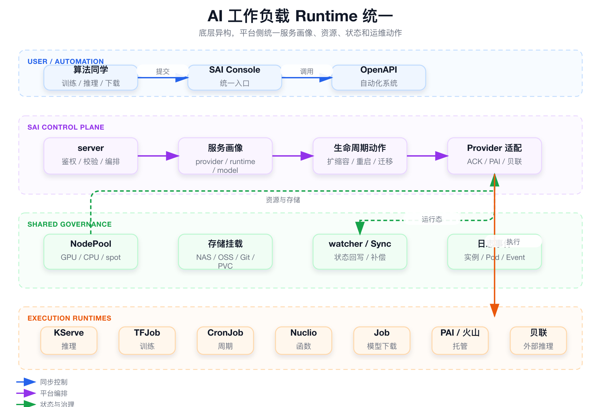

# 面试定位卡

- **技术点**：AI 工作负载 Runtime 统一治理。
- **所属领域**：AI Infra、云原生控制面、训练推理平台、平台工程。
- **面试价值**：证明你理解 SAI 的核心不是控制台 CRUD，而是把训练、推理、serverless、周期任务、模型下载和第三方托管服务收敛成一套平台运行治理语义。
- **常见考法**：Runtime 抽象和执行引擎的区别、KServe / TFJob / PAI / 贝联如何统一、为什么要 watcher / Sync、怎样避免过度抽象。
- **适合挂钩项目**：SAI-Console 统一托管 600+ 推理服务、300+ NuclioFunction、500+ TFJob、100+ FAISS Build 的运行治理入口。
- **不适合夸大的地方**：不要说自研 AI Runtime、推理引擎、训练框架或替代 KServe / Kubeflow；准确说法是平台侧 Runtime 治理抽象。

# 三十秒回答

> SAI 里的 Runtime 统一不是自研一个训练或推理引擎，而是平台侧的运行治理抽象。底层可以是 KServe、TFJob、Nuclio、Kubernetes Job、PAI、火山或贝联，SAI 把它们收敛成统一服务画像、资源池、存储挂载、生命周期动作、日志事件和状态同步。它解决的是用户入口分散、状态口径不一致、多底座难治理的问题；代价是抽象层必须保持边界，不能假装所有底层能力完全一样。

# 为什么需要它

- **没有它之前的问题**：训练、推理、serverless、周期任务、模型下载和第三方托管服务各有入口、对象、状态、日志和资源选择。
- **它的解决方式**：用统一 Runtime 画像和生命周期语义包住不同底座，把差异下沉到 provider / adapter / watcher / Sync。
- **它引入的新问题**：抽象层会遇到底层能力不一致、状态语义不一致、长周期任务不能强一致等问题。
- **必须关注的场景**：新增 Runtime、跨云托管、训练推理资源治理、模型制品挂载、状态漂移补偿、平台统一排障。

# 核心概念表

- **Runtime 治理抽象**
  - 解释：平台对训练、推理、任务、函数和托管服务的统一运行语义。
  - 面试展开点：它不是执行引擎，而是统一入口、状态、资源、存储和运维动作。

- **底层执行底座**
  - 解释：KServe、TFJob、Nuclio、Kubernetes Job、PAI、火山、贝联等真实执行系统。
  - 面试展开点：SAI 复用成熟底座，不替代它们。

- **服务画像**
  - 解释：用 `cloud_provider`、`serve_runtime`、`model_format`、`node_pool`、存储挂载等字段描述不同工作负载。
  - 面试展开点：让用户面对稳定平台语义，而不是底层 CRD 或厂商 API。

- **生命周期动作**
  - 解释：创建、发布、扩缩容、重启、停止、迁移、日志、事件、实例查询等共同动作。
  - 面试展开点：同一个动作在不同底座上的实现可能完全不同。

- **watcher / Sync**
  - 解释：watcher 负责及时事件回写，Sync 负责定时补偿和外部平台状态修复。
  - 面试展开点：AI 工作负载通常是最终一致，不是 API 返回就完成。

# 原理模型



## 用户入口层

- Console、OpenAPI 和自动化系统只面对统一的服务、任务、实例、资源池和日志事件语义。
- 算法同学不需要分别理解 KServe、TFJob、PAI、贝联和 Nuclio 的底层对象。

## 平台控制面层

- server 负责鉴权、参数校验、元数据写入、期望状态和底层适配调用。
- provider / adapter 把统一语义翻译成不同底座的 API 或 Kubernetes 对象。

## 异步治理层

- watcher 监听 TFJob、Job、Pod、Nuclio、服务实例等运行态变化。
- Sync 周期性补偿外部平台状态、丢事件和 watcher 重启后的状态漂移。

## 执行面层

- KServe、TFJob、CronJob、Nuclio、Kubernetes Job、PAI、火山、贝联承接真实工作负载。
- SAI 不接管推理内核、训练框架或云厂商托管平台内部调度。

# 关键机制

## 上层语义稳定，底层差异适配

- **解决的问题**：如果控制台直接绑定每个底座对象，上层流程会随着 CRD、厂商 API 和状态模型频繁变化。
- **工作方式**：用户侧固定为服务画像、资源池、存储挂载、生命周期动作和观测入口；底层差异集中到 provider / adapter。
- **代价**：抽象不能过度，低频厂商特性需要保留扩展字段或专有操作。
- **面试追问**：新增一个 Runtime 时，为什么不需要重做整套控制台？

## 生命周期从同步 API 拆到异步状态层

- **解决的问题**：训练、模型下载、迁移、外部托管服务变更都不是一次 HTTP 请求能完成。
- **工作方式**：server 写入期望状态并触发执行；watcher / Sync 回写真实状态；Job Runtime 承接长耗时制品任务。
- **代价**：平台状态是最终一致，需要处理短时间的期望状态和真实状态不一致。
- **面试追问**：API 返回成功是否代表服务已经 Running？

## 资源和存储作为公共治理能力

- **解决的问题**：训练、推理、模型下载各自配置资源和存储，会导致资源误用、路径混乱、成本难统计。
- **工作方式**：NodePool / ResourceGroup、NAS / OSS / PVC / Git / 模型挂载在多类 Runtime 中复用。
- **代价**：资源池和存储路径要有准入、权限、容量和清理规则。
- **面试追问**：为什么 Runtime 统一离不开资源和存储统一？

# 横向对比

- **SAI Runtime 治理 vs 自研 Runtime**
  - 区别：SAI 是平台治理层，自研 Runtime 是执行引擎。
  - 什么时候用：面试讲 SAI 时只能说统一运行治理，不能说自研训练或推理框架。
  - 面试注意点：底层仍复用 KServe、TFJob、PAI、火山、贝联等能力。

- **SAI vs Kubernetes Portal**
  - 区别：Portal 只是暴露对象表单，SAI 要抽象服务画像、资源池、生命周期、状态和排障入口。
  - 什么时候用：解释为什么算法同学不直接填 CRD 或 YAML。
  - 面试注意点：重点讲治理语义，不要停在 CRUD。

- **watcher vs Sync**
  - 区别：watcher 及时但可能丢事件；Sync 慢但能补偿。
  - 什么时候用：AI 长周期状态治理需要两者互补。
  - 面试注意点：最终一致性是设计选择，不是缺陷。

# 典型业务场景

- **统一推理服务托管**
  - 为什么相关：ACK/KServe、PAI、火山、贝联都可能承接推理服务。
  - 可能现象：服务状态、实例、日志和规格在不同底座中语义不同。
  - 排查方式：先看平台期望状态，再查 provider 返回的底层状态和实例日志。
  - 优化方向：Provider 适配收敛差异，底层状态保留用于排障。

- **训练任务和周期任务统一入口**
  - 为什么相关：TFJob、CronJob、Job 生命周期比普通 Web 服务长。
  - 可能现象：API 返回成功，但任务仍在 Pending / Running / Failed。
  - 排查方式：看 Job / Pod / TFJob 状态、事件和平台 Sync 结果。
  - 优化方向：把同步 API 和运行态回写解耦。

- **模型制品进入平台**
  - 为什么相关：模型下载、落盘和挂载是训练推理复用的基础。
  - 可能现象：模型路径不统一、下载失败、挂载失败。
  - 排查方式：查 model job、Kubernetes Job、Pod 日志和 PVC / NAS 路径。
  - 优化方向：用 Job Runtime 和共享存储路径治理模型制品。

# 排障路径

- **症状**：用户看到服务长时间停留在创建中。
- **初始假设**：同步 API 已成功，但底层 Runtime 未 Ready，或 watcher / Sync 未回写真实状态。
- **验证命令**：

```bash
kubectl get pod -A | grep <service-name>
kubectl get events -A | grep <service-name>
kubectl get job -A | grep <job-name>
```

这组命令用于验证什么：

- 底层对象是否创建成功。
- Pod / Job 是否 Pending、Failed 或 ImagePullBackOff。
- 是否有调度、镜像、权限或存储挂载事件。

重点看什么：

- 平台期望状态和底层真实状态是否一致。
- watcher / Sync 是否有延迟或失败。
- provider 是否返回了厂商侧错误。

异常说明什么：

- API 成功但对象不存在：编排或 provider 调用失败。
- 对象存在但未 Ready：看调度、镜像、资源、存储和事件。
- 对象已 Ready 但平台未更新：看 watcher / Sync 状态补偿。

# 风险、边界和误区

- **说法 / 做法**：SAI 自研了 AI Runtime。
  - 问题：容易把平台治理层夸大成执行引擎。
  - 更稳妥的表达：SAI 做平台侧 Runtime 治理，底层复用成熟执行底座。

- **说法 / 做法**：统一抽象可以完全抹平所有底座差异。
  - 问题：厂商能力、状态语义、日志入口和规格模型不可能完全一致。
  - 更稳妥的表达：高频主流程统一，低频特有能力保留扩展。

- **说法 / 做法**：数据库状态就是服务真实状态。
  - 问题：AI 工作负载运行周期长，真实状态来自底层 Runtime。
  - 更稳妥的表达：平台同时管理期望状态和真实状态，通过 watcher / Sync 最终收敛。

# 和项目的安全连接

## 了解型说法

我理解 SAI 的核心抽象是把异构 AI 工作负载收敛成统一 Runtime 治理语义，而不是替代底层训练或推理引擎。

## 排查型说法

遇到服务状态不一致，我会先拆开看：平台期望状态、底层真实对象、watcher 事件、Sync 补偿和用户可见状态分别是什么。

## 实践型说法

我参与的是控制面、生命周期、资源和状态治理相关工作，可以讲清楚为什么需要 provider / adapter、watcher / Sync、Job Runtime 和统一资源池。

## 不能说的话

- 不能说自研 AI Runtime。
- 不能说替代 KServe / Kubeflow。
- 不能说所有底层能力都被完全统一。
- 不能说 API 返回成功等于任务完成。

# 面试追问树

```text
Q1：SAI 的 Runtime 统一到底统一了什么？
  └── Q2：为什么不是 Kubernetes Portal？
        └── Q3：底层 KServe / TFJob / PAI 差异怎么处理？
              └── Q4：状态为什么需要 watcher + Sync？
                    └── Q5：新增 Runtime 会改哪些层？
                          └── Q6：哪些能力不能说成你们自研？
```

# 高频 Q&A

## 你们是不是自研了 AI Runtime？

不是。这里的 Runtime 是平台侧运行治理抽象，不是训练框架或推理引擎。底层仍然复用 KServe、Training Operator、Kubernetes Job、PAI、火山、贝联等能力。

## 和 KServe / Kubeflow 是什么关系？

KServe / Kubeflow 更偏底层执行和 CRD 能力，SAI 更偏公司内部统一控制面。SAI 把这些底座接入统一入口，统一资源、状态、日志、事件和运维动作。

## 为什么不让算法同学直接用底层平台？

直接使用底层平台会让用户面对多套对象、权限、资源池、日志、状态和厂商差异。SAI 的价值是把这些治理能力收口。

## 新增一个 Runtime 难在哪里？

难点不是多调一个 API，而是服务画像、资源规格、状态映射、日志事件、实例查询、生命周期动作和失败语义都要对齐。

## 统一抽象会不会过度？

会有这个风险。合理做法是主流程统一，特有能力保留扩展字段或专有操作，不能为了统一牺牲底层真实能力。

## API 返回成功代表什么？

通常只代表请求被接受、元数据写入或底层对象创建成功，不代表训练完成或服务 Ready。真实运行态需要 watcher / Sync 回写。

## SAI 的平台价值在哪里？

把多类 AI 工作负载的入口、资源、存储、生命周期、状态和排障统一起来，让算法用户不用直接面对多个底座。

## 怎么讲指标和规模更安全？

可以讲简历口径里的托管规模，例如推理服务、NuclioFunction、TFJob、FAISS Build 的数量，但不要把规模包装成自研执行引擎能力。

# 三档背诵版

## 三十秒版

SAI 的 Runtime 统一是平台治理抽象，不是自研执行引擎。它把 KServe、TFJob、Nuclio、Job、PAI、火山、贝联等底座收敛成统一服务画像、资源池、存储挂载、生命周期动作和状态同步。

## 三分钟版

AI 工作负载形态很多，推理、训练、周期任务、serverless、模型下载和第三方托管服务的对象、状态、日志和资源模型都不同。SAI 通过统一 Runtime 语义稳定用户入口，底层差异下沉到 provider / adapter。长周期状态通过 watcher 和 Sync 最终收敛，模型下载等耗时任务通过 Job Runtime 承接。这样平台能统一做资源、状态、日志、事件和运维治理。

## 五分钟版

我会先强调边界：SAI 不是自研训练框架或推理引擎，而是运行治理层。底层仍然复用 KServe、TFJob、Nuclio、Kubernetes Job、PAI、火山、贝联等能力。SAI 的难点是定义稳定的服务画像和生命周期语义，并处理多底座的状态不一致、资源模型不一致、日志事件不一致和长周期任务。它的工程价值是把异构 AI 工作负载纳入统一控制面，让后续多云、GPU 资源池、模型制品、状态补偿和平台排障都能复用同一套治理能力。

# 图示清单

| 图片 | 对应章节 | 目的 | 优先级 |
|---|---|---|---|
| `assets/01_runtime_unification.png` | 原理模型 | 展示 SAI 统一入口、控制面、异步治理层和底层执行面 | P0 |

# 面试前检查清单

- [ ] 我能说清 Runtime 统一不是自研执行引擎。
- [ ] 我能解释为什么 SAI 不是普通 Kubernetes Portal。
- [ ] 我能说出 provider / adapter、watcher / Sync、Job Runtime 的职责。
- [ ] 我能解释期望状态和真实状态的区别。
- [ ] 我能说出哪些内容不能夸大。
