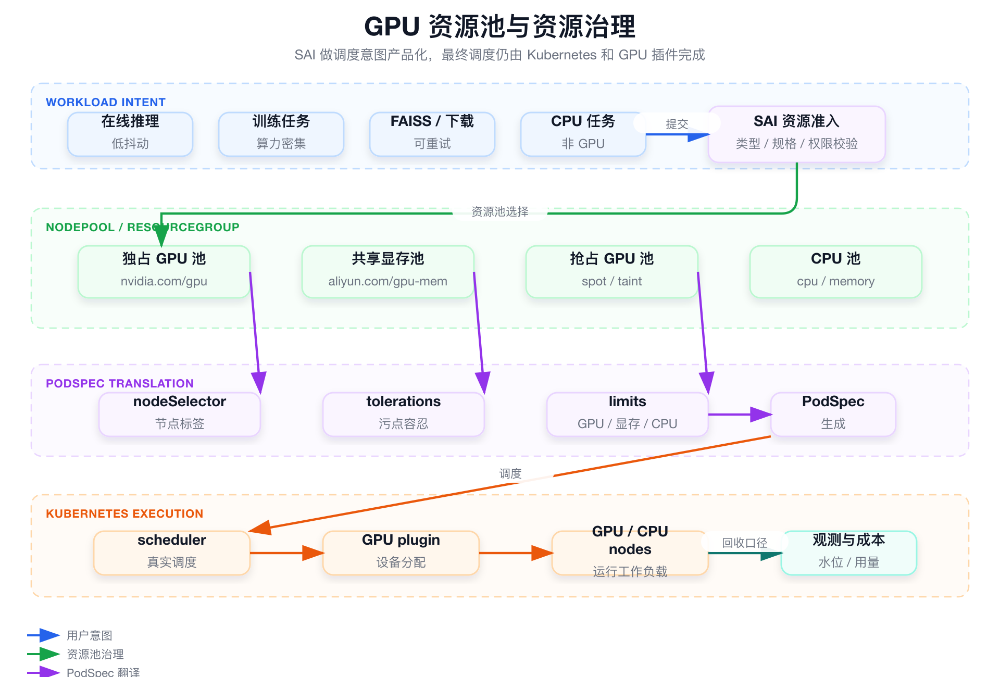

# 面试定位卡

- **技术点**：GPU 资源池与调度意图治理。
- **所属领域**：AI Infra、GPU 资源治理、Kubernetes 调度、平台工程。
- **面试价值**：证明你理解 GPU 不是一个 `limits` 字段，而是高成本资源的产品化准入、隔离、调度意图翻译和后续容量运营。
- **常见考法**：NodePool 和 nodeSelector 的关系、共享显存和独占 GPU 区别、抢占资源怎么讲、为什么不是自研 GPU Scheduler。
- **适合挂钩项目**：SAI-Console 中在线推理、训练、FAISS、模型下载等多类任务对 GPU / CPU / 抢占资源的统一选择和准入。
- **不适合夸大的地方**：不要说自研 GPU Scheduler、GPU 插件、显存隔离、MIG 管理或抢占调度；准确说法是平台侧资源池抽象和 PodSpec 生成。

# 三十秒回答

> SAI 的 GPU 资源治理不是自研调度器，而是把底层 GPU 节点、资源组、共享显存、抢占池和 CPU 池抽象成用户可选择的 NodePool / ResourceGroup。用户选择资源池后，控制面把调度意图翻译成 `nodeSelector`、`tolerations` 和 container `limits`，最终仍由 Kubernetes scheduler、节点标签、污点容忍和 GPU 插件完成真实调度。它解决的是资源误用、在线离线混用、用户直接填底层字段和后续容量成本难治理的问题。

# 为什么需要它

- **没有它之前的问题**：用户直接填写节点标签、污点、GPU 字段和厂商资源字段，容易误用在线资源，成本和容量也难统计。
- **它的解决方式**：用 NodePool / ResourceGroup 表达稳定 GPU、共享显存、抢占 GPU、CPU 等业务语义。
- **它引入的新问题**：资源池元数据要持续维护，准入规则要跟工作负载类型和底层插件能力匹配。
- **必须关注的场景**：在线推理稳定池、训练算力池、小模型共享显存、离线任务抢占池、多云 GPU 字段差异。

# 核心概念表

- **NodePool**
  - 解释：平台侧资源池语义，背后映射到节点标签、污点容忍和资源类型。
  - 面试展开点：用户选资源池，不直接写 `nodeSelector`。

- **ResourceGroup**
  - 解释：对接云厂商或外部托管平台资源组的资源口径。
  - 面试展开点：多云资源不一定都能用同一套 Kubernetes 字段表达。

- **独占 GPU**
  - 解释：通常通过 `nvidia.com/gpu` 申请整卡。
  - 面试展开点：适合稳定在线推理、训练和隔离要求高的任务。

- **共享显存**
  - 解释：通过厂商 GPU 插件暴露的显存粒度资源表达，例如 `aliyun.com/gpu-mem`。
  - 面试展开点：提升小模型利用率，但隔离性和性能稳定性不如整卡。

- **抢占资源池**
  - 解释：把可抢占或低优先级资源作为独立资源池治理。
  - 面试展开点：平台表达资源语义，真实抢占能力依赖底层集群或云厂商。

# 原理模型



## 用户入口层

- 用户选择任务类型、资源池、GPU 规格、显存规格、副本数和 CPU / memory。
- 用户不直接填写节点标签、污点容忍和厂商插件字段。

## 平台资源语义层

- NodePool / ResourceGroup 表达稳定池、共享池、抢占池和 CPU 池。
- 准入规则根据工作负载类型限制可选资源池。

## PodSpec 翻译层

- 控制面把资源池选择转换成 `nodeSelector`、`tolerations` 和 container `limits`。
- 独占 GPU、共享显存和 CPU 资源不能随意混用。

## Kubernetes 调度层

- scheduler 根据标签、污点容忍和资源申请做真实调度。
- GPU 插件负责设备或显存资源分配。

# 关键机制

## 资源池是业务语义，不是节点列表

- **解决的问题**：直接暴露节点列表会让用户依赖人工经验，资源治理不可持续。
- **工作方式**：平台维护资源池元数据，用户只选择“稳定 GPU / 共享显存 / 抢占 GPU / CPU”等语义。
- **代价**：底层节点变更、标签变更和资源池容量变化需要同步到平台。
- **面试追问**：NodePool 和 Kubernetes nodeSelector 是什么关系？

## SAI 只翻译调度意图，不替代 scheduler

- **解决的问题**：面试里很容易把资源治理说成自研调度器。
- **工作方式**：SAI 生成 PodSpec；Kubernetes scheduler 和 GPU 插件完成真实调度和设备分配。
- **代价**：底层不可调度、资源碎片、插件异常仍需要回到 Kubernetes 事件和节点资源排查。
- **面试追问**：你们是不是自研 GPU Scheduler？

## 在线、训练、离线任务资源边界不同

- **解决的问题**：在线推理和可重试离线任务混跑会影响稳定性和成本。
- **工作方式**：在线推理优先稳定池，训练使用算力池，小模型可用共享显存，FAISS / 下载等可重试任务可用离线或抢占资源池。
- **代价**：资源池太细会增加维护成本，太粗又缺少治理能力。
- **面试追问**：共享显存和独占 GPU 怎么选？

# 横向对比

- **资源池抽象 vs 自研调度器**
  - 区别：资源池抽象负责准入和 PodSpec 生成，自研调度器负责调度决策。
  - 什么时候用：SAI 应讲前者，不讲后者。
  - 面试注意点：最终调度仍由 Kubernetes scheduler 完成。

- **独占 GPU vs 共享显存**
  - 区别：独占 GPU 隔离更强，成本更高；共享显存利用率更高，但稳定性和隔离要谨慎。
  - 什么时候用：关键在线服务或训练用独占，小模型或非核心服务可考虑共享。
  - 面试注意点：共享显存依赖厂商插件能力，不是 SAI 自研显存隔离。

- **稳定资源池 vs 抢占资源池**
  - 区别：稳定池保证在线服务质量，抢占池更适合可重试任务和成本优化。
  - 什么时候用：在线服务慎用抢占资源；离线任务可接受失败重试。
  - 面试注意点：不要说自己实现了底层抢占调度。

# 典型业务场景

- **在线推理服务选择稳定 GPU 池**
  - 为什么相关：在线服务关注稳定性、延迟和副本可用。
  - 可能现象：误选抢占池导致实例被回收或性能抖动。
  - 排查方式：看服务资源池、Pod 调度事件、节点标签和资源 limits。
  - 优化方向：准入规则限制在线服务资源池。

- **小模型使用共享显存**
  - 为什么相关：小模型整卡独占可能浪费 GPU。
  - 可能现象：利用率提升，但 P99 或显存隔离风险增加。
  - 排查方式：看 GPU 插件资源字段、Pod limits、服务延迟和错误率。
  - 优化方向：只对适合的小模型开放共享池。

- **模型下载或 FAISS 任务使用离线资源**
  - 为什么相关：这类任务可重试，不应占用在线稳定池。
  - 可能现象：离线任务抢占在线资源，影响推理服务。
  - 排查方式：检查任务类型和 NodePool 准入规则。
  - 优化方向：建立工作负载类型到资源池的白名单。

# 排障路径

- **症状**：Pod 一直 Pending。
- **初始假设**：资源池翻译后的 selector / toleration / limits 与集群真实资源不匹配。
- **验证命令**：

```bash
kubectl describe pod <pod-name> -n <namespace>
kubectl get node --show-labels | grep <node-pool-label>
kubectl describe node <node-name>
```

这组命令用于验证什么：

- Pod 是否因为 selector、taint、GPU 不足或插件资源不足无法调度。
- NodePool 对应的节点是否存在。
- 节点是否暴露了对应 GPU 资源字段。

重点看什么：

- `nodeSelector` 是否和节点标签匹配。
- `tolerations` 是否能容忍目标节点污点。
- `limits` 里的 GPU / 显存资源字段是否被节点支持。

异常说明什么：

- selector 不匹配：资源池元数据或 PodSpec 翻译错误。
- taint 不匹配：缺少 toleration。
- GPU 字段不存在：插件能力或资源字段配置不一致。

# 风险、边界和误区

- **说法 / 做法**：SAI 自研 GPU Scheduler。
  - 问题：SAI 只做资源池抽象和 PodSpec 生成。
  - 更稳妥的表达：真实调度由 Kubernetes scheduler 和 GPU 插件完成。

- **说法 / 做法**：共享显存等于强隔离。
  - 问题：共享显存依赖厂商插件，隔离性和稳定性要看底层实现。
  - 更稳妥的表达：共享显存适合特定小模型和成本优化场景。

- **说法 / 做法**：抢占池能力由 SAI 实现。
  - 问题：底层抢占能力依赖集群和云厂商。
  - 更稳妥的表达：SAI 把抢占资源作为平台资源池治理。

# 和项目的安全连接

## 了解型说法

我理解 GPU 治理的核心是把高成本资源从底层字段变成平台资源语义，让不同 AI 工作负载按稳定性和成本选择合适资源池。

## 排查型说法

遇到 Pod Pending，我会从 SAI 资源池选择一路追到 PodSpec、节点标签、污点容忍、GPU limits 和 Kubernetes 事件。

## 实践型说法

我可以安全讲资源池抽象、准入校验、PodSpec 生成和在线/离线资源隔离，不能讲自研调度器。

## 不能说的话

- 不能说自研 GPU Scheduler。
- 不能说自研 GPU 插件。
- 不能说自研显存隔离。
- 不能说实现了底层抢占调度。

# 面试追问树

```text
Q1：为什么 GPU 要做资源池治理？
  └── Q2：NodePool 如何落到 Kubernetes 调度字段？
        └── Q3：共享显存和独占 GPU 怎么选？
              └── Q4：抢占资源池适合什么任务？
                    └── Q5：Pod Pending 怎么排查？
                          └── Q6：为什么不能说自研 GPU Scheduler？
```

# 高频 Q&A

## 你们是不是自研 GPU Scheduler？

不是。SAI 做的是资源池抽象、准入校验和 PodSpec 生成，真实调度由 Kubernetes scheduler、节点标签、污点容忍和 GPU 插件完成。

## NodePool 和 nodeSelector 是什么关系？

NodePool 是平台语义，nodeSelector 是 Kubernetes 调度字段。用户选 NodePool，平台把它翻译成对应 nodeSelector、tolerations 和资源 limits。

## 共享显存适合什么场景？

适合小模型或资源利用率优化场景，但要谨慎评估隔离性、性能抖动和底层插件能力。

## 独占 GPU 适合什么场景？

适合稳定性要求高的在线推理、训练任务和对性能隔离敏感的服务。

## 抢占 GPU 怎么讲？

可以说 SAI 把抢占资源作为独立资源池治理，适合可重试任务。不要说 SAI 实现了底层抢占调度。

## 资源准入有什么价值？

它能避免 CPU 任务误选 GPU 池、离线任务误用在线池、共享显存误用于高稳定服务。

## Pod 不可调度时先看哪里？

先看 Pod event，再看 nodeSelector、tolerations、资源 limits、节点标签、节点资源和 GPU 插件资源字段。

## 资源池治理的后续价值是什么？

NodePool 可以成为配额、成本、容量水位、资源运营和多云资源对齐的基础口径。

# 三档背诵版

## 三十秒版

SAI 不自研 GPU Scheduler，而是把 GPU 独占、共享显存、抢占池和 CPU 池抽象成 NodePool / ResourceGroup。用户选择资源池，控制面翻译成 PodSpec，真实调度交给 Kubernetes scheduler 和 GPU 插件。

## 三分钟版

GPU 是高成本资源，不能让用户直接填节点标签、污点和插件字段。SAI 做的是资源池产品化和准入治理：在线服务、训练任务、FAISS、模型下载根据稳定性和成本选择不同资源池。控制面把资源池翻译成 `nodeSelector`、`tolerations` 和 `limits`。排障时要从平台资源池一路追到 Pod 事件和节点资源。

## 五分钟版

这块的边界一定要讲清楚。SAI 没有替代 Kubernetes scheduler，也没有自研 GPU 插件、显存隔离或 MIG 管理。它的价值在于把调度意图产品化，让用户用稳定 GPU、共享显存、抢占资源和 CPU 池这些业务语义来选择资源。这样既能降低用户理解底层字段的成本，也能为在线离线隔离、准入校验、容量水位、成本统计和多云资源治理打基础。

# 图示清单

| 图片 | 对应章节 | 目的 | 优先级 |
|---|---|---|---|
| `assets/02_gpu_resource_governance.png` | 原理模型 | 展示资源池抽象、PodSpec 翻译和底层调度边界 | P0 |

# 面试前检查清单

- [ ] 我能说清 SAI 不自研 GPU Scheduler。
- [ ] 我能解释 NodePool 到 PodSpec 的翻译。
- [ ] 我能区分独占 GPU、共享显存和抢占资源。
- [ ] 我能按 Pod Pending 的路径排查。
- [ ] 我知道哪些 GPU 能力不能夸大。
