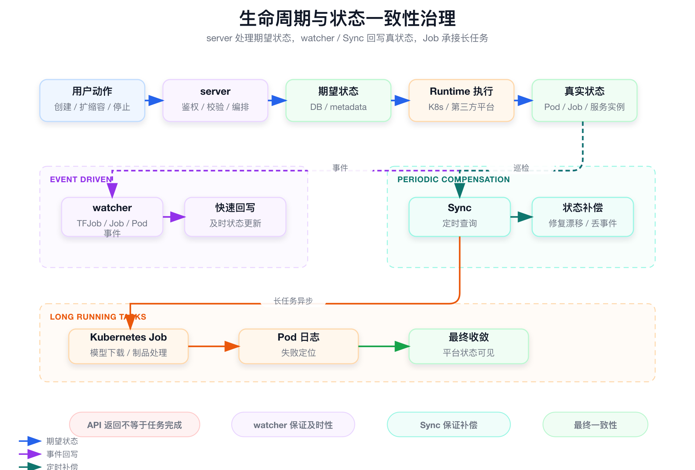

# 面试定位卡

- **技术点**：AI 工作负载生命周期与状态一致性治理。
- **所属领域**：AI Infra、云原生控制面、异步状态治理、平台稳定性。
- **面试价值**：证明你理解真实平台不是 API 调用成功就结束，而是要处理长周期任务、事件丢失、状态漂移、外部平台同步和最终一致性。
- **常见考法**：server / watcher / Sync 怎么分工、期望状态和真实状态怎么区分、watcher 挂了怎么办、为什么不能把逻辑都放 API 里。
- **适合挂钩项目**：SAI-Console 中 TFJob、CronJob、Job、模型下载、推理服务迁移和第三方托管服务的状态治理。
- **不适合夸大的地方**：不要说状态强一致、watcher 能解决所有问题、API 返回成功等于任务运行成功。

# 三十秒回答

> AI 工作负载生命周期通常很长，训练、下载、扩缩容、迁移和第三方托管服务变更都不是一次 API 能完成的。SAI 把生命周期拆成 server、watcher、Sync 和 Job Runtime：server 处理短链路编排和期望状态，watcher 监听底层事件，Sync 做定时补偿，Job Runtime 承接长耗时任务。这个设计解决状态漂移和控制面阻塞问题，代价是平台状态是最终一致，需要明确期望状态和真实状态的边界。

# 为什么需要它

- **没有它之前的问题**：API 写数据库后就返回，真实 TFJob、Pod、Job 或外部托管服务状态可能长期不一致。
- **它的解决方式**：同步控制面只写期望状态和触发动作，真实状态由 watcher / Sync 回写。
- **它引入的新问题**：状态短时间不一致，旧事件可能覆盖新操作，需要状态来源、时间和优先级规则。
- **必须关注的场景**：训练长跑、模型下载、扩缩容、停止、迁移、外部平台状态漂移、watcher 重启。

# 核心概念表

- **期望状态**
  - 解释：用户或平台希望达到的目标状态，例如创建中、停止中、目标副本数。
  - 面试展开点：由 API 写入，不等于真实运行态。

- **真实状态**
  - 解释：底层 Runtime 的当前状态，例如 Pod Running、Job Failed、TFJob Succeeded。
  - 面试展开点：由 watcher / Sync 从底层资源或外部平台回写。

- **server**
  - 解释：同步控制面，负责鉴权、校验、元数据写入和初始编排。
  - 面试展开点：不应该等待长任务完成。

- **watcher**
  - 解释：事件同步层，监听 Kubernetes 资源状态变化。
  - 面试展开点：及时但不可靠，可能重启或丢事件。

- **Sync**
  - 解释：定时补偿层，主动查询底层真实状态。
  - 面试展开点：不够实时但能修复漂移。

- **Job Runtime**
  - 解释：承接下载、制品处理等长耗时任务的 Kubernetes Job。
  - 面试展开点：控制面和执行面解耦。

# 原理模型



## 同步控制面层

- API 处理用户操作、参数校验、权限校验、元数据写入和期望状态。
- API 返回成功不代表底层工作负载已完成。

## 事件同步层

- watcher 监听 TFJob、CronJob、Job、Pod、FAISS 等资源变化。
- watcher 适合及时回写，但不能作为唯一状态来源。

## 定时补偿层

- Sync 周期性查询底层 Runtime 或第三方平台。
- 用于修复事件丢失、watcher 重启和外部平台状态漂移。

## 长任务执行层

- Kubernetes Job 执行模型下载、OSS 下载、制品上传等耗时任务。
- Job / Pod 状态和日志成为排障依据。

# 关键机制

## server 只做短链路控制面

- **解决的问题**：训练、下载、迁移、外部服务变更可能持续很久，同步等待会导致 API 超时。
- **工作方式**：server 写入期望状态并触发底层执行，后续由 watcher / Sync 回写真状态。
- **代价**：用户需要通过状态查询观察后续进度。
- **面试追问**：API 返回成功是不是代表任务成功？

## watcher 保证及时性，Sync 保证补偿

- **解决的问题**：事件监听及时但可能丢；定时查询可靠但不实时。
- **工作方式**：watcher 快速回写事件，Sync 周期性查询真实状态，二者互补。
- **代价**：状态不是强一致，补偿频率要平衡实时性和外部 API 成本。
- **面试追问**：watcher 挂了怎么办？

## 区分期望状态和真实状态

- **解决的问题**：用户刚发起扩缩容时，真实状态还没变化；旧事件可能覆盖新操作。
- **工作方式**：操作写期望状态，底层回写真状态，状态更新要考虑来源、时间和优先级。
- **代价**：状态模型更复杂，但能解释“操作中”和“运行态”短时间不一致。
- **面试追问**：数据库状态和真实状态冲突怎么办？

# 横向对比

- **同步 API vs 异步状态治理**
  - 区别：同步 API 适合短操作，异步治理适合长周期运行态。
  - 什么时候用：训练、下载、迁移、扩缩容都应走异步状态收敛。
  - 面试注意点：不要把 API 成功等同于运行成功。

- **watcher vs Sync**
  - 区别：watcher 快，Sync 稳。
  - 什么时候用：watcher 做实时感知，Sync 做兜底修复。
  - 面试注意点：二者是互补关系，不是替代关系。

- **期望状态 vs 真实状态**
  - 区别：期望状态来自用户操作，真实状态来自底层 Runtime。
  - 什么时候用：处理状态冲突、操作中、回滚和失败展示。
  - 面试注意点：不能只靠一个数据库字段承载所有语义。

# 典型业务场景

- **TFJob 长时间运行**
  - 为什么相关：训练任务可能持续数小时。
  - 可能现象：平台显示 Running，但底层某个 worker Failed。
  - 排查方式：查 TFJob status、Pod status、events、logs 和 Sync 回写时间。
  - 优化方向：保留底层状态和失败原因。

- **模型下载 Job 失败**
  - 为什么相关：下载依赖网络、认证、磁盘和源站。
  - 可能现象：API 创建成功，但 Job Pod Failed。
  - 排查方式：查 Job、Pod exit code、Pod log、PVC / NAS 路径。
  - 优化方向：任务状态关联 Job / Pod 日志，并支持重试。

- **第三方托管服务状态漂移**
  - 为什么相关：外部平台不一定主动回调 SAI。
  - 可能现象：外部服务已停止，但 SAI 仍显示运行。
  - 排查方式：查 provider 查询结果、最后同步时间和平台状态。
  - 优化方向：定时 Sync 补偿，并展示外部原始状态。

# 排障路径

- **症状**：平台状态和真实运行态不一致。
- **初始假设**：watcher 丢事件、Sync 延迟、外部平台漂移，或旧事件覆盖了新操作。
- **验证命令**：

```bash
kubectl get job,pod -n <namespace>
kubectl describe pod <pod-name> -n <namespace>
kubectl get events -n <namespace> --sort-by=.lastTimestamp
```

这组命令用于验证什么：

- 底层对象真实状态。
- 最近是否有调度、镜像、存储、权限、退出码异常。
- 平台状态是否滞后于底层状态。

重点看什么：

- API 操作时间和底层事件时间。
- watcher / Sync 最近回写时间。
- 状态来源是否来自旧事件。

异常说明什么：

- 底层已成功但平台未更新：watcher / Sync 可能异常。
- 平台显示成功但底层 Failed：状态映射或回写逻辑需要检查。
- 状态反复跳变：期望状态和真实状态冲突处理可能有问题。

# 风险、边界和误区

- **说法 / 做法**：watcher 能保证状态强一致。
  - 问题：watcher 会重启、断连、丢事件。
  - 更稳妥的表达：watcher 保证及时性，Sync 保证补偿。

- **说法 / 做法**：API 返回成功就是任务完成。
  - 问题：长周期任务只是被接收或已触发。
  - 更稳妥的表达：真实完成要看底层状态回写。

- **说法 / 做法**：一个 status 字段就能表达完整生命周期。
  - 问题：期望状态、真实状态、操作中状态和底层原始状态语义不同。
  - 更稳妥的表达：状态模型要区分来源和优先级。

# 和项目的安全连接

## 了解型说法

我理解 AI 工作负载生命周期管理的难点在于长周期和多状态源，不是简单写数据库字段。

## 排查型说法

遇到状态不一致，我会从用户操作时间、平台期望状态、底层真实状态、watcher 事件和 Sync 补偿五个角度排查。

## 实践型说法

我可以安全讲 server / watcher / Sync / Job Runtime 的分层，以及为什么状态最终一致比同步等待更适合 AI 工作负载。

## 不能说的话

- 不能说状态强一致。
- 不能说 watcher 永远可靠。
- 不能说 API 成功等于任务成功。
- 不能说外部平台状态一定实时。

# 面试追问树

```text
Q1：为什么 AI 工作负载不能只靠同步 API？
  └── Q2：server / watcher / Sync 怎么分工？
        └── Q3：期望状态和真实状态怎么区分？
              └── Q4：watcher 挂了怎么办？
                    └── Q5：状态冲突怎么处理？
                          └── Q6：怎么排查状态漂移？
```

# 高频 Q&A

## API 返回成功代表什么？

通常代表请求被接收、元数据写入或底层对象创建成功，不代表训练完成、下载完成或服务 Ready。

## watcher 挂了怎么办？

watcher 不能作为唯一状态来源。事件驱动负责及时性，Sync 或巡检负责补偿。

## 为什么不把逻辑都放 API 里？

API 适合短链路控制，不适合等待训练完成、下载完成、Pod 生命周期变化和外部平台状态同步。

## 数据库状态和真实状态冲突怎么办？

要看状态来源、操作时间和优先级。用户操作更新期望状态，watcher / Sync 更新真实状态，不能让旧事件覆盖新操作。

## Sync 会不会太慢？

Sync 本来就不是实时机制，它是补偿机制。实时性由 watcher 提供，可靠性由 Sync 兜底。

## 为什么状态是最终一致？

因为底层 Runtime、Kubernetes 和第三方平台都在异步变化，平台很难在一次请求里拿到最终结果。

## Job Runtime 在这里解决什么？

它把下载和制品处理这类长耗时任务从 server 进程里剥离出来，提供独立资源、状态和日志。

## 状态排障最重要看什么？

看期望状态、真实状态、最后同步时间、底层事件和日志，尤其要确认状态来源和时间顺序。

# 三档背诵版

## 三十秒版

SAI 的生命周期治理把同步 API 和异步运行态拆开。server 只做短链路编排，watcher 回写事件，Sync 做补偿，Job Runtime 承接长耗时任务。状态是最终一致，不是 API 返回就完成。

## 三分钟版

AI 工作负载生命周期长，状态来源多。用户操作写入期望状态，底层 Runtime 产生真实状态。watcher 能及时感知 Kubernetes 资源变化，但可能丢事件；Sync 通过定时查询修复漂移。模型下载等长任务用 Kubernetes Job 执行，server 不直接下载。这个设计让控制面稳定，同时保证平台状态最终接近真实运行态。

## 五分钟版

这块最能体现平台工程能力。普通 CRUD 系统可能只写一个数据库状态，但 AI 平台面对的是 TFJob、Pod、Job、外部托管服务、用户操作和定时任务多种状态源。SAI 需要区分期望状态和真实状态，处理事件丢失、旧事件覆盖新操作、外部平台不回调、长任务失败重试等问题。面试时要强调最终一致和补偿机制，而不是夸大成强一致系统。

# 图示清单

| 图片 | 对应章节 | 目的 | 优先级 |
|---|---|---|---|
| `assets/03_lifecycle_state_consistency.png` | 原理模型 | 展示 server、watcher、Sync、Job Runtime 的状态治理分层 | P0 |

# 面试前检查清单

- [ ] 我能区分期望状态和真实状态。
- [ ] 我能解释 server、watcher、Sync、Job Runtime 的职责。
- [ ] 我能说明为什么 API 返回成功不等于运行成功。
- [ ] 我能按状态漂移路径排查。
- [ ] 我不会把最终一致说成强一致。
