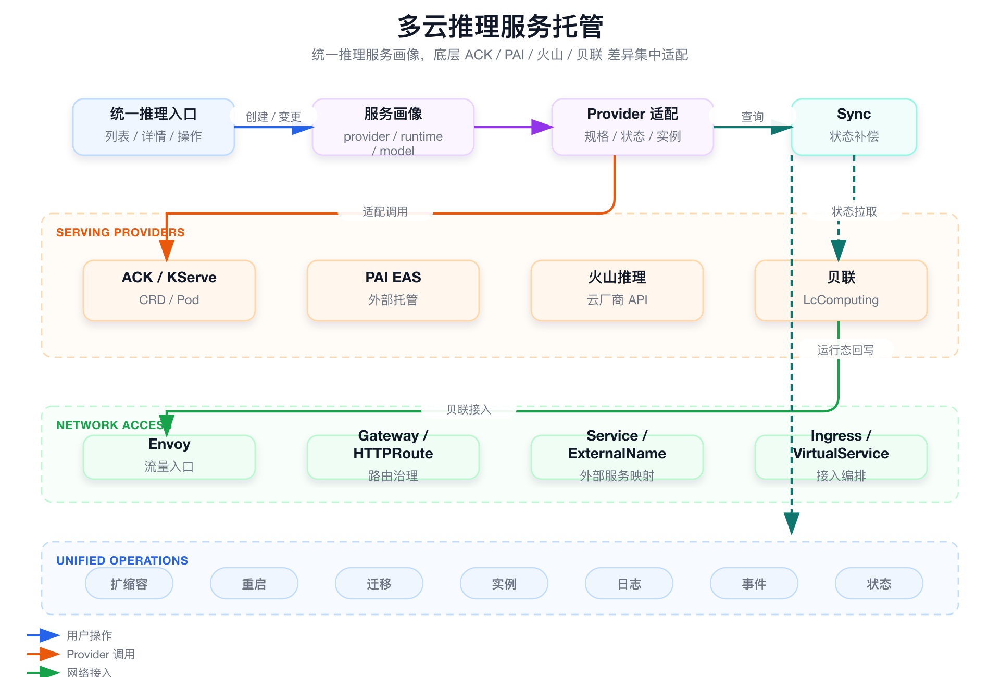

# 面试定位卡

- **技术点**：多云推理服务托管与 Provider 抽象。
- **所属领域**：AI Serving、多云控制面、平台工程、云原生网络。
- **面试价值**：证明你理解多云托管不是“接几个厂商 API”，而是统一服务画像、规格、状态、实例、日志、扩缩容、网络接入和错误语义。
- **常见考法**：新增厂商为什么能快、多云抽象会不会过度、状态怎么同步、贝联网络接入是不是你们自研。
- **适合挂钩项目**：SAI-Console 统一托管 ACK/KServe、PAI EAS、火山、贝联等不同推理服务形态。
- **不适合夸大的地方**：不要说自研多云推理引擎、自研贝联底层网络、完全抹平厂商差异或状态强一致。

# 三十秒回答

> 多云推理托管的难点不是调用几个厂商 API，而是把 ACK/KServe、PAI、火山、贝联等不同托管形态收敛成统一推理服务语义。SAI 对上稳定服务画像、实例、日志、扩缩容、重启、迁移和状态，对下用 Provider / adapter 处理厂商 API、规格、资源组、状态和网络接入差异。它解决用户多平台切换和运维入口分散问题；代价是不能强行抹平所有厂商特有能力，状态也只能通过 Sync 做最终一致。

# 为什么需要它

- **没有它之前的问题**：推理服务分散在 ACK、PAI、火山、贝联等平台，用户要理解多套规格、状态、日志和网络入口。
- **它的解决方式**：上层统一推理服务语义，底层差异集中到 Provider / adapter 和状态同步层。
- **它引入的新问题**：厂商能力不一致，状态定义不同，网络接入路径不同，错误语义也不同。
- **必须关注的场景**：新增厂商、贝联接入、跨云迁移、外部状态漂移、统一实例和日志查询。

# 核心概念表

- **推理服务画像**
  - 解释：模型、镜像、runtime、provider、model format、资源组和状态的统一描述。
  - 面试展开点：用户面对统一服务，不面对厂商 API。

- **Provider / adapter**
  - 解释：底层厂商或托管平台的适配层。
  - 面试展开点：创建、规格、实例、日志、扩缩容和状态查询差异都在这里处理。

- **状态映射**
  - 解释：把 Running、Ready、Deploying、Stopped、Error 等厂商状态映射成平台状态。
  - 面试展开点：保留底层原始状态用于排障。

- **网络接入**
  - 解释：通过 Envoy、Gateway、Service、ExternalName、Ingress、HTTPRoute、VirtualService 等基础设施打通访问路径。
  - 面试展开点：平台做编排和治理，不自研底层网络。

- **Sync**
  - 解释：周期性查询外部平台真实状态并回写 SAI。
  - 面试展开点：多云状态通常是最终一致。

# 原理模型



## 用户入口层

- SAI-Console / API 提供统一服务列表、详情、实例、日志、事件、扩缩容、重启和迁移入口。
- 用户不需要分别登录 ACK、PAI、火山、贝联控制台。

## 服务语义层

- 用统一 service profile 描述 provider、runtime、model format、资源组、实例和状态。
- 上层流程保持稳定，不绑定单一厂商对象模型。

## Provider 适配层

- ACK / KServe、PAI、火山、贝联 adapter 处理底层 API、状态、规格和日志差异。
- 新增厂商主要扩展适配层，而不是重写用户主流程。

## 网络和状态层

- 网络接入复用 Envoy / Gateway / Service / ExternalName 等基础设施。
- 外部状态通过 Sync 或 provider query 回写平台。

# 关键机制

## 上层服务语义保持稳定

- **解决的问题**：厂商 API 和对象模型变化会污染控制台和用户流程。
- **工作方式**：上层只抽象服务、实例、规格、日志、事件、扩缩容、重启、迁移等共同动作。
- **代价**：低频厂商特有能力不能强行统一，需要保留扩展。
- **面试追问**：多云抽象会不会过度？

## Provider 适配处理底层差异

- **解决的问题**：不同平台的服务创建、规格映射、实例查询、扩缩容、日志和错误码都不同。
- **工作方式**：Provider 将厂商能力转换成平台共同能力集合。
- **代价**：Provider 要明确 capability，不能假设所有厂商都支持同样动作。
- **面试追问**：新增一个厂商为什么能快？

## 外部状态用 Sync 做最终一致

- **解决的问题**：外部托管平台状态不一定主动回调 SAI。
- **工作方式**：用户操作写期望状态，Sync 周期性查询真实状态并回写。
- **代价**：状态有延迟，外部 API 成本和限流需要考虑。
- **面试追问**：多云状态怎么保证一致？

## 贝联网络接入复用基础设施

- **解决的问题**：外部推理服务访问路径和 ACK 内部服务不同。
- **工作方式**：平台复用 Envoy / Gateway / Service / ExternalName / Ingress / HTTPRoute 等能力做接入编排。
- **代价**：底层网络、路由、安全组、DNS、TLS 仍依赖基础设施能力。
- **面试追问**：贝联网络是不是你们实现了底层网络？

# 横向对比

- **多云 Provider 抽象 vs API 薄转发**
  - 区别：Provider 抽象要统一语义和状态，薄转发只是封装接口。
  - 什么时候用：面试讲多云平台能力时，要讲规格、状态、日志、实例、网络和错误映射。
  - 面试注意点：不要只说“调了厂商 API”。

- **通用能力 vs 厂商特有能力**
  - 区别：通用能力进入主流程，厂商特性通过扩展字段或专有操作保留。
  - 什么时候用：避免过度抽象。
  - 面试注意点：统一不是消灭差异。

- **平台网络编排 vs 自研底层网络**
  - 区别：平台编排已有基础设施对象，自研网络要实现底层连通能力。
  - 什么时候用：贝联接入只能讲前者。
  - 面试注意点：不要把 Envoy / Gateway / Service 的复用说成自研网络。

# 典型业务场景

- **新增一个推理托管平台**
  - 为什么相关：验证 Provider 抽象是否稳定。
  - 可能现象：创建接口能接通，但状态、日志、实例和规格无法统一。
  - 排查方式：逐项对齐 capability、状态映射、错误语义和日志入口。
  - 优化方向：明确通用能力和专有能力边界。

- **贝联推理服务接入**
  - 为什么相关：涉及外部服务、网络接入和状态同步。
  - 可能现象：平台服务存在，但流量不通或状态漂移。
  - 排查方式：查 Service / ExternalName / Gateway / Envoy、DNS、TLS、贝联入口和 Sync 状态。
  - 优化方向：复用基础设施能力，把人工接入动作平台化。

- **厂商状态和平台状态不一致**
  - 为什么相关：外部平台不一定主动通知。
  - 可能现象：厂商侧服务已失败，SAI 仍显示运行。
  - 排查方式：看最后同步时间、provider 原始状态、平台状态映射和错误信息。
  - 优化方向：Sync 补偿和底层状态透明展示。

# 排障路径

- **症状**：多云服务在 SAI 显示正常，但访问失败。
- **初始假设**：服务状态和流量入口不是同一层问题，可能是网络接入、DNS、TLS 或 provider 状态漂移。
- **验证命令**：

```bash
kubectl get svc,ingress,httproute -A | grep <service-name>
kubectl get endpointslice -A | grep <service-name>
kubectl describe svc <svc-name> -n <namespace>
```

这组命令用于验证什么：

- ACK 内接入对象是否存在。
- Service / ExternalName / EndpointSlice 是否符合预期。
- HTTPRoute / Ingress 是否指向正确 backend。

重点看什么：

- provider 原始状态是否和平台状态一致。
- 网络入口是否和服务画像绑定。
- 外部域名、端口、TLS、Host 是否匹配。

异常说明什么：

- 平台状态正常但网络对象缺失：接入编排失败。
- 网络对象存在但访问失败：DNS、TLS、安全组或外部入口问题。
- 厂商状态异常但平台正常：Sync 或状态映射延迟。

# 风险、边界和误区

- **说法 / 做法**：多云就是封装厂商 API。
  - 问题：忽略状态、规格、日志、实例和网络语义统一。
  - 更稳妥的表达：多云托管是 Provider 抽象和运行治理。

- **说法 / 做法**：平台完全抹平厂商差异。
  - 问题：不同厂商能力不可能完全一致。
  - 更稳妥的表达：主流程统一，特有能力保留。

- **说法 / 做法**：贝联网络是 SAI 自研的。
  - 问题：底层网络来自基础设施。
  - 更稳妥的表达：SAI 复用 Envoy / Gateway / Service 等能力做接入编排。

# 和项目的安全连接

## 了解型说法

我理解多云托管的本质是统一服务语义和治理入口，而不是简单 API 代理。

## 排查型说法

遇到多云服务异常，我会拆成平台状态、provider 原始状态、网络接入对象、外部入口和用户请求链路分别看。

## 实践型说法

我可以安全讲 Provider 抽象、状态同步、贝联接入编排和错误透明，不会说自研底层网络或推理引擎。

## 不能说的话

- 不能说自研多云推理引擎。
- 不能说自研贝联底层网络。
- 不能说所有厂商能力完全一致。
- 不能说状态强一致。

# 面试追问树

```text
Q1：多云推理托管统一了什么？
  └── Q2：为什么不是 API 薄封装？
        └── Q3：Provider 如何处理厂商差异？
              └── Q4：状态不一致怎么办？
                    └── Q5：贝联网络接入怎么讲？
                          └── Q6：新增厂商会改哪些层？
```

# 高频 Q&A

## 新增一个厂商为什么能快？

前提是上层服务语义稳定。新增厂商主要适配创建、规格、状态、实例、扩缩容、重启、日志、资源组和网络接入，上层主流程不需要大改。

## 多云抽象会不会过度？

会有风险。合理做法是高频主流程统一，厂商特有能力通过扩展字段或专有操作保留。

## 贝联网络是不是你们实现了底层网络？

不是。SAI 做的是接入编排和治理，复用 Envoy、Gateway、Service、ExternalName 等基础设施能力。

## 多云状态怎么保证一致？

用户操作写期望状态，Sync 或 provider query 查询真实状态并回写平台。这是最终一致，不是强一致。

## Provider 里最难的是什么？

状态映射、规格映射、日志事件入口、错误语义和能力边界，比单纯调用创建 API 更难。

## 平台为什么要保留厂商原始状态？

因为平台归一化状态适合用户理解，但排障时需要看到底层真实错误和厂商状态。

## 网络接入失败怎么排？

先看平台服务画像和 provider 状态，再看 Service / ExternalName / Gateway / HTTPRoute / Envoy，最后看 DNS、TLS、安全组和外部入口。

## 多云托管和 SAI Runtime 统一是什么关系？

多云托管是 Runtime 统一的一类落地场景，底层是不同 provider，上层仍然使用 SAI 统一服务语义。

# 三档背诵版

## 三十秒版

多云推理托管不是 API 薄封装，而是把 ACK、PAI、火山、贝联等不同托管形态统一成推理服务语义。SAI 稳定上层服务画像和运维动作，底层差异由 Provider 适配，状态通过 Sync 最终一致。

## 三分钟版

用户关心的是服务能不能用、实例是否健康、日志在哪里、能不能扩缩容和迁移，不关心底层是 ACK、PAI 还是贝联。SAI 用 Provider 抽象处理创建、规格、状态、实例和日志差异，用 Sync 补偿外部状态漂移，用 Envoy / Gateway / Service / ExternalName 等基础设施做网络接入编排。边界是平台不自研底层网络，也不完全抹平厂商差异。

## 五分钟版

这块可以体现平台抽象能力。多云不是“多写几个 client”，而是统一服务画像、资源规格、生命周期动作、实例状态、日志事件、网络入口和错误语义。新增 provider 时要先定义 capability：支持创建吗，支持扩缩容吗，日志怎么查，实例怎么列，状态怎么映射，网络怎么接。面试里要强调通用主流程统一、厂商差异保留、状态最终一致、网络能力复用基础设施。

# 图示清单

| 图片 | 对应章节 | 目的 | 优先级 |
|---|---|---|---|
| `assets/04_multi_cloud_serving.png` | 原理模型 | 展示用户入口、Provider、网络接入和状态同步关系 | P0 |

# 面试前检查清单

- [ ] 我能说清多云不是 API 薄封装。
- [ ] 我能解释 Provider / adapter 的职责。
- [ ] 我能说明贝联网络接入是复用基础设施。
- [ ] 我能讲清外部状态为什么是最终一致。
- [ ] 我不会夸大成自研多云推理引擎。
