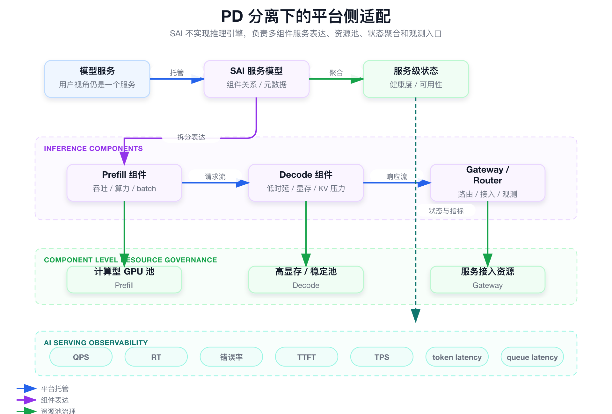

# 面试定位卡

- **技术点**：PD 分离推理形态下的平台侧运行治理适配。
- **所属领域**：AI Serving、大模型推理平台、GPU 资源治理、平台工程。
- **面试价值**：证明你理解大模型 Serving 从单工作负载走向多组件形态后，平台要适配服务建模、组件资源池、状态聚合、扩缩容和观测口径。
- **常见考法**：PD 分离是什么、Prefill / Decode 资源诉求有什么区别、平台侧能做什么、KV Cache 是否你负责、组件异常时服务状态怎么展示。
- **适合挂钩项目**：SAI-Console 将传统单推理服务扩展到 Prefill / Decode 等多组件推理服务的托管和治理思路。
- **不适合夸大的地方**：不要说自己实现了 PD 分离、KV Cache、attention、推理引擎调度、vLLM / SGLang 内核；准确说法是平台侧运行治理适配。

# 三十秒回答

> PD 分离不是我实现的推理引擎能力，我关注的是它给平台控制面带来的变化。传统推理服务通常是一个模型服务对应一个 Deployment 或托管服务；PD 分离后，一个模型服务会拆成 Prefill、Decode、Gateway / Router 等多组件。SAI 平台要解决的是多组件如何表达、不同组件如何绑定 GPU 资源池、状态如何聚合、扩缩容和观测入口如何继续统一。代价是平台不能越界到 KV Cache 和推理调度内部，只能治理运行形态。

# 为什么需要它

- **没有它之前的问题**：平台按单服务 / 单工作负载管理推理服务，无法自然表达 Prefill / Decode 多组件关系。
- **它的解决方式**：在模型服务下引入组件建模、组件级资源池、组件状态和服务级聚合视图。
- **它引入的新问题**：配置复杂度上升，状态聚合规则更难，指标从 QPS / RT 扩展到 TTFT、TPS、token latency 等 AI Serving 指标。
- **必须关注的场景**：大模型推理、Prefill / Decode 分离、组件级扩缩容、Decode 显存压力、服务级健康状态聚合。

# 核心概念表

- **PD 分离**
  - 解释：把大模型推理中的 Prefill 和 Decode 阶段拆分成不同组件或资源池治理。
  - 面试展开点：这是推理引擎和 Serving 架构能力，平台只做运行治理适配。

- **Prefill**
  - 解释：处理输入 prompt，计算量大，更关注吞吐、算力和 batch。
  - 面试展开点：资源池可能偏计算型 GPU。

- **Decode**
  - 解释：逐 token 生成输出，更关注低时延、显存和 KV Cache 压力。
  - 面试展开点：资源池可能偏稳定、高显存、低时延。

- **运行组件**
  - 解释：Prefill、Decode、Gateway、Router、Metrics 等组成一个模型服务的底层组件。
  - 面试展开点：用户看一个服务，平台看多个组件。

- **服务状态聚合**
  - 解释：把组件状态、实例状态、路由状态和指标聚合成用户可理解的服务健康度。
  - 面试展开点：不能隐藏关键组件异常。

- **AI Serving 指标**
  - 解释：TTFT、TPS、token latency、queue latency 等更贴近大模型推理体验的指标。
  - 面试展开点：普通 QPS / RT 不足以解释大模型体验。

# 原理模型



## 用户服务层

- 用户仍然面对一个模型服务。
- 平台要保持统一创建、扩缩容、重启、日志、事件和服务详情入口。

## 推理组件层

- 一个模型服务下可能有 Prefill、Decode、Gateway / Router 等组件。
- 组件之间的关系需要被平台元数据表达。

## 资源治理层

- Prefill 和 Decode 可以绑定不同 NodePool / ResourceGroup 和 GPU 规格。
- 资源池治理复用 SAI 的 GPU 资源能力。

## 观测和状态层

- 平台聚合组件状态、实例状态、路由状态和 AI Serving 指标。
- 底层推理引擎负责 KV Cache、request scheduling 和真实推理调度。

# 关键机制

## 平台表达多组件，不实现 PD 分离

- **解决的问题**：PD 分离涉及推理引擎内部 KV Cache、scheduler 和 attention 优化，平台不应越界。
- **工作方式**：SAI 只表达模型服务和 Prefill / Decode 组件关系，管理资源池、状态、扩缩容和观测入口。
- **代价**：平台不能回答所有推理引擎内部细节，需要明确底层由 Serving Runtime 负责。
- **面试追问**：PD 分离是不是你实现的？

## 组件级资源池治理

- **解决的问题**：Prefill 和 Decode 对算力、显存、延迟的诉求不同，不能只用一个副本数和一个资源规格表达。
- **工作方式**：组件分别绑定 NodePool / ResourceGroup、GPU 规格、副本数和资源参数。
- **代价**：配置项增加，需要避免把过多底层细节暴露给用户。
- **面试追问**：Prefill 和 Decode 的资源诉求有什么区别？

## 服务级状态聚合

- **解决的问题**：用户关心一个模型服务是否可用，但底层多个组件可能状态不一致。
- **工作方式**：平台汇总关键组件、实例、路由和指标状态，形成服务级健康度，同时保留组件明细。
- **代价**：聚合规则要谨慎，不能把 Decode 异常隐藏在整体 Healthy 里。
- **面试追问**：一个组件异常时服务状态怎么展示？

## 观测口径从普通服务扩展到 AI Serving

- **解决的问题**：QPS / RT / 错误率无法完整解释大模型推理体验。
- **工作方式**：引入 TTFT、TPS、token latency、queue latency 等方向，结合组件维度看瓶颈。
- **代价**：指标采集依赖底层 Serving Runtime 暴露能力。
- **面试追问**：为什么只看 RT 不够？

# 横向对比

- **传统单服务推理 vs PD 分离多组件推理**
  - 区别：传统服务通常一个工作负载即可表达，PD 分离需要组件关系和聚合视图。
  - 什么时候用：大模型服务需要阶段级优化时。
  - 面试注意点：平台适配的是运行形态，不是推理内核。

- **Prefill vs Decode**
  - 区别：Prefill 更偏计算吞吐，Decode 更偏低时延和 KV Cache 显存压力。
  - 什么时候用：资源池、扩缩容和指标分析时要分开看。
  - 面试注意点：不要把两个阶段的资源诉求说成一样。

- **服务级状态 vs 组件级状态**
  - 区别：服务级状态给用户看，组件级状态给排障和治理看。
  - 什么时候用：用户入口统一，但底层异常需要明细。
  - 面试注意点：聚合不能掩盖关键组件故障。

# 典型业务场景

- **大模型服务拆成 Prefill / Decode**
  - 为什么相关：单服务模型无法表达组件差异。
  - 可能现象：整体服务可见，但 Decode 延迟高或 Prefill 堵塞。
  - 排查方式：分别看组件副本、资源池、GPU 利用、TTFT、TPS 和 queue latency。
  - 优化方向：组件级资源池和扩缩容。

- **Decode 显存压力导致延迟波动**
  - 为什么相关：Decode 和 KV Cache 对显存更敏感。
  - 可能现象：token latency 上升、P99 抖动、OOM 或重启。
  - 排查方式：看 Decode 组件资源规格、显存使用、Pod 重启和底层 runtime 指标。
  - 优化方向：高显存资源池、组件扩容或底层 Runtime 优化。

- **组件状态不一致**
  - 为什么相关：用户看到的是一个服务，但底层可能部分组件异常。
  - 可能现象：Prefill 正常、Decode 异常，服务整体不可用或降级。
  - 排查方式：看服务聚合状态、组件状态、实例状态和路由状态。
  - 优化方向：明确关键组件对整体状态的影响规则。

# 排障路径

- **症状**：大模型服务整体延迟升高。
- **初始假设**：瓶颈可能在 Prefill 计算、Decode 显存 / KV Cache、路由排队或资源池不匹配。
- **验证命令**：

```bash
kubectl get pod -n <namespace> | grep <service-name>
kubectl describe pod <decode-pod> -n <namespace>
kubectl logs <component-pod> -n <namespace> --tail=200
```

这组命令用于验证什么：

- Prefill / Decode 组件是否都 Ready。
- Decode 是否 OOM、重启或资源不足。
- 组件日志是否有队列、KV Cache、请求超时等异常。

重点看什么：

- 组件副本数和资源池是否符合预期。
- TTFT、TPS、token latency、queue latency 哪个先恶化。
- 服务级状态是否保留组件级明细。

异常说明什么：

- Prefill 指标异常：prompt 阶段吞吐或算力可能不足。
- Decode 指标异常：显存、KV Cache 或低时延路径可能是瓶颈。
- 路由异常：Gateway / Router 或调度策略需要排查。

# 风险、边界和误区

- **说法 / 做法**：我实现了 PD 分离。
  - 问题：底层推理引擎能力不是平台控制面实现。
  - 更稳妥的表达：我参与平台侧多组件运行治理适配。

- **说法 / 做法**：我做了 KV Cache 管理。
  - 问题：KV Cache 管理通常在 Serving Runtime 内部。
  - 更稳妥的表达：我关注 KV Cache 对 Decode 资源和观测的治理影响。

- **说法 / 做法**：QPS / RT 足够观测大模型服务。
  - 问题：大模型推理还要看 TTFT、TPS、token latency 和 queue latency。
  - 更稳妥的表达：普通指标和 AI Serving 指标要结合。

# 和项目的安全连接

## 了解型说法

我理解 PD 分离会改变平台侧服务模型：一个用户服务背后变成多个运行组件，平台要做组件关系、资源池和状态聚合。

## 排查型说法

遇到大模型延迟问题，我会先拆 Prefill、Decode、Router 和资源池，再看 TTFT、TPS、token latency 和 queue latency。

## 实践型说法

我可以讲平台如何从单服务托管扩展到多组件服务治理，不能讲底层 KV Cache 或推理调度实现。

## 不能说的话

- 不能说实现了 PD 分离。
- 不能说实现了 KV Cache。
- 不能说优化了 attention 或 block manager。
- 不能说实现了 vLLM / SGLang 内核。

# 面试追问树

```text
Q1：PD 分离是什么？
  └── Q2：为什么平台要适配 PD 分离？
        └── Q3：Prefill 和 Decode 资源诉求有什么区别？
              └── Q4：组件状态如何聚合成服务状态？
                    └── Q5：大模型延迟升高怎么排查？
                          └── Q6：哪些底层能力不能说是你实现的？
```

# 高频 Q&A

## PD 分离是什么？

大模型推理可以拆成 Prefill 和 Decode 两个阶段。Prefill 处理 prompt，计算量大；Decode 逐 token 生成，更关注低时延、显存和 KV Cache。

## PD 分离是不是你实现的？

不是。我参与的是平台侧运行治理适配，包括多组件服务表达、资源池、状态聚合、扩缩容和观测入口。

## Prefill 和 Decode 的资源诉求有什么区别？

Prefill 更关注吞吐、算力和 batch；Decode 更关注低时延、显存和 KV Cache 压力。

## KV Cache 怎么讲？

KV Cache 的底层管理在推理引擎或 Serving Runtime 里。平台侧可以讲它对 Decode 资源池、显存压力和指标观测的影响。

## 为什么平台要做组件级资源池？

因为 Prefill 和 Decode 的资源瓶颈不同，用同一个资源池和规格会限制优化空间。

## 一个组件异常时服务状态怎么展示？

服务级状态要反映关键组件异常，同时保留组件明细，避免用户只看到一个模糊状态。

## 大模型 Serving 只看 RT 可以吗？

不够。还需要看 TTFT、TPS、token latency、queue latency，以及组件维度的资源和队列。

## 这和 SAI 原有能力怎么连接？

它复用 SAI 的服务托管、GPU 资源池、生命周期、状态同步和观测入口，只是服务形态从单工作负载扩展到多组件。

# 三档背诵版

## 三十秒版

PD 分离不是我实现的推理引擎能力。我讲的是平台侧适配：一个模型服务从单工作负载变成 Prefill / Decode 多组件后，SAI 要支持组件建模、组件级资源池、状态聚合、扩缩容和 AI Serving 观测。

## 三分钟版

传统推理服务通常一个 Deployment 或托管服务就能表达。PD 分离后，一个服务下会有 Prefill、Decode、Gateway / Router 等组件。Prefill 更关注吞吐和算力，Decode 更关注低时延、显存和 KV Cache。平台要让用户仍然面对一个服务，但内部能看到组件资源、组件状态和组件指标。边界是底层 KV Cache 和请求调度由推理引擎负责，SAI 只做运行治理。

## 五分钟版

这块要展示对 AI Serving 演进的理解，但不能越界。PD 分离的技术深水区在推理引擎内部，比如 KV Cache、request scheduler、block manager、attention 优化。平台侧真正要做的是服务模型演进：从单服务到多组件，从单副本数到组件级扩缩容，从普通 QPS / RT 到 TTFT、TPS、token latency，从单状态到服务级状态聚合。SAI 的价值是让复杂推理形态继续纳入统一托管、资源和排障体系。

# 图示清单

| 图片 | 对应章节 | 目的 | 优先级 |
|---|---|---|---|
| `assets/05_pd_separation_platform_adaptation.png` | 原理模型 | 展示模型服务、Prefill / Decode 组件、资源池和状态聚合关系 | P0 |

# 面试前检查清单

- [ ] 我能说清 PD 分离的基本概念。
- [ ] 我能区分 Prefill 和 Decode 的资源诉求。
- [ ] 我能解释平台侧适配做什么。
- [ ] 我能说明哪些推理引擎能力不能说是我做的。
- [ ] 我能按组件维度排查延迟和状态问题。
