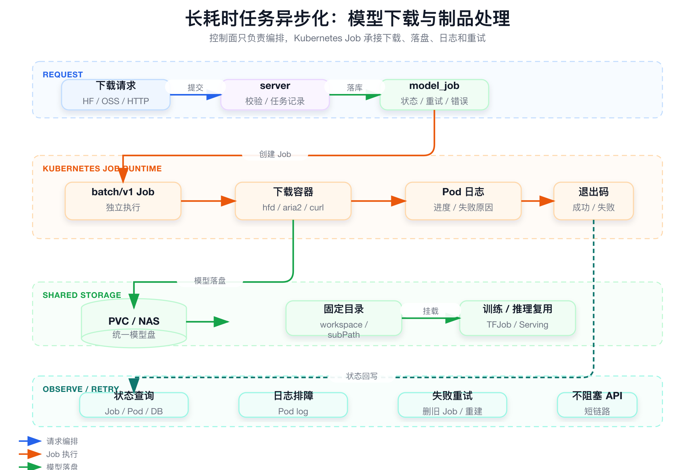

# 面试定位卡

- **技术点**：长耗时模型制品任务异步化与 Kubernetes Job Runtime。
- **所属领域**：AI Infra、模型制品治理、Kubernetes Job、平台稳定性。
- **面试价值**：证明你理解控制面和执行面边界，知道大模型权重下载、落盘、解压、上传这类长耗时任务不能放在 API 请求里同步执行。
- **常见考法**：为什么不用 API 同步下载、Job 失败怎么办、模型路径怎么治理、这是不是完整 Model Registry。
- **适合挂钩项目**：SAI-Console 中 Hugging Face、OSS、HTTP、内部制品源模型下载，落到 PVC / NAS 后供训练和推理复用。
- **不适合夸大的地方**：不要说完整 Model Registry、完整模型生命周期管理、自动模型发布平台或模型评估平台；准确说法是模型制品下载、落盘、挂载和复用的基础治理能力。

# 三十秒回答

> 模型下载和制品处理不应该阻塞 SAI 控制面。模型权重可能来自 Hugging Face、OSS、HTTP 或内部制品源，体积大、耗时不稳定、失败原因复杂。SAI 的做法是 API 只创建任务记录和 Kubernetes Job，真实下载在 Job Pod 中执行，结果落到 PVC / NAS 统一路径，后续训练和推理通过统一挂载复用。它解决控制面超时、人工路径混乱和失败不可观测问题；边界是这不是完整 Model Registry。

# 为什么需要它

- **没有它之前的问题**：用户手工下载模型，路径不统一，权限和失败原因不可见，API 同步下载会超时。
- **它的解决方式**：控制面创建 model job 和 Kubernetes Job，下载任务在独立 Pod 中执行，结果落到共享存储。
- **它引入的新问题**：要治理路径冲突、存储容量、认证脱敏、失败重试和旧文件清理。
- **必须关注的场景**：Hugging Face 下载、OSS / HTTP 模型源、PVC / NAS 挂载、训练推理模型路径复用、Job 失败重试。

# 核心概念表

- **model job**
  - 解释：平台侧任务记录，保存下载源、目标路径、Job 名称、状态、错误和重试标记。
  - 面试展开点：不能把任务状态只藏在 Kubernetes 里。

- **Kubernetes Job Runtime**
  - 解释：真实执行下载、解压、上传或制品处理的 Job / Pod。
  - 面试展开点：控制面编排，执行面独立运行。

- **PVC / NAS**
  - 解释：模型权重落盘的共享存储路径。
  - 面试展开点：训练和推理复用同一模型挂载口径。

- **Pod 日志**
  - 解释：下载进度、错误栈、源站返回和脚本异常的主要排障入口。
  - 面试展开点：注意认证信息和 token 脱敏。

- **Model Registry 边界**
  - 解释：下载落盘不等于完整模型注册、评估、版本、审批、发布和回滚。
  - 面试展开点：表达要真实克制。

# 原理模型



## 用户入口层

- Console / API 提交下载源、目标路径、工作空间、认证和重试请求。
- API 快速返回任务创建结果，不等待下载完成。

## 控制面层

- server 校验参数、创建任务记录、生成 Kubernetes Job 和存储挂载。
- 控制面不执行下载，不持有长时间网络连接。

## 执行面层

- Job Pod 执行 Hugging Face、OSS、HTTP 或内部制品下载。
- Job / Pod 的退出状态和日志用于判断成功或失败。

## 存储和复用层

- 模型落到 PVC / NAS / workspace 固定目录。
- 训练任务和推理服务通过统一路径挂载模型。

# 关键机制

## 控制面只负责编排，不执行下载

- **解决的问题**：模型文件大、网络慢、源站限流，API 同步下载容易超时和拖垮 server。
- **工作方式**：server 只创建任务记录和 Kubernetes Job，真实下载在 Job Pod 中完成。
- **代价**：API 成功只代表任务已创建，不代表模型已下载完成。
- **面试追问**：为什么不用 API 同步下载？

## 共享存储统一模型路径

- **解决的问题**：用户手工放模型会造成目录混乱、重复下载、挂载方式不一致。
- **工作方式**：Job 挂载 PVC / NAS，将模型写入固定 workspace / model directory。
- **代价**：需要处理路径冲突、权限、容量和清理策略。
- **面试追问**：模型路径怎么治理？

## 任务状态关联 Job / Pod 日志

- **解决的问题**：下载失败原因复杂，仅靠平台状态无法定位。
- **工作方式**：model job 关联 Job、Pod 状态、exit code 和 Pod 日志。
- **代价**：日志要控制敏感信息泄漏，任务历史也要有保留策略。
- **面试追问**：Job 失败怎么办？

## 失败重试和幂等边界

- **解决的问题**：下载中断后可能留下半成品文件或旧 Job。
- **工作方式**：失败后保留状态和日志，重试时处理旧 Job、目标路径和已有文件。
- **代价**：重试策略要避免覆盖有效模型或污染路径。
- **面试追问**：重试如何避免脏数据？

# 横向对比

- **API 同步下载 vs Job 异步下载**
  - 区别：同步下载阻塞控制面，Job 异步下载隔离执行和日志。
  - 什么时候用：大模型权重、网络不稳定、耗时不可控任务应使用 Job。
  - 面试注意点：API 成功不代表下载完成。

- **模型下载治理 vs Model Registry**
  - 区别：前者解决下载、落盘、挂载；后者还包括版本、评估、lineage、审批、发布和回滚。
  - 什么时候用：当前 SAI 专题只能讲前者。
  - 面试注意点：不要包装成完整 MLOps。

- **共享存储路径 vs 用户本地路径**
  - 区别：共享路径可复用、可审计、可挂载；用户本地路径不可治理。
  - 什么时候用：训练和推理需要复用模型权重时。
  - 面试注意点：路径治理要考虑权限和容量。

# 典型业务场景

- **从 Hugging Face 下载大模型权重**
  - 为什么相关：文件大、网络不稳定、认证和限流复杂。
  - 可能现象：下载中断、超时、403、磁盘不足。
  - 排查方式：查 model job 状态、Job Pod 日志、目标路径和源站返回。
  - 优化方向：Job 异步执行、失败重试和日志可见。

- **训练和推理复用模型路径**
  - 为什么相关：模型下载后要被 TFJob / KServe / 推理服务挂载。
  - 可能现象：路径错误、权限不足、挂载失败。
  - 排查方式：查 PVC / NAS、volumeMount、Pod event 和应用启动日志。
  - 优化方向：统一 workspace 和 model directory 规范。

- **下载任务失败后重试**
  - 为什么相关：长耗时任务失败是常态。
  - 可能现象：旧 Job 残留、半成品文件、重复下载。
  - 排查方式：查旧 Job、目标目录、任务记录和错误原因。
  - 优化方向：明确重试、清理和幂等策略。

# 排障路径

- **症状**：模型下载任务失败。
- **初始假设**：可能是源站认证、网络、路径权限、存储容量、脚本错误或 Job 调度失败。
- **验证命令**：

```bash
kubectl get job,pod -n <namespace> | grep <model-job>
kubectl describe pod <pod-name> -n <namespace>
kubectl logs <pod-name> -n <namespace> --tail=200
```

这组命令用于验证什么：

- Job 是否被创建并调度。
- Pod 是否正常启动。
- 下载脚本具体失败原因。

重点看什么：

- Pod phase、exit code、restart policy。
- 日志中的 HTTP 状态码、认证失败、磁盘不足、权限错误。
- PVC / NAS 挂载是否成功。

异常说明什么：

- Pod Pending：资源池、镜像、调度或 PVC 问题。
- Pod Failed：看 exit code 和日志。
- 文件不存在：下载路径、权限或挂载路径可能不一致。

# 风险、边界和误区

- **说法 / 做法**：这是完整 Model Registry。
  - 问题：缺少完整版本、评估、lineage、审批、发布和回滚。
  - 更稳妥的表达：这是模型制品下载、落盘和挂载治理。

- **说法 / 做法**：API 返回成功代表模型可用。
  - 问题：API 只创建任务，下载还在 Job 中执行。
  - 更稳妥的表达：模型可用要看 Job 成功和目标路径存在。

- **说法 / 做法**：下载失败直接重试就行。
  - 问题：可能留下半成品文件或旧 Job。
  - 更稳妥的表达：重试前要看失败原因、目标路径和清理策略。

# 和项目的安全连接

## 了解型说法

我理解模型制品进入平台是训练和推理复用的基础，但它不等于完整模型管理。

## 排查型说法

遇到下载失败，我会先看 model job，再看 Kubernetes Job、Pod 状态、Pod 日志、PVC / NAS 路径和源站错误。

## 实践型说法

我可以安全讲控制面和长耗时任务解耦、Job Runtime、统一落盘路径和训练推理挂载复用。

## 不能说的话

- 不能说完整 Model Registry。
- 不能说模型评估平台。
- 不能说自动模型发布平台。
- 不能说完整模型生命周期管理。

# 面试追问树

```text
Q1：为什么模型下载不能放在 API 里？
  └── Q2：Job Runtime 如何承接下载任务？
        └── Q3：模型落盘路径怎么治理？
              └── Q4：Job 失败怎么排查？
                    └── Q5：重试如何处理旧文件？
                          └── Q6：它和 Model Registry 有什么区别？
```

# 高频 Q&A

## 为什么不用 API 同步下载？

模型体积和下载时延不可控。同步下载会导致 API 超时、server 阻塞、失败难重试、用户无法观察中间状态。

## Job 失败怎么办？

查 Job 状态、Pod 状态、exit code、Pod 日志、PVC / NAS 挂载和源站返回。失败后按原因重试，而不是盲目重跑。

## 这算模型管理吗？

严格说不是完整 Model Registry。它解决的是模型制品下载、落盘、挂载和复用。

## 模型路径怎么治理？

平台将下载结果落到固定共享存储路径，训练和推理通过统一挂载方式复用，同时需要管理权限、容量、命名和清理。

## 下载任务 API 成功代表什么？

代表任务记录和 Job 创建成功，不代表模型已经下载完成。

## 为什么要保留 Pod 日志？

下载失败原因通常在 Pod 日志里，例如认证失败、源站限流、网络超时、磁盘不足或脚本错误。

## 重试要注意什么？

要处理旧 Job、半成品文件、目标路径冲突和重复写入，避免污染有效模型目录。

## 后续如何演进成更完整的模型治理？

可以增加版本、指标、评估、lineage、审批、发布、回滚和清理策略，但这些不是当前能力本身。

# 三档背诵版

## 三十秒版

模型下载和制品处理是长耗时任务，不能放在 API 里同步执行。SAI 通过 Kubernetes Job Runtime 执行下载，模型落到 PVC / NAS 统一路径，训练和推理复用挂载。它不是完整 Model Registry。

## 三分钟版

模型权重可能来自 Hugging Face、OSS、HTTP 或内部制品源，文件大、网络不稳定、失败原因复杂。SAI server 只负责参数校验、任务记录和 Job 创建，Job Pod 执行真实下载。任务状态关联 Job、Pod 和日志，便于失败排查和重试。下载完成后模型进入统一共享存储路径，后续训练和推理通过统一挂载复用。

## 五分钟版

这块的重点是控制面边界。很多平台问题来自把长耗时任务塞进 API 请求，导致超时、重试困难和状态不可见。SAI 把模型制品处理拆到 Kubernetes Job Runtime，既隔离执行资源，又复用 Kubernetes 状态和日志能力。它为模型进入平台、落盘、挂载、复用打基础，但不应该夸大成完整 Model Registry，因为完整模型管理还包括版本、评估、lineage、审批、发布和回滚。

# 图示清单

| 图片 | 对应章节 | 目的 | 优先级 |
|---|---|---|---|
| `assets/06_async_model_artifact_jobs.png` | 原理模型 | 展示 API、model job、Kubernetes Job、共享存储和训练推理复用关系 | P0 |

# 面试前检查清单

- [ ] 我能解释为什么下载任务不能同步放在 API 里。
- [ ] 我能说清 model job、Kubernetes Job、PVC / NAS 的关系。
- [ ] 我能按 Job 失败路径排查。
- [ ] 我能说明这不是完整 Model Registry。
- [ ] 我能讲清训练和推理如何复用模型路径。
