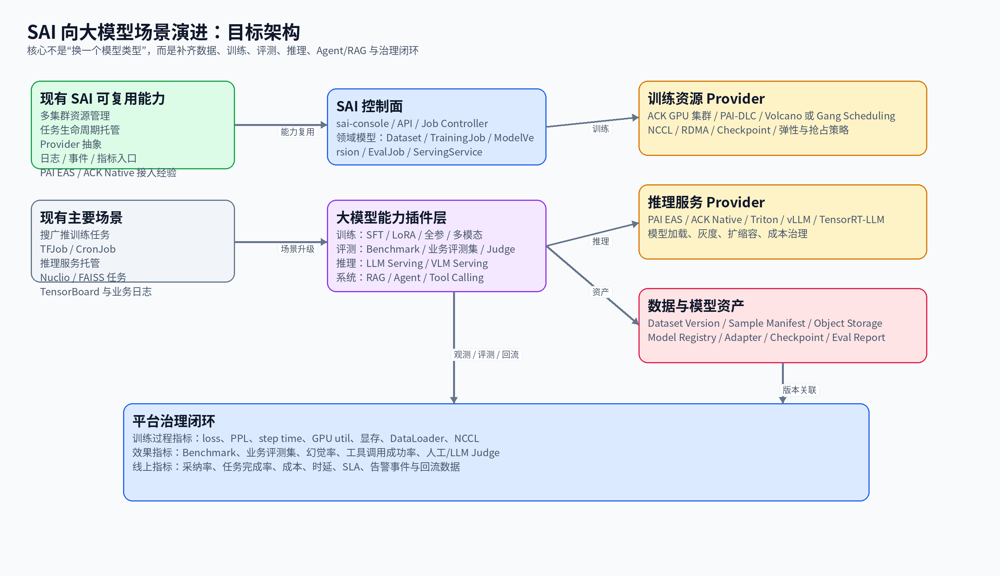
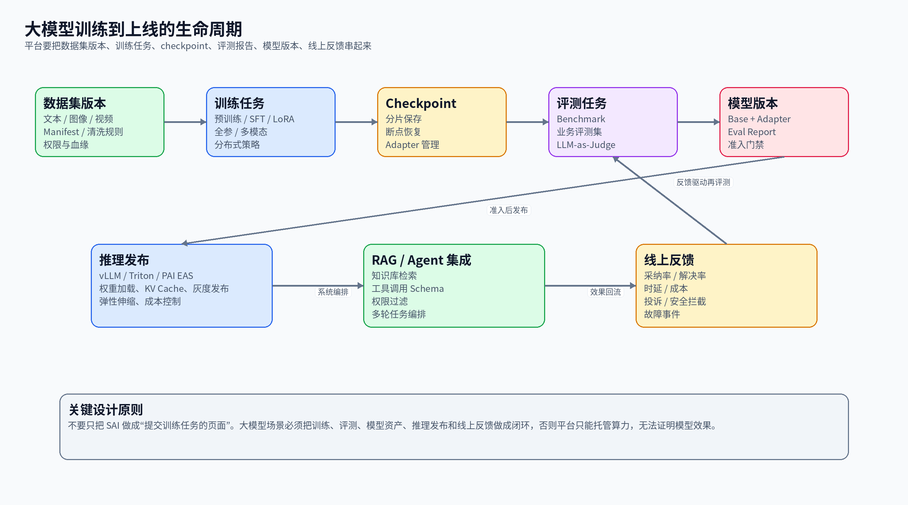
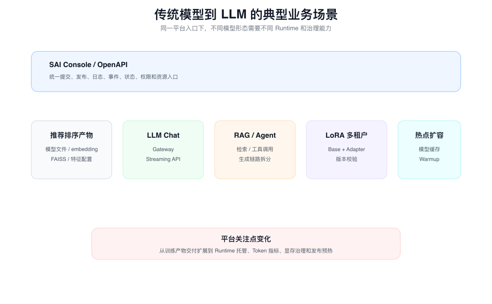
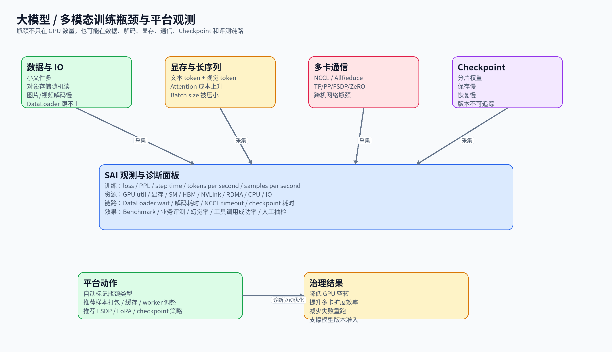
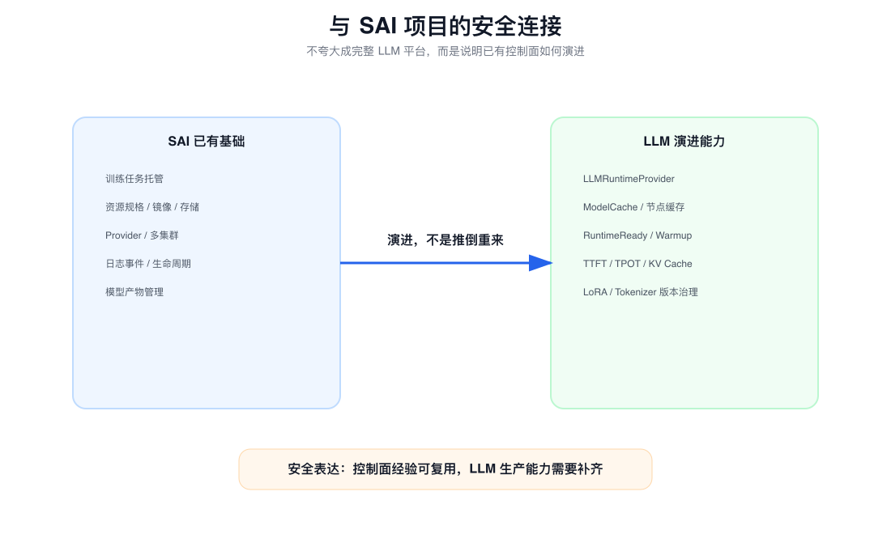

# 面试定位卡

- **技术点**：SAI 如何适配 LLM 训推场景。
- **所属领域**：AI Infra、MLOps、LLMOps、AI Serving、模型评测、GPU 资源治理、RAG / Agent 应用治理。
- **面试价值**：证明你能从平台工程角度回答“传统训推平台如何升级支持大模型”，而不是只说换训练框架、接 vLLM 镜像或加 GPU。
- **常见考法**：SAI 现有能力能不能直接支持 LLM；传统搜广推训推和 LLM 训推差异在哪里；平台要改哪些抽象；训练、评测、推理各自难点是什么；LLM Serving 为什么不能按普通服务治理；怎么分阶段演进。
- **适合挂钩项目**：SAI 训练任务托管、推理服务托管、多 Provider 抽象、GPU 资源治理、模型制品异步任务、生命周期状态同步、日志事件指标、Bigeyes / OTel / SRE Agent 场景。
- **不适合夸大的地方**：不要说已经完整落地生产级 LLMOps；不要说自研大模型训练框架、推理引擎、GPU Scheduler 或 vLLM 内核；不要把“能提交训练任务”说成“能治理模型效果”；不要把“跑起 vLLM 镜像”说成“完成 LLM Serving 平台化”。

# 三十秒回答

SAI 适配 LLM 训推场景，核心不是把 TFJob 换成某个大模型训练框架，也不是把推理服务镜像换成 vLLM。

真正的变化是把平台从“训练任务和推理服务托管”升级成“数据、训练、Checkpoint、模型版本、评测、Serving、应用和反馈闭环”的治理平台。

现有 SAI 的多集群、资源规格、存储挂载、生命周期、Provider、日志事件和状态同步可以复用。

必须新增的是 DatasetVersion、TrainingJob、Checkpoint、ModelVersion、EvalJob、LLMRuntimeProvider、ModelCache、RuntimeReady、Token 级观测和 RAG / Agent 应用链路治理。

难点主要在评测闭环、LLM 推理 Runtime、GPU 显存 / KV Cache、长上下文、成本和线上反馈，而不只是 GPU 更大。

# 为什么需要它

- **没有它之前的问题**：传统平台能管理 TFJob、CronJob、普通推理服务、模型文件和模型下载任务，但很难回答“大模型用了哪份数据、哪次训练、哪份 checkpoint、哪份评测、为什么能上线、线上效果是否变好”。
- **它的解决方式**：把平台对象从 Job / Service 扩展到 DatasetVersion、TrainingJob、Checkpoint、ModelVersion、EvalJob、ServingService、ModelApplication 和 Feedback。
- **它引入的新问题**：数据血缘、训练框架差异、checkpoint 分片、模型版本兼容、评测门禁、LLM 冷启动、Token 成本、KV Cache、长上下文、RAG / Agent 可观测性都会进入平台治理范围。
- **必须关注的场景**：SFT / LoRA 微调、模型上线门禁、LLM Chat 服务托管、热点模型扩容、RAG / Agent 问答、SRE Agent、多模态训练或推理、模型效果回归、GPU 成本治理。

# 核心概念表

- **传统搜广推训推**
  - 解释：围绕推荐、搜索、广告链路的样本、特征、召回、排序、embedding、FAISS 索引、周期训练和业务服务内嵌推理。
  - 面试展开点：它不是没有推理，而是很多推理逻辑嵌在业务服务里，平台未必把它抽象成独立 InferenceService。

- **LLM 全生命周期**
  - 解释：从数据准备、训练、checkpoint、评测、模型版本、Serving、应用接入到线上反馈的闭环。
  - 面试展开点：训练成功只是中间状态，不等于模型可上线。

- **DatasetVersion**
  - 解释：对预训练语料、SFT 数据、偏好数据、RAG 知识数据、评测集做版本化和血缘管理。
  - 面试展开点：LLM 效果问题经常来自数据质量，不能只记录一个 OSS / NAS 路径。

- **TrainingJob**
  - 解释：平台层训练任务语义，底层可以映射到 PyTorchJob、普通 Job、Volcano Job、PAI-DLC、DeepSpeed / FSDP 模板等。
  - 面试展开点：SAI 不必绑定 TFJob，而是把模型、数据、资源、训练方式、分布式策略和输出统一起来。

- **Checkpoint**
  - 解释：训练过程中的可恢复点和中间产物，LLM 场景可能是分片权重、优化器状态和训练配置。
  - 面试展开点：它影响失败恢复、断点续训、模型版本生成和存储成本。

- **ModelVersion**
  - 解释：一个可评测、可发布、可回滚的模型版本，可能包含 base model、Tokenizer、LoRA、量化配置、chat template、runtime 参数和评测报告。
  - 面试展开点：LLM 版本不能简化成一个模型路径。

- **EvalJob**
  - 解释：模型评测任务，覆盖 benchmark、业务评测集、人工评测、LLM-as-Judge、安全评测和版本对比。
  - 面试展开点：这是从“训练跑完”升级到“效果可证明”的关键对象。

- **LLM Runtime**
  - 解释：vLLM、TGI、TensorRT-LLM、Ray Serve、PAI EAS 等大模型推理运行时或托管底座。
  - 面试展开点：平台不能只托管一个 Pod，要理解模型加载、KV Cache、batching、streaming 和 ready 状态。

- **KV Cache**
  - 解释：LLM 为了复用上下文计算结果而维护的 GPU 显存缓存。
  - 面试展开点：KV Cache 决定并发、长上下文能力和显存压力，是 LLM 推理资源治理核心。

- **TTFT / TPOT**
  - 解释：TTFT 是首 token 时间，TPOT 是每输出 token 耗时。
  - 面试展开点：LLM 用户体验不能只看请求 P99，要拆成 prefill、decode 和排队。

- **ModelApplication**
  - 解释：RAG / Agent 这类上层模型应用，包含知识库、Embedding、Reranker、工具、权限、Prompt 和运行轨迹。
  - 面试展开点：最终效果不好不一定是模型差，也可能是检索、工具、权限或上下文拼接问题。

# 原理模型



## 现有 SAI 控制面

- 已有价值在统一入口、资源规格、节点池、存储挂载、生命周期动作、日志事件、状态同步和多 Provider 适配。
- 这些能力对 LLM 仍然有用，因为大模型训练和推理也需要资源编排、存储、日志、事件、权限和状态治理。
- 不能直接复用的是对象语义：传统 Job / Service 不足以表达数据版本、checkpoint、评测门禁、LLM Runtime ready 和 RAG / Agent 链路。

## 训练侧

- 传统训练平台重点是任务提交、资源规格、日志、TensorBoard 和状态同步。
- LLM 训练要进一步表达 base model、dataset、method、precision、max sequence length、distributed strategy、checkpoint policy、输出 ModelVersion。
- 底层可以是 ACK Native Job、PyTorchJob、Volcano Job、PAI-DLC、DeepSpeed、FSDP、Megatron、Transformers 或 LLaMA-Factory，SAI 上层不应该绑定单一训练 CRD。

## 评测和模型版本侧

- 传统模型常见离线指标是 AUC、LogLoss、CTR、CVR、召回率等。
- LLM 需要业务评测集、幻觉率、安全违规率、工具调用成功率、答案完整性、人工评测、LLM-as-Judge 和线上反馈。
- ModelVersion 要绑定 DatasetVersion、TrainingJob、Checkpoint、EvalReport 和 Serving 参数，否则无法解释线上版本来自哪里、为什么能上线、怎么回滚。

## 推理侧

- 传统推理经常是业务服务加载模型文件、embedding 或索引，也可能是普通 HTTP 模型服务。
- LLM 推理本身就是复杂 GPU Runtime，要治理权重加载、Tokenizer、KV Cache、continuous batching、streaming、长上下文、warmup、模型缓存和 token 指标。
- Pod Running、端口通、模型加载完成、warmup 成功、可接流量是不同状态，平台要把它们拆开。

## 应用侧

- RAG / Agent 场景不是单次模型推理，还包含 retrieval、rerank、上下文拼接、工具调用、权限过滤、多步执行和人工反馈。
- SAI 如果继续向企业内部模型应用平台演进，就要把 ModelApplication 作为更高层对象治理。
- 这条线可以和 Bigeyes、OpenTelemetry、事件中心、SRE Agent 结合，形成告警事件到根因候选、SOP 推荐和反馈回流的闭环。

# 关键机制



## 领域对象从 Job / Service 扩展到 LLM 生命周期

解决的问题：

只管理 Job 和 Service，只能说明任务是否运行，不能说明数据、模型、评测、上线和反馈之间的关系。

工作方式：

- 抽象 DatasetVersion、TrainingJob、Checkpoint、ModelVersion、EvalJob、ServingService、ModelApplication。
- TrainingJob 产出 Checkpoint 和候选 ModelVersion。
- EvalJob 绑定 ModelVersion 和评测集，产出上线准入结果。
- ServingService 只允许发布通过门禁的 ModelVersion。
- 线上 Feedback 回流到评测集或下一轮数据版本。

代价：

平台元数据模型变重，需要治理血缘、权限、版本兼容和对象状态一致性。

面试追问：

为什么大模型平台不能只记录一个训练任务和一个模型路径？

## TrainingProvider 扩展

解决的问题：

LLM 训练生态不再只围绕 TFJob，可能是 PyTorch、DeepSpeed、FSDP、Megatron、Transformers、LLaMA-Factory、PAI-DLC 或 Volcano Job。

工作方式：

- 平台上层稳定为 TrainingJob。
- Provider 把训练语义翻译成底层 CRD、云厂商 API 或模板化 Job。
- 训练配置关注 base model、dataset、method、precision、max sequence length、distributed strategy、checkpoint policy。
- 日志、事件、TensorBoard、GPU 指标、checkpoint 状态由平台统一回收。

代价：

不同框架能力差异大，抽象层必须保留 runtime-specific 参数，不能假装所有训练方式完全一致。

面试追问：

TFJob 能不能直接支撑 LLM 微调？如果不能，平台该怎么抽象？

## DatasetVersion 和 Checkpoint 治理

解决的问题：

LLM 效果问题经常来自数据质量、数据版本、样本格式、训练恢复点或 checkpoint 不完整，而不是单纯训练框架问题。

工作方式：

- DatasetVersion 记录数据类型、模态、存储位置、格式、schema、清洗状态、敏感信息过滤和来源血缘。
- Checkpoint 记录训练 step、保存时间、分片完整性、恢复点、关联 TrainingJob 和输出 ModelVersion。
- 训练失败时先判断是否可从最近 checkpoint 恢复，而不是简单重跑。
- 模型上线后出现效果回归，可以追溯到数据版本和 checkpoint。

代价：

对象存储、NAS、本地缓存和 checkpoint 分片会增加存储成本，也要求平台有清理和保留策略。

面试追问：

为什么 LLM 微调平台要关心 checkpoint，而不是只关心最终模型文件？

## EvalJob 和上线门禁

解决的问题：

大模型 loss 下降不代表回答质量更好，训练成功也不代表适合上线。

工作方式：

- 将通用 benchmark、业务评测集、安全评测、人工评测、LLM-as-Judge、线上反馈统一成 EvalJob。
- 对 ModelVersion 做版本对比，而不是只看单次分数。
- 上线门禁可以包含正确率、幻觉率、工具调用成功率、安全违规率、成本和时延。
- 评测报告成为模型版本的一部分，供发布、回滚和复盘使用。

代价：

评测集建设成本高，LLM-as-Judge 也有偏差，需要人工抽检和业务闭环校准。

面试追问：

为什么大模型平台里 EvalJob 比普通训练平台更重要？

## LLMRuntimeProvider 扩展

解决的问题：

原有平台可能能管理 TFJob、CronJob、普通推理服务或云厂商 EAS，但 LLM Runtime 的创建、状态、扩缩容、ready 和指标语义不同。

工作方式：

- 在原有 Provider 抽象下新增 LLMRuntimeProvider / ServingProvider。
- 将 vLLM、TGI、TensorRT-LLM、Ray Serve、PAI EAS、ACK Native 等 Runtime 的创建、更新、扩缩容、重启、删除、日志和状态查询适配成平台统一能力。
- 上层仍然面对 ServingService，底层 Provider 暴露 capability，例如是否支持 LoRA、streaming、tensor parallel、quantization、OpenAI-compatible API。
- 保留 provider-specific 参数，避免抽象过度。

代价：

统一抽象不能覆盖所有 Runtime 特性，需要通过能力声明、扩展字段和专有参数处理差异。

面试追问：

新增一个 LLM Runtime 为什么不是换个镜像这么简单？

## ModelCache 和调度联动

解决的问题：

LLM 冷启动慢，原因不只是下载大文件，还包括权重读取、反序列化、搬运到 GPU、Runtime 初始化、KV Cache 分配和 warmup。

工作方式：

- 建立 ModelCache 状态，记录模型版本是否缓存到哪些节点。
- 调度时优先选择已有模型缓存的 GPU 节点。
- 对热点模型保持常驻；对温模型做本地缓存；对冷模型允许远端加载但降低 SLA 预期。
- 扩容前通过 DaemonSet、InitContainer 或异步模型下载任务预热缓存。

代价：

缓存会占用本地 SSD / NVMe，模型版本更新、淘汰策略和缓存一致性都要治理。

面试追问：

模型缓存命中后为什么仍然可能启动慢？

## Runtime Ready 和 Warmup 发布

解决的问题：

Pod Running 不代表 LLM 服务可以接流量。端口通、模型下载、模型加载、warmup 成功、TTFT 合格是不同阶段。

工作方式：

- 定义状态链路：`PodRunning -> ModelDownloaded -> ModelLoaded -> RuntimeReady -> WarmupPassed -> TrafficReady`。
- StartupProbe 给模型加载足够时间。
- ReadinessProbe 不只检查端口，还要检查 Runtime 和模型状态。
- 发布系统等待 warmup prompt 成功后再灰度切流量。

代价：

发布流程变长，状态判断更复杂，但能避免请求打到未完成加载的实例。

面试追问：

为什么 Kubernetes Ready 不能直接作为 LLM 服务 Ready？

## Token 级观测和限流

解决的问题：

LLM 请求耗时由 input tokens、output tokens、prefill、decode 和排队共同决定，只看 QPS / P99 会掩盖问题。

工作方式：

- 新增 TTFT、TPOT、input tokens/s、output tokens/s、queue wait、KV Cache 使用率、batch size、OOM、请求取消等指标。
- 限流从请求数扩展到 token、上下文长度、并发 decode 数和 GPU 显存。
- 排障时区分 prefill 慢、decode 慢、排队慢、缓存不足和模型加载慢。
- 成本统计从实例时长扩展到 GPU 时间、tokens、模型版本和业务应用维度。

代价：

指标采集和归因更复杂，需要 Runtime 暴露 metrics，并和平台服务画像关联。

面试追问：

为什么 LLM 的 P99 变高，不能只看 CPU / GPU 利用率？

## RAG / Agent 应用治理

解决的问题：

LLM 应用效果不好，不一定是模型本身差，也可能是知识库、检索、rerank、工具调用、权限或 prompt 链路的问题。

工作方式：

- 将上层应用抽象为 ModelApplication。
- 关联 llmService、knowledgeBase、embeddingModel、reranker、tool schema、policy、prompt version。
- 记录 RAG retrieval trace、tool call trace、上下文拼接、回答引用、人工反馈。
- 评测从模型回答扩展到任务完成率、工具调用成功率、答案忠实度和人工采纳率。

代价：

平台边界会向应用层扩展，需要和业务系统、权限系统、知识库和观测系统协同。

面试追问：

为什么 RAG / Agent 平台不能只由模型服务平台承担？

# 横向对比

- **数据治理**
  - 传统搜广推训推：样本路径、特征、标签、索引数据。
  - LLM 训推场景：预训练语料、SFT 数据、偏好数据、评测集、RAG 知识数据。
  - SAI 改造点：新增 DatasetVersion、数据血缘、质量标签和数据安全状态。

- **训练任务**
  - 传统搜广推训推：TFJob、周期任务、索引构建任务较多。
  - LLM 训推场景：SFT、LoRA、DPO、RLHF、分布式训练、多模态微调。
  - SAI 改造点：新增 TrainingProvider、分布式策略、checkpoint 策略和训练模板。

- **模型产物**
  - 传统搜广推训推：模型文件、embedding、FAISS、特征配置。
  - LLM 训推场景：base model、Tokenizer、Checkpoint、LoRA、chat template、量化版本。
  - SAI 改造点：新增 ModelVersion、版本兼容校验、评测报告绑定和回滚语义。

- **模型评测**
  - 传统搜广推训推：AUC、LogLoss、CTR、CVR、召回率等离线指标。
  - LLM 训推场景：benchmark、业务评测、LLM-as-Judge、人工评测、安全评测。
  - SAI 改造点：新增 EvalJob、上线门禁、模型版本对比和 badcase 回流。

- **推理形态**
  - 传统搜广推训推：业务服务内嵌推理或普通模型服务。
  - LLM 训推场景：独立 LLM Runtime、streaming、KV Cache、长上下文。
  - SAI 改造点：新增 LLMRuntimeProvider、RuntimeReady、ModelCache 和 warmup 发布。

- **观测指标**
  - 传统搜广推训推：QPS、P99、错误率、CPU、内存。
  - LLM 训推场景：TTFT、TPOT、tokens/s、queue、KV Cache、GPU 显存、token 成本。
  - SAI 改造点：新增 Token metrics、成本归因、Runtime 指标采集和链路拆分。

- **发布治理**
  - 传统搜广推训推：镜像发布、模型文件发布和服务健康检查。
  - LLM 训推场景：模型版本门禁、warmup、灰度质量对比、效果回滚。
  - SAI 改造点：新增 WarmupPassed、TrafficReady、质量门禁和灰度评测对比。

- **应用链路**
  - 传统搜广推训推：业务服务自行组合模型能力。
  - LLM 训推场景：RAG、Agent、工具调用、权限过滤、多轮执行。
  - SAI 改造点：新增 ModelApplication、retrieval / tool trace、权限策略和反馈闭环。

- **任务成功 vs 模型有效**
  - 区别：任务成功只表示作业跑完；模型有效要靠评测和线上反馈证明。
  - 什么时候用：解释为什么要新增 EvalJob。
  - 面试注意点：不要把 TensorBoard loss 当成唯一质量指标。

- **嵌入式推理 vs 一等推理服务**
  - 区别：搜广推推理经常嵌在业务服务里；LLM 推理服务本身就是核心平台对象。
  - 什么时候用：解释“搜广推不是没有推理，而是平台抽象层级不同”。
  - 面试注意点：不要把传统模型说成没有在线推理。

- **Provider 适配 vs 自研执行引擎**
  - 区别：SAI 更适合做平台控制面和 Provider 适配，不必自研 DeepSpeed、vLLM 或 GPU Scheduler。
  - 什么时候用：回答架构边界。
  - 面试注意点：准确说“统一治理”，不要说“替代底层框架”。

- **QPS/P99 vs TTFT/TPOT**
  - 区别：QPS/P99 只描述请求维度；TTFT/TPOT 反映 token 生成体验。
  - 什么时候用：解释 LLM 观测体系为什么要扩展。
  - 面试注意点：LLM 的慢可能来自排队、prefill、decode、KV Cache 或输出长度。

- **模型服务 vs 模型应用**
  - 区别：模型服务解决推理托管；模型应用还包含 RAG、工具、权限、Prompt、反馈。
  - 什么时候用：解释为什么 LLM 平台会向 Agent 应用治理扩展。
  - 面试注意点：不要把所有效果问题都归因到模型参数。

# 典型业务场景



- **SFT / LoRA 微调托管**
  - 为什么相关：这是 SAI 低成本切入 LLM 训练场景的第一阶段。
  - 可能现象：训练任务跑完，但无法说明用了哪份数据、产出了哪个模型版本、评测是否通过。
  - 排查方式：看 DatasetVersion、TrainingJob、Checkpoint、ModelVersion、EvalJob 是否串起来。
  - 优化方向：先把轻量微调、数据版本、checkpoint 和基础评测闭环做好。

- **模型上线门禁**
  - 为什么相关：大模型上线不能只看训练成功和服务健康。
  - 可能现象：模型可部署，但业务问答质量下降、幻觉增加、工具调用错误变多。
  - 排查方式：对比 ModelVersion 的业务评测、安全评测、人工抽检和线上反馈。
  - 优化方向：建设 EvalJob、评测集版本、模型版本对比和发布门禁。

- **LLM Chat 服务托管**
  - 为什么相关：这是传统推理服务向 LLM Serving 演进的主场景。
  - 可能现象：Pod Running 但请求超时，或者首 token 很慢。
  - 排查方式：看模型下载、模型加载、warmup、TTFT、TPOT、queue wait、KV Cache 和显存。
  - 优化方向：引入 LLMRuntimeProvider、ModelCache、Runtime Ready、warmup 发布和 Token 级观测。

- **LoRA 多租户推理**
  - 为什么相关：一个 base model 可能挂多个业务 LoRA adapter。
  - 可能现象：某个 LoRA 加载失败、版本不匹配或 adapter 切换影响延迟。
  - 排查方式：看 base model、adapter 版本、max LoRA 数、显存和 Runtime 日志。
  - 优化方向：把 LoRA 纳入 ModelVersion 治理和发布校验。

- **热点模型扩容**
  - 为什么相关：LLM 扩容不只是拉起 Pod，还要考虑模型缓存和 warmup。
  - 可能现象：扩容副本长时间不可用，或者新副本一进流量就超时。
  - 排查方式：看模型下载耗时、ModelCache 命中、ModelLoaded、WarmupPassed。
  - 优化方向：热点模型常驻，温模型预缓存，扩容前异步预热。

- **RAG / SRE Agent**
  - 为什么相关：SAI 可以和 Bigeyes、OpenTelemetry、事件中心结合，托管 SRE Agent 的模型和应用配置。
  - 可能现象：回答不准确，但真实原因可能是知识库未召回、工具权限不足、日志上下文缺失或 prompt 不稳定。
  - 排查方式：拆分 retrieval、rerank、tool call、LLM generation、引用和人工反馈。
  - 优化方向：把 RAG / Agent 作为 ModelApplication 治理，而不是只看 LLM Pod。

- **多模态训练或推理**
  - 为什么相关：多模态会放大数据链路和预处理瓶颈。
  - 可能现象：GPU 显存占着但利用率不高，DataLoader wait 高，视频抽帧或对象存储读取慢。
  - 排查方式：看样本读取、解码耗时、本地缓存命中、GPU util、HBM、PCIe / NVLink、checkpoint 耗时。
  - 优化方向：优先支持图文 SFT / VLM 推理，不要一开始铺复杂视频预训练平台。

# 排障路径



## 路径一：LLM 微调任务成功，但候选模型上线后效果变差

- **症状**：训练任务成功，候选模型也发布了，但业务回答质量下降、幻觉增加或工具调用错误变多。
- **初始假设**：数据版本变化、训练参数不合适、评测集覆盖不足、模型版本绑定错误、prompt / tool schema 不兼容、线上流量分布变化。
- **验证命令**：

```bash
kubectl get job -n <namespace> <training-job> -o yaml
```

这条命令用于验证什么：

确认底层训练任务是否完成、使用了哪个镜像、资源规格、挂载路径和输出路径。

重点看什么：

completion status、pod template、env、volume、node selector、restart policy、输出目录。

异常说明什么：

底层任务成功只能证明训练执行完成，不能证明数据版本、模型版本和评测报告正确关联。

```bash
kubectl logs -n <namespace> job/<training-job> --tail=200
```

这条命令用于验证什么：

确认训练过程是否有 loss 异常、checkpoint 保存失败、数据读取失败、OOM、NCCL timeout。

重点看什么：

loss 曲线异常、checkpoint saved、validation result、CUDA OOM、NCCL timeout、DataLoader wait。

异常说明什么：

如果训练过程有不稳定或 checkpoint 失败，ModelVersion 即使生成也不能直接信任。

```bash
curl -s http://<sai-api>/api/model-versions/<model-version>/eval-report
```

这条命令用于验证什么：

确认候选模型版本是否有评测报告、评测集版本、上线门禁和版本对比结果。

重点看什么：

correctness、hallucination_rate、tool_call_success_rate、safety_violation_rate、latency、cost。

异常说明什么：

如果没有评测报告或只看 loss，这个平台还停留在任务托管，没有形成模型质量治理。

- **关键指标**：DatasetVersion、Checkpoint 完整性、EvalJob 结果、ModelVersion 关联、业务评测分、幻觉率、安全违规率、工具调用成功率、人工采纳率。
- **可能结论**：模型没有通过业务评测、评测集覆盖不足、训练产物和模型版本错配、RAG / Tool 链路导致回答不准。
- **优化动作**：补评测门禁、固定数据和评测集版本、回滚 ModelVersion、拆分 RAG / Tool trace、将线上 badcase 回流评测集。
- **复测方式**：对比新旧 ModelVersion 的评测报告、线上灰度指标、工具调用成功率、人工采纳率和 badcase 回归结果。

## 路径二：LLM 服务 Pod Running，但用户请求慢或首 token 慢

- **症状**：LLM 服务 Pod Running，但用户请求超时、首 token 很慢或流式输出卡顿。
- **初始假设**：模型未真正 ready、冷启动仍在加载、KV Cache 或显存不足、请求排队过长、输入上下文太长、输出 token 过多。
- **验证命令**：

```bash
kubectl get pod -n <namespace> -o wide
```

这条命令用于验证什么：

确认 Pod 是否真的调度到 GPU 节点、是否频繁重启、是否新副本刚启动。

重点看什么：

Pod age、restart count、node、Ready 列和是否集中在某类 GPU 节点。

异常说明什么：

Pod Running 只能说明容器进程在运行，不能证明模型已加载完成。

```bash
kubectl logs <pod-name> -n <namespace> --tail=200
```

这条命令用于验证什么：

确认 Runtime 是否完成模型下载、权重加载、Tokenizer 初始化、KV Cache 分配和 warmup。

重点看什么：

model loaded、CUDA OOM、KV cache allocation、warmup failed、request timeout。

异常说明什么：

如果日志停在 loading weights 或 allocating KV cache，问题是 Runtime ready，不是普通网络超时。

```bash
curl -s http://<llm-service>/metrics | grep -E "ttft|tpot|tokens|queue|kv|oom"
```

这条命令用于验证什么：

确认慢请求来自 TTFT、TPOT、排队、token 吞吐、KV Cache 还是 OOM。

重点看什么：

TTFT 是否上升、TPOT 是否上升、queue wait 是否变长、KV Cache 使用率是否接近上限。

异常说明什么：

TTFT 高通常偏 prefill / 排队 / 冷启动；TPOT 高通常偏 decode 吞吐或 GPU 负载。

```bash
nvidia-smi
```

这条命令用于验证什么：

快速确认 GPU 显存、GPU 利用率和进程占用。

重点看什么：

显存是否接近上限、是否有多个 Runtime 争用同卡、GPU util 是否长期打满。

异常说明什么：

显存满但 GPU util 不高，可能是 KV Cache 或模型权重占用导致并发受限。

- **关键指标**：ModelLoaded、WarmupPassed、TTFT、TPOT、queue wait、input / output tokens、KV Cache 使用率、tokens/s、OOM、模型加载耗时。
- **可能结论**：冷启动未结束、Readiness 过早、模型缓存未命中、KV Cache 不足、长上下文请求过多、Runtime 参数不合理。
- **优化动作**：延后切流量、增加 warmup、调整 max model len / batch 参数、启用模型缓存、热点模型常驻、扩容 GPU 副本。
- **复测方式**：对比发布前后 TTFT / TPOT、WarmupPassed 时间、模型加载耗时、P99、OOM 数和请求取消数。

# 风险、边界和误区

- **说法 / 做法**：SAI 已有 TFJob，所以天然支持 LLM。
  - 问题：TFJob 只是底层训练形态之一，LLM 平台需要数据、checkpoint、模型版本、评测和上线治理。
  - 更稳妥的表达：SAI 的任务生命周期和资源治理可复用，但要新增 LLM 领域对象和 Provider 适配。

- **说法 / 做法**：传统搜广推没有推理。
  - 问题：召回、排序、重排服务使用模型打分，本质上就是推理。
  - 更稳妥的表达：传统推理经常内嵌在业务链路，平台未必独立托管。

- **说法 / 做法**：训练任务成功就说明模型可以上线。
  - 问题：大模型效果必须通过业务评测、安全评测、人工抽检和线上反馈验证。
  - 更稳妥的表达：训练成功只是生成候选模型，EvalJob 通过才具备上线资格。

- **说法 / 做法**：LLM 平台就是接入 vLLM。
  - 问题：vLLM 是执行面，平台还要治理模型版本、缓存、ready、发布、指标、限流、成本和回滚。
  - 更稳妥的表达：vLLM 是 ServingProvider 的一种底层实现。

- **说法 / 做法**：LLM 服务只看 QPS 和 P99。
  - 问题：LLM 用户体验由首 token、逐 token 输出和排队共同决定。
  - 更稳妥的表达：需要 TTFT、TPOT、tokens/s、queue wait、KV Cache 指标。

- **说法 / 做法**：模型缓存能解决所有冷启动问题。
  - 问题：缓存只解决下载和部分读取问题，GPU 加载、Runtime 初始化和 warmup 仍然耗时。
  - 更稳妥的表达：冷启动优化要同时做缓存、加载、调度和切流。

- **说法 / 做法**：RAG / Agent 效果不好就是模型差。
  - 问题：检索、rerank、工具权限、上下文拼接、prompt 和业务数据都可能是根因。
  - 更稳妥的表达：要把 ModelApplication 链路拆开观测和评测。

- **说法 / 做法**：一开始就做完整预训练平台。
  - 问题：成本和复杂度过高，容易没有业务闭环。
  - 更稳妥的表达：先从 SFT / LoRA、评测门禁、Serving 治理和线上反馈闭环切入。

- **说法 / 做法**：平台要自研所有底层能力。
  - 问题：训练框架、推理引擎、调度器都有成熟生态，平台更应该做治理抽象和 Provider 适配。
  - 更稳妥的表达：SAI 做统一控制面，底层复用 PAI、ACK、Volcano、vLLM、TGI、TensorRT-LLM 等能力。

# 和项目的安全连接



## 了解型说法

我理解 SAI 现有优势在统一训练任务、推理服务、多 Provider、GPU 资源、日志事件和生命周期治理。往 LLM 方向演进时，这些控制面能力仍然有价值，但不能把它等同于完整 LLMOps。LLM 需要补数据版本、模型版本、评测门禁、LLM Serving 和 RAG / Agent 应用治理。

## 排查型说法

如果一个 LLM 模型上线后效果变差，我不会只看训练任务是否成功。我会先追 DatasetVersion、TrainingJob、Checkpoint、ModelVersion、EvalJob 的链路，再看 Serving 的 TTFT、TPOT、KV Cache 和 queue，最后拆 RAG / Tool / Prompt 链路，判断是模型质量、推理性能还是应用编排问题。

## 实践型说法

如果让我设计演进路线，我会先复用 SAI 现有 Provider、资源规格、存储挂载、日志事件和状态同步能力；第一阶段做 SFT / LoRA 微调托管和 DatasetVersion；第二阶段补 ModelVersion 和 EvalJob；第三阶段接 LLM Serving Runtime、Token 指标和 warmup 发布；第四阶段再做 RAG / Agent 的 ModelApplication 和线上反馈闭环。

## 不能说的话

- 不能说 SAI 已完整落地 LLM 全生命周期平台。
- 不能说自研了 DeepSpeed、FSDP、vLLM、TensorRT-LLM 或 GPU 调度器。
- 不能说 TFJob 成功就代表 LLM 训练平台完成。
- 不能说 loss 降低就代表大模型效果变好。
- 不能说 vLLM 跑起来就代表生产级 LLM Serving。
- 不能说 RAG / Agent 效果问题都由模型本身负责。

# 面试追问树

```text
Q1：SAI 适配 LLM 训推场景，核心变化是什么？
  └── Q2：传统搜广推训推和 LLM 训推最大的差异在哪？
        └── Q3：现有 SAI 哪些能力可以复用？
              └── Q4：哪些平台抽象必须新增？
                    └── Q5：训练侧为什么不能只绑定 TFJob？
                          └── Q6：为什么 EvalJob 是关键？
                                └── Q7：LLM Serving 为什么不能按普通服务治理？
                                      └── Q8：RAG / Agent 为什么要纳入平台治理？
                                            └── Q9：如果模型上线后效果差，你怎么排查？
                                                  └── Q10：这个演进怎么和 SAI 项目安全连接？
```

# 高频 Q&A

## SAI 现有能力能不能直接支持 LLM？

不能说直接支持。现有多集群、资源、生命周期、Provider、日志事件、推理托管能力可以作为底座复用，但 LLM 场景还需要 DatasetVersion、TrainingJob、Checkpoint、ModelVersion、EvalJob、LLM Runtime、Token 指标、模型缓存、warmup 发布和 RAG / Agent 观测。

## TFJob 能不能跑大模型训练？

要看具体框架和任务。TFJob 适合 TensorFlow 生态，但 LLM 常见是 PyTorch、DeepSpeed、FSDP、Megatron、Transformers、LLaMA-Factory 等。平台层更稳妥的抽象是 TrainingJob，底层通过 Provider 映射到不同训练运行时。

## 传统模型和 LLM 的平台化难点差异是什么？

传统平台更多治理训练任务、模型文件、特征、索引和普通服务；LLM 难点在数据版本、checkpoint、模型组合资产、开放式评测、LLM Serving、Token 成本、长上下文、RAG / Agent 链路和线上反馈闭环。

## SAI 要做哪些改造？

我会拆成五层。训练侧新增 TrainingProvider、DatasetVersion 和 Checkpoint；模型侧新增 ModelVersion 和评测报告绑定；评测侧新增 EvalJob 和上线门禁；推理侧新增 LLMRuntimeProvider、ModelCache、RuntimeReady、Token metrics；应用侧新增 ModelApplication，治理 RAG、工具、权限、Prompt 和反馈。

## 为什么不能只看训练 loss？

大模型输出是开放式文本，loss 下降不代表回答准确、工具调用正确、安全边界稳定或业务用户满意。需要业务评测集、人工评测、LLM-as-Judge、安全评测和线上反馈一起判断。

## EvalJob 应该评什么？

至少包含通用 benchmark、业务评测集、幻觉率、工具调用成功率、答案完整性、安全违规率、成本和时延。对于 SRE Agent，还要看告警解释、日志摘要、根因候选、SOP 推荐和人工采纳率。

## LLM Serving 和普通模型服务有什么不同？

LLM Serving 要处理大模型加载、显存占用、KV Cache、prefill、decode、streaming、长上下文、请求取消和 token 成本。普通服务的 QPS、P99、CPU、内存不够解释这些问题。

## 为什么要做 ModelVersion，而不是只记录模型路径？

LLM 版本通常包含 base model、Tokenizer、LoRA、量化配置、chat template、runtime 参数和评测报告。只记录路径无法保证版本兼容、评测追溯和回滚安全。

## 为什么 Pod Running 不代表 LLM 可用？

Pod Running 只说明容器进程在跑。LLM 可能还在下载模型、加载权重、初始化 Tokenizer、分配 KV Cache 或 warmup 失败。平台要等 ModelLoaded、RuntimeReady、WarmupPassed 后再切流量。

## RAG / Agent 为什么也属于平台演进方向？

因为很多企业 LLM 场景不是单次模型推理，而是检索、rerank、上下文拼接、工具调用、权限过滤和多轮执行。平台如果只管模型服务，就无法解释最终回答为什么错、慢或不可执行。

## 这个方向和 Bigeyes / OTel 怎么连接？

Bigeyes 可以提供告警事件和运维上下文，OTel 提供日志、Trace、指标，SAI 托管 SRE Agent 的模型、RAG、工具和评测闭环。这样可以形成从事件输入、上下文检索、根因候选、SOP 推荐到人工反馈的闭环。

## 最合理的落地顺序是什么？

先做低成本闭环：SFT / LoRA 微调托管、DatasetVersion、Checkpoint、ModelVersion、基础 EvalJob；再做模型上线门禁和版本对比；然后补 LLM Serving 的 token 指标、warmup、成本和灰度；最后做 RAG / Agent 应用治理。

# 三档背诵版

## 三十秒版

SAI 适配 LLM 训推场景，不是换一个训练框架或推理镜像，而是从任务托管升级为模型研发、评测、发布和线上反馈闭环。现有资源、Provider、生命周期、日志事件可以复用，但要补 DatasetVersion、TrainingJob、Checkpoint、ModelVersion、EvalJob、LLMRuntimeProvider、Token 观测和 RAG / Agent 治理。核心难点是证明模型有效、稳定上线、控制成本，而不是只把任务跑起来。

## 三分钟版

我会把这个演进拆成“可复用”和“必须新增”。可复用的是 SAI 现有控制面能力，比如多集群、资源规格、存储挂载、训练任务、推理服务、Provider、日志事件和状态同步。必须新增的是 LLM 训推对象：DatasetVersion 管数据血缘，TrainingJob 统一不同训练框架，Checkpoint 支持恢复和产物沉淀，ModelVersion 绑定 base model、Tokenizer、LoRA 和评测报告，EvalJob 做上线门禁，ServingService 治理 vLLM / PAI EAS / ACK Native 这类 LLM Runtime，ModelApplication 管 RAG / Agent。

难点不只是 GPU 更大。训练侧有分布式、checkpoint、数据质量和多模态数据瓶颈；评测侧不能只看 loss，要看业务评测、人工评测、LLM-as-Judge 和安全边界；推理侧要看 TTFT、TPOT、KV Cache、显存、长上下文和 token 成本；应用侧还要拆检索、工具调用、权限和 prompt。安全表达是：SAI 有演进基础，但不能说已经完整落地 LLMOps。

## 五分钟版

如果面试官问 SAI 怎么适配 LLM 训推场景，我会先澄清平台定位。传统训推平台的主线是把训练任务和推理服务托管起来，管理资源、日志、事件、状态和底层 Provider。这个能力对 LLM 有价值，但不够，因为 LLM 场景真正的问题是模型研发和上线闭环更复杂。

架构上，我会把 SAI 从 Job / Service 管理扩展成一组领域对象。数据侧做 DatasetVersion，解决 SFT、偏好数据、RAG 知识数据和评测集的版本追溯；训练侧做 TrainingJob，不绑定 TFJob，而是通过 Provider 适配 PyTorch、DeepSpeed、FSDP、Volcano、PAI-DLC 等；产物侧做 Checkpoint 和 ModelVersion，把 base model、Tokenizer、LoRA、量化配置、chat template 和评测报告绑定；评测侧做 EvalJob，让模型上线有门禁；Serving 侧适配 vLLM、TGI、PAI EAS 或 ACK Native，补 TTFT、TPOT、tokens/s、KV Cache、warmup 和成本指标；应用侧再把 RAG / Agent 作为 ModelApplication，治理知识库、工具、权限、运行轨迹和反馈。

和传统模型相比，LLM 的难点是开放式输出和推理运行时更复杂。传统推荐模型可以用 AUC、LogLoss、CTR、CVR 做比较，LLM 还要看幻觉率、工具调用成功率、答案忠实度、安全违规率和人工采纳率。传统服务看 QPS、P99、CPU、内存，LLM 还要看首 token、逐 token 速度、长上下文、KV Cache 和显存。排障时我不会只看任务成功或 Pod Running，而会沿着数据版本、训练、checkpoint、模型版本、评测、Serving 指标和 RAG / Tool trace 一层层拆。

最终落地顺序不要一开始就做复杂预训练平台，而是先做 SFT / LoRA 微调、模型版本、业务评测、LLM Serving 和线上反馈这条最短闭环。这样能复用 SAI 现有架构，又能避免把没有落地的底层能力夸大成项目成果。

# 图示清单

| 图片 | 对应章节 | 目的 | 优先级 |
|---|---|---|---|
| `assets/12_llm_full_lifecycle_target_architecture.png` | 原理模型 | 说明 SAI 从传统训推到 LLM 训推治理平台的目标架构 | 高 |
| `assets/13_llm_training_serving_lifecycle.png` | 关键机制 | 说明数据、训练、checkpoint、模型版本、评测、Serving 的闭环关系 | 高 |
| `assets/09_original_model_vs_llm_scenario.png` | 典型业务场景 | 把推荐模型、LLM Chat、RAG、LoRA、热点扩容映射到平台能力 | 中 |
| `assets/14_llm_bottleneck_observability.png` | 排障路径 | 说明大模型训练、推理、多模态和 Agent 链路的瓶颈观测点 | 高 |
| `assets/11_original_model_vs_llm_project_connection.png` | 和项目的安全连接 | 说明 SAI 现有控制面能力如何安全演进到 LLM 训推平台 | 中 |

# 面试前检查清单

- [ ] 我能用三十秒讲清楚 SAI 适配 LLM 训推场景的核心变化。
- [ ] 我能说明传统搜广推训推和 LLM 训推的差异。
- [ ] 我能说出 SAI 现有能力哪些可以复用。
- [ ] 我能说出必须新增 DatasetVersion、TrainingJob、Checkpoint、ModelVersion、EvalJob、LLMRuntimeProvider、ModelApplication。
- [ ] 我能解释为什么训练成功不等于模型可上线。
- [ ] 我能解释为什么 loss 不足以评价大模型。
- [ ] 我能解释为什么 Pod Running 不等于 LLM 服务可用。
- [ ] 我能按“症状 -> 假设 -> 验证 -> 指标 -> 优化”讲模型效果或 Serving 问题排障。
- [ ] 我能把 Bigeyes、OTel、SRE Agent 和 SAI 的 LLM 演进安全连接起来。
- [ ] 我知道不能夸大成自研训练框架、推理引擎或完整 LLMOps 已落地。
