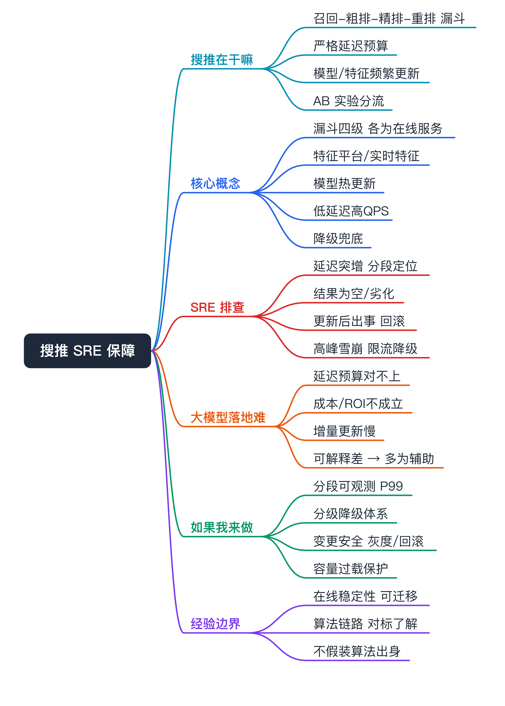
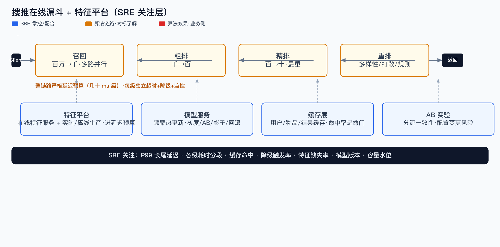
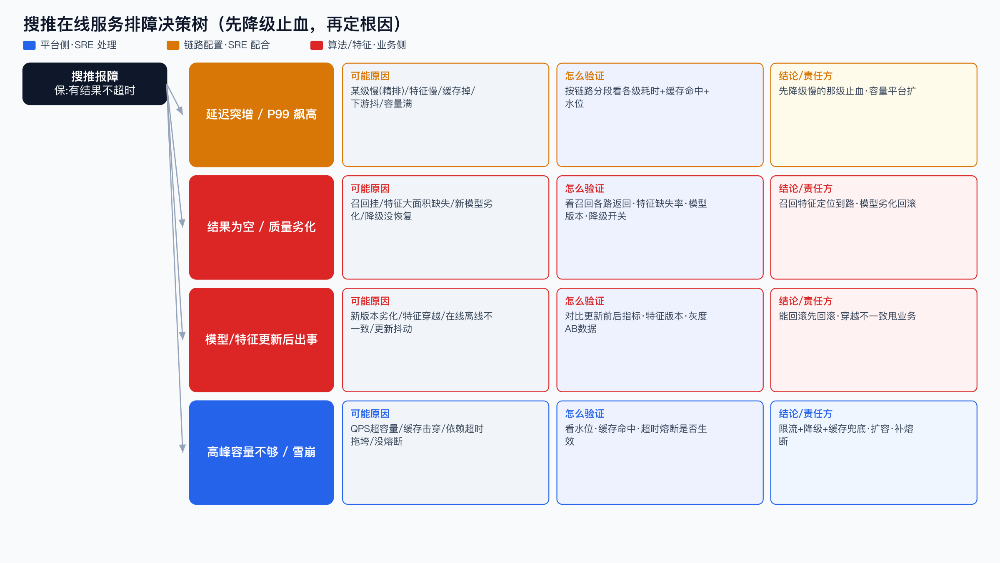
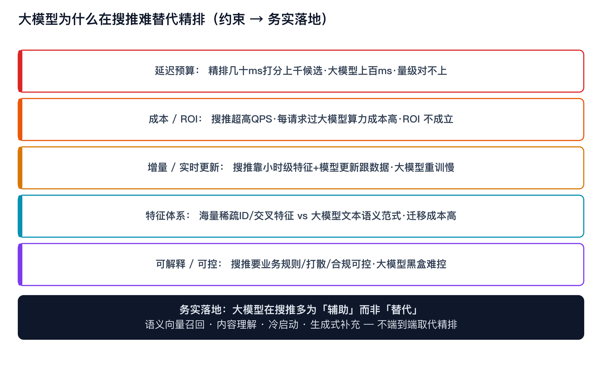

# 传统搜推系统 SRE 保障视角（含「大模型为何在搜推难落地」）面试准备



> 面得物「搜推算法团队 SRE」用。先纠偏：搜推（搜索/推荐）的 SRE 关注点和 LLM 训推**完全不是一个域**——搜推是「在线、高 QPS、低延迟、模型频繁更新、特征实时」，不是「离线长训练、大显存、慢吞吐」。别拿大模型那套硬套，要能讲清差异。

```yaml
experience_level: adjacent_production_experience
# SRE：做过在线服务/推理类负载的平台承接与稳定性（延迟、容量、降级、可观测），处理过同类问题；
# 但搜推的召回/排序算法链路、特征工程内部属对标了解，不包装成搜推算法或特征平台研发。
```

# 经验边界

- **有相邻生产经验**：在线服务稳定性、低延迟高并发、可观测、容量与降级、推理服务承接——这些通用 SRE 能力可直接迁移到搜推在线侧。
- **没有直接经验**：搜推的召回/粗排/精排/重排算法链路、特征平台、AB 实验体系，我以「理解工程语义 + 能配合排查」为边界，不声称做过搜推算法或自建特征平台。
- **面试中怎么声明**：我的迁移点是「在线推理服务的稳定性治理」，搜推的业务链路我能对标理解、能保障，但不假装是搜推算法/特征工程出身。

# 为什么需要掌握

- **搜推 SRE 的战场在「在线」**：推荐请求要在几十毫秒内走完召回→排序→重排，QPS 高、长尾敏感、模型天天更新。SRE 不懂这条链路，故障来了定位不到点。
- **和我现有经验相邻**：在线服务延迟/容量/降级/可观测这套，和我做的推理服务承接是同类问题，能直接迁移。
- **能解释「大模型为什么没替代搜推」**：理解传统搜推的工程约束（延迟、成本、增量更新），才能判断大模型在搜推的边界——这是高质量反问和判断力的来源。

# 搜推系统解决什么问题（在干嘛）

- **从海量候选里快速挑出该展示的内容**
  - 对应能力：召回（百万→千）→ 粗排（千→百）→ 精排（百→十）→ 重排（多样性/打散/业务规则）的漏斗。
  - SRE 关注点：每一级都是一个在线服务，任一级超时/挂掉都影响整体延迟和结果质量。
- **在严格延迟预算内完成**
  - 对应能力：整链路通常几十毫秒级 SLA，靠缓存、并行、超时熔断、降级兜底。
  - SRE 关注点：长尾延迟（P99）是搜推 SRE 的核心指标，不是平均值。
- **让模型实时跟上数据变化**
  - 对应能力：特征实时更新、模型频繁/近实时更新（小时级甚至分钟级）。
  - SRE 关注点：模型/特征更新是高频变更，是事故高发区（特征穿越、版本不一致、更新抖动）。
- **支撑快速试验**
  - 对应能力：AB 实验/分流。
  - SRE 关注点：分流配置错误、实验互相污染会直接影响线上。

# 核心概念

- **召回 / 粗排 / 精排 / 重排（漏斗）**：逐级缩小候选并提高精度。SRE 关注点：每级是独立在线服务，要分别有超时、降级、监控。可能追问：某级挂了怎么办？降级（跳过精排用粗排结果 / 走兜底召回 / 出热门兜底），保证有结果而非报错。
- **特征平台 / 实时特征**：在线推理要拿到用户/物品/上下文特征，分离线特征（批）和实时特征（流）。SRE 关注点：特征服务的延迟和可用性直接进延迟预算；**特征穿越**（用了未来信息）和**特征缺失**是高频问题。可能追问：在线离线特征不一致怎么排？看特征版本、生产链路、回填逻辑。
- **模型频繁更新 / 热更新**：搜推模型小时级甚至更频繁更新，在线热加载新模型。SRE 关注点：更新瞬间的抖动、新模型效果劣化、版本回滚能力。可能追问：模型上线怎么保证安全？灰度+AB+可快速回滚+影子流量验证。
- **低延迟高 QPS**：搜推在线是高并发、严延迟预算。SRE 关注点：缓存命中率、连接池、超时设置、长尾治理、容量水位。
- **降级与兜底**：搜推宁可降级出次优结果，也不能报错或超时白屏。SRE 关注点：分级降级策略（精排→粗排→热门兜底）是搜推稳定性的命门。
- **AB 实验 / 分流**：流量按策略分桶。SRE 关注点：分流一致性、配置变更风险、实验隔离。

# 核心架构



搜推在线请求是一条有严格延迟预算的链路，每段都是 SRE 的战场：

- **请求链路**：Client → 接入/网关 → 召回（多路并行）→ 粗排 → 精排 → 重排（多样性/规则）→ 返回。
- **旁路依赖**：特征平台（在线特征服务 + 实时/离线特征生产）、模型服务（频繁热更新）、缓存层（用户/物品/结果缓存）、AB 实验配置。
- **SRE 的边界**：网关、缓存、各级服务的容量/延迟/降级、特征服务可用性、模型更新安全是我能掌控/配合的；召回排序算法、特征工程逻辑、模型效果是算法业务侧。

# 核心主流程（搜推在线排查）



核心：**搜推故障优先保「有结果、不超时」，先降级止血，再定位根因。** 和大模型推理排查的差别——这里 P99 长尾和「结果为空/劣化」比吞吐更要命。

- **症状：整体延迟突增 / P99 飙高**
  - 假设：某一级服务慢（精排常见）、特征服务慢、缓存命中率掉、下游抖动、容量打满。
  - 验证：按链路分段看各级耗时（召回/粗排/精排/重排/特征），定位哪段长；看缓存命中率、QPS、容量水位。
  - 结论：先对慢的那级降级止血（如跳精排），再查根因；容量问题平台扩，算法逻辑变慢甩业务。

- **症状：结果为空 / 推荐质量劣化**
  - 假设：召回挂了/召回为空、特征大面积缺失、新模型效果劣化、降级被触发后没恢复。
  - 验证：看召回各路返回量、特征缺失率、模型版本与上线时间、降级开关状态。
  - 结论：召回/特征是否异常→定位到具体路；模型劣化→回滚；降级误触发→恢复。

- **症状：模型 / 特征更新后出事**
  - 假设：新模型版本劣化、特征穿越、在线离线特征不一致、更新瞬间抖动。
  - 验证：对比更新前后指标、看特征版本与生产链路、看灰度/AB 数据。
  - 结论：能回滚先回滚（搜推变更最该有一键回滚）；穿越/不一致是特征生产问题，连证据甩业务。

- **症状：高峰期容量不够 / 雪崩**
  - 假设：QPS 超容量、缓存击穿、某依赖超时拖垮上游、没熔断。
  - 验证：看水位、缓存命中、超时/熔断是否生效、线程/连接池。
  - 结论：限流+降级+缓存兜底保护；扩容；补熔断。搜推宁降级不雪崩。

# 大模型为什么在搜推难落地（专题 · 反问弹药）



这既是判断题，也是给面试官的高质量反问（「你们搜推有没有走大模型，遇到这些约束怎么权衡？」）。大模型在搜推难直接替代传统链路，核心约束：

- **延迟预算**：搜推精排要在几十毫秒内对成百上千候选打分，大模型单次推理动辄上百毫秒，量级对不上。
- **成本/ROI**：搜推 QPS 极高，每次请求过大模型的算力成本远高于传统模型，ROI 通常不成立。
- **增量/实时更新**：搜推靠特征和模型的小时级甚至更快更新跟上数据，大模型重训/更新慢、增量难。
- **特征体系**：搜推几十年沉淀的海量稀疏 ID 特征、交叉特征，和大模型的文本/语义输入范式不同，迁移成本高。
- **可解释/可控**：搜推要可控（业务规则、打散、合规），大模型黑盒、不可控性高。
- **务实落地方式**：大模型在搜推更多是「**辅助**」而非「替代」——做特征增强（语义向量召回）、冷启动、内容理解、生成式补充，而不是端到端取代精排。

> 反问话术：我观察大模型在搜推更多走「辅助召回/内容理解」而不是替代精排，因为延迟和成本量级对不上。想了解咱们团队在这块的真实落地边界——是已经规模化，还是也卡在延迟/ROI 这些约束上？

# 如果让我做搜推 SRE，我会关注什么（假设，非已落地）

- **可观测**：按链路分段采各级延迟（召回/粗排/精排/重排/特征）、P99 长尾、缓存命中、降级触发率、模型版本、特征缺失率——让「哪段慢、哪段空」一眼可见。
- **降级体系**：建分级降级（精排→粗排→热门兜底）+ 一键开关 + 自动触发阈值，把「宁降级不报错」做成机制。
- **变更安全**：模型/特征更新走灰度+AB+影子流量+一键回滚，把高频变更的事故面压下来。
- **容量与过载保护**：按 P99 和水位做容量规划、限流、熔断、缓存兜底，防高峰雪崩。
- **特征可用性**：在线特征服务的 SLA、在线离线一致性校验、穿越检测。

# 和我现有经验的映射（后置）

- **在线服务延迟/容量/降级/可观测**：真实经验映射=推理服务承接 + 平台稳定性；能怎么说=这套能力直接迁移到搜推在线侧。
- **搜推漏斗 / 召回排序 / 特征工程**：弱映射；能怎么说=对标理解工程语义、能保障和排查，不假装算法/特征出身。
- **大模型搜推落地**：理论判断 + 行业观察；能怎么说=能讲清约束（延迟/成本/增量/可解释），不编造落地案例。

# 面试话术

主回答：搜推的算法链路我不是出身，这点先说清楚。但搜推 SRE 的核心战场是「在线」——几十毫秒延迟预算、高 QPS、模型天天更新、宁降级不报错，这套在线服务稳定性治理和我做的推理服务承接是同类问题，能直接迁移。我会按链路分段看延迟、建分级降级、把模型/特征更新做成灰度+可回滚。和大模型不同，搜推 SRE 关注 P99 长尾和结果质量，不是吞吐。至于大模型在搜推，我观察更多是辅助召回/内容理解，因为延迟和成本量级和精排对不上。

简答：

- **你做过搜推吗？** 算法链路不是我出身，但在线服务稳定性这套我熟，能迁移过来保障搜推在线侧。
- **搜推和大模型推理 SRE 有什么不同？** 搜推在线、低延迟高 QPS、模型频繁更新、宁降级不报错，关注 P99；大模型离线训练吃显存、推理关注吞吐。
- **精排服务挂了怎么办？** 降级：跳精排用粗排结果 / 走兜底召回 / 出热门，保证有结果不报错。
- **模型上线怎么保证安全？** 灰度 + AB + 影子流量验证 + 一键回滚。
- **大模型能替代搜推吗？** 短期难直接替代精排（延迟/成本/增量/可解释约束），更多做辅助召回和内容理解。

# 不能怎么说

| 不要这么说 | 风险 | 应该这么说 |
|---|---|---|
| 我做过搜推召回/排序算法 | 没算法经验会被击穿 | 我做在线服务稳定性，算法链路是对标理解 |
| 我自建过特征平台 | 没证据 | 我理解特征服务的 SRE 关注点，能保障可用性 |
| 大模型已全面替代搜推 | 外行判断 | 大模型在搜推多是辅助，受延迟/成本约束 |
| 搜推和大模型 SRE 差不多 | 暴露不懂 | 两者在线/离线、延迟/吞吐关注点完全不同 |

# 高频 QA

- **搜推系统的整体链路是什么？** 召回→粗排→精排→重排的漏斗，每级是在线服务，有严格延迟预算。
- **搜推 SRE 最核心的指标？** P99 长尾延迟 + 结果可用性（不为空/不劣化）+ 降级触发率，不是平均延迟或吞吐。
- **为什么搜推强调降级？** 几十毫秒预算下，某级慢/挂必须降级出次优结果，宁可质量降一点也不能超时白屏。
- **特征穿越是什么，为什么危险？** 训练/在线用了不该用的未来信息，导致线上效果和离线评估对不上，是搜推高频隐患。
- **模型频繁更新带来什么 SRE 挑战？** 高频变更=高事故面，要灰度、AB、影子流量、一键回滚来压风险。
- **延迟突增怎么排查？** 按链路分段看各级耗时定位慢的那级，先降级止血，再查是容量、缓存还是依赖抖动。
- **结果为空怎么排查？** 看召回各路返回量、特征缺失率、降级开关状态，定位是召回挂了、特征缺失还是降级误触发。
- **大模型为什么难替代精排？** 延迟（百毫秒 vs 几十毫秒）、成本（高 QPS 算力）、增量更新慢、特征范式不同、可解释差。
- **大模型在搜推能做什么？** 辅助：语义向量召回、内容理解、冷启动、生成式补充，不是端到端替代。
- **你的搜推经验边界在哪？** 在线服务稳定性能迁移，算法链路和特征工程是对标理解，不假装算法出身。

# 图示清单

- `00_search_rec_overview_mindmap.png` — 全文总览思维导图（P0）。
- `01_search_rec_architecture.png` — 搜推在线漏斗 + 特征平台 + SRE 关注层（强制）。
- `02_search_rec_troubleshooting.png` — 搜推在线服务排障决策树（强制）。
- `03_search_rec_llm_gap.png` — 大模型搜推落地约束（P1，反问弹药）。

# 面试前检查清单

- [ ] 明确声明：在线服务稳定性可迁移，搜推算法链路是对标理解。
- [ ] 能讲清召回→粗排→精排→重排漏斗，每级是在线服务。
- [ ] 能说清搜推 SRE 关注 P99 长尾 + 可用性，不是吞吐。
- [ ] 能讲分级降级（精排→粗排→热门兜底）这个稳定性命门。
- [ ] 能讲模型/特征更新的变更安全（灰度/AB/影子/回滚）。
- [ ] 能把搜推 SRE 和大模型训推 SRE 的差异讲清楚。
- [ ] 能讲大模型在搜推落地的约束（延迟/成本/增量/可解释）并转成反问。
- [ ] 没编造搜推算法/特征平台经验。
- [ ] 文档含在线链路架构图 + 排障决策树图。
