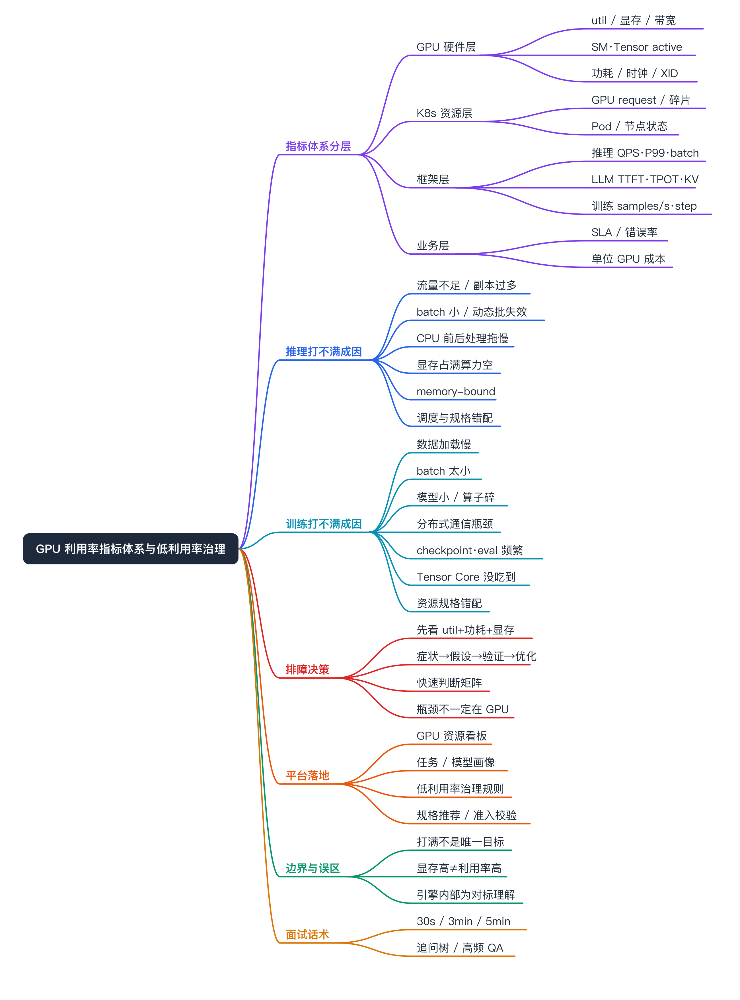
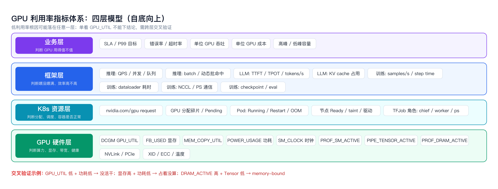
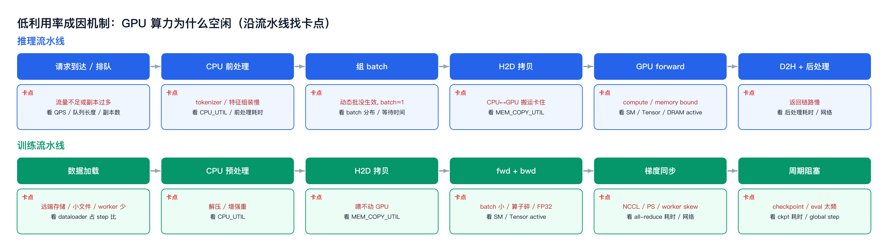
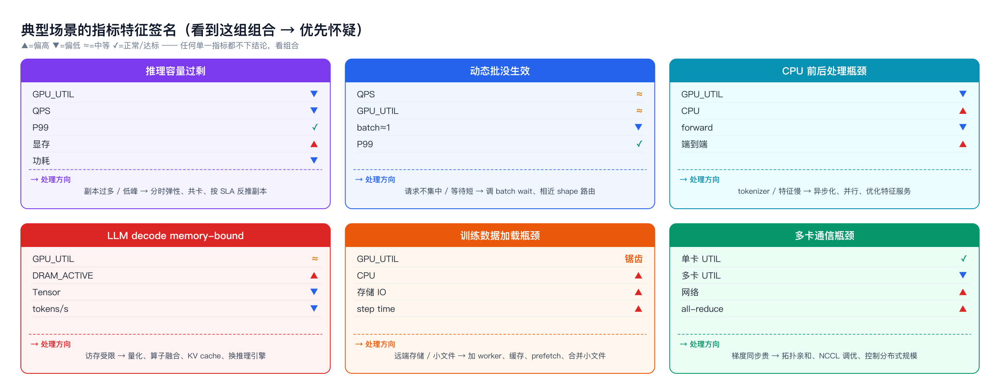
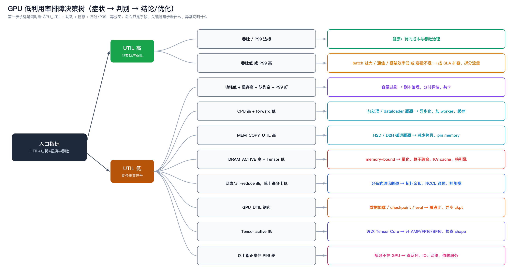
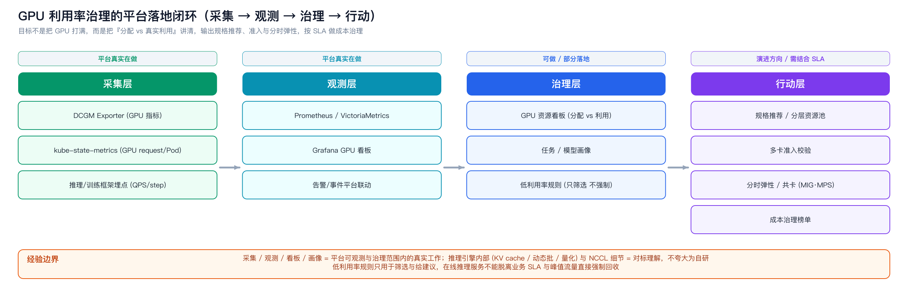

# GPU 利用率指标体系与低利用率治理 面试准备



# 面试定位卡

- **技术点**：GPU 利用率指标体系，以及推理 / 训练场景下低利用率的根因定位与治理。
- **所属领域**：AI Infra 可观测、Kubernetes GPU 资源治理、FinOps 成本治理。
- **面试价值**：能体现“不止会看一条 GPU util 曲线”，而是有分层指标体系、根因排查方法论和平台落地闭环；推理稳定性 / 训练效率 / 成本治理三个方向都能展开。
- **常见考法**：GPU 利用率低怎么排查；为什么显存占满但利用率低；多卡训练为什么变慢；推理要不要把 GPU 打满；如何治理一批长期低利用率的 GPU 任务。
- **适合挂钩项目**：训推平台（K8s / TFJob / KubeDL 承载训练，容器化推理）、可观测平台（DCGM / Prometheus / Grafana）、FinOps 成本治理。
- **不适合夸大的地方**：推理引擎内部实现（vLLM 的 KV cache / 连续批处理调度、量化算子）和 NCCL 通信底层细节属于对标理解，不能说成自研；低利用率“强制回收”不能脱离业务 SLA。

# 三十秒回答

GPU 是否打满不是唯一目标。我会把 GPU 利用率拆成四层来看：底层是 DCGM 采集的硬件指标（util、显存、显存带宽、SM / Tensor active、功耗、XID），往上是 K8s 资源层（GPU request、分配碎片、Pod / 节点状态），再往上是框架层（推理看 QPS / P99 / batch / TTFT / TPOT / KV cache，训练看 samples/s / step time / dataloader / 通信 / checkpoint），最上面是业务层（SLA、错误率、单位 GPU 成本）。低利用率的根因可能落在任意一层，所以我从来不会只看一条 util 曲线下结论，而是用 util + 功耗 + 显存 + 吞吐做交叉验证，再沿数据和计算流水线找卡点。代价是这套体系建设和埋点成本不低，需要采集、看板、画像配套；收益是能把“资源浪费、流量不足、系统瓶颈”三种情况区分开。我重点关注的是在线推理（不能为打满 GPU 牺牲 P99）和分布式训练（数据加载和通信经常才是真凶）。

# 为什么需要它

- **没有它之前的问题**：只看 `GPU Utilization` 一条曲线，无法回答“低利用率到底是资源浪费、业务流量不足，还是系统瓶颈”。util 低可能是没流量，也可能是 CPU 喂不动、数据加载慢、通信卡住、显存带宽撞墙；util 高也可能吞吐很差。单点指标会让平台做出错误的扩容 / 回收决策。
- **它的解决方式**：建立分层指标体系（硬件 → K8s → 框架 → 业务），用多个指标的组合“签名”定位根因，并沿请求 / 数据流水线找卡点，而不是用单一阈值判断。
- **它引入的新问题**：采集和埋点成本（DCGM Exporter、kube-state-metrics、框架埋点）、指标存储与看板维护、Pod 级指标在 GPU 共享（time-slicing / MPS）下会失真、规则误判风险（低峰被当成浪费）。
- **必须关注的场景**：在线推理（延迟 SLA 优先，不能为打满牺牲 P99）、分布式训练（数据加载与通信瓶颈）、推荐 / 搜广推模型（上游特征服务喂不满）、低流量小模型独占大卡（成本治理重点）。

# 适用背景

本文档面向以下技术栈与规模：

- Kubernetes / ACK 托管 GPU 任务
- TFJob / KubeDL 承载训练任务
- 推理服务以容器化方式部署，可能覆盖推荐模型、传统深度学习模型、LLM 推理服务
- Prometheus / VictoriaMetrics / Grafana 作为观测体系
- GPU 指标建议以 NVIDIA DCGM Exporter 为基础采集
- 平台侧需要回答：GPU 是否被合理使用，低利用率到底是资源浪费、业务流量不足，还是系统瓶颈导致

核心观点：

GPU 是否“打满”不是唯一目标。推理场景优先看 SLA、吞吐、延迟和单位成本；训练场景更适合追求长时间高利用率，但也必须排除数据加载、通信、checkpoint、eval 等非计算阶段。

# 核心概念表

- **GPU Utilization（DCGM_FI_DEV_GPU_UTIL）**：采样周期内有 kernel 在跑的时间占比。
  - 面试展开点：它只表示“有没有在执行”，不代表算力吃满。一个只用 5% SM 的 kernel 一直在跑，util 也是 100%。所以必须配 SM active / Tensor active 才能判断算力是否真用上。
- **SM Active（PROF_SM_ACTIVE）**：流多处理器活跃比例，比 util 更接近真实算力占用。
  - 面试展开点：util 高但 SM active 低 = 算子碎、kernel 占着但没干活。
- **Tensor Active（PIPE_TENSOR_ACTIVE）**：Tensor Core 流水线活跃度。
  - 面试展开点：Tensor active 低说明没吃到混合精度 / Tensor Core，可能在跑 FP32 或 shape 不对齐。
- **DRAM Active（PROF_DRAM_ACTIVE）**：显存带宽活跃度，判断是否 memory-bound。
  - 面试展开点：LLM decode 阶段、Embedding-heavy 推荐模型常常是 memory-bound，util 中等但 tensor 低、DRAM 高。
- **compute-bound vs memory-bound**：瓶颈在算力还是在访存。
  - 面试展开点：两者的优化方向完全不同，前者加 batch / 算子融合，后者量化 / KV cache / 换引擎。
- **功耗（POWER_USAGE）**：辅助判断是否真在计算的“测谎”指标。
  - 面试展开点：util 低 + 功耗低 = 真没活；显存高 + 功耗低 = 占着没算。
- **dynamic batching / 连续批处理**：把多个请求合并成一个 batch 提升吞吐。
  - 面试展开点：batch 长期接近 1 是推理打不满最常见原因；LLM 要区分 prefill 与 decode。
- **GPU 共享（MIG / MPS / time-slicing）**：把一张卡切给多个负载。
  - 面试展开点：能提升小模型 / 低流量场景的利用率，但 Pod 级 GPU 指标会失真，需要注意。
- **GPU 分配碎片**：有空闲卡但调度不上（request 形态不匹配）。
  - 面试展开点：这是“分配率高、利用率低”的典型来源，属于调度问题不是 GPU 问题。

# 原理模型：指标四层体系



建议不要只看 `GPU Utilization`。GPU 低利用率的根因可能在 CPU、IO、网络、batch、模型结构、存储、通信链路甚至调度策略上。自底向上分四层，任意一层都可能是真凶，必须跨层交叉验证。

## GPU 硬件层指标

| 维度 | 指标 | 说明 |
|---|---|---|
| GPU 使用率 | `DCGM_FI_DEV_GPU_UTIL` | 粗粒度判断 GPU 是否繁忙。适合作为入口指标，但不能单独作为结论。 |
| 显存使用 | `DCGM_FI_DEV_FB_USED` / `FB_USED_PERCENT` | 判断显存是否被模型常驻占用，或者是否存在显存压力。 |
| 显存拷贝 | `DCGM_FI_DEV_MEM_COPY_UTIL` | 判断是否卡在 CPU 到 GPU、GPU 到 CPU 的数据搬运。 |
| 功耗 | `DCGM_FI_DEV_POWER_USAGE` | 辅助判断 GPU 是否真的在做计算。GPU util 低、功耗也低，通常说明没活；功耗高但吞吐低，可能是效率问题。 |
| 时钟 | `DCGM_FI_DEV_SM_CLOCK` / `DCGM_FI_DEV_MEM_CLOCK` | 判断是否存在降频、功耗墙、温度墙或驱动策略问题。 |
| SM 活跃度 | `DCGM_FI_PROF_SM_ACTIVE` | 更接近判断 GPU 计算单元是否真的在执行 kernel。 |
| Tensor Core 活跃度 | `DCGM_FI_PROF_PIPE_TENSOR_ACTIVE` | 判断 Transformer、CNN、大矩阵乘等是否吃到了 Tensor Core。 |
| 显存带宽活跃度 | `DCGM_FI_PROF_DRAM_ACTIVE` | 判断是否 memory-bound。 |
| 多卡通信 | NVLink / PCIe TX、RX bytes | 多卡训练、多机训练判断通信瓶颈。 |
| 健康状态 | XID、ECC、温度、重启次数 | 排除坏卡、驱动异常、降频、容器重启等问题。 |

## Kubernetes 资源层指标

| 维度 | 指标 | 说明 |
|---|---|---|
| GPU request | `nvidia.com/gpu` request | 判断 GPU 资源被哪些 Pod 申请。 |
| GPU 分配碎片 | 节点可用 GPU、Pod request、Pending event | 判断是否有卡空闲但调度不上。 |
| Pod 状态 | Pending / Running / Restart / OOMKilled / Evicted | 排除平台调度与容器异常。 |
| 节点状态 | Node Ready、GPU 节点 taint、驱动状态 | 判断是否是节点不可用或污点不匹配。 |
| 任务状态 | TFJob phase、worker/chief/ps/evaluator 状态 | 训练场景必须按角色拆开看。 |

## PromQL 示例

```promql
# GPU 节点维度使用率
avg by (cluster, node, gpu) (
  DCGM_FI_DEV_GPU_UTIL
)

# GPU 显存占用
avg by (cluster, node, gpu) (
  DCGM_FI_DEV_FB_USED
)

# GPU 功耗
avg by (cluster, node, gpu) (
  DCGM_FI_DEV_POWER_USAGE
)

# 如果 DCGM Exporter 能关联 Pod 标签，可看 Pod 维度 GPU 使用率
avg by (cluster, namespace, pod) (
  DCGM_FI_DEV_GPU_UTIL
)

# GPU request 分配情况
sum by (cluster, namespace, pod) (
  kube_pod_container_resource_requests{resource="nvidia_com_gpu"}
)
```

注意：

- 如果使用 GPU time-slicing 或共享 GPU，Pod 级 GPU 指标可能失真。
- GPU 平均使用率要和业务高峰、低峰、SLA、队列长度一起看。
- 推理场景不能为了打满 GPU 牺牲 P99。
- 训练场景不能只看瞬时 GPU util，要看 step time、samples/s、checkpoint、数据加载与通信耗时。

## 框架层：推理与训练分别看哪些

推理场景的核心不是“GPU 是否满载”，而是在满足延迟 SLA 的前提下，单位 GPU 能承载多少吞吐。

| 层级 | 指标 | 说明 |
|---|---|---|
| 业务入口 | QPS、并发请求数、请求队列长度、错误率、超时率 | 判断流量是否足够、请求是否排队。 |
| 延迟 | P50 / P95 / P99、排队时间、模型执行时间、前后处理时间 | 区分瓶颈在排队、模型计算，还是业务逻辑。 |
| LLM 专用 | TTFT、TPOT、tokens/s、input tokens、output tokens | TTFT 看首 token，TPOT 看生成阶段速度，tokens/s 看整体吞吐。 |
| Batch | batch size、dynamic batch 命中率、batch wait time | batch 太小是 GPU 打不满的常见原因。 |
| KV Cache | KV cache usage、cache hit、eviction | LLM 推理需要重点看 KV cache 是否限制并发。 |
| GPU | GPU util、SM active、Tensor active、显存、显存带宽、功耗 | 判断算力、显存、带宽和功耗状态。 |
| CPU / IO | CPU util、tokenizer 耗时、特征查询耗时、网络耗时 | 很多推理服务实际瓶颈在 CPU 或外部依赖。 |

如果是推荐、广告、搜索排序这类模型，GPU 不满经常不是 GPU 自身问题，而是链路上游喂不满：

| 指标 | 说明 |
|---|---|
| 特征拉取耗时 | 是否等待 Redis、Feature Store、参数服务、Embedding 服务。 |
| 特征组装耗时 | CPU 侧拼特征、序列化、反序列化可能成为瓶颈。 |
| 模型 forward latency | 真实 GPU 计算耗时。 |
| H2D / D2H copy time | CPU 与 GPU 之间的数据搬运耗时。 |
| batch size 分布 | 小 batch 会导致 GPU kernel 启动频繁但算力利用不足。 |
| 粗排 / 精排耗时拆分 | 判断是否某一层模型或某个服务拖慢整体。 |

训练场景比推理更关注 GPU 是否长时间稳定工作，但也不能只看 GPU util。核心指标是 samples/s、steps/s、step time、GPU util、数据加载耗时、通信耗时、checkpoint 耗时。

| 层级 | 指标 | 说明 |
|---|---|---|
| 任务状态 | TFJob phase、worker/chief/ps/evaluator 状态、Pod restart、退出码 | 先确认任务是否正常运行。 |
| 训练吞吐 | samples/s、steps/s、step time | 比 GPU util 更能说明训练效率。 |
| GPU | GPU util、SM active、Tensor active、显存、显存带宽 | 判断算力、显存、kernel、带宽状态。 |
| 数据输入 | dataloader time、CPU util、磁盘/对象存储/NAS/CPFS 吞吐 | 数据喂不满是训练低利用率常见原因。 |
| 分布式通信 | NCCL all-reduce time、PS 请求耗时、网络吞吐、worker step skew | 多卡、多机训练重点看通信。 |
| Checkpoint | checkpoint duration、checkpoint frequency、写存储耗时 | checkpoint 会周期性拉低 GPU 使用率。 |
| Eval | eval duration、eval frequency | 周期性评估可能导致训练 GPU 空闲。 |
| TensorBoard | loss、learning rate、global step、step time | 判断任务是否正常推进。 |
| K8s | Pending、OOMKilled、Evicted、node pressure、GPU 分配碎片 | 排除平台层问题。 |

# 关键机制：低利用率成因



把 GPU 算力为什么空闲，沿“请求 / 数据 → 前处理 → 组 batch / H2D → GPU 计算 → 通信 / 后处理 → 周期阻塞”这条流水线逐段找卡点。每个阶段都对应一组该看的指标。

## 推理打不满的成因

### 流量不足或副本过多

表现：

```text
GPU_UTIL 低
请求队列低
QPS 低
P99 很好
显存占用高
```

解决的问题 / 工作方式：识别“容量过剩”，区别于“系统瓶颈”。常见根因是副本数过多、流量低峰、模型常驻显存但没有足够请求、HPA 或手动扩容过于保守。

判断方式：看单 GPU QPS / tokens/s；看请求队列是否长期为空；看 P99 是否远低于 SLA；看 GPU 显存占用是否高但功耗低。

代价 / 处理方向：按 SLA 反推副本数；低流量模型合并部署；考虑 MIG、MPS、time-slicing 或多模型共卡；做高峰、低峰分时容量管理。

面试追问：怎么证明是容量过剩而不是被限流？答：队列长期为空 + P99 远低于 SLA + 功耗低，三者同时成立。

### batch 太小，dynamic batching 没生效

表现：

```text
QPS 不低
GPU_UTIL 中低
batch size 长期接近 1
P99 可能不高
```

原因：请求到达不集中；batch wait time 设置太短；请求 shape 差异大；不同模型、不同参数、不同输入长度无法合 batch；在线延迟要求太严，不敢等待 batch。

处理方向：看 batch size 分布而不是平均值；调整 batch wait time；将相近 shape 或相近模型路由到同一组实例；对 LLM 推理区分 prefill 与 decode；在 SLA 允许范围内提升 batching 命中率。

### CPU 前处理 / 后处理拖慢

表现：

```text
GPU_UTIL 低
CPU_UTIL 高
模型 forward latency 低
端到端 latency 高
```

原因：tokenizer 慢；特征组装慢；图片、文本预处理慢；Python 单进程或 GIL 限制；JSON / Protobuf 序列化过重；推荐场景等待特征服务、Embedding、参数服务。

处理方向：拆分端到端 latency（前处理、模型计算、后处理、网络）；tokenizer 并行化；前处理异步化；优化特征服务访问；减少序列化开销；把部分预处理下沉到 GPU 或提前离线处理。

### 显存占着，但计算没跑满

表现：

```text
FB_USED 高
GPU_UTIL 低
POWER_USAGE 低或中等
```

原因：模型常驻显存；请求不足；batch 不足；推理服务为峰值容量预留，低峰自然空闲。

判断：如果 P99 很好、队列为空、QPS 低，这是容量过剩；如果 P99 差、GPU util 低，则需要继续查 CPU、IO、batch、网络。

处理方向：做分时弹性；多模型共卡；使用更合适的 GPU 规格；优化模型副本数。不要简单把“显存占用高”理解成“GPU 利用率高”。

### memory-bound，不是 compute-bound

表现：

```text
GPU_UTIL 中等
DRAM_ACTIVE 高
PIPE_TENSOR_ACTIVE 不高
tokens/s 上不去
```

原因：LLM decode 阶段偏 memory-bound；推荐模型中 Embedding lookup 较多；模型算子访存占比高；显存带宽成为瓶颈。

处理方向：看 DRAM active 和 Tensor active；优化 batch、KV cache、模型结构；使用更适合的推理引擎；考虑量化、算子融合、KV cache 优化。

### 调度和资源形态不合理

表现：

```text
部分 GPU 空闲
部分 GPU 高负载
小模型独占大卡
低流量服务占用完整 GPU
```

原因：一个小模型独占一张大卡；多个低流量模型各占一张卡；没有 GPU 共享能力；GPU 型号和模型规格不匹配；HPA 只按 CPU 扩缩容，不看 GPU、队列、tokens/s。

处理方向：建立模型资源画像；小模型合并部署；低流量服务共卡；用队列长度、QPS、tokens/s、P99 驱动弹性；GPU 型号分层（小模型、小流量、大模型、高吞吐分池管理）。

## 训练打不满的成因

### 数据加载慢

表现：

```text
GPU_UTIL 周期性锯齿
CPU 高
磁盘 / 网络 IO 高
step time 不稳定
```

原因：数据从远端 NAS / OSS / CPFS / JFS 拉取慢；小文件太多；dataloader worker 太少；数据解压、解析、增强在 CPU 上太重；没有预取、缓存；shuffle buffer 配置不合理。

处理方向：看 dataloader time 占 step time 的比例；增加 dataloader worker；使用本地缓存或高吞吐共享存储；合并小文件；使用 prefetch；将重 CPU 预处理前置到离线阶段。

### batch size 太小

表现：

```text
GPU_UTIL 低
显存占用低
step time 不长
samples/s 低
```

原因：batch 太小，矩阵计算规模不够；kernel 启动开销占比高；显存没有充分使用；算法侧为了收敛保守设置 batch。

处理方向：尝试增大 batch size；使用 gradient accumulation；使用 mixed precision；配合算法侧确认收敛影响。不要平台侧盲目改 batch。

### 模型太小或算子太碎

表现：

```text
GPU_UTIL 低
SM_ACTIVE 不高
大量小 kernel
CPU 调度开销明显
```

原因：模型规模太小；Embedding-heavy 模型查表多、计算少；算子碎片多；CPU 调度 kernel 的开销占比高；推荐模型、传统深度学习模型不一定天然适合高 GPU 利用率。

处理方向：做算子融合；合并小 batch；调整模型结构；对小模型考虑 CPU 或更小 GPU。不要用大模型训练的 GPU 利用率标准衡量所有模型。

### 分布式通信瓶颈

表现：

```text
单卡训练 GPU 利用率可以
多卡后 GPU 利用率下降
网络流量高
step time 被 all-reduce 或 PS 拉长
```

原因：梯度同步开销大；多机网络带宽不足；NCCL 配置问题；PS 架构下参数服务成为瓶颈；worker 之间 step time 不均衡，快 worker 等慢 worker；节点拓扑不合理，没有放在同一高速网络域。

处理方向：看 all-reduce time；看 PS CPU、内存、网络、RPC latency；看 worker step skew；做节点亲和，尽量让多卡训练在同一台或同一网络拓扑内；优化 NCCL 参数；控制分布式规模，不是 worker 越多越快。

### checkpoint / eval 太频繁

表现：

```text
GPU_UTIL 周期性掉到 0
TensorBoard global step 暂停
存储写入高
```

原因：checkpoint 频率太高；checkpoint 文件太大；共享存储写入慢；eval 和 train 资源竞争；导出模型、保存 embedding 阻塞主流程。

处理方向：调整 checkpoint 频率；使用异步 checkpoint；优化存储吞吐；拆分 train 与 eval 资源；监控 checkpoint duration。

### 混合精度 / Tensor Core 没吃到

表现：

```text
GPU_UTIL 看着不低
PIPE_TENSOR_ACTIVE 低
吞吐不理想
```

原因：仍在使用 FP32；batch 或 shape 不适合 Tensor Core；框架、CUDA、cuDNN、算子实现不合适；没有启用 AMP / FP16 / BF16；算子没有走高性能实现。

处理方向：看 Tensor Core active；开启 AMP / FP16 / BF16；检查模型 shape 是否适合；检查框架与 CUDA/cuDNN 版本；使用 profiler 定位低效算子。

### 资源规格错配

表现：

```text
GPU 利用率长期偏低
显存占用低
任务吞吐一般
资源成本高
```

原因：小模型申请大卡；单卡任务申请多卡；多机训练网络条件不足；GPU 节点 CPU 太弱，喂不动 GPU；本地盘、云盘、网络存储吞吐不够；GPU 型号与模型类型不匹配。

处理方向：建立训练任务画像；记录模型、batch、GPU 型号、samples/s、step time；形成推荐规格；做准入校验（申请多卡前要求证明单卡瓶颈）；对低效任务给出调参建议，而不是简单扩容。

## TFJob / KubeDL 角色拆分

对于 TFJob / KubeDL，不能只看 worker GPU：

```text
chief：是否卡在协调、保存 checkpoint、创建 session
worker：GPU util、step time、samples/s
ps：CPU、内存、网络、RPC 延迟
evaluator：是否抢资源、是否拖慢主流程
```

如果出现：

```text
只有一个 worker 在跑
其他 worker 没日志
TensorBoard global step 停止更新
GPU 使用率下降
```

不要先怀疑 GPU。更应该排查：chief 是否卡住；worker 是否在等 PS；PS 是否网络或 CPU 打满；数据源是否卡住；分布式 rendezvous 是否卡住；Pod 是否重启、驱逐、Pending；checkpoint 或 eval 是否阻塞主流程。

# 横向对比

- **GPU util vs SM active vs Tensor active**：util 只说明“有 kernel 在跑”，SM active 说明“计算单元忙不忙”，Tensor active 说明“有没有吃到 Tensor Core”。面试常考“util 100% 是不是就满了”，答案是不一定。
- **compute-bound vs memory-bound**：前者受算力限制（看 SM / Tensor active），后者受显存带宽限制（看 DRAM active）。优化方向相反：算力受限加 batch / 融合算子，访存受限做量化 / KV cache / 换引擎。
- **推理 vs 训练目标**：推理追求“SLA 下单位 GPU 吞吐”，宁可不打满也要保 P99；训练追求“长时间高 samples/s”，但要排除数据加载、通信、checkpoint 等非计算阶段。
- **均值 util vs 尾部 / 时间分布**：平均 util 会掩盖锯齿（数据加载 / checkpoint）和高低峰，必须看时间序列与分布。
- **分配率 vs 利用率**：GPU 分配率高不代表利用率高，分配碎片会让“卡都占了但没人用”。这是调度问题，不是 GPU 问题。
- **显存占用 vs 利用率**：显存高只说明模型常驻，和算力是否在跑无关，必须配功耗 / SM active 判断。
- **HPA 按 CPU vs 按 GPU / 队列 / tokens/s**：GPU 服务用 CPU 指标扩缩容容易误判，应该用队列长度、QPS、tokens/s、P99 驱动弹性。

# 典型业务场景



每个场景都有一组指标“签名”，看到这组组合就优先怀疑对应根因，再去验证。任何单一指标都不下结论。

- **推理容量过剩**：UTIL 低 + QPS 低 + P99 好 + 显存高 + 功耗低。多为副本过多或低峰。排查看单 GPU QPS、队列、P99 余量。优化做分时弹性、共卡、按 SLA 反推副本。
- **动态批没生效**：QPS 不低 + UTIL 中低 + batch≈1。排查看 batch size 分布、batch wait time、请求 shape。优化调等待时间、相近 shape 路由。
- **CPU 前后处理瓶颈**：UTIL 低 + CPU 高 + forward 低 + 端到端高。多为 tokenizer / 特征组装慢。优化做异步化、并行、优化特征服务。
- **LLM decode memory-bound**：UTIL 中 + DRAM active 高 + Tensor active 低 + tokens/s 低。优化做量化、算子融合、KV cache、换推理引擎。
- **训练数据加载瓶颈**：UTIL 锯齿 + CPU 高 + 存储 IO 高 + step time 抖。优化加 dataloader worker、缓存、prefetch、合并小文件。
- **多卡通信瓶颈**：单卡 UTIL 好 + 多卡 UTIL 降 + 网络高 + all-reduce 长。优化做拓扑亲和、NCCL 调优、控制分布式规模。

# 排障路径



排障的第一步永远是同时看 GPU_UTIL + 功耗 + 显存 + 吞吐 / P99，再分叉。命令只是手段，关键是每一步“看什么、异常说明什么”。

排查顺序按“症状 → 假设 → 验证 → 指标 → 结论 → 优化 → 复测”推进：

- **症状**：先界定是 util 低、util 高吞吐低、还是 util 锯齿。
- **假设 + 验证**：
  - util 高但吞吐低 / P99 高 → 怀疑 batch 过大、通信 / 框架效率低或容量不足，验证 Tensor active 与队列。
  - util 低 + 功耗低 + 显存高 + 队列空 + P99 好 → 容量过剩。
  - util 低 + CPU 高 → 前处理 / dataloader 瓶颈。
  - util 低 + MEM_COPY 高 → H2D / D2H 搬运瓶颈。
  - util 中 + DRAM active 高 + Tensor 低 → memory-bound。
  - 单卡高多卡低 + 网络 / all-reduce 高 → 分布式通信瓶颈。
  - util 锯齿 → 数据加载 / checkpoint / eval。
  - Tensor active 低 → 没吃 Tensor Core / 精度 / shape 问题。
  - 以上都正常但 P99 差 → 瓶颈不在 GPU，查队列、IO、网络、依赖服务。
- **结论 + 优化 + 复测**：定位后给处理方向并复测对应指标，确认 util / 吞吐 / P99 改善。

## 快速判断矩阵

| 现象 | 大概率原因 |
|---|---|
| GPU util 低，QPS 低，P99 很好 | 推理副本过多 / 流量不足 |
| GPU util 低，CPU 高 | tokenizer、特征组装、dataloader、前后处理瓶颈 |
| GPU util 低，显存占用高 | 模型常驻显存但请求不足 / batch 不足 |
| GPU util 锯齿状 | 数据加载、checkpoint、eval、batch 波动 |
| GPU util 低，MEM_COPY 高 | CPU-GPU 数据搬运瓶颈 |
| GPU util 中等，DRAM_ACTIVE 高 | memory-bound，不是计算不够 |
| GPU util 低，NVLink / PCIe / 网络高 | 多卡通信瓶颈 |
| 单卡高，多卡低 | all-reduce / PS / worker skew |
| Tensor active 低 | 没吃到 Tensor Core、精度 / shape / 算子问题 |
| GPU util 高，但业务吞吐低 | batch、框架、通信、前后处理效率问题 |
| P99 差但 GPU util 低 | 多半瓶颈不在 GPU，要查 CPU、IO、队列、网络、依赖服务 |
| GPU util 高但 P99 也高 | 可能容量不足、batch 过大、队列堆积，需要按 SLA 扩容或拆分流量 |

# 风险、边界和误区

- **“GPU util 100% 就说明满了”**：问题在于 util 只表示有 kernel 在跑。更稳妥的表达：util 高只能说明 GPU 在忙，要看 SM active / Tensor active 才知道算力有没有真的吃满。
- **“显存占用高 = 利用率高”**：显存常驻和算力无关。更稳妥：显存高只说明模型驻留，要配功耗和 SM active 判断是否在算。
- **“低利用率就回收 / 缩容”**：在线推理低峰天然空闲。更稳妥：低利用率规则只用于筛选，回收必须结合业务 SLA 和峰值流量，不能直接强制。
- **“推理也要把 GPU 打满”**：会牺牲 P99。更稳妥：推理目标是 SLA 下单位 GPU 吞吐，而不是打满。
- **“多卡一定比单卡快”**：通信开销可能吃掉收益。更稳妥：申请多卡前应证明单卡瓶颈，并看 step skew 和 all-reduce 占比。
- **不要把对标当经验**：vLLM 的连续批处理 / KV cache 调度、量化算子、NCCL 通信底层属于对标理解。更稳妥：说“我理解它解决什么问题、怎么从指标判断”，不说“我实现 / 优化了它”。

# 和项目的安全连接



GPU 利用率治理在平台侧落地是一条闭环：采集（DCGM Exporter / kube-state-metrics / 框架埋点）→ 观测（Prometheus / VictoriaMetrics + Grafana + 告警）→ 治理（资源看板 / 任务画像 / 低利用率规则）→ 行动（规格推荐 / 准入校验 / 分时弹性 / 成本治理）。采集、观测、看板、画像在平台可观测与治理范围内；推理引擎内部与 NCCL 细节是对标理解。

## 了解型说法

我了解 GPU 利用率治理是一个分层指标体系问题，知道 DCGM 各个 field 分别说明什么，知道推理和训练的指标关注点不同，也理解 memory-bound、Tensor Core、动态批处理、GPU 共享这些概念背后要解决的工程问题。

## 排查型说法

线上遇到 GPU 利用率低，我会先同时看 util、功耗、显存、吞吐 / P99 做交叉验证，再按决策树分叉：判断是容量过剩、CPU / 数据瓶颈、memory-bound、通信瓶颈，还是周期性 checkpoint / eval。对训练任务我会按 chief / worker / ps / evaluator 角色拆开看，不只盯 worker GPU。

## 实践型说法

在训推平台和可观测体系里，我可以基于 DCGM 和 K8s 指标做 GPU 资源看板（分配 vs 真实利用）、任务 / 模型画像，并设计低利用率筛选规则输出治理建议，例如连续 7 天 util 低且 P99 远低于 SLA 且队列长期为空的推理服务作为容量过剩候选。这些规则用于筛选和给建议，不做强制回收。

低利用率治理规则示例（用于筛选，非强制依据）：

```text
连续 7 天 GPU util < 20%
且 P99 明显低于 SLA
且请求队列长期为空
=> 推理服务疑似容量过剩
```

```text
训练任务 GPU util < 40%
且 step time 中 dataloader 占比高
=> 数据加载瓶颈
```

```text
多卡训练 GPU util 低
且网络 / NCCL / PS 指标高
=> 通信瓶颈
```

```text
GPU 显存占用高
GPU util 低
功耗低
=> 模型常驻显存但计算不足
```

GPU 资源看板建议至少包括：集群维度 GPU 总量 / 已分配 / 可用；节点维度 util / 显存 / 功耗 / 温度 / XID；namespace / app / pod 维度 GPU 使用率；推理服务 QPS / P99 / 错误率 / 队列长度；训练任务 samples/s / step time / global step；GPU request 与实际利用率对比；长期低利用率任务榜单；长期高显存低计算任务榜单；多卡训练通信异常任务榜单。

GPU 任务画像建议记录：

```text
任务类型：训练 / 推理
模型类型：推荐 / CV / NLP / LLM / 传统深度学习
GPU 型号：T4 / A10 / A100 / H100 / 4090 等
GPU 数量：1 卡 / 单机多卡 / 多机多卡
batch size / 显存占用 / GPU util / SM active / Tensor active
samples/s 或 tokens/s / P95 / P99 / step time
数据加载耗时 / 通信耗时 / checkpoint 耗时
```

## 不能说的话

不能说“我们用 Volcano / 自研调度器优化了 GPU 利用率提升了 X%”，除非确有其事；不能把推理引擎内部优化（KV cache、连续批处理、量化）说成我实现的；不能编造利用率提升、成本节省的具体数字；不能说低利用率任务被我强制回收了。

# 面试追问树

- **基础概念**：GPU util 怎么定义？util 和 SM active、Tensor active 区别？
  - **原理**：util 100% 一定满了吗？compute-bound 和 memory-bound 怎么区分？
    - **机制**：动态批处理怎么提升利用率？LLM 的 prefill 和 decode 为什么特性不同？
    - **机制**：多卡训练为什么会比单卡慢？all-reduce 和 PS 架构的瓶颈在哪？
  - **场景**：显存占满但 util 低是什么情况？util 锯齿说明什么？
    - **排障**：给你一个 util 低的推理服务，你怎么排查？
    - **排障**：训练任务 GPU 利用率低，你按什么顺序查？怎么按 TFJob 角色拆？
  - **项目连接**：你们平台怎么做 GPU 利用率看板 / 画像？低利用率任务怎么治理？
    - **边界**：低利用率就该回收吗？推理要不要打满 GPU？
    - **边界**：你说的 vLLM / NCCL 优化是你做的吗？（区分对标理解和真实实践）

# 高频 Q&A

- **GPU util 100% 是不是就满了？** 不一定。util 只表示采样周期内有 kernel 在执行，一个只占用少量 SM 的 kernel 长期运行 util 也是 100%。要看 SM active / Tensor active 才知道算力是否真的吃满，看 DRAM active 判断是不是 memory-bound。
- **显存占满但 util 低，怎么回事？** 显存常驻和算力是否在跑无关。常见是模型常驻显存但请求 / batch 不足。判断方法：P99 好 + 队列空 + 功耗低 → 容量过剩；P99 差 → 继续查 CPU / IO / batch。
- **推理要不要把 GPU 打满？** 不应以打满为目标。推理目标是延迟 SLA 下的单位 GPU 吞吐，盲目追求满载会牺牲 P99。正确做法是在 P99 可接受范围内提升 batching 命中率和单卡吞吐。
- **多卡训练为什么反而变慢 / util 降低？** 多卡引入梯度同步开销。原因可能是网络带宽不足、NCCL 配置、PS 瓶颈、worker step skew、节点拓扑不在同一高速网络域。看 all-reduce time、网络、step skew 定位，不是 worker 越多越快。
- **GPU util 锯齿状说明什么？** 周期性掉落通常是数据加载（dataloader 跟不上）、checkpoint、eval 阶段拉低利用率。看 dataloader 占 step time 比例、checkpoint duration、global step 是否暂停。
- **怎么区分 compute-bound 和 memory-bound？** compute-bound 看 SM / Tensor active 高、DRAM active 不高；memory-bound 反过来。LLM decode、Embedding-heavy 推荐模型常偏 memory-bound，优化要做量化 / KV cache，而不是单纯加 batch。
- **分配率高但利用率低怎么办？** 这通常是分配碎片或资源形态问题：小模型独占大卡、低流量服务各占一张卡、request 形态不匹配导致有卡调度不上。靠模型画像 + 共卡（MIG / MPS / time-slicing）+ 分层资源池治理，属于调度问题不是 GPU 问题。
- **HPA 用什么指标给 GPU 服务扩缩容？** 不建议只用 CPU。GPU 服务应该用队列长度、QPS、tokens/s、P99 这类业务和吞吐指标驱动弹性，否则容易误判。
- **推荐 / 搜广推模型 GPU util 低正常吗？** 比较常见。这类模型 Embedding-heavy、算子碎、计算占比低，且经常被上游特征 / 参数服务喂不满。要拆特征拉取、特征组装、forward、H2D 耗时，不能用大模型训练的利用率标准衡量。
- **平台侧怎么治理一批低利用率 GPU？** 先建看板（分配 vs 利用）和任务画像，再用规则筛选候选（连续低 util + P99 远低于 SLA + 队列空），输出规格推荐、分时弹性、共卡和准入校验建议。规则只筛选不强制，在线服务必须结合 SLA 和峰值。

# 三档背诵版

**30 秒**：GPU 是否打满不是唯一目标。我把利用率拆成硬件层、K8s 资源层、框架层、业务层四层，用 util + 功耗 + 显存 + 吞吐做交叉验证，再沿请求 / 数据流水线找卡点。推理优先保 P99 下的单位吞吐，训练看 samples/s 和 step time，不只看一条 util 曲线。

**3 分钟**：在 30 秒基础上补背景和机制。背景是只看一条 util 曲线无法区分“资源浪费、流量不足、系统瓶颈”，所以要分层指标体系。机制上推理打不满常见是流量不足 / 副本过多、batch 太小 / 动态批没生效、CPU 前后处理慢、显存占着没算、memory-bound、调度错配；训练常见是数据加载慢、batch 小、模型碎、通信瓶颈、checkpoint / eval 太频、Tensor Core 没吃到、规格错配。排障我会先看 util + 功耗 + 显存 + 吞吐再分叉，训练按 chief / worker / ps / evaluator 角色拆。

**5 分钟**：在 3 分钟基础上补对比、限制和项目连接。对比上强调 util ≠ SM active ≠ Tensor active、compute-bound vs memory-bound、分配率 vs 利用率、显存占用 vs 利用率。限制上推理不能为打满牺牲 P99，低利用率规则只筛选不强制回收。项目连接上，在训推平台和可观测体系里可以基于 DCGM + K8s 指标做资源看板、任务画像、低利用率筛选规则，输出规格推荐、准入校验和分时弹性。边界上，推理引擎内部（KV cache / 连续批处理 / 量化）和 NCCL 底层我是对标理解，不夸大成自研。

# 图示清单

- `00_gpu_util_overview_mindmap.png`：全文总览思维导图。
- `01_gpu_util_principle.png`：指标四层模型（硬件 → K8s → 框架 → 业务）。
- `02_gpu_util_mechanism.png`：低利用率成因机制（沿推理 / 训练流水线找卡点）。
- `03_gpu_util_scenario.png`：典型场景的指标特征签名。
- `04_gpu_util_troubleshooting.png`：低利用率排障决策树。
- `05_gpu_util_project_connection.png`：平台落地闭环（采集 → 观测 → 治理 → 行动）。

# 面试前检查清单

- [ ] 能 30 秒讲清 GPU 利用率指标体系是什么、为什么不只看一条 util 曲线。
- [ ] 能解释 util、SM active、Tensor active、DRAM active、功耗各自说明什么。
- [ ] 能讲清 ≥3 个核心机制（动态批处理、compute / memory-bound、多卡通信、GPU 共享）。
- [ ] 能说清相邻概念区别（分配率 vs 利用率、显存占用 vs 利用率、推理 vs 训练目标）。
- [ ] 能讲 ≥3 个典型场景及其指标签名。
- [ ] 能按“症状 → 假设 → 验证 → 优化”讲排障决策树，并能按 TFJob 角色拆。
- [ ] 知道哪些不能夸大成项目经验（vLLM / NCCL 内部、利用率提升数字、强制回收）。
- [ ] 能把它安全连接到训推平台 / 可观测 / FinOps 项目。
- [ ] 文档含原理图、机制图、场景图、排障图、项目连接图。

# 参考资料

- NVIDIA DCGM Exporter documentation: https://docs.nvidia.com/datacenter/dcgm/latest/gpu-telemetry/dcgm-exporter.html
- NVIDIA DCGM Field IDs: https://docs.nvidia.com/datacenter/dcgm/latest/dcgm-api/dcgm-api-field-ids.html
- NVIDIA Kubernetes Device Plugin: https://github.com/NVIDIA/k8s-device-plugin
- NVIDIA GPU Operator GPU sharing: https://docs.nvidia.com/datacenter/cloud-native/gpu-operator/latest/gpu-sharing.html
- vLLM Metrics documentation: https://docs.vllm.ai/en/stable/usage/metrics/
