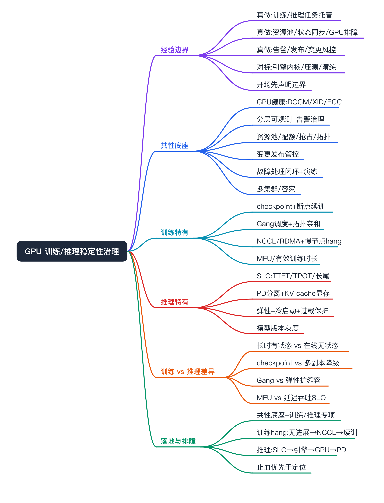
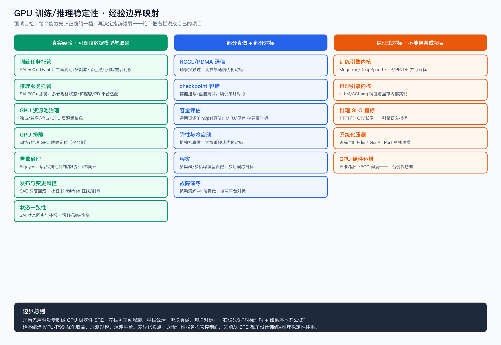
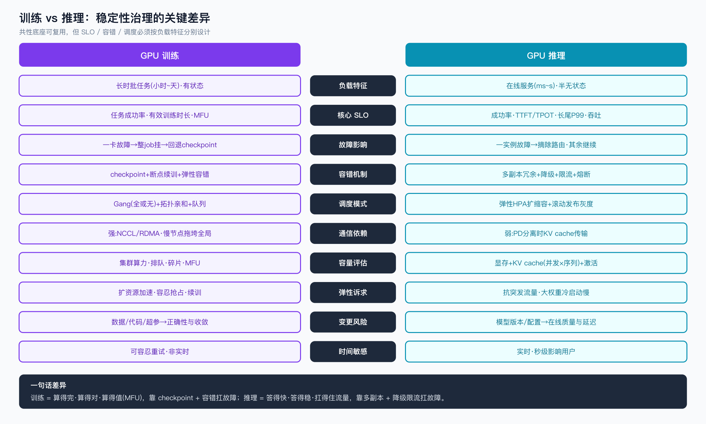
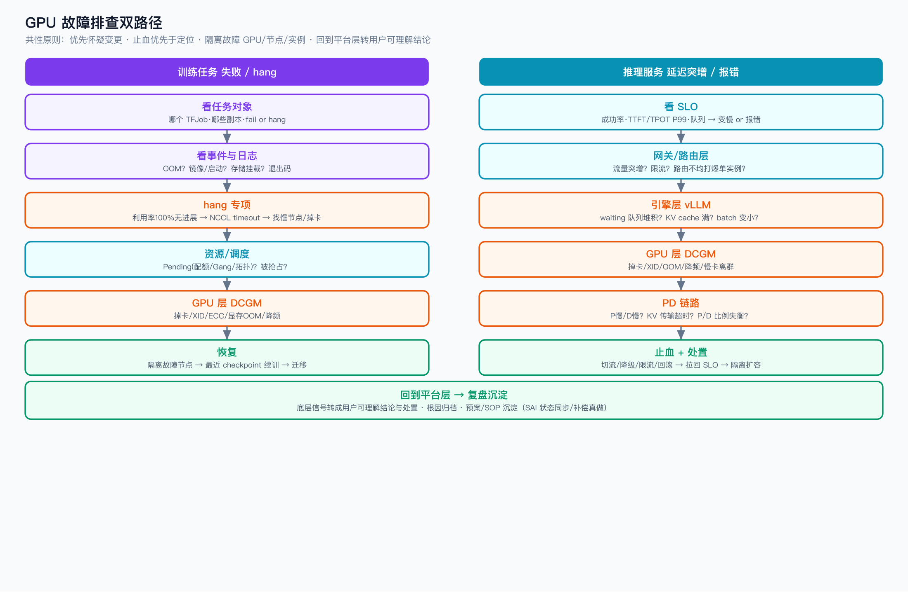

GPU 训练与推理服务稳定性治理（对标）



```yaml
experience_level: adjacent_production_experience
# 我没专职做过「大规模 GPU 稳定性 SRE」，也没系统化做过故障演练 / benchmark 体系、
# 没做过训练/推理引擎内核优化。
# 但我在 SAI 训推平台真实托管过 500+ TFJob 训练任务和 600+ 推理服务，做过 GPU 资源池治理、
# 训练/推理任务生命周期与状态同步补偿、GPU 排障、告警治理(Bigeyes)、发布灰度回滚(SAE)
# 和变更风控(小红书 riskfree)。本文用「业界 GPU 稳定性治理体系」对标我已有平台经验，
# 重点讲清训练与推理在稳定性上的共性底座与关键差异，并标明哪些真做过、哪些是对标理解。
```

# 经验边界



先把话说清楚，避免面试中被击穿：

- **我真实做过的（可深聊，能讲数据模型和取舍）**
  - **训练侧**：SAI 托管 500+ TFJob 训练任务，做任务创建、状态/日志/事件、多角色副本、资源规格、节点池、镜像、存储挂载、TensorBoard、克隆、重启、迁移、资源变配；打通 Soda Pepsi 调度 DAG 按天触发 TFJob 并回传状态。
  - **推理侧**：SAI 托管 600+ 推理服务，统一多云规格/状态/扩缩容/重启/迁移/状态同步；PD 分离架构的平台侧适配（多组件部署、资源池划分、弹性、观测接入）。
  - **共性**：GPU 异构资源池治理（独占/共享/抢占/CPU）；GPU 排障（训练 + 推理，见 [sai/gpu-troubleshooting](../../sai/gpu-troubleshooting/gpu-troubleshooting.md)）；RDMA/NCCL 通信场景接触（见 [sai/gpu-rdma](../../sai/gpu-rdma/rdma.md)）；状态同步与补偿；告警治理（Bigeyes）；发布灰度回滚（SAE/Argo Rollouts）；变更风控（小红书 riskfree/reddog/redbutton）。
- **我没直接做过的（对标理解，不能包装成自己的项目）**
  - 训练引擎/框架内核（Megatron-LM / DeepSpeed）与并行策略（TP/PP/DP）调优、loss/收敛等算法问题。
  - 推理引擎内核（vLLM / SGLang / TensorRT-LLM）的调度与显存内部实现优化。
  - 系统化的**故障演练 / 混沌工程平台**（稳态假设→注入→自动验证的闭环）。
  - 系统化的**压测 / benchmark 体系**（训练吞吐扫描、推理 GenAI-Perf 曲线建模）。
  - GPU 集群**底层硬件运维**（掉卡、固件、ECC、机房网络）——平台侧能感知和兜底，修复不是我做的。
- **面试声明话术（一句话）**：「GPU 稳定性体系我没专职做 SRE，我是从训推平台托管侧深度参与的——资源池、训练/推理任务生命周期、状态一致性、GPU 排障、告警和发布灰度都是我真做的；引擎内核、系统化压测和故障演练是对标理解 + 有落地设计思路，这点我会诚实说清。」

# 为什么需要掌握

- **面试高频**：AI Infra / 稳定性岗几乎都要求「大规模训练或推理场景的稳定性技术体系」，覆盖可观测、容量、变更、容灾、故障处理。
- **和我经验高度相邻**：我做的是训推任务/服务的「托管与编排控制面」，稳定性治理是它的上层体系——同一批对象（GPU、任务、服务、资源池），换 SRE 视角看。
- **能解释云托管能力背后的通用语义**：把「平台帮我做了什么」翻译成「稳定性体系要解决什么」。
- **训练与推理放在一起讲，能体现体系化认知**：知道哪些能力可复用、哪些必须按负载特征分别设计。

# GPU 稳定性的共性底座

训练和推理共享一大半稳定性能力，先讲共性，再讲差异。按问题域组织：

- **GPU 是会"坏"且"贵"的资源，故障域和 CPU 服务完全不同**
  - **对应能力**：GPU 健康度治理——DCGM 监控、XID 错误码、ECC 计数、掉卡/慢卡/温度功耗墙/NVLink·RDMA 链路。
  - **训练推理通用**：一张卡坏了或变慢，训练会拖垮整个 job，推理会打爆单实例，都要能快速发现、隔离、驱逐。
- **链路长、组件多，出问题要能快速定位**
  - **对应能力**：分层可观测 + 告警治理（聚合、抖动抑制、分级、限流）。
  - **通用**：指标分三层——平台/调度层、框架/引擎层、GPU/硬件层。
- **GPU 资源稀缺且异构，要治理碎片和争抢**
  - **对应能力**：资源池/资源组抽象、配额、优先级、抢占、拓扑亲和。
- **变更频繁，发布即风险**
  - **对应能力**：变更与发布管控——灰度、验证、回滚、红线规则、高峰封网。
- **故障必然发生，要能快速发现、止血、复盘**
  - **对应能力**：故障处理闭环——发现 → 止血 → 定位 → 恢复 → 复盘沉淀预案；并通过**故障演练**（含故障注入 / 混沌实验作为手段之一）主动验证容错假设。
- **大规模、多云多集群下要保证不被单点拖垮**
  - **对应能力**：多集群/多可用区冗余、容灾、降级、限流、过载保护。

# 训练 vs 推理：稳定性治理的关键差异



共性底座之上，差异集中在**业务特征**，决定了 SLO、容错和调度的设计完全不同：

| 维度 | GPU 训练 | GPU 推理 |
|---|---|---|
| 负载特征 | 长时批任务（小时~天）、有状态 | 在线服务（ms~s）、（半）无状态 |
| 核心 SLO | 任务成功率、有效训练时长、MFU/GPU 利用率、断点恢复时间 | 成功率、TTFT/TPOT、长尾 P99、吞吐 |
| 故障影响 | 一卡故障 → 整个 job 挂，回退到上个 checkpoint | 一实例故障 → 摘除路由，其余副本继续服务 |
| 容错机制 | checkpoint + 断点续训 + 弹性容错 | 多副本冗余 + 降级 + 限流 + 熔断 |
| 调度模式 | Gang（全部起或都不起）+ 拓扑亲和 + 队列排队 | 弹性 HPA 扩缩容 + 滚动发布灰度 |
| 通信依赖 | 强：NCCL/RDMA AllReduce，慢节点(straggler)拖垮全局 | 相对弱：PD 分离时 KV cache 传输 |
| 容量评估 | 集群算力、排队时长、资源碎片、MFU | 显存 + KV cache（并发×序列长度）+ 激活 |
| 弹性诉求 | 扩资源加速训练、容忍抢占、断点续训 | 应对突发流量、大权重冷启动慢 |
| 变更风险 | 数据/代码/超参/镜像 → 影响正确性与收敛 | 模型版本/配置 → 影响在线质量与延迟 |
| 时间敏感度 | 可容忍重试，非实时 | 实时，秒级影响用户体验 |

一句话总结差异：**训练是"算得完、算得对、算得值（MFU）"，靠 checkpoint 和容错扛故障；推理是"答得快、答得稳、扛得住流量"，靠多副本和降级限流扛故障。**

# 核心概念

只讲面试相关的，每个：定义 / 解决的问题 / 和我经验的映射 / 可能被追问。

## 共性：GPU 健康度与故障域

- **定义**：GPU 特有的故障类型与检测手段，主力是 DCGM（NVIDIA Data Center GPU Manager）+ XID 错误码 + ECC 计数。
- **解决的问题**：CPU 服务健康检查是端口/进程；GPU 要额外看掉卡、ECC 不可纠错、显存 OOM、温度/功耗墙降频、NVLink/RDMA 链路、慢卡（健康但变慢）。
- **和我经验的映射**：我做过 GPU 资源池治理和 GPU 排障（训练+推理），平台侧能感知和隔离；固件/硬件层修复不是我做的。
- **可能追问**：怎么发现"慢卡"？（同型号卡吞吐/延迟离群，不是只看 up/down）；XID 怎么用？（区分可恢复/不可恢复，决定要不要驱逐节点）。

## 共性：分层可观测与告警治理

- **定义**：平台/调度层 → 框架/引擎层 → GPU/硬件层的三层指标、日志、追踪 + 告警治理。GPU 指标 DCGM-Exporter。
- **解决的问题**：链路长，要能快速判断是哪一层；告警要聚合去抖、避免风暴。
- **和我经验的映射**：告警治理是我**真做的强项**——Bigeyes 的 fingerprint 聚合、抖动抑制、多渠道限流、飞书闭环（见 [apm-sre/soul-bigeyes](../../apm-sre/soul-bigeyes/)）。
- **可能追问**：告警风暴怎么治？（聚合+抑制+分级+限流，Bigeyes 真做过）；训练和推理各该配哪些核心告警？（见下）。

## 训练：checkpoint 与断点续训

- **定义**：周期性把训练状态（权重、优化器、step）落盘，故障后从最近 checkpoint 恢复，避免从头训。
- **解决的问题**：训练长达小时~天，一次掉卡/重启不能回到原点；checkpoint 是训练容错的核心。
- **和我经验的映射**：我做过 TFJob 任务生命周期、存储挂载（NAS/OSS）、重启/迁移；checkpoint 的存储 IO 和恢复链路平台侧支持过，恢复策略算法侧的细节是对标。
- **可能追问**：checkpoint 频率怎么权衡？（太频繁拖慢训练和占 IO，太稀疏故障损失大）；checkpoint 存储成瓶颈怎么办？（异步保存、分层存储、限带宽）。

## 训练：Gang 调度与拓扑亲和

- **定义**：分布式训练要么所有副本一起起、要么都不起（Gang/PodGroup），且要按 GPU 拓扑（同机/同 NVLink/同 RDMA 域）就近放置。
- **解决的问题**：避免部分 Pod 占着资源但任务跑不起来（资源死锁）；拓扑不亲和会让 AllReduce 通信变慢。
- **和我经验的映射**：我做过 TFJob 多角色副本、节点池、资源规格调度；调度器内核（Volcano/Gang 实现）是对标。
- **可能追问**：为什么训练要 Gang 而推理不用？（训练是整体任务，缺一个副本就跑不了；推理每个副本独立可服务）。

## 训练：NCCL/RDMA 通信与慢节点

- **定义**：分布式训练用 NCCL 做 GPU 间集合通信（AllReduce），底层走 NVLink/RDMA；任一慢节点（straggler）会拖垮整个同步。
- **解决的问题**：训练性能和稳定性强依赖通信；NCCL timeout、RDMA 链路抖动会导致训练 hang 或失败。
- **和我经验的映射**：RDMA/NCCL 场景我接触过（见 [sai/gpu-rdma](../../sai/gpu-rdma/rdma.md)），平台侧关注网络配置和 hang 检测；NCCL 调参和通信优化是对标。
- **可能追问**：训练 hang 怎么排查？（NCCL timeout 日志、GPU 利用率全 100% 但无进展、定位 straggler 节点）；怎么发现慢节点？（各 rank 进度/通信耗时离群）。

## 训练：MFU 与有效算力

- **定义**：MFU（Model FLOPs Utilization）衡量训练真正用上的算力占峰值的比例；有效训练时长 = 总时长 - 故障/重启/等待时间。
- **解决的问题**：GPU 太贵，稳定性的经济价值最终体现在"有效算力利用率"，故障和重启直接拉低它。
- **和我经验的映射**：我做过 GPU 资源池和利用率治理（FinOps 角度，见 [finops](../../finops/finops_interview_prep.md)）；MFU 这种框架级指标是对标。
- **可能追问**：稳定性怎么量化收益？（减少故障重启次数 → 提升有效训练时长和 MFU → 省 GPU 成本）。

## 推理：SLO 指标体系（TTFT/TPOT）

- **定义**：TTFT（首 token 延迟）、TPOT/ITL（每 token 延迟）、吞吐（token/s）、可用率。
- **解决的问题**：推理不能只看 QPS/CPU，要看 token 级延迟，长尾 P99 比均值更致命。
- **和我经验的映射**：我接入过推理观测，但更多是平台/资源维度指标；TTFT/TPOT 这种引擎语义指标是对标理解。
- **可能追问**：TTFT 受什么影响？（prefill 计算量、排队、batch、KV cache 命中）；为什么不能只看平均延迟？（batching 拉高长尾）。

## 推理：PD 分离与 KV cache 容量

- **定义**：把 prefill（算 prompt + KV cache，计算密集）和 decode（逐 token 生成，访存密集）拆开分别扩缩容；显存被权重 + KV cache（随并发和序列长度增长）+ 激活占满。
- **解决的问题**：prefill/decode 资源特征不同，混跑互相干扰；推理容量不能用 CPU/QPS 外推，KV cache 是弹性变量。
- **和我经验的映射**：PD 分离我做的是**平台侧适配**（多组件部署、资源池划分、弹性、观测，见 [sai/pd-separation](../../sai/pd-separation/)）；KV cache 传输优化、显存建模是对标。
- **可能追问**：PD 分离引入什么新风险？（KV cache 跨节点传输成新瓶颈/故障点；P/D 比例失衡）；扩容信号用什么？（排队长度/TTFT/KV cache 占用，不只 GPU 利用率）。

## 推理：弹性、冷启动与过载保护

- **定义**：推理实例扩缩容速度与代价治理 + 突发流量的限流/降级/熔断兜底。瓶颈是大权重加载（几十 GB）+ 预热。
- **解决的问题**：冷启动分钟级，突发流量来不及扩容，要靠预拉权重、最小副本池、过载保护兜窗口。
- **和我经验的映射**：推理扩缩容、HPA 协同我做过；冷启动慢这个问题域真实遇到过，优化手段对标。
- **可能追问**：怎么缩短冷启动？（权重 pre-fetch/共享缓存、镜像瘦身、容器复用、提前扩容）；GPU 不够做不到全冗余怎么办？（分优先级降级、限流排队、保底池）。

# 如果让我落地，我会怎么设计

假设从 0 到 1 建 GPU 训练 + 推理稳定性体系（不是"已落地"），共性先建底座，再按负载分别治理：

- **共性底座**
  - GPU 健康度：DCGM + XID + ECC 统一采集，掉卡/慢卡自动检测、隔离、驱逐。
  - 分层可观测 + 告警：平台/引擎/GPU 三层指标，复用 Bigeyes 的聚合去抖限流分级。
  - 资源池与配额：异构资源组、优先级、抢占、拓扑亲和。
  - 变更发布管控：灰度 + 回滚 + 红线规则 + 高峰封网（对标 riskfree）。
  - 故障处理闭环 + 演练：发现→止血→定位→恢复→复盘；用故障注入/混沌实验在受控范围验证容错（非高峰、单点、小爆炸半径、SLO 熔断自动停）。
- **训练侧专项**
  - checkpoint 容错：合理频率、异步保存、断点续训、存储 IO 治理。
  - Gang 调度 + 拓扑亲和 + 队列，避免资源死锁、保证通信就近。
  - 训练 hang/慢节点检测：NCCL timeout、各 rank 进度离群、自动定位 straggler。
  - 有效算力度量：以 MFU / 有效训练时长 / 故障重启次数衡量稳定性收益。
- **推理侧专项**
  - 推理 SLO 基线：成功率、TTFT/TPOT P99、队列长度、KV cache 占用，按业务分级。
  - 容量与压测：显存 + KV cache 建模 + 压测拐点定最优 batch 和扩容阈值。
  - 弹性与冷启动：权重预拉、最小副本池、过载保护（限流/优先级排队/降级）。
  - 模型版本灰度：金丝雀 + 影子流量对比质量，复用 Argo Rollouts 回滚。
- **风险控制贯穿全程**：灰度、回滚、默认行为兼容、自动熔断、演练前评审审批。

# 如果线上出问题，我怎么排查



## 训练任务失败 / hang

- **看任务对象**：哪个 TFJob、哪些角色副本、是 fail 还是 hang（无进展）。
- **看任务事件与日志**：OOM？镜像/启动失败？数据/存储挂载失败？退出码。
- **hang 专项**：GPU 利用率是否 100% 但无 step 进展（典型 NCCL hang）；看 NCCL timeout 日志、定位慢节点/掉卡节点。
- **资源/调度**：Pending（配额不足/Gang 凑不齐/拓扑不满足）；被抢占。
- **GPU 层（DCGM）**：掉卡/XID/ECC/显存 OOM/降频。
- **恢复**：隔离故障节点 → 从最近 checkpoint 断点续训 → 必要时迁移节点池。

## 推理服务延迟突增 / 报错

- **看 SLO**：成功率、TTFT/TPOT P99、队列长度——区分"变慢"还是"报错"。
- **分层下钻**：网关/路由层（流量突增/限流/路由不均）→ 引擎层（waiting 队列堆积？KV cache 满？）→ GPU 层（DCGM 掉卡/OOM/降频/慢卡）→ PD 链路（P 慢/D 慢/KV 传输超时/比例失衡）。
- **变更关联**：最近有模型版本/配置/镜像变更——优先怀疑变更，能回滚先回滚。
- **止血优先于定位**：切流/降级/限流/回滚先把 SLO 拉回，再做根因。

## 共性原则

- 优先怀疑变更；止血优先于定位；隔离故障 GPU/节点/实例；最后回到平台层把底层信号转成用户可理解的结论和处置（这是我在 SAI 平台侧真做的——状态同步、事件、补偿）。

# 和我现有经验的映射

技术内容在前，映射后置。按「真实经验 vs 对标」标清楚：

- **告警治理 / 抖动抑制 / 限流**：真实经验 = Bigeyes；可深聊数据模型和状态机。
- **发布灰度 / 回滚 / 变更风控**：真实经验 = SAE + 小红书 riskfree/reddog/redbutton；真做过。
- **GPU 资源池 / 资源组治理**：真实经验 = SAI；平台侧真做，硬件层对标。
- **TFJob 训练任务生命周期 / 存储挂载 / 重启迁移**：真实经验 = SAI；真做，checkpoint 策略与引擎内核对标。
- **推理服务托管 / PD 平台适配 / 状态同步**：真实经验 = SAI；真做，引擎内核对标。
- **GPU 排障 / RDMA·NCCL 场景**：真实经验 = SAI 平台侧；NCCL 调参与通信优化对标。
- **容量 / 利用率（MFU/显存·KV cache）**：通用资源维度真做（FinOps），框架级指标对标。
- **训练/推理引擎内核 · 系统化压测 · 故障演练平台**：无直接生产映射；理论对标 + 落地设计，不包装成项目经验。

# 面试话术

## 30 秒版

GPU 稳定性我没专职做 SRE，先说清楚边界。我是从训推平台托管侧深度参与的——在 SAI 托管了 500+ 训练任务和 600+ 推理服务，做过 GPU 资源池治理、训练/推理任务生命周期、状态同步补偿、GPU 排障，告警治理（Bigeyes）和发布灰度回滚（SAE）也是我真做的。训练和推理稳定性的共性底座（GPU 健康、可观测、变更、故障处理）我有真实经验，引擎内核、系统化压测和故障演练是对标理解 + 有落地设计。

## 3 分钟版

在 SAI 训推平台，我负责训练任务和推理服务的托管与编排控制面。训练侧托管 500+ TFJob，做任务生命周期、多角色副本、节点池、存储挂载、重启迁移，还打通了调度 DAG 按天触发训练；推理侧托管 600+ 服务，统一多云规格状态扩缩容，做了 PD 分离的平台侧适配。GPU 资源池（独占/共享/抢占）治理和 GPU 排障是我跨训练推理都做的。

稳定性体系的共性底座我有真实经验：可观测和告警这块，Bigeyes 做了聚合、抖动抑制、限流、飞书闭环；变更发布这块，SAE 灰度回滚和小红书 riskfree 变更风控、封网都是我做的。

我特别想讲训练和推理在稳定性上的差异：训练是长时有状态任务，核心是 checkpoint 容错、Gang 调度、NCCL 慢节点和 MFU，一卡故障整个 job 要回退；推理是在线无状态服务，核心是 TTFT/TPOT 这种延迟 SLO、多副本降级限流、冷启动，一实例故障摘除路由就行。共性底座可复用，但 SLO、容错、调度必须按负载特征分别设计。

引擎内核优化、系统化压测、故障演练平台我没专职做，是对标理解，但能讲清问题域和从 0 落地的路径。

## 5 分钟版

在 3 分钟版基础上展开「如果让我落地」：先建共性底座（GPU 健康/可观测/资源池/变更/故障演练），再按训练（checkpoint/Gang/hang 检测/MFU）和推理（SLO/容量压测/弹性冷启动/模型灰度）分别治理；并各举一个排障路径（训练 hang：利用率 100% 无进展→NCCL timeout→定位慢节点→断点续训；推理延迟突增：SLO→引擎队列/KV→GPU DCGM→PD 链路→变更关联→止血优先）。强调差异化：我既懂训推服务托管的控制面，又能从 SRE 视角设计训练和推理两类负载的稳定性体系。

# 面试追问树

- 你做过 GPU 稳定性吗？
  - 没专职做 SRE，做过平台托管侧（资源池/任务生命周期/状态同步/GPU 排障/告警/发布）。
    - 训练和推理稳定性最大区别？→ 负载特征：长时有状态 vs 在线无状态，决定 SLO/容错/调度都不同。
    - 你们 SLO 怎么定的？→ 诚实：平台侧更多看资源/任务/实例指标，MFU 和 TTFT/TPOT 是对标理解。
- 训练任务挂了你怎么查？
  - 任务事件/日志 → fail or hang → NCCL/掉卡/OOM/Pending → checkpoint 续训。
    - 训练 hang 怎么定位？→ 利用率 100% 无 step 进展 + NCCL timeout + 找 straggler。
    - checkpoint 频率怎么定？→ 权衡 IO 开销和故障损失。
- 推理延迟突增怎么查？
  - SLO → 网关/引擎队列/KV cache → GPU DCGM → PD 链路 → 变更关联 → 止血优先。
    - 扩容信号用什么？→ 排队长度/TTFT/KV cache 占用，不只 GPU 利用率。
- 为什么训练要 Gang 调度推理不用？
  - 训练是整体任务缺副本跑不了；推理每副本独立可服务。
- 稳定性收益怎么量化？
  - 训练：减少故障重启 → 提升有效训练时长/MFU → 省 GPU 成本；推理：SLO 达成率/可用率。
- 故障演练 / 混沌做过吗？
  - 没系统化做过（诚实）。做过被动演练 + 状态补偿兜底；会怎么落地：稳态假设→注入→控制爆炸半径→自动回滚。

# 不能怎么说

| 不要这么说 | 风险 | 应该这么说 |
|---|---|---|
| 我们建了生产级 GPU 故障演练/混沌平台 | 没真实落地会被击穿 | 故障演练我是对标 + 落地设计，做过被动演练和状态补偿 |
| 我优化了 NCCL/Megatron/vLLM 内核 | 没源码和线上证据 | 我做平台侧适配和排障，引擎内核是对标 |
| 我把训练 MFU/推理 P99 优化了 X% | 编造收益 | 我没做框架级优化；平台侧我做的是托管/调度/状态一致性 |
| 训练/推理压测体系是我搭的 | 没真做过 | 系统化压测我是对标，能讲方法论和扩容/扩资源信号 |
| 我负责 GPU 集群运维 | 平台侧≠硬件运维 | 我做 GPU 资源池治理和排障，硬件修复不是我 |
| 我们训练/推理多活容灾 | 没主导演练 | 我做过多集群/多机房元数据模型，多活切流演练没主导过 |

# 高频 QA

- **训练和推理稳定性最大区别？**
  负载特征：训练长时有状态（checkpoint 容错、Gang、NCCL、MFU），推理在线无状态（TTFT/TPOT、多副本降级限流、冷启动）。共性底座（GPU 健康、可观测、变更、故障处理）可复用，SLO/容错/调度按负载分别设计。

- **训练里一张卡坏了会怎样？怎么扛？**
  分布式训练一卡故障通常整个 job 挂，要回退到最近 checkpoint 续训。靠 checkpoint + 故障节点隔离 + 弹性容错（部分框架支持 elastic）减少损失。

- **训练 hang 怎么排查？**
  典型现象 GPU 利用率 100% 但无 step 进展，多为 NCCL 通信卡住；看 NCCL timeout 日志、各 rank 进度找慢节点/掉卡节点，隔离后续训。

- **MFU 是什么？和稳定性什么关系？**
  Model FLOPs Utilization，真正用上的算力占峰值比例。故障/重启/等待都拉低有效训练时长和 MFU，所以训练稳定性的经济价值最终体现在 MFU 和省下的 GPU 成本。

- **推理 TTFT 和 TPOT 分别受什么影响？**
  TTFT 看 prefill：prompt 长度、排队、batch、KV cache 命中。TPOT 看 decode：访存带宽、batch、序列长度、是否被 prefill 抢资源（所以有 PD 分离）。

- **推理容量怎么评估？为什么不能用 CPU/QPS？**
  显存被权重 + KV cache + 激活占满，KV cache 随并发和序列长度涨，是弹性变量；要用显存模型 + 压测拐点定单实例承载和扩容阈值。

- **GPU 故障怎么发现和处理？（训练推理通用）**
  DCGM + XID + ECC；区分可恢复/不可恢复；不可恢复就隔离驱逐节点。训练触发续训，推理摘除实例。慢卡靠同型号离群检测。

- **训练和推理各配哪些核心告警？**
  训练：任务失败、hang（无进展）、Pending 超时、checkpoint 失败、掉卡/OOM。推理：成功率、TTFT/TPOT P99、队列堆积、KV cache 满、扩容失败、掉卡/OOM。

- **为什么训练要 Gang 调度，推理不用？**
  训练是整体任务，缺一个副本就跑不了，要全起或不起；推理每个副本独立可服务，弹性扩缩容即可。

- **没专职做过 GPU 稳定性，为什么应聘这岗？**
  我做的是训推平台托管控制面，稳定性是它的上层体系，对象完全一样（GPU/任务/服务/资源池）。共性底座（可观测、变更、故障处理）我有真实经验，缺的引擎内核/系统化压测/故障演练有清晰落地路径，迁移成本低。

- **线上大面积故障第一步做什么？**
  先确认影响范围和是否有变更——有变更优先回滚止血；推理同时切流/降级/限流，训练隔离故障节点续训；止血后再分层下钻定位，最后复盘沉淀预案。

- **稳定性体系怎么衡量做得好不好？**
  训练看有效训练时长/MFU/故障重启次数；推理看 SLO 达成率/可用率/长尾；通用看 MTTR、告警准确率、变更成功率。

# 面试前检查清单

- [ ] 开场是否明确声明：GPU 稳定性没专职做 SRE，引擎内核/系统化压测/故障演练是对标？
- [ ] 是否没编造 MFU/P99 优化收益、压测规模、故障演练平台等不存在的成果？
- [ ] 真做的部分（Bigeyes 告警、SAE 发布、riskfree 变更、SAI 训练/推理托管/资源池/状态同步/GPU 排障）能否讲清数据模型和取舍？
- [ ] 能否清楚讲训练 vs 推理稳定性差异（负载特征 → SLO/容错/调度）？
- [ ] 训练侧：checkpoint、Gang、NCCL hang、MFU 能否讲清？
- [ ] 推理侧：TTFT/TPOT、显存+KV cache 容量、PD 分离、冷启动能否讲清？
- [ ] 是否有共性底座 + 训练/推理分别专项的「从 0 落地」路径？
- [ ] 是否有训练 hang 和推理延迟两条可操作排障路径（含止血优先）？
- [ ] 「不能怎么说」的红线是否记牢？
