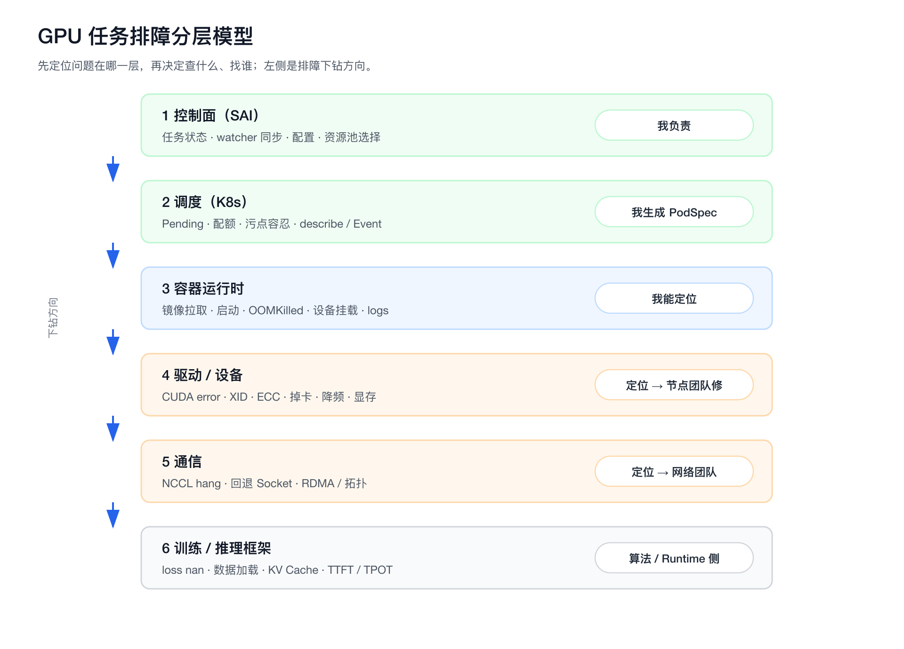
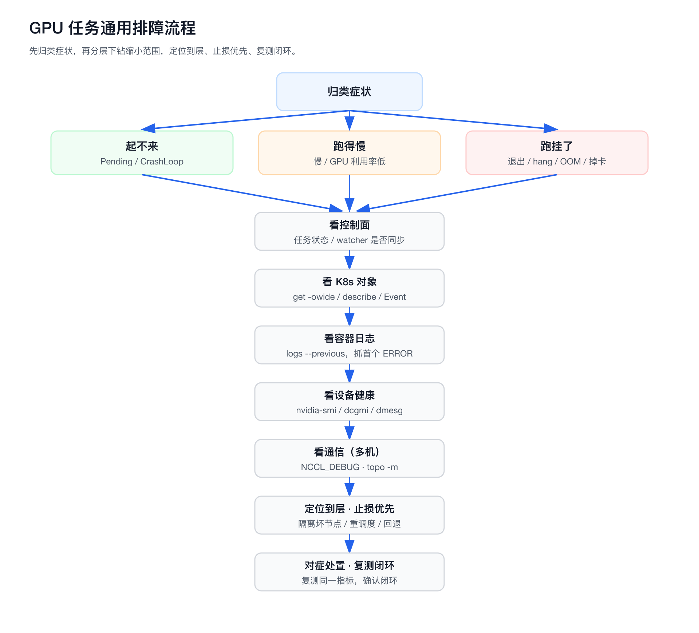
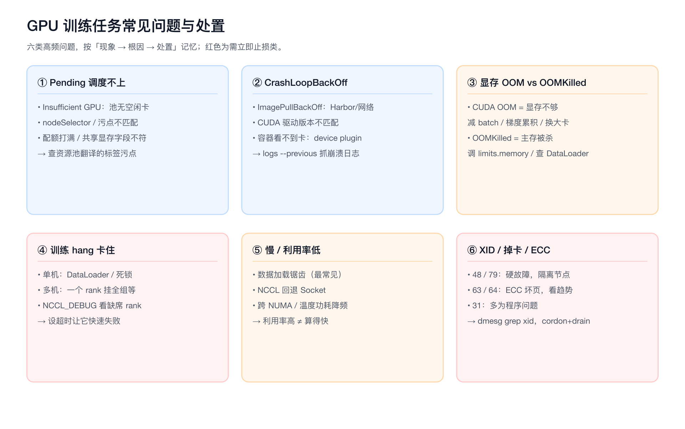
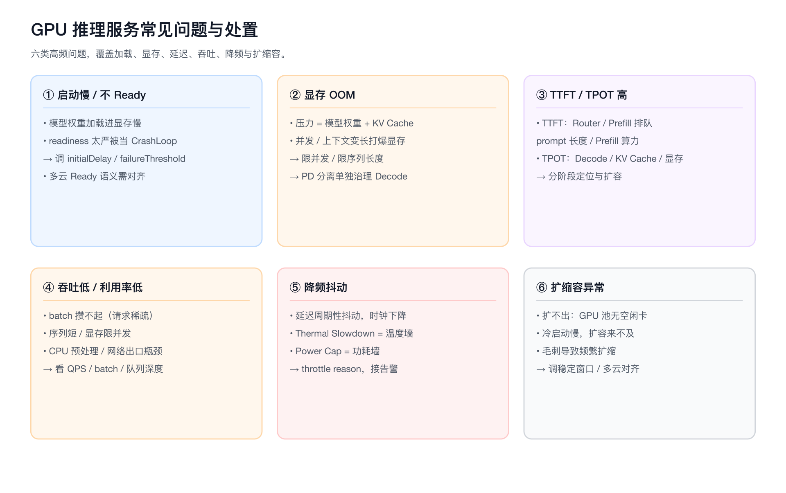
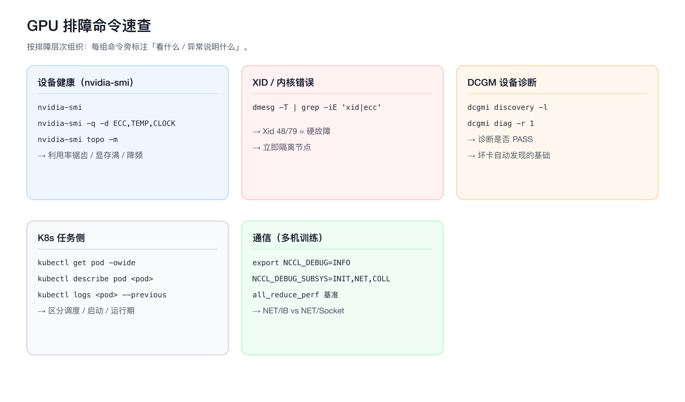
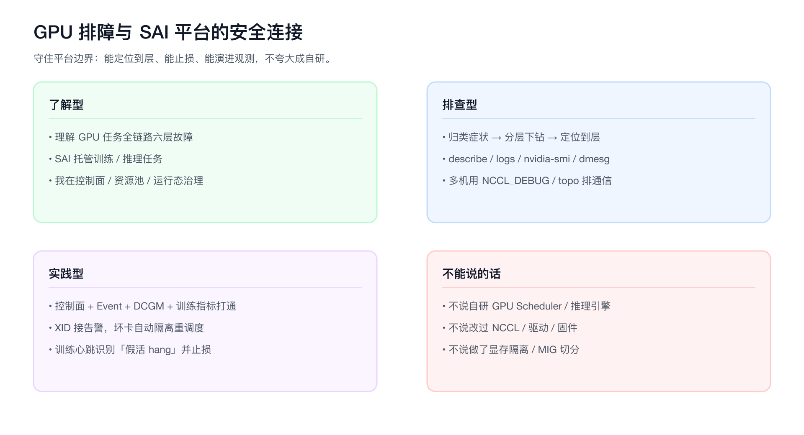

# 面试定位卡

- **技术点**：GPU 训练 / 推理任务排障（从平台控制面到设备层的分层定位）
- **所属领域**：AI Infra、SRE、GPU 资源治理、训练推理可观测
- **面试价值**：能证明你不是只会点控制台，而是能把「任务跑不起来 / 跑得慢 / 跑挂了」拆到调度、容器、驱动、设备、通信哪一层，并给出处置动作
- **常见考法**：GPU 任务 Pending 怎么查、CUDA error 怎么定位、训练 hang 住怎么办、显存 OOM、XID 报错是什么、GPU 利用率低、掉卡/ECC、推理首 token 慢、降频、多机训练慢
- **适合挂钩项目**：SAI 训推平台、GPU 资源池治理、TFJob/PyTorchJob 接入、watcher 状态同步、Job 可观测、DCGM 指标、多云推理托管
- **不适合夸大的地方**：不要说自研 GPU Scheduler、GPU 插件、推理引擎、NCCL 或修过驱动/固件；平台侧定位是「资源池抽象 + 生命周期治理 + 排障入口 + 可观测打通」，设备/驱动/通信问题要会定位、能协同，不能说成自己实现

# 三十秒回答

GPU 任务排障的关键，是先分清「起不来 / 跑得慢 / 跑挂了」三类症状，再沿「平台控制面 → 调度(K8s) → 容器运行时 → 驱动/设备 → 通信(NCCL/RDMA) → 训练框架」这条链路逐层下钻。

起不来多是资源池、配额、镜像、设备插件问题；跑得慢多是数据加载、利用率、通信回退 Socket、降频；跑挂了多是 OOM、XID 掉卡、NCCL 超时、节点 NotReady。

我在 SAI 平台侧能做的是：把控制面状态、K8s Event、DCGM(XID/ECC/利用率/显存) 和训练语义指标打通，让排障从「只能看现象」变成「能定位到层」。设备和驱动级问题平台不自研，但要能定位并联动节点/网络团队。

# 为什么需要它（GPU 任务为什么难排障）

- **链路长**：一个训练任务从「用户提交 → 控制面生成 PodSpec → 调度 → 拉镜像 → 容器启动 → CUDA 初始化 → 加载数据/模型 → NCCL 建链 → 迭代」，任何一层都可能出问题。
- **现象与根因错位**：用户看到的是「训练慢」「卡住了」「报错退出」，但根因可能在三层之外（如静默回退 Socket、跨 NUMA、温度墙降频）。
- **跨团队**：GPU/驱动/网络/存储分属不同团队，平台是排障的「第一落点」，必须先定位到层，才能高效甩给对的人。
- **状态不一致**：控制面元数据、K8s 真实状态、设备健康三者经常不一致，需要 watcher 补偿 + 多源对账才能看清。
- **高成本**：GPU 卡贵，一台机器 hang 住或一张卡掉了，损失的是整组训练；排障要快，还要能止损（驱逐坏节点、重调度）。

# 排障分层模型



排障时永远先定位「问题在哪一层」，再决定查什么、找谁：

- **控制面（SAI）** — 平台角色：我负责
  - 关注：任务状态、配置、资源池选择、watcher 是否同步
  - 观测手段：平台任务详情、状态机、操作日志
- **调度（K8s）** — 平台角色：我负责生成 PodSpec，不自研 Scheduler
  - 关注：Pending、调度失败、配额、节点选择、污点容忍
  - 观测手段：`kubectl describe`、Event、Scheduler 日志
- **容器运行时** — 平台角色：我能定位
  - 关注：镜像拉取、容器启动、OOMKilled、设备挂载
  - 观测手段：Pod 状态、`kubectl logs`、containerd 日志
- **驱动 / 设备** — 平台角色：我能定位，节点团队修
  - 关注：CUDA error、XID、ECC、掉卡、降频、显存
  - 观测手段：`nvidia-smi`、`dcgmi`、DCGM 指标、dmesg
- **通信** — 平台角色：我能定位，见 [[rdma]]
  - 关注：NCCL hang/超时、回退 Socket、RDMA/拓扑
  - 观测手段：`NCCL_DEBUG`、nccl-tests、`nvidia-smi topo -m`
- **训练 / 推理框架** — 平台角色：算法/Runtime 侧，平台提供观测
  - 关注：loss nan、数据加载、batch、KV Cache、TTFT/TPOT
  - 观测手段：训练日志、TensorBoard、推理引擎指标

# 通用排障流程



- **1. 归类症状**：起不来（Pending/CrashLoop）/ 跑得慢（慢、利用率低）/ 跑挂了（退出、hang、OOM、掉卡）
- **2. 看控制面**：平台任务状态、最近操作、watcher 是否同步、配置是否符合预期
- **3. 看 K8s 对象**：`kubectl get pod -owide`、`describe`、Event，确认是调度、启动还是运行期问题
- **4. 看容器日志**：`kubectl logs`（含 `--previous`），抓首个 ERROR / CUDA error / OOM / NCCL WARN
- **5. 看设备健康**：`nvidia-smi`、`dcgmi diag`、DCGM 的 XID/ECC/温度/显存，`dmesg` 看内核报错
- **6. 看通信（多机）**：`NCCL_DEBUG=INFO` 看 NET/IB vs Socket，topo -m，必要时 nccl-tests
- **7. 定位到层**：给出根因属于哪一层，能止损先止损（隔离坏节点、重调度、回退版本）
- **8. 处置与复测**：对症处置后复测同一指标，确认问题闭环，不靠「重启了好像就好了」

记忆口诀：**先归类，再下钻，定位到层，止损优先，复测闭环。**

---

# 训练任务常见问题与处置



## 1. GPU 任务一直 Pending，调度不上

- **现象**：Pod 长时间 Pending，平台显示「等待资源」。
- **先看**：`kubectl describe pod` 的 Events，看调度器给的原因。
- **常见根因与处置**：
  - `Insufficient nvidia.com/gpu`：GPU 资源池没有空闲卡 → 看资源池水位，等待 / 扩容 / 换抢占池。
  - `node(s) didn't match nodeSelector/affinity`：资源池标签和实际节点不匹配 → 检查 NodePool 翻译出的 `nodeSelector`、节点 Label。
  - `node(s) had taint ... that the pod didn't tolerate`：GPU 节点带污点，PodSpec 缺 toleration → 检查资源池模板生成的 `tolerations`。
  - 申请了共享显存（`aliyun.com/gpu-mem`）但节点未开共享 / 插件未注册 → 确认 GPU 插件能力与资源字段一致。
  - 配额（ResourceQuota / 平台配额）打满 → 看租户配额。
- **平台侧话术**：这正是把「调度意图产品化」的价值——用户选资源池，平台保证 PodSpec 翻译正确，否则 Pending 的根因经常就在标签/污点/资源字段对不上。

## 2. 容器起不来 / CrashLoopBackOff

- **现象**：Pod 反复重启，`RESTARTS` 增长。
- **先看**：`kubectl logs --previous` 抓上一次崩溃的日志。
- **常见根因与处置**：
  - 镜像拉取失败 `ImagePullBackOff`：Harbor 鉴权 / 网络 / tag 不存在 → 见 [[tekton]] 镜像链路排查思路。
  - CUDA driver/runtime 版本不匹配：`CUDA driver version is insufficient for CUDA runtime version` → 镜像里 CUDA 版本高于节点驱动 → 换镜像或升驱动（节点团队）。
  - 容器内找不到 GPU：`no CUDA-capable device is detected` → 设备插件未注入、`NVIDIA_VISIBLE_DEVICES` 被覆盖、runtime 不是 nvidia → 查节点 device plugin 与容器 runtime。
  - 启动即 OOMKilled：`limits.memory` 太小（注意是主存不是显存）→ 调 PodSpec 内存。
  - 入口脚本 / 依赖问题：早期就退出，日志里有 Python traceback → 算法侧。

## 3. 训练报 CUDA error / 显存 OOM

- **现象**：`CUDA out of memory` 或各类 `CUDA error: ...`。
- **关键区分**：是**显存 OOM** 还是**进程被内核 OOMKiller 杀**（主存），两者完全不同。
  - 显存 OOM → 训练日志里 `torch ... CUDA out of memory; tried to allocate ...`。处置：减小 batch、开梯度累积 / 梯度检查点、用更小精度（fp16/bf16）、换更大显存资源池。
  - 主存 OOMKilled → `kubectl describe` 看 `Reason: OOMKilled`、`dmesg` 有 `Out of memory: Killed process`。处置：调大 `limits.memory`，查 DataLoader worker / 缓存是否吃满主存。
- **其它 CUDA error**：
  - `CUDA error: device-side assert triggered` → 多是 label 越界 / 数据问题（算法侧），用 `CUDA_LAUNCH_BLOCKING=1` 定位到具体 kernel。
  - `CUDA error: an illegal memory access` → 代码 bug 或显存被踩，结合是否伴随 XID。
  - `uncorrectable ECC error encountered` → 硬件 ECC，属于设备故障（见下）。

## 4. 训练 hang 住 / 卡在某一步不动（重点）

- **现象**：日志停在某个 step 不再前进，GPU 利用率可能 100%（忙等）或 0%，进程不退出。
- **这是 GPU 排障最经典的难题，先分两类**：
  - **单机 hang**：死锁、数据加载阻塞（DataLoader 卡 IO/NAS）、某张卡 hang。
  - **多机 hang（最常见）**：NCCL 集合通信卡住——某个 rank 没到达 AllReduce，整组等它。
- **排查路径**：
  1. `nvidia-smi` 看各卡利用率/功耗：全 100% 但不前进 → 大概率 NCCL 等待；某张卡 0% → 那张卡或那个 rank 出问题。
  2. `NCCL_DEBUG=INFO`、设 `NCCL_DEBUG_SUBSYS=INIT,COLL` 看卡在哪个 collective、哪个 rank 没参与。
  3. 看是否有 rank 已经因 OOM/异常退出，但 NCCL 没感知 → 表现为其它 rank 永久等待。可设 `NCCL_ASYNC_ERROR_HANDLING=1` / `TORCH_NCCL_ASYNC_ERROR_HANDLING` 让超时能 abort。
  4. `nvidia-smi topo -m` 排除拓扑，`dmesg` / DCGM 看是否有 XID（掉卡会让通信永久 hang）。
  5. 看 DataLoader：strace / py-spy dump 进程栈，确认是否卡在数据读取（NAS 慢、共享存储抖动）。
- **处置**：设置合理的 NCCL 超时与 async error handling 让任务**快速失败而不是永久 hang**；坏卡/坏节点驱逐重调度；存储抖动联动存储团队。
- **平台侧价值**：很多 hang 的本质是「一个 rank 挂了，其余 rank 永久等待」，平台通过 watcher + DCGM + 训练心跳能把「假活」识别出来，触发告警或自动重启，而不是让任务空耗 GPU 几小时。

## 5. 训练慢 / GPU 利用率低

- **现象**：step time 长，`nvidia-smi` 利用率周期性掉到很低，或多机加卡不提速。
- **排查路径（按概率）**：
  1. **数据加载瓶颈**（最常见）：利用率周期性 0%→100% 锯齿，说明 GPU 在等数据 → 调大 `num_workers`、预取、用本地盘缓存、查 NAS/共享存储吞吐。
  2. **通信瓶颈**：多机不提速，NCCL 可能静默回退 Socket → `NCCL_DEBUG` 看 NET/IB vs Socket，nccl-tests 测带宽，见 [[rdma]]。
  3. **跨 NUMA**：CPU-GPU 跨 NUMA node 增加数据准备延迟 → `nvidia-smi topo -m`、绑核，见 [[numa]]。
  4. **降频**：温度墙 / 功耗墙导致 SM 时钟下降 → `nvidia-smi -q -d CLOCK,TEMPERATURE,POWER` 看 `Clocks Throttle Reasons`。
  5. **小 batch / CPU 预处理重 / 同步太频繁**：算法侧。
- **关键认知**：「GPU 利用率高」不等于「算得快」。利用率统计的是「有 kernel 在跑」的时间占比，忙等也算利用率。要结合 step time、MFU、功耗一起看。

## 6. loss 变 NaN / Inf、精度异常

- 通常是**算法/数据问题**，不是平台问题：学习率过大、混合精度溢出、脏数据、梯度爆炸。
- 平台侧能做的：通过 TensorBoard / Job 观测把 loss 曲线、grad norm 暴露出来，帮算法快速发现，而不是等训练跑完才知道废了。
- 边界话术：不要把 NaN 揽成平台职责，准确说「平台提供观测，让这类问题早发现」。

## 7. XID 报错 / 掉卡 / ECC（硬件类，重点）

- **XID 是什么**：NVIDIA 驱动通过 `dmesg` / 内核日志上报的 GPU 错误码（`NVRM: Xid (PCI:...): 79, ...`），是 GPU 健康的核心信号。
- **怎么发现**：`dmesg -T | grep -i xid`，或 DCGM 直接采集 XID 指标接入告警。
- **常见 XID 速查**（含义 → 典型处置）：
  - **13**：Graphics/通用异常，常伴随用户态非法访问 → 多为程序问题，结合应用日志
  - **31**：GPU memory page fault（非法显存访问）→ 多为程序 bug，也可能硬件
  - **43**：进程因 GPU 异常被复位 → 看伴随 XID，定位真正根因
  - **48**：Double Bit ECC（DBE，不可纠正）→ 硬件故障，驱逐节点、报修、换卡
  - **63/64**：ECC page retirement / row-remapping → 显存有坏页，关注重映射余量，趋势性换卡
  - **79**：GPU 掉卡 / 从总线脱落（fallen off the bus）→ 严重硬件/PCIe 问题，立即隔离节点
  - **74**：NVLink 错误 → 多卡互联问题，查 NVLink/拓扑
  - **119/120**：GSP 相关错误 → 驱动/固件层，联动节点团队
  - 面试不必背全表，记住「48/79 是硬故障要隔离、63/64 是 ECC 坏页看趋势、31 多是程序」即可。
- **处置原则**：硬件类 XID（48/79/74）→ **先止损**：cordon + drain 坏节点，让平台把任务重调度到健康卡；标记节点不可调度，报修；不要原地反复重启。
- **平台侧价值**：把 DCGM 的 XID/ECC 接入告警 + 节点健康画像，做到「坏卡自动隔离、任务自动重调度」，而不是靠用户报障才发现一张卡早就坏了。

## 8. 节点 NotReady / 任务突然全挂

- **现象**：一整组 Pod 同时失败或 Pending，节点 NotReady。
- **排查**：`kubectl get node`、kubelet 状态、`dmesg`（GPU 掉卡会拖垮 kubelet）、节点压力（磁盘/PID/内存）。
- **处置**：隔离坏节点，任务重调度；watcher 负责把控制面状态和真实状态对齐，避免平台还显示「运行中」但 Pod 已经没了。

---

# 推理服务常见问题与处置



## 1. 推理服务启动慢 / 一直没 Ready

- **现象**：服务发布后长时间不 Ready，健康检查失败。
- **常见根因**：
  - **模型加载慢**：大模型权重从对象存储/NAS 拉取 + 加载进显存，几十秒到几分钟很正常 → 调大 readiness 探针的 `initialDelaySeconds` / `failureThreshold`，否则会被反复杀重启形成假 CrashLoop。
  - 显存不够装不下模型 → 换更大显存资源池或开量化。
  - 镜像/依赖问题，同训练。
- **平台侧**：多云托管（KServe/EAS/火山/贝联）下，「Ready 语义」各家不同，平台要把它对齐成统一服务状态，否则用户分不清是「还在加载」还是「真挂了」。

## 2. 推理显存 OOM / 被 OOMKill

- 推理显存压力主要来自**模型权重 + KV Cache**。并发上来、上下文变长，KV Cache 涨，显存被打爆。
- 处置：限制最大序列长度 / 最大并发、调小 KV Cache 上限、换大显存卡、用 PD 分离把 Decode（显存敏感）单独治理，见 [[pd-separation]]。
- 边界：KV Cache 的底层管理在推理引擎/Serving Runtime，不是平台控制面；平台关注的是显存压力、资源池选择、观测和扩缩容。

## 3. 首 token 慢（TTFT 高）/ 生成慢（TPOT 高）

- 这是大模型推理的核心延迟指标，定位思路见 [[pd-separation]] 的瓶颈定位图：
  - **TTFT 高** → 看 Router 排队、Prefill 排队、prompt 长度、Prefill 算力。
  - **TPOT 高** → 看 Decode、KV Cache、显存、decode queue、长输出请求。
- 平台侧：提供分阶段观测指标和资源池选择（计算型池给 Prefill，高显存池给 Decode）。

## 4. 推理吞吐低 / GPU 利用率低

- 常见原因：batch 没攒起来（请求稀疏）、序列长度短、显存限制了并发、CPU 预处理/后处理瓶颈、网络出口瓶颈。
- 排查：看 QPS、batch size、GPU 利用率、队列深度；利用率低但延迟高，往往是 batch 攒不起来或被显存卡住并发。

## 5. 降频导致延迟抖动

- **现象**：服务延迟周期性抖动，GPU 时钟下降。
- **排查**：`nvidia-smi -q -d CLOCK,TEMPERATURE,POWER`，看 `Clocks Throttle Reasons` 是 `SW Thermal Slowdown`（温度墙）还是 `SW Power Cap`（功耗墙）。
- **处置**：温度墙查机房散热/风扇/积灰（机房侧）；功耗墙查功率上限设置。平台侧把降频信号接入告警，避免「服务变慢但没人知道是降频」。

## 6. 扩缩容不生效 / 副本起不来

- HPA/KPA 不扩：GPU 池没空闲卡（扩不出来）、指标采集异常、冷启动慢（模型加载）导致扩容来不及。
- 缩容抖动：流量毛刺导致频繁扩缩 → 调稳定窗口。
- 平台侧把多云不同的扩缩容能力对齐成统一动作。

---

# 关键命令速查



## 设备健康总览

```bash
nvidia-smi                       # 利用率、显存、温度、功耗、进程、ECC 概览
nvidia-smi -q -d ECC,TEMPERATURE,CLOCK,POWER   # 详细：ECC 计数、降频原因
nvidia-smi topo -m               # GPU-GPU / GPU-NIC 拓扑（NVLink/PIX/PXB/SYS）
```

- 看什么：利用率是否锯齿（数据瓶颈）、显存是否打满、温度是否到墙、`Clocks Throttle Reasons`、ECC 错误计数。
- 异常说明：显存满→OOM 风险；温度高+时钟低→降频；ECC DBE→硬件故障。

## XID / 内核错误

```bash
dmesg -T | grep -iE 'xid|nvrm|ecc|fell off'   # GPU 内核级报错
```

- 看什么：是否有 Xid 报错、ECC、掉卡（fallen off the bus）。
- 异常说明：Xid 48/79 是硬故障要隔离节点。

## DCGM 设备诊断

```bash
dcgmi discovery -l               # 列设备
dcgmi diag -r 1                  # 快速健康诊断（也有 -r 2/3 更深）
```

- 看什么：诊断是否 PASS，XID/ECC/PCIe/NVLink 健康。
- 平台侧：DCGM 指标接入观测和告警，是「坏卡自动发现」的基础。

## K8s 任务侧

```bash
kubectl get pod -owide                          # 落在哪个节点
kubectl describe pod <pod>                      # Events：调度/启动/OOMKilled 原因
kubectl logs <pod> [-c <ctr>] --previous        # 上次崩溃日志
kubectl get node ; kubectl describe node <node> # 节点 Ready、资源、污点
```

## 通信（多机训练）

```bash
export NCCL_DEBUG=INFO
export NCCL_DEBUG_SUBSYS=INIT,NET,COLL          # 看建链、传输路径、卡在哪个 collective
# nccl-tests 基准
./build/all_reduce_perf -b 8M -e 1G -f 2 -g 8
```

- 看什么：NET/IB vs NET/Socket、GDR 是否启用、卡住的 collective 和缺席 rank、busBW。
- 详见 [[rdma]]。

# 风险、边界和误区

每条格式为「常见说法/做法 → 问题 → 更稳妥的表达」：

- **「GPU 利用率 100% 就是算得快」** → 忙等、NCCL 等待也算利用率 → 利用率要结合 step time、MFU、功耗看
- **「训练慢就是 GPU 不够」** → 多数是数据加载、通信、降频 → 先定位到层，别默认加卡
- **「卡住了重启一下就行」** → 掩盖根因，下次还会 hang → 查清是 NCCL/掉卡/数据，设超时让它快速失败
- **「显存 OOM 和进程被杀是一回事」** → 一个是显存一个是主存 → 区分 CUDA OOM 与 OOMKilled，处置不同
- **「我修过驱动/优化了 NCCL」** → 平台侧极易夸大 → 我能定位到设备/通信层，修复联动节点/网络团队
- **「XID 报错重调度就好」** → 硬故障节点不隔离会反复坑 → 48/79 类要 cordon+drain 节点并报修
- **「推理没 Ready 就是挂了」** → 大模型加载本来就慢 → 先看是否还在加载，调 readiness 探针
- **「我自研了 GPU 调度/资源隔离」** → 不符合平台边界 → 平台做资源池抽象和 PodSpec 生成，调度交给 K8s 和 GPU 插件

# 和项目的安全连接



## 了解型说法

我理解 GPU 任务从提交到迭代要经过控制面、调度、容器、驱动、设备、通信、框架多层，每层都有典型故障。SAI 平台托管训练和推理任务，我的职责在控制面、资源池治理和运行态治理，不自研 Scheduler、推理引擎和 NCCL。

## 排查型说法

用户报「任务起不来 / 慢 / 挂了」，我会先归类症状，再沿分层链路下钻：先看平台状态和 watcher 是否同步，再看 K8s Event 区分调度还是运行期，再看容器日志抓 CUDA error / OOM / NCCL WARN，最后用 nvidia-smi、dcgmi、dmesg 看设备健康和 XID。多机问题再用 NCCL_DEBUG 和 topo 排通信。定位到层之后，平台能做的先做（重调度、隔离节点、回退配置），设备/网络问题联动对应团队。

## 实践型说法

平台侧可以把这套排障沉淀成能力：把控制面状态、K8s Event、DCGM（XID/ECC/利用率/显存）和训练语义指标打通，做「Job 统一视角」；把硬件类 XID 接入告警和节点健康画像，实现坏卡自动隔离、任务自动重调度；给训练任务加心跳，识别「假活 hang」并止损。这些是演进方向，需要团队实际落地，不能说成已经全部完成。

## 不能说的话

不能说「我自研了 GPU Scheduler / GPU 插件 / 推理引擎」「我修过 NVIDIA 驱动或固件」「我优化了 NCCL」「我做了显存隔离 / MIG 切分」。边界是：理解 GPU 任务全链路，能把故障定位到层并止损，平台侧做资源池治理、可观测打通和排障自动化演进。

# 面试追问树

```text
Q1：一个 GPU 训练任务跑不起来，你怎么排查？
  └── Q2：怎么区分是调度问题还是容器启动问题？
        └── Q3：显存 OOM 和进程被 OOMKilled 怎么区分？
              └── Q4：训练 hang 住不动，可能是什么原因？
                    └── Q5：多机训练某个 rank 挂了，为什么整组会卡住？怎么让它快速失败？
                          └── Q6：XID 是什么？看到 Xid 79 你怎么处理？
                                └── Q7：训练慢、GPU 利用率低，你按什么顺序查？
                                      └── Q8：这些在 SAI 平台上你能做成什么自动化能力？
```

# 高频 Q&A

## GPU 任务排障你的整体思路是什么？

先归类症状（起不来/慢/挂了），再沿「控制面→调度→容器→驱动设备→通信→框架」分层下钻，定位到层，能止损先止损，最后对症处置并复测闭环。核心是不要一上来就猜，而是用 describe、logs、nvidia-smi、dmesg、NCCL_DEBUG 一层层缩小范围。

## GPU 任务 Pending 怎么查？

`kubectl describe pod` 看 Events 里调度器给的原因：Insufficient GPU（没空闲卡）、nodeSelector/affinity 不匹配、污点没容忍、配额满、共享显存字段和节点能力不一致。平台侧很多 Pending 的根因就在资源池翻译出的标签/污点/资源字段对不上。

## 显存 OOM 和被 OOMKilled 有什么区别？

显存 OOM 是 GPU 显存不够，训练日志报 CUDA out of memory，处置是减 batch、梯度累积、换大显存卡。OOMKilled 是进程吃光了主存被内核 OOMKiller 杀，describe 里 Reason 是 OOMKilled，处置是调大内存 limit、查 DataLoader。两者完全不同。

## 训练 hang 住不动怎么办？

先看 nvidia-smi：全 100% 不前进多是 NCCL 等待，某卡 0% 是那张卡/rank 出问题。多机最常见是一个 rank 挂了其余 rank 永久等待。用 NCCL_DEBUG 看卡在哪个 collective、谁缺席，配 NCCL 超时和 async error handling 让它快速失败而不是空耗 GPU，坏卡坏节点驱逐重调度。

## XID 是什么？看到 Xid 79 怎么办？

XID 是 NVIDIA 驱动通过内核日志上报的 GPU 错误码，是 GPU 健康的核心信号，`dmesg | grep -i xid` 看。Xid 79 是 GPU 掉卡（从总线脱落），属于严重硬件故障，要立即 cordon+drain 隔离节点、把任务重调度到健康卡、报修，不能原地反复重启。

## 训练慢、GPU 利用率低，你按什么顺序查？

按概率：先看数据加载（利用率锯齿说明在等数据），再看通信（多机不提速可能 NCCL 回退 Socket），再看 NUMA 和降频（温度/功耗墙），最后才是 batch、同步频率这些算法因素。要记住利用率高不等于算得快，忙等也算利用率。

## 推理服务一直不 Ready 怎么排查？

先确认是不是还在加载——大模型权重加载进显存几十秒到几分钟正常，readiness 探针太严会把它当 CrashLoop 反复杀。排除加载后再看显存够不够装模型、镜像依赖、健康检查配置。多云托管下还要注意各家 Ready 语义不同，平台要对齐。

## 推理延迟高（首 token 慢）怎么定位？

首 token 慢看 TTFT 链路：Router 排队、Prefill 排队、prompt 长度、Prefill 算力；后续 token 慢看 TPOT：Decode、KV Cache、显存、decode queue。可以结合 PD 分离把两个阶段分开治理和扩容。

## 这些排障在平台上能做成什么能力？

把控制面状态、K8s Event、DCGM（XID/ECC/利用率/显存）和训练语义指标打通成 Job 统一视角；硬件类 XID 接告警做坏卡自动隔离和任务重调度；给训练加心跳识别假活 hang 并止损。让排障从「只能看现象、靠用户报障」变成「定位到层、自动止损」。

# 三档背诵版

## 三十秒版

GPU 任务排障先归类症状（起不来/慢/挂了），再沿控制面→调度→容器→驱动设备→通信→框架分层下钻，定位到层、止损优先、复测闭环。起不来多是资源池标签污点配额，慢多是数据加载/通信回退/降频，挂了多是 OOM/XID 掉卡/NCCL hang。平台侧能做的是把控制面、K8s Event、DCGM、训练指标打通，做坏卡自动隔离和假活 hang 识别。

## 三分钟版

GPU 任务难排障是因为链路长、现象和根因错位、跨团队、状态易不一致。我用分层模型定位：控制面看任务状态和 watcher，调度看 describe Events 区分 Pending 原因，容器看 logs 抓 CUDA error/OOM，设备看 nvidia-smi/dmesg/dcgmi 的 XID/ECC/降频，通信看 NCCL_DEBUG 区分 IB 还是 Socket。

训练侧重点：Pending（标签污点配额）、CrashLoop（镜像/驱动版本/找不到卡）、显存 OOM vs 主存 OOMKilled 要分清、hang（多机一个 rank 挂全组等，要设超时快速失败）、慢（数据加载锯齿、通信回退、降频）、XID 掉卡要隔离节点。推理侧重点：加载慢别当 CrashLoop、KV Cache 显存压力、TTFT/TPOT 分阶段定位、降频抖动。

平台边界：不自研 Scheduler/引擎/NCCL，做资源池抽象、可观测打通和排障自动化。

## 五分钟版

从难点出发：GPU 任务从提交到迭代要经过控制面、K8s 调度、容器运行时、驱动设备、NCCL 通信、训练框架六层，任何一层都可能挂，且用户看到的「慢/卡/挂」常和真正根因错位，加上 GPU 跨 GPU/网络/存储多团队，平台是排障第一落点。

方法论是分层下钻：先归类症状，再逐层用 describe/logs/nvidia-smi/dmesg/dcgmi/NCCL_DEBUG 缩小范围，定位到层后止损优先（隔离坏节点、重调度、回退配置），最后对症处置并复测同一指标闭环。

训练高频问题：Pending（GPU 不足、nodeSelector/污点/配额、共享显存字段不符）；CrashLoop（镜像拉取、CUDA 版本不匹配、容器看不到卡、入口报错）；CUDA OOM（减 batch/梯度累积/换大显存）与 OOMKilled（调内存 limit）要分清；hang（单机查 DataLoader 死锁，多机查 NCCL——一个 rank 挂全组永久等，配超时和 async error handling 让它快速失败）；慢（数据加载锯齿、NCCL 回退 Socket、跨 NUMA、温度/功耗降频）；XID/ECC/掉卡（48/79 硬故障 cordon+drain 隔离，63/64 ECC 坏页看趋势）。

推理高频问题：加载慢别被 readiness 当 CrashLoop 杀；KV Cache+权重的显存 OOM，可用 PD 分离治理 Decode；TTFT/TPOT 分阶段定位；降频导致延迟抖动看 throttle reason；扩缩容受 GPU 池余量和冷启动影响。

平台连接：在 SAI 我做控制面、资源池治理和运行态治理，能把这套排障沉淀成 Job 统一视角观测、XID 接告警做坏卡自动隔离、训练心跳识别假活 hang。边界清楚：不自研 GPU Scheduler、推理引擎、NCCL，不修驱动固件，设备和网络问题能定位、能联动。

# 图示清单

- **`01_gpu_troubleshooting_layers.png`**（P0）— 排障分层模型：控制面→调度→容器→设备→通信→框架六层及平台角色
- **`02_gpu_troubleshooting_flow.png`**（P0）— 通用排障流程：归类症状→分层下钻→定位到层→止损→复测闭环
- **`03_gpu_training_issues.png`**（P0）— 训练常见问题：Pending/CrashLoop/OOM/hang/慢/XID 决策树
- **`04_gpu_inference_issues.png`**（P0）— 推理常见问题：加载/显存/TTFT-TPOT/降频/扩缩容
- **`05_gpu_troubleshooting_commands.png`**（P1）— 命令速查：nvidia-smi/dmesg/dcgmi/kubectl/NCCL 各看什么
- **`06_gpu_troubleshooting_project_connection.png`**（P1）— 项目连接：了解/排查/实践/不能说的话

# 面试前检查清单

- [ ] 我能用三十秒讲清 GPU 任务排障的分层思路和「归类→下钻→定位→止损→复测」。
- [ ] 我能区分任务 Pending 的几类调度根因，并说清平台资源池翻译的角色。
- [ ] 我能区分显存 OOM 和进程 OOMKilled，给出不同处置。
- [ ] 我能讲清训练 hang，尤其多机「一个 rank 挂全组等」和快速失败的做法。
- [ ] 我知道 XID 是什么，能说出 48/79/63 的处置原则（隔离/看趋势）。
- [ ] 我能按数据加载→通信→NUMA→降频的顺序排查训练慢，并说清「利用率高≠算得快」。
- [ ] 我能讲推理加载慢、KV Cache 显存、TTFT/TPOT、降频的定位。
- [ ] 我能把排障安全连接到 SAI 平台（观测打通、坏卡隔离、假活识别），不夸大成自研。
- [ ] 我能说出 nvidia-smi / dmesg / dcgmi / kubectl describe / NCCL_DEBUG 各看什么。
- [ ] 文档包含分层模型图、通用流程图、训练/推理问题图、命令速查图、项目连接图。
