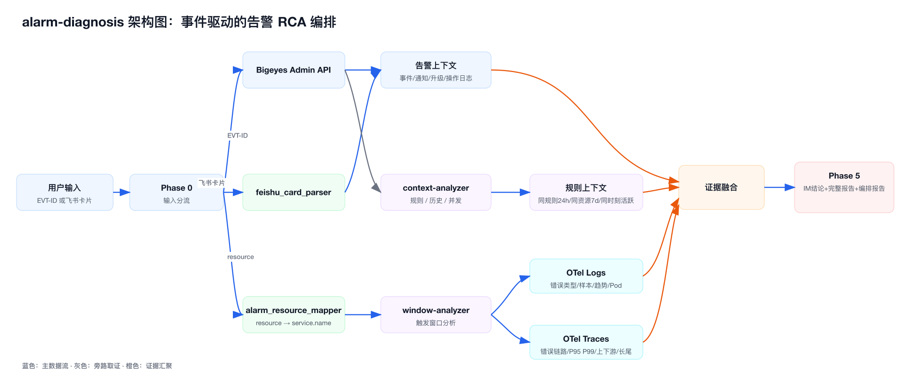

# 告警根因分析 Skill 设计说明

| 项目 | 内容 |
|---|---|
| Skill 名称 | `alarm-diagnosis` |
| 参考产物 | `/Users/a1021500303/Downloads/alarm-diagnosis-1.0.3.zip`、`apm/aiops/alarm-diagnosis/SKILL.md` |
| 设计目标 | 从告警事件 ID 或飞书告警卡片出发，自动拉取告警上下文、触发窗口日志、链路数据、历史告警和关联事件，生成根因分析与修复建议。 |
| 核心定位 | 告警事件驱动的 RCA Skill，不是服务体检工具，也不是 Bigeyes 平台内部的异步 AI 分析模块。 |
| 典型入口 | `告警 EVT-xxx 帮我看下`、飞书告警卡片正文、`5 分钟 ERROR 超阈值` 这类 oncall 诊断请求。 |
| 核心数据源 | Bigeyes Admin API、飞书卡片正文、OTel Logs、OTel Traces、共享解析脚本。 |
| 输出产物 | 飞书/IM 友好的简版结论、完整诊断报告、编排流程报告、可复现命令清单。 |

一句话讲法：

> `alarm-diagnosis` 是一个围绕 Bigeyes 告警事件做根因分析的 Agent Skill：先用告警 ID 或飞书卡片确定事件、资源、规则和触发时间，再以 `triggerTime ± 30min` 为时间锚点并发查询 Bigeyes、日志和链路，最后把规则上下文、历史频次、同时刻并发、错误样本、调用链和 Pod 分布合成一份证据驱动的 RCA 报告。

# 为什么要做这个 Skill

Bigeyes 本身解决的是告警治理平台问题：统一接入、聚合、通知、交互、状态和查询。oncall 真正收到告警后，还需要回答三个更具体的问题：

+ **为什么这条规则触发了**：是服务自身错误、下游抖动、单 Pod 异常、规则噪音，还是共享中间件问题。
+ **影响范围有多大**：是单实例、少数 Pod、整个服务，还是上游核心业务链路都被影响。
+ **下一步该谁处理、怎么处理**：需要重启、扩容、回滚、找下游 owner，还是先调规则阈值。

如果只把告警卡片丢给大模型，模型只能根据文本猜；如果只查日志，又缺少规则、通知、历史和关联事件。这个 skill 的设计重点是把上下文自动补齐，让模型只负责编排和归纳，不凭空发明证据。

# 和 Bigeyes 平台的关系

| 维度 | Bigeyes 平台 | `alarm-diagnosis` Skill |
|---|---|---|
| 职责 | 告警事件治理平台，负责消费、聚合、通知、交互、查询和 AI 分析结果存储。 | 告警 RCA 编排层，负责从事件出发跨系统取证并生成诊断报告。 |
| 运行位置 | `soul-bigeyes-schedule`、`soul-bigeyes-admin` 等平台服务内。 | 龙虾 / Claude / 本地 Agent 环境中执行。 |
| 数据角色 | 事实数据源和事件状态中心。 | 只读查询 Bigeyes，再结合 OTel 证据做推理。 |
| 写副作用 | 平台会写事件、通知、操作日志和 AI 结果表。 | 默认只读查询，不直接修改告警状态。 |
| 适用问题 | 告警有没有消费、聚合、发送、响应。 | 为什么触发、根因可能在哪、下一步如何排查。 |

所以它不是替代 Bigeyes 的 `AlarmAiStreamService`。更准确的说法是：Bigeyes 提供告警事件上下文，`alarm-diagnosis` 把 Bigeyes 上下文和 OTel 观测数据编排成一次 RCA 分析。

# 总体设计

## 设计原则

| 原则 | 说明 |
|---|---|
| 告警事件优先 | 入口必须围绕某条告警事件或告警卡片，而不是泛泛问某个服务是否健康。 |
| 精准时间窗 | 以告警 `triggerTime` 为锚点，默认查 `triggerTime - 30min` 到 `triggerTime + 30min`，避免用相对时间导致报告漂移。 |
| 证据驱动 | 结论必须来自 Bigeyes、logs、traces 或 parser 的结构化证据；证据不足时要显式写观测限制。 |
| 并发取证 | 告警详情、通知、规则、日志、链路等查询大多互不依赖，需要并发执行，把诊断时延压到 oncall 可接受范围。 |
| 分支短路 | 只有 `Application` 类告警走完整日志和链路诊断，非应用类告警输出信息卡片，避免错误下钻。 |
| 多层降级 | Trace 优先，日志兜底，飞书卡片再兜底；`INTERNAL_TOKEN` 或 OTel 缺失时仍尽量给出可用但带限制的报告。 |

## 架构图



# 上下文从哪里来

## 1. 用户输入和飞书卡片正文

飞书卡片是没有 EVT-ID 或没有 Bigeyes token 时的第一层上下文。`shared/scripts/feishu_card_parser.py` 会把自然语言卡片转成结构化字段：

| 字段 | 用途 |
|---|---|
| `event_id` | 如果卡片里有 EVT-ID，直接进入完整 pipeline。 |
| `rule_name` | 用于匹配 Bigeyes 事件、生成报告标题、判断规则类型。 |
| `resource` | 用于映射 OTel `service.name`，也是查同资源历史告警的 key。 |
| `trigger_time` / `trigger_time_end` | 生成绝对查询窗口。 |
| `level` | 决定报告里的紧急程度和建议优先级。 |
| `top_exception` / `top_errors` / `sample_log` | token 缺失或 OTel miss 时，仍能基于卡片错误样本给出初步判断。 |
| `ip_distribution` | 作为 Pod 分布的卡片兜底来源。 |
| `scenarios` / `primary_scenario` | 识别 MQ consumer、Dubbo RPC、DB、Redis、锁失败等场景，影响修复建议。 |
| `confidence` | 判断是否需要 LLM 二次抽取；低置信时不能假装字段完整。 |

这个 parser 的价值是把卡片里的告警事实从“文本上下文”变成“可验证字段”。这样主 Agent 不需要手写一堆脆弱正则，也不会因为卡片格式略有变化就直接编造字段。

## 2. Bigeyes Admin API

Bigeyes 是告警事件的主上下文源。`bigeyes_admin_api_client.py` 通过 `INTERNAL_TOKEN` 读取 Cas-User，并根据 `PLATFORM_ENV` 选择生产或测试环境。

| 查询 | 获取内容 | RCA 用途 |
|---|---|---|
| `alarm-event-detail <EVENT_ID>` | 事件详情、分类、资源、规则 ID、级别、状态、触发时间、卡片内容。 | 确定诊断对象和时间锚点。 |
| `alarm-event-notify-records <EVENT_ID>` | 通知渠道、接收人、成功失败、错误原因。 | 判断告警是否触达、是否被限流、是否存在通知异常。 |
| `alarm-event-escalation <EVENT_ID>` | 升级记录。 | 判断 P0/P1 是否无人响应、是否已经升级。 |
| `alarm-event-logs <EVENT_ID>` | ack、resolve、mute、误报、一键拉群等操作日志。 | 判断是否有人处理过、是否复发、历史动作是否有效。 |
| `alarm-rule-detail <RULE_ID>` | 规则表达式、阈值、规则配置、最近变更。 | 判断是否真异常、阈值是否过敏、规则是否近期被改动。 |
| `alarm-events --rule-id <RULE_ID>` | 同规则近期告警列表。 | 判断规则噪音、24h 触发频次和复发间隔。 |
| `alarm-events --resource <RESOURCE>` | 同资源近 7d 全规则告警。 | 判断是否为资源级反复问题。 |
| `alarm-stats-active --start ... --end ...` | 触发时刻附近活跃告警。 | 判断是否雪崩、共享下游故障或平台级异常。 |

这里最关键的不是“查到了更多字段”，而是把单条告警放回 Bigeyes 事件上下文里：它是不是噪音规则、是不是复发、是否有同时刻并发告警、有没有人响应过、通知是否成功。

## 3. OTel Logs

`logs_client.py` 负责触发窗口内的日志证据。

| 查询 | 证据 |
|---|---|
| `aggregate --group-by exception.type` | Top 异常类型，识别主错误。 |
| `aggregate --group-by logger.name` | 错误来源模块，帮助定位业务入口或 SDK。 |
| `search-logs --q "severity_text=ERROR AND service.name=..."` | 错误样本、trace_id、异常堆栈、关键字段。 |
| `trend --service ...` | 错误时序图，判断告警时刻是否突增、是否已经恢复。 |
| `aggregate --group-by host.id` | Pod / IP 分布兜底，判断是否单 Pod 或少数 Pod。 |
| `trace-logs --trace-id ...` | 按 trace 拉跨服务日志，补齐单个样本上下文。 |

日志侧适合回答“错误是什么”和“是不是在告警时刻爆发”。但日志不一定能稳定提供下游应用，尤其老 Dubbo SDK 可能缺 `remote.application`，所以 skill 不把日志归因当唯一主路径。

## 4. OTel Traces

`traces_client.py` 负责链路、性能、上下游和长尾证据。

| 查询 | 证据 |
|---|---|
| `list-errors --service ...` | trace 侧异常聚合，和日志 Top 异常互相校验。 |
| `trace-services --trace-id ...` | 单条 trace 涉及哪些服务，构造调用拓扑。 |
| `get-trace --trace-id ...` | 完整调用链明细。 |
| `overview --service ...` | QPS、错误率、P99 总览，用于和基线对比。 |
| `dubbo-duration` / `http-duration` | P50/P95/P99 时序，判断是否性能退化。 |
| `long-op` / `long-trace` | 长尾操作和长尾样本。 |
| `dubbo-upstream` / `dubbo-upstream-interfaces` | 谁在调用当前服务，评估业务影响范围。 |
| `dubbo-downstream` / `dubbo-downstream-interfaces` | 当前服务主要调用哪些下游，支持下游归因。 |
| `long-ip-distribution` | trace 维度 Pod 分布，优先级高于日志兜底。 |

Trace 是下游归因的主路径。只要 trace 拓扑能说明跨服务调用链，报告就应该优先写 trace 证据；只有 trace 缺失、采样不足或拓扑只有单服务时，才进入日志正则兜底。

## 5. 共享解析脚本

| 脚本 | 作用 |
|---|---|
| `alarm_resource_mapper.py` | 把 Bigeyes `resource` 映射成 OTel `service.name`，并提供多候选探测。 |
| `dubbo_log_parser.py` | 在 trace 缺失或老 SDK 字段不全时，从日志样本解析下游服务、中间件实例和 Pod 分布 verdict。 |
| `feishu_card_parser.py` | 把飞书卡片正文解析成事件、规则、资源、时间、错误和场景字段。 |
| `otel_client_common.py` | 统一 OTel 查询客户端、环境选择、时间范围和输出格式。 |

其中 `alarm_resource_mapper.py` 很重要。Bigeyes 资源名经常是 `prod-pay-asset`、`prod-chat-biz-dubbo-k8s` 这类平台资源名，而 OTel 里的 `service.name` 可能是 `pay-asset` 或 `chat-biz`。skill 要先用 mapper 给出候选，再并发 probe logs/traces 是否有数据，不能让大模型凭感觉 strip 字符串。

# 诊断 Pipeline

## Phase 0：输入分流

| 路径 | 触发条件 | 行为 |
|---|---|---|
| A. 纯 EVT-ID | 用户直接给 `EVT-...` 或事件 ID。 | 直接查 Bigeyes，进入完整 5 阶段 pipeline。 |
| B. 飞书卡片正文 | 用户粘贴或 @ 机器人时带了卡片。 | 用 `feishu_card_parser.py` 抽字段；有 EVT-ID 则回到路径 A；无 EVT-ID 则用 resource / rule 反查 Bigeyes。 |
| C. 无 `INTERNAL_TOKEN` | 无法访问 Bigeyes Admin API。 | 跳过 Bigeyes API 和 context-analyzer，只用卡片正文 + logs/traces 诊断，并在报告里声明历史、复发、并发数据不可用。 |
| D. OTel 未接入或 service.name miss | mapper 候选和 list-apps 都查不到服务。 | 停止浪费 OTel 查询，改用飞书卡片 + Bigeyes 上下文生成降级报告。 |

Phase 0 的核心是先决定“能查哪些证据”，避免后面大量空查询，也避免把缺失数据包装成确定结论。

## Phase 1：拉告警基本信息

并发查询：

+ `alarm-event-detail`
+ `alarm-event-notify-records`
+ `alarm-event-escalation`
+ `alarm-event-logs`

这一阶段产出诊断的事实锚点：

+ `alarm-category`：决定是否能深度诊断。
+ `resource`：用于映射 `service.name`。
+ `triggerTime`：用于构造绝对时间窗。
+ `ruleId`：用于规则上下文和同规则历史。
+ `level` / `status`：用于紧急程度和处理建议。

## Phase 2：按告警类别分支

当前完整诊断只对 `Application` 类告警成立：

```python
if is_diagnosable_category(category):
    service = resource_to_service(resource)
    # 进入 window-analyzer + context-analyzer
else:
    # 输出信息卡片，不强行查 logs/traces
```

这个分支看似简单，但很关键。Redis、RDS、KafkaTopic、ECS、NginxDomain 等告警不是不能诊断，而是它们需要各自的指标 skill 或主机 / 中间件工具。如果强行套应用日志和 trace，结果大概率是空数据或误导。

## Phase 3：触发窗口分析

`window-analyzer` 负责查 `triggerTime ± 30min` 内的错误、性能、链路和 Pod 分布。它的输入是 `service`、`start`、`end`、`event_id`、`env`。

典型并发查询包括：

+ 日志 Top 异常、Top logger、ERROR 样本、错误趋势、host 分布。
+ Trace 错误聚合、应用总览、Dubbo / HTTP 延迟、长尾操作、长尾 trace。
+ 上游应用、上游接口、下游应用、Pod/IP 分布。

输出的是结构化 JSON，而不是最终报告。主 Agent 后续只负责合并，不让子 Agent 各写一份风格不一致的分析。

## Phase 4：规则上下文和关联告警

`context-analyzer` 负责查规则、历史和并发上下文：

+ `alarm-rule-detail`：阈值和表达式。
+ `alarm-events --rule-id`：同规则 24h 频次、是否噪音规则。
+ `alarm-events --resource`：同资源 7d 趋势、是否反复出问题。
+ `alarm-stats-active`：触发时刻是否存在大规模并发告警。
+ `alarm-event-logs`：历史响应、ack、处理动作。

这一阶段帮助主 Agent 区分“单条服务故障”和“告警规则噪音 / 雪崩表象 / 复发问题”。例如同一时刻如果有大量下游或中间件告警 active，当前应用告警就可能只是连锁反应。

## Phase 5：证据融合与输出

主 Agent 合并 Phase 1、window-analyzer、context-analyzer 的结果，输出三类产物：

+ **IM 简版结论**：结论先行，适合飞书群里快速看。
+ **完整诊断报告**：包含告警基本信息、规则上下文、触发窗口、告警画像、链路归因、观测限制、根因假设、修复建议、通知响应和复现命令。
+ **编排流程报告**：记录本次执行了哪些 Phase、参数是什么、命令返回了什么、哪里降级、耗时如何，方便复盘和迭代 skill。

编排报告是这个 skill 的一个重要设计点。它让 RCA 不只是“模型给了一个答案”，而是能回看整个取证过程：哪些数据源查过、哪些没查到、最终结论依赖哪些证据。

# 证据融合逻辑

## 1. 告警画像

告警画像来自 Bigeyes 事件和历史查询：

| 维度 | 判断 |
|---|---|
| 历史频次 | 同规则 24h 触发次数，判断是否噪音规则。 |
| 同资源趋势 | 同资源近 7d 告警数量和趋势，判断是否复发或长期不稳定。 |
| 复发判定 | 结合操作日志和历史事件，看是否之前处理过又再次触发。 |
| 同时刻并发 | 触发前后 5 分钟 active 告警数量，判断是否雪崩或共享依赖问题。 |

## 2. 触发窗口分析

触发窗口来自 OTel logs/traces：

+ 错误类型是否集中在某个异常。
+ 错误趋势是否在 triggerTime 附近突增。
+ P95/P99 是否升高，是否存在明显长尾。
+ 错误是否集中在单 Pod、少数 Pod，还是服务级分布。
+ trace 中是否能看到下游超时、DB 慢查询、Redis / HBase / MQ 异常。

## 3. 下游归因双轨

下游归因采用“Trace 优先，Log 兜底”：

1. 先从 top error trace 调 `trace-services`，看调用拓扑里是否有明确下游。
2. 如果 trace 能指出下游服务，就以 trace 为主证据。
3. 如果 trace 缺失、采样不足、拓扑只有单服务，或者日志样本大量缺 `remote.application`，再用 `dubbo_log_parser.py` 从日志中解析 providers、host、table、key、topic 等线索。
4. 如果两边都不充分，报告里明确写 `observability_limits`，不要强行给确定根因。

## 4. Pod 分布判定

Pod 分布不是靠自然语言感觉判断，而是使用固化 verdict：

| verdict | 含义 |
|---|---|
| `single-pod-likely` | Top1 Pod 占比足够高，倾向单 Pod 问题。 |
| `two-pod-likely` | Top2 Pod 占比足够高，倾向少数 Pod 问题。 |
| `few-pod-skew` | 少数 Pod 偏斜，但未到强单点。 |
| `multi-pod-service-wide` | 多 Pod 分布，倾向服务级或下游问题。 |
| `unknown` | 数据不足。 |

这个设计避免不同 Agent 每次用不同措辞重新解释同一组数字，提升跨次诊断一致性。

## 5. 根因假设分层

最终根因不是单句拍脑袋，而是按证据强弱排序：

+ **主因**：必须有日志 / trace / 历史 / 并发中的多条证据支撑。
+ **次因**：有部分证据，但可能只是放大因素。
+ **被否定的假设**：例如“不是单 Pod”，因为 Pod 分布显示多 Pod；“不是规则噪音”，因为同规则历史低频且触发时错误突增。
+ **观测限制**：trace 采样低、service.name miss、token 缺失、卡片字段不全等。

# 为什么要用 Subagent 并发

一次完整诊断会涉及十几条查询。如果主 Agent 串行执行，oncall 可能要等 6 到 8 分钟；而 Phase 3 和 Phase 4 大多没有依赖关系，可以并行压缩到 2 到 3 分钟。

| 子任务 | 职责 | 典型查询 |
|---|---|---|
| `window-analyzer` | 触发窗口内的日志、链路、性能、上下游和 Pod 证据。 | `logs_client.py`、`traces_client.py` |
| `context-analyzer` | 告警规则、历史频次、同资源趋势、同时刻并发。 | `bigeyes_admin_api_client.py` |
| 主 Agent | 输入分流、分支判断、证据合并、报告输出。 | 不重复跑子任务，不单独脑补证据。 |

这个拆分还有一个工程收益：每个子任务输出 JSON schema，主 Agent 只做合成，后续评估时可以分别看“取证是否完整”和“总结是否准确”。

# 降级策略

| 场景 | 降级方式 | 报告必须说明的限制 |
|---|---|---|
| `INTERNAL_TOKEN` 缺失 | 跳过 Bigeyes API 和 context-analyzer，用飞书卡片 + logs/traces。 | 历史频次、复发判定、同时刻并发不可用。 |
| 飞书卡片无 EVT-ID | 用 resource / rule 反查 Bigeyes；反查不到则用 `cardonly-<time>` 占位。 | 事件级通知和操作日志可能不可用。 |
| Bigeyes JSON 解析失败 | 用 `--raw` 模式和正则抽取关键字段。 | 不应在第一次 `json.loads` 失败后放弃。 |
| OTel service.name 映射失败 | 停止 logs/traces 深查，基于卡片 + Bigeyes 上下文输出。 | trace/log 数据不可用，不能量化链路和 Pod。 |
| Trace 缺失或采样不足 | 用日志样本和 `dubbo_log_parser.py` 兜底。 | 下游归因来源为 `log-fallback`，准确度低于 trace。 |
| 非 Application 类告警 | 输出信息卡片和下一步建议，不查应用 logs/traces。 | 需要 Redis / RDS / Kafka / ECS 等专项 skill 才能深度分析。 |

# 输出报告结构

完整报告建议保留这些章节：

1. **告警基本信息**：事件、规则、资源、级别、状态、触发时间。
2. **规则上下文**：表达式、阈值、规则最近改动、是否噪音。
3. **触发窗口分析**：错误趋势、Top 异常、错误样本、性能指标。
4. **告警画像**：同规则 24h、同资源 7d、复发、同时刻并发。
5. **链路与下游归因**：调用链、上游影响、下游服务、问题实例。
6. **Pod 分布**：verdict、Top IP、数据源。
7. **观测限制**：token、trace、service.name、卡片字段等限制。
8. **根因假设**：主因、次因、否定假设。
9. **修复建议**：短期止血、Owner 路由、后续治理。
10. **通知与响应**：谁收到、是否升级、是否有人 ack。
11. **复现命令**：本次关键查询命令。
12. **一句话结论**：方便 IM 转发。

飞书响应正文不应该把完整报告全部展开，而是结论先行，只保留关键指标、根因和行动项；详细证据放到 Markdown 报告和编排报告里。

# 设计取舍

| 取舍 | 选择 | 原因 |
|---|---|---|
| 入口按告警而不是按服务 | 以 EVT-ID / 卡片为入口。 | oncall 的真实问题是“这条告警为什么触发”，不是泛泛服务体检。 |
| 时间窗用绝对时间 | `triggerTime ± 30min`。 | 保证报告可复现，不受当前时间变化影响。 |
| Trace 优先于日志归因 | trace 拓扑作为主证据。 | 日志字段可能不完整，trace 更适合跨服务归因。 |
| 非应用告警短路 | 不强行查应用 logs/traces。 | 避免空查询和误导，后续应该路由到专项指标 skill。 |
| 使用 parser 而不是纯 LLM 抽字段 | 卡片和 Dubbo 日志交给规则脚本。 | 关键字段要稳定、可测试、可复现。 |
| 产出编排报告 | 每次诊断记录取证过程。 | 支持复盘、评估和 skill 迭代。 |
| 缺数据时显式降级 | 写 `observability_limits`。 | 运维场景里“不知道”比伪确定根因更安全。 |

# 边界和风险

+ **不是自动处置系统**：skill 默认只读查询，不直接 ack、resolve、mute 或执行重启、扩容、回滚。
+ **不是所有告警都能深度 RCA**：当前完整链路主要支持 Application 类告警；中间件、主机、域名、PromQL 指标类告警需要补专项工具。
+ **结论依赖观测覆盖率**：如果 trace 采样低、日志字段缺失、service.name 映射失败，归因准确度会下降。
+ **Bigeyes token 影响上下文完整度**：没有 `INTERNAL_TOKEN` 时仍能分析错误窗口，但缺少历史、复发、通知和并发告警画像。
+ **规则噪音不能只靠模型判断**：必须结合 `alarm-rule-detail`、同规则频次和触发窗口趋势。
+ **下游归因要标来源**：`trace` 和 `log-fallback` 的可信度不同，报告必须写清楚。

# 如果继续演进

| 方向 | 价值 |
|---|---|
| 非 Application 类路由 | Redis、RDS、Kafka、ECS、NginxDomain 等告警路由到专项 skill。 |
| 诊断结果回写 Bigeyes | 把报告摘要、根因标签、证据链接写回 `alarm_ai_analysis` 或相似事件库。 |
| 相似事件复用 | 同规则或同 fingerprint 再次触发时，自动引用上次根因和处理动作。 |
| service.name 自学习 | 从历史成功诊断中沉淀 `resource -> service.name` 映射，减少 probe 成本。 |
| 评估集建设 | 从历史告警和复盘中构造 benchmark，评估根因命中、证据覆盖和 Unknown 合理性。 |
| 动作分级 | 未来可把低风险动作做成受控建议，高风险动作仍走审批和审计。 |

# 面试讲法

## 三十秒版

这个告警根因分析 skill 是围绕 Bigeyes 告警事件设计的。入口是 EVT-ID 或飞书告警卡片，先从 Bigeyes 拉事件详情、通知、操作日志、规则和历史告警，再用告警触发时间构造 `±30min` 的日志和链路查询窗口。Application 类告警会并发跑两个分析器：一个查 OTel logs/traces，看错误、性能、上下游和 Pod 分布；另一个查 Bigeyes 上下文，看规则阈值、同规则频次、同资源复发和同时刻并发。最后主 Agent 把这些证据合成 RCA 报告，并明确 trace 缺失、token 缺失、service.name miss 等观测限制。核心理念是证据驱动、Trace 优先、日志兜底、卡片再兜底。

## 一分钟版

这个 skill 和普通日志分析最大的区别是它不是只看 ERROR 日志，而是从“告警事件”出发做 inside-out 诊断。Phase 0 先识别输入是 EVT-ID 还是飞书卡片；Phase 1 拉 Bigeyes 事件上下文，拿到 resource、ruleId、triggerTime；Phase 2 判断是否 Application 类告警，并把 resource 映射成 OTel 的 service.name；Phase 3 查触发窗口内的日志和 trace，包括 Top 异常、错误趋势、P95/P99、上游影响、下游调用和 Pod 分布；Phase 4 查规则上下文、同规则 24h、同资源 7d 和同时刻活跃告警；Phase 5 输出 IM 结论、完整报告和编排报告。这样既能回答“为什么触发”，也能回答“是不是噪音、是不是复发、是不是连锁反应、谁该处理”。

## 高频追问

### Q：上下文具体从哪些地方取？

主要五类：第一是飞书卡片正文，用 parser 抽事件、规则、资源、时间、Top 错误和 IP 分布；第二是 Bigeyes Admin API，取事件详情、通知、升级、操作日志、规则、同规则历史、同资源历史和同时刻活跃告警；第三是 OTel Logs，取错误类型、样本、趋势和 Pod 兜底；第四是 OTel Traces，取错误链路、P95/P99、长尾、上下游和完整 trace；第五是共享脚本，比如 resource 到 service.name 映射、Dubbo 日志兜底归因。

### Q：为什么不直接把飞书卡片丢给大模型？

卡片只能提供表面事实，缺少规则阈值、历史频次、同时刻并发、通知响应和 trace 证据。直接让模型看卡片容易猜根因。这个 skill 的设计是先把事实补齐，再让模型做证据归纳。

### Q：为什么要 Trace 优先、Log 兜底？

跨服务根因需要调用拓扑。Trace 能直接看到 upstream、downstream 和具体操作，适合判断是自身问题还是下游问题。日志里有时缺 `remote.application`，尤其老 Dubbo SDK，靠日志正则只能作为兜底，所以报告里要标明 `trace` 还是 `log-fallback`。

### Q：怎么避免误判单 Pod 问题？

Pod 分布不让模型自由发挥，而是用固定阈值输出 verdict，比如 `single-pod-likely`、`few-pod-skew`、`multi-pod-service-wide`。如果 Top IP 占比不够高，就不能把它说成单 Pod 根因。

### Q：没有 token 怎么办？

没有 `INTERNAL_TOKEN` 时跳过 Bigeyes API，保留飞书卡片 + OTel logs/traces 的诊断能力，但报告要明确历史频次、复发判定、同时刻并发和通知记录不可用。

### Q：这和 Bigeyes 自身 AI 分析有什么区别？

Bigeyes 自身 AI 分析更像平台内异步能力，结果可以存在 `alarm_ai_analysis`。这个 skill 是外部 Agent 编排能力，读取 Bigeyes 和 OTel 上下文，面向 oncall 即时生成 RCA 报告。未来可以把 skill 产出的根因摘要和证据链接回写到 Bigeyes，形成平台化闭环。
