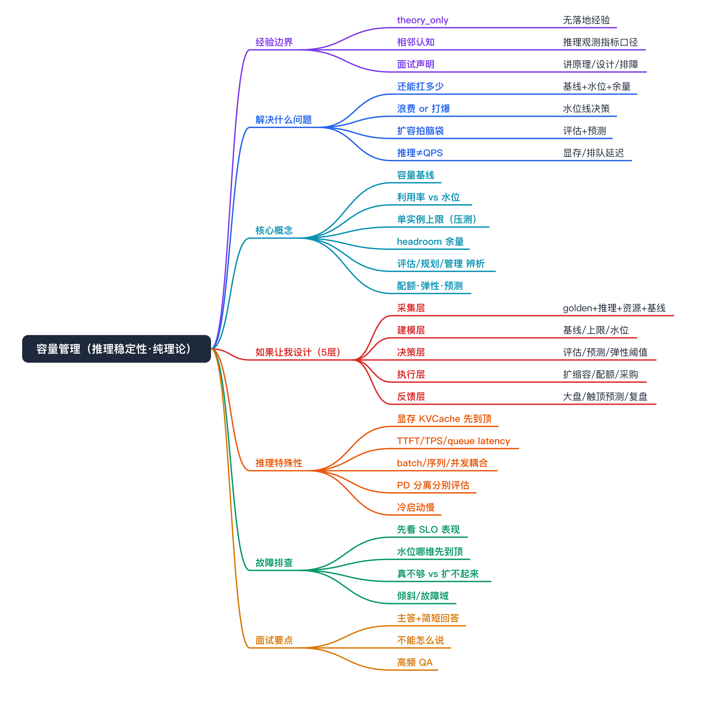
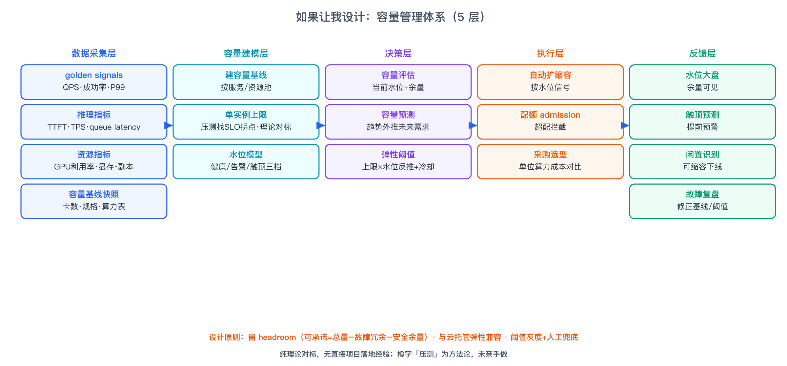
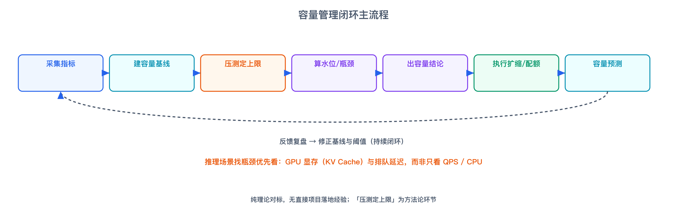
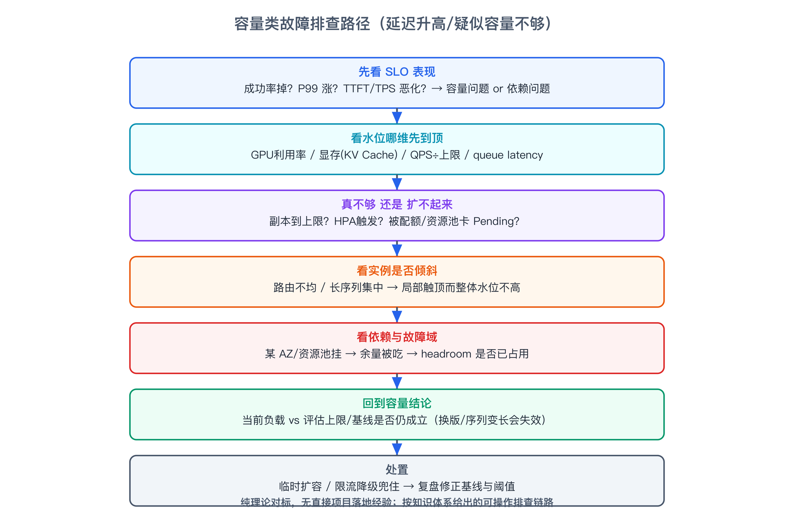

# 容量管理 面试准备



这是面向 MiniMax 大规模 AI 推理稳定性岗位准备的「容量管理」纯理论对标文档。容量管理、容量评估、压测我都没有直接项目落地经验，本文按「知识点原理 + 如果让我设计该怎么做 + 怎么排查」来写——这类题面试官一定会问「如果让你设计一套容量管理体系你会怎么做」，重点是讲清原理、设计思路和取舍，不包装成项目经验。

# 经验边界

```yaml
experience_level: theory_only
```

- 我没有做过什么：没有做过容量管理/容量评估/容量规划这种专项工程，也没有做过压测（load test / benchmark）。
- 我有的相邻认知：工作中在推理平台侧见过部分观测指标（QPS、GPU 利用率、显存、TTFT/TPS、queue latency）的口径，知道它们意味着什么，但这只是认知，不是我做的容量管理。
- 我通过对标理解了什么：容量管理的整套方法论——基线、利用率/水位、单实例上限、安全余量、弹性阈值、容量预测，以及推理场景为什么和普通 Web 服务不一样。
- 面试中如何声明：开口先说「容量管理这套体系我没有直接落地经验，我是按知识体系准备的，可以讲清原理、如果让我设计会怎么做、以及怎么排查」。不编造任何利用率提升、成本节省、容量规模的数字。

# 为什么需要掌握

- 面试高频必问：稳定性/SRE 岗几乎一定会问「如果让你给一个大规模推理服务设计容量管理，你会怎么做」，这是考察系统设计能力，不一定要求你做过。
- 是推理稳定性的核心一环：MiniMax JD 把「容量评估与压测」明确列进稳定性工作流。
- 能解释云托管弹性背后的通用逻辑：EAS/KServe 的自动扩缩容、配额、水位告警，背后都是容量管理这套逻辑。
- 体现工程判断：容量管理涉及成本与稳定性的权衡、SLO 与利用率的权衡，能讲清取舍比会背概念更重要。

# 容量管理解决什么问题

- 不知道系统还能扛多少，扩容只能拍脑袋
  - 对应能力：容量基线 + 单实例上限 + 水位，把「还剩多少余量」量化。
  - 面试表达：容量管理的核心产出是「当前水位 + 安全余量 + 触顶预测」，让扩容有据。
- 资源要么浪费要么打爆，没有水位线
  - 对应能力：利用率/水位监控 + 闲置识别 + 配额护栏。
  - 面试表达：低水位是浪费、高水位是风险，要给出健康水位区间和告警阈值。
- 扩缩容阈值靠经验，弹性不及时或抖动
  - 对应能力：由单实例上限和目标水位反推扩缩容触发条件和步长。
  - 面试表达：阈值不是拍的，要由容量上限反推，并加冷却窗口防抖。
- 推理服务用普通服务那套 QPS 判断容量会失真
  - 对应能力：推理特有容量维度——GPU 显存（KV Cache）、TTFT/TPS、queue/Decode latency。
  - 面试表达：大模型推理常常显存或排队延迟先到顶，QPS 还没满就已经不可用。
- 故障时没有冗余余量，一挂就雪崩
  - 对应能力：headroom / N+1 / 故障域冗余规划。
  - 面试表达：容量不能按 100% 打满规划，要留故障域和突发余量。
- 容量需求增长来不及响应
  - 对应能力：容量预测 + 提前采购/扩池。
  - 面试表达：按趋势预测未来需求，把被动扩容变成提前规划。

# 核心概念

- 容量基线（capacity baseline）
  - 一句话：系统当前拥有的资源清单和单位能力，是评估的分母。
  - 解决的问题：没有基线就无法算水位和余量。
  - 可能追问：基线怎么保证准（多云口径不一致、异构卡型规格映射）。
- 利用率 vs 水位（utilization vs watermark）
  - 一句话：利用率是「用了多少比例」，水位是「相对健康阈值处在什么位置」（健康/告警/触顶三档）。
  - 解决的问题：利用率只是观测，水位才是决策线。
  - 可能追问：用平均还是分位？为什么峰值水位比平均更重要——平均会掩盖尖峰。
- 单实例容量上限（single-instance ceiling）
  - 一句话：一个实例在 SLO 不破的前提下能承载的最大负载。
  - 解决的问题：它是扩缩容阈值和总容量推算的基准。
  - 怎么来：标准做法靠压测，逐步加压找 SLO 拐点。要区分是 SLO 先恶化还是资源（显存/GPU）先打满。
  - 可能追问：压到什么算到顶、模型换版后旧上限为什么失效。
- 安全余量 / headroom / 冗余
  - 一句话：不能按满规划，要留突发流量和故障域冗余（N+1、跨可用区）。
  - 解决的问题：防止单点故障或突发把容量打穿。
  - 可能追问：余量留多少合理、怎么和成本平衡。
- 容量评估 vs 容量规划 vs 容量管理（概念辨析）
  - 容量评估：算清「现在能扛多少、还剩多少余量」，偏当下。
  - 容量规划：预测「未来需要多少」，偏中长期采购/扩池。
  - 容量管理：把评估、规划、弹性、配额、成本治理串成持续闭环。
  - 可能追问：三者关系、压测在其中是哪一环（评估的输入）。
- 推理特有容量维度
  - 一句话：大模型推理瓶颈常是 GPU 显存（KV Cache）、TTFT、TPS、queue/Decode latency，而非 CPU/QPS。
  - 解决的问题：避免用 Web 服务容量模型误判推理容量。
  - 可能追问：batch size、并发、序列长度怎么影响显存和吞吐。
- 配额 / admission 控制
  - 一句话：创建/扩容时校验资源请求 vs 池子余量，超限拦截。
  - 解决的问题：防止超配把共享资源池打爆。
  - 可能追问：配额怎么分（按 Space/项目/优先级）、抢占怎么处理。
- 弹性扩缩容（autoscaling）
  - 一句话：按水位信号自动扩缩，把容量和负载对齐。
  - 解决的问题：人工扩容慢、易抖动。
  - 可能追问：HPA 用什么指标、推理为什么要把显存/排队延迟作为扩缩信号、冷启动怎么兜。
- 容量预测
  - 一句话：按历史负载和业务增长趋势外推未来容量需求。
  - 解决的问题：避免临时扩容来不及。
  - 可能追问：用什么方法（趋势外推/周期性/事件驱动）、业务突增怎么兜。

# 如果让我设计一套容量管理体系

这是面试最可能问的题。我会按分层来设计（强调是设计思路，不是已落地）：



- 数据采集层：用 Prometheus/VictoriaMetrics 拉三类指标——业务 golden signals（QPS、成功率、P99）、推理指标（TTFT、TPS、queue latency、Decode latency）、资源指标（GPU 利用率、显存占用、Pod 副本数）；资产侧落容量基线快照（总卡数、单卡显存、单实例规格、卡型算力表）。
- 容量建模层：为每个服务/资源池建立基线，并确定单实例容量上限——这一步标准做法靠压测找 SLO 拐点；在上限基础上为每个维度定水位模型（健康/告警/触顶三档），推理场景优先盯显存和排队延迟。
- 决策层：容量评估（当前水位 + 余量）、容量预测（趋势外推未来需求）、弹性阈值推导（由单实例上限 × 目标水位反推扩缩容触发点和步长，加冷却窗口防抖）。
- 执行层：自动扩缩容、配额 admission（超配拦截）、采购选型（用单位算力成本对比不同卡型）。
- 反馈层：水位大盘 + 触顶预测 + 闲置识别，周期性把「水位/余量/可缩容/需扩容」推给业务和 SRE，故障后复盘修正基线和阈值。
- 设计原则：留 headroom（可承诺容量 = 总容量 − 故障冗余 − 安全余量）；和云托管自带弹性兼容而非对抗（把推理特有指标补进扩缩信号）；阈值灰度上线、保留人工兜底。

# 容量管理闭环主流程



采集指标 → 建容量基线 → 压测定单实例上限 → 算水位/找瓶颈 → 出容量结论（扩/缩/选型/余量）→ 执行（扩缩容/配额/采购）→ 容量预测 → 反馈复盘，再回到采集，形成持续闭环。推理场景的关键差异：找瓶颈时优先看 GPU 显存（KV Cache）和排队延迟，而不是只看 QPS/CPU。

# 推理场景的容量管理特殊性

把容量管理用到大模型推理上，和普通 Web 服务最大的不同：

- 显存常先到顶：KV Cache 随并发数和序列长度增长，往往显存先打满，QPS 还远没到上限。
- 看延迟结构而非只看 QPS：要盯 TTFT（首 token 延迟）、TPS（吞吐）、queue latency（排队）、Decode latency。
- batch / 序列长度 / 并发强耦合：同样的 QPS，长序列和大 batch 对显存和吞吐影响完全不同，容量上限是个多维曲面而非单点。
- PD 分离要分别评估：Prefill 和 Decode 资源特征不同（Prefill 算力密集、Decode 显存与带宽敏感），要按组件分别定容量和扩缩。
- 冷启动成本高：模型加载/显存预热慢，扩容不是秒级，弹性要提前触发、留缓冲。
- 多云异构卡型：H800/A800/H20/L20 算力和显存不同，容量基线要按卡型归一（如单位 FP16 算力）。

# 如果线上出问题，我怎么排查



以「推理服务延迟升高/疑似容量不够」为例，按可操作链路排查：

- 先看 SLO 表现：是成功率掉、P99 涨，还是 TTFT/TPS 恶化——定位是容量问题还是依赖问题。
- 看水位哪维先到顶：GPU 利用率、显存占用、QPS/单实例上限、queue latency 哪个先触顶。推理优先怀疑显存（KV Cache 涨）和排队延迟。
- 区分「真不够」还是「没扩起来」：副本是否达上限、HPA/扩缩容是否触发、是否被配额/资源池卡 Pending。
- 看实例是否倾斜：是否个别实例热点（路由不均、长序列请求集中）导致局部触顶而整体水位不高。
- 看依赖与故障域：是否某可用区/资源池挂了导致余量被吃掉，headroom 是否已被占用。
- 回到容量结论：核对当前负载 vs 评估时的单实例上限和基线是否还成立（模型换版、序列变长都会让旧上限失效）。
- 处置：临时扩容/限流降级兜住，复盘时修正容量基线和水位阈值。

# 和我现有经验的映射

- 容量管理 / 容量评估 / 容量规划 / 压测：无直接项目关联，仅作理论对标，不包装成项目经验。
- 推理观测指标（TTFT/TPS/queue latency/GPU 利用率/显存）：在推理平台侧见过口径，属于相邻认知，能帮我理解推理容量为什么特殊，但不是我做的容量管理工作。

# 面试话术

主答：容量管理这套体系我没有直接落地经验，这点我先说清楚，我是按知识体系准备的。如果让我设计，我会分五层：采集层把业务 golden signals、推理指标和资源指标都拉齐，并落容量基线；建模层确定单实例容量上限（标准做法靠压测找 SLO 拐点）并定水位模型；决策层做容量评估、预测和弹性阈值推导；执行层做自动扩缩容、配额拦截和采购选型；反馈层做水位大盘、触顶预测和复盘。我会特别强调推理和普通服务的区别：推理常常是 GPU 显存（KV Cache）或排队延迟先到顶，QPS 还没满就不可用，所以容量信号要盯显存、TTFT、TPS 和 queue latency。压测我没有实战，被问到我会直接说，只能讲方法论。

简短回答：

- 你做过容量管理吗：没做过专项落地，我按知识体系准备，能讲原理、设计和排障。
- 如果让你设计怎么做：采集→建基线→压测定上限→定水位→推弹性阈值→配额护栏→留 headroom→大盘和预测，闭环。
- 推理容量和普通服务有什么不同：推理常是显存/排队延迟先到顶，要看 TTFT/TPS/queue latency 和 KV Cache 显存，而非只看 QPS。
- 单实例容量上限怎么来：标准做法靠压测找 SLO 拐点，我懂方法但没实战。
- 容量评估、规划、管理什么区别：评估算当下能扛多少、规划预测未来要多少、管理是把两者加弹性配额成本串成闭环。
- 余量留多少：按故障域和突发规划，比如 N+1 加一段突发余量，余量越大越安全越贵，要和成本平衡。

# 不能怎么说

| 不要这么说 | 风险 | 应该这么说 |
|---|---|---|
| 我搭过推理服务的容量管理体系 | 没落地经验会被击穿 | 我没做过，但能讲清如果让我设计会怎么做 |
| 我通过压测定了单实例容量上限 | 没压测实战 | 压测我没做过，标准做法是压到 SLO 拐点 |
| 容量管理让我们 GPU 利用率提升 X% | 编造收益 | 我没有真实数字，只讲方法和度量口径 |
| 我调过 HPA 扩缩容算法 | 没实现证据 | 我理解扩缩容阈值怎么由上限和水位反推 |
| 推理容量就是看 QPS 够不够 | 暴露不懂推理 | 推理常是显存或排队延迟先到顶，要多维看 |

# 高频 QA

如果让你给大规模推理服务设计容量管理，你会怎么做？分五层：采集（golden signals + 推理指标 + 资源 + 基线）、建模（单实例上限 + 水位模型）、决策（评估 + 预测 + 弹性阈值）、执行（扩缩容 + 配额 + 采购）、反馈（大盘 + 触顶预测 + 复盘）。核心是把容量量化成水位和余量，让扩容有据、超配可拦、触顶可预测。

容量评估和压测什么关系？压测是容量评估的一个输入环节，用来找单实例在 SLO 不破前提下的上限；评估再用这个上限加水位和余量推总容量和扩缩容阈值。

推理服务的容量为什么不能只看 QPS？大模型推理常常是 GPU 显存（KV Cache 随并发和序列长度涨）或排队延迟先到顶，QPS 远没满就已经 TTFT 恶化、不可用，所以要多维看显存、TTFT、TPS、queue/Decode latency。

利用率和水位有什么区别？利用率是用了多少比例；水位是相对健康阈值的位置，分健康区、告警水位、触顶水位。容量决策看水位，尤其是峰值水位，平均会掩盖尖峰。

单实例容量上限怎么定？标准做法是压测：逐步加压，观察 SLO（成功率、P99、TTFT）什么时候出现拐点，拐点对应负载就是上限，要区分是 SLO 先恶化还是资源先打满。这块我只懂方法，没亲手压过。

扩缩容阈值怎么定才不抖动？由单实例上限 × 目标水位反推触发点，扩和缩用不同阈值（滞后区间），加冷却窗口，避免在阈值附近来回抖。推理还要考虑冷启动慢，弹性要提前触发。

容量规划怎么预测未来需求？按历史负载和业务增长趋势外推，结合单位算力成本做采购选型；对可预期的活动/大促用事件驱动预留，对突发留余量兜底。

容量评估、容量规划、容量管理怎么区分？评估算当下能扛多少、还剩多少；规划预测未来要多少、提前采购；管理是把评估、规划、弹性、配额、成本治理串成持续闭环。

没有容量管理经验，为什么还要懂？因为它是稳定性岗的核心系统设计题，面试考的是设计能力和工程判断，不一定要求做过；我能讲清原理、设计取舍和排障路径，只是不把它说成我主导过的专项。

容量管理和云托管自带弹性（EAS/KServe HPA）什么关系？云托管的自动扩缩容背后也是容量管理那套水位逻辑。落地时我会让自定义评估和托管弹性兼容，把推理特有指标（显存、queue latency）作为扩缩信号补进去，而不是对抗。

容量不够和扩不起来怎么区分？看副本是否到上限、HPA 是否触发、是否被配额/资源池卡 Pending、是否实例倾斜。真不够就扩容升配，扩不起来就排查弹性策略和配额。

容量管理要留多少余量？没有死数，按故障域和突发规划，比如 N+1 保证挂一个故障域还能扛，再加突发余量；余量越大越安全但越贵，要和成本平衡。

这套东西哪些不能夸大？不能说我做过容量管理/压测专项、不能编利用率和成本收益数字、不能说我调过扩缩容算法。能说的是我理解原理、能设计、能排障。

# 面试前检查清单

- [ ] 我能在开口时主动声明：容量管理/压测没有直接落地经验，按知识体系准备。
- [ ] 我能完整讲出「如果让我设计」的五层架构（采集/建模/决策/执行/反馈）。
- [ ] 我能讲清推理容量和 Web 服务容量的区别（显存/排队延迟 vs QPS）。
- [ ] 我能区分容量评估、容量规划、容量管理、压测四个概念。
- [ ] 我能解释利用率 vs 水位、单实例上限怎么来、headroom 为什么要留。
- [ ] 我有容量类故障的排查路径（SLO→水位维度→真不够还是扩不起来→倾斜→故障域）。
- [ ] 压测被追问时我能讲方法论（SLO 拐点）并诚实说没实战。
- [ ] 我没有编造任何利用率提升、成本节省、容量规模数字。
- [ ] 我准备了主答和若干简短回答，能口述。
