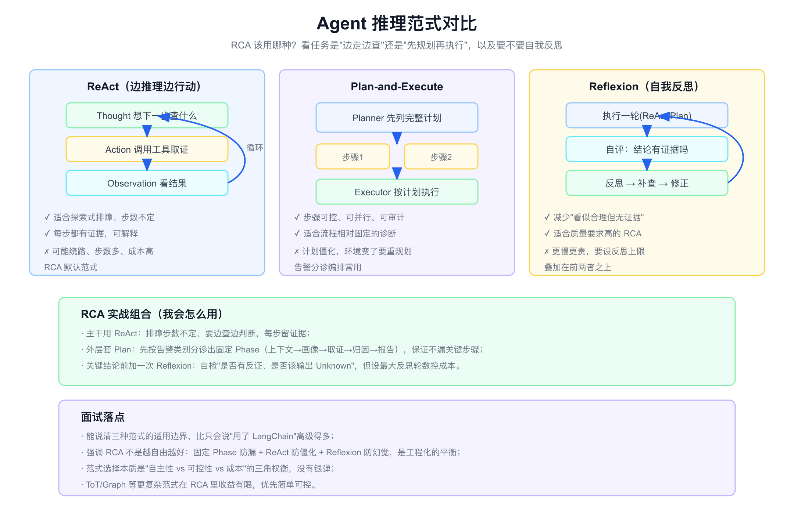
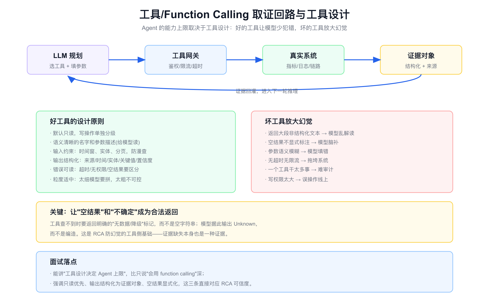
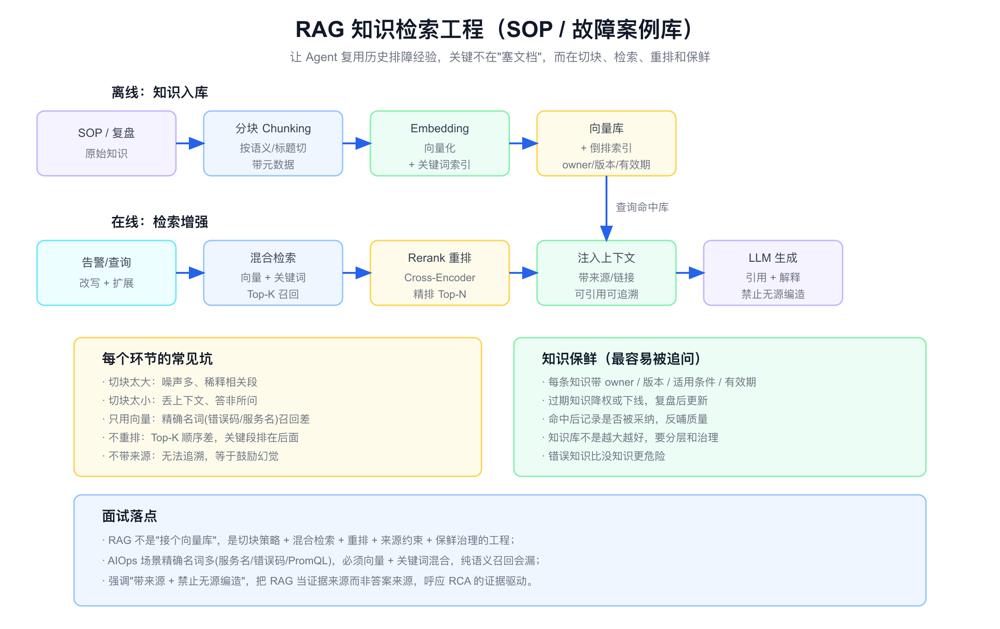
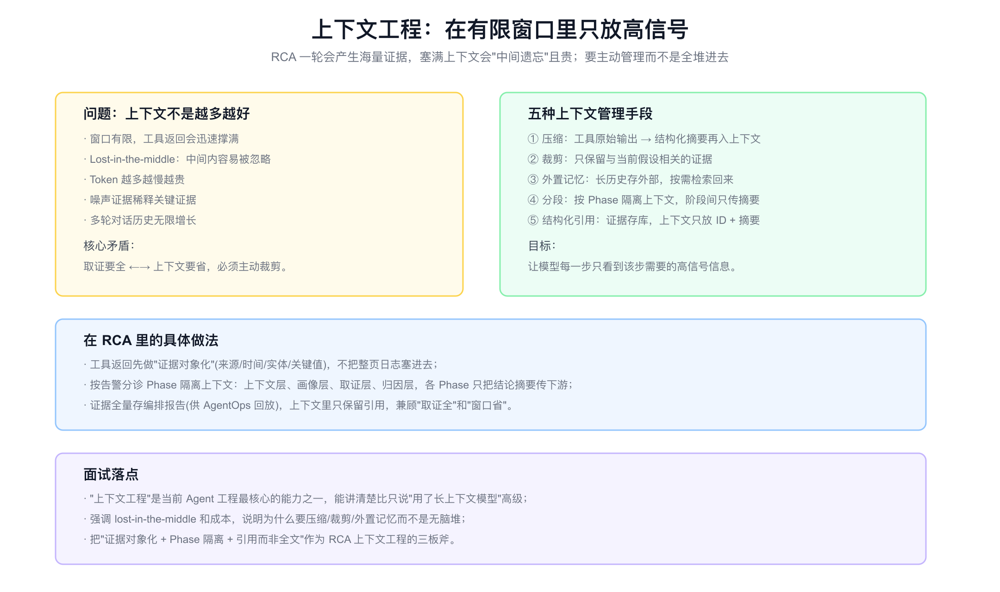

# 面试定位卡

- **技术点**：AIOps Agent 工程深度 / 推理范式 / 工具与 Function Calling / RAG 检索工程 / 上下文工程
- **所属领域**：LLM Agent 工程、RCA Agent、检索增强、提示与上下文工程
- **经验等级**：`theory_with_adjacent_experience`（理解 Agent 工程方法论，结合可观测/排障相邻经验，不是亲手上线生产 Agent 平台）
- **面试价值**：把 [aiops.md](./aiops.md) 里"编排、工具、知识、AgentOps"这些概念，落到具体的工程实现选择上。回答"你这个 RCA Agent 内部到底怎么实现的"，证明不是只会说概念。
- **常见考法**：ReAct 和 Plan-and-Execute 区别；RCA 该用哪种范式；怎么避免 Agent 绕路/幻觉；RAG 怎么做、为什么不能只用向量；工具怎么设计；上下文爆了怎么办；多轮调用怎么控成本。
- **适合挂钩项目**：RCA Agent、知识库/SOP 检索、告警分析编排、Agent 可观测。
- **不适合夸大的地方**：不能说我设计并上线了生产级 Agent 框架；不能编造 Token 成本、命中率、延迟数据；不能把读论文/读样本说成亲历实现。

# 经验边界

我没有亲手设计并上线生产级 RCA Agent 框架。我的相邻经验是可观测、告警治理、K8s 排障，理解排障流程；对 Agent 工程，我做的是方法论对标和实现取舍分析。

可以安全表达的是：我能讲清楚每种推理范式、工具设计、RAG 工程、上下文管理解决什么问题、有什么代价、在 RCA 场景该怎么选。

不能表达的是：我实现了某套 Agent 编排框架、跑通了多轮 RCA、Token 成本压到多少、知识命中率多少。这些需要真实生产归属和数据。

# 三十秒回答

RCA Agent 的工程实现可以拆成四块。一是推理范式：ReAct 边推理边取证适合步数不定的排障，Plan-and-Execute 适合流程固定的分诊，Reflexion 自我反思适合质量要求高的场景，实战往往是 Plan 套 ReAct 再加一次 Reflexion。二是工具与 Function Calling：工具设计决定 Agent 上限，要默认只读、输出结构化证据对象、让空结果成为合法返回。三是 RAG 检索工程：把 SOP 和故障案例做成可检索知识，关键是切块、混合检索、重排和保鲜，而不是接个向量库。四是上下文工程：一轮 RCA 会产生海量证据，要靠压缩、裁剪、外置记忆、Phase 隔离,在有限窗口里只放高信号。

贯穿四块的主线是:用工程手段约束模型,让它证据驱动、可控、不幻觉,而不是放任它自由发挥。



# 为什么需要它

- **没有它之前的问题**：把告警丢给大模型直接问"为什么",会绕路、幻觉、成本失控、无法审计。
- **它的解决方式**：用推理范式控制流程、用工具约束取证、用 RAG 引入知识、用上下文工程控成本和信号质量。
- **它引入的新问题**：范式、工具、检索、上下文每一层都有取舍,过度工程化也会变脆。
- **必须关注的场景**：步数不定的探索式排障、流程固定的告警分诊、知识复用、长证据链的上下文管理。

# 它解决什么问题

- **模型绕路、步数失控**
  - **对应能力**：推理范式选择,固定 Phase 防漏 + ReAct 防僵化。
  - **面试表达**：RCA 不是越自由越好,要在自主性和可控性之间平衡。

- **模型幻觉、无证据乱说**
  - **对应能力**：工具结构化输出 + 空结果显式化,逼出 Unknown。
  - **面试表达**：证据缺失本身也是证据,工具要让"查不到"成为合法返回。

- **历史经验复用不了**
  - **对应能力**：RAG 检索工程,把 SOP 和案例做成可检索知识。
  - **面试表达**：RAG 是证据来源不是答案来源,必须带来源、禁止无源编造。

- **上下文爆炸、又慢又贵又遗忘**
  - **对应能力**：上下文工程,压缩、裁剪、外置记忆、Phase 隔离。
  - **面试表达**：上下文不是越多越好,中间会遗忘,要主动管理。

- **工具乱用、放大错误**
  - **对应能力**：工具设计原则,只读优先、语义清晰、输入约束、输出结构化。
  - **面试表达**：工具设计决定 Agent 上限,坏工具放大幻觉。

# 核心概念表

- **ReAct**
  - **一句话定义**：Thought-Action-Observation 循环,边推理边调用工具取证。
  - **解决的问题**：探索式、步数不定的排障。
  - **追问点**：怎么防绕路;什么时候终止;每步证据怎么留。

- **Plan-and-Execute**
  - **一句话定义**：先生成完整计划再分步执行。
  - **解决的问题**：流程相对固定、需可控可并行的诊断。
  - **追问点**：环境变了计划僵化怎么办;怎么重规划。

- **Reflexion**
  - **一句话定义**：执行后自我评估、反思、补查、修正。
  - **解决的问题**：减少"看似合理但无证据"的结论。
  - **追问点**：怎么设反思上限控成本;自评标准怎么定。

- **Function Calling / Tool Use**
  - **一句话定义**：模型按工具 schema 选工具、填参数,获取真实数据。
  - **解决的问题**：让模型接入线上系统取证。
  - **追问点**：工具粒度怎么定;参数怎么约束;空结果怎么处理。

- **RAG**
  - **一句话定义**：检索增强生成,先检索相关知识再让模型生成。
  - **解决的问题**：让模型用上私有 SOP 和历史案例,减少幻觉。
  - **追问点**：切块策略;为什么要混合检索;重排和保鲜怎么做。

- **混合检索 / Rerank**
  - **一句话定义**：向量检索召回 + 关键词检索补精确名词 + Cross-Encoder 重排。
  - **解决的问题**：纯向量召回对错误码/服务名等精确名词差。
  - **追问点**：召回和精排分工;rerank 成本怎么控。

- **上下文工程**
  - **一句话定义**：在有限窗口里主动管理放什么,压缩、裁剪、外置、引用。
  - **解决的问题**：上下文爆炸、中间遗忘、成本高。
  - **追问点**：怎么压缩工具输出;Phase 之间怎么传;记忆怎么外置。

- **证据对象**
  - **一句话定义**：工具输出统一成带来源/时间/实体/关键值/置信度的结构。
  - **解决的问题**：让证据可追溯、可引用、可压缩。
  - **追问点**：和原始数据怎么映射;置信度怎么给。

# 原理模型

RCA Agent 的实现是四层工程选择叠加,每层都在回答"怎么让模型证据驱动而不幻觉、可控而不绕路、省钱而不遗忘"。

- **推理范式层**：决定流程怎么走（Plan 套 ReAct 加 Reflexion）。
- **工具层**：决定能取到什么证据、证据质量如何（只读、结构化、空结果显式）。
- **知识层**：决定能复用什么经验（RAG 检索工程 + 保鲜）。
- **上下文层**：决定每步看到什么、成本多少（压缩、裁剪、Phase 隔离）。

# 关键机制

## 推理范式选择

- **问题**：RCA 任务形态多样,探索式排障步数不定,告警分诊流程相对固定,质量要求高时还要防"看似合理"。
- **工作方式**：
  - ReAct：Thought-Action-Observation 循环,适合探索式,每步留证据,但可能绕路。
  - Plan-and-Execute：先规划再执行,可控可并行可审计,但计划僵化、环境变了要重规划。
  - Reflexion：执行后自评反思补查,减少无证据结论,但更慢更贵。
- **权衡**：本质是"自主性 vs 可控性 vs 成本"的三角,没有银弹。
- **追问回答**：我会主干用 ReAct（排障步数不定）,外层套 Plan 按告警类别分诊出固定 Phase（上下文→画像→取证→归因→报告）防漏,关键结论前加一次 Reflexion 防幻觉但设反思上限。ToT/Graph 等复杂范式在 RCA 收益有限,优先简单可控。

## 工具与 Function Calling 设计

- **问题**：Agent 的能力上限取决于工具,坏工具会放大幻觉。
- **工作方式**：工具默认只读;名字和参数语义清晰（给模型读）;输入约束时间窗、实体、分页防漫查;输出结构化为证据对象（来源/时间/实体/关键值/置信度）;错误可读（超时/无权限/空结果区分）;粒度适中。
- **权衡**：工具太细模型要拼装易错,太粗不可控难审计;写权限越大越危险。
- **追问回答**：我最强调的一条是让"空结果"和"不确定"成为合法返回——工具查不到要返回明确的无数据/降级标记,模型据此输出 Unknown 而不是脑补。证据缺失本身也是证据,这是 RCA 防幻觉的工具侧基础。



## RAG 检索工程

- **问题**：SOP 和故障案例散落,要让 Agent 复用,但"塞文档"没用。
- **工作方式**：
  - 离线：按语义/标题切块（带元数据）→ Embedding 向量化 + 关键词索引 → 入向量库（带 owner/版本/有效期）。
  - 在线：查询改写扩展 → 混合检索（向量 + 关键词）Top-K 召回 → Cross-Encoder 重排精排 Top-N → 注入上下文（带来源链接）→ LLM 引用生成（禁止无源编造）。
- **权衡**：切块太大噪声多,太小丢上下文;只用向量对精确名词召回差;不重排顺序差;不带来源等于鼓励幻觉。
- **追问回答**：AIOps 场景精确名词多（服务名、错误码、PromQL）,必须向量加关键词混合,纯语义会漏。我会把 RAG 当证据来源而非答案来源,带来源、禁止无源编造,呼应 RCA 证据驱动。知识保鲜最容易被追问：每条带 owner/版本/适用条件/有效期,过期降权下线,错误知识比没知识更危险。



## 上下文工程

- **问题**：一轮 RCA 产生海量证据,塞满上下文会 lost-in-the-middle（中间遗忘）且贵。
- **工作方式**：五种手段——压缩（工具原始输出转结构化摘要）、裁剪（只留与当前假设相关的证据）、外置记忆（长历史存外部按需检索）、分段（按 Phase 隔离,阶段间只传摘要）、结构化引用（证据存库,上下文只放 ID + 摘要）。
- **权衡**：取证要全和上下文要省是核心矛盾,必须主动裁剪。
- **追问回答**：RCA 里我会先把工具返回证据对象化,不塞整页日志;按告警分诊 Phase 隔离上下文,各 Phase 只把结论摘要传下游;证据全量存编排报告供 AgentOps 回放,上下文只保留引用。三板斧是证据对象化 + Phase 隔离 + 引用而非全文。



## 多 Agent 与 MCP（衔接）

- **问题**：单体 Agent 上下文过载、串行慢。
- **工作方式**：编排者 + 专项子 Agent 并行取证,工具用 MCP 标准化。详见 [aiops-frontier.md](./aiops-frontier.md)。
- **权衡**：多 Agent 有协调和成本代价,先单体跑通再拆。
- **追问回答**：拆 Agent 的信号是上下文过载和可并行收益,不是越多越好。

# 横向对比

- **ReAct vs Plan-and-Execute**
  - ReAct 灵活、适合步数不定、每步留证据但易绕路;Plan 可控可并行可审计但计划僵化。RCA 常组合用。

- **Reflexion vs 不反思**
  - Reflexion 减少无证据结论但更慢更贵,要设反思上限;简单任务不必反思。

- **纯向量检索 vs 混合检索**
  - 纯向量对精确名词（服务名/错误码）召回差;混合检索补关键词,AIOps 必须混合。

- **RAG vs 长上下文直接塞**
  - 长上下文塞文档贵且中间遗忘;RAG 精准召回相关段,带来源可追溯。

- **工具粗粒度 vs 细粒度**
  - 粗粒度不可控难审计;细粒度模型要拼装易错;要适中且语义清晰。

- **全量上下文 vs 上下文工程**
  - 全量堆进去慢、贵、遗忘;上下文工程压缩裁剪只放高信号。

# 业界做法对标

- **ReAct / Reflexion / Plan-and-Execute**
  - 这几种是 Agent 推理的经典范式,主流框架（LangGraph 等）都支持,RCA 实战常组合。

- **RAG 检索工程**
  - 切块、混合检索、Rerank（Cross-Encoder）、查询改写是 RAG 工程共识;知识保鲜和来源约束是生产关键。

- **MCP 工具生态**
  - 把工具标准化为协议,解决 N×M 适配,详见 [aiops-frontier.md](./aiops-frontier.md)。

- **上下文工程 / 记忆**
  - lost-in-the-middle 是公认问题,业界用压缩、外置记忆、分段管理上下文;Agent 记忆中间件是近年热点。

- **AIOps 告警分析 skill**
  - 本仓库 [aiops.md](./aiops.md) 提到的告警分析 skill,用 Phase 化编排 + 证据对象 + 编排报告,是上述工程原则的具体落地样本。

# 典型业务场景

- **探索式 K8s 排障**：步数不定,用 ReAct 边查边判断。
- **告警分诊编排**：流程固定,用 Plan 按类别分 Phase。
- **高风险根因结论**：用 Reflexion 自检反证再输出。
- **SOP / 案例复用**：RAG 混合检索 + 重排 + 来源约束。
- **长证据链 RCA**：上下文工程压缩裁剪 + Phase 隔离。
- **专项并行取证**：多 Agent + MCP（见前沿文档）。

# 如果让我落地,我会怎么设计

- **第一步：定范式骨架**
  - Plan 套 ReAct,按告警类别分诊出固定 Phase,关键结论前一次 Reflexion,设反思上限。

- **第二步：建工具网关**
  - 工具默认只读,统一鉴权/限流/超时/脱敏/审计,输出统一成证据对象,空结果显式标注。

- **第三步：建 RAG 知识层**
  - SOP/案例按语义切块带元数据,混合检索 + Cross-Encoder 重排,带来源,知识带 owner/版本/有效期。

- **第四步：上下文工程**
  - 工具输出证据对象化,Phase 间只传摘要,证据全量存编排报告,上下文放引用。

- **第五步：接 AgentOps**
  - 记录 trajectory、tool call、retrieval、LLM span,供回放评估（见 [aiops-evaluation.md](./aiops-evaluation.md)）。

- **第六步：按需多 Agent**
  - 出现上下文过载和并行收益再拆,工具用 MCP。

# 排障路径

如果 Agent 表现不好,我会按下面顺序排查。

- **症状：Agent 绕路、步数爆炸**
  - **假设**：纯 ReAct 无约束,没有 Phase 骨架。
  - **验证**：看 trajectory 是否反复查同类工具、是否缺终止条件。
  - **指标**：平均步数、重复工具调用率、终止合理率。
  - **结论**：加 Plan 骨架和步数/预算上限。

- **症状：结论无证据、幻觉**
  - **假设**：工具空结果没显式化,缺反证环节。
  - **验证**：回放 tool call,看空结果是否被脑补,有无 Reflexion。
  - **指标**：无源结论率、Unknown 合理率。
  - **结论**：工具空结果显式化 + 加 Reflexion 自检反证。

- **症状：知识检索召回差**
  - **假设**：只用向量,切块不当,无重排。
  - **验证**：看精确名词（错误码/服务名）能否召回,切块大小。
  - **指标**：召回率、命中率、重排前后差异。
  - **结论**：上混合检索 + Cross-Encoder 重排,调切块策略。

- **症状：又慢又贵**
  - **假设**：上下文全量堆,工具输出未压缩,多轮历史无限增长。
  - **验证**：看单轮 Token 量、上下文占用、工具输出大小。
  - **指标**：Token 成本、延迟、上下文利用率。
  - **结论**：证据对象化压缩 + Phase 隔离 + 外置记忆。

- **症状：知识过期误导**
  - **假设**：知识库无保鲜,旧 SOP 被当有效。
  - **验证**：检查知识 owner/版本/有效期,复盘是否回灌。
  - **指标**：过期知识命中率、知识更新频率。
  - **结论**：知识分层 + 过期降权下线 + 复盘更新。

# 未来规划和 Roadmap

- **阶段一：范式骨架**：Plan 套 ReAct + Reflexion,Phase 化分诊。
- **阶段二：工具网关**：只读、证据对象化、空结果显式。
- **阶段三：RAG 知识层**：混合检索 + 重排 + 保鲜。
- **阶段四:上下文工程**：压缩、裁剪、Phase 隔离、外置记忆。
- **阶段五：AgentOps 接入**：trajectory 和 span 可观测。
- **阶段六：多 Agent + MCP**：按需拆分,工具标准化。

# 风险、边界和误区

- **误区：用了 LangChain 就懂 Agent 工程**
  - 正确理解：框架只是脚手架,关键是范式选择、工具设计、检索和上下文工程的取舍。

- **误区：Agent 越自由越聪明**
  - 正确理解：RCA 要可控,固定 Phase 防漏 + ReAct 防僵化 + Reflexion 防幻觉。

- **误区：RAG 接个向量库就行**
  - 正确理解：要切块策略、混合检索、重排、来源约束、保鲜治理。

- **误区：上下文越长越好**
  - 正确理解：lost-in-the-middle 且贵,要主动压缩裁剪只放高信号。

- **误区：工具就是 API 包一层**
  - 正确理解：工具设计决定 Agent 上限,只读、结构化、空结果显式是关键。

- **误区：Reflexion 越多越准**
  - 正确理解：反思有成本,要设上限,简单任务不必反思。

# 和项目的安全连接

- **能怎么说**
  - 我理解 RCA Agent 的工程实现：推理范式、工具设计、RAG 检索、上下文工程的取舍。
  - 我能把这些和可观测、告警治理、排障的相邻经验连接,讲清楚如果实现会怎么选。
  - 我能解释为什么 RCA 要用工程手段约束模型,而不是放任自由发挥。

- **不能怎么说**

| 风险说法 | 问题 | 安全替代表达 |
|---|---|---|
| 我设计并上线了 Agent 框架 | 没有生产归属 | 我理解 Agent 工程取舍,能讲如果落地怎么设计 |
| 我们 Token 成本压到 X | 编造数据 | 控成本要靠上下文工程,具体值需实测 |
| 知识命中率 95% | 没有评测支撑 | 检索质量要用召回/命中评估,需 benchmark |
| 用多 Agent 性能翻倍 | 编造效果 | 多 Agent 按过载和并行收益判断,先单体跑通 |
| ReAct 就是最好的范式 | 绝对化 | 范式是自主性/可控性/成本三角,按场景选 |

# 面试追问树

```text
RCA Agent 内部怎么实现？
├─ 推理范式
│  ├─ ReAct（探索式、步数不定）
│  ├─ Plan-and-Execute（流程固定、可控）
│  ├─ Reflexion（自检反证、防幻觉）
│  └─ 实战：Plan 套 ReAct 加 Reflexion
├─ 工具 / Function Calling
│  ├─ 默认只读 + 结构化证据对象
│  ├─ 空结果显式化 → 逼出 Unknown
│  └─ 输入约束防漫查
├─ RAG 检索
│  ├─ 切块 + 混合检索 + 重排
│  ├─ 带来源、禁止无源编造
│  └─ 知识保鲜（owner/版本/有效期）
├─ 上下文工程
│  ├─ 压缩 / 裁剪 / 外置记忆
│  ├─ Phase 隔离 + 引用而非全文
│  └─ 防 lost-in-the-middle 和成本
└─ 多 Agent + MCP
   ├─ 按过载和并行收益拆
   └─ 工具标准化
```

# 高频 Q&A

## ReAct 和 Plan-and-Execute 有什么区别？RCA 用哪个？

ReAct 边推理边取证,适合步数不定的探索式排障,每步留证据但易绕路;Plan 先规划再执行,可控可并行可审计,适合流程固定的分诊但计划僵化。RCA 实战是 Plan 套 ReAct：外层 Plan 分 Phase 防漏,内层 ReAct 防僵化。

## 怎么避免 Agent 幻觉、无证据乱说？

工具空结果显式化（返回无数据标记而非空串）、加 Reflexion 自检反证、允许并鼓励输出 Unknown、报告要求带来源链接。核心是让证据缺失成为合法返回,而不是让模型脑补。

## RAG 怎么做？为什么不能只用向量？

离线切块 + Embedding + 关键词索引入库;在线查询改写 + 混合检索召回 + Cross-Encoder 重排 + 带来源生成。不能只用向量是因为 AIOps 精确名词多（服务名、错误码、PromQL),纯语义召回会漏,必须向量加关键词混合。

## 工具怎么设计才好？

默认只读;名字参数语义清晰给模型读;输入约束时间窗实体分页防漫查;输出结构化为证据对象（来源/时间/实体/关键值/置信度);错误可读;粒度适中。最关键是空结果显式化。工具设计决定 Agent 上限。

## 上下文爆了怎么办？

不要全量堆。用压缩（工具输出转结构化摘要）、裁剪（只留相关证据）、外置记忆（长历史存外部）、Phase 隔离（阶段间只传摘要）、结构化引用（存库放 ID）。避免 lost-in-the-middle 和成本失控。

## 知识库过期怎么办？

每条知识带 owner、版本、适用条件、有效期,过期降权或下线,复盘后更新,命中后记录是否采纳反哺质量。错误知识比没知识更危险,知识库不是越大越好。

## 多轮 Agent 怎么控成本？

按场景分级：告警真假判断走轻量路径,复杂 RCA 才多轮;上下文工程压缩裁剪;缓存静态拓扑和知识;工具设超时;设步数和 Token 预算上限;Reflexion 设反思上限。

## Reflexion 是什么?什么时候用?

执行一轮后自我评估、反思、补查、修正,减少"看似合理但无证据"的结论。适合质量要求高的 RCA,但更慢更贵,要设反思轮数上限,简单任务不必反思。

## 为什么说 Agent 工程是"约束模型"?

因为放任模型自由发挥会绕路、幻觉、成本失控。推理范式约束流程、工具约束取证、RAG 约束知识来源、上下文工程约束信号和成本——都是用工程手段让模型证据驱动、可控、不幻觉。

# 三档背诵版

## 15 秒版

RCA Agent 工程四块：推理范式（Plan 套 ReAct 加 Reflexion）、工具设计（只读 + 证据对象 + 空结果显式）、RAG（混合检索 + 重排 + 保鲜）、上下文工程（压缩裁剪 Phase 隔离）。主线是用工程约束模型,证据驱动不幻觉。

## 45 秒版

这块我讲 RCA Agent 内部怎么实现,是方法论对标加相邻经验。推理范式上,ReAct 适合探索式排障,Plan 适合固定分诊,Reflexion 防幻觉,实战是 Plan 套 ReAct 加一次 Reflexion。工具上,设计决定 Agent 上限,默认只读、输出结构化证据对象、让空结果成为合法返回逼出 Unknown。知识上,RAG 不是接向量库,要切块、混合检索、Cross-Encoder 重排、带来源、做保鲜,AIOps 精确名词多必须向量加关键词混合。上下文上,一轮 RCA 证据海量,要压缩裁剪外置记忆 Phase 隔离,防中间遗忘和成本失控。贯穿主线是用工程手段约束模型证据驱动。

## 2 分钟版

我会从四层工程选择讲 RCA Agent 怎么实现。第一层推理范式,回答流程怎么走：ReAct 是 Thought-Action-Observation 循环,边推理边取证,适合步数不定的探索式排障,每步留证据但可能绕路;Plan-and-Execute 先规划再执行,可控可并行可审计,适合流程固定的告警分诊但计划僵化;Reflexion 执行后自评反思补查,减少无证据结论但更慢更贵。本质是自主性、可控性、成本的三角,实战我会 Plan 套 ReAct 再加一次 Reflexion 并设上限。

第二层工具,回答取什么证据：工具设计决定 Agent 上限,默认只读、语义清晰、输入约束防漫查、输出结构化为证据对象、错误可读。我最强调让空结果和不确定成为合法返回,证据缺失本身也是证据,这是防幻觉的工具侧基础。

第三层知识,回答怎么复用经验：RAG 要切块、混合检索（向量加关键词,因为 AIOps 精确名词多）、Cross-Encoder 重排、带来源、禁止无源编造,还要做知识保鲜,带 owner 版本有效期,错误知识比没知识危险。

第四层上下文,回答每步看什么、花多少钱：一轮 RCA 证据海量,塞满会 lost-in-the-middle 且贵,要压缩、裁剪、外置记忆、Phase 隔离、引用而非全文。

我会强调这四层贯穿一条主线：用工程手段约束模型,让它证据驱动、可控、不幻觉,而不是放任自由发挥。这也是把 [aiops.md](./aiops.md) 的概念落到实现的关键。我会声明这是方法论对标,不是我亲手上线的生产框架。

# 参考资料

- 推理范式：ReAct、Reflexion、Plan-and-Execute 论文及主流 Agent 框架（LangGraph 等）
- RAG：切块策略、混合检索、Cross-Encoder Rerank、查询改写
- 上下文工程：lost-in-the-middle 现象、上下文压缩与外置记忆
- MCP：Model Context Protocol
- 配套：[aiops.md](./aiops.md)（RCA 主线）、[aiops-frontier.md](./aiops-frontier.md)（多 Agent/MCP）、[aiops-evaluation.md](./aiops-evaluation.md)（评估）

# 面试前检查清单

- 能否说清三种推理范式的适用边界和 RCA 的组合用法。
- 能否讲工具设计原则,尤其空结果显式化和证据对象。
- 能否讲 RAG 全流程,以及为什么 AIOps 必须混合检索。
- 能否讲上下文工程三板斧和 lost-in-the-middle。
- 能否讲知识保鲜和"错误知识比没知识危险"。
- 能否说清"Agent 工程是用工程约束模型"这条主线。
- 能否声明这是方法论对标,不是亲手上线生产框架。
