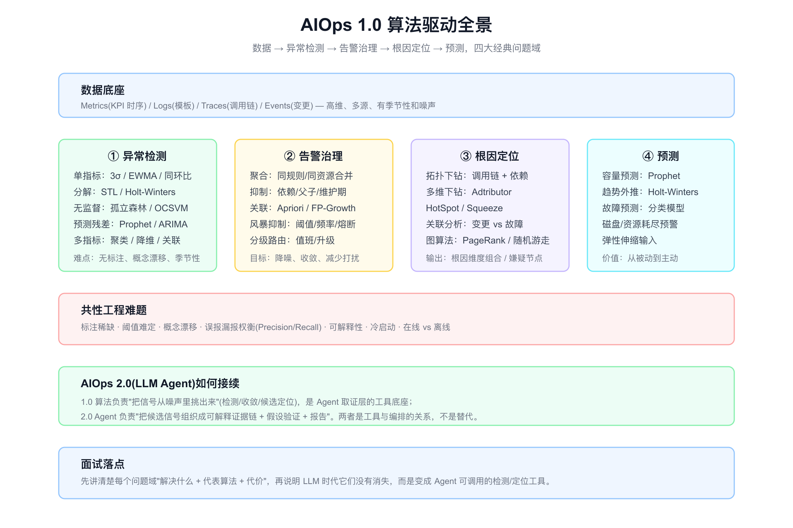
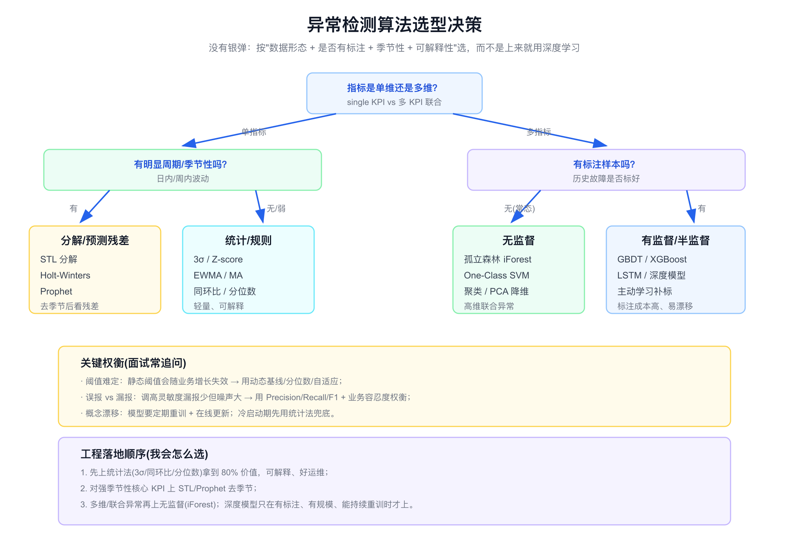
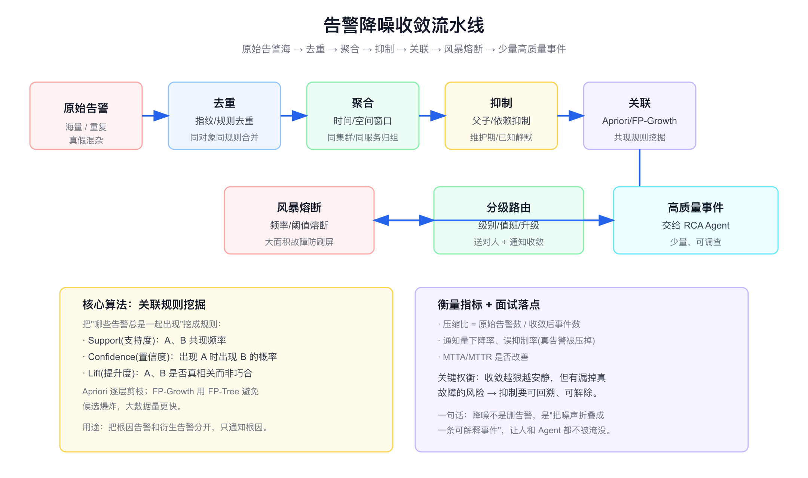
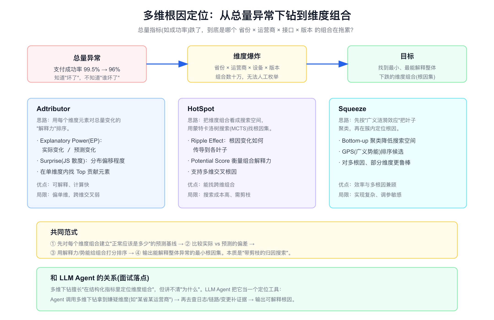

# 面试定位卡

- **技术点**：AIOps 1.0 算法基础 / 异常检测 / 告警降噪收敛 / 多维根因定位 / 时序预测
- **所属领域**：智能运维、时序分析、统计与机器学习、告警治理
- **经验等级**：`theory_with_adjacent_experience`（有可观测、告警治理、指标排障的相邻生产经验，没有亲手实现这些算法的生产经验）
- **面试价值**：补齐 [aiops.md](./aiops.md) 偏 LLM Agent（AIOps 2.0）的盲区。能讲清楚"大模型来之前，智能运维靠什么算法"，证明你不是只会调 Agent，而是理解信号是怎么从噪声里被挑出来的。
- **常见考法**：你了解哪些异常检测算法；静态阈值有什么问题；告警怎么降噪收敛；关联规则怎么挖；微服务里成功率跌了怎么定位是哪个维度；Prophet/STL 解决什么；这些算法在 LLM 时代还有用吗。
- **适合挂钩项目**：APM/可观测平台、告警治理、监控规则体系、容量规划、SRE 排障。
- **不适合夸大的地方**：不能说我实现并上线了某套异常检测/根因定位算法；不能编造检出率、压缩比、节省人力数据；不能把读论文说成生产落地。

# 经验边界

我没有在生产里亲手实现和调优这些算法（iForest、Adtributor、Squeeze、FP-Growth 等）。我的真实相邻经验是：用过基于阈值/同环比的监控告警，治理过告警噪声，做过指标驱动的排障，理解告警从产生到收敛到定位的真实流程。

可以安全表达的是：我理解每类算法**解决什么问题、代表方法、代价在哪、什么时候不该用**，也理解它们在 AIOps 2.0（LLM Agent）体系里是作为"检测和定位工具"被编排，而不是被替代。

不能表达的是：我设计并上线了某套 AIOps 算法平台、检出率达到多少、告警压缩比多少、根因定位准确率多少。这些都需要真实生产归属和评测数据。

# 三十秒回答

AIOps 1.0 是算法驱动的智能运维，核心是四个问题域：异常检测（从海量指标里发现"不对劲"）、告警治理（把噪声收敛成少量可调查事件）、根因定位（在高维数据里找到嫌疑维度或节点）、预测（容量和故障预测，从被动变主动）。

它的方法谱系从轻量统计（3σ、同环比、EWMA）到时序分解（STL、Holt-Winters、Prophet）、无监督（孤立森林）、关联规则（Apriori、FP-Growth）、多维下钻（Adtributor、HotSpot、Squeeze）。选型不是看谁高级，而是看数据形态、有没有标注、有没有季节性、要不要可解释。

到了 LLM 时代这些算法没有消失，而是变成 RCA Agent 的取证和定位工具：算法负责把候选信号挑出来，Agent 负责把候选组织成可解释证据链。



# 为什么需要它

- **没有它之前的问题**：纯靠人盯监控大盘，靠固定阈值报警；指标一多就看不过来，阈值一旦设死就要么漏报要么刷屏。
- **它的解决方式**：用统计和机器学习自动发现异常、自动收敛告警、自动缩小根因范围、提前预测容量。
- **它引入的新问题**：算法本身需要标注、调参、防漂移；可解释性差的模型运维不敢信；误报漏报永远要权衡。
- **必须关注的场景**：核心 KPI 异常检测、告警风暴治理、微服务多维根因定位、磁盘/资源容量预测、变更与故障关联。

# 它解决什么问题

- **指标太多，人盯不过来**
  - **对应能力**：自动异常检测，把"看大盘"变成"被异常找上门"。
  - **面试表达**：异常检测的第一价值不是多准，而是把人从盯盘里解放出来。

- **静态阈值随业务增长失效**
  - **对应能力**：动态基线、分位数、季节性分解，让"正常范围"随时间自适应。
  - **面试表达**：阈值不是设一个数，而是建一个"此刻应该是多少"的预测。

- **告警刷屏，真故障被淹没**
  - **对应能力**：去重、聚合、抑制、关联、风暴熔断，把告警海折叠成少量事件。
  - **面试表达**：降噪不是删告警，是把噪声折叠成一条可解释事件。

- **总量异常但不知道是谁**
  - **对应能力**：多维下钻，在 省份×运营商×版本 的组合里定位根因集。
  - **面试表达**：多维定位解决的是"在结构化指标里找谁坏了"，不解决"为什么"。

- **被动救火，没有预判**
  - **对应能力**：容量预测、故障预测，提前扩容或预警。
  - **面试表达**：预测的价值是把 MTTR 问题转成"根本不发生"。

# 核心概念表

- **动态基线 / Baseline**
  - **一句话定义**：根据历史和季节性算出的"此刻指标应该在什么范围"，替代固定阈值。
  - **解决的问题**：业务有日内/周内周期，固定阈值会误报。
  - **追问点**：基线怎么算；大促等突变怎么办；冷启动没历史怎么办。

- **季节性分解 / STL**
  - **一句话定义**：把时序拆成趋势、季节、残差三部分，对残差做异常判断。
  - **解决的问题**：避免把"每天中午的正常高峰"当异常。
  - **追问点**：多重周期怎么处理；节假日效应怎么建模。

- **孤立森林 / Isolation Forest**
  - **一句话定义**：无监督异常检测，异常点更容易被随机切分孤立，路径越短越异常。
  - **解决的问题**：无标注、高维联合异常。
  - **追问点**：和 One-Class SVM 区别；对时序的局限；参数 contamination 怎么定。

- **关联规则 / Apriori、FP-Growth**
  - **一句话定义**：从历史告警里挖"哪些告警总一起出现"，区分根因告警和衍生告警。
  - **解决的问题**：告警之间的因果/共现关系不清楚。
  - **追问点**：Support/Confidence/Lift 区别；FP-Growth 为什么比 Apriori 快。

- **多维下钻 / Adtributor、HotSpot、Squeeze**
  - **一句话定义**：在多维指标里搜索能解释总量异常的最小维度组合。
  - **解决的问题**：维度组合爆炸，无法人工枚举。
  - **追问点**：解释力怎么定义；多根因怎么办；搜索空间怎么剪枝。

- **Prophet / Holt-Winters**
  - **一句话定义**：带季节性和趋势的时序预测，用于容量预测和预测残差异常检测。
  - **解决的问题**：需要预测未来值或建立预测基线。
  - **追问点**：Prophet 的可加/可乘季节；和 ARIMA 区别；预测区间怎么用。

- **日志模板提取 / Drain**
  - **一句话定义**：把海量非结构化日志聚成有限模板（如 `User * login failed`），便于统计异常。
  - **解决的问题**：日志是自由文本，没法直接做异常检测。
  - **追问点**：Drain 的解析树原理；模板数量爆炸怎么办；新模板怎么处理。

# 原理模型

AIOps 1.0 可以按"问题域 → 数据形态 → 方法谱系"来组织。所有算法本质上都在回答同一类问题：**当前观测和"应该的样子"差多少，这个差异是不是异常，异常来自哪里。**

- **异常检测层**：建立"正常模型"（统计分布 / 季节基线 / 密度），再判断偏离。
- **告警治理层**：把检测产生的大量告警，按时间、空间、依赖、共现关系收敛。
- **根因定位层**：在拓扑或多维空间里搜索能解释异常的最小集合。
- **预测层**：对趋势和容量做外推，把被动响应变成主动预防。

四层之间是流水线：检测产生信号 → 治理收敛信号 → 定位缩小范围 → 预测提前介入。

# 关键机制

## 异常检测：从统计法到机器学习

- **问题**：怎么判断一个指标点是异常？固定阈值在有周期、有趋势的业务里必然误报或漏报。
- **工作方式**：
  - 统计法：3σ / Z-score（假设近似正态）、EWMA（指数加权，对近期更敏感）、同环比、分位数。轻量、可解释、好运维。
  - 分解/预测残差：STL 或 Prophet 先去掉趋势和季节，再对残差做统计判断。解决强周期场景。
  - 无监督：孤立森林、One-Class SVM、聚类、PCA 重构误差。解决多维联合异常、无标注。
  - 有监督：GBDT/XGBoost、LSTM。准但需要标注，且容易概念漂移。
- **权衡**：越往机器学习走，检出能力越强，但可解释性、标注成本、漂移风险越高。
- **追问回答**：我会先用统计法拿到大部分价值，对核心强周期 KPI 上 STL/Prophet，多维场景才上无监督；深度模型只在有标注、有规模、能持续重训时才考虑。



## 告警降噪与收敛

- **问题**：一次大故障可能产生成千上万条告警，真正的根因告警被淹没，on-call 被刷屏。
- **工作方式**：去重（指纹合并）→ 聚合（时间/空间窗口归组）→ 抑制（父子/依赖/维护期静默）→ 关联（Apriori/FP-Growth 挖共现规则，区分根因和衍生）→ 风暴熔断（频率超限熔断）→ 分级路由（送对人）。
- **权衡**：收敛越狠越安静，但有把真故障一起压掉的风险；抑制必须可回溯、可解除。
- **追问回答**：我会用压缩比、通知下降率、误抑制率、MTTA/MTTR 来衡量，强调"降噪是把噪声折叠成可解释事件，不是单纯删告警"。



## 多维根因定位

- **问题**：总量指标（如支付成功率）跌了，维度组合（省份×运营商×设备×版本）有几十万种，无法人工枚举。
- **工作方式**：
  - Adtributor：用每个维度元素的"解释力"（实际变化/预测变化）和 JS 散度排序，找单维 Top 贡献元素。可解释、快，但跨维交叉弱。
  - HotSpot：把维度组合当搜索空间，用蒙特卡洛树搜索 + Ripple Effect 找跨维根因集。能找组合，但搜索成本高。
  - Squeeze：先按广义涟漪效应聚类叶子，再在簇内定位，兼顾效率和多根因，但实现复杂。
- **权衡**：共同范式都是"建预测基线 → 比较实际与预测偏差 → 用解释力打分 → 输出最小根因集"，本质是带剪枝的归因搜索。
- **追问回答**：多维下钻擅长在结构化指标里定位维度，但讲不清原因；LLM Agent 把它当定位工具，拿到嫌疑维度后再去查日志/链路/变更补证据。



## 日志异常检测

- **问题**：日志是自由文本，量大、格式不一，没法直接统计。
- **工作方式**：先用 Drain（固定深度解析树）或 Spell 把日志聚成模板，再对模板频率、新模板出现、模板序列做异常检测（如 DeepLog 用 LSTM 学正常模板序列）。
- **权衡**：模板法可解释、好落地；序列深度模型更强但重，且对日志变更敏感。
- **追问回答**：我会把"日志结构化（模板提取）"作为日志异常检测的前置，没有结构化直接喂模型既贵又脆。

## 时序预测与容量规划

- **问题**：磁盘、连接数、QPS 在持续增长，需要提前知道什么时候会耗尽。
- **工作方式**：Holt-Winters（三指数平滑，处理趋势+季节）、Prophet（可加/可乘季节、节假日效应、对缺失和异常鲁棒）、ARIMA（平稳序列）。输出预测值和预测区间，喂给容量规划或弹性伸缩。
- **权衡**：Prophet 易用、对业务季节友好；ARIMA 理论严谨但需平稳化和调参；突变事件都需要人工标注或外生变量。
- **追问回答**：预测的工程价值是把"故障后救火"变成"提前扩容"，但要给预测配置信区间和兜底，不能让模型单点决策扩容。

# 横向对比

- **静态阈值 vs 动态基线**
  - 静态阈值简单但随业务增长失效、无法处理周期；动态基线自适应但需要历史和重算成本。

- **统计法 vs 机器学习异常检测**
  - 统计法轻量可解释、冷启动友好；机器学习检出强但要标注/调参/防漂移。生产里往往统计法兜底 + ML 增强。

- **孤立森林 vs One-Class SVM**
  - iForest 基于"异常易被孤立"，对高维和大数据更快、更省内存；OCSVM 基于边界，核函数选择敏感、大数据慢。

- **Apriori vs FP-Growth**
  - 都挖频繁项集；Apriori 逐层生成候选并多次扫库，候选易爆炸；FP-Growth 用 FP-Tree 压缩，扫两次库，大数据更快。

- **Adtributor vs HotSpot vs Squeeze**
  - Adtributor 偏单维、快、可解释；HotSpot 支持多维交叉但搜索贵；Squeeze 用聚类降搜索空间、兼顾多根因但实现复杂。

- **AIOps 1.0 vs AIOps 2.0**
  - 1.0 用专用算法解决单点问题（检测/收敛/定位），可解释但难编排成端到端排障；2.0 用 LLM Agent 编排这些算法 + 多源证据 + 自然语言解释，覆盖端到端但要治理幻觉和评估。两者是工具与编排的互补关系。

# 业界做法对标

- **清华 NetMan / 微软**
  - 多维根因定位的 Adtributor、HotSpot、Squeeze、HotSpot++ 等大多出自这条学术线，KPI 异常检测的 Donut（VAE）、Bagel 也是。面试可点名说明"这是有论文支撑的成熟方向"。

- **日志分析**
  - Drain（固定深度解析树）是工业界最常用的日志模板提取；DeepLog 用 LSTM 学日志模板序列做异常检测，是日志智能化的代表。

- **开源/商业告警治理**
  - 主流告警平台（如夜莺、各家 APM）都内置去重、聚合、抑制、依赖静默、风暴检测，关联挖掘多用 Apriori/FP-Growth 思路。这条对标可以连回 [aiops.md](./aiops.md) 的告警结构化主线。

- **时序预测**
  - Prophet（Facebook 开源）是业务侧最易落地的季节性预测，容量规划广泛使用；学术界更多用 ARIMA、Holt-Winters 做基线。

# 典型业务场景

- **核心 KPI 异常检测**：成功率、延迟、QPS、错误率，用季节基线 + 残差判断。
- **告警风暴治理**：大面积故障时收敛通知，只暴露根因告警。
- **微服务多维根因**：交易/支付成功率跌了，定位是哪个省/运营商/版本组合。
- **容量与资源预测**：磁盘耗尽预警、扩容前置、弹性伸缩输入。
- **变更关联**：把告警时间和发布/配置变更对齐，快速怀疑变更。
- **日志异常**：新错误模板突增、异常模板序列检测。

# 如果让我落地，我会怎么设计

- **第一步：先统计法兜底**
  - 对所有核心 KPI 上 3σ/同环比/分位数 + 动态基线，拿到 80% 价值且可解释，先把"会报、报得准"做扎实。

- **第二步：强周期指标上分解**
  - 对有明显日内/周内周期的核心指标上 STL/Prophet 去季节，对残差判断，显著降低周期性误报。

- **第三步：多维和无监督增强**
  - 对维度多的业务指标接 Adtributor/Squeeze 做定位，对多指标联合异常接孤立森林。

- **第四步：告警治理流水线**
  - 去重→聚合→抑制→关联→风暴熔断→分级路由，建立压缩比和误抑制率看板。

- **第五步：日志结构化**
  - 用 Drain 提模板，做新模板和频率异常检测，给 RCA 提供结构化日志证据。

- **第六步：接入 Agent 作为工具**
  - 把上述检测/定位/关联能力封装成只读工具，交给 RCA Agent 编排（衔接 [aiops.md](./aiops.md) 的工具取证层），算法出候选，Agent 出解释。

# 排障路径

如果异常检测/告警系统效果不好，我会按下面顺序排查。

- **症状：误报太多，on-call 疲劳**
  - **假设**：用了静态阈值、没去季节、阈值过敏感。
  - **验证**：看误报集中在什么时段（多半是周期高峰）、阈值是否随业务增长偏小。
  - **指标**：误报率、按时段的误报分布、阈值命中分布。
  - **结论**：先上动态基线和季节性分解，而不是继续手调阈值。

- **症状：漏报，真故障没报**
  - **假设**：阈值过松、检测窗口太大、指标粒度太粗。
  - **验证**：回放故障时段，看指标是否其实有信号但被平滑掉。
  - **指标**：漏报率、检测延迟、Recall。
  - **结论**：调灵敏度要配合降噪，否则 Recall 上去 Precision 崩。

- **症状：告警刷屏**
  - **假设**：缺去重/聚合/依赖抑制，没有风暴熔断。
  - **验证**：看一次故障产生多少条告警、是否同一根因衍生。
  - **指标**：压缩比、单事件告警数、通知量。
  - **结论**：建收敛流水线，关联挖掘区分根因和衍生。

- **症状：知道总量坏了但定位慢**
  - **假设**：没有多维下钻，靠人工逐维筛。
  - **验证**：看维度基数和组合数，人工是否可枚举。
  - **指标**：定位耗时、维度命中率。
  - **结论**：上 Adtributor/Squeeze，把维度搜索自动化。

- **症状：模型上线一段时间后变差**
  - **假设**：概念漂移，业务变了但模型没重训。
  - **验证**：对比新旧时段的数据分布和检出表现。
  - **指标**：检出率随时间衰减曲线、分布偏移度。
  - **结论**：建立定期重训和在线更新，统计法做漂移期兜底。

# 未来规划和 Roadmap

- **阶段一：可解释统计基线**：动态基线 + 季节性分解覆盖核心 KPI，先稳后强。
- **阶段二：无监督与多维增强**：孤立森林、Adtributor/Squeeze 覆盖多维和联合异常。
- **阶段三：告警治理闭环**：去重、聚合、抑制、关联、风暴熔断，建压缩比看板。
- **阶段四：日志与预测**：Drain 日志结构化 + Prophet 容量预测，扩展检测面。
- **阶段五：算法工具化**：把检测/定位/关联封装成 Agent 只读工具，衔接 RCA Agent。
- **阶段六：算法 + LLM 协同**：算法出候选信号，LLM 出可解释证据链和报告，形成 1.0 与 2.0 的融合。

# 风险、边界和误区

- **误区：上深度学习就更准**
  - 正确理解：没有标注、没有规模、不能持续重训时，深度模型不如统计法稳；先把可解释基线做好。

- **误区：阈值就是设个数**
  - 正确理解：阈值本质是"此刻应该是多少"的预测，要随趋势和季节自适应。

- **误区：降噪就是把告警删掉**
  - 正确理解：降噪是把噪声折叠成可解释事件，抑制要可回溯，避免压掉真故障。

- **误区：多维下钻能给根因**
  - 正确理解：它给的是"嫌疑维度组合"，不是因果解释，还需要日志/链路/变更补证据。

- **误区：异常检测越灵敏越好**
  - 正确理解：灵敏度和噪声是跷跷板，要按业务容忍度用 Precision/Recall/F1 权衡，并配套降噪。

- **误区：这些算法被 LLM 取代了**
  - 正确理解：LLM 不擅长在海量结构化指标里做高效检测和归因搜索，算法仍是 Agent 的工具底座。

# 和项目的安全连接

- **能怎么说**
  - 我有可观测、告警治理、指标排障的相邻经验，理解告警从产生到收敛到定位的真实流程。
  - 我能讲清楚每类 AIOps 算法解决什么问题、代价在哪、怎么选型，以及它们如何作为工具接入 RCA Agent。
  - 我能把异常检测、告警降噪、多维定位和我做过的监控/排障经验连接起来。

- **不能怎么说**

| 风险说法 | 问题 | 安全替代表达 |
|---|---|---|
| 我实现并上线了多维根因定位算法 | 没有生产归属 | 我理解 Adtributor/Squeeze 的原理和取舍，能讲如果落地怎么选 |
| 我们的检出率达到 95% | 没有评测集支撑 | 评估异常检测要看 Precision/Recall/F1 和业务容忍度 |
| 我用深度学习做异常检测 | 容易被追问标注和重训 | 我会先用统计法兜底，深度模型只在有标注有规模时上 |
| 告警压缩比 100:1 | 编造数据 | 压缩比要靠去重/聚合/抑制/关联综合得到，且要看误抑制率 |

# 面试追问树

```text
AIOps 1.0 有哪些核心算法？
├─ 异常检测
│  ├─ 统计：3σ / EWMA / 同环比 / 分位数
│  ├─ 分解：STL / Holt-Winters / Prophet 残差
│  ├─ 无监督：孤立森林 / OCSVM / 聚类
│  └─ 有监督：GBDT / LSTM（需标注，易漂移）
├─ 告警治理
│  ├─ 去重 / 聚合 / 抑制
│  ├─ 关联：Apriori / FP-Growth（Support/Confidence/Lift）
│  └─ 风暴熔断 / 分级路由
├─ 根因定位
│  ├─ 多维下钻：Adtributor / HotSpot / Squeeze
│  ├─ 拓扑下钻 + 图算法（PageRank/随机游走）
│  └─ 变更关联
├─ 预测
│  ├─ Holt-Winters / Prophet / ARIMA
│  └─ 容量预测 / 故障预测
└─ 和 LLM Agent 的关系
   ├─ 算法做检测和定位工具
   ├─ Agent 做编排和解释
   └─ 不是替代，是互补
```

# 高频 Q&A

## 你了解哪些异常检测算法？怎么选？

按数据形态选：单指标有季节性用 STL/Prophet 去季节看残差，无季节用 3σ/EWMA/分位数；多指标无标注用孤立森林；有标注且能持续重训才上 GBDT/LSTM。生产里通常统计法兜底 + ML 增强。

## 静态阈值有什么问题？

业务有日内/周内周期和长期增长，固定阈值要么在高峰误报，要么随增长漏报，还要人工维护一大堆。应该用动态基线/分位数/季节性分解，让"正常范围"自适应。

## 告警太多怎么治理？

建收敛流水线：去重→聚合→抑制→关联→风暴熔断→分级路由。关联用 Apriori/FP-Growth 挖共现规则区分根因和衍生，只通知根因。衡量看压缩比、通知下降率、误抑制率。

## Apriori 和 FP-Growth 区别？

都挖频繁项集。Apriori 逐层生成候选项集并多次扫描数据库，候选容易爆炸；FP-Growth 把数据压成 FP-Tree，只扫两次库，避免候选生成，大数据量更快。

## 微服务里成功率跌了，怎么定位是哪个维度？

用多维下钻：先对每个维度组合建预测基线，比较实际与预测的偏差，用解释力（如 Adtributor 的 EP、Squeeze 的势能）给组合打分，输出能解释整体异常的最小根因集。本质是带剪枝的归因搜索。

## STL 和 Prophet 解决什么？

都处理有趋势和季节性的时序。STL 把序列分解成趋势/季节/残差，对残差做异常判断；Prophet 在此基础上支持节假日效应、可加/可乘季节，还能预测未来值，常用于容量预测和预测基线。

## 孤立森林为什么适合异常检测？

异常点稀少且特征不同，随机切分时更容易被快速孤立，路径更短。它不需要标注、对高维和大数据高效、内存省，适合多指标联合异常。局限是对强时序结构不敏感，常配合特征工程。

## 日志怎么做异常检测？

先用 Drain/Spell 把自由文本日志聚成有限模板，再对模板频率、新模板出现、模板序列做异常检测（如 DeepLog）。关键是先结构化，否则直接喂模型又贵又脆。

## 这些算法在 LLM 时代还有用吗？

有。LLM 不擅长在海量结构化指标里做高效检测和归因搜索。算法负责把候选信号从噪声里挑出来，LLM Agent 负责把候选组织成可解释证据链和报告，是工具和编排的互补。

## 异常检测怎么评估？

用 Precision/Recall/F1，结合业务容忍度。还要看检测延迟、误报的时段分布、检出率随时间的衰减（防漂移）。不能只报一个准确率，要说清楚误报漏报的权衡点。

## 概念漂移怎么处理？

业务变化会让旧模型失效。要定期重训 + 在线更新，监控数据分布偏移和检出衰减；漂移期用统计法兜底。模型上线不是终点，要有持续运维。

# 三档背诵版

## 15 秒版

AIOps 1.0 是算法驱动的智能运维，四个问题域：异常检测、告警治理、根因定位、预测。选型看数据形态、有无标注、有无季节性、要不要可解释。LLM 时代算法没消失，变成 Agent 的检测和定位工具。

## 45 秒版

我没有亲手实现这些算法的生产经验，按技术点和相邻经验讲。AIOps 1.0 的核心是用统计和机器学习解决运维四件事：异常检测从统计法（3σ、同环比、EWMA）到分解（STL、Prophet）到无监督（孤立森林）；告警治理用去重、聚合、抑制和关联规则（Apriori、FP-Growth）收敛；根因定位用多维下钻（Adtributor、HotSpot、Squeeze）在维度组合里搜索；预测用 Prophet 做容量规划。难点是标注稀缺、阈值难定、概念漂移和误报漏报权衡。到了 LLM 时代，这些算法变成 RCA Agent 的工具底座，算法出候选，Agent 出解释。

## 2 分钟版

AIOps 1.0 我会从问题域讲起。第一是异常检测，回答"指标是不是不对劲"，方法从轻量可解释的统计法，到去季节的 STL/Prophet 残差，到无标注的孤立森林，再到需要标注的深度模型。选型不是看谁高级，而是看数据形态、有无标注、有无季节性、要不要可解释，生产里通常统计法兜底加 ML 增强。第二是告警治理，回答"怎么不被刷屏"，用去重、聚合、依赖抑制、关联规则挖掘和风暴熔断，把告警海折叠成少量可调查事件，关联用 Apriori/FP-Growth 区分根因和衍生。第三是根因定位，回答"总量坏了是谁坏了"，用 Adtributor、HotSpot、Squeeze 在维度组合里做带剪枝的归因搜索，输出最小根因集。第四是预测，用 Prophet/Holt-Winters 做容量和故障预测，把被动救火变主动。

面试里我会先声明边界：我没有亲手实现这些算法上线，但我有可观测和告警治理的相邻经验，理解每类算法解决什么问题、代价在哪。我特别会强调，这些算法在 LLM 时代没有被取代，而是被 RCA Agent 当成只读的检测和定位工具来编排，算法负责把候选信号挑出来，Agent 负责把候选组织成可解释证据链——这正好接回我准备的 AIOps RCA Agent 主线。

# 参考资料

- 异常检测综述与 KPI 检测：清华 NetMan 实验室相关论文（Donut/Bagel/Opprentice）
- 多维根因定位：Adtributor、HotSpot、Squeeze 系列论文
- 关联规则：Apriori、FP-Growth 经典算法
- 日志分析：Drain（固定深度解析树）、DeepLog（LSTM 日志序列）
- 时序预测：Prophet（Facebook 开源）、Holt-Winters、ARIMA
- 关联主线见本仓库 [aiops.md](./aiops.md)（AIOps 2.0 / RCA Agent）

# 面试前检查清单

- 能否说出异常检测四类方法（统计/分解/无监督/有监督）及各自适用场景。
- 能否解释静态阈值为什么失效、动态基线怎么做。
- 能否讲清楚告警收敛流水线六步和关联规则三指标。
- 能否说出多维下钻三种算法的差异和共同范式。
- 能否解释 Prophet/STL 解决什么、和 ARIMA 区别。
- 能否说清楚这些算法在 LLM 时代如何作为 Agent 工具，而不是被取代。
