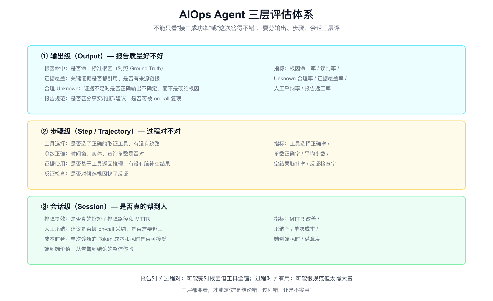
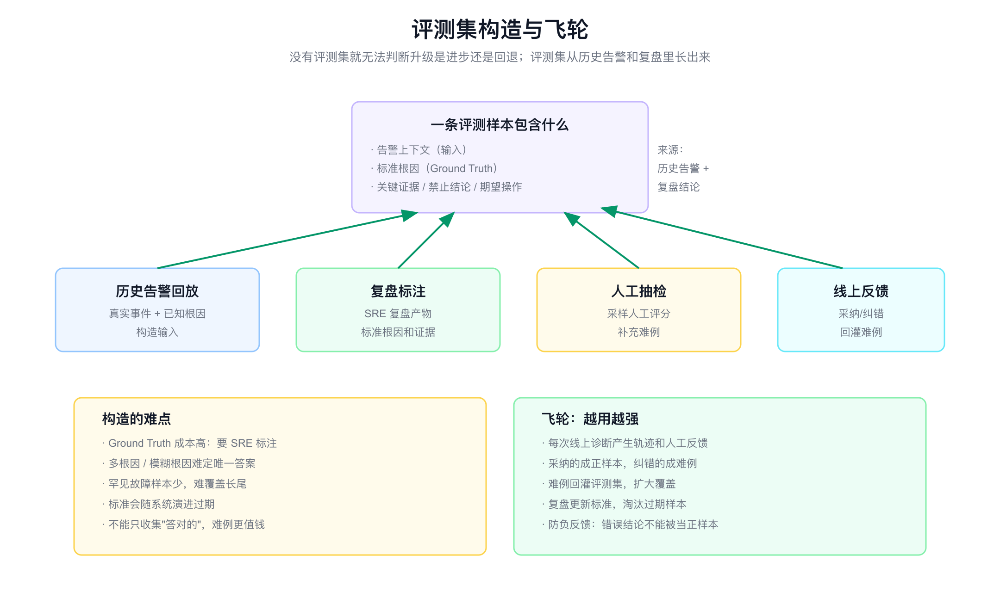
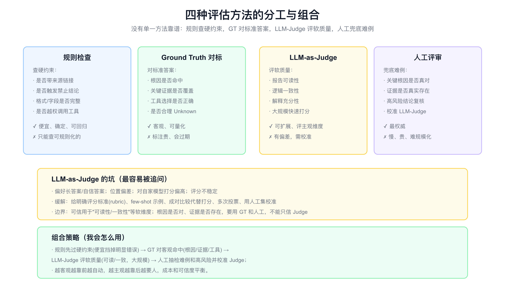
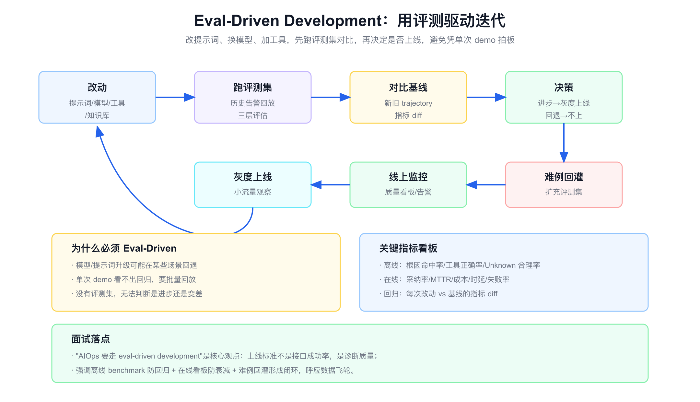

# 面试定位卡

- **技术点**：AIOps Agent 评估工程 / 三层评估 / Ground Truth 构造 / LLM-as-Judge / Eval-Driven Development
- **所属领域**：Agent 质量保障、评测工程、AgentOps、LLM 评估
- **经验等级**：`theory_with_adjacent_experience`（理解评测方法论，有可观测和复盘的相邻经验，没有亲手建过 Agent 评测平台）
- **面试价值**：补 [aiops.md](./aiops.md) 里"评估回归"的深度。回答"你怎么知道这个 RCA Agent 是真的变好了"。能讲清楚评估是 AIOps 能不能持续迭代的命门，证明你不是只会做 demo。
- **常见考法**：怎么评估一个 RCA Agent;只看接口成功率够吗;Ground Truth 怎么构造;LLM-as-Judge 靠谱吗;怎么防止模型升级后回退;离线和在线评估怎么配合。
- **适合挂钩项目**：RCA Agent、AgentOps、质量看板、复盘体系、回归测试。
- **不适合夸大的地方**：不能说我建了 Agent 评测平台、跑出某个准确率;不能编造命中率、采纳率、benchmark 规模;LLM-as-Judge 的可靠性不能夸大。

# 经验边界

我没有亲手建过 RCA Agent 的评测平台和 benchmark。相邻经验是可观测、告警治理和参与过排障复盘,理解什么是"好的根因结论"。对评估工程,我做的是方法论对标。

可以安全表达的是:我能讲清楚为什么不能只看接口成功率、三层评估怎么分、Ground Truth 怎么构造和它的难点、LLM-as-Judge 的适用边界和坑、为什么要 eval-driven development。

不能表达的是:我建了评测平台、跑出了多少命中率、benchmark 有多大规模、采纳率多少。这些需要真实生产归属和数据。

# 三十秒回答

AIOps Agent 的评估不能只看"接口有没有成功返回",那只证明它没崩,不证明诊断对。要分三层:输出级看报告质量（根因是否命中、证据是否覆盖、是否合理 Unknown）、步骤级看过程（工具选得对不对、有没有脑补空结果、有没有找反证）、会话级看价值（是否真的缩短 MTTR、人工是否采纳、成本时延能否接受）。

评估的基础是评测集,从历史告警和复盘里构造,每条样本包含告警上下文、标准根因、关键证据、禁止结论。评估方法要组合:规则查硬约束、Ground Truth 对客观命中、LLM-as-Judge 评软质量、人工兜底难例,越客观越自动,越主观越要人。

最后是 eval-driven development:改提示词、换模型、加工具都先跑评测集对比基线再决定上线,避免凭单次 demo 拍板。一句话:没有评估,AIOps 无法判断升级是进步还是回退。



# 为什么需要它

- **没有它之前的问题**：靠"这次答得不错"主观判断,模型/提示词一升级可能悄悄回退,没人发现。
- **它的解决方式**：建三层评估 + 评测集 + 组合评估方法 + eval-driven 回归,把质量做成可度量。
- **它引入的新问题**：Ground Truth 标注贵、会过期;LLM-as-Judge 有偏差;评测集要持续维护。
- **必须关注的场景**：模型升级回归、提示词调优、工具变更、知识库更新、上线前验收。

# 它解决什么问题

- **只看成功率,看不出诊断对不对**
  - **对应能力**：三层评估,输出/步骤/会话分别衡量。
  - **面试表达**：接口成功只证明没崩,不证明诊断对。

- **蒙对根因但过程全错**
  - **对应能力**：步骤级评估,看工具选择和证据使用。
  - **面试表达**：报告对不等于过程对,要分层看。

- **没有标准,无法判断好坏**
  - **对应能力**：Ground Truth 评测集构造。
  - **面试表达**：没有评测集就只能凭感觉,无法回归。

- **人工评不过来**
  - **对应能力**：LLM-as-Judge 大规模评软质量。
  - **面试表达**：Judge 评可读性可以,评根因对错要 GT 和人工。

- **升级后悄悄回退**
  - **对应能力**：eval-driven development,改动先跑评测对比。
  - **面试表达**：上线标准是诊断质量,不是单次 demo。

# 核心概念表

- **三层评估**
  - **一句话定义**：输出级（报告质量）、步骤级（过程对错）、会话级（实际价值）。
  - **解决的问题**：单一指标看不出问题出在哪。
  - **追问点**：三层怎么配合;哪层最难评。

- **Ground Truth / 标准答案**
  - **一句话定义**：每条评测样本的标准根因、关键证据、禁止结论、期望操作。
  - **解决的问题**：给客观对错一个基准。
  - **追问点**：怎么标注;多根因怎么办;会不会过期。

- **Trajectory 评估**
  - **一句话定义**：评 Agent 每一步的工具选择、参数、证据使用、反证检查。
  - **解决的问题**：只看结论会漏掉"蒙对"。
  - **追问点**：怎么判断工具选对;空结果脑补怎么查。

- **LLM-as-Judge**
  - **一句话定义**：用大模型给 Agent 输出打分,评可读性、一致性等软维度。
  - **解决的问题**：人工评不过来,软维度难规则化。
  - **追问点**：有哪些偏差;怎么校准;边界在哪。

- **规则检查 / Rule-based**
  - **一句话定义**：用确定规则查硬约束（带来源、禁止结论、格式、越权）。
  - **解决的问题**：便宜可回归地挡明显错误。
  - **追问点**：能查什么、不能查什么。

- **离线 Benchmark**
  - **一句话定义**：用历史告警回放批量评估,防回归。
  - **解决的问题**：单次 demo 看不出回退。
  - **追问点**：和在线评估区别;多久跑一次。

- **在线质量看板**
  - **一句话定义**：监控线上采纳率、MTTR、成本、时延、失败率。
  - **解决的问题**：防止线上质量随时间衰减。
  - **追问点**：哪些指标;怎么和离线配合。

- **Eval-Driven Development**
  - **一句话定义**：每次改动先跑评测集对比基线再决定上线。
  - **解决的问题**：凭感觉迭代会回退。
  - **追问点**：和软件回归测试类比;难例怎么回灌。

# 原理模型

AIOps Agent 评估是一个闭环:评测集 → 多方法评估 → 三层指标 → eval-driven 决策 → 难例回灌评测集。

- **评测集层**：从历史告警和复盘构造 Ground Truth,是一切评估的基准。
- **方法层**：规则、GT、LLM-Judge、人工组合,越客观越自动。
- **指标层**：输出、步骤、会话三层指标。
- **决策层**：离线防回归 + 在线防衰减 + 难例回灌,驱动迭代。

# 关键机制

## 三层评估

- **问题**：只看一个指标会误判——接口成功率高不代表诊断对,蒙对根因不代表过程对,过程对不代表实用。
- **工作方式**：
  - 输出级：根因命中、证据覆盖、合理 Unknown、报告规范。指标如根因命中率、误判率、Unknown 合理率、人工采纳率。
  - 步骤级：工具选择正确、参数正确、证据使用（不脑补空结果）、反证检查。指标如工具选择正确率、平均步数、空结果脑补率、反证检查率。
  - 会话级：排障提效、人工采纳、成本时延、端到端价值。指标如 MTTR 改善、采纳率、单次成本、端到端耗时。
- **权衡**：层越多评估越全但成本越高,要按重要性投入。
- **追问回答**：我会强调"报告对不等于过程对,过程对不等于有用",三层都看才能定位是结论错、过程错还是不实用。

## 评测集构造与飞轮

- **问题**：没有评测集就只能凭感觉,无法判断升级是进步还是回退。
- **工作方式**：一条样本包含告警上下文（输入）、标准根因（GT）、关键证据、禁止结论、期望操作。来源是历史告警回放 + 复盘标注 + 人工抽检 + 线上反馈。线上采纳的成正样本,纠错的成难例回灌。
- **权衡**：GT 标注成本高、多根因难定唯一答案、罕见故障样本少、标准会过期、不能只收答对的（难例更值钱）。
- **追问回答**：评测集是从历史告警和复盘里长出来的,且要形成飞轮——每次诊断产生反馈,难例回灌扩大覆盖,复盘更新标准,但要防负反馈（错误结论被当正样本）。这和 [aiops-frontier.md](./aiops-frontier.md) 的数据飞轮是同一条主线。



## 评估方法的分工与组合

- **问题**：没有单一方法靠谱——规则只能查可规则化的,GT 标注贵会过期,LLM-Judge 有偏差,人工慢且贵。
- **工作方式**：
  - 规则检查：查硬约束（带来源、禁止结论、格式、越权）,便宜确定可回归。
  - Ground Truth 对标：客观命中（根因、证据、工具选择、合理 Unknown）,可量化。
  - LLM-as-Judge：评软质量（可读性、一致性、解释充分性）,可扩展。
  - 人工评审：兜底难例和高风险,校准 Judge,最权威但难规模化。
- **权衡**：越客观越靠前越自动,越主观越靠后越要人,平衡成本和可信度。
- **追问回答**：我会规则先过硬约束挡明显错误,GT 对客观命中,LLM-Judge 评软质量做大规模,人工抽检难例并校准 Judge。



## LLM-as-Judge 的可靠性

- **问题**：LLM-as-Judge 方便但有偏差,不能盲信。
- **工作方式**：已知偏差包括偏好长答案/自信答案、位置偏差、对自家模型打分偏高、评分不稳定。缓解手段:给明确评分标准（rubric）、few-shot 示例、用成对比较代替绝对打分、多次投票、用人工集校准。
- **权衡**：可信用于可读性/一致性等软维度;根因是否对、证据是否真实存在,要用 GT 和人工,不能只信 Judge。
- **追问回答**：我会明确边界——LLM-Judge 适合做辅助评估软维度和大规模筛选,关键的根因对错和证据存在性必须 GT + 人工兜底。

## Eval-Driven Development

- **问题**：改提示词、换模型、加工具可能在某些场景回退,单次 demo 看不出来。
- **工作方式**：每次改动先跑评测集回放对比基线（新旧 trajectory 和指标 diff）,进步才灰度上线,灰度小流量观察 + 在线监控,难例回灌评测集。
- **权衡**：评测集要持续维护成本,但没有它无法判断进步还是变差。
- **追问回答**：我会把"AIOps 要走 eval-driven development"当核心观点:上线标准不是接口成功率而是诊断质量,离线 benchmark 防回归 + 在线看板防衰减 + 难例回灌形成闭环。



# 横向对比

- **接口成功率 vs 三层评估**
  - 接口成功率只证明没崩;三层评估衡量诊断对不对、过程对不对、有没有用。

- **输出级 vs 步骤级**
  - 输出级看结论质量,可能蒙对;步骤级看过程,抓"蒙对但工具全错"。

- **规则 vs LLM-as-Judge**
  - 规则确定便宜但只能查硬约束;Judge 可评软维度但有偏差需校准。

- **Ground Truth vs LLM-as-Judge**
  - GT 客观可量化但标注贵会过期;Judge 可扩展但不能定根因对错。

- **离线 benchmark vs 在线看板**
  - 离线防回归（上线前批量回放）;在线防衰减（线上采纳率、MTTR、成本）。

- **凭 demo 迭代 vs eval-driven**
  - demo 会漏回归;eval-driven 批量对比基线,客观决策。

# 业界做法对标

- **给 Agent 做"CT"：可观测与质量保障**
  - 大厂强调对 trace、tool call、retrieval、LLM 调用、成本、延迟、Good/Bad Case 做离线回放和线上监控,Agent 上线标准不只看接口成功率。

- **从盲目调优到数据驱动：评估工程**
  - 强调用历史回放和 benchmark 把调优从"凭感觉"变成"数据驱动",对应 eval-driven development。

- **LLM-as-Judge 实践**
  - 业界共识是 Judge 可做辅助评估和大规模筛选,但要 rubric、成对比较、人工校准,关键维度仍需 GT 和人工。

- **评估工具链**
  - LangSmith、OpenAI Evals 等提供评测集管理、trajectory 评估、回归对比,是评估工程化的代表。

# 典型业务场景

- **模型升级验收**：换模型先跑评测集对比基线,防回退。
- **提示词调优**：每次改 prompt 批量回放,看三层指标变化。
- **工具/知识变更**：加工具或更新知识后回归测试。
- **上线前验收**：离线 benchmark 达标 + 灰度观察。
- **线上质量监控**：采纳率、MTTR、成本、失败率看板。
- **难例治理**：线上纠错回灌评测集,扩大长尾覆盖。

# 如果让我落地,我会怎么设计

- **第一步：建评测集**
  - 从历史告警 + 复盘构造,样本含告警上下文、标准根因、关键证据、禁止结论、期望操作,先覆盖高频场景。

- **第二步：定三层指标**
  - 输出级（命中/覆盖/Unknown）、步骤级（工具/参数/反证）、会话级（采纳/MTTR/成本）。

- **第三步：组合评估**
  - 规则查硬约束、GT 对客观、LLM-Judge 评软质量、人工抽检校准。

- **第四步：eval-driven 流程**
  - 改动先跑评测对比基线,进步才灰度,灰度 + 在线监控。

- **第五步：在线看板 + 难例回灌**
  - 监控采纳率、MTTR、成本、失败率,纠错难例回灌评测集。

- **第六步：接 AgentOps**
  - trajectory 评估依赖可观测数据,衔接 [aiops.md](./aiops.md) 的 AgentOps 层。

# 排障路径

如果评估体系本身有问题,我会按下面顺序排查。

- **症状：评测分高但线上体验差**
  - **假设**：评测集和线上分布不一致,或只评了输出级。
  - **验证**：对比评测集场景分布和线上真实分布,看是否缺步骤级和会话级。
  - **指标**：评测集覆盖率、离线在线指标相关性。
  - **结论**：补步骤级和会话级评估,评测集对齐线上分布。

- **症状：LLM-Judge 打分不可信**
  - **假设**：无 rubric、有位置/长度偏差、未校准。
  - **验证**：用人工集对比 Judge 打分,看一致性。
  - **指标**：Judge 与人工一致率、评分方差。
  - **结论**：加 rubric、成对比较、多次投票、人工校准,关键维度退回 GT。

- **症状：升级后线上回退没发现**
  - **假设**：没跑离线回归,凭 demo 上线。
  - **验证**：补历史告警批量回放对比基线。
  - **指标**：新旧指标 diff、回归命中率。
  - **结论**：强制 eval-driven,改动必跑评测。

- **症状：评测集越用越没区分度**
  - **假设**：只收答对的,缺难例。
  - **验证**：看样本难度分布,是否覆盖长尾和易错场景。
  - **指标**：难例占比、样本通过率分布。
  - **结论**：难例回灌,淘汰过简单和过期样本。

- **症状：Ground Truth 过期误判**
  - **假设**：系统演进了但标准没更新。
  - **验证**：抽查 GT 是否仍符合当前系统。
  - **指标**：GT 过期率、复盘更新频率。
  - **结论**：复盘后更新 GT,标注带版本和有效期。

# 未来规划和 Roadmap

- **阶段一：评测集 + 三层指标**：高频场景先覆盖。
- **阶段二：组合评估**：规则 + GT + LLM-Judge + 人工。
- **阶段三：eval-driven 流程**：改动必跑评测对比基线。
- **阶段四：在线看板**：采纳率、MTTR、成本、失败率。
- **阶段五：难例回灌飞轮**：线上反馈扩充评测集。
- **阶段六：Judge 校准与自动化**：rubric + 人工校准,提高自动化比例。

# 风险、边界和误区

- **误区：接口成功率就够了**
  - 正确理解：成功率只证明没崩,要三层评估衡量诊断质量。

- **误区：只看结论对不对**
  - 正确理解：会漏掉蒙对,要步骤级评过程。

- **误区：LLM-as-Judge 能评一切**
  - 正确理解：Judge 评软维度可以,根因对错和证据存在性要 GT 和人工。

- **误区：评测集建一次就行**
  - 正确理解：会过期、缺难例,要持续回灌和更新。

- **误区：demo 好就能上线**
  - 正确理解：单次 demo 看不出回归,要 eval-driven 批量对比。

- **误区：评测集只收成功案例**
  - 正确理解：难例更值钱,只收答对的会失去区分度。

# 和项目的安全连接

- **能怎么说**
  - 我理解 RCA Agent 的评估方法论:三层评估、评测集构造、组合评估方法、eval-driven。
  - 我能把可观测和复盘的相邻经验,和评测集构造、难例回灌连接。
  - 我能讲清楚为什么评估是 AIOps 持续迭代的命门。

- **不能怎么说**

| 风险说法 | 问题 | 安全替代表达 |
|---|---|---|
| 我建了 Agent 评测平台 | 没有生产归属 | 我理解评测方法论,能讲如果落地怎么设计 |
| 我们根因命中率 X | 编造数据 | 命中率要靠评测集衡量,需真实 benchmark |
| LLM-Judge 准确率很高 | 夸大可靠性 | Judge 适合软维度,关键维度要 GT 和人工 |
| 评测集很大很全 | 编造规模 | 评测集要持续构造和回灌,覆盖按场景 |
| 我们做到了自动评估 | 夸大自动化 | 越客观越自动,关键和难例仍需人工 |

# 面试追问树

```text
怎么知道 RCA Agent 真的变好了？
├─ 为什么不能只看接口成功率
│  └─ 成功 ≠ 诊断对
├─ 三层评估
│  ├─ 输出级（命中/覆盖/Unknown）
│  ├─ 步骤级（工具/参数/反证/脑补）
│  └─ 会话级（采纳/MTTR/成本）
├─ 评测集
│  ├─ 历史告警 + 复盘构造
│  ├─ GT/关键证据/禁止结论
│  └─ 难例回灌飞轮
├─ 评估方法组合
│  ├─ 规则查硬约束
│  ├─ GT 对客观命中
│  ├─ LLM-Judge 评软质量
│  └─ 人工兜底校准
└─ Eval-Driven Development
   ├─ 改动先跑评测对比基线
   ├─ 离线防回归 + 在线防衰减
   └─ 难例回灌闭环
```

# 高频 Q&A

## 怎么评估一个 RCA Agent?

三层:输出级看报告质量（根因命中、证据覆盖、合理 Unknown）、步骤级看过程（工具选择、参数、证据使用、反证）、会话级看价值（MTTR 改善、采纳率、成本时延）。报告对不等于过程对,过程对不等于有用,三层都看才能定位问题在哪。

## 只看接口成功率够吗?

不够。接口成功只证明 Agent 没崩,不证明诊断对。可能成功返回一个错误根因,或蒙对根因但工具全错。要三层评估衡量诊断质量。

## Ground Truth 怎么构造?

从历史告警和复盘里构造,每条样本含告警上下文、标准根因、关键证据、禁止结论、期望操作。难点是标注成本高、多根因难定唯一答案、罕见故障样本少、标准会过期,且不能只收答对的,难例更值钱。

## LLM-as-Judge 靠谱吗?

适合辅助评估软维度（可读性、一致性、解释充分性）和大规模筛选,但有偏差:偏好长/自信答案、位置偏差、对自家模型偏高、不稳定。要 rubric、成对比较、多次投票、人工校准。关键的根因对错和证据存在性必须 GT 和人工,不能只信 Judge。

## 怎么防止模型升级后回退?

eval-driven development:换模型/改提示词/加工具都先跑历史告警评测集回放,对比基线的 trajectory 和指标 diff,进步才灰度上线。单次 demo 看不出回归,必须批量回放。

## 离线和在线评估怎么配合?

离线 benchmark 防回归（上线前批量回放对比基线）;在线质量看板防衰减（监控采纳率、MTTR、成本、时延、失败率）;线上难例回灌评测集,形成闭环。

## 步骤级评估评什么?

工具选择是否正确、参数（时间窗/实体）是否对、是否基于工具返回推理而不脑补空结果、是否对候选根因找反证。它抓的是"蒙对但过程错"这种输出级看不出的问题。

## 评测集怎么持续有效?

形成飞轮:线上采纳的成正样本、纠错的成难例回灌,复盘更新标准淘汰过期样本。要防负反馈——错误结论不能被当正样本。这和数据飞轮是同一条主线。

## 评估方法怎么组合?

越客观越自动越靠前:规则查硬约束（便宜挡明显错误）→ GT 对客观命中 → LLM-Judge 评软质量（大规模）→ 人工抽检难例和高风险并校准 Judge。平衡成本和可信度。

# 三档背诵版

## 15 秒版

RCA Agent 评估不能只看接口成功率。三层:输出级（命中/覆盖/Unknown）、步骤级（工具/反证/脑补）、会话级（采纳/MTTR/成本）。评测集从历史告警和复盘构造,方法用规则+GT+LLM-Judge+人工组合,走 eval-driven 防回归。

## 45 秒版

这块讲怎么知道 Agent 真变好了,是方法论对标。核心观点是上线标准不是接口成功率而是诊断质量。评估分三层:输出级看报告对不对,步骤级看过程对不对（抓蒙对但工具全错）,会话级看有没有用。基础是评测集,从历史告警和复盘构造 Ground Truth,含标准根因、关键证据、禁止结论。方法要组合:规则查硬约束、GT 对客观命中、LLM-Judge 评软质量但要校准、人工兜底难例。最后走 eval-driven development:改动先跑评测对比基线,离线防回归、在线防衰减、难例回灌,这和数据飞轮一条主线。

## 2 分钟版

我会先立观点:评估是 AIOps 能不能持续迭代的命门,上线标准是诊断质量不是接口成功率,因为成功返回只证明没崩,不证明诊断对。

然后讲三层评估。输出级看报告质量:根因是否命中标准答案、关键证据是否覆盖且带来源、证据不足时是否合理输出 Unknown、报告是否区分事实推断建议。步骤级看过程:工具选择对不对、参数对不对、是否基于工具返回推理而不脑补空结果、是否对候选根因找反证,它抓的是输出级看不出的"蒙对但过程全错"。会话级看价值:是否真缩短 MTTR、人工是否采纳、成本时延能否接受。报告对不等于过程对,过程对不等于有用。

评估的基础是评测集,从历史告警和复盘构造,每条含告警上下文、标准根因、关键证据、禁止结论、期望操作,难点是标注贵、多根因难定、长尾样本少、标准会过期,且难例比答对的更值钱。方法要组合,越客观越自动:规则查硬约束、GT 对客观命中、LLM-Judge 评可读性一致性但有偏差要 rubric 和人工校准、人工兜底关键和难例。

最后是 eval-driven development:换模型改提示词加工具都先跑历史告警回放对比基线,进步才灰度,离线 benchmark 防回归、在线看板防衰减、难例回灌扩评测集,形成闭环。我会声明这是方法论对标,不是我亲手建过的评测平台,但我能把它和可观测、复盘的相邻经验连起来,也呼应数据飞轮主线。

# 参考资料

- 评估工程：给 Agent 做"CT"、从盲目调优到数据驱动（QCon 分享,见 [aiops.md](./aiops.md) 参考资料）
- LLM-as-Judge：rubric、成对比较、位置/长度偏差、人工校准
- 评估工具：LangSmith evaluation、OpenAI Evals
- OpenTelemetry GenAI 语义约定（trajectory/span 可观测,支撑步骤级评估）
- 配套：[aiops.md](./aiops.md)（AgentOps/评估回归）、[aiops-frontier.md](./aiops-frontier.md)（数据飞轮）、[aiops-agent-engineering.md](./aiops-agent-engineering.md)（Agent 工程）

# 面试前检查清单

- 能否说清为什么不能只看接口成功率。
- 能否讲三层评估及各层指标。
- 能否讲 Ground Truth 怎么构造和它的难点。
- 能否讲 LLM-as-Judge 的偏差、缓解和边界。
- 能否讲 eval-driven development 和离线在线配合。
- 能否讲难例回灌飞轮和防负反馈。
- 能否声明这是方法论对标,不是亲手建过评测平台。
