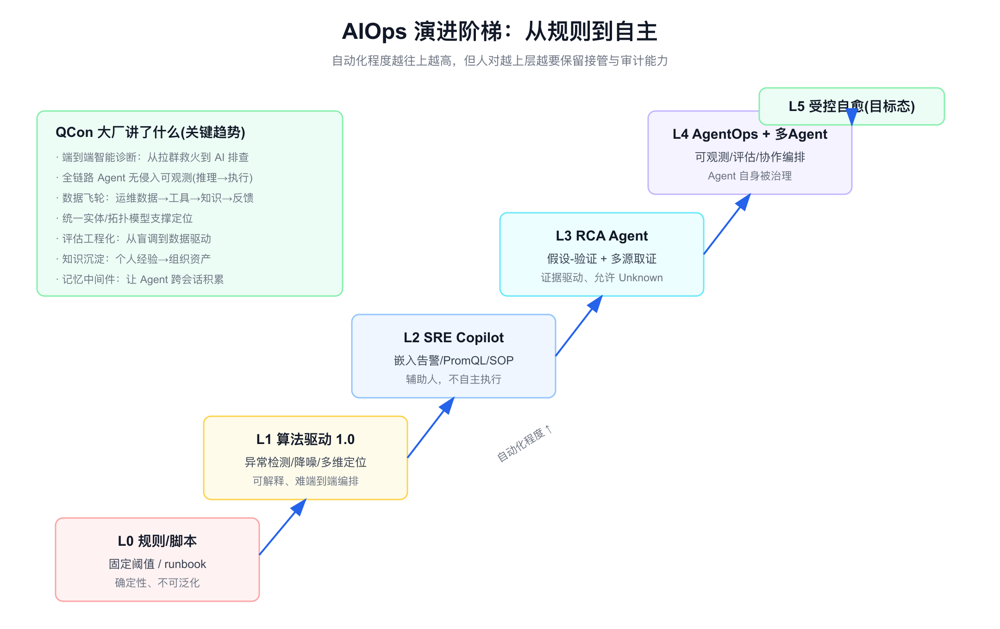
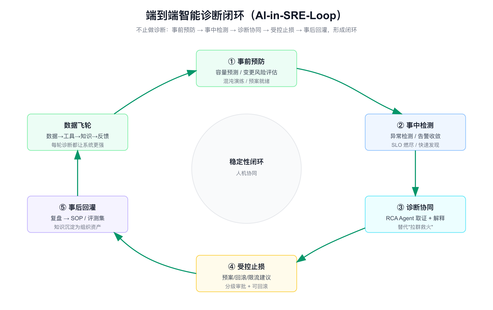
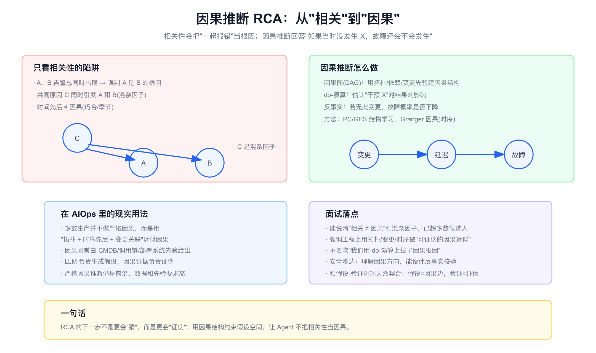
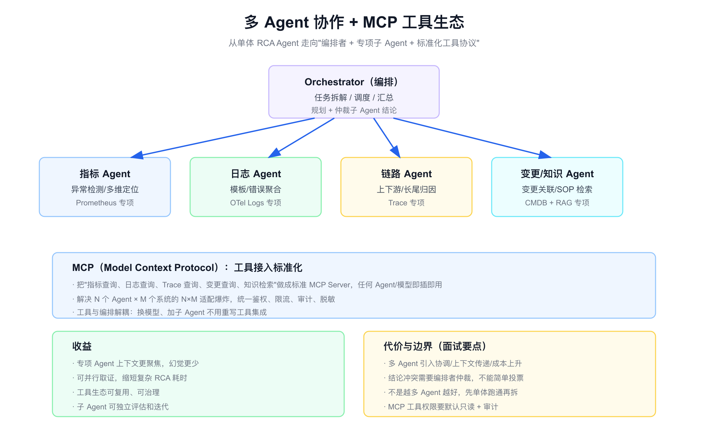

# 面试定位卡

- **技术点**：AIOps 前沿与展望 / 端到端智能诊断 / 数据飞轮 / 因果推断 RCA / 多 Agent 与 MCP / 受控自愈
- **所属领域**：智能运维演进、AI SRE、AgentOps、稳定性体系
- **经验等级**：`theory_industry_benchmarking`（基于 QCon 大厂分享和行业材料的对标理解，不是亲历落地）
- **面试价值**：和 [aiops.md](./aiops.md)（现状/落地）配套，回答"AIOps 接下来往哪走"。能讲清楚行业从 Copilot 到端到端诊断、再到受控自愈的演进主线，体现技术判断力而不是只会复述当前方案。
- **常见考法**：AIOps 未来怎么发展；端到端诊断和单点 RCA 有什么不同；什么是数据飞轮；因果推断在根因分析里能做什么；多 Agent 和 MCP 解决什么；能不能做到自动自愈；大厂都在做什么。
- **适合挂钩项目**：可观测平台、告警治理、SRE 平台化、Agent 平台、知识沉淀体系。
- **不适合夸大的地方**：不能把行业方案说成我做过；不能说我们已经端到端自愈；不能编造因果推断、多 Agent 的上线效果；展望要标明是趋势判断而非既成事实。

# 经验边界

这篇是**行业对标和趋势判断**，素材来自 QCon 大厂分享、夜莺 v9 等公开材料和本地会议 PDF。我没有亲历这些前沿系统的生产建设。

可以安全表达的是：我能讲清楚 AIOps 的演进阶梯、每一层解决什么新问题、引入什么新代价，以及如果让我推进会怎么排优先级。这体现的是技术判断力和对标能力。

不能表达的是：我建设了端到端自愈系统、上线了因果推断根因、跑通了多 Agent 协作、达到了某个自动化率。这些必须有真实生产归属和数据。

# 三十秒回答

AIOps 的演进可以看成一个自动化阶梯：从规则脚本（L0），到算法驱动的检测降噪定位（L1），到嵌入工作流的 SRE Copilot（L2），到证据驱动的 RCA Agent（L3），到 Agent 自身可观测可评估、多 Agent 协作的 AgentOps（L4），最终目标是受控自愈（L5）。

行业前沿主要在四个方向发力：一是从单点诊断走向端到端闭环（事前预防、事中检测、诊断协同、受控止损、事后回灌）；二是建数据飞轮，让每次诊断都沉淀数据、工具和知识；三是用因果推断约束根因，从"相关"走向"可证伪的因果"；四是用多 Agent 协作和 MCP 工具生态，把单体 Agent 拆成编排者加专项子 Agent。

但越往上自动化越高，人对越上层越要保留接管和审计能力，自愈不等于无人值守。



# 为什么需要它

- **没有它之前的问题**：当前多数 AIOps 停在单点（检测、Copilot、单次 RCA），故障还是要拉群救火，经验沉淀不下来，Agent 自己也不被治理。
- **它的解决方式**：把诊断放进端到端稳定性闭环，建数据飞轮持续增强，用因果和多 Agent 提升定位质量和效率，逐步开放受控执行。
- **它引入的新问题**：自动化越高，误操作风险越大，评估和审计要求越高；多 Agent 带来协调和成本问题；因果推断对数据和先验要求高。
- **必须关注的场景**：大故障的端到端协同、跨团队知识沉淀、复杂多源根因、受控止损的风险分级。

# 它解决什么问题

- **诊断是孤岛，不闭环**
  - **对应能力**：把事前预防、事中检测、诊断、止损、复盘回灌串成一个环。
  - **面试表达**：稳定性的目标不是"诊断准"，而是"可判断、可止损、可接管、可学习"。

- **每次故障的经验流失**
  - **对应能力**：数据飞轮，把数据、工具、知识、反馈做成自增强循环。
  - **面试表达**：AIOps 的护城河不是模型，是飞轮转起来后的数据和知识资产。

- **根因常把相关当因果**
  - **对应能力**：用因果图、变更关联、时序先后做可证伪的因果近似。
  - **面试表达**：RCA 的下一步不是更会猜，而是更会证伪。

- **单体 Agent 上下文过载**
  - **对应能力**：多 Agent 分工 + MCP 标准化工具，编排者仲裁。
  - **面试表达**：把一个什么都干的 Agent，拆成各管一段、可并行、可评估的子 Agent。

- **执行能力开放无标准**
  - **对应能力**：受控自愈，按风险分级，从建议到草案到半自动到自动。
  - **面试表达**：自愈是终点不是起点，先把判断和止损做稳。

# 核心概念表

- **AIOps 演进阶梯 / L0–L5**
  - **一句话定义**：从规则、算法、Copilot、RCA Agent、AgentOps 到受控自愈的自动化分层。
  - **解决的问题**：给"AIOps 发展到哪了"一个可讲的坐标系。
  - **追问点**：每层解决什么新问题；为什么不能跳级；人在哪一层介入。

- **端到端智能诊断闭环**
  - **一句话定义**：把诊断嵌入事前-事中-事后的稳定性全流程，而不是只做一次根因分析。
  - **解决的问题**：拉群救火、经验不沉淀、止损靠人肉。
  - **追问点**：闭环里哪些能自动；止损怎么受控；复盘怎么回灌。

- **数据飞轮**
  - **一句话定义**：运维数据→工具→知识→反馈→更好的数据，越转越强的自增强循环。
  - **解决的问题**：一次性项目无法持续变好。
  - **追问点**：飞轮启动靠什么；冷启动期怎么办；负反馈怎么防。

- **因果推断 RCA**
  - **一句话定义**：用因果结构（DAG）、do-演算、反事实，把相关性升级为可证伪的因果判断。
  - **解决的问题**：相关性误把共现告警当根因（混杂因子）。
  - **追问点**：因果图哪来；严格因果和工程近似差别；和假设-验证怎么结合。

- **多 Agent 协作**
  - **一句话定义**：编排者 + 指标/日志/链路/变更等专项子 Agent 分工取证、仲裁汇总。
  - **解决的问题**：单体 Agent 上下文过载、串行慢。
  - **追问点**：什么时候该拆；结论冲突怎么仲裁；成本怎么控。

- **MCP / 工具协议**
  - **一句话定义**：把各运维系统封装成标准化工具协议，任何 Agent 即插即用。
  - **解决的问题**：N 个 Agent × M 个系统的适配爆炸。
  - **追问点**：和普通 function calling 区别；权限审计怎么统一。

- **受控自愈**
  - **一句话定义**：按风险分级开放执行，从建议到半自动到自动，高风险必须审批可回滚。
  - **解决的问题**：让止损更快但不失控。
  - **追问点**：哪些动作能自动；回滚怎么保证；责任怎么界定。

- **Agent 记忆中间件**
  - **一句话定义**：让 Agent 跨会话积累故障经验和上下文（短期/长期记忆）。
  - **解决的问题**：每次诊断都从零开始，不积累。
  - **追问点**：记忆怎么检索；怎么防记忆污染和过期。

# 原理模型

把前沿趋势放进同一张演进图：自动化程度从 L0 到 L5 递增，但**人的接管点要随层级上移而强化**。

- **L0 规则/脚本**：确定性，不可泛化。
- **L1 算法驱动**：异常检测、降噪、多维定位，可解释但难端到端编排（见 [aiops-classic-algorithms.md](./aiops-classic-algorithms.md)）。
- **L2 SRE Copilot**：嵌入告警/PromQL/SOP，辅助人不自主执行（夜莺 v9 路线）。
- **L3 RCA Agent**：假设-验证、多源取证、允许 Unknown（见 [aiops.md](./aiops.md)）。
- **L4 AgentOps + 多 Agent**：Agent 自身被观测评估，专项子 Agent 协作。
- **L5 受控自愈**：风险分级执行，目标态而非现状。

# 关键机制

## 端到端智能诊断闭环

- **问题**：现在故障还是"拉群救火"，诊断、止损、复盘各自为政，经验留不下来。
- **工作方式**：把诊断嵌入闭环——事前预防（容量预测、变更风险、混沌演练）、事中检测（异常检测、SLO 燃尽）、诊断协同（RCA Agent 取证解释）、受控止损（预案/回滚/限流建议 + 分级审批）、事后回灌（复盘转 SOP 和评测集）。
- **权衡**：闭环越完整价值越大，但每一环的自动化都要配套审计和回滚；止损环节风险最高，最后开放。
- **追问回答**：我会强调稳定性目标是"可判断、可止损、可接管、可学习"，诊断只是其中一环，端到端才是行业要去的地方。



## 数据飞轮

- **问题**：很多 AIOps 是一次性项目，上线即巅峰，之后不持续变好。
- **工作方式**：把运维数据、工具调用、知识沉淀、人工反馈组织成自增强循环：每次诊断产生轨迹和标注，反哺评测集和知识库，让工具和提示更准，从而产生更好的数据。
- **权衡**：飞轮启动需要冷启动期的人工投入；要防负反馈（错误结论被当正样本沉淀）。
- **追问回答**：我认为 AIOps 的护城河不是模型选型，而是飞轮转起来后积累的数据、工具和知识资产，这也是大厂分享反复强调的瓶颈不在模型而在数据上下文和反馈闭环。

## 因果推断 RCA

- **问题**：只看相关性的 RCA 会把"总是一起报错"的告警当根因，忽略共同原因（混杂因子）和巧合。
- **工作方式**：用因果图（DAG，常由 CMDB/调用链/部署系统先验给出）约束假设空间，用 do-演算估计干预影响，用反事实问"若无此变更故障是否还发生"；时序上可用 Granger 因果，结构上可用 PC/GES 学习。
- **权衡**：严格因果推断对数据量和先验质量要求高，仍是前沿；工程上多用"拓扑 + 变更关联 + 时序先后"做可证伪的因果近似。
- **追问回答**：能讲清楚相关不等于因果、混杂因子，就已经超过多数候选人。我会强调工程现实是用拓扑和变更做因果近似，让 Agent 不把相关当因果，这和假设-验证闭环天然契合（假设是因果边，验证是证伪）。



## 多 Agent 协作 + MCP

- **问题**：单体 RCA Agent 要同时懂指标、日志、链路、变更、知识，上下文过载、串行慢、易幻觉。
- **工作方式**：编排者负责任务拆解和调度，指标/日志/链路/变更等专项子 Agent 并行取证，编排者仲裁冲突结论；工具层用 MCP 标准化，解决 N×M 适配爆炸，统一鉴权、限流、审计、脱敏。
- **权衡**：多 Agent 带来协调成本、上下文传递和总成本上升；结论冲突不能简单投票，要编排者带证据仲裁；不是越多越好，先单体跑通再拆。
- **追问回答**：我会先用单体 Agent 把流程跑通，再按"上下文过载"和"可并行"为信号拆子 Agent；MCP 的价值是让工具与编排解耦，换模型加子 Agent 不用重写集成。



## 受控自愈

- **问题**：诊断完还要人来执行止损，慢；但让 Agent 直接执行线上动作风险极高。
- **工作方式**：按风险分级开放执行——先生成变更方案/静默建议/规则草案/回滚建议，再开放低风险半自动（如自动静默、自动扩容预案），高风险（重启、删数据、改配置）必须审批、审计、灰度、可回滚。
- **权衡**：完全人工慢，完全自动险，合理路线是风险分级 + 人在关键点接管。
- **追问回答**：我不把"无人值守自愈"当早期目标，早期目标是判断更快、证据更全、止损可控；自愈是阶梯顶端，要先把下面几层做稳。

## Agent 记忆与全链路可观测

- **问题**：Agent 每次诊断从零开始，且推理过程黑盒，出错难定位。
- **工作方式**：记忆中间件让 Agent 跨会话积累故障经验（短期会话记忆 + 长期知识记忆，带检索和过期）；全链路无侵入可观测把模型调用、工具调用、检索、执行串成 trace（衔接 [aiops.md](./aiops.md) 的 AgentOps）。
- **权衡**：记忆要防污染和过期；可观测要脱敏控成本。
- **追问回答**：我会把记忆和可观测看成飞轮的基础设施——没有记忆飞轮不积累，没有可观测飞轮不可信。

# 横向对比

- **单点 RCA vs 端到端诊断闭环**
  - 单点 RCA 只回答一次"为什么"，端到端把预防、检测、诊断、止损、复盘串成环，强调可止损可学习。

- **相关性 RCA vs 因果推断 RCA**
  - 相关性快但易误判混杂因子；因果推断更准但对数据和先验要求高，工程上多用拓扑/变更做因果近似。

- **单体 Agent vs 多 Agent**
  - 单体简单、上下文集中但易过载；多 Agent 可并行、上下文聚焦但有协调和成本代价，需要编排仲裁。

- **私有工具集成 vs MCP**
  - 私有集成每个 Agent 各写一套，N×M 爆炸；MCP 标准化、可复用、统一治理，但要建协议和权限体系。

- **Copilot vs 受控自愈**
  - Copilot 只辅助人，受控自愈开始接管执行但必须风险分级和可回滚。

- **一次性项目 vs 数据飞轮**
  - 一次性项目上线即巅峰；飞轮越转越强，护城河是数据和知识资产。

# 业界做法对标

- **从拉群救火到 AI 排查（端到端智能诊断）**
  - 行业在把诊断从"出事拉群"升级成端到端智能诊断体系，强调闭环和协同，而不是一个孤立的问答机器人。

- **全链路 Agent 无侵入可观测（推理到执行）**
  - 大厂在构建 Agent 从推理到执行的全链路可观测，把 Agent 当成需要被观测的系统，对应 AgentOps 层。

- **AIOps Agent 数据飞轮与统一模型**
  - 反复强调瓶颈不在模型，而在数据上下文完整性、统一实体/拓扑模型、评估可度量和反馈可持续。

- **从 AIOps 到 AgentOps：故障定位 Agent**
  - 强调可观测数据还不够，需要服务、实例、Pod、DB、MQ、依赖、变更的结构化语义支撑定位。

- **知识沉淀：从个人经验到组织资产**
  - 把复盘和排障经验沉淀成可检索、可版本、可评估的知识资产，是飞轮的知识侧。

- **Agent 记忆中间件**
  - 让 Agent 跨会话积累经验，是从"单次诊断"走向"持续变强"的关键基础设施。

- **评估工程化：从盲目调优到数据驱动**
  - 用历史回放、benchmark、LLM-as-Judge 把 Agent 质量做成可度量，详见 [aiops-evaluation.md](./aiops-evaluation.md)。

# 典型业务场景

- **大故障端到端协同**：检测、收敛、诊断、止损、复盘一条龙，减少拉群。
- **变更引发故障的因果定位**：用变更关联 + 因果近似快速锁定。
- **复杂多源根因**：多 Agent 并行取指标/日志/链路/变更证据。
- **跨团队知识沉淀**：复盘转 SOP 和评测集，喂飞轮。
- **容量与风险前置**：事前预测和变更风险评估。
- **受控止损**：预案、回滚、限流建议的分级开放。

# 如果让我推进，我会怎么排优先级

- **第一步：把现状 RCA 做稳**
  - 先让 [aiops.md](./aiops.md) 的只读取证 + 假设验证 + 报告闭环跑顺，作为一切前沿的地基。

- **第二步：建 AgentOps 和评测集**
  - 没有可观测和评估，飞轮不可信、前沿不可控（见 [aiops-evaluation.md](./aiops-evaluation.md)）。

- **第三步：启动数据飞轮**
  - 每次诊断沉淀轨迹、标注、知识，反哺评测集和工具，先把循环转起来。

- **第四步：统一实体/拓扑模型**
  - 用 CMDB、调用链、部署系统建因果近似的先验，支撑定位和因果约束。

- **第五步：按需拆多 Agent + MCP**
  - 出现上下文过载和可并行场景再拆子 Agent，工具用 MCP 标准化。

- **第六步：分级开放受控执行**
  - 从建议和草案开始，低风险半自动，高风险审批可回滚，逐步逼近受控自愈。

# 排障路径

如果前沿能力推进不顺，我会按下面顺序排查。

- **症状：端到端闭环建了但没人用**
  - **假设**：诊断质量不稳，止损建议不敢执行。
  - **验证**：看人工采纳率、止损建议被采纳比例。
  - **指标**：采纳率、闭环各环节流转率。
  - **结论**：先把诊断质量和评估做稳，再谈闭环和止损。

- **症状：飞轮转不起来**
  - **假设**：缺标注、缺反馈回路、错误结论被当正样本。
  - **验证**：检查复盘是否回灌评测集、人工反馈是否被消费。
  - **指标**：评测集增长率、知识更新频率、负反馈比例。
  - **结论**：飞轮要有人工冷启动和负反馈过滤，不能指望自动。

- **症状：因果定位还是把相关当因果**
  - **假设**：因果图先验缺失，靠纯共现。
  - **验证**：检查是否引入拓扑/变更/时序约束。
  - **指标**：根因命中率、混杂因子误判率。
  - **结论**：先用拓扑和变更做因果近似，严格因果推断按数据条件再上。

- **症状：多 Agent 比单体还慢还贵**
  - **假设**：拆得太早、协调开销大于收益。
  - **验证**：对比单体和多 Agent 的耗时、成本、命中率。
  - **指标**：端到端耗时、Token 成本、并行收益。
  - **结论**：没有上下文过载和可并行收益就别拆，先单体跑通。

- **症状：受控执行出现误操作**
  - **假设**：风险分级不清、缺审批和回滚。
  - **验证**：检查动作分级、审批链、回滚方案完整性。
  - **指标**：误操作数、回滚成功率、审批覆盖率。
  - **结论**：高风险动作必须审批 + 灰度 + 可回滚，宁慢勿错。

# 未来规划和 Roadmap

- **阶段一：稳态 RCA**：只读取证 + 假设验证 + 报告，作为地基。
- **阶段二：AgentOps + 评估**：可观测和评测集，让前沿可控。
- **阶段三：数据飞轮**：诊断沉淀数据、工具、知识，自增强。
- **阶段四：统一实体模型 + 因果近似**：拓扑/变更先验约束定位。
- **阶段五：多 Agent + MCP**：按需拆分，工具标准化。
- **阶段六：受控自愈**：风险分级执行，逼近 L5。

# 风险、边界和误区

- **误区：自愈就是无人值守**
  - 正确理解：自愈是风险分级的受控执行，人对高风险动作要保留接管和审计。

- **误区：上多 Agent 就更强**
  - 正确理解：多 Agent 有协调和成本代价，先单体跑通，按过载和并行收益再拆。

- **误区：因果推断能直接上线给根因**
  - 正确理解：严格因果对数据和先验要求高，工程多用拓扑/变更做可证伪的近似。

- **误区：飞轮会自动转**
  - 正确理解：飞轮要人工冷启动和负反馈过滤，错误结论被当正样本会越转越歪。

- **误区：前沿能力可以跳过现状直接上**
  - 正确理解：没有稳态 RCA 和评估底座，前沿都是空中楼阁。

- **误区：模型升级就能解决一切**
  - 正确理解：瓶颈在数据上下文、实体语义、评估和反馈，不在模型本身。

# 和项目的安全连接

- **能怎么说**
  - 我基于 QCon 大厂分享和行业材料做了 AIOps 演进的对标理解，能讲清楚从 Copilot 到端到端诊断、再到受控自愈的主线和取舍。
  - 我能把可观测、告警治理、SRE 平台化的相邻经验，映射到端到端闭环、数据飞轮、因果近似这些前沿方向。
  - 我能讲如果推进，我会怎么排优先级、怎么控制风险。

- **不能怎么说**

| 风险说法 | 问题 | 安全替代表达 |
|---|---|---|
| 我们做了端到端自愈 | 没有生产归属和数据 | 我理解端到端闭环的设计，强调止损要受控、可回滚 |
| 我们上线了因果推断根因 | 严格因果落地难 | 我能讲因果原理，工程上用拓扑/变更做因果近似 |
| 我们多 Agent 提升了 N 倍 | 编造效果 | 多 Agent 要按过载和并行收益判断，先单体跑通 |
| AIOps 很快全自动 | 过度乐观 | 自动化是阶梯，人对高风险要保留接管 |
| 数据飞轮自动越转越快 | 忽略冷启动和负反馈 | 飞轮要人工冷启动和负反馈过滤 |

# 面试追问树

```text
AIOps 未来往哪走？
├─ 演进阶梯 L0→L5
│  ├─ 规则 → 算法 → Copilot → RCA Agent → AgentOps → 受控自愈
│  └─ 越上层人越要保留接管
├─ 端到端诊断闭环
│  ├─ 事前预防 / 事中检测 / 诊断 / 止损 / 回灌
│  └─ 从拉群救火到 AI 排查
├─ 数据飞轮
│  ├─ 数据→工具→知识→反馈
│  └─ 护城河是资产不是模型
├─ 因果推断 RCA
│  ├─ 相关 ≠ 因果，混杂因子
│  └─ 工程用拓扑/变更做因果近似
├─ 多 Agent + MCP
│  ├─ 编排者 + 专项子 Agent
│  └─ MCP 解决 N×M 适配
└─ 受控自愈
   ├─ 风险分级执行
   └─ 高风险审批可回滚
```

# 高频 Q&A

## AIOps 未来怎么发展？

沿自动化阶梯往上：规则、算法、Copilot、RCA Agent、AgentOps、受控自愈。行业前沿在端到端诊断闭环、数据飞轮、因果近似、多 Agent 与 MCP 四个方向，但越自动化人越要保留接管和审计。

## 端到端诊断和单点 RCA 有什么不同？

单点 RCA 只回答一次为什么；端到端把预防、检测、诊断、止损、复盘串成闭环，强调可止损、可接管、可学习，目标是替代"拉群救火"。

## 什么是数据飞轮？

运维数据→工具→知识→反馈→更好的数据，越转越强的自增强循环。每次诊断沉淀轨迹和标注，反哺评测集和知识库。护城河是飞轮积累的资产，不是模型。瓶颈通常在数据上下文和反馈闭环，不在模型。

## 因果推断在 RCA 里能做什么？

约束根因假设，避免把共现告警当根因（混杂因子）。用因果图、do-演算、反事实，时序用 Granger。但严格因果对数据和先验要求高，工程上多用拓扑加变更关联做可证伪的因果近似，正好契合假设-验证闭环。

## 多 Agent 和 MCP 解决什么？

多 Agent 把单体过载的 Agent 拆成编排者加指标/日志/链路/变更专项子 Agent，可并行、上下文聚焦；MCP 把工具标准化，解决 N 个 Agent × M 个系统的适配爆炸，统一鉴权审计。代价是协调和成本，先单体跑通再拆。

## 能不能做到自动自愈？

能逐步逼近，但自愈不等于无人值守。要风险分级：先建议和草案，低风险半自动，高风险必须审批、灰度、可回滚。早期目标是判断快、证据全、止损可控，自愈是阶梯顶端。

## 大厂都在做什么？

端到端智能诊断、全链路 Agent 可观测、数据飞轮、统一实体/拓扑模型、知识资产化、Agent 记忆中间件、评估工程化。共同信号是：瓶颈不在模型，在数据语义、评估和反馈闭环。

## 为什么说瓶颈不在模型？

模型能力够用，真正卡住的是数据上下文不完整、实体关系缺失、评估不可度量、反馈不可持续。换更强的模型解决不了这些，所以飞轮和实体建模比模型选型更关键。

## Agent 记忆有什么用？

让 Agent 跨会话积累故障经验，不每次从零开始。分短期会话记忆和长期知识记忆，要带检索和过期机制，防记忆污染。它是飞轮的基础设施。

## 前沿这么多，落地先做什么？

先把现状 RCA 和评估底座做稳，再启动飞轮，统一实体模型，按需拆多 Agent，最后分级开放受控执行。没有地基，前沿都是空中楼阁。

# 三档背诵版

## 15 秒版

AIOps 沿自动化阶梯往上走：规则、算法、Copilot、RCA Agent、AgentOps、受控自愈。前沿在端到端诊断、数据飞轮、因果近似、多 Agent 与 MCP，但越自动化人越要保留接管。

## 45 秒版

这块我按行业对标讲，不是我亲历落地。AIOps 未来的主线是把诊断从单点做成端到端闭环：事前预防、事中检测、诊断协同、受控止损、事后回灌，替代拉群救火。支撑它的是数据飞轮——数据、工具、知识、反馈自增强，护城河是资产不是模型。质量上从相关性走向因果近似，用拓扑和变更约束根因；架构上从单体走向多 Agent 加 MCP 工具生态。最终目标是受控自愈，但必须风险分级、人保留接管。大厂反复强调瓶颈不在模型，在数据语义、评估和反馈。

## 2 分钟版

我会先给一个演进坐标系：从规则脚本，到算法驱动的检测降噪定位，到嵌入工作流的 SRE Copilot，到证据驱动的 RCA Agent，到 Agent 自身可观测可评估、多 Agent 协作的 AgentOps，最终到受控自愈，自动化逐层递增，但人对越上层越要保留接管和审计。

然后讲四个前沿方向。一是端到端诊断闭环，把预防、检测、诊断、止损、复盘串成环，目标是可判断、可止损、可接管、可学习，而不只是诊断准。二是数据飞轮，让每次诊断沉淀数据、工具、知识，反哺评测集，越转越强，护城河是资产不是模型选型。三是因果推断，把相关性升级为可证伪的因果，避免混杂因子误判，工程上用拓扑和变更做因果近似，和假设-验证闭环契合。四是多 Agent 加 MCP，把单体过载的 Agent 拆成编排者加专项子 Agent，工具标准化解决适配爆炸。

最后我会强调落地顺序和边界：先把现状 RCA 和评估底座做稳，再启动飞轮和实体建模，按需拆多 Agent，最后分级开放受控自愈。自愈不等于无人值守，高风险动作必须审批、灰度、可回滚。我会明确这些是基于 QCon 大厂分享的趋势判断和相邻经验映射，不是我亲历的生产系统。

# 参考资料

- 端到端智能诊断、全链路 Agent 可观测、数据飞轮、知识资产化、Agent 记忆、评估工程：QCon 相关分享（见 [aiops.md](./aiops.md) 参考资料中的 170 目录 PDF）
- 因果推断：因果图（DAG）、do-演算、反事实、Granger 因果、PC/GES 结构学习
- MCP：Model Context Protocol（工具接入标准化）
- 配套文档：[aiops.md](./aiops.md)（现状/RCA）、[aiops-classic-algorithms.md](./aiops-classic-algorithms.md)（算法底座）、[aiops-agent-engineering.md](./aiops-agent-engineering.md)（Agent 工程）、[aiops-evaluation.md](./aiops-evaluation.md)（评估）

# 面试前检查清单

- 能否画出 L0–L5 演进阶梯并说清每层解决什么新问题。
- 能否讲清端到端诊断闭环五环和"可判断/可止损/可接管/可学习"。
- 能否解释数据飞轮和"护城河是资产不是模型"。
- 能否说清相关 ≠ 因果、混杂因子，以及工程上的因果近似。
- 能否说清多 Agent 何时该拆、MCP 解决什么。
- 能否说清受控自愈的风险分级和"自愈不等于无人值守"。
- 能否声明这是行业对标和趋势判断，不是亲历落地。
