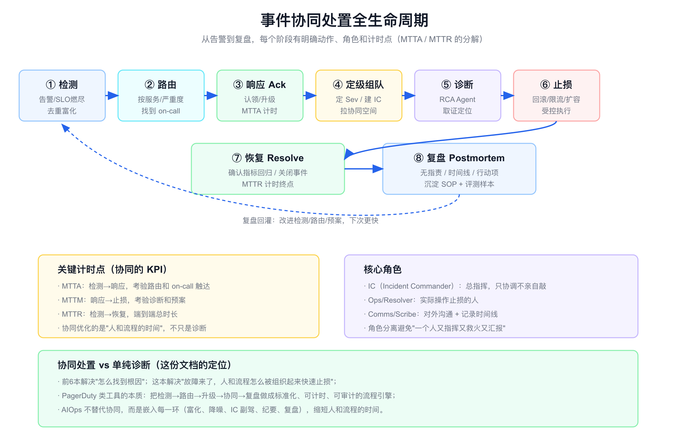
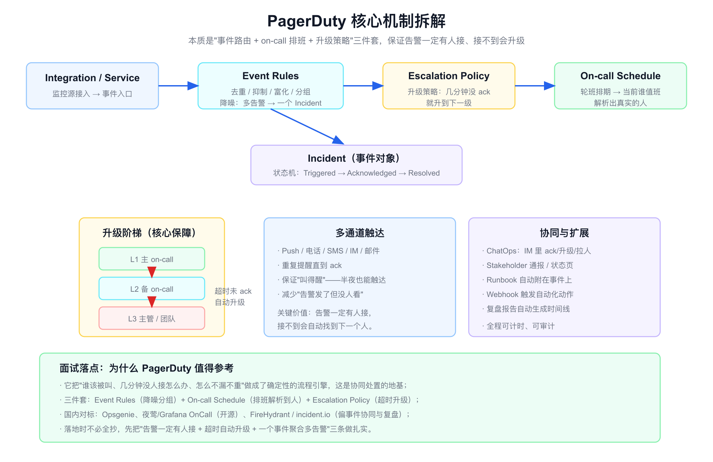
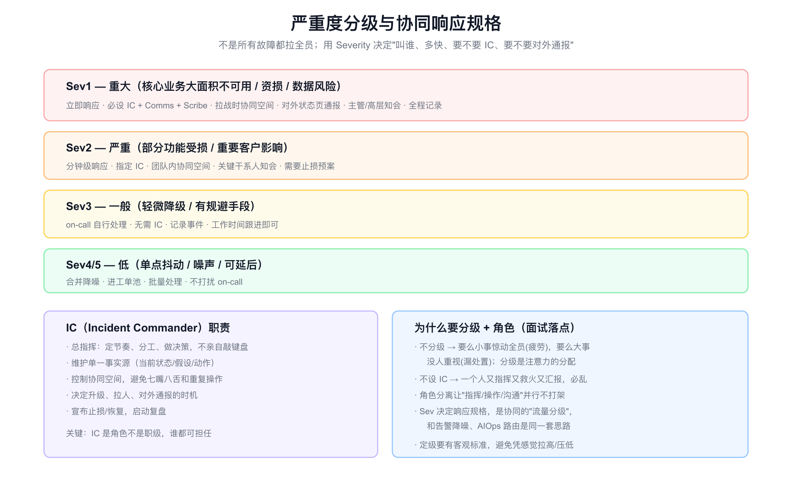
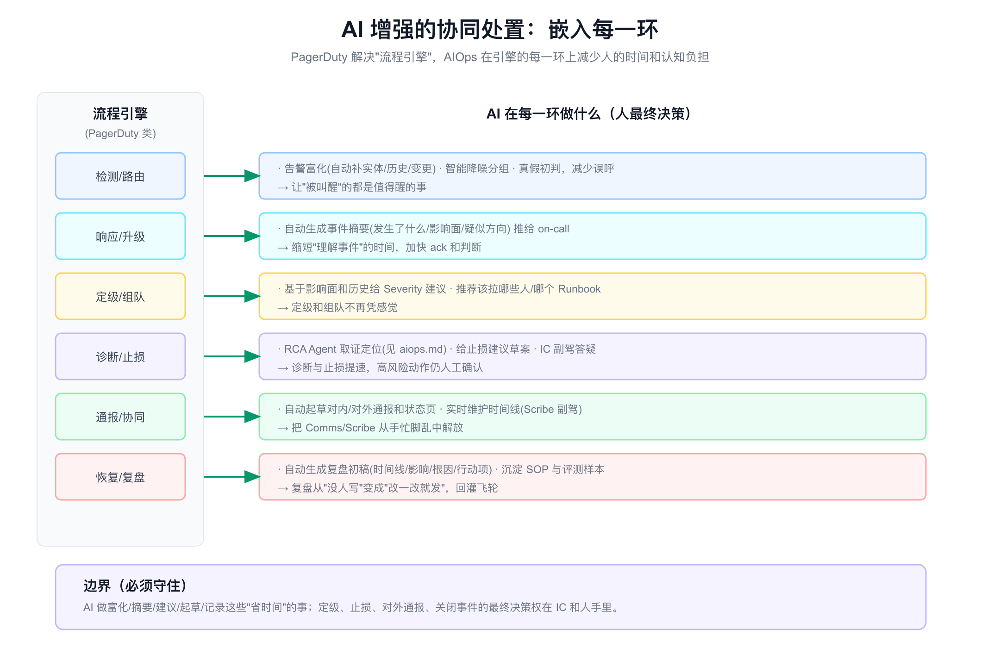

# 面试定位卡

- **技术点**：故障协同处置 / Incident Response / On-call 与升级 / Incident Commander / 复盘体系（对标 PagerDuty）
- **所属领域**：SRE、稳定性运营、事件管理、值班体系、ChatOps
- **经验等级**：`theory_industry_benchmarking`（对标 PagerDuty 等产品 + 告警治理/排障的相邻经验，没有亲手建过完整事件协同平台）
- **面试价值**：把前几本的"诊断"延伸到"组织怎么被快速组织起来止损"。回答"故障来了，除了找根因，人和流程怎么协同"。体现你懂稳定性不只是技术，还有运营和流程。
- **常见考法**：故障协同怎么做;PagerDuty 解决什么;on-call 排班和升级策略怎么设计;为什么要 Incident Commander;严重度怎么分级;MTTA/MTTR 怎么拆;复盘为什么要无指责;AI 怎么嵌入协同。
- **适合挂钩项目**：告警治理、值班体系、SRE 平台、稳定性运营、ChatOps、复盘体系。
- **不适合夸大的地方**：不能说我建了完整事件协同平台、做了多少 MTTR 改善;不能编造值班规模、事件量、升级命中率;PagerDuty 能力是对标理解,不是亲手实现。

# 经验边界

我没有从零建过 PagerDuty 那样的完整事件协同平台。相邻经验是告警治理、参与值班和排障、参与复盘,理解告警从触发到有人接到止损的真实流程和痛点。对 PagerDuty 的机制,我做的是产品对标和落地设计分析。

可以安全表达的是：我理解故障协同的全生命周期、PagerDuty 三件套（事件路由、on-call 排班、升级策略）解决什么、严重度分级和 IC 角色为什么必要、复盘怎么做,以及 AIOps 如何嵌入每一环。

不能表达的是：我建设了事件协同平台、把 MTTR 降了多少、管理了多少人的值班、升级策略覆盖率多少。这些需要真实生产归属和数据。

# 三十秒回答

故障协同处置解决的是"故障来了，人和流程怎么被快速组织起来止损"，和找根因是两件事。它的全生命周期是检测、路由、响应、定级组队、诊断、止损、恢复、复盘,每一环有动作、角色和计时点。

PagerDuty 的本质是把这套流程做成确定性引擎,核心是三件套:Event Rules 做去重降噪把多告警聚成一个事件,On-call Schedule 把排班解析到当前值班的人,Escalation Policy 保证几分钟没人 ack 就自动升级到下一级,配合多通道触达保证"叫得醒"。再往上是严重度分级（决定叫谁、多快、要不要 IC 和对外通报）和 Incident Commander 角色（总指挥只协调不亲自敲,和操作、沟通角色分离）。

AIOps 不替代协同,而是嵌入每一环:告警富化降噪、事件摘要、定级建议、RCA 取证、通报起草、复盘初稿。但定级、止损、对外通报、关闭事件的最终决策权在人。一句话:PagerDuty 解决流程引擎,AIOps 减少人和流程的时间。



# 为什么需要它

- **没有它之前的问题**：告警发了不一定有人接,半夜叫不醒;一个故障几十条告警刷屏分不清主次;故障来了拉一堆人七嘴八舌、重复操作;复盘没人写、经验流失。
- **它的解决方式**：用流程引擎保证告警一定有人接、超时自动升级、多告警聚成一个事件;用分级和角色把协同组织起来;用复盘沉淀经验。
- **它引入的新问题**：值班疲劳、升级策略要维护、分级标准要客观、复盘要落实行动项。
- **必须关注的场景**：半夜告警触达、大故障多团队协同、严重度误判、跨团队责任不清、复盘流于形式。

# 它解决什么问题

- **告警发了没人接**
  - **对应能力**：on-call 排班 + 多通道触达 + 超时升级。
  - **面试表达**：协同的第一保障是"告警一定有人接,接不到自动找下一个人"。

- **故障刷屏分不清主次**
  - **对应能力**：Event Rules 去重降噪,多告警聚成一个 Incident。
  - **面试表达**：协同前要先把告警收敛成事件,否则人被淹没。

- **小事惊动全员/大事没人重视**
  - **对应能力**：严重度分级,按 Sev 决定响应规格。
  - **面试表达**：分级是注意力的分配,和告警降噪一个思路。

- **现场乱、重复操作**
  - **对应能力**：Incident Commander + 角色分离。
  - **面试表达**：IC 是总指挥不亲自敲,指挥、操作、沟通并行不打架。

- **经验流失、同样的坑反复踩**
  - **对应能力**：无指责复盘 + SOP 沉淀。
  - **面试表达**：复盘要无指责、出行动项、回灌流程和知识。

# 核心概念表

- **Incident（事件）**
  - **一句话定义**：把一个或多个相关告警聚合成的、有状态机的处置对象。
  - **解决的问题**：告警是信号,事件才是协同单元。
  - **追问点**：告警怎么聚成事件;状态机有哪些态;何时关闭。

- **On-call Schedule（排班）**
  - **一句话定义**：轮班排期,把"该叫谁"解析成当前值班的具体人。
  - **解决的问题**：告警要找到真实的人,而不是发到群里没人认领。
  - **追问点**：轮转怎么排;交接怎么做;临时换班怎么办。

- **Escalation Policy（升级策略）**
  - **一句话定义**：几分钟没 ack 就自动升级到下一级（备班、主管）。
  - **解决的问题**：保证不会因为一个人没接就漏处置。
  - **追问点**：升级阶梯怎么定;升级太频繁怎么办;升到顶还没人呢。

- **Event Rules（事件规则）**
  - **一句话定义**：去重、抑制、富化、分组,把多告警聚成一个事件。
  - **解决的问题**：告警刷屏、噪声。
  - **追问点**：和告警降噪关系;富化补什么;分组按什么键。

- **Severity（严重度）**
  - **一句话定义**：按影响面分级（Sev1-5）,决定响应规格。
  - **解决的问题**：注意力分配,小事不惊动全员、大事必重视。
  - **追问点**：分级标准怎么定;谁定级;定错了怎么纠。

- **Incident Commander（IC）**
  - **一句话定义**：事件总指挥,定节奏分工做决策,不亲自操作。
  - **解决的问题**：避免一个人又指挥又救火又汇报。
  - **追问点**：IC 和职级关系;职责边界;怎么培养。

- **MTTA / MTTM / MTTR**
  - **一句话定义**：平均响应/止损/恢复时间,协同的核心 KPI。
  - **解决的问题**：把"协同快不快"量化。
  - **追问点**：怎么拆解;哪段最该优化;和诊断时间区别。

- **Blameless Postmortem（无指责复盘）**
  - **一句话定义**：复盘对事不对人,产出时间线、根因、行动项。
  - **解决的问题**：让人敢说真话,经验能沉淀。
  - **追问点**：为什么无指责;行动项怎么落实;怎么防形式化。

# 原理模型

故障协同处置可以分成三层理解。

- **引擎层**：PagerDuty 三件套——Event Rules（降噪分组）、On-call Schedule（排班解析到人）、Escalation Policy（超时升级），加多通道触达，保证告警一定有人接、不漏不重。
- **组织层**：严重度分级决定响应规格，IC + 操作 + 沟通角色分离，协同空间（战时会议/IM 频道）作为单一事实源。
- **闭环层**：MTTA/MTTM/MTTR 计时衡量、无指责复盘沉淀、行动项回灌改进检测路由预案。

AIOps 横向嵌入这三层的每一环，减少人的时间，但不夺走决策权。

# 关键机制

## 事件聚合与路由

- **问题**：一个故障会产生几十上百条告警，发到群里要么刷屏要么没人认领。
- **工作方式**：Event Rules 先去重、抑制、富化、分组，把相关告警聚成一个 Incident（带状态机 Triggered→Acknowledged→Resolved）；再按服务和严重度路由到对应的 on-call。
- **权衡**：聚合太松还是刷屏，太紧会把不同故障合并掩盖；富化依赖实体和变更数据（见 [aiops-observability-foundation.md](./aiops-observability-foundation.md)）。
- **追问回答**：协同的前提是先把告警收敛成事件，这一步和告警降噪是同一套能力（见 [aiops-classic-algorithms.md](./aiops-classic-algorithms.md)），只是输出对象从"少量告警"变成"一个可协同的事件"。

## On-call 排班与升级

- **问题**：告警要找到真实的人，且不能因为一个人没接就漏掉。
- **工作方式**：On-call Schedule 把轮班排期解析成当前值班人；Escalation Policy 设升级阶梯（L1 主 on-call → L2 备班 → L3 主管/团队），超时未 ack 自动升级；多通道触达（Push/电话/SMS/IM）重复提醒直到 ack。
- **权衡**：升级太快会过度打扰备班，太慢会延误；排班要考虑交接、临时换班、跟随日出（follow-the-sun）。
- **追问回答**：核心价值是"告警一定有人接，接不到会自动找到下一个人"，这是把"叫醒"做成确定性而不是靠运气。半夜能不能叫醒人，直接决定 MTTA。



## 严重度分级

- **问题**：所有故障一视同仁，要么小事惊动全员（疲劳），要么大事没人重视（漏处置）。
- **工作方式**：按影响面定 Sev1-5，每级有响应规格——Sev1 立即响应、必设 IC+Comms+Scribe、拉战时空间、对外状态页通报；Sev2 分钟级、指定 IC；Sev3 on-call 自处理；Sev4/5 合并降噪进工单池。
- **权衡**：定级要有客观标准（影响范围、资损、数据风险），避免凭感觉拉高或压低；定级可随事态升降级。
- **追问回答**：分级是注意力的分配，和告警降噪、AIOps 路由是同一思路——把有限的响应资源对齐到真正重要的事。



## Incident Commander 与角色分离

- **问题**：故障现场一个人又要指挥、又要敲命令止损、又要对外汇报，必然顾此失彼、重复操作。
- **工作方式**：IC 是总指挥，定节奏、分工、做决策，维护单一事实源（当前状态/假设/动作），不亲自敲键盘；Ops/Resolver 实际操作；Comms/Scribe 对外沟通和记录时间线。三个角色并行。
- **权衡**：小故障不必全套，按 Sev 决定；IC 是角色不是职级，谁都可担任，要靠平时演练培养。
- **追问回答**：角色分离让指挥、操作、沟通互不打架，IC 控制协同空间避免七嘴八舌，这是大故障不乱的关键。

## 复盘与闭环

- **问题**：故障处置完就散了，经验流失，同样的坑反复踩。
- **工作方式**：无指责复盘，对事不对人，产出时间线、影响面、根因、行动项；行动项要有 owner 和截止；沉淀成 SOP 和评测样本（见 [aiops-evaluation.md](./aiops-evaluation.md)），回灌改进检测、路由、预案。
- **权衡**：复盘容易流于形式，关键是行动项真落实、有跟踪；无指责不等于不追责，而是让人敢讲真实经过。
- **追问回答**：复盘是协同闭环的最后一环，也是数据飞轮（见 [aiops-frontier.md](./aiops-frontier.md)）的知识来源。无指责是为了拿到真相，行动项闭环是为了真的变好。

## AI 增强协同（嵌入每一环）

- **问题**：流程引擎解决了"有没有人接、怎么升级"，但人在每一环仍有大量理解、沟通、记录的认知负担。
- **工作方式**：检测路由环节 AI 做告警富化、智能降噪、真假初判；响应环节自动生成事件摘要推给 on-call；定级组队环节给 Severity 建议和 Runbook/拉人推荐；诊断止损环节 RCA Agent 取证（见 [aiops.md](./aiops.md)）+ 止损建议草案 + IC 副驾答疑；通报协同环节自动起草对内外通报、实时维护时间线（Scribe 副驾）；复盘环节自动生成初稿。
- **权衡**：AI 做"省时间"的事，定级、止损、对外通报、关闭事件的最终决策权必须在 IC 和人手里。
- **追问回答**：我会强调 AI 嵌入协同的边界——富化、摘要、建议、起草、记录这些减负的事让 AI 做，决策和承担责任的事留给人，这和 RCA 的"受控执行"一脉相承。



# 横向对比

- **告警平台 vs 事件协同平台**
  - 告警平台解决"发现和通知单条告警"；事件协同平台解决"聚合成事件、找到人、升级、组织协同、复盘"。

- **发群里 vs PagerDuty 式路由**
  - 发群靠人自觉认领，会漏会重；PagerDuty 路由到具体 on-call、超时自动升级，确定性强。

- **不分级 vs 严重度分级**
  - 不分级要么疲劳要么漏处置；分级把响应规格对齐影响面。

- **无 IC vs 有 IC**
  - 无 IC 现场乱、重复操作；有 IC 指挥/操作/沟通分离，大故障不乱。

- **PagerDuty vs Opsgenie vs 开源（夜莺/Grafana OnCall）vs incident.io/FireHydrant**
  - PagerDuty/Opsgenie 强在 on-call 和升级引擎；Grafana OnCall、夜莺偏开源可自建告警值班；incident.io、FireHydrant 偏事件协同、ChatOps 和复盘。选型看是要"值班升级引擎"还是"协同复盘体验"，以及自建还是 SaaS。

- **协同处置 vs 诊断（RCA）**
  - 诊断回答"为什么坏"；协同回答"人和流程怎么快速止损"。两者配合，协同优化人和流程的时间，诊断优化定位的时间。

# 业界做法对标

- **PagerDuty**
  - 把事件路由、on-call 排班、升级策略做成行业标杆，强调"告警一定有人接、超时自动升级"，并扩展到 ChatOps、Runbook 自动化、状态页、复盘。

- **Opsgenie（Atlassian）**
  - 类似定位，强排班和升级，和 Jira/Confluence 生态打通。

- **incident.io / FireHydrant**
  - 偏"事件协同操作系统"，强 ChatOps（Slack 里开事件、定角色、记时间线）、严重度流程、自动复盘，是近年事件管理的新范式。

- **Grafana OnCall / 夜莺**
  - 开源可自建的告警值班和 on-call，适合不想用 SaaS、要数据自主的团队，可对接国内 IM。

- **Google SRE 事件管理**
  - IC 制度、角色分离、无指责复盘的方法论源头，强调事件指挥体系（借鉴消防 ICS）。

- **AIOps 增强方向**
  - 行业在把 AI 嵌入协同：自动事件摘要、严重度建议、通报起草、复盘初稿，对应端到端智能诊断（见 [aiops-frontier.md](./aiops-frontier.md)）。

# 典型业务场景

- **半夜核心服务告警**：路由到 on-call，电话触达，超时升级到备班。
- **大促大故障**：定 Sev1，设 IC，拉战时空间，分工止损，对外状态页通报。
- **多团队连锁故障**：IC 协调多个 resolver，维护单一事实源避免重复操作。
- **告警风暴**：Event Rules 聚成一个事件，避免几十人各自被叫。
- **复盘**：无指责复盘出行动项，回灌检测和预案。
- **AI 减负**：自动摘要、定级建议、通报起草、复盘初稿。

# 如果让我落地，我会怎么设计

- **第一步：先做"有人接 + 会升级"**
  - 接入告警源，建 on-call 排班和升级策略，多通道触达。这是协同的地基，优先级最高。

- **第二步：告警聚合成事件**
  - 用去重抑制分组把多告警聚成 Incident，避免刷屏（复用告警降噪能力）。

- **第三步：严重度分级**
  - 定客观的 Sev 标准和每级响应规格，先把"小事不惊动全员、大事必重视"做对。

- **第四步：角色与协同空间**
  - Sev1/2 引入 IC 和角色分离，固定协同空间作为单一事实源，配 ChatOps。

- **第五步：复盘闭环**
  - 无指责复盘模板，行动项带 owner 和截止，沉淀 SOP 和评测样本。

- **第六步：AI 嵌入**
  - 逐环加 AI 减负：富化、摘要、定级建议、RCA、通报起草、复盘初稿，决策权留人。

# 排障路径

如果协同处置效果不好，我会按下面顺序排查。

- **症状：MTTA 高，告警没人接**
  - **假设**：排班缺人、触达不到、升级太慢。
  - **验证**：看告警是否路由到值班人、触达通道是否生效、升级是否触发。
  - **指标**：ack 率、平均 ack 时间、升级触发率。
  - **结论**：补排班和升级策略，加电话等强触达。

- **症状：一个故障一堆人被叫**
  - **假设**：缺事件聚合，多告警各自触发。
  - **验证**：看告警是否聚成一个 Incident。
  - **指标**：单事件告警数、重复呼叫数。
  - **结论**：建 Event Rules 去重分组，先聚合再路由。

- **症状：现场乱、重复操作**
  - **假设**：没设 IC，角色不分。
  - **验证**：看大故障是否有总指挥和单一事实源。
  - **指标**：重复操作次数、决策延迟。
  - **结论**：Sev1/2 强制设 IC，角色分离。

- **症状：定级忽高忽低**
  - **假设**：分级标准模糊，凭感觉。
  - **验证**：看 Sev 标准是否客观、是否有人复核。
  - **指标**：定级返工率、误级率。
  - **结论**：定客观分级标准，定级可升降级但要记录。

- **症状：复盘流于形式**
  - **假设**：有指责氛围、行动项不落实。
  - **验证**：看复盘是否拿到真实经过、行动项是否跟踪闭环。
  - **指标**：行动项闭环率、复发率。
  - **结论**：坚持无指责拿真相，行动项带 owner 和截止并跟踪。

# 未来规划和 Roadmap

- **阶段一：值班升级引擎**：on-call 排班 + 升级 + 多通道触达。
- **阶段二：事件聚合**：去重分组，多告警聚成事件。
- **阶段三：分级与角色**：Severity 标准 + IC + 协同空间。
- **阶段四：复盘闭环**：无指责复盘 + 行动项跟踪 + SOP 沉淀。
- **阶段五：AI 减负**：富化、摘要、定级建议、通报与复盘起草。
- **阶段六：受控自动化**：低风险动作自动化（静默、扩容预案），高风险人工确认（见 [aiops-frontier.md](./aiops-frontier.md)）。

# 风险、边界和误区

- **误区：协同就是建个群**
  - 正确理解：群解决不了"一定有人接、超时升级、不漏不重"，要流程引擎。

- **误区：所有故障都拉全员**
  - 正确理解：要分级，按 Sev 分配注意力，否则疲劳或漏处置。

- **误区：IC 是最高职级**
  - 正确理解：IC 是角色不是职级，谁都可担任，靠演练培养。

- **误区：无指责复盘就是不追责**
  - 正确理解：无指责是为拿真相，让人敢讲，但行动项要落实。

- **误区：AI 能自动处置故障**
  - 正确理解：AI 做减负的事，定级、止损、通报、关闭决策权在人。

- **误区：协同和诊断是一回事**
  - 正确理解：诊断优化定位时间，协同优化人和流程时间，要分开做。

# 和项目的安全连接

- **能怎么说**
  - 我有告警治理、值班、排障、复盘的相邻经验，理解故障从触发到有人接到止损的真实流程和痛点。
  - 我对标 PagerDuty 等产品，能讲清楚事件协同的全生命周期、三件套、分级和 IC 角色、复盘闭环。
  - 我能讲如果落地怎么设计，以及 AI 如何嵌入协同每一环、边界在哪。

- **不能怎么说**

| 风险说法 | 问题 | 安全替代表达 |
|---|---|---|
| 我建了事件协同平台 | 没有生产归属 | 我对标 PagerDuty，能讲如果落地怎么设计 |
| 我们把 MTTR 降了 X% | 编造数据 | MTTR 改善要靠真实计时，我能讲怎么拆解优化 |
| 我管理了全公司值班 | 夸大范围 | 我有值班和告警治理的相邻经验 |
| AI 自动处置了故障 | 夸大自动化 | AI 做减负，决策权在 IC 和人 |
| 我们升级策略覆盖 100% | 编造指标 | 覆盖率需实测，我能讲升级阶梯怎么设计 |

# 面试追问树

```text
故障来了，怎么协同处置？
├─ 全生命周期
│  ├─ 检测→路由→响应→定级→诊断→止损→恢复→复盘
│  └─ MTTA/MTTM/MTTR 计时
├─ PagerDuty 三件套
│  ├─ Event Rules（去重分组聚成事件）
│  ├─ On-call Schedule（排班解析到人）
│  └─ Escalation Policy（超时升级）+ 多通道触达
├─ 组织
│  ├─ Severity 分级（决定响应规格）
│  ├─ IC（总指挥不亲自敲）
│  └─ 角色分离（操作/沟通/记录）
├─ 复盘
│  ├─ 无指责拿真相
│  ├─ 行动项带 owner 和截止
│  └─ 沉淀 SOP + 评测样本
└─ AI 增强
   ├─ 富化/摘要/定级建议/通报/复盘起草
   └─ 决策权留人
```

# 高频 Q&A

## 故障协同怎么做？

按全生命周期组织：检测、路由、响应、定级组队、诊断、止损、恢复、复盘。核心是保证告警一定有人接、超时自动升级、多告警聚成一个事件，再用严重度分级和 IC 角色把人组织起来，最后无指责复盘闭环。

## PagerDuty 解决什么？

把事件路由、on-call 排班、升级策略做成确定性流程引擎，保证告警一定有人接、几分钟没 ack 自动升级、多告警聚成一个事件。本质是把"叫醒对的人"从靠运气变成靠流程。

## on-call 排班和升级策略怎么设计？

排班把轮班解析成当前值班人，考虑交接、临时换班、follow-the-sun；升级策略设阶梯（主 on-call→备班→主管），超时未 ack 自动升级，配多通道触达重复提醒。目标是不会因一个人没接就漏处置。

## 为什么要 Incident Commander？

避免一个人又指挥又救火又汇报。IC 是总指挥，定节奏分工做决策、维护单一事实源，不亲自敲键盘；操作和沟通由别人并行。IC 是角色不是职级，谁都可担任。大故障不乱的关键。

## 严重度怎么分级？

按影响面定 Sev1-5，每级有响应规格：Sev1 立即响应、设 IC、对外通报；Sev2 分钟级、指定 IC；Sev3 on-call 自处理；Sev4/5 合并进工单池。分级要有客观标准，避免凭感觉。本质是注意力分配。

## MTTA 和 MTTR 怎么拆？

MTTA 是检测到响应，考验路由和触达；MTTM 是响应到止损，考验诊断和预案；MTTR 是检测到恢复，端到端总时长。协同优化的主要是 MTTA 和"人和流程的时间"，诊断优化定位时间。

## 复盘为什么要无指责？

有指责氛围人就不敢讲真实经过，拿不到真相就改不对。无指责对事不对人，让人敢说，产出时间线、根因、行动项。但无指责不等于不追责，行动项要带 owner 和截止并跟踪闭环。

## AI 怎么嵌入协同？

每一环减负：告警富化降噪、事件摘要、Severity 建议、RCA 取证、通报起草、复盘初稿。边界是 AI 做省时间的事，定级、止损、对外通报、关闭事件的决策权在 IC 和人。和受控执行一脉相承。

## PagerDuty 和 incident.io 有什么区别？

PagerDuty 强在 on-call 和升级引擎（保证有人接、会升级）；incident.io/FireHydrant 偏事件协同操作系统，强 ChatOps（IM 里开事件、定角色、记时间线）和自动复盘。前者偏值班升级，后者偏协同复盘体验。

## 国内落地用什么？

可对标 Opsgenie，或用开源的夜莺、Grafana OnCall 自建告警值班，对接国内 IM。选型看要值班升级引擎还是协同复盘体验、自建还是 SaaS、数据是否要自主。

# 三档背诵版

## 15 秒版

故障协同解决"人和流程怎么快速止损"，不是找根因。PagerDuty 三件套：Event Rules 聚事件、On-call 排班解析到人、Escalation 超时升级，加分级和 IC 角色。AI 嵌入每一环减负，决策权留人。

## 45 秒版

这块对标 PagerDuty，是产品对标加相邻经验。故障协同的全生命周期是检测、路由、响应、定级、诊断、止损、恢复、复盘。PagerDuty 的本质是流程引擎，三件套保证告警一定有人接、超时自动升级、多告警聚成一个事件。再往上用严重度分级决定响应规格，用 Incident Commander 角色让指挥、操作、沟通分离，大故障不乱。复盘要无指责拿真相、行动项闭环。AIOps 不替代协同，而是嵌入每一环做富化、摘要、定级建议、RCA、通报和复盘起草，但定级、止损、对外通报的决策权在人。它优化的是人和流程的时间，和诊断优化定位时间互补。

## 2 分钟版

我会先把协同和诊断分开：前面准备的几本解决怎么找根因，这本解决故障来了人和流程怎么被组织起来止损。

全生命周期是检测、路由、响应、定级组队、诊断、止损、恢复、复盘，每环有动作、角色和计时点，MTTA 看路由和触达、MTTM 看诊断和预案、MTTR 是端到端。

PagerDuty 值得参考是因为它把协同做成了确定性引擎，三件套：Event Rules 去重分组把多告警聚成一个事件，On-call Schedule 把排班解析成当前值班的具体人，Escalation Policy 保证几分钟没 ack 就自动升级到备班、主管，配多通道触达保证半夜叫得醒。核心价值是告警一定有人接，接不到自动找下一个人。

组织层用严重度分级决定叫谁、多快、要不要 IC 和对外通报，Sev1 设 IC、拉战时空间、状态页通报，Sev4/5 合并进工单池，分级是注意力的分配。IC 是总指挥只协调不亲自敲，和操作、沟通角色分离，维护单一事实源避免七嘴八舌和重复操作，IC 是角色不是职级。最后无指责复盘拿真相、出行动项、沉淀 SOP 和评测样本，回灌改进。

AIOps 嵌入每一环减负：富化、摘要、定级建议、RCA 取证、通报起草、复盘初稿，但定级、止损、对外通报、关闭事件的决策权必须在 IC 和人手里，这和受控执行一脉相承。我会声明这是对标 PagerDuty 的落地设计加告警值班复盘的相邻经验，不是我亲手建过完整协同平台。

# 参考资料

- PagerDuty：事件路由、on-call 排班、升级策略、ChatOps、复盘
- Opsgenie（Atlassian）、incident.io、FireHydrant：事件协同与复盘
- Grafana OnCall、夜莺：开源告警值班与 on-call
- Google SRE：Incident Command System、角色分离、无指责复盘
- 配套：[aiops.md](./aiops.md)（RCA 诊断）、[aiops-classic-algorithms.md](./aiops-classic-algorithms.md)（告警降噪）、[aiops-frontier.md](./aiops-frontier.md)（端到端闭环/受控执行）、[aiops-evaluation.md](./aiops-evaluation.md)（复盘沉淀评测样本）、[aiops-observability-foundation.md](./aiops-observability-foundation.md)（事件富化数据）

# 面试前检查清单

- 能否说清协同和诊断的区别，以及全生命周期八阶段。
- 能否讲 PagerDuty 三件套及各自解决什么。
- 能否讲 on-call 排班和升级策略怎么设计。
- 能否讲严重度分级和响应规格、为什么要 IC 和角色分离。
- 能否讲 MTTA/MTTM/MTTR 拆解和无指责复盘。
- 能否讲 AI 怎么嵌入协同每一环、边界在哪。
- 能否声明这是对标 PagerDuty 的设计加相邻经验，不是亲手建过平台。
