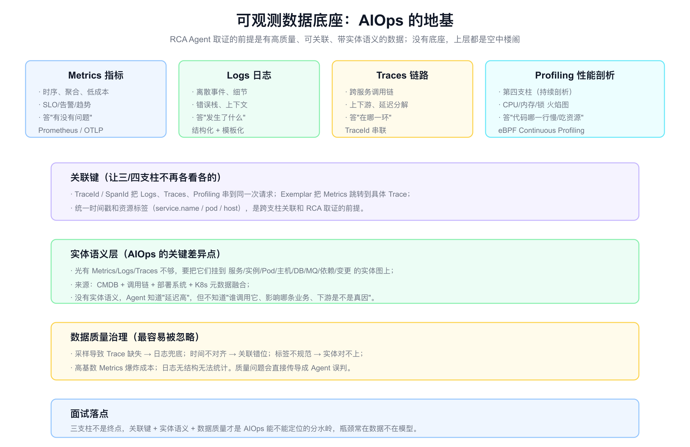
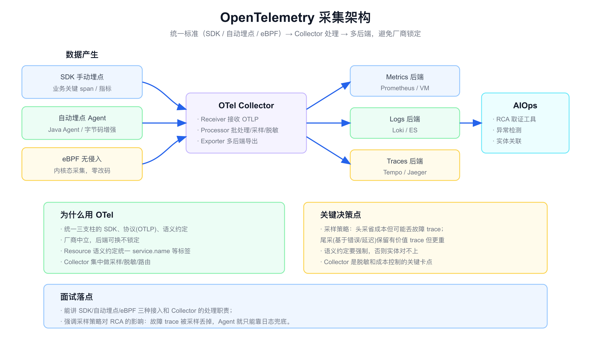
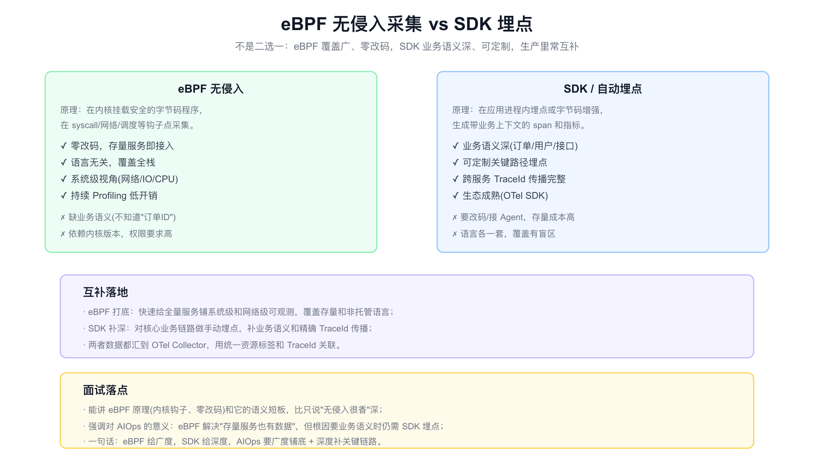
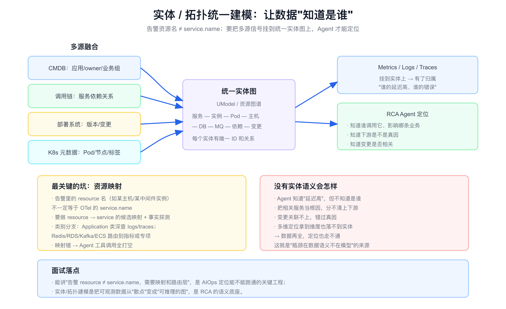

# 面试定位卡

- **技术点**：可观测数据底座 / OTel 三支柱 / eBPF 无侵入采集 / Continuous Profiling / 实体拓扑建模
- **所属领域**：可观测性、APM、数据采集、OpenTelemetry、SRE 数据治理
- **经验等级**：`adjacent_production_experience`（可观测和指标排障是我相对最实在的相邻经验，但 eBPF/Profiling/实体建模偏理论对标）
- **面试价值**：补 [aiops.md](./aiops.md) 默认"数据已接入"的盲区。回答"RCA Agent 取证的数据从哪来、质量怎么保证、为什么有时定位不了"。这是 AIOps 最容易被忽略但最决定成败的一层。
- **常见考法**：可观测三支柱区别;Metrics/Logs/Traces 怎么关联;eBPF 和 SDK 埋点区别;采样对故障定位的影响;为什么数据全了还定位不准;告警 resource 和 service.name 关系;实体拓扑怎么建。
- **适合挂钩项目**：APM/可观测平台、监控告警、SRE 平台、K8s 排障。
- **不适合夸大的地方**：不能说我从零建了 eBPF 采集平台、实现了实体图谱;不能编造接入率、数据量、成本数据;Profiling/eBPF 要说清楚是对标理解。

# 经验边界

可观测和指标排障是我相对最实在的相邻经验：我用过 Metrics/Logs/Traces 排障,理解三支柱怎么配合,做过告警和监控。但 eBPF 采集、Continuous Profiling、实体图谱建模,我更多是对标理解,没有亲手从零建设。

可以安全表达的是：我理解可观测数据底座的结构,三支柱各答什么问题、怎么关联、eBPF 和 SDK 的取舍、采样的影响,以及为什么实体语义是 AIOps 定位的分水岭。

不能表达的是：我建设了 eBPF 平台、实现了资源图谱、接入率多少、数据规模多少。这些需要真实生产归属。

# 三十秒回答

可观测数据底座是 AIOps 的地基,RCA Agent 能不能定位,先取决于数据够不够、能不能关联、有没有实体语义。三支柱里 Metrics 答"有没有问题"、Logs 答"发生了什么"、Traces 答"在哪一环",再加上 Profiling 作为第四支柱答"代码哪行慢"。

但三支柱不是终点。真正决定 AIOps 成败的是三件事：一是关联键,用 TraceId 把日志、链路、Profiling 串到同一次请求,用统一时间戳和资源标签跨支柱关联;二是实体语义层,把信号挂到服务/实例/Pod/DB/依赖/变更的实体图上,否则 Agent 知道延迟高却不知道是谁;三是数据质量,采样丢 trace、时间不对齐、标签不规范都会直接传导成误判。

采集侧 eBPF 给广度（零改码覆盖存量）、SDK 给深度（业务语义）,OTel 统一标准避免锁定。一句话:瓶颈常在数据不在模型。



# 为什么需要它

- **没有它之前的问题**：RCA Agent 假设数据已接入,但现实是数据残缺、不关联、没实体语义,Agent 取证全打空。
- **它的解决方式**：用 OTel 统一采集三支柱,用 eBPF 补存量覆盖,用关联键和实体图把散点连成可推理的结构。
- **它引入的新问题**：采样、高基数、成本、脱敏、标签规范、内核依赖都要治理。
- **必须关注的场景**：故障 trace 被采样丢失、告警资源映射不到服务、跨支柱时间错位、存量服务无埋点。

# 它解决什么问题

- **只有指标,看不到细节**
  - **对应能力**：三支柱配合,指标发现、日志看细节、链路定位环节。
  - **面试表达**：三支柱各答一类问题,缺一个就有盲区。

- **三支柱各看各的**
  - **对应能力**：TraceId 串联 + 统一时间戳和资源标签 + Exemplar。
  - **面试表达**：关联键是跨支柱取证的前提,不能各存各的。

- **存量服务没埋点**
  - **对应能力**：eBPF 无侵入,零改码覆盖全栈。
  - **面试表达**：eBPF 解决"存量也有数据",但缺业务语义。

- **数据全了还定位不准**
  - **对应能力**：实体/拓扑语义层,把信号挂到实体图。
  - **面试表达**：没有实体语义,数据再全也只是散点。

- **故障 trace 找不到**
  - **对应能力**：采样策略治理,尾采保留有价值 trace,日志兜底。
  - **面试表达**：采样省成本但可能丢故障 trace,要权衡。

# 核心概念表

- **三支柱 / Three Pillars**
  - **一句话定义**：Metrics、Logs、Traces,分别答有没有问题、发生了什么、在哪一环。
  - **解决的问题**：从不同粒度观测系统。
  - **追问点**：各自成本和适用;怎么配合排障;谁先看。

- **Continuous Profiling**
  - **一句话定义**：持续低开销采集 CPU/内存/锁的火焰图,定位到代码行,常称第四支柱。
  - **解决的问题**：链路定位到服务后,还要知道代码哪里慢/吃资源。
  - **追问点**：和一次性 profiling 区别;eBPF 怎么低开销采。

- **关联键 / TraceId、Exemplar**
  - **一句话定义**：用 TraceId/SpanId 串多支柱,用 Exemplar 从指标跳到具体 trace。
  - **解决的问题**：三支柱各看各的,无法跨支柱取证。
  - **追问点**：跨服务怎么传播;采样后 TraceId 断了怎么办。

- **OpenTelemetry / OTel**
  - **一句话定义**：厂商中立的可观测标准,统一 SDK、协议 OTLP、语义约定。
  - **解决的问题**：埋点和后端被厂商锁定、标签不统一。
  - **追问点**：Collector 职责;语义约定为什么重要。

- **eBPF**
  - **一句话定义**：在内核挂载安全字节码,在 syscall/网络等钩子点零改码采集。
  - **解决的问题**：存量服务和非托管语言的无侵入可观测。
  - **追问点**：原理;为什么缺业务语义;内核和权限限制。

- **资源映射 / resource → service.name**
  - **一句话定义**：把告警里的资源名映射到 OTel 的 service.name,并按类别路由。
  - **解决的问题**：告警资源名不等于服务名,映射错工具全打空。
  - **追问点**：怎么做候选映射和事实探测;非 Application 类怎么路由。

- **实体 / 拓扑图（UModel）**
  - **一句话定义**：把服务、实例、Pod、主机、DB、MQ、依赖、变更建成统一实体图。
  - **解决的问题**：让数据有归属、有关系,可推理。
  - **追问点**：数据从哪融合;拓扑不准怎么办。

- **采样 / Sampling**
  - **一句话定义**：头采（请求开始决定）省成本但可能丢故障;尾采（基于错误/延迟）保留有价值 trace 但重。
  - **解决的问题**：全量 trace 成本太高。
  - **追问点**：尾采怎么实现;采样丢了故障 trace 怎么办。

# 原理模型

可观测数据底座可以分成三层来理解,层层向上才能支撑 AIOps。

- **采集层**：SDK 手动埋点 + 自动埋点 Agent + eBPF 无侵入,数据汇到 OTel Collector 做批处理、采样、脱敏、路由。
- **关联层**：TraceId/SpanId 串多支柱,统一时间戳和资源标签,Exemplar 从指标跳 trace。
- **语义层**：把信号挂到实体/拓扑图,做 resource→service 映射和类别路由,让数据有归属可推理。

RCA Agent 在最上面消费:取证工具读这些数据,质量和语义直接决定定位能力。

# 关键机制

## 三支柱与第四支柱

- **问题**：单看一类数据有盲区——只有指标知道坏了不知道为什么,只有日志看不到全局。
- **工作方式**：Metrics 低成本时序,做 SLO/告警/趋势,答"有没有问题";Logs 离散事件细节,答"发生了什么";Traces 跨服务调用链,做延迟分解,答"在哪一环";Profiling 持续剖析,答"代码哪一行慢/吃资源"。
- **权衡**：Metrics 便宜但粗,Logs 细但贵且无结构难统计,Traces 强但有采样和传播成本,Profiling 深但需要 eBPF 支撑。
- **追问回答**：排障一般指标发现 → 链路定位环节 → 日志看细节 → 必要时 Profiling 看代码,四者是接力不是替代。

## 数据关联

- **问题**：三支柱各存各的,出问题时无法把日志、链路、指标对到同一次请求。
- **工作方式**：用 TraceId/SpanId 把 Logs、Traces、Profiling 串到同一请求;用 Exemplar 把 Metrics 的异常点跳转到具体 Trace;统一时间戳和资源标签（service.name/pod/host）。
- **权衡**：关联要求埋点规范和标签统一,采样后 TraceId 可能断,要日志兜底。
- **追问回答**：关联键和统一资源标签是跨支柱取证的前提,这也是 [aiops.md](./aiops.md) 里告警分析能围绕 TraceId 取证的基础。

## OTel 采集架构

- **问题**：埋点和后端容易被厂商锁定,标签不统一导致实体对不上。
- **工作方式**：OTel 统一 SDK、协议 OTLP、语义约定;数据由 SDK/自动埋点/eBPF 产生,汇到 Collector 做 Receiver 接收、Processor 批处理/采样/脱敏、Exporter 多后端导出;Resource 语义约定统一 service.name 等。
- **权衡**：采样策略是关键决策——头采省成本但可能丢故障 trace,尾采保留有价值 trace 但更重;Collector 是脱敏和成本控制的卡点。
- **追问回答**：我会强调采样对 RCA 的影响:故障 trace 被采样丢掉,Agent 就只能靠日志兜底,所以核心链路要尾采或提高采样。



## eBPF 无侵入 vs SDK 埋点

- **问题**：存量服务和非托管语言没埋点,但全量改码成本高。
- **工作方式**：eBPF 在内核挂载安全字节码,在 syscall/网络/调度钩子点采集,零改码、语言无关、系统级视角、低开销 Profiling,但缺业务语义、依赖内核版本;SDK/自动埋点在进程内生成带业务上下文的 span,语义深、可定制、TraceId 传播完整,但要改码、语言各一套。
- **权衡**：不是二选一,eBPF 给广度（铺存量）、SDK 给深度（核心链路业务语义）。
- **追问回答**：我会 eBPF 打底快速覆盖全量,SDK 补核心业务链路,数据都汇 OTel Collector 用统一标签和 TraceId 关联。一句话:eBPF 给广度,SDK 给深度。



## 实体与拓扑建模

- **问题**：可观测数据是散点,告警 resource 名不等于 service.name,Agent 知道延迟高却不知道是谁、影响谁。
- **工作方式**：融合 CMDB（应用/owner/业务组）、调用链（服务依赖）、部署系统（版本/变更）、K8s 元数据（Pod/节点/标签）建统一实体图;做 resource→service 候选映射和事实探测;按类别路由（Application 深查 logs/traces,Redis/RDS/Kafka/ECS 走指标或专项）。
- **权衡**：拓扑可能不准、映射可能错,映射错会让工具调用全打空。
- **追问回答**：这是 AIOps 定位能不能跑通的关键工程。没有实体语义,数据再全也只是散点,把相关服务当根因、变更关联不上——这正是"瓶颈在数据语义不在模型"的来源。



## 数据质量治理

- **问题**：采样丢 trace、时间不对齐、标签不规范、高基数爆炸、日志无结构,都会传导成 Agent 误判。
- **工作方式**：核心链路提高采样或尾采;统一时间源;强制资源标签规范;控制 Metrics 基数;日志结构化（见 [aiops-classic-algorithms.md](./aiops-classic-algorithms.md) 的 Drain 模板）。
- **权衡**：质量和成本是跷跷板,要按链路重要性分级投入。
- **追问回答**：我会把数据质量当 AIOps 的一等公民,因为质量问题会无声地变成诊断错误,且很难在上层发现。

# 横向对比

- **Metrics vs Logs vs Traces**
  - Metrics 便宜、聚合、答有没有;Logs 细节、贵、答发生了什么;Traces 跨服务、答在哪一环。互补不替代。

- **eBPF vs SDK 埋点**
  - eBPF 零改码、覆盖广、系统级但缺业务语义;SDK 语义深、可定制但要改码、语言各一套。广度 vs 深度。

- **头采 vs 尾采**
  - 头采省成本但可能丢故障 trace;尾采基于错误/延迟保留有价值 trace 但更重。核心链路倾向尾采。

- **有实体语义 vs 无实体语义**
  - 无语义数据是散点,定位走不通;有语义能推理上下游、影响面、变更关联。AIOps 的分水岭。

- **OTel vs 厂商私有 Agent**
  - OTel 中立、可换后端、标签统一;私有 Agent 开箱即用但锁定、迁移难。

- **三支柱 vs 加 Profiling**
  - 三支柱定位到服务/环节;Profiling 进一步定位到代码行和资源热点。

# 业界做法对标

- **OpenTelemetry**
  - 已成为可观测事实标准,统一三支柱采集和语义约定,Collector 集中处理,GenAI 语义约定还能覆盖 Agent 可观测（见 [aiops.md](./aiops.md) 的 AgentOps）。

- **eBPF 生态**
  - eBPF 用于无侵入 APM、网络可观测、Continuous Profiling,解决存量和多语言覆盖,是近年可观测最大趋势之一。

- **从 AIOps 到 AgentOps：实体语义**
  - 大厂强调可观测数据还不够,要服务、实例、Pod、DB、MQ、依赖、变更的结构化语义才能定位,对应实体/拓扑建模。

- **AIOps 告警分析 skill**
  - 本仓库 [aiops.md](./aiops.md) 的告警分析 skill 里,resource→service 映射、类别路由、TraceId 取证、采样兜底,都是数据底座工程在 RCA 里的直接体现。

# 典型业务场景

- **跨服务延迟排障**：指标发现 → 链路定位环节 → 日志看错误 → Profiling 看代码。
- **存量服务快速接入**：eBPF 零改码铺底覆盖。
- **故障 trace 保留**：核心链路尾采,保住有错误/高延迟的 trace。
- **告警资源定位**：resource→service 映射 + 类别路由。
- **影响面分析**：实体图查上下游和业务入口。
- **变更关联**：部署系统数据接入实体图,做变更与故障对齐。

# 如果让我落地,我会怎么设计

- **第一步：统一标准**
  - 用 OTel 统一三支柱采集和语义约定,强制 service.name 等资源标签规范。

- **第二步：eBPF 铺底 + SDK 补深**
  - eBPF 快速覆盖存量和多语言,核心业务链路用 SDK 补业务语义和 TraceId。

- **第三步：建关联**
  - TraceId 串多支柱,统一时间源,Exemplar 从指标跳 trace。

- **第四步：建实体图**
  - 融合 CMDB、调用链、部署、K8s 元数据,做 resource→service 映射和类别路由。

- **第五步：治理数据质量**
  - 核心链路尾采,控基数,日志结构化,标签校验。

- **第六步：暴露为 RCA 工具**
  - 把指标、日志、链路、Profiling、实体查询封装成只读工具,供 Agent 取证（衔接 [aiops.md](./aiops.md)）。

# 排障路径

如果 RCA 取证数据有问题,我会按下面顺序排查。

- **症状：Agent 查工具全是空结果**
  - **假设**：resource 没映射到 service.name,或类别不该查应用日志。
  - **验证**：先做 resource 候选映射和服务注册探测,按 category 决定是否深查。
  - **指标**：映射命中率、OTel 接入命中率、非 Application 误下钻次数。
  - **结论**：建映射和路由层,别让模型手写字符串裁剪。

- **症状：故障时找不到 trace**
  - **假设**：头采把故障 trace 丢了。
  - **验证**：看采样策略,核心链路是否尾采。
  - **指标**：错误 trace 保留率、采样率。
  - **结论**：核心链路尾采或提高采样,trace 缺失用日志的 TraceId 兜底。

- **症状：跨支柱对不上**
  - **假设**：时间不对齐或标签不统一。
  - **验证**：检查时间源和资源标签规范。
  - **指标**：时间偏差、标签规范率、关联成功率。
  - **结论**：统一时间源和标签,关联键强制。

- **症状：数据全但定位不准**
  - **假设**：缺实体语义,信号落不到实体。
  - **验证**：检查实体图覆盖、依赖关系准确性。
  - **指标**：实体覆盖率、拓扑准确率。
  - **结论**：补实体建模,把散点连成可推理的图。

- **症状：可观测成本失控**
  - **假设**：高基数 Metrics、全量 trace、日志冗余。
  - **验证**：看基数 Top、采样率、日志量。
  - **指标**：基数、存储成本、采样率。
  - **结论**：控基数 + 尾采 + 日志分级,按链路重要性投入。

# 未来规划和 Roadmap

- **阶段一：OTel 统一**：三支柱标准化,标签规范。
- **阶段二：eBPF + SDK 覆盖**：广度铺底 + 深度补关键链路。
- **阶段三：关联键**：TraceId 串联 + Exemplar + 统一时间。
- **阶段四：实体图**：多源融合 + resource 映射 + 路由。
- **阶段五：质量治理**：采样、基数、结构化、脱敏。
- **阶段六：工具化**：暴露为 RCA 只读工具,接 Agent。

# 风险、边界和误区

- **误区：接了三支柱就够了**
  - 正确理解：关联键、实体语义、数据质量才决定能不能定位。

- **误区：eBPF 能取代 SDK**
  - 正确理解：eBPF 缺业务语义,核心链路仍需 SDK 埋点,两者互补。

- **误区：采样无所谓**
  - 正确理解：头采可能丢故障 trace,核心链路要尾采或提高采样。

- **误区：数据越多越好**
  - 正确理解：高基数和冗余会爆成本,无结构日志无法统计,要治理。

- **误区：告警 resource 就是 service**
  - 正确理解：resource ≠ service.name,要映射和路由,否则工具全打空。

- **误区：定位不准是模型问题**
  - 正确理解：常常是数据语义和质量问题,瓶颈在数据不在模型。

# 和项目的安全连接

- **能怎么说**
  - 我有可观测和指标排障的相邻经验,理解三支柱怎么配合、怎么关联。
  - 我能讲清楚数据底座如何支撑 RCA：关联键、实体语义、采样、resource 映射。
  - 我能把可观测数据质量和 Agent 定位能力的因果关系讲清楚。

- **不能怎么说**

| 风险说法 | 问题 | 安全替代表达 |
|---|---|---|
| 我建了 eBPF 采集平台 | 没有生产归属 | 我理解 eBPF 原理和取舍,能讲如果落地怎么用 |
| 我们实现了实体图谱 | 偏对标理解 | 我理解实体建模的价值和多源融合思路 |
| 接入率/数据量 X | 编造数据 | 具体规模需实测,我能讲覆盖策略 |
| eBPF 取代了所有埋点 | 不准确 | eBPF 给广度,SDK 给深度,互补 |
| 数据全就能定位 | 忽略语义 | 还要实体语义和质量,否则是散点 |

# 面试追问树

```text
RCA 的数据从哪来、为什么有时定位不了？
├─ 三支柱 + Profiling
│  ├─ Metrics 有没有 / Logs 发生什么 / Traces 哪一环
│  └─ Profiling 代码哪行慢
├─ 关联
│  ├─ TraceId 串多支柱
│  ├─ Exemplar 指标跳 trace
│  └─ 统一时间戳和资源标签
├─ 采集
│  ├─ SDK 深 / 自动埋点 / eBPF 广
│  ├─ OTel Collector 处理
│  └─ 采样：头采 vs 尾采
├─ 实体语义
│  ├─ resource → service.name 映射
│  ├─ 类别路由
│  └─ 多源融合实体图
└─ 数据质量
   ├─ 采样丢 trace / 时间错位
   ├─ 高基数 / 标签不规范
   └─ 质量问题 → 误判
```

# 高频 Q&A

## 可观测三支柱有什么区别?

Metrics 低成本时序,答"有没有问题";Logs 离散细节,答"发生了什么";Traces 跨服务调用链,答"在哪一环"。互补不替代,排障一般指标发现、链路定位环节、日志看细节。

## 三支柱怎么关联?

用 TraceId/SpanId 把日志、链路、Profiling 串到同一次请求,用 Exemplar 从指标异常点跳到具体 trace,统一时间戳和资源标签。关联键是跨支柱取证的前提。

## eBPF 和 SDK 埋点有什么区别?

eBPF 在内核钩子零改码采集,语言无关、覆盖广、系统级,但缺业务语义、依赖内核;SDK 在进程内生成带业务上下文的 span,语义深、TraceId 传播完整,但要改码、语言各一套。eBPF 给广度,SDK 给深度,互补。

## 采样对故障定位有什么影响?

头采在请求开始就决定采不采,省成本但可能把故障 trace 丢掉;尾采基于错误/延迟决定,保留有价值 trace 但更重。核心链路要尾采或提高采样,trace 缺失用日志里的 TraceId 兜底。

## 为什么数据全了还定位不准?

因为缺实体语义。光有 Metrics/Logs/Traces 是散点,要挂到服务/实例/Pod/DB/依赖/变更的实体图上,Agent 才知道是谁、谁调用它、影响哪条业务、变更是否相关。没有语义,数据再全也走不通。

## 告警 resource 和 service.name 什么关系?

不一定相等。告警里的资源名（某主机/某中间件实例）要做 resource→service 候选映射和事实探测,还要按类别路由:Application 类深查 logs/traces,Redis/RDS/Kafka 等走指标或专项。映射错工具调用全打空。

## 什么是 Continuous Profiling?

持续低开销采集 CPU/内存/锁的火焰图,定位到代码行和资源热点,常称第四支柱。和一次性 profiling 区别是常态运行,用 eBPF 实现低开销。链路定位到服务后,Profiling 进一步定位到代码。

## 为什么用 OpenTelemetry?

统一三支柱的 SDK、协议 OTLP、语义约定,厂商中立可换后端,Resource 语义约定统一 service.name 等标签,Collector 集中做采样脱敏路由。解决埋点锁定和标签不统一。

## 数据质量怎么影响 AIOps?

采样丢 trace、时间不对齐、标签不规范、高基数、日志无结构,都会无声地传导成 Agent 误判,且很难在上层发现。所以数据质量是 AIOps 一等公民,要按链路重要性分级治理。

## 为什么说瓶颈在数据不在模型?

模型能力够用,卡住定位的是数据语义和质量:resource 映射不上、实体关系缺失、故障 trace 被采样丢、跨支柱对不上。换更强模型解决不了这些,所以数据底座比模型选型更决定成败。

# 三档背诵版

## 15 秒版

可观测数据底座是 AIOps 地基。三支柱答有没有/发生什么/在哪一环,加 Profiling 答代码哪行慢。但关联键、实体语义、数据质量才决定能不能定位。eBPF 给广度,SDK 给深度。瓶颈常在数据不在模型。

## 45 秒版

可观测是我相对最实在的相邻经验。三支柱 Metrics/Logs/Traces 互补,加 Profiling 第四支柱定位代码。但三支柱不是终点:要用 TraceId 和统一标签做关联,要把信号挂到服务/实例/Pod/依赖/变更的实体图上,否则 Agent 知道延迟高却不知道是谁。采集侧 eBPF 零改码铺存量、SDK 补业务语义,OTel 统一标准。最容易踩的坑是采样丢故障 trace 和 resource 映射不到 service.name。一句话,数据语义和质量决定 AIOps 成败,瓶颈常在数据不在模型。

## 2 分钟版

我会强调数据底座是 AIOps 最被忽略但最决定成败的一层,因为 RCA Agent 默认数据已接入,现实却常常数据残缺、不关联、没语义。

先讲三支柱:Metrics 便宜的时序,答有没有问题;Logs 离散细节,答发生了什么;Traces 跨服务调用链,答在哪一环;再加 Continuous Profiling 第四支柱,答代码哪一行慢或吃资源。排障是这四者接力。

但三支柱不是终点,真正的分水岭是三件事。一是关联,用 TraceId/SpanId 把日志、链路、Profiling 串到同一请求,用 Exemplar 从指标跳 trace,统一时间戳和资源标签。二是实体语义,把信号挂到服务、实例、Pod、主机、DB、MQ、依赖、变更的统一实体图,数据来源是 CMDB、调用链、部署系统、K8s 元数据融合,还要做 resource→service 映射和类别路由。三是数据质量,采样丢 trace、时间错位、标签不规范、高基数都会传导成误判。

采集侧我会 eBPF 打底快速覆盖存量和多语言、SDK 补核心链路业务语义,数据汇到 OTel Collector 统一处理。采样上核心链路用尾采保住故障 trace。

最后落点是:能定位的前提是数据够、能关联、有语义、质量好,这也是大厂反复讲的瓶颈在数据不在模型。我会声明可观测是我的相邻经验,但 eBPF、Profiling、实体建模我是对标理解,没有亲手从零建设。

# 参考资料

- OpenTelemetry：三支柱、OTLP、Collector、语义约定、GenAI 约定
- eBPF：无侵入 APM、网络可观测、Continuous Profiling
- 采样：头采（head-based）vs 尾采（tail-based）
- 实体建模：CMDB + 调用链 + 部署 + K8s 元数据融合
- 配套：[aiops.md](./aiops.md)（RCA 主线/告警分析）、[aiops-classic-algorithms.md](./aiops-classic-algorithms.md)（日志结构化）、[aiops-frontier.md](./aiops-frontier.md)（统一实体模型趋势）

# 面试前检查清单

- 能否说清三支柱各答什么、加 Profiling 答什么。
- 能否讲清楚怎么用 TraceId 和标签做跨支柱关联。
- 能否讲 eBPF 和 SDK 的取舍以及"广度 vs 深度"。
- 能否讲采样头采尾采对故障定位的影响。
- 能否讲 resource ≠ service.name 和映射路由层。
- 能否讲实体语义为什么是定位分水岭、"瓶颈在数据不在模型"。
- 能否声明可观测是相邻经验,eBPF/Profiling/实体建模是对标理解。
