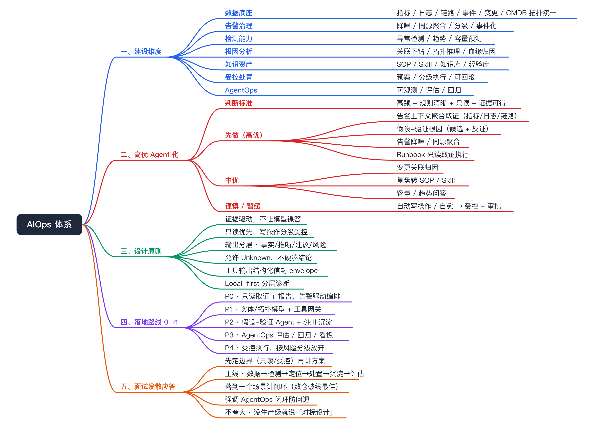
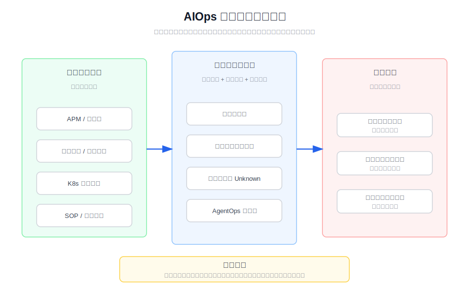
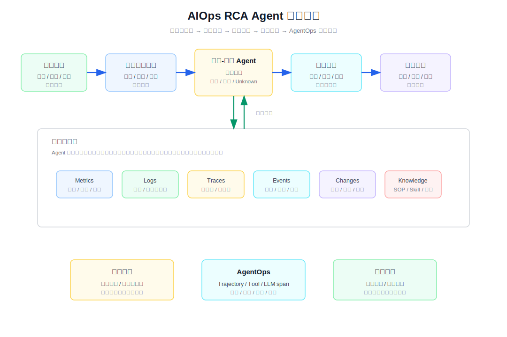
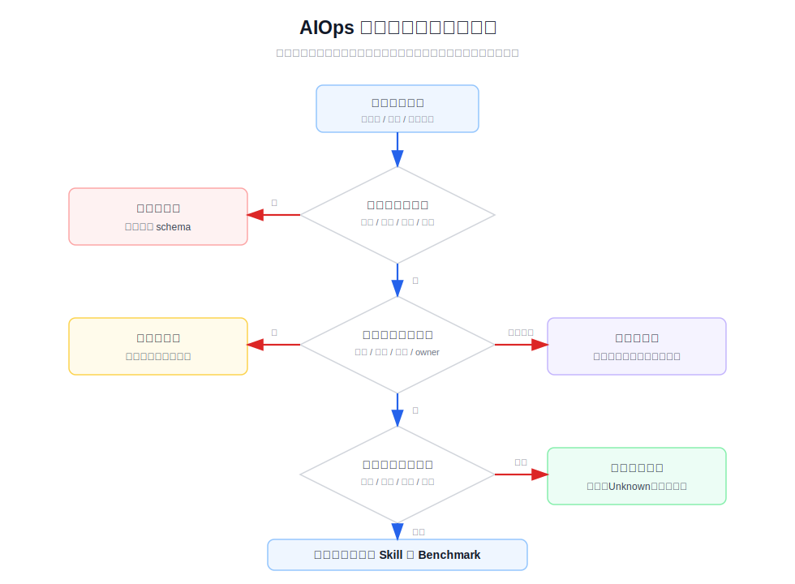
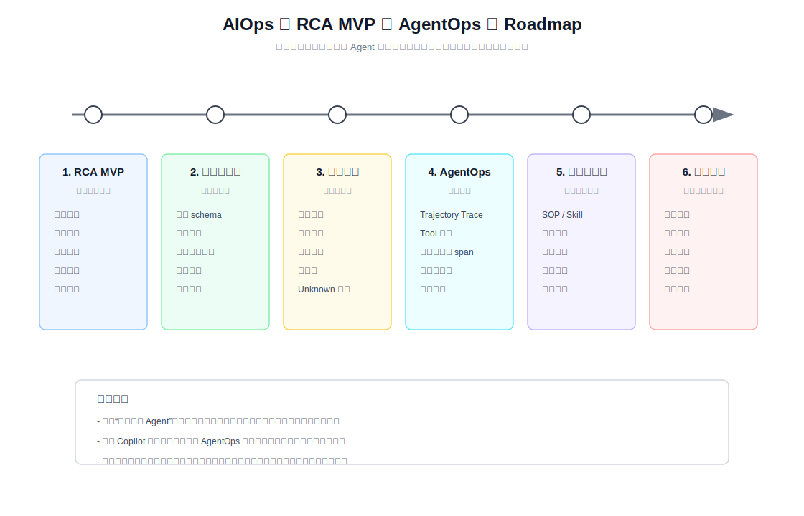

# AIOps 体系设计总览

面向面试发散题「如果让你设计一套 AIOps 体系，你会怎么做」：从哪几方面建设、哪些环节高优 Agent 化、怎么分阶段落地、怎么作答，一张图先讲清通用骨架，细节见下文各章节。落到数仓/大数据这个具体场景怎么做，见 [大数据/数仓平台 AIOps 专篇](bigdata-platform-aiops.md)。



# 面试定位卡

- **技术点**：AIOps Agent 化根因分析 / AI SRE Copilot / AgentOps
- **所属领域**：SRE、可观测、告警治理、根因分析、LLM Agent 工程化
- **经验等级**：`adjacent_production_experience`
- **面试价值**：能把传统告警平台、APM、K8s 排障和大模型 Agent 结合起来讲清楚，体现对“智能运维不是聊天机器人，而是证据驱动的排障系统”的理解。
- **常见考法**：AIOps 和传统告警有什么区别；RCA Agent 怎么避免幻觉；告警、指标、日志、链路、变更、知识库怎么编排；AgentOps 怎么观测和评估；为什么执行动作必须受控。
- **适合挂钩项目**：APM / 可观测平台、告警治理、K8s 运维排障、BigEyes 类事件平台、SRE 平台化、内部知识库和 SOP 沉淀。
- **不适合夸大的地方**：不能说内部 AIOps 项目是我写的；不能说我已经负责生产级 AIOps 平台；不能编造效果指标、节省人力、自动处置或收益数据。

# 经验边界

我没有直接开发或维护这个内部 AIOps 项目，面试中不能把它包装成自己的亲历项目。这个文档的定位是技术点准备：把内部样本、夜莺 v9 AI Copilot 和 QCon/170 目录里的行业材料，抽象成 AIOps Agent 化根因分析的工程方法论。

可以安全表达的是：我有可观测、告警治理、K8s 排障、平台化运维的相邻生产经验，理解告警事件从触发到定位的真实流程；基于行业方案和内部样本，我能讲清楚如果要建设 AIOps RCA Agent，应该如何做数据接入、工具取证、知识约束、质量评估和受控执行。

不能表达的是：我主导开发了该项目、线上已经自动处置故障、诊断质量已经达到某个水平、节省了多少人力、覆盖了多少业务规模。这些都需要真实生产归属和评测数据支撑。



# 三十秒回答

AIOps Agent 化根因分析，本质上是把传统 SRE 排障流程拆成可编排、可观测、可评估的 Agent 工作流。它不是把告警直接丢给大模型问一句“为什么”，而是先把告警结构化，再围绕指标、日志、链路、事件、变更、拓扑和知识库取证，让模型负责规划、解释和生成报告。

它解决的是人工 on-call 里最耗时的几类问题：判断告警真假、理解告警规则语义、关联上下游证据、复用历史 SOP、给出下一步排查建议。代价是系统复杂度会上升，必须治理数据质量、工具权限、模型幻觉、知识过期和评估体系。

我会把它定位成相邻经验加理论对标：我没有把内部项目包装成亲历项目，但我能讲清楚这类系统如何从 Copilot 走到 AgentOps，再到人机协同的受控执行。

# 为什么需要它

- **没有它之前的问题**：告警平台能通知人，但不一定能解释“为什么报警”；排障依赖资深 SRE 的经验，知识分散在文档、群聊、历史事件和个人脑子里。
- **它的解决方式**：把告警上下文、可观测数据、变更记录、服务拓扑和 SOP 统一交给 Agent 编排，通过工具调用形成证据链，再输出可审计的根因假设和处理建议。
- **它引入的新问题**：Agent 的输出不天然可信，必须允许“不知道”，必须区分证据、推断和建议，必须有权限、审计、回放、评估和人工确认。
- **必须关注的场景**：告警真假判定、告警事件解读、K8s 资源异常、数据库和缓存慢查询、变更关联、知识库复用、SRE 新人值班辅助。

# 它解决什么问题

- **告警从“通知”变成“可调查事件”**
  - **对应能力**：把告警规则、触发时间、影响对象、持续时间、历史趋势和相关告警组织成调查上下文。
  - **面试表达**：AIOps 的第一步不是推理，而是把告警变成可被工具验证的问题。

- **告警消息入口不稳定**
  - **对应能力**：同时支持告警事件 ID、告警链接和飞书告警卡片正文，并把卡片里的规则名、资源、触发时间、阈值、错误分类、IP 分布、traceId 和场景标签解析出来。
  - **面试表达**：告警诊断要先把“人看的消息”转成“机器可执行的事件上下文”，否则后续取证会跑偏。

- **跨系统取证成本高**
  - **对应能力**：自动关联指标、日志、链路、事件、变更、拓扑、配置和知识库。
  - **面试表达**：模型不能替代证据，模型应该编排证据。

- **历史经验难复用**
  - **对应能力**：把 SOP、故障复盘、排障手册和团队经验沉淀成可被 Agent 检索和调用的 Skill。
  - **面试表达**：AIOps 的价值不只是自动化分析，还包括把个人经验变成组织资产。

- **纯模型输出不可信**
  - **对应能力**：通过工具白名单、证据链、报告校验、离线评测和人工反馈约束模型。
  - **面试表达**：生产级 RCA Agent 的关键是“没证据就不乱说”，而不是回答越自信越好。

- **从 Copilot 到 AgentOps 缺少闭环**
  - **对应能力**：记录 Agent 的 trajectory、tool invocation、retrieval、LLM 调用、成本、耗时、错误和人工采纳结果。
  - **面试表达**：Agent 自身也要被观测和评估，否则无法持续迭代。

# 核心概念表

- **Alert Context**
  - **一句话定义**：告警进入 Agent 前的结构化上下文，包括对象、时间、规则、阈值、影响范围和关联实体。
  - **解决的问题**：避免模型从一段非结构化文本里猜参数。
  - **追问点**：告警字段不完整怎么办；时间窗口怎么统一；多语言告警怎么处理。

- **Evidence Chain**
  - **一句话定义**：支撑根因判断的一组可追溯证据，包括指标趋势、日志片段、事件、变更和拓扑关系。
  - **解决的问题**：避免把相关性说成因果性。
  - **追问点**：证据冲突怎么办；证据缺失是否允许下结论；报告里如何标注来源。

- **Hypothesis-Verification**
  - **一句话定义**：先产生根因候选，再逐个找证据和反证，最后输出已验证、未验证或未知。
  - **解决的问题**：限制模型直接跳结论。
  - **追问点**：候选根因如何生成；什么条件下可以终止；如何处理多根因。

- **Tool / Skill**
  - **一句话定义**：Tool 是 Agent 调用外部系统取证的接口，Skill 是把团队方法论和 SOP 写成可加载的排障能力。
  - **解决的问题**：让模型接入真实系统和组织经验。
  - **追问点**：危险工具怎么管；Skill 过期怎么办；同名 Skill 优先级如何处理。

- **Topology / UModel / Knowledge Graph**
  - **一句话定义**：把服务、实例、Pod、主机、数据库、消息队列、依赖关系和变更关系统一建模。
  - **解决的问题**：让 Agent 知道“该看谁”和“谁影响谁”。
  - **追问点**：拓扑不准怎么办；如何从 CMDB、链路和部署系统融合。

- **AgentOps Trajectory**
  - **一句话定义**：记录 Agent 每一步思考、工具调用、检索、观察、模型调用和最终输出。
  - **解决的问题**：让 Agent 的分析过程可回放、可调试、可评估。
  - **追问点**：如何脱敏；如何控制成本；如何和 OpenTelemetry 语义对齐。

- **Benchmark / Eval**
  - **一句话定义**：用历史告警、标准答案、人工评分和线上反馈衡量 Agent 是否真的变好。
  - **解决的问题**：避免只靠主观感觉判断效果。
  - **追问点**：Ground Truth 怎么构造；LLM-as-Judge 是否可靠；如何做回归测试。

- **Human-in-the-loop**
  - **一句话定义**：Agent 给建议和证据，人负责确认、执行和承担责任，高风险动作必须有审批和审计。
  - **解决的问题**：降低误操作和越权风险。
  - **追问点**：哪些动作可以自动化；如何回滚；如何把人工反馈回灌。

# 原理模型



AIOps RCA Agent 可以拆成六层。

- **事件接入层**：承接告警、巡检、用户问题和事件工单，先做字段标准化和去重聚合。
- **上下文层**：根据告警对象补齐服务、集群、实例、Pod、主机、依赖、owner、时间窗口和告警规则语义。
- **工具取证层**：以只读方式查询指标、日志、链路、事件、变更、配置、CMDB、知识库和历史案例。
- **推理编排层**：围绕根因候选做假设、验证、反证和证据归因，允许输出“不确定”。
- **报告与协同层**：生成面向 on-call 和研发可读的报告，区分事实、推断、建议和风险。
- **AgentOps 层**：记录轨迹、评估质量、回放历史、沉淀 Good / Bad Case，支撑持续迭代。

# 关键机制

## 告警上下文标准化

- **问题**：告警内容通常是面向人阅读的，不一定适合机器执行；字段缺失、文案变化、时间格式不一致都会让 Agent 误判。
- **工作方式**：定义统一告警 schema，明确事件 ID、触发对象、时间窗口、指标表达式、阈值、持续时间、业务归属、关联实体和原始消息。
- **权衡**：schema 太粗会丢上下文，太细会增加接入成本；短期可以兼容文本解析，长期要推动告警生产端结构化。
- **追问回答**：我会把告警结构化作为 AIOps 的第一优先级，因为没有稳定输入，后面的推理和评估都不可靠。

## 告警事件画像

- **问题**：单条告警可能只是连锁反应的一环，单看当前指标或日志容易误判。
- **工作方式**：围绕告警触发时间，补齐告警规则、阈值、通知响应、同规则 24 小时频次、同资源 7 天告警史、同时刻活跃告警和历史处理记录。
- **权衡**：画像依赖告警中心权限和历史数据；拿不到时要显式标注降级，而不是假装完整。
- **追问回答**：我会把“告警画像”作为 RCA 的独立证据层，用来判断这是首次故障、复发、噪音规则还是更大故障风暴的表象。

## 只读工具取证

- **问题**：LLM 没有线上系统状态，直接回答容易变成经验猜测。
- **工作方式**：通过工具读取 Prometheus 指标、日志平台、Trace、K8s 事件、变更记录、CMDB、知识库和历史告警。
- **权衡**：工具越多，覆盖越强，但权限、超时、成本、上下文长度和错误处理也更复杂。
- **追问回答**：生产初期我会坚持只读工具优先，先把诊断准确性和审计做好，再讨论低风险动作自动化。

## 假设-验证闭环

- **问题**：RCA 最怕模型直接说“可能是内存不足”但没有证据。
- **工作方式**：先列出候选根因，再对每个候选检查支持证据和反证，例如资源水位、重启事件、错误日志、变更时间、上下游异常。
- **权衡**：闭环验证会增加耗时，但能显著降低“看似合理”的错误结论。
- **追问回答**：我认为 RCA Agent 应该把 `True / False / Unknown` 都作为合法结果，尤其要允许“证据不足，不能下结论”。

## 知识和 Skill 资产化

- **问题**：SRE 经验经常散落在个人、群聊和历史复盘里，新人值班很难复用。
- **工作方式**：把高频场景的排障步骤、判断条件、查询工具、注意事项和回滚建议写成 Skill 或 SOP，让 Agent 在匹配场景时加载。
- **权衡**：知识库不是越多越好，关键是分层、版本、owner、有效期和反馈机制。
- **追问回答**：我会把复盘产物分成“事实记录、排障路径、判断规则、自动化入口、过期条件”几类，避免把长文档直接塞给模型。

## AgentOps 可观测

- **问题**：Agent 出错时，传统接口日志只能看到输入输出，看不到中间推理和工具调用过程。
- **工作方式**：记录 Agent trajectory、tool invocation、retrieval、LLM span、模型消耗、延迟、错误和人工反馈；关键字段要脱敏。
- **权衡**：观测越细，存储和隐私治理成本越高；高风险场景要优先保证可回放。
- **追问回答**：我会参考 OpenTelemetry GenAI 语义，把模型调用、工具调用和检索过程串到同一条 trace 里。

## 评估和回归

- **问题**：AIOps 不能只靠“这次回答看起来不错”来迭代。
- **工作方式**：用历史告警构造评测集，记录标准根因、关键证据、禁止结论和期望操作；结合规则检查、人工评分、LLM-as-Judge 和 trajectory 评估。
- **权衡**：Ground Truth 构造成本高，但没有评测集就无法判断提示词、工具和模型升级是否回退。
- **追问回答**：我会把评估分成输出级、步骤级和会话级：输出看报告质量，步骤看工具选择和参数，会话看是否真的缩短排障路径。

## 人机协同和受控执行

- **问题**：Agent 自动执行线上动作风险极高，尤其是重启、扩容、回滚、删数据、改配置。
- **工作方式**：Agent 默认给建议和证据，高风险动作必须走用户确认、RBAC、审批、审计和回滚方案；低风险动作可以先从查询、静默、生成规则草案等场景开始。
- **权衡**：完全人工确认效率低，完全自动执行风险高，合理路线是按风险分级。
- **追问回答**：我不会把“自动修复”作为早期目标，早期目标是“判断更快、证据更全、建议更稳、执行可控”。

# 横向对比

- **传统告警平台 vs AIOps RCA Agent**
  - 传统告警平台主要解决“发现和通知”；AIOps RCA Agent 进一步解决“解释、取证、建议和复盘沉淀”。

- **AIOps 1.0 算法驱动 vs AIOps 2.0 Agent 驱动**
  - AIOps 1.0 偏异常检测、告警收敛、模式识别；AIOps 2.0 更强调 Agent 编排工具、理解上下文、复用知识和形成闭环。

- **聊天机器人 vs SRE Copilot**
  - 聊天机器人主要回答问题；SRE Copilot 嵌入告警详情、指标查询、PromQL 生成、事件分析和知识库，围绕真实工作流提供帮助。

- **Copilot vs AgentOps**
  - Copilot 关注“能不能帮人”；AgentOps 关注“Agent 自己是否可观测、可评估、可治理、可持续迭代”。

- **自动化脚本 vs Agent**
  - 脚本适合确定性流程；Agent 适合上下文复杂、需要多工具取证和解释的场景，但必须加权限和评估边界。

- **内部样本 vs 个人亲历项目**
  - 内部样本可以作为技术理解和方案对标；不能包装成自己的生产项目经验。

# 业界做法对标

- **夜莺 v9 AI Copilot**
  - 产品定位不是孤立问答，而是嵌入监控告警系统的 SRE 副驾驶。
  - 典型场景包括告警真假判定、告警事件分析、自然语言创建监控规则、日常运维小任务和自定义 Skill。
  - 安全边界强调不自主执行、复用当前用户 RBAC、数据不离域、模型可自选、危险操作人工确认。
  - 对面试的启发：AIOps 要嵌入日常入口，围绕告警事件和 SRE 工作流，而不是另起一个泛聊天入口。

- **RCA Agent：假设-验证闭环**
  - 170 目录里的 RCA Agent 分享强调“没证据就不乱说”，用候选根因、证据和反证推动结论。
  - 对面试的启发：根因分析要允许 Unknown，不要为了给答案而制造因果。

- **AIOps Agent：数据飞轮和统一模型**
  - AIOps Agent 分享把运维数据、工具、知识、记忆、模型推理和反馈闭环放在一个统一框架里。
  - 对面试的启发：瓶颈往往不是模型，而是数据上下文不完整、评估不可度量、反馈不可持续。

- **AIOps 到 AgentOps：故障定位 Agent**
  - AgentOps 材料强调可观测数据本身还不够，需要服务、实例、Pod、数据库、MQ、依赖关系和变更关系的结构化语义。
  - 对面试的启发：Metrics / Logs / Traces 如果缺少实体关系和业务语义，Agent 很难真正定位。

- **AI-in-SRE Loop**
  - SRE 场景不是只做诊断，还包括事前预防、事中检测、诊断协同、受控执行和事后复盘回灌。
  - 对面试的启发：稳定性系统要做到可判断、可止损、可接管。

- **Agent 可观测和评估工程**
  - Agent 质量保障材料强调 trace、tool call、retrieval、LLM 调用、成本、延迟、Good / Bad Case、离线回放和线上监控。
  - 对面试的启发：AIOps Agent 的上线标准不能只看接口成功率，也要看诊断过程和结果质量。

# 告警消息分析上下文来源

从 `alarm-diagnosis` 这个故障分析 skill 看，它已经明确说明了“对报警消息做故障分析时，上下文包含哪些来源的信息”。它的核心不是从服务名出发看全景，而是从告警事件出发：用户给告警 ID、告警链接或飞书告警卡片后，先还原告警事件，再围绕触发时间做精窗口取证。

- **入口上下文**
  - 告警事件 ID、告警链接、飞书告警卡片正文。
  - 卡片解析字段包括规则名、原始资源名、映射后的 `service.name`、触发时间、结束时间、告警级别、阈值、错误关键字、错误统计、错误分类 Top、错误内容、IP 分布、traceId 格式、Dubbo SO-TraceId、场景标签和解析置信度。
  - 这个点可以补强文档里的“告警上下文标准化”：输入不能只写 `content`，要明确“告警卡片正文也是一种半结构化数据源”。

- **告警中心上下文**
  - 告警详情：category、resource、triggerTime、ruleId、level、status。
  - 通知记录：通知了谁、是否响应、是否升级。
  - 操作日志：上次类似事件是否 ack、如何处理、是否复发。
  - 规则详情：规则表达式、阈值、最近改动。
  - 告警画像：同规则近 24 小时触发频次、同 resource 近 7 天告警史、triggerTime 附近同时刻活跃告警。
  - 这个点可以补强文档里的“证据链”：告警本身也有历史和行为上下文，不只是指标、日志、链路。

- **资源映射上下文**
  - 告警资源名不一定等于 OTel 的 `service.name`，需要做 resource 到 service 的映射和候选探测。
  - 类别分支很关键：Application 类可以深度查 logs/traces；Redis、RDS、KafkaTopic、ECS、NginxDomain 等更适合路由到指标、主机或专项 skill，不应该强行查应用日志和链路。
  - 这个点可以补强 roadmap：AIOps 平台需要一个“实体映射和路由层”，否则 Agent 会把工具调用浪费在错误对象上。

- **触发窗口上下文**
  - 默认围绕 `triggerTime ± 30min` 查日志和链路，必要时最大放到 `±2h`。
  - 同时刻活跃告警用更小窗口，例如 `triggerTime ± 5min`，用于判断是否存在故障风暴或下游连锁反应。
  - 这个点可以补强文档里的排障路径：不要用“最近 1 小时”这种相对时间，报告生成后时间会漂移。

- **OTel Logs 上下文**
  - 错误类型聚合、logger 聚合、ERROR 样本、错误趋势、按 host/IP 的 Pod 分布。
  - 如果 trace 缺失，可以用日志中的 Dubbo SO-TraceId、异常栈和下游字段做兜底归因。
  - 这个点可以补强“日志不是只查关键字”，而是要承担异常分类、样本抽取、趋势判断和 trace 兜底。

- **OTel Traces 上下文**
  - 错误聚合、P99 / 长尾操作、服务总览、Dubbo/HTTP/DB 延迟、长尾 trace 样本、上游应用、下游应用、接口维度和 Pod 分布。
  - trace 优先做跨服务归因，trace 不完整时再降级到日志正则和卡片字段。
  - 这个点可以补强“链路与影响范围”：RCA 不只问谁报错，还要问谁调用它、影响哪条业务入口、下游是否是真因。

- **降级上下文**
  - 没有告警中心权限时，用飞书卡片正文 + logs/traces 继续诊断，但告警画像维度要标注不可用。
  - OTel 未接入时，基于告警卡片 + 告警中心上下文输出观测限制，不继续盲目查 logs/traces。
  - 非 Application 类告警直接输出信息卡片或路由到专项 skill。
  - 这个点可以补强文档里的风险边界：降级路径本身也是生产可用性的关键能力。

- **报告上下文**
  - 报告不只是根因结论，还包括告警上下文、触发窗口分析、告警画像、链路与下游归因、观测限制、行动清单和一句话结论。
  - 另有编排报告记录每个 Phase 的参数、中间结果、失败点和降级点，这对 AgentOps 回放评估很有价值。

# 典型业务场景

- **On-call 告警真假判定**
  - 看心跳、指标趋势、同机房邻居、历史基线、同类事件和变更，判断是真故障、抖动还是误报。

- **告警事件解读**
  - 把告警规则、PromQL、阈值、持续时间、影响对象、相关指标和下一步排查建议翻译成人能读懂的事件说明。

- **K8s 资源类异常**
  - 对 Pending、OOM、重启、CPU throttling、节点水位、HPA、调度失败等问题做多维取证。

- **数据库和缓存专项诊断**
  - 对慢 SQL、连接数、磁盘增长、热点 key、缓存慢查询等结构化程度高的场景，优先使用专项分析器，而不是完全依赖通用 Agent。

- **自然语言生成监控配置**
  - 借鉴夜莺的产品思路，把“给生产环境主机加 CPU 告警”转成 PromQL、阈值、时间窗、级别和通知规则草案。

- **SOP / Skill 沉淀**
  - 把团队历史故障和标准排障路径写成 Skill，新人值班时按场景加载。

- **Agent 回归评估**
  - 用历史告警和复盘结论做 benchmark，评估提示词、模型、工具和知识库变更是否让诊断变差。

# 如果让我落地，我会怎么设计

- **第一步：明确边界**
  - 先做只读取证和报告，不做线上写操作。
  - 明确 Agent 的输出分为事实、推断、建议和风险，不把建议伪装成已执行动作。

- **第二步：建立告警事件驱动编排**
  - 支持告警 ID、告警链接和飞书告警卡片入口，先做输入分流。
  - 固定 `triggerTime ± 30min` 作为日志和链路诊断窗口，固定 `triggerTime ± 5min` 看同时刻活跃告警。
  - Application 类走 logs/traces 深度诊断，非 Application 类路由到指标、主机、数据库、缓存或信息卡片，避免盲目下钻。

- **第三步：建立告警和实体模型**
  - 统一告警 schema，补齐服务、实例、Pod、主机、数据库、消息队列、owner、业务组和时间窗口。
  - 以 CMDB、部署系统、链路数据和监控标签构建最小可用拓扑。
  - 增加 resource 到 `service.name` 的候选映射和事实探测，避免只靠字符串裁剪。

- **第四步：建设工具网关**
  - 工具默认只读，统一权限、超时、重试、脱敏、审计和错误类型。
  - 工具输出统一成证据对象：来源、时间范围、实体、关键值、置信度、原始链接。

- **第五步：引入假设-验证 Agent**
  - 让 Agent 先产出候选根因，再调用工具验证和反证。
  - 报告必须说明用了哪些证据、哪些证据缺失、哪些结论不能确定。

- **第六步：沉淀 Skill 和知识资产**
  - 从高频告警开始，把排障步骤、判断条件和处理建议写成可维护 Skill。
  - 每次复盘后更新 SOP、知识有效期和评测样本。

- **第七步：建设 AgentOps**
  - 记录 trajectory、tool call、retrieval、LLM span、成本、耗时、失败原因和人工反馈。
  - 像故障分析 skill 一样保存编排报告，记录每个 Phase 的参数、中间结果、失败点和降级原因。
  - 建立离线 benchmark 和线上质量看板，防止模型或提示词升级导致回退。

- **第八步：受控执行**
  - 先支持生成变更方案、静默建议、规则草案、回滚建议。
  - 再按风险分级开放半自动动作，高风险操作必须审批、审计和可回滚。

# 排障路径



如果 AIOps 分析结果不准，我会按下面顺序排查。

- **症状：Agent 没有给出有效结论**
  - **假设**：告警输入缺字段、时间窗口不对、对象识别失败。
  - **验证**：检查告警 schema 是否完整，飞书卡片解析置信度是否足够，触发对象和实体映射是否正确。
  - **指标**：字段缺失率、实体命中率、时间窗口对齐率。
  - **结论**：输入不稳定时，不要先调模型，要先修数据契约。

- **症状：查了很多工具但都是空结果**
  - **假设**：告警 resource 没有正确映射到 `service.name`，或告警类别不适合查应用日志和链路。
  - **验证**：先做 resource 候选映射和服务注册事实探测，再按 category 决定是否进入深度诊断。
  - **指标**：resource 映射命中率、OTel 接入命中率、非 Application 类误下钻次数。
  - **结论**：AIOps 需要实体映射和路由层，不能让模型手写字符串裁剪。

- **症状：结论看似合理但证据不足**
  - **假设**：工具返回空结果、取证范围太窄、知识库被过度相信。
  - **验证**：回放 tool call，检查每条证据的来源、时间和实体是否匹配。
  - **指标**：工具成功率、空结果率、证据覆盖率、反证检查率。
  - **结论**：没有证据时应该输出 Unknown，而不是补一个经验判断。

- **症状：报告泛泛而谈**
  - **假设**：提示词缺少报告约束，Skill 太通用，评估标准不明确。
  - **验证**：检查报告是否区分事实、推断、建议；是否包含原始证据链接；是否能被 on-call 复现。
  - **指标**：人工采纳率、报告返工率、关键证据缺失率。
  - **结论**：报告质量要靠模板、校验和评测集约束。

- **症状：不同模型版本表现不稳定**
  - **假设**：缺少固定 benchmark，提示词和工具 schema 没有回归测试。
  - **验证**：用历史告警回放，对比旧模型、新模型和不同 prompt 的 trajectory。
  - **指标**：根因命中率、关键工具选择率、误判率、Unknown 合理率、成本和耗时。
  - **结论**：AIOps 要走 eval-driven development，不能只凭单次 demo 判断。

- **症状：安全和权限风险**
  - **假设**：工具权限过大、敏感信息未脱敏、执行动作缺审批。
  - **验证**：检查工具白名单、RBAC、审计日志、敏感字段和人工确认链路。
  - **指标**：越权拦截数、敏感字段暴露数、危险操作拦截数。
  - **结论**：早期只做只读取证，执行能力必须分级开放。

# 未来规划和 Roadmap



- **阶段一：RCA MVP**
  - 目标是把告警 ID/飞书卡片入口、告警画像、只读取证、知识引用、报告模板和专项分析跑通。
  - 成功标准不是自动修复，而是报告可读、证据可追、人工能复核。

- **阶段二：标准化取证**
  - 统一告警 schema、实体模型、时间窗口、工具输出、错误类型和脱敏规则。
  - 解决“能跑但脆弱”的问题。

- **阶段三：假设-验证闭环**
  - 引入候选根因、证据、反证、置信度和 Unknown 输出。
  - 解决“模型很会说但不一定有证据”的问题。

- **阶段四：AgentOps 可观测和评估**
  - 对 trajectory、tool invocation、retrieval、LLM span、成本和耗时做 trace。
  - 建立历史告警 benchmark、Good / Bad Case、LLM-as-Judge 和人工复核闭环。

- **阶段五：知识图谱和 Skill 资产化**
  - 把服务拓扑、依赖关系、变更影响、SOP、故障案例和团队经验沉淀成可检索、可版本化、可评估的资产。
  - 让 Agent 不只是查文档，而是理解实体关系和业务语义。

- **阶段六：人机协同与受控执行**
  - 从建议、草案、静默推荐、规则生成、回滚方案开始。
  - 高风险动作必须经过 RBAC、审批、审计、灰度和回滚。
  - 最终目标不是“无人值守”，而是“可判断、可止损、可接管”。

# 风险、边界和误区

- **误区：AIOps 等于把告警发给大模型**
  - 正确理解：大模型只是编排器和解释器，证据来自可观测系统、变更系统、拓扑系统和知识库。

- **误区：回答越确定越好**
  - 正确理解：生产 RCA 必须允许 Unknown，没证据时不能强行给根因。

- **误区：先做自动修复才有价值**
  - 正确理解：早期更有价值的是告警解释、证据聚合、排障建议和知识沉淀。

- **误区：接入更多数据就一定更准**
  - 正确理解：数据需要结构、语义、时间对齐和质量治理；没有实体关系的数据只会增加噪声。

- **误区：知识库越大越好**
  - 正确理解：知识要有 owner、版本、适用条件、过期机制和反馈闭环。

- **误区：Agent 不需要像服务一样被观测**
  - 正确理解：Agent 的工具调用、检索、模型输入输出、成本和结果质量都需要被观测。

# 和项目的安全连接

- **能怎么说**
  - 我没有直接开发内部 AIOps 项目，但我把它作为技术样本学习过，结合可观测、告警治理和 K8s 排障经验，理解 AIOps RCA Agent 的工程边界。
  - 我能讲的是这类系统应该如何设计：告警结构化、只读工具取证、知识库约束、假设验证、AgentOps 观测、评估回归和受控执行。
  - 我能把它和 APM、告警平台、K8s 排障、变更关联、SOP 沉淀这些真实相邻经验连接起来。

- **不能怎么说**

| 风险说法 | 问题 | 安全替代表达 |
|---|---|---|
| 我负责建设了这个 AIOps 项目 | 事实不符，容易被追问实现细节 | 我没有直接开发它，是把它作为技术样本对标学习 |
| 我们已经自动修复线上故障 | 没有执行链路和风险数据支撑 | 当前更合理的阶段是只读取证、报告建议和人工确认 |
| 准确率很高 | 没有 benchmark 和标注集支撑 | 后续需要用历史告警回放和人工复核评估 |
| 大模型能自动判断根因 | 过度夸大模型能力 | 模型要基于工具证据和知识库约束做假设验证 |
| 接入所有监控数据就能做好 AIOps | 忽略实体关系和数据质量 | 关键是统一上下文、实体拓扑、证据结构和评估闭环 |

# 面试追问树

```text
AIOps RCA Agent 是什么？
├─ 和传统告警平台有什么不同？
│  ├─ 告警平台解决发现和通知
│  └─ RCA Agent 解决取证、解释、建议和复盘沉淀
├─ 怎么避免模型幻觉？
│  ├─ 告警结构化
│  ├─ 只读工具取证
│  ├─ 假设-验证-反证
│  ├─ 允许 Unknown
│  └─ 报告质量校验和评估集
├─ 需要哪些数据？
│  ├─ Metrics / Logs / Traces
│  ├─ K8s 事件和配置
│  ├─ 变更记录
│  ├─ CMDB 和拓扑
│  └─ SOP / Skill / 历史案例
├─ AgentOps 怎么做？
│  ├─ trajectory trace
│  ├─ tool invocation
│  ├─ retrieval 和 LLM span
│  ├─ 成本、时延、错误
│  └─ benchmark 和人工反馈
└─ 能不能自动修复？
   ├─ 早期不建议
   ├─ 先做建议和草案
   ├─ 低风险动作分级开放
   └─ 高风险动作必须审批、审计和回滚
```

# 高频 Q&A

## AIOps Agent 和普通 ChatOps 有什么区别？

ChatOps 更像对话入口，AIOps Agent 要嵌入告警和排障流程，能拿到真实数据、调用工具、引用知识库、形成证据链，并且能被观测和评估。

## 根因分析为什么不能直接让大模型回答？

因为大模型没有线上事实状态。RCA 需要指标、日志、事件、变更、拓扑和历史案例支撑。模型可以做规划和解释，但结论必须来自证据。

## 如何判断告警真假？

我会看告警规则本身、触发指标趋势、同类对象对比、历史基线、相关事件、变更记录和影响范围。如果证据不足，就输出不确定，而不是强行判断。

## 为什么强调只读工具？

只读工具风险低，适合先建立诊断能力。等诊断过程可观测、结果可评估、权限和审批可控之后，再逐步开放低风险动作。

## Skill 和知识库有什么区别？

知识库偏资料和案例，Skill 偏可执行的方法论。一个好的 Skill 应该说明适用场景、排查步骤、需要调用的工具、判断条件和风险提示。

## AIOps 里知识库过期怎么办？

要给知识 owner、版本、适用条件、过期时间和反馈入口。复盘后要更新知识和评测样本，否则 Agent 会继承旧经验。

## 怎么评价 AIOps Agent 的效果？

不能只看接口成功率。要看根因命中、关键证据覆盖、工具选择是否正确、误判率、合理 Unknown、人工采纳率、平均诊断耗时和成本。

## LLM-as-Judge 靠谱吗？

它适合做辅助评估，尤其是报告可读性和逻辑一致性。但关键根因、证据是否存在、工具参数是否正确，最好用规则、Ground Truth 和人工复核结合。

## OpenTelemetry 在这里有什么用？

可以把 Agent 的模型调用、工具调用、检索和响应组织成 trace，让一次分析像一次分布式调用一样可回放、可定位问题、可统计成本和延迟。

## 夜莺 v9 AI Copilot 对这个技术点有什么启发？

它把 AI 嵌到告警事件、PromQL、通知模板、查询框和 Skill 体系里，并明确不自主执行、复用 RBAC、数据不离域。这说明产品化 AIOps 的重点是嵌入工作流和控制边界。

## 如果面试官问“你做过吗”，怎么答？

直接说没有直接开发内部 AIOps 项目。我有可观测和 SRE 排障的相邻经验，也做过技术对标，所以能讲清楚如果建设这类系统会怎么设计、怎么排障、怎么评估和怎么控制风险。

## 如果只给一个月做 MVP，会怎么选范围？

我会只做告警解释和只读取证，不做执行。选两到三个高频场景，统一告警 schema，接最关键的指标、日志、事件、变更和知识库，最后用历史告警做一个小评测集。

## 为什么要允许 Unknown？

因为生产排障里“证据不足”是正常情况。强行输出确定根因会误导 on-call，合理 Unknown 反而能提高可信度。

## 数据都接进来是不是就能做好？

不是。数据接入只是前提，关键是实体关系、时间对齐、质量治理、权限脱敏、工具语义和评估闭环。

## Agent 多轮调用会不会太慢？

会，所以要按场景分级。告警真假判断可以走轻量路径，复杂 RCA 才走多轮假设验证；同时要缓存静态拓扑和知识，控制工具超时和模型调用成本。

# 三档背诵版

## 15 秒版

AIOps RCA Agent 不是把告警扔给大模型，而是把告警结构化后，围绕指标、日志、事件、变更、拓扑和知识库做取证。模型负责规划和解释，结论必须有证据，没证据要允许 Unknown。

## 45 秒版

我没有直接开发内部 AIOps 项目，这块我会按技术点和相邻经验来讲。我的理解是，AIOps Agent 的核心是把 SRE 排障流程工程化：先统一告警上下文，再通过只读工具获取指标、日志、链路、事件、变更和知识库证据，最后用假设-验证闭环输出根因、证据和建议。它的难点不是接一个大模型，而是数据质量、工具权限、知识保鲜、报告可信度、AgentOps 观测和评估回归。

## 2 分钟版

AIOps RCA Agent 我会从三个层次讲。第一层是 Copilot，把 AI 嵌入告警事件、指标查询、PromQL、SOP 和知识库，帮助 on-call 判断告警真假、理解事件含义、聚合证据。第二层是 RCA Agent，把模型限制在工具和证据链里，通过假设-验证-反证的方式输出根因，允许 Unknown，避免把相关性说成因果。第三层是 AgentOps，把 Agent 的每轮工具调用、检索、模型调用、成本、耗时和人工反馈都观测起来，用历史告警 benchmark 做回归。

面试里我会先声明边界：内部 AIOps 项目不是我写的，我不能说成亲历项目。但我有可观测、告警治理和 K8s 排障的相邻经验，也参考了夜莺 v9 AI Copilot 和 QCon 里的 RCA Agent、AIOps Agent、AgentOps 分享，所以能讲清楚如果让我落地，我会先做只读取证和报告，再做标准化取证、假设验证、Skill 沉淀、评估回归，最后才考虑受控执行。

# 参考资料

- 夜莺 v9 AI Copilot：<https://flashcat.cloud/blog/nightingale-v9-ai-copilot/>
- OpenTelemetry GenAI semantic conventions：<https://opentelemetry.io/docs/specs/semconv/gen-ai/>
- LangSmith evaluation concepts：<https://docs.langchain.com/langsmith/evaluation-concepts>
- OpenAI Evals：<https://github.com/openai/evals>
- 170 目录本地 PDF：
  - `刘至浩-基于 “假设-验证” 闭环的 RCA Agent 实践.pdf`
  - `马云雷-AIOps Agent在运维RCA场景下的研发范式与数据飞轮实践.pdf`
  - `裴彤 - 从 AIOps 到 Agent Ops：故障定位 Agent 的设计与实践.pdf`
  - `田云龙-AI-in-SRE-Loop.pdf`
  - `钱世俊-给 Agent 做“CT”：大规模 Agent 的可观测与质量保障体系.pdf`
  - `章平-从盲目调优到数据驱动-大规模 Agent 的评估工程实践.pdf`
  - `赵文成-从个人经验到组织资产：小米运维知识沉淀的闭环实践.pdf`

# 面试前检查清单

- 能否在开场 10 秒内声明“不是我开发的项目，是理论对标 + 相邻经验”。
- 能否讲清楚 AIOps 不是聊天机器人，而是证据驱动的排障系统。
- 能否说出告警上下文、证据链、假设验证、Skill、AgentOps、评估回归这几个关键词。
- 能否解释为什么早期只做只读取证，不直接自动修复。
- 能否用夜莺 v9 AI Copilot 举例说明产品化 AIOps 应该嵌入工作流、复用 RBAC、数据不离域。
- 能否把 roadmap 讲成六步：RCA MVP、标准化取证、假设验证、AgentOps、知识资产化、受控执行。
