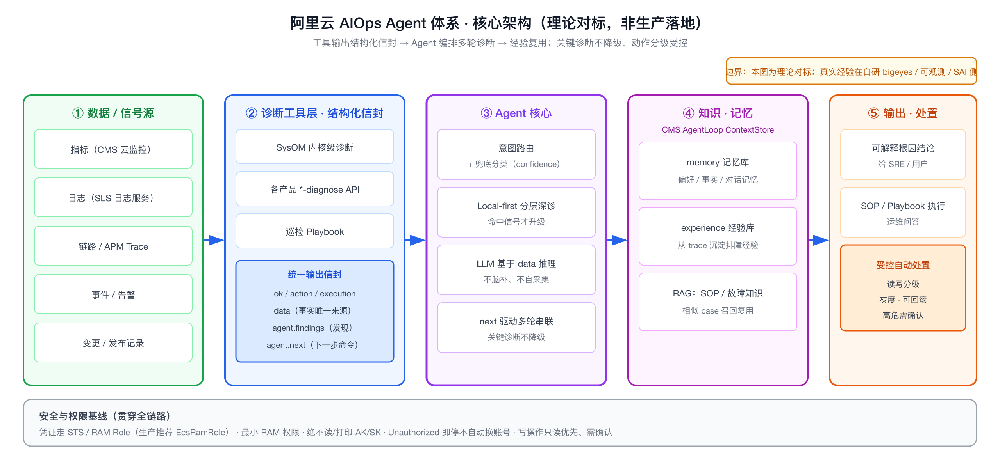
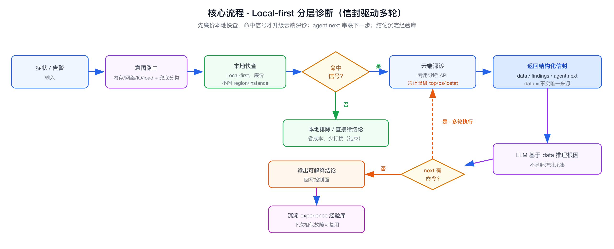
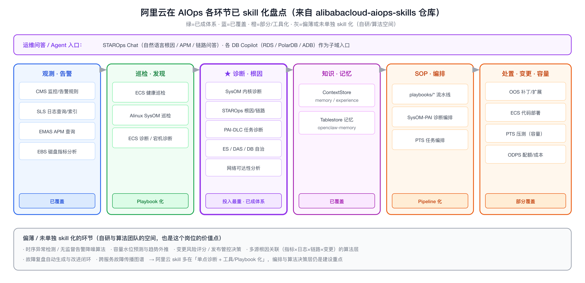

# 阿里云 AIOps Agent 体系（理论对标）

面向岗位：阿里云智能-智能运维开发-AIOps Agent 工程师（大数据/AI 平台稳定性方向）

```yaml
experience_level: adjacent_production_experience
真实生产经验:
  - bigeyes 告警/事件平台（告警治理、事件协同）
  - observability 可观测平台（指标/日志/链路）
  - aiops（异常检测、根因相关探索）
  - SAI/SAE AI 训练推理平台、Kubernetes 平台运维
对标对象（无直接生产落地）:
  - 阿里云 STAROps（对外 AIOps 诊断 Agent）
  - SysOM 结构化诊断信封 + Local-first 分层深诊
  - CMS AgentLoop ContextStore（记忆库 / 经验库）
  - ECS Health Inspection / PAI-DLC Job Diagnostics 等 Playbook
```

# 经验边界

我没有在阿里云这套 AIOps Skills（STAROps / SysOM / AgentLoop ContextStore）上做过生产开发，源码是面试前对标阅读的官方开源 Agent Skills 仓库。

但这套东西要解决的问题——告警分诊、指标/日志分析、故障归因、根因定位、SOP 自动执行、运维问答——和我在 bigeyes 告警事件平台、可观测平台、aiops 上处理的是同一类问题域。所以我能讲清楚它们背后的工程语义、为什么这么设计、如果让我从 0 落地会怎么做、线上出问题怎么排查，而不是停留在 API 层面。

面试中我会主动声明这条边界：阿里云这套是我对标学习的参考实现，我的真实经验在自研的告警/可观测/AIOps 侧。

# 为什么需要掌握

- **岗位高度对口**：JD 明确写「结合大模型、RAG、工具调用、自动化编排和知识库能力，落地日志分析、指标分析、故障归因、异常检测、根因定位、SOP 执行和运维问答」。阿里云这套 Skills 就是这些能力的官方落地形态，面试大概率会围绕它的设计思想问。
- **能解释托管/平台能力背后的通用语义**：STAROps、SysOM 是产品化封装，但底层的诊断契约、记忆经验沉淀、分层诊断这些工程语义是通用的，掌握后能跨平台迁移到自研体系。
- **补齐「平台接入者 → Agent 体系设计者」的认知**：我以前更多是建可观测/告警的数据底座，这套帮我把视角抬到「如何让 Agent 自动消费这些数据做闭环诊断」。
- **支撑技术选型与架构演进**：知道阿里云这么做之后，能判断自研 AIOps Agent 该自建什么、该对标什么。

# 核心架构与流程图

整套体系的核心架构（数据源 → 结构化信封工具层 → Agent 核心 → 知识记忆 → 受控处置，安全权限贯穿全链路）：



最关键的一条主流程——Local-first 分层诊断、信封驱动多轮、结论沉淀经验库：



两张图都标注了「理论对标」边界，面试讲的时候先点明：我讲的是这套设计的工程语义，不是说我做过它。

# 它解决什么问题

不是功能清单，按问题域拆：

- **工具输出怎么让 LLM 可靠消费、还能多轮串联**
  - **对应能力**：SysOM 的结构化诊断信封（Diagnostic Envelope）。
  - **面试表达**：CLI/工具不返回自由文本，而是返回 `ok/action/data/agent/execution` 的 JSON 信封；`agent.summary` 给模型读、`agent.findings` 是结构化发现、`agent.next` 直接给出下一步该执行的命令。`data` 是事实唯一来源，模型不许自己另起炉灶乱采集。

- **Agent 诊断不能无脑调一堆 API、成本爆炸、还容易误判**
  - **对应能力**：Local-first + 意图路由 + 按需深诊。
  - **面试表达**：先本地快查（不问 region/instance，少打扰用户），命中信号才触发云端深诊；按症状路由到不同诊断域（内存/网络/IO/load），且硬约束「深诊必须走专用诊断 API，禁止降级成手工 top/ps/iostat」。

- **Agent 怎么越用越聪明、不每次从零开始**
  - **对应能力**：AgentLoop ContextStore（memory store + experience store）。
  - **面试表达**：把用户偏好/事实沉到 memory，把从诊断 trace 总结出的排障经验沉到 experience，下次诊断可检索复用。这是 RAG 在运维场景的落地形态——检索的是「历史经验」而非「文档」。

- **重复性运维场景怎么标准化、可复现**
  - **对应能力**：Playbook（ECS Health Inspection 这类 `pattern: pipeline`）。
  - **面试表达**：把一个巡检/诊断固化成确定性多步流水线（数据源优先级、兜底、结构化报告），等价于把 SOP 代码化。

- **凭证/权限在 Agent 里怎么不出事**
  - **对应能力**：贯穿所有 Skill 的安全约定。
  - **面试表达**：绝不在对话里读/打印 AK/SK；只用 `configure list` 查身份；凭证走 SDK 默认链（STS > RAM Role > profile > env），生产推荐 EcsRamRole；最小 RAM 权限 + `Unauthorized` 即停、不自动换账号重试。

# 核心概念

- **诊断信封 Diagnostic Envelope**
  - 一句话：工具的标准化结构化输出契约，专为被 Agent 消费而设计。
  - 解决的问题：自由文本不可靠、无法多轮串联、模型容易脑补。
  - 经验映射：和我在可观测/告警平台里设计「结构化事件/告警 schema」是一类思路——让下游（无论是规则引擎还是 LLM）拿到的是字段而非一段话。
  - 可能被追问：`agent.next` 怎么防止模型不执行就总结？（答：约定 quick 输出只是信号检测，next 里有命令必须先执行再总结；`data` 为唯一事实源）；信封怎么做版本兼容？（答：`version` 字段做契约版本，删改 committed key 时升版本）。

- **Local-first 分层诊断**
  - 一句话：先廉价本地快查，命中才触发昂贵云端深诊。
  - 解决的问题：成本、打扰、误判。
  - 经验映射：对应告警里「先轻量规则过滤，再触发重分析」的分层思路。
  - 可能被追问：怎么定义「命中信号」阈值？误触发深诊怎么控制？

- **意图路由 Intent Routing**
  - 一句话：按症状把请求路由到对应诊断域/子命令（内存→memgraph/oom/javamem，网络→netjitter/packetdrop，IO/load 各有子命令）。
  - 经验映射：等价于告警的分类/分诊路由。
  - 可能被追问：路由是规则还是模型？分类置信度低（unknown）怎么兜底？（答：有 classify 兜底分类器 + confidence）。

- **memory store vs experience store**
  - 一句话：前者存用户偏好/事实/对话记忆，后者存从 trace 沉淀的排障经验。
  - 解决的问题：Agent 长期记忆与经验复用。
  - 可能被追问：经验质量怎么保证、过期/错误经验怎么淘汰？检索用向量还是结构化过滤？

- **诊断硬约束 / 不降级**
  - 一句话：关键诊断必须走专用诊断 API，不许 Agent 自由发挥用通用命令替代。
  - 解决的问题：保证诊断结论可信、可追溯、不被模型幻觉污染。
  - 这是体现「工程成熟度」的点，面试很值得主动讲。

- **Playbook / Pipeline**
  - 一句话：把确定性运维流程固化成多步流水线（如 8 步全维巡检 + HTML 报告）。
  - 经验映射：SOP 代码化、应急预案自动化。

- **RAG + 工具调用 + 编排在运维的落地形态**
  - 一句话：RAG 检索的是运维知识库/历史经验，工具是诊断 API，编排是 next/playbook 串联。
  - 这是把 JD 里几个关键词串起来的总纲。

# 如果让我落地，我会怎么设计

前提：假设让我从 0 到 1 在自研体系里建一个 AIOps 诊断 Agent，不是「我已经做过」。

1. **工具层先定契约，再接模型**：所有诊断工具统一输出结构化信封（success/findings/next/data + 版本号），把「事实采集」和「模型推理」解耦，事实只来自工具、结论由模型基于 data 给出。这是我会第一步做的事，因为它决定了后面能不能多轮自动串联。
2. **分层诊断**：本地/廉价快查 → 命中信号 → 云端/重诊断，控制成本和打扰；定义清晰的「升级到深诊」触发条件。
3. **意图路由 + 兜底分类**：先规则路由到诊断域，unknown 走分类器兜底，带 confidence，低置信不乱下结论。
4. **知识与经验**：文档/SOP 入 RAG 知识库；诊断 trace 沉淀进经验库，检索时优先复用相似历史 case。区分「事实记忆」和「经验记忆」两类 store。
5. **SOP/Playbook 编排**：高频场景固化成确定性 pipeline，低频/开放场景才交给模型自由编排，二者分流。
6. **可观测闭环**：Agent 自身要可观测——每步工具调用、路由决策、引用了哪条经验、最终结论都要可追溯，便于复盘和评估。
7. **安全与权限**：凭证走 STS/RAM Role，最小权限，敏感操作只读优先、写操作需确认；绝不在上下文里落 AK/SK。
8. **评估体系**：建诊断准确率/根因命中率/误报率的评估集，灰度接入、可回退，先只读诊断、再逐步开放自动处置。

# 如果线上出问题，我怎么排查

以「Agent 给出的根因不对 / 诊断不收敛」为例：

1. 先看 Agent 的执行 trace：走了哪条路由、调了哪些工具、引用了哪条经验。
2. 看工具返回的信封 `data`：是事实采集就错了（数据源问题），还是模型在正确 data 上推理错了。
3. 数据源问题 → 回到底层（监控/日志/诊断 API）查采集与权限（是不是 `Unauthorized` 被静默降级、是不是数据源兜底逻辑选错）。
4. 推理问题 → 看 prompt/上下文是否把 findings 完整带入、是否被无关经验污染（经验库召回质量）。
5. 路由问题 → 看意图分类是否误判、confidence 是否过低却仍下了结论。
6. 经验库问题 → 是否命中了过期/错误经验，需不需要淘汰。
7. 成本/超时 → 是不是该走快查却直接深诊、或深诊超时/轮询失败。
8. 最后回到平台层，把失败原因转成对用户/SRE 可解释的信息，并把这次 case 反哺评估集。

# 阿里云在哪些环节已经 skill 化

这套仓库（alibabacloud-aiops-skills，~120 个 skill）按 AIOps 闭环看，覆盖密度很不均匀，面试时点出「哪些已成体系、哪些还薄」比罗列 skill 名更显判断力。



- **观测·告警（已覆盖）**：CMS 监控/告警规则、SLS 日志查询与索引、EMAS APM、EBS 磁盘指标。数据底座侧封装得最齐。
- **巡检·发现（Playbook 化）**：ECS 健康巡检、Alinux SysOM 巡检、ECS 诊断/宕机诊断，多是确定性流水线。
- **诊断·根因（投入最重、已成体系）**：SysOM 内核级诊断（内存/网络/IO/load）、STAROps 根因与链路、PAI-DLC 任务诊断、ES/DAS 数据库自治、网络可达性分析。这是阿里云 skill 化最深的一块，也正是这个岗位的核心。
- **知识·记忆（已覆盖）**：AgentLoop ContextStore 的 memory/experience 双库、Tablestore 记忆。
- **SOP·编排（Pipeline 化）**：playbooks/*、SysOM-PAI 诊断编排、PTS 任务。
- **处置·变更·容量（部分覆盖）**：OOS 补丁/扩展、ECS 代码部署、PTS 压测、ODPS 配额/成本——偏单点工具，缺统一的变更管控决策。
- **入口层**：STAROps Chat 是对外的自然语言运维问答 Agent，各 DB Copilot 是子域入口。

更值得讲的是**还没被 skill 化的环节**（图最下方灰带），这正是岗位的价值点：

- 时序异常检测 / 无监督告警降噪算法；
- 容量水位预测与趋势外推；
- 变更风险评分、发布管控决策；
- 多源根因关联（指标×日志×链路×变更）的算法层；
- 故障复盘自动生成与改进闭环、跨服务故障传播图谱。

一句话总结判断：阿里云的 skill 多落在「**单点诊断 + 工具/Playbook 化**」，而**跨源关联的算法决策层和全局编排**仍是建设重点——这也是我作为 AIOps Agent 工程师能补位的地方。这个总结可以直接在面试里当作「你怎么看这套体系」的回答。

# 和我现有经验的映射

后置说明，先讲技术点本身、再连接真实经验。只在关联强的地方连，弱的不硬挂。

- **结构化诊断信封**
  - 真实经验映射：bigeyes/可观测平台里设计结构化告警/事件 schema。
  - 能怎么说：没做过 SysOM，但「让下游可靠消费结构化输出」这件事我在告警事件 schema 设计里做过同类权衡。
- **意图路由 / 分诊**
  - 真实经验映射：告警分类、降噪、分诊路由。
  - 能怎么说：路由本质是分类问题，和告警分诊一类。
- **memory / experience store**
  - 真实经验映射：弱关联。我做过可观测数据底座，但没做过 Agent 长期记忆库。
  - 能怎么说：这块我是理论对标，会讲 RAG 在运维场景检索历史经验的思路，不包装成已落地。
- **Playbook / SOP 流水线**
  - 真实经验映射：SAE/Kubernetes 平台的运维流程、应急处置。
  - 能怎么说：把 SOP 固化成确定性流程这件事我有平台侧经验。
- **训练任务诊断（PAI-DLC Diagnostics）**
  - 真实经验映射：SAI/AI 训练推理平台、任务 Pending/异常排查。
  - 能怎么说：训练任务健康检查维度、卡住排查和我在 SAI 平台处理的是同类问题。
- **STAROps 这个产品形态本身**
  - 真实经验映射：无直接生产映射。
  - 能怎么说：仅作理论对标，不包装成项目经验。

# 面试话术

**主回答（30 秒，正文不加引用块）**

阿里云这套 AIOps Skills 我没有直接生产开发经验，这点我先说清楚——它是我面试前对标学习的官方开源 Agent Skills。我自己的真实经验在自研侧：bigeyes 告警事件平台、可观测平台和 SAI/SAE 这些 AI/容器平台的稳定性。但阿里云这套要解决的问题——告警分诊、日志指标分析、故障归因、根因定位、SOP 执行、运维问答——和我做的是同一类。我重点对标了它几个工程设计：结构化诊断信封让工具输出可被 Agent 可靠消费和多轮串联、Local-first 分层诊断控制成本和误判、记忆库经验库做经验复用、以及关键诊断不许降级保证结论可信。我的理解不停在 API，而是关注它为什么这么设计、如果让我在自研体系落地会怎么搭、线上不收敛怎么排查。

**短回答**

- 问「你用过阿里云 STAROps/SysOM 吗？」：没直接用过生产，是我对标学习的参考实现；我的真实经验在自研的告警/可观测/AIOps 平台，问题域是一致的。
- 问「那你为什么还懂？」：因为它解决的告警分诊、根因定位、SOP 执行这些问题我在生产里处理过，我能从工程语义而不是 API 层面去理解它的设计取舍。
- 问「如果让你落地一个诊断 Agent 怎么做？」：先定结构化工具输出契约把事实和推理解耦，再做分层诊断、意图路由+兜底分类、知识库与经验库、SOP 编排，最后是可观测闭环、安全权限和评估灰度。
- 问「Agent 诊断不收敛/根因错了怎么排查？」：顺 trace 看路由→工具 data→区分是采集错还是推理错→查经验召回质量→回平台层给可解释结论并反哺评估集。
- 问「它和你们现在的系统什么关系？」：是同一问题域的不同实现，我会拿它的信封契约、分层诊断、经验沉淀这些设计来对标和反哺自研体系，而不是说我们就是它。

# 不能怎么说

| 不要这么说 | 风险 | 应该这么说 |
|---|---|---|
| 我做过阿里云 STAROps / SysOM 的生产开发 | 没有源码与线上证据，必被追问击穿 | 这是我对标学习的开源参考实现，真实经验在自研告警/可观测平台 |
| 我用 AgentLoop 经验库提升了 X% 根因命中率 | 编造收益数据 | 经验库收益应从经验复用率、相似 case 命中、平均诊断轮数来度量，我会这么设计评估 |
| 我们生产就是这套 RAG+Agent 诊断架构 | 把对标包装成已落地 | 我对标了这套设计，如果在自研体系落地我会这么搭，目前是理论方案 |
| 这套谁都能轻松落地 | 暴露对工程难度无感 | 难点在工具契约统一、经验质量治理、误诊控制和评估体系，不是接个模型那么简单 |
| 训练任务诊断我全做过 | 夸大，PAI-DLC 没用过 | 训练任务 Pending/异常排查我在 SAI 平台做过同类，PAI-DLC 的健康检查维度是对标理解 |

# 高频 QA

## AIOps Agent 和传统监控告警系统最大的区别是什么

传统系统止于「发现异常 + 通知人」，Agent 要做到「发现 → 自动取证 → 归因 → 给结论甚至执行处置」的闭环。关键差异是要让工具输出可被模型消费、要有经验复用、要能多步编排，而不只是规则匹配后丢个告警出去。

## 为什么工具要返回结构化信封而不是文本

文本不可靠、字段不稳定、无法多轮自动串联，模型容易在自由文本上脑补。信封把 findings、下一步命令、原始 data 分开，约定 data 是事实唯一来源、结论必须基于 data，这样既能控制幻觉，又能让上一步的 next 驱动下一步执行，形成可追溯的诊断链。

## Local-first 分层诊断解决什么问题

成本、打扰和误判。大部分问题本地快查就能定位或排除，没必要每次都调昂贵的云端深诊，也不必上来就问用户要 region/instance。只有快查命中信号才升级深诊，相当于给诊断加了一道廉价前置过滤。

## 为什么强调「关键诊断不许降级」

保证结论可信可追溯。如果允许 Agent 在专用诊断 API 不可用时自由降级成手工 top/ps/iostat，采集口径就不统一、结论无法复现、还可能被模型幻觉污染。宁可明确报失败让用户修权限，也不给一个看似合理实则不可信的结论。

## RAG 在运维场景检索的是什么

两类：一是运维知识库/SOP 文档，二是从历史诊断 trace 沉淀的排障经验。后者价值更大——它让 Agent 遇到相似故障能复用过去的判断路径。难点是经验质量治理：怎么沉淀、怎么去重、过期或错误经验怎么淘汰。

## memory store 和 experience store 为什么要分开

写入 schema、检索字段和用途都不同。memory 是用户偏好/事实/对话记忆，偏个性化；experience 是可跨用户复用的排障经验，偏知识沉淀。混在一起会让检索召回变脏，分开才能各自做质量控制。

## 没有生产经验，面试官为什么还认可你懂这套

因为它解决的问题我在生产里真做过——告警分诊、根因定位、SOP 执行、训练任务排查。我能从工程语义解释它每个设计为什么存在、代价是什么、什么场景不该用，这比背过 API 但不理解取舍更有价值。我会诚实声明边界，不把对标说成落地。

## 如果让你从 0 落地，第一步做什么

先定工具的结构化输出契约，把「事实采集」和「模型推理」解耦。这一步决定了后面能不能做多轮自动串联和可追溯诊断，是地基。模型和 RAG 反而可以后接。

## 诊断 Agent 怎么评估好坏

建带标注的评估集，看根因命中率、诊断准确率、误报率、平均诊断轮数/耗时、经验复用率。落地路径上先只读诊断不自动处置、灰度接入、可回退，等评估指标稳了再逐步放开自动处置。

## 自动处置这种高风险动作怎么控制

只读诊断和写操作严格分级；写/处置默认需要人确认或限定在低风险白名单动作；走最小权限凭证；每个动作可审计可回滚；先灰度小范围，评估稳定再扩。稳定性岗位上，「不把事搞更糟」优先于「全自动」。

## 这套和你们大数据/AI 平台场景怎么结合

大数据/AI 平台的稳定性场景——任务 Pending、资源水位、慢节点、训练 OOM/卡死、变更风险——都可以套同一范式：结构化诊断工具 + 分层诊断 + 经验库 + SOP 编排。训练任务诊断尤其和我在 SAI 平台处理的 Pending/异常排查是同类问题。

## 哪些地方你不会夸大

不会说做过阿里云这套的生产开发，不会编经验库带来的收益数字，不会把对标方案说成已落地架构，不会说训练诊断我全做过。能落地映射的（告警分诊、SOP、训练排查、可观测底座）我才往真实经验上连，弱关联的（STAROps 产品、Agent 长期记忆库）只说理论对标。
