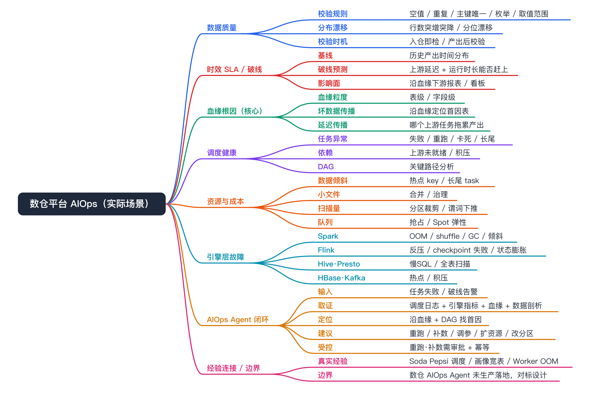
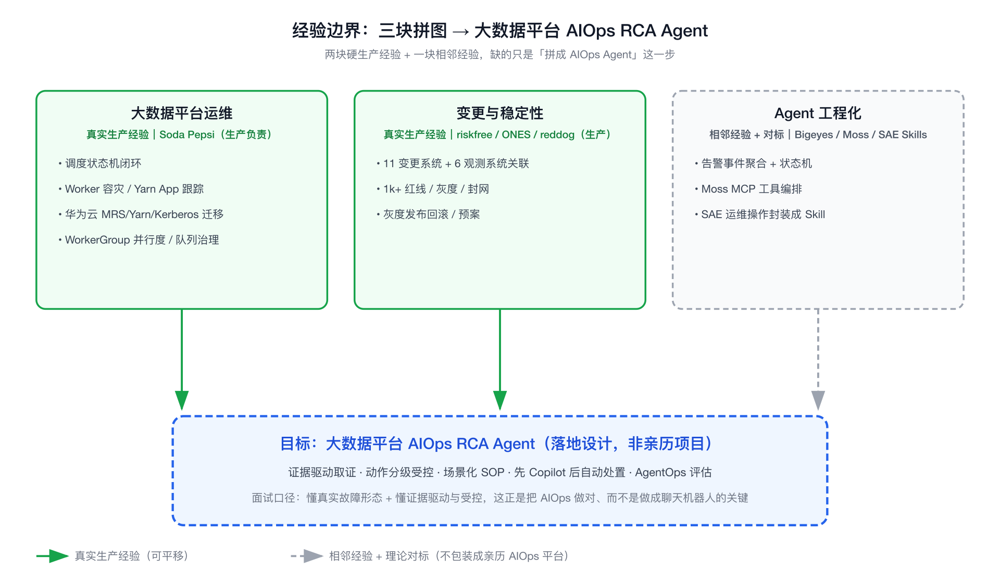
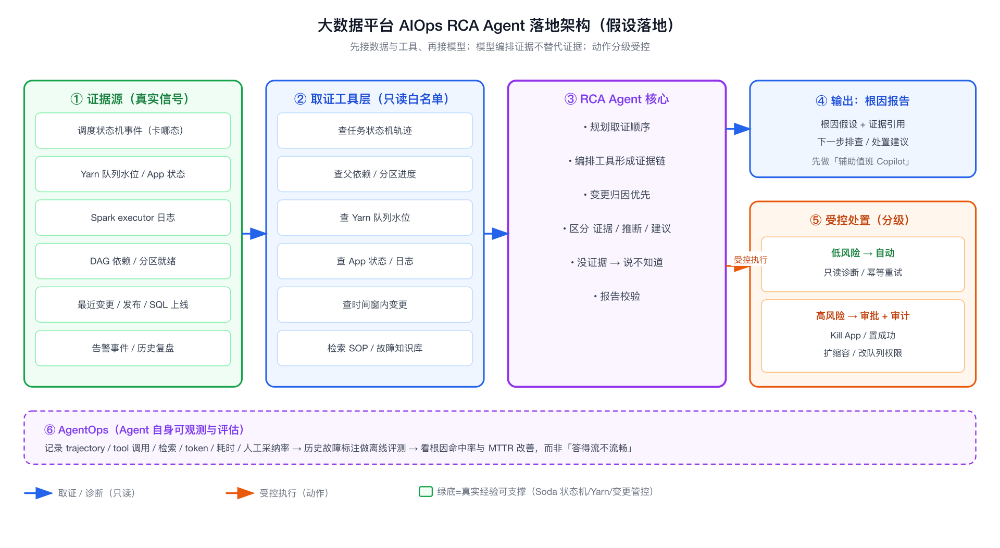

# 理论对标：大数据平台稳定性治理 × AIOps Agent

```yaml
experience_level:
  bigdata_platform_ops: production_experience            # Soda Pepsi 调度状态机/Worker 容灾/Yarn 队列治理/告警恢复，真实负责
  change_risk_governance: production_experience           # 小红书 riskfree 变更风控、ONES 灰度回滚，真实做过
  aiops_rca_agent_on_bigdata: adjacent_production_experience  # 把 AIOps Agent 用到大数据平台运维是相邻经验+理论对标，未主导生产 AIOps 平台
```

> 说明：本文专门给「阿里云智能-AIOps Agent 工程师（大数据/数仓平台）」这一岗准备。它和 [[aiops]] 系列的关系是：aiops.md 讲 AIOps Agent 化 RCA 的**通用方法论**，本文把它**收敛到大数据/数仓平台这个具体战场**，并把我在 Soda Pepsi（离线调度平台）和小红书 riskfree（变更风控）的真实经验显式对标上去。
>
> 边界先说清：大数据平台运维（调度、Yarn、Spark on K8s、队列治理、变更管控、告警）我真实做过；把这些场景做成 AIOps Agent（RCA/根因/自动处置）我没有主导过生产 AIOps 平台，是相邻经验 + 理论对标。技术选型为**轻量对标**，未跑完整 benchmark。

## 场景总览

数仓/大数据平台 AIOps 把通用方法论（见 [aiops 通用篇](aiops.md)）收敛到这个具体战场，覆盖数据质量、时效破线、血缘根因、调度健康、资源成本、引擎故障六类问题，以及 AIOps Agent 的取证→定位→建议→受控闭环。



## 经验边界

- **有直接生产经验（大数据平台运维侧）**：Soda Pepsi 离线调度平台，管理 10000+ 离线任务、日均约 50000+ 调度实例。我真实做过调度状态机闭环、Worker 容灾与 Yarn App 跟踪、阿里云→华为云 MRS/Yarn/Kerberos 迁移、Spark on K8s 落地、WorkerGroup 按队列并行度治理、队列权限审批、告警恢复。
- **有直接生产经验（变更/稳定性侧）**：小红书 riskfree 变更风控（对接 11 个变更系统、6 个观测系统、维护 1k+ 红线规则）、ONES 灰度发布回滚、reddog 报警平台、redbutton 预案平台。
- **有相邻经验（AIOps Agent 侧）**：Bigeyes 告警治理（事件聚合、抖动抑制、状态机），Moss-Compose Agent/MCP 工具编排，SAE 把运维操作封装成 MCP Skills 接 Agent。
- **没有直接生产经验**：没有主导建设过生产级 AIOps RCA 平台，没有把大数据平台故障做成「自动根因 + 自动处置」的闭环。
- **面试声明方式**：开口先说「大数据平台运维和变更稳定性我是真实做过的，把它 AIOps Agent 化是我相邻经验加对标设计」，定位成「懂大数据平台真实故障、懂稳定性体系、能设计 AIOps Agent 落地的人」，不是「已经交付过生产 AIOps 平台的人」。



> 大数据平台运维（Soda）和变更稳定性（riskfree/ONES）是真实生产经验（绿色实线），Agent 工程化是相邻经验（灰色虚线），缺的只是把三者拼成 AIOps RCA Agent 这一步（蓝色虚线目标框）。

---

## 为什么需要掌握

- **JD 高度契合**：阿里云这岗要的是「大数据平台 + 稳定性体系 + AIOps Agent」三合一，而我恰好有大数据平台运维（Soda）+ 变更稳定性（riskfree/ONES）+ Agent 工程化（Bigeyes/Moss/SAE Skills）三块真实拼图，缺的只是「把它们拼成 AIOps Agent」这一步。
- **大数据平台运维有独特性**：它不是微服务那套（短请求、无状态、好回滚），而是长任务、Yarn/Spark、队列水位、DAG 依赖、数据倾斜、调度积压——这些故障形态决定了 AIOps Agent 的取证工具和知识库要专门设计。
- **能讲清「智能运维不是聊天机器人」**：我有真实故障经验，能讲清楚 RCA Agent 必须证据驱动、必须区分证据/推断/建议、动作必须受控——这正是面试官想听的成熟度。
- **能把个人经验变成组织资产**：我做过的 Worker 容灾、队列治理、变更红线，本身就是可以沉淀成 SOP/Skill 给 Agent 调用的知识。

---

## 它解决什么问题

按 JD 列的核心场景（故障发现、问题诊断、容量水位、变更风险、发布管控、监控告警、自动化处置）拆开，每条都对标我的真实经验：

- **大数据故障埋在长任务和 Yarn/Spark 里，发现晚**
  - **对应能力**：把调度状态机事件（WAITING_DEPENDENCY / DISPATCHED / RUNNING / FAIL / FAILOVER）、Yarn applicationId、Spark 日志统一接成可观测信号，异常检测打在「调度积压、依赖卡住、失败率突增、运行超时」上。
  - **面试表达**：微服务看 QPS/RT，大数据要看「任务状态机分布 + 队列水位 + Yarn App 健康」，这是我在 Soda 真实做状态机和告警时的口径。

- **诊断要跨调度、Yarn、Spark、依赖、数据多个系统取证**
  - **对应能力**：AIOps Agent 编排工具——查任务状态机轨迹、查父依赖/分区进度、查 Yarn 队列水位和 App 状态、查 Spark executor 日志、查上游表/分区就绪、查最近变更。
  - **面试表达**：模型不替代证据，模型编排证据；大数据 RCA 的证据链比微服务长，因为要追 DAG 上游和数据就绪。

- **容量水位是大数据平台的高频故障源**
  - **对应能力**：Yarn 队列资源水位、WorkerGroup 并行度水位、default 队列滥用、调度并发打满——做水位监测和趋势预测。
  - **面试表达**：我在 Soda 真实做过「按 WorkerGroup 配并行度」「default 队列管控白名单」，就是因为一个全局并发值会让小集群被打爆、大集群吃不满；AIOps 化就是把这套水位判断和扩缩建议交给 Agent 编排。

- **变更和发布是故障的最大来源**
  - **对应能力**：变更关联（把故障时间和最近变更/发布/SQL 上线对齐）、变更风险评估、发布管控（CI 审批、队列权限审批、灰度封网）。
  - **面试表达**：这块我经验最硬——小红书 riskfree 对接 11 个变更系统做风险检测和封网，Soda 接 GitLab MR + SQL Scan/AI Review + 作业审批 + 队列权限审批把变更纳入可审计可回滚流程。AIOps Agent 做变更归因，本质是把这套关联自动化。

- **历史故障和排障经验散落，新人值班难**
  - **对应能力**：把 SOP、故障复盘、Yarn/Spark 常见问题手册沉淀成 Agent 可检索调用的 Skill/知识库。
  - **面试表达**：我做过 Worker 容灾、failover、Yarn App 清理这些排障，本身就是可结构化成 SOP 的知识。

- **纯模型输出在生产运维里不可信**
  - **对应能力**：工具白名单、证据链、报告校验、离线评测、人工确认；动作（重跑、Kill、置成功、扩容、封网）必须受控。
  - **面试表达**：大数据平台一个误操作（错杀 Yarn App、错置成功、错误扩容）影响面很大，所以 RCA Agent 可以给假设和建议，但执行动作必须有审批和审计——这和我在 riskfree 做红线封网是一个理念。

- **Agent 自身也要被观测和评估**
  - **对应能力**：记录 trajectory、tool 调用、检索、LLM 调用、成本、耗时、人工采纳率（AgentOps）。
  - **面试表达**：否则没法判断这个 RCA Agent 到底有没有用、要不要继续投入。

---

## 核心概念

### 大数据平台运维 vs 微服务运维（最关键的差异认知）

- **一句话定义**：大数据平台的故障对象是「长任务 + 批处理 + 共享资源队列 + DAG 依赖 + 数据就绪」，不是「短请求 + 无状态服务」。
- **解决的问题**：决定了 AIOps Agent 的监控信号、取证工具、知识库都要专门设计，不能照搬 APM。
- **和我经验的映射**：Soda 的状态机、Yarn 队列、Worker failover 就是这套形态。
- **可能被追问**：差异具体在哪？答：① 故障维度多了「依赖没就绪、数据没到、队列没资源」；② 回滚难（数据已写、任务已跑一半）；③ 资源是共享队列，一个任务能拖垮一整队列；④ 时间尺度长，故障可能跑了几小时才暴露。

### 调度状态机作为可观测信号

- **一句话定义**：任务状态（TRIGGERED→WAITING_DEPENDENCY→WAITING_DISPATCH→DISPATCHED→RECEIVED→RUNNING→SUCCESS/FAIL/KILLED/FAILOVER）本身就是最好的健康信号。
- **解决的问题**：卡在哪个状态直接指向故障类型——卡 WAITING_DEPENDENCY 是上游/数据问题，卡 WAITING_DISPATCH 是资源/队列问题，频繁 FAILOVER 是 Worker/网络问题。
- **和我经验的映射**：我在 Soda 真实设计了这套状态机和终态保护、乱序事件过滤。
- **可能被追问**：为什么状态机比单纯日志好？答：状态机是结构化的、可聚合的，能直接做分布统计和异常检测，而日志要先解析。

### Yarn 队列水位与 App 跟踪

- **一句话定义**：Yarn 队列的资源占用/排队情况，以及每个任务对应的 applicationId 的运行健康。
- **解决的问题**：大数据最常见的「任务起不来/跑得慢」往往是队列没资源或 App 异常，不是代码问题。
- **和我经验的映射**：Soda 里我做过从日志流实时提取 Yarn appId、远端 Kill、YarnCluster+Queue 资源模型治理。
- **可能被追问**：怎么从大量任务里定位是哪个吃满了队列？答：按队列聚合运行中 App 的资源占用，结合提交时间和 WorkerGroup，找出异常占用者。

### 变更关联与风险评估

- **一句话定义**：把故障时间窗和最近的发布、配置、SQL 上线、队列变更对齐，做归因和准入。
- **解决的问题**：相当比例的故障是变更引入的，先看变更能大幅缩短 RCA。
- **和我经验的映射**：riskfree 对接 11 个变更系统 + 6 个观测系统做风险检测；Soda 接 MR/SQL Scan/审批做变更管控。
- **可能被追问**：AIOps 怎么用变更信息？答：作为 RCA 的高优先级证据源——先问「这个时间点附近有没有相关变更」，命中就大幅收敛假设空间。

### RCA Agent 的证据驱动原则

- **一句话定义**：模型负责规划、解释、生成报告，证据来自工具调用，没证据宁可说「不知道」。
- **解决的问题**：避免幻觉，避免「自信地给错根因」误导值班。
- **可能被追问**：怎么防幻觉？答：工具白名单 + 强制证据引用 + 区分证据/推断/建议 + 报告校验 + 离线评测；输出不是越自信越好。

### 受控自动处置

- **一句话定义**：诊断可以自动，但执行动作（重跑/Kill/置成功/扩容/封网）要分级——低风险可自动，高风险必须人工确认。
- **解决的问题**：大数据误操作影响面大，不能让 Agent 直接动生产。
- **和我经验的映射**：riskfree 的红线封网、Soda 的队列权限审批就是「动作受控」的真实实践。
- **可能被追问**：哪些能自动？答：只读诊断、重试这类幂等低风险动作可以自动；Kill App、置成功、扩缩容、改队列权限这类要审批审计。

### AgentOps（Agent 自身可观测与评估）

- **一句话定义**：把 RCA Agent 的 trajectory、tool 调用、检索、token、耗时、人工采纳率记录下来评估。
- **解决的问题**：判断 Agent 诊断质量、迭代方向、成本。
- **可能被追问**：怎么评估 RCA 准不准？答：靠历史故障标注做离线评测 + 线上人工采纳率，不能只看「模型答得流不流畅」。

---

## 如果让我落地，我会怎么设计



> 证据源 → 取证工具（只读白名单）→ Agent 编排（证据驱动、没证据说不知道）→ 根因报告 / 受控处置（低风险自动、高风险审批审计）→ AgentOps 评估。蓝箭头是只读取证，橙箭头是受控执行。

以「假设落地一个大数据平台 AIOps RCA Agent」为前提：

1. **先接数据，不先接模型**：把调度状态机事件、Yarn 队列/App 指标、Spark 日志、DAG 依赖与分区就绪、最近变更/发布、告警事件统一接成可查询的证据源。证据质量决定 RCA 上限。
2. **工具先于推理**：给 Agent 一组只读取证工具——查任务状态机轨迹、查父依赖/分区进度、查 Yarn 队列水位、查 App 状态/日志、查上游表就绪、查时间窗内变更。模型只负责编排这些工具。
3. **场景化而非通用**：先打透几个高频大数据故障场景（任务卡 WAITING_DEPENDENCY、队列满起不来、Spark OOM/数据倾斜、Worker 失联 FAILOVER、调度积压），每个场景沉淀成 SOP/Skill，比做一个「什么都能问」的通用 Agent 更可靠。
4. **变更归因优先**：把变更关联做成 RCA 的第一优先级证据——先问时间窗内有没有相关变更/发布/SQL 上线，命中就收敛假设。这块我有 riskfree 的现成方法论。
5. **知识库结构化**：把故障复盘、Yarn/Spark 排障手册、Worker 容灾 SOP 做成可检索的 Skill，让历史经验复用。
6. **动作分级受控**：只读诊断和幂等重试可自动；Kill App、置成功、扩缩容、改队列这类高风险动作走审批 + 审计，复用我在 riskfree/Soda 的变更管控理念。
7. **AgentOps 闭环**：记录 trajectory 和人工采纳率，用历史故障标注做离线评测，驱动迭代。
8. **灰度落地**：先做「辅助值班的 Copilot」（给假设和证据，人来决策），跑稳了再逐步放开低风险自动处置，不要一上来就追求全自动闭环。

---

## 如果线上出问题，我怎么排查

以「某离线任务没产出 / 调度积压告警」为例，给可操作的下钻路径（也正是要教给 Agent 的取证顺序）：

1. **看任务状态机**：卡在哪个状态？WAITING_DEPENDENCY（上游/数据没就绪）、WAITING_DISPATCH（没资源/队列满）、RUNNING 超时、反复 FAILOVER（Worker/网络）——状态直接指向故障域。
2. **看依赖与数据就绪**：卡依赖就查父任务状态、分区是否产出、上游表是否就绪。
3. **看队列水位**：卡分发就查 Yarn 队列资源、WorkerGroup 并行度是否打满、是不是 default 队列被挤爆、是否被并发限制拦住。
4. **看 Yarn App**：RUNNING 慢就查 applicationId 的 App 状态、executor 日志、是否数据倾斜/OOM/长尾 task。
5. **看 Worker 与容灾**：频繁 FAILOVER 就查 Worker 心跳、ZK 注册、是否发布/机器故障导致失联、Yarn App 是否残留。
6. **看变更**：把故障时间窗和最近发布/配置/SQL 上线/队列变更对齐，命中变更优先怀疑。
7. **看平台自身**：Scheduler Leader 选举、状态合并是否乱序、告警是否因服务重启丢失（我在 Soda 做过告警恢复正是为此）。
8. **回写可解释结论**：把根因和下一步建议翻译成值班能直接执行的信息，记录到事件里供复盘和沉淀 SOP。

---

## 和我现有经验的映射

后置说明，先讲技术本身，再说安全连接。

- **大数据平台调度/状态机/Worker 容灾/Yarn 治理**
  - **我的真实经验映射**：Soda Pepsi 调度状态机、Worker failover、Yarn appId 跟踪与远端 Kill、YarnCluster+Queue 资源模型、WorkerGroup 并行度、告警恢复。
  - **能怎么说**：这是我真实负责的生产经验，大数据平台的故障形态我熟。

- **变更风险 / 发布管控 / 受控处置**
  - **我的真实经验映射**：小红书 riskfree（11 变更系统/6 观测系统/1k+ 红线）、ONES 灰度回滚、reddog/redbutton；Soda 的 MR+SQL Scan+审批+队列权限审批。
  - **能怎么说**：变更归因和动作受控这块我有硬经验，不是空谈。

- **告警治理 / 事件状态机 / 可观测**
  - **我的真实经验映射**：Bigeyes 事件聚合、抖动抑制、限流分发、状态机；reddog 报警平台。
  - **能怎么说**：把告警变成可调查事件这套我真实做过。

- **Agent 工程化 / 工具编排 / MCP**
  - **我的真实经验映射**：Moss-Compose 的 Workflow/MCP 工具对接，SAE 把运维操作封装成 MCP Skills 接 Agent。
  - **能怎么说**：Agent 编排工具、把运维能力做成受控 Skill，我有真实抓手。

- **生产级 AIOps RCA 平台主导建设**
  - **我的真实经验映射**：无直接生产映射。
  - **能怎么说**：没主导过生产 AIOps 平台，是相邻经验 + 落地设计，不包装成亲历项目。

---

## 面试话术

主回答：

大数据平台运维和变更稳定性我是真实做过的，这点我先讲清楚——Soda Pepsi 离线调度平台我做过调度状态机、Worker 容灾、Yarn App 跟踪、华为云 MRS/Yarn 迁移和队列治理，管的是上万离线任务、日均五万级调度实例；变更稳定性我在小红书做过 riskfree 变更风控，对接十几个变更和观测系统、维护上千条红线。把这些做成 AIOps Agent 我没有主导过生产平台，这块是我相邻经验加对标设计。我的理解是：大数据平台的 AIOps 跟微服务很不一样，它的故障对象是长任务、Yarn/Spark、共享队列和 DAG 依赖，所以监控信号要看状态机分布和队列水位，取证工具要能追依赖、查队列、看 Yarn App、关联变更。而且生产运维里模型输出不能直接信——RCA Agent 应该证据驱动、没证据就说不知道，诊断可以自动但 Kill、置成功、扩容这类动作必须受控审批，这正好是我在 riskfree 做红线封网的理念。如果让我落地，我会先接数据和工具、先打透几个高频大数据故障场景做成 SOP，再从辅助值班的 Copilot 起步，跑稳了才放开低风险自动处置。

短回答：

- **「你做过 AIOps 平台吗？」**：没主导过生产 AIOps 平台，这块是相邻经验加对标。但大数据平台运维、变更风控、告警治理、Agent 工具编排我都真实做过，AIOps 是把它们拼起来。
- **「大数据平台运维和微服务有什么不一样？」**：故障对象是长任务、批处理、共享队列、DAG 依赖和数据就绪；回滚难、影响面是整队列、时间尺度长。所以监控看状态机和队列水位，不是 QPS/RT。
- **「RCA Agent 怎么避免幻觉？」**：证据驱动——模型编排工具取证，没证据宁可说不知道，区分证据/推断/建议，工具白名单加报告校验加离线评测。
- **「自动处置敢全自动吗？」**：不敢一步到位。只读诊断和幂等重试可自动，Kill App、置成功、扩缩容这类高风险动作必须审批审计——大数据误操作影响面太大，这和我做 riskfree 红线封网一个道理。
- **「怎么用变更信息做 RCA？」**：把故障时间窗和最近发布/配置/SQL/队列变更对齐，作为最高优先级证据，命中就大幅收敛假设空间，这套我在 riskfree 真实做过。

---

## 不能怎么说

| 不要这么说 | 风险 | 应该这么说 |
|---|---|---|
| 我建设了生产级大数据 AIOps RCA 平台 | 没有真实归属，会被追问击穿 | 我做过大数据平台运维和变更稳定性，AIOps 化是相邻经验加落地设计 |
| 我们的 RCA Agent 线上自动处置了故障 | 编造闭环和效果 | 我会把动作分级，低风险自动、高风险审批，先做辅助 Copilot 起步 |
| AIOps 把人力节省了 X% | 编造收益数据 | 收益应从 MTTR、值班负担、误报率角度度量，我没有现成生产数字 |
| 大模型直接问就能定位根因 | 暴露不成熟 | 模型要编排证据，没证据就说不知道，否则会自信地给错根因 |
| Soda 的 AIOps 是我做的 | 把对标说成亲历 | Soda 是我真实做的调度平台运维，AIOps 化是我能设计但没主导过的部分 |

---

## 高频 QA

### 大数据平台运维和普通微服务运维最大的区别是什么

故障对象不同。微服务是短请求、无状态、好回滚；大数据是长任务、批处理、共享资源队列、DAG 依赖和数据就绪。所以多了「依赖没到、数据没产出、队列没资源」这些故障维度，回滚更难（数据已写），影响面是整条队列，时间尺度长到故障可能跑几小时才暴露。AIOps 的监控信号、取证工具、知识库都要按这套形态专门设计。

### 大数据平台 AIOps 的监控信号应该看什么

主看三类：① 调度状态机分布（卡在哪个状态、失败率、FAILOVER 频率、运行超时）；② 资源水位（Yarn 队列占用、WorkerGroup 并行度、default 队列滥用、调度积压）；③ Yarn App 健康（App 状态、executor 日志、数据倾斜/OOM）。再叠加变更和告警事件。比微服务的 QPS/RT 维度要立体。

### 一个离线任务没产出，你怎么排查

先看状态机卡在哪：卡 WAITING_DEPENDENCY 查上游和分区就绪，卡 WAITING_DISPATCH 查队列水位和并行度，RUNNING 慢查 Yarn App 和数据倾斜，反复 FAILOVER 查 Worker 心跳和网络。再对齐最近变更。这套下钻顺序本身就是要教给 RCA Agent 的取证逻辑。

### RCA Agent 怎么编排证据，模型负责什么

模型负责规划取证顺序、解释证据、生成报告；证据全部来自工具调用（查状态机、查依赖、查队列、查 App、查变更）。原则是模型编排证据，不替代证据，没证据就说不知道。大数据 RCA 的证据链比微服务长，因为要追 DAG 上游和数据就绪。

### 怎么防止 RCA Agent 给错根因

工具白名单限制取证范围，强制证据引用、区分证据和推断和建议，报告做校验，用历史故障标注做离线评测，线上看人工采纳率。输出不是越自信越好，允许「证据不足无法定论」。

### 自动处置哪些能自动、哪些不能

按风险和幂等性分级。只读诊断、幂等重试这类可自动；Kill Yarn App、置成功、扩缩容、改队列权限这类高风险动作必须人工确认加审计。大数据误操作影响面大，这和我在 riskfree 做红线封网、Soda 做队列权限审批是一个理念。

### 变更信息在 RCA 里怎么用

作为最高优先级证据。先问故障时间窗附近有没有相关发布、配置变更、SQL 上线、队列调整，命中就大幅收敛假设空间。相当比例的故障是变更引入的，先看变更能显著缩短 MTTR。我在 riskfree 对接 11 个变更系统做关联检测，就是这套思路。

### 容量水位治理你真实做过什么

在 Soda 做过按 WorkerGroup 配置并行度——因为一个全局并发值会让小集群被打爆、大集群吃不满；还做过 default 队列管控白名单，避免所有任务默认挤大数据 default 队列；以及 YarnCluster+Queue 的资源模型和队列权限审批。AIOps 化就是把这套水位判断和扩缩/限流建议交给 Agent 编排。

### 怎么评估这个 AIOps Agent 有没有用

靠 AgentOps——记录 trajectory、tool 调用、检索、token、耗时、人工采纳率；再用历史故障标注做离线评测，看根因命中率和 MTTR 改善。不能只看模型回答流不流畅，要看证据是否扎实、人是否真的采纳了它的判断。

### 没主导过生产 AIOps 平台，为什么能胜任这个岗

因为这岗要的三块拼图我有两块是硬生产经验——大数据平台运维（Soda）和变更稳定性（riskfree/ONES），第三块 Agent 工程化我也有相邻抓手（Bigeyes 告警治理、Moss/SAE 的 MCP 工具编排）。缺的是把它们拼成 AIOps Agent 这一步，而我懂真实故障形态、懂证据驱动和动作受控，这正是把 AIOps 做对而不是做成聊天机器人的关键。

### 如果让你落地，第一步做什么

先接数据和工具，不先接模型。把状态机事件、Yarn 队列/App、Spark 日志、依赖就绪、变更记录接成可查询证据源，给 Agent 一组只读取证工具，再打透几个高频故障场景做成 SOP。先做辅助值班的 Copilot，证据和采纳率跑稳了，再灰度放开低风险自动处置。证据质量决定 RCA 上限，所以数据接入永远是第一步。
