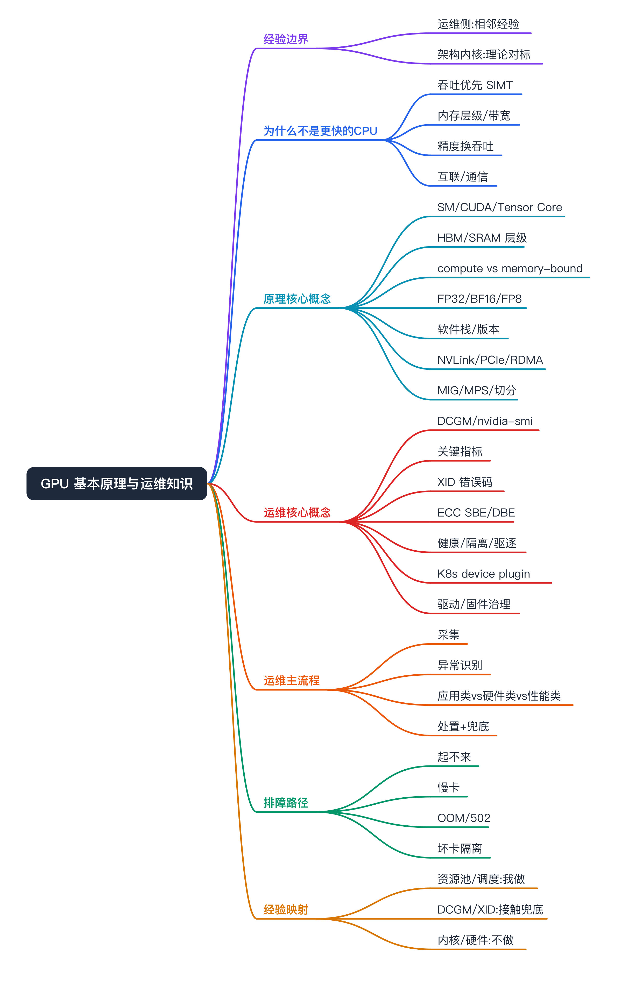
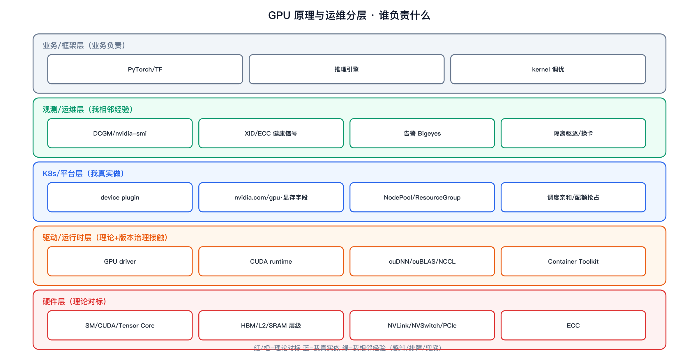
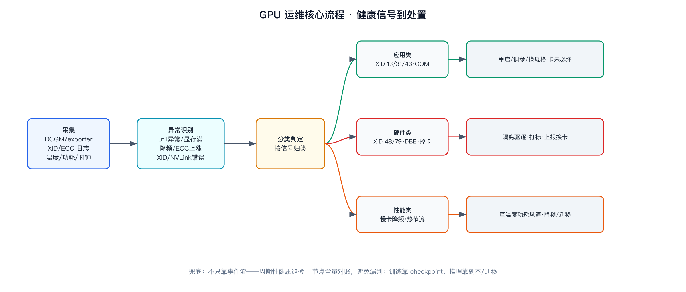
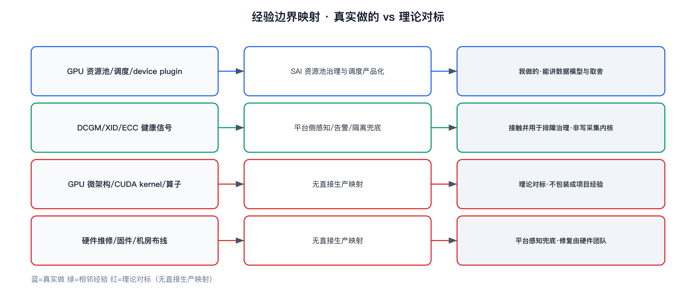

GPU 基本原理与运维知识（面试对标）



```yaml
experience_level: adjacent_production_experience
# 运维侧（资源池治理、GPU 排障、DCGM/XID/ECC 指标接触、K8s device plugin/调度）是我平台侧真实做过的相邻经验。
# 架构内核侧（SM 微体系结构、CUDA kernel 开发、显存调度内部实现、固件/硬件维修）是理论对标，不是我做的。
# 这篇把「GPU 为什么这么设计」和「平台/SRE 怎么运维它」拼成一篇基础底座，给散在各处的 GPU 文档补地基。
```

# 经验边界

先把边界说清楚，避免面试被一插到底击穿：

- **我真实做过的（相邻经验，能讲数据模型和取舍）**：SAI 平台侧 GPU 异构资源池治理（独占/共享显存/抢占/CPU 池）、K8s GPU device plugin 与资源池调度（nodeSelector/taint/affinity/`nvidia.com/gpu`）、GPU 排障入口与告警接入、训练/推理任务的 GPU 规格与挂载、接触过 DCGM/nvidia-smi 指标和 XID/ECC 这类信号做平台侧感知与兜底。
- **我没直接做过的（理论对标，不能包装）**：GPU 微体系结构（SM/warp 调度）调优、CUDA kernel / cuDNN 算子开发、显存分配器内部实现、底层硬件运维（掉卡修复、固件刷写、机房 NVLink/IB 布线）——平台侧能感知和兜底，修复不是我做的。
- **面试一句话**：「GPU 底层架构和内核我是对标理解；平台侧资源池治理、device plugin 调度、GPU 信号（DCGM/XID/ECC）感知和排障兜底是我真做的。哪些是真做、哪些是理论我会说清。」
- **配套文档**：稳定性体系见 [gpu-stability](../../apm-sre/gpu-stability/gpu-stability.md)、排障细节见 [gpu-troubleshooting](../gpu-troubleshooting/gpu-troubleshooting.md)、卡间/机间通信见 [gpu-rdma](../gpu-rdma/rdma.md)。本篇是它们共用的「原理 + 运维」地基。

# 为什么需要掌握

- **面试高频底座**：AI Infra / SRE 岗的 GPU 问题，几乎都从「GPU 和 CPU 有什么不一样、显存层级、为什么 memory-bound、怎么监控、XID 是什么」起步，答不好后面的稳定性/排障/调度都立不住。
- **和我经验相邻**：我做的是 GPU 资源池治理和排障兜底，理解 GPU 原理才能解释「为什么资源池这么切、为什么共享显存有风险、为什么这张卡要驱逐」。
- **能解释云托管能力背后的通用语义**：把「平台帮我选了卡、做了健康检查」翻译成「GPU 的算力/显存/互联/健康信号本来要解决什么」。

# 它解决什么问题（GPU 为什么不是「更快的 CPU」）

按问题域理解，而不是背参数：

- **要同时算海量同构运算（矩阵乘 / 张量）**
  - 对应设计：GPU 用大量简单核（SIMT），CPU 用少量复杂核（重缓存/分支预测/乱序）。GPU 牺牲单线程延迟换吞吐。
  - 面试表达：CPU 优化「一件事多快做完」，GPU 优化「同样的事一次做多少」。
- **数据搬运比计算更容易成为瓶颈**
  - 对应设计：多级内存层级（寄存器 → shared memory/SRAM → L2 → HBM 显存），越近越快越小。大模型推理常是 memory-bound（卡在显存带宽，不是算力）。
  - 面试表达：很多「GPU 没跑满」其实是算力在等数据，看的是带宽不是 util。
- **精度可以换吞吐和显存**
  - 对应设计：FP32 → TF32 → FP16/BF16 → FP8/INT8，精度降低换更高吞吐和更省显存，Tensor Core 专门加速低精度矩阵乘。
  - 面试表达：训练常用 BF16 混合精度，推理常用 FP16/INT8 量化，是拿精度换成本。
- **单卡装不下 / 算不动，要多卡多机协同**
  - 对应设计：卡间 NVLink/NVSwitch、卡-主机 PCIe、机间 RDMA/InfiniBand；配合 NCCL 做集合通信。
  - 面试表达：分布式训练/大模型推理的瓶颈经常在通信而不是算力，详见 [gpu-rdma](../gpu-rdma/rdma.md)。
- **GPU 又贵又会坏，要能治理和兜底**
  - 对应设计：DCGM/XID/ECC 健康信号 + 资源池/配额/调度 + 隔离驱逐。这是运维侧的主场，也是我做的部分。

# 核心概念

## 原理侧（理论对标）

- **SIMT / warp**
  - 解释：GPU 以 warp（通常 32 线程）为单位锁步执行同一指令。分支发散（warp 内走不同分支）会串行化，降低效率。
  - 面试展开：为什么 GPU 不擅长大量分支逻辑。
- **SM（Streaming Multiprocessor）/ CUDA Core / Tensor Core**
  - 解释：SM 是 GPU 的基本计算单元，内含大量 CUDA Core（通用浮点）和 Tensor Core（专做低精度矩阵乘累加）。
  - 面试展开：Tensor Core 为什么让 FP16/BF16/FP8 矩阵乘快一个量级。
- **内存层级与带宽**
  - 解释：寄存器/shared memory（片上 SRAM，快、小）→ L2 → HBM（显存，大、相对慢）。HBM 带宽决定 memory-bound 任务的上限。
  - 面试展开：KV Cache、激活值放显存，长上下文吃带宽不是吃算力。
- **compute-bound vs memory-bound / 算术强度（Roofline）**
  - 解释：每读一字节数据能做多少次计算（算术强度）决定瓶颈在算力还是带宽。Roofline 把两者画在一张图上。
  - 面试展开：Prefill 偏 compute-bound、Decode 偏 memory-bound，正是 PD 分离的动机（见 [pd-separation](../pd-separation/pd-separation.md)）。
- **数值精度**
  - 解释：FP32/TF32/FP16/BF16/FP8/INT8。BF16 动态范围大、训练稳；FP16 精度高范围小；FP8/INT8 多用于推理量化。
  - 面试展开：混合精度训练为什么用 BF16 + FP32 master weights。
- **软件栈与版本依赖**
  - 解释：GPU driver → CUDA runtime/toolkit → cuDNN/cuBLAS/NCCL → 框架（PyTorch/TF）。driver 向下兼容 CUDA 有版本约束，容器里还要 NVIDIA Container Toolkit 把驱动透传进去。
  - 面试展开：「镜像里 CUDA 和宿主 driver 不匹配」是最常见的起不来原因之一。
- **互联：NVLink/NVSwitch / PCIe / RDMA**
  - 解释：NVLink/NVSwitch 卡间高带宽直连；PCIe 卡与主机；RDMA/IB 跨机绕过 CPU/内核直达显存。
  - 面试展开：多卡 all-reduce 走 NVLink 还是 PCIe，吞吐差很多；细节见 [gpu-rdma](../gpu-rdma/rdma.md)。
- **GPU 共享与切分：MIG / MPS / time-slicing**
  - 解释：MIG 把一张卡硬切成多个隔离实例（硬隔离）；MPS 多进程共享算力（软隔离、有干扰）；time-slicing 时间片轮转（无显存隔离，风险高）。
  - 面试展开：共享显存池为什么有「邻居打爆显存」风险，对应资源池怎么治理。

## 运维侧（我相邻经验）

- **监控体系：nvidia-smi / DCGM**
  - 解释：nvidia-smi 看单机即时状态；DCGM 是生产级采集（指标 + 健康检查 + 策略），对接 Prometheus/告警。
  - 面试展开：生产不靠人 ssh 看 nvidia-smi，靠 DCGM exporter 出指标。
- **关键指标**
  - 解释：GPU util、显存使用、温度、功耗、SM 时钟、ECC 计数、XID 事件、NVLink/PCIe 错误。
  - 面试展开：GPU util 高 ≠ 算力跑满（可能是 memory-bound 在等数据），要结合带宽/SM 占用看。
- **XID 错误码**
  - 解释：driver 报给内核日志的 GPU 事件码。常见如 13（图形/非法访问，常应用 bug）、31（GPU 内存页错误）、43（GPU 停止响应/应用错误）、48（双比特 ECC，硬件）、63/64（ECC row remap）、79（GPU 掉总线/掉卡，硬件）。
  - 面试展开：要会分「应用类 XID（重启任务）」和「硬件类 XID（隔离换卡）」。
- **ECC 错误**
  - 解释：单比特可纠（SBE，记录不致命）、双比特不可纠（DBE，数据已坏，要隔离）；持续坏的显存行做 row remapping，remap 资源耗尽要换卡。
  - 面试展开：DBE/XID 48 出现应当把卡隔离驱逐，不是重启了事。
- **健康检查 / 隔离 / 驱逐**
  - 解释：检测掉卡、慢卡、温度墙/功耗墙降频、ECC/XID 异常后，把节点/卡打标 unschedulable、驱逐任务、上报换卡。
  - 面试展开：慢卡（没坏但降频）最难，会拖垮整个训练 job 而不报错。
- **K8s 上的 GPU**
  - 解释：NVIDIA device plugin 把 `nvidia.com/gpu` 暴露成可调度资源；共享显存用厂商扩展字段（如 `aliyun.com/gpu-mem`）；平台用 NodePool/ResourceGroup + nodeSelector/taint/affinity 把资源池产品化。
  - 面试展开：K8s 默认只能整卡调度，共享/切分要靠 device plugin 扩展或 MIG。
- **驱动/固件/版本治理**
  - 解释：driver、CUDA、容器 toolkit、固件版本要统一管理，节点维护要 cordon/drain。
  - 面试展开：版本漂移是「同样镜像在 A 节点跑 B 节点不跑」的常见根因。

# 原理与运维架构



自底向上看，并标清每层谁负责：

- **硬件层（理论对标）**：SM/CUDA Core/Tensor Core、HBM 显存与内存层级、NVLink/NVSwitch/PCIe、ECC。这层我是理解，不做内核和硬件。
- **驱动/运行时层（理论对标 + 版本治理我接触）**：GPU driver、CUDA runtime、cuDNN/cuBLAS/NCCL、NVIDIA Container Toolkit。版本兼容是平台排障常踩点。
- **K8s/平台层（我真实做）**：device plugin、`nvidia.com/gpu`/显存字段、NodePool/ResourceGroup 资源池、调度亲和、配额抢占。
- **观测/运维层（我相邻经验）**：DCGM/nvidia-smi 指标、XID/ECC 健康信号、告警（Bigeyes）、隔离驱逐与换卡流程。
- **业务/框架层（业务负责）**：PyTorch/TF、推理引擎、kernel 调优，这层不是我。

# GPU 运维核心流程



运维主链路：采集 → 异常识别 → 分类 → 处置 → 兜底，按「症状 → 信号 → 判定 → 动作」走：

- **采集**：DCGM exporter 出指标到 Prometheus；XID/ECC 从 driver/内核日志采集；温度/功耗/时钟常态监控。
- **异常识别**：util 异常低（可能 memory-bound 或掉卡）、显存接近上限、温度/功耗墙降频、ECC 计数上涨、XID 事件、NVLink/PCIe 错误。
- **分类（关键一步）**：
  - 应用类（XID 13/31/43、OOM）→ 多为任务自身问题，重启/调参/换规格，卡不一定坏。
  - 硬件类（XID 48/79、DBE、掉卡、remap 耗尽）→ 隔离驱逐、打标 unschedulable、上报换卡。
  - 性能类（慢卡降频、热节流）→ 排查温度/功耗/风道，必要时降频或迁移。
- **处置**：平台把卡/节点打 cordon、驱逐受影响任务、状态回写、告警通知；训练任务靠 checkpoint 重启，推理任务靠副本/迁移兜底。
- **兜底**：不能只靠事件流，要有周期性健康巡检 + 节点全量对账，避免漏判。

# 如果让我做平台侧 GPU 运维，我会怎么设计

不声明已全做，讲设计思路：

- **资源池产品化**：按 GPU 型号/独占/共享/抢占切 NodePool/ResourceGroup，把节点标签污点收敛成「选资源池」，避免用户碰底层字段。
- **健康闭环**：DCGM 指标 + XID/ECC 采集 → 分类规则（应用类 vs 硬件类 vs 性能类）→ 自动打标驱逐 → 换卡工单 → 状态回写平台。
- **共享显存治理**：共享池要有显存配额和「邻居打爆」隔离，关键业务走独占或 MIG 硬隔离。
- **版本治理**：driver/CUDA/toolkit 基线统一，镜像与节点版本兼容校验前置，节点维护标准化 cordon/drain。
- **可观测兜底**：分层指标（平台/驱动/硬件）+ 慢卡检测（没坏但降频要能发现）+ 周期性巡检对账。
- **风险控制**：驱逐前确认 checkpoint/副本能兜，避免「为治理误杀业务」。

# 如果线上出问题，我怎么排查

可操作路径（命令要说清看什么）：

- **任务起不来 / 用不了 GPU**：先看 Pod 是否分到 `nvidia.com/gpu`（资源请求 vs 资源池余量）→ `nvidia-smi` 在容器内是否能看到卡（device plugin/toolkit 透传）→ 镜像 CUDA 与宿主 driver 版本是否匹配 → 挂载/权限。重点分「调度没给卡」还是「给了卡用不了」。
- **训练变慢但不报错（疑似慢卡）**：对比同 job 各 rank 的 GPU util/SM 时钟/温度 → 看是否有卡降频（热节流/功耗墙）→ 看 NCCL/通信是否成为瓶颈（NVLink/PCIe 错误）。重点找掉队的那张卡。
- **推理实例 OOM / 502**：看显存使用曲线（是否泄漏/碎片）→ XID 31/43 → batch/KV Cache 是否超规格 → 是否共享池被邻居打爆。重点分「显存不够」还是「卡本身异常」。
- **卡疑似坏了**：看 XID（48/79=硬件，13/31/43=多为应用）→ ECC SBE/DBE 计数和 remap 余量 → 掉卡（nvidia-smi 是否还能枚举）。硬件类直接隔离换卡，不要反复重启。
- **收尾**：把底层信号翻译成用户能懂的结论（「这张卡硬件故障已隔离换卡，请用 checkpoint 重启」），而不是丢一串 XID 给业务。

# 和我现有经验的映射



- **GPU 资源池/调度/device plugin**：真实经验映射 = SAI GPU 资源池治理与调度产品化；能怎么说 = 我做的，能讲数据模型和取舍。
- **DCGM/XID/ECC 健康信号**：真实经验映射 = 平台侧感知/告警/隔离兜底；能怎么说 = 我接触并用于排障和治理，不是我写采集内核。
- **GPU 微体系结构 / CUDA kernel / cuDNN 算子**：无直接生产映射；能怎么说 = 理论对标，理解原理与取舍，不包装成项目经验。
- **硬件维修 / 固件 / 机房布线**：无直接生产映射；能怎么说 = 平台侧能感知和兜底，修复由硬件团队做。

# 面试话术

主回答：GPU 和 CPU 的根本区别是「吞吐优先 vs 延迟优先」——大量简单核做同构并行，配多级内存层级，所以很多任务是 memory-bound 而不是 compute-bound。运维上，生产靠 DCGM 出指标、靠 XID/ECC 判健康，区分应用类故障（重启任务）和硬件类故障（隔离换卡），平台侧把这些收敛成资源池、调度和健康闭环。我生产里做的是平台侧资源池治理、device plugin 调度和 GPU 信号的感知与排障兜底；GPU 微架构和 CUDA kernel 是我对标理解的部分，不是我写的。

短答：

- 你做过 GPU 底层吗？平台侧资源池/调度/排障兜底是我做的，微架构和 kernel 是理论对标。
- GPU util 高就是跑满了吗？不一定，可能 memory-bound 在等数据，要结合带宽/SM 占用看。
- XID 怎么用？分应用类（重启任务）和硬件类（隔离换卡），别一律重启。
- 共享显存有什么风险？邻居打爆显存、缺硬隔离，关键业务走独占或 MIG。
- 任务起不来先看什么？资源池余量、device plugin 透传、CUDA 与 driver 版本匹配。

# 不能怎么说

| 不要这么说 | 风险 | 应该这么说 |
|---|---|---|
| 我做过 GPU 内核 / CUDA 算子优化 | 没源码和线上证据会被击穿 | 我理解原理和取舍，做的是平台侧资源池与运维 |
| 掉卡是我修的 | 硬件维修不是平台职责 | 平台侧感知、隔离、驱逐、上报换卡，修复由硬件团队 |
| GPU util 100% 就是充分利用 | 暴露对 memory-bound 理解不足 | util 高不等于算力跑满，要看带宽和 SM 占用 |
| 共享 GPU 没风险，利用率高就行 | 忽略隔离和邻居干扰 | 共享要有显存配额和隔离，关键业务用独占/MIG |
| 出 XID 重启就好 | 把硬件故障当应用故障 | 先分应用类 vs 硬件类，硬件类要隔离换卡 |

# 高频 QA

- **GPU 为什么比 CPU 适合深度学习？** 大量简单核做同构并行 + 高带宽显存 + Tensor Core 加速低精度矩阵乘，吞吐优先。
- **什么是 memory-bound，为什么重要？** 瓶颈在显存带宽而非算力，大模型推理（尤其 Decode/长上下文）常是 memory-bound，加算力没用。
- **BF16 和 FP16 区别？** BF16 动态范围大、训练更稳；FP16 尾数多、范围小易溢出。训练偏 BF16，推理常 FP16/量化。
- **NVLink 和 PCIe、RDMA 各是什么？** NVLink 卡间高带宽直连，PCIe 卡-主机，RDMA 跨机绕内核直达显存；多卡通信走哪条差距很大。
- **MIG、MPS、time-slicing 区别？** MIG 硬隔离切实例，MPS 软隔离共享算力有干扰，time-slicing 时间片无显存隔离风险最高。
- **DCGM 是干什么的？** 生产级 GPU 指标采集 + 健康检查 + 策略，对接 Prometheus/告警，替代人工 nvidia-smi。
- **XID 是什么，怎么用？** driver 报的 GPU 事件码，要分应用类（重启）和硬件类（隔离换卡）。
- **ECC SBE 和 DBE 区别？** SBE 可纠不致命，DBE 不可纠数据已坏要隔离；坏行做 remap，remap 耗尽换卡。
- **慢卡为什么难处理？** 没坏但降频（热/功耗墙），不报错却拖垮整个训练 job，要靠对比各 rank 指标发现。
- **容器里用不了 GPU 先查什么？** device plugin/Container Toolkit 是否透传、镜像 CUDA 与宿主 driver 版本是否匹配、资源是否分到。
- **K8s 怎么调度 GPU？** device plugin 暴露 `nvidia.com/gpu`，默认整卡；共享/切分靠扩展字段或 MIG，平台再做资源池抽象。
- **GPU 利用率低一定是浪费吗？** 不一定，可能 memory-bound 或通信等待；要结合带宽、SM 占用和阶段特征判断。

# 面试前检查清单

- [ ] 我明确声明了：运维侧是相邻经验、架构内核侧是理论对标。
- [ ] 我没编造做过 CUDA kernel / 硬件维修 / 性能收益数据。
- [ ] 我能 30 秒讲清 GPU vs CPU、内存层级、memory-bound。
- [ ] 我能讲清 DCGM/XID/ECC 怎么用于健康判断。
- [ ] 我能分应用类故障和硬件类故障并给不同处置。
- [ ] 我能讲共享 GPU（MIG/MPS/time-slicing）的隔离差异和风险。
- [ ] 我能按「症状→信号→判定→动作」讲 GPU 排障。
- [ ] 我能把 GPU 原理映射到 PD 分离/RDMA/资源池治理等已有文档。
- [ ] 含原理架构图、运维主流程图、经验边界图。
