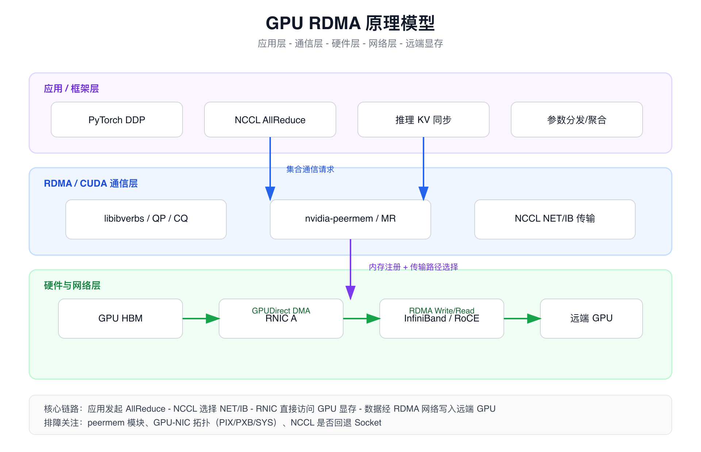
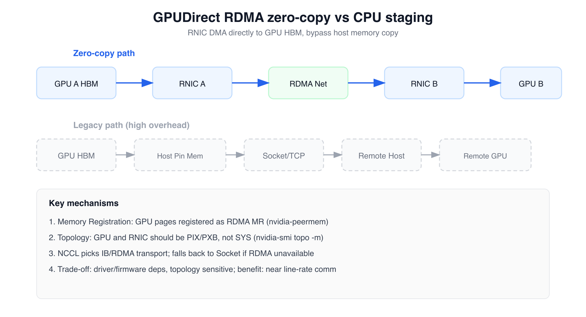
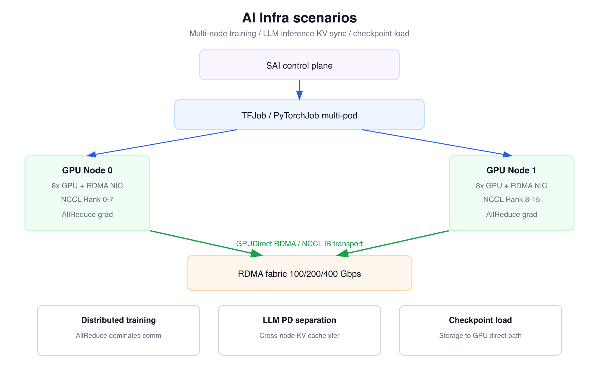
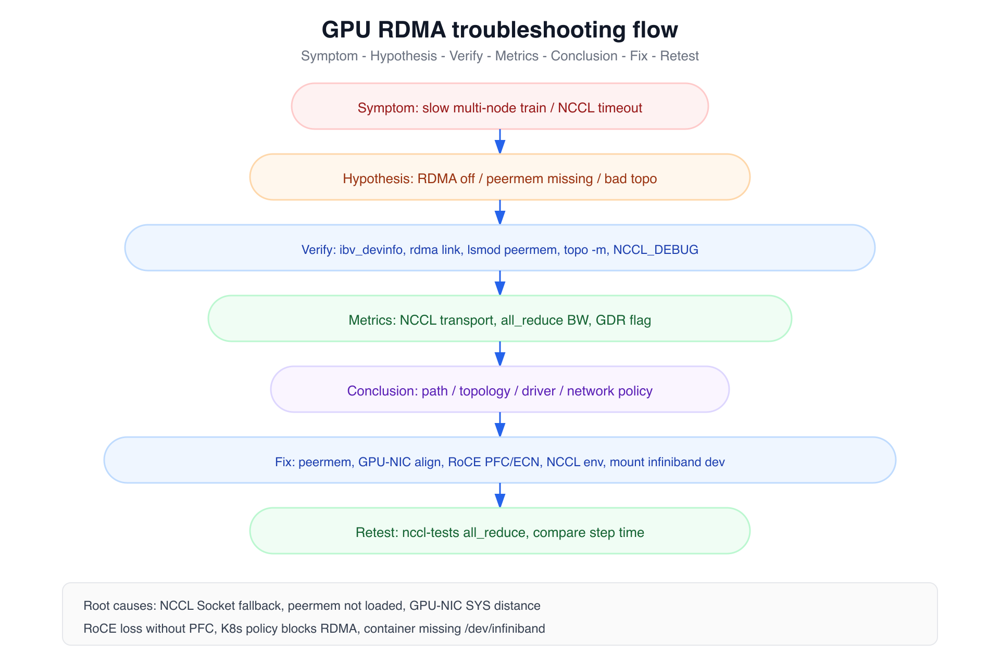
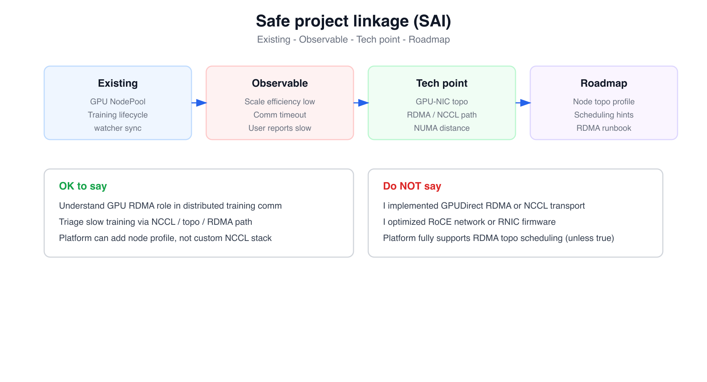

# 面试定位卡

- **技术点**：GPU RDMA 加速（RDMA + GPUDirect RDMA + NCCL 通信路径）
- **所属领域**：高性能网络、AI Infra、分布式训练、GPU 服务器拓扑
- **面试价值**：能证明你理解多机多卡训练“算力之外”的通信瓶颈，知道零拷贝、拓扑、NCCL 传输选择与排障闭环
- **常见考法**：RDMA 是什么、和 TCP 区别、GPUDirect RDMA 原理、为什么多机训练慢、NCCL 怎么选 IB、GPU-NIC 拓扑怎么看、RoCE 和 IB 区别
- **适合挂钩项目**：SAI 训推平台、GPU 资源池治理、TFJob/PyTorchJob 多机训练排障、节点拓扑画像、NUMA/GPU 节点治理
- **不适合夸大的地方**：不要说自己实现了 GPUDirect RDMA、自研 NCCL 传输层、优化了 RoCE 网络或 RNIC 固件；平台侧最多说理解、排障和后续拓扑治理演进

# 三十秒回答

> GPU RDMA 加速，本质是让 RDMA 网卡（RNIC）能直接读写 GPU 显存，而不是先把数据拷到 Host 内存再走 Socket。
> 它解决的是多机多卡训练、大模型跨节点通信时 CPU 拷贝和协议栈开销大、带宽利用率低的问题。
> 代价是对驱动（nvidia-peermem）、GPU-NIC 拓扑、RoCE/IB 网络配置敏感，排障链路长。
> 面试里重点不是背 Verbs API，而是说清「零拷贝路径 → NCCL 怎么选传输 → 拓扑不对会怎样 → 怎么验证是不是 RDMA 路径」。

# 为什么需要它

- **没有它之前的问题**：多机训练梯度同步走 TCP/Socket，数据要从 GPU 显存拷到 Host，再经内核协议栈发送，CPU 参与多、延迟高、带宽难打满。
- **它的解决方式**：RDMA 让 RNIC 直接访问远端内存；GPUDirect RDMA 进一步让 RNIC 直接访问 GPU 显存，NCCL 等框架走 IB/RoCE 传输，接近线速。
- **它引入的新问题**：依赖 peermem 内核模块、GPU 与 NIC 的 PCIe 拓扑、RoCE 丢包需 PFC/ECN、容器需挂载 infiniband 设备；配置不当会静默回退 Socket。
- **必须关注的场景**：分布式训练 AllReduce、大模型 PD 分离跨节点 KV、多机推理参数同步、Checkpoint 大文件加载、任何「GPU 利用率不高但 step time 很长」的通信瓶颈。

# 核心概念表

- **RDMA**
  - 解释：Remote Direct Memory Access，远端 CPU 不经由本地 CPU 即可读写本地内存
  - 面试展开点：强调「绕过 CPU 和内核协议栈」，不是「远程桌面」
- **RNIC / HCA**
  - 解释：支持 RDMA 的智能网卡，如 Mellanox ConnectX 系列
  - 面试展开点：数据面由网卡 DMA 完成，CPU 只做控制面
- **Verbs API**
  - 解释：libibverbs 提供的 RDMA 编程接口：QP、CQ、MR、PD 等
  - 面试展开点：面试一般点到 MR（内存注册）和 QP（队列对）即可
- **Memory Region (MR)**
  - 解释：注册可被 RDMA 访问的内存区域，需 pin 住物理页
  - 面试展开点：GPU 显存注册需 nvidia-peermem
- **GPUDirect RDMA**
  - 解释：NVIDIA 技术，允许第三方 PCIe 设备（如 RNIC）直接 DMA GPU 显存
  - 面试展开点：是 GPUDirect 家族一员，区别于 P2P、Storage
- **GPUDirect P2P**
  - 解释：同节点 GPU 之间或 GPU 与 NIC 的 PCIe P2P 访问
  - 面试展开点：节点内通信用 NVLink/P2P，节点间才靠 RDMA
- **InfiniBand (IB)**
  - 解释：原生 RDMA 网络，低延迟、无损
  - 面试展开点：常见于 HPC 集群、云厂商 HPC 实例
- **RoCE**
  - 解释：RDMA over Converged Ethernet，在以太网上跑 RDMA
  - 面试展开点：需 PFC/ECN 防丢包，运维复杂度高于 IB
- **NCCL**
  - 解释：NVIDIA 集合通信库，多机训练自动选 IB/Socket 等传输
  - 面试展开点：排障看 NCCL_DEBUG、是否走 NET/IB
- **GPU-NIC 拓扑**
  - 解释：`nvidia-smi topo -m` 显示的 PIX/PXB/SYS 等距离
  - 面试展开点：SYS 表示跨 Socket/远端，RDMA 性能会差
- **nvidia-peermem**
  - 解释：内核模块，使 GPU 显存可被 RNIC 注册为 MR
  - 面试展开点：`lsmod | grep peermem`，缺失则 GDR 不可用
- **GDR**
  - 解释：GPU Direct RDMA 的简称，NCCL 环境变量 NCCL_IB_GDR_LEVEL 控制
  - 面试展开点：level 0 禁用 GDR，回退 Host 中转

# 原理模型



## 底层 / 硬件 / 基础设施层

GPU 显存（HBM）挂在 PCIe 上，RDMA 网卡（RNIC）也挂在 PCIe Root Complex 下。GPUDirect RDMA 要求 RNIC 能通过 PCIe P2P 或 IOMMU 映射直接对 GPU 显存发起 DMA，而不经过 Host DRAM 做中转。

节点间通过 InfiniBand 或 RoCE  fabric 互联，带宽常见 100/200/400 Gbps。拓扑上 GPU 与 NIC 越近（PIX、PXB），延迟越低；跨 Socket（SYS）时即使 RDMA 可用，有效带宽也会明显下降。

## 操作系统 / 框架层

Linux 侧需要 `ib_core`、`mlx5_core` 等 RDMA 驱动，以及 `nvidia_peermem`（或旧版 `nvidia-peermem`）把 GPU 页注册给 RNIC。用户态通过 `libibverbs` 创建 QP、注册 MR、发起 RDMA Write/Read。

NCCL、MPI（OpenMPI + UCX）等框架在 multi-node 场景自动探测 IB 设备，优先选 `NET/IB` 传输；探测失败则回退 `NET/Socket`，性能可能差一个数量级。

## 容器 / Kubernetes 层

Pod 要使用 RDMA，通常需要：

- 挂载 `/dev/infiniband`（或 uverbs 设备）
- 镜像/节点安装 `rdma-core`、`libibverbs`
- 部分集群用 SR-IOV、Multus、RDMA Device Plugin 把 VF 注入 Pod
- 网络策略不能阻断 RoCE 的 UDP 4791 等端口

容器不会消除宿主机 GPU-NIC 拓扑约束；调度把 Pod 放到拓扑差的节点，通信性能仍会差。

## AI Infra 层

分布式训练中，每个 step 的梯度 AllReduce 是通信大头。GPU 计算再快，若 NCCL 走 Socket 或 GDR 未生效，多机扩展效率（scaling efficiency）会快速下降。

大模型推理 PD 分离、跨节点 KV Cache 传输、Checkpoint 从存储到 GPU，也都会受益于「NIC 直达 GPU 显存」的通路，但实现栈可能涉及 GPUDirect Storage 等不同技术点。

# 关键机制



## GPUDirect RDMA 零拷贝

解决的问题：

消除 GPU 显存与网络之间经 Host 内存的双向拷贝，降低 CPU 占用和延迟。

工作方式：

训练框架（如 NCCL）把 GPU buffer 注册为 RDMA MR（依赖 nvidia-peermem）。发送端 RNIC 直接从 GPU 显存 DMA 数据到网络；接收端 RNIC 直接写入远端 GPU 显存。

代价：

要求 GPU 与 RNIC 拓扑可达、驱动版本匹配；注册显存有额外开销；排障时要确认 GDR 真的生效而不是静默回退。

面试追问：

怎么确认 NCCL 在用 GPUDirect RDMA？可以看 `NCCL_DEBUG=INFO` 日志里的 GDR/NET/IB 信息，结合 `NCCL_IB_GDR_LEVEL` 和 peermem 模块。

## 内存注册（Memory Registration）

解决的问题：

RDMA 网卡只能访问已注册、物理地址固定的内存区域，不能随意访问虚拟地址。

工作方式：

Host 内存注册为 MR 时页被 pin 住；GPU 显存通过 peermem 驱动导出给 RNIC。未注册的内存不能直接用于 RDMA。

代价：

注册有成本；大量小 buffer 注册效率低；GPU 显存注册失败时框架会回退到 Host 中转路径。

面试追问：

为什么有了 RDMA 还要谈注册？因为 RDMA 的安全模型要求网卡只访问明确授权的物理页，注册就是授权边界。

## RDMA 队列对（QP）与异步完成

解决的问题：

让 CPU 不必为每个网络包忙等，提高并发与带宽利用率。

工作方式：

应用或 NCCL 把发送/接收请求 post 到 QP，RNIC 异步执行；完成事件通过 CQ 通知 CPU。CPU 只做提交和收割，不参与数据拷贝。

代价：

QP/CQ 资源有限；配置不当会导致重试、超时；需要结合网卡计数器和 NCCL 日志排障。

面试追问：

RDMA 和「多线程发 Socket」本质区别？RDMA 数据面几乎不占 CPU，Socket 数据面要经过内核协议栈和多次拷贝。

## GPU-NIC 拓扑感知

解决的问题：

同节点上 GPU 与 RNIC 的 PCIe 距离影响 GPUDirect RDMA 带宽和延迟。

工作方式：

`nvidia-smi topo -m` 显示 GPU 与 NIC 关系：NV# 表示 NVLink，PIX/PXB 表示 PCIe 交换机层级，SYS 表示跨 CPU Socket。NCCL 和调度器可据此选择更近的 NIC。

代价：

拓扑差的机器「能跑但很慢」；需要节点画像和调度 hint，不能只看 GPU 数量。

面试追问：

SYS 和 PIX 差多少？不必背具体数字，强调 SYS 跨 Socket/远端 PCIe，有效带宽和延迟明显差于 PIX/PXB。

## NCCL 传输选择与回退

解决的问题：

让用户态训练代码不必手写 Verbs，由 NCCL 自动选最优多机传输。

工作方式：

NCCL 启动时探测 IB 设备、GDR 能力、拓扑；优先 `NET/IB` + GDR；失败则用 `NET/Socket`。环境变量如 `NCCL_IB_DISABLE`、`NCCL_SOCKET_IFNAME` 可强制或限制路径。

代价：

静默回退 Socket 时用户可能只看到「训练慢」；需要主动打日志和跑 nccl-tests 验证。

面试追问：

如何强制对比 RDMA 和 Socket？可设 `NCCL_IB_DISABLE=1` 对比 all_reduce 带宽，但不要在生产随意改。

# 横向对比

- **TCP Socket vs RDMA**
  - 区别：Socket 经内核协议栈、多次拷贝；RDMA 用户态直驱网卡、零拷贝
  - 什么时候用：通用互联网通信用 TCP；HPC/AI 多机通信用 RDMA
  - 面试注意点：RDMA 不是替代所有网络，只适合内存语义、低延迟大块传输
- **Host 中转 vs GPUDirect RDMA**
  - 区别：前者 GPU→Host→NIC；后者 GPU→NIC 直传
  - 什么时候用：多机训练、大 KV 跨节点
  - 面试注意点：回退 Host 中转时带宽常掉一个数量级
- **InfiniBand vs RoCE**
  - 区别：IB 原生无损 RDMA；RoCE 跑在以太网，需防丢包
  - 什么时候用：HPC 集群多用 IB；企业数据中心常见 RoCE
  - 面试注意点：RoCE 排障要会看 PFC/ECN、丢包计数器
- **NCCL IB vs NCCL Socket**
  - 区别：IB 走 RDMA verbs；Socket 走 TCP
  - 什么时候用：NCCL 自动选，排障时人工对比
  - 面试注意点：看到「能跑」不等于「走 RDMA」
- **GPUDirect P2P vs GPUDirect RDMA**
  - 区别：P2P 同节点 GPU/GPU 或 GPU/NIC；RDMA 跨节点
  - 什么时候用：节点内 NVLink/P2P；节点间 RDMA
  - 面试注意点：不要混为一谈
- **NVLink vs RDMA**
  - 区别：NVLink 是节点内 GPU 互联；RDMA 是节点间
  - 什么时候用：单机多卡用 NVLink；多机用 RDMA
  - 面试注意点：多机训练两者都重要，各管一段
- **理论带宽 vs 生产带宽**
  - 区别：网卡标称 400G 不等于 NCCL 能跑满
  - 什么时候用：用 nccl-tests 实测
  - 面试注意点：拓扑、PCIe、CPU、算法都会影响有效带宽

# 典型业务场景



- **分布式训练 AllReduce**
  - 为什么相关：每 step 梯度同步占通信大头
  - 可能现象：加机器后 step time 下降不明显；GPU 利用率周期性掉沟
  - 排查方式：NCCL_DEBUG、nccl-tests、peermem、topo -m
  - 优化方向：确保 IB/GDR 路径；对齐 GPU-NIC；调 bucket/size
- **大模型 PD 分离**
  - 为什么相关：Prefill/Decode 跨节点传 KV
  - 可能现象：推理 P99 高、跨节点延迟大
  - 排查方式：业务链路 + 网络带宽 + RDMA 是否可用
  - 优化方向：同 rack 部署；RDMA 传 KV；减少跨 AZ
- **多机推理张量并行**
  - 为什么相关：激活值跨节点频繁交换
  - 可能现象：吞吐随卡数扩展差
  - 排查方式：同训练场景 NCCL/MPI 排障
  - 优化方向：拓扑感知调度；选 NVLink+RDMA 友好机型
- **TFJob / PyTorchJob on K8s**
  - 为什么相关：Pod 可能未挂 infiniband、未装驱动
  - 可能现象：Job 能跑但极慢；日志无 IB 字样
  - 排查方式：检查 device mount、镜像、RDMA Device Plugin
  - 优化方向：Chart/Operator 模板固化 RDMA 资源
- **Checkpoint 加载**
  - 为什么相关：大文件进 GPU，GPUDirect Storage 相关
  - 可能现象：恢复训练启动慢
  - 排查方式：存储协议、GDS 支持情况
  - 优化方向：与 RDMA 区分，别混答成同一技术
- **RoCE 生产网络**
  - 为什么相关：丢包导致 RDMA 重传、NCCL 超时
  - 可能现象：偶发 hang、超时
  - 排查方式：`rdma link`、`ethtool`、PFC 配置
  - 优化方向：网络团队协同 PFC/ECN

# 排障路径



- **症状**：多机训练 step time 长、加节点扩展效率低、NCCL 超时/hang、nccl-tests 带宽远低于网卡标称
- **初始假设**：RDMA 未启用、GDR 未生效、GPU-NIC 拓扑差、RoCE 丢包、容器未挂载 IB 设备
- **验证命令**：ibv_devinfo、rdma link、lsmod peermem、nvidia-smi topo -m、NCCL_DEBUG=INFO、nccl-tests
- **关键指标**：NCCL 传输类型（NET/IB vs NET/Socket）、all_reduce 实测 GB/s、GDR flag、网卡/port 错误计数
- **可能结论**：路径问题、拓扑问题、驱动/模块问题、网络策略问题、或算法/批量本身瓶颈
- **优化动作**：加载 peermem、对齐 GPU-NIC、修 RoCE PFC、挂 infiniband、调 NCCL 环境变量、调度到拓扑友好节点
- **复测方式**：对比优化前后 nccl-tests 带宽、训练 step time、多机 scaling efficiency

## 确认 RDMA 设备与链路

```bash
ibv_devinfo
rdma link show
```

这条命令用于验证什么：

确认节点上 RNIC 是否被识别、端口是否 ACTIVE、链路速率是否正常。

重点看什么：

是否有 mlx5 等设备；`state ACTIVE`；预期速率（如 200G/400G）。

异常说明什么：

无设备或 DOWN 状态说明驱动、线缆、交换机或 SR-IOV 配置有问题，NCCL 很可能走 Socket。

## 确认 GPUDirect RDMA 内核支持

```bash
lsmod | grep -E 'nvidia_peermem|nvidia-peermem'
```

这条命令用于验证什么：

确认 GPU 显存能否被 RNIC 注册为 RDMA MR。

重点看什么：

模块是否加载；无输出则 GDR 通常不可用。

异常说明什么：

NCCL 可能仍用 IB 传输，但数据经 Host 中转，带宽和 CPU 占用都会变差。

## 查看 GPU-NIC 拓扑

```bash
nvidia-smi topo -m
```

这条命令用于验证什么：

确认每块 GPU 与哪张 NIC 最近，以及 GPU 间是 NVLink 还是 PCIe/SYS。

重点看什么：

GPU 到 NIC 是 PIX/PXB 还是 SYS；多 NIC 时 NCCL 是否选对接口。

异常说明什么：

大量 SYS 说明 GPU 与 NIC 跨 Socket，即使 RDMA 可用，有效带宽也可能明显低于预期。

## 查看 NCCL 传输路径

```bash
export NCCL_DEBUG=INFO
export NCCL_DEBUG_SUBSYS=INIT,NET
# 启动训练或运行 nccl-tests
```

这条命令用于验证什么：

确认 NCCL 是否使用 IB、是否启用 GDR、用的哪张网卡。

重点看什么：

`NET/IB` vs `NET/Socket`；`GDR` 相关日志；`NCCL WARN` 回退信息。

异常说明什么：

若出现 Socket 或 GDR disabled，要回到 peermem、拓扑、环境变量继续查。

## 基准测试带宽

```bash
# 需在装有 nccl-tests 的环境
mpirun -np 8 --hostfile hosts ./build/all_reduce_perf -b 8M -e 1G -f 2 -g 1
```

这条命令用于验证什么：

用标准基准量化 AllReduce 有效带宽，排除业务代码干扰。

重点看什么：

algBW / busBW 是否接近网卡理论值；多机扩展时带宽是否线性。

异常说明什么：

带宽极低通常是传输路径或拓扑问题；带宽正常但训练慢可能是计算或其他同步瓶颈。

# 风险、边界和误区

每条格式为「说法/做法 → 问题 → 更稳妥的表达」：

- **「RDMA 就是快网络」** → 忽略了 MR 注册、拓扑、RoCE 丢包、回退路径 → RDMA 在「大块、低 CPU、拓扑正确」时优势明显
- **「有 400G 网卡训练就一定快」** → PCIe、拓扑、GDR、算法都会限制有效带宽 → 以 nccl-tests 和 step time 实测为准
- **「NCCL 默认一定走 RDMA」** → 可能静默回退 Socket → 必须看 NCCL_DEBUG 和基准测试验证
- **「GPUDirect 等于 GPUDirect RDMA」** → GPUDirect 是家族：P2P、RDMA、Storage → 说清楚你讲的是哪一种
- **「绑核就能解决多机通信慢」** → 节点间通信主要看 NIC 路径和 NCCL → 绑核主要影响节点内 CPU-GPU 数据准备
- **「我实现了 RDMA 加速」** → 极易夸大 → 说我理解原理，能排障 NCCL/RDMA 路径，平台可做拓扑治理
- **「RoCE 和 IB 是一回事」** → RoCE 运维复杂度高，丢包敏感 → IB 原生 RDMA；RoCE 是以太网上的 RDMA
- **「容器里装了 CUDA 就有 RDMA」** → 还需 rdma-core、设备挂载、peermem → K8s 场景要单独检查 RDMA 资源注入

# 和项目的安全连接



## 了解型说法

我理解 GPU RDMA 是分布式训练里「多机通信」的核心加速手段。SAI 平台托管 TFJob、PyTorchJob 等训练任务，底层多机通信依赖 NCCL 和节点 RDMA 能力，不是平台自己实现的协议栈。

## 排查型说法

如果用户反馈多机训练慢、扩展效率差，我会把问题拆到：NCCL 是否走 IB/GDR、peermem 是否加载、GPU-NIC 拓扑是否合理、Pod 是否挂载 infiniband。这些和平台控制面的关系是：平台负责把 Job 调度到正确资源池，但通信性能还取决于节点硬件和网络。

## 实践型说法

如果平台要演进，可以做 GPU 节点拓扑画像（`nvidia-smi topo -m` + NIC 列表写入 Node Label），对 RDMA 训练池做准入或 nodeSelector；在运维侧沉淀 RDMA 排障 Runbook，和 NUMA、GPU 资源池治理一起纳入 AI Runtime 可观测性。需要团队实际落地，不能说成已经全部实现。

## 不能说的话

不能说「我实现了 GPUDirect RDMA」「我优化了 NCCL」「我改了 RoCE 网络」。边界是：理解通信链路，能把训练慢的问题拆到 RDMA/NCCL/拓扑排查，平台侧可做资源池和拓扑治理演进。

# 面试追问树

```text
Q1：RDMA 是什么？和 TCP 有什么区别？
  └── Q2：为什么 AI 训练需要 RDMA，而不是普通以太网？
        └── Q3：GPUDirect RDMA 是什么？解决了哪一段路径？
              └── Q4：nvidia-peermem 是干什么的？
                    └── Q5：nvidia-smi topo -m 里 SYS 和 PIX 代表什么？
                          └── Q6：NCCL 怎么选择 IB 还是 Socket？
                                └── Q7：多机训练慢你怎么排查？
                                      └── Q8：这和你在 SAI 平台的工作怎么连接？
```

# 高频 Q&A

## RDMA 是什么？

RDMA 是远程直接内存访问。远端机器的网卡可以在几乎不占用本地 CPU 的情况下，直接读写本地内存。和 TCP 相比，它绕过了内核协议栈和多次内存拷贝，适合大块、低延迟的数据传输，常见于 HPC 和 AI 多机通信。

## RDMA 和 TCP 的核心区别？

TCP 要经过内核协议栈，数据多次在用户态和内核态之间拷贝，CPU 参与多。RDMA 由网卡 DMA 直接搬运数据，CPU 主要做控制面。代价是 RDMA 需要专用网卡、内存注册，对拓扑和网络配置更敏感。

## GPUDirect RDMA 是什么？

它是 NVIDIA GPUDirect 技术的一部分，让 RDMA 网卡可以直接访问 GPU 显存，而不先把数据拷到 Host 内存。多机训练里 NCCL 在开启 GDR 时会走这条路径，能显著降低通信延迟和提高有效带宽。

## 为什么多机训练加了机器，速度提升不明显？

常见原因是通信成为瓶颈，而且 NCCL 可能没走 IB/GDR，静默回退到了 Socket。也可能是 GPU-NIC 拓扑差、RoCE 丢包、peermem 没加载。我会先用 NCCL_DEBUG 和 nccl-tests 确认传输路径和带宽，再查拓扑和网络。

## nvidia-peermem 是干什么的？

它是内核模块，把 GPU 显存暴露给 RDMA 网卡做 Memory Registration。没有它，NCCL 可能仍用 IB 传输，但数据要经过 Host 中转，性能会差很多。排查时我会 `lsmod | grep peermem`。

## 怎么看 GPU 和网卡是否匹配？

用 `nvidia-smi topo -m`。看 GPU 到 NIC 的距离，PIX/PXB 表示较近，SYS 表示跨 Socket 较远。训练节点选型和高性能池准入时，应优先 GPU 与 RDMA NIC 距离近的机型。

## NCCL 怎么知道用 RDMA？

NCCL 启动时会探测 IB 设备和 GDR 能力，自动选 NET/IB 传输。可以用 `NCCL_DEBUG=INFO` 看实际选了什么。也可以用 `NCCL_IB_DISABLE=1` 做对比测试，但生产环境要谨慎。

## RoCE 和 InfiniBand 有什么区别？

InfiniBand 是原生 RDMA 网络，一般无损、延迟低。RoCE 是在以太网上承载 RDMA，复用现有以太网设施，但对丢包敏感，通常要配置 PFC、ECN。面试里知道 RoCE 排障更依赖网络团队即可。

## 容器里怎么用 RDMA？

需要节点有 RDMA 驱动和 peermem，容器挂载 infiniband 设备，镜像里有 rdma-core。K8s 上可能还要 RDMA Device Plugin 或 SR-IOV。只申请 GPU 资源不等于自动有 RDMA 能力。

## 和 NUMA 有什么关系？

GPU、RDMA NIC 都挂在 PCIe 和 NUMA 拓扑上。跨 NUMA Node 访问 GPU 或 NIC 会增加延迟。完整优化要同时看 NUMA 和 GPU-NIC topo，不只是 RDMA 本身。

## 线上如何快速判断是不是 RDMA 问题？

我会看三类证据：NCCL 日志是否 NET/IB 和 GDR；nccl-tests 带宽是否离谱地低；peermem 和 topo 是否正常。三者都正常但训练仍慢，就要往计算、数据加载、同步频率上查，避免过度归因 RDMA。

# 三档背诵版

## 三十秒版

GPU RDMA 加速是让 RDMA 网卡直接读写 GPU 显存，避免 Host 中转和 TCP 协议栈开销，主要服务多机训练的梯度同步。核心是 GPUDirect RDMA + NCCL IB 传输。代价是拓扑、驱动、网络配置敏感。面试重点：零拷贝路径、NCCL 传输选择、topo -m 排障。

## 三分钟版

多机训练通信量大，传统 Socket 路径要把 GPU 数据拷到 Host 再发，CPU 和带宽都浪费。RDMA 让网卡直接 DMA 内存；GPUDirect RDMA 进一步让网卡直接访问 GPU 显存，NCCL 自动选 IB 传输。

关键依赖：nvidia-peermem 注册 GPU 页、GPU-NIC 拓扑（topo -m）、容器挂载 infiniband。RoCE 还要注意丢包和 PFC。排障时先看 NCCL_DEBUG 是 NET/IB 还是 NET/Socket，再用 nccl-tests 测带宽，查 peermem 和拓扑。

和 SAI 平台的关系：平台托管训练 Job 和资源池，但不实现 NCCL。可以说理解通信瓶颈，能做节点拓扑画像和排障 Runbook，不能说自研了 RDMA。

## 五分钟版

从问题出发：分布式训练每 step 要做 AllReduce，通信量随模型和集群规模增长。Socket 路径多次拷贝、CPU 参与多，有效带宽难上去，表现为加机器后 step time 下降不明显。

原理上分四层：硬件上 GPU 和 RNIC 都在 PCIe 上，GPUDirect RDMA 要求两者拓扑可达；OS 上 peermem 把 GPU 显存注册给 RNIC；框架上 NCCL 用 Verbs 发 RDMA，失败回退 Socket；K8s 上还要设备挂载和 RDMA 资源注入。

关键机制包括：零拷贝、MR 注册、QP 异步、拓扑感知、NCCL 传输选择。和 TCP 比是数据面直驱；和 Host 中转比少两次拷贝；和 NVLink 比，NVLink 管节点内，RDMA 管节点间。

排障闭环：症状（慢/超时）→ 假设（路径/拓扑/驱动）→ 验证（ibv、peermem、topo、NCCL_DEBUG）→ 指标（带宽、传输类型）→ 优化 → nccl-tests 复测。

项目连接：SAI 有 GPU 资源池和训练生命周期，可以说平台侧做拓扑画像和调度 hint 是演进方向，能说排查型话术，不能把理解说成自研 NCCL 或 RDMA 栈。和 NUMA 结合时，强调 GPU-NIC-CPU 完整拓扑治理。

# 图示清单

- **`01_gpu_rdma_principle.png`**（P0）— 原理模型：应用、Verbs、GPUDirect、GPU/NIC、网络分层
- **`02_gpu_rdma_mechanism.png`**（P0）— 关键机制：零拷贝 vs Host 中转路径对比
- **`03_gpu_rdma_scenario.png`**（P0）— 典型业务场景：多机训练、PD 分离、SAI 控制面关系
- **`04_gpu_rdma_troubleshooting.png`**（P0）— 排障路径：症状到复测的闭环
- **`05_gpu_rdma_project_connection.png`**（P1）— 和项目的安全连接：了解/排查/实践/不能说的话

# 面试前检查清单

- [ ] 我能用三十秒讲清楚 GPU RDMA 是什么、解决什么问题。
- [ ] 我能解释 RDMA 和 TCP、Host 中转和 GPUDirect RDMA 的区别。
- [ ] 我能说出 MR 注册、QP 异步、拓扑感知、NCCL 传输选择等核心机制。
- [ ] 我能说出 InfiniBand、RoCE、NCCL IB/Socket、GDR 等概念的区别。
- [ ] 我能说出分布式训练、PD 分离、K8s RDMA Pod 等典型场景。
- [ ] 我能按「症状 → 假设 → 验证 → 指标 → 优化 → 复测」讲排障。
- [ ] 我知道不能把 RDMA 理解夸大成自研 NCCL 或网络优化。
- [ ] 我能把 GPU RDMA 和 SAI 平台、NUMA 安全连接。
- [ ] 文档包含原理模型图、关键机制图、业务场景图、排障流程图、项目连接图。
- [ ] 每个命令都说明了验证什么、重点看什么、异常说明什么。
