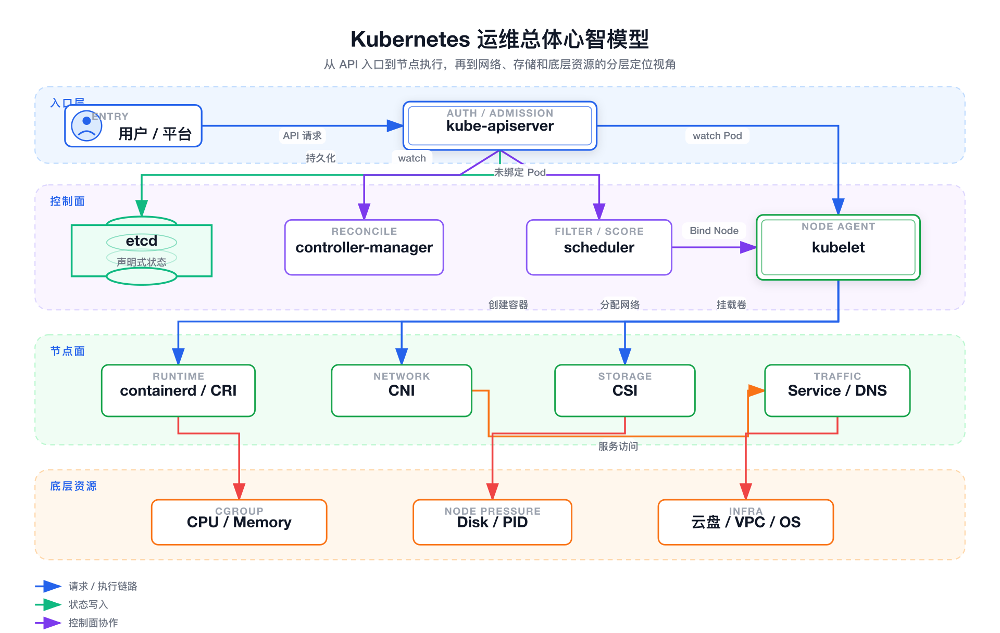
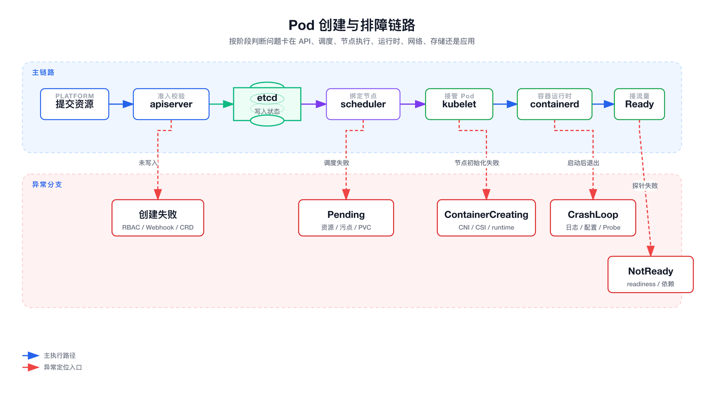
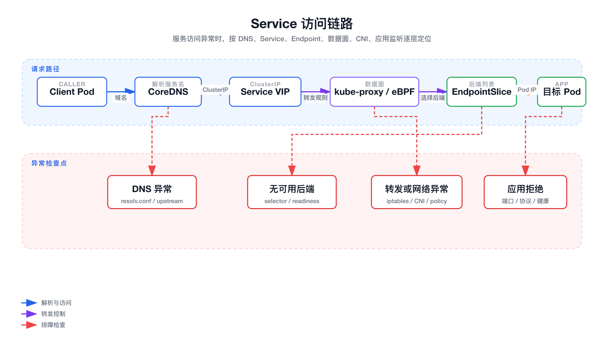
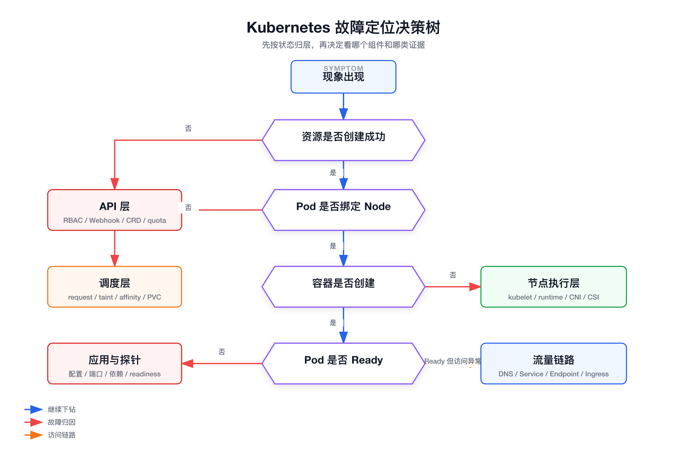
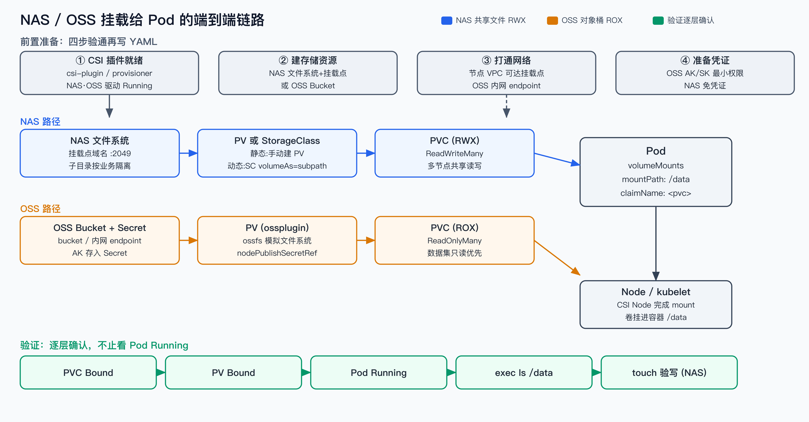
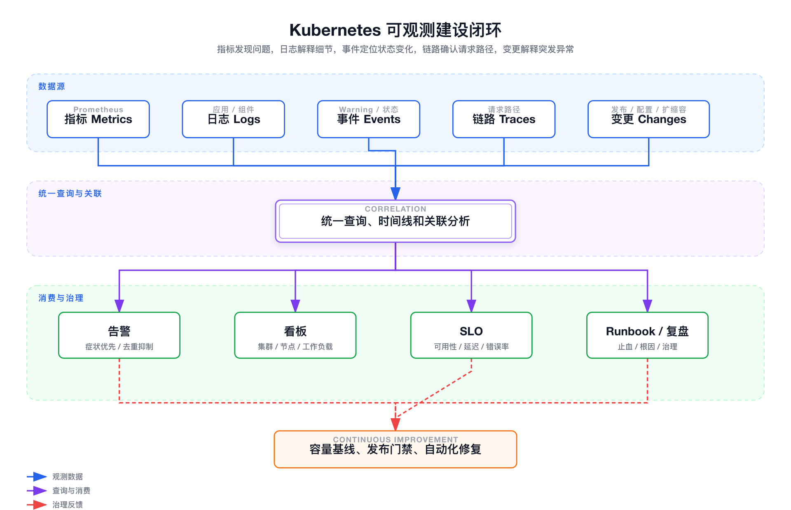

下面这套材料的目标不是背 Kubernetes 八股，而是把你包装成“能从平台、控制面、节点面和可观测体系一起定位问题”的运维型候选人。

面试表达时始终围绕三件事：

- 我能解释 Kubernetes 的声明式控制链路。
- 我能按组件边界快速定位故障。
- 我能把故障治理沉淀成监控、告警、SLO、容量和变更体系。

---

# 总体心智模型

Kubernetes 可以理解成一套围绕 API 对象持续对账的分布式控制系统。



面试可以这样开场：

> 我理解 Kubernetes 不只是一个能跑容器的平台，而是一套声明式 API 加控制器持续对账的系统。排障时我会先判断问题卡在 API 写入、调度、节点执行、容器运行时、网络、存储还是应用自身，再用事件、日志、指标和变更记录做交叉验证。

---

# 核心链路图

## Pod 创建与排障链路



这张图是最重要的面试主线。只要能沿着它讲清楚，绝大多数 Pod 故障都能归类。

## Service 访问链路



面试里要强调：Service 不是代理进程，它是稳定入口和转发规则；真正的数据面可能是 kube-proxy、iptables、ipvs 或 eBPF。

## 故障定位决策树



排障时不要一上来重启 Pod。先按状态把问题归层，再决定看哪个组件。

---

# 面试回答框架

## 表达层次

| 层次 | 你要表达什么 | 示例 |
|---|---|---|
| 概念 | 组件边界和责任 | kubelet 负责执行已绑定到本节点的 Pod，不负责调度 |
| 链路 | 一个请求如何流转 | 发布系统提交资源后，先过 apiserver，再由 scheduler 和 kubelet 接力 |
| 排障 | 现象如何归因 | Pending 看调度，ContainerCreating 看 kubelet、CNI、CSI、containerd |
| 治理 | 如何减少重复故障 | 建监控、告警、SLO、容量水位、变更关联和故障复盘 |

## 排障时先问的问题

| 问题 | 目的 |
|---|---|
| 资源对象是否存在 | 区分 API 层失败和后续状态收敛失败 |
| Pod 是否绑定 Node | 区分 scheduler 问题和 kubelet 问题 |
| Event 最后一条关键错误是什么 | 快速定位 Image、CNI、CSI、Probe、Quota 等方向 |
| 影响范围是单 Pod、单节点、单 namespace 还是全局 | 判断故障半径和优先级 |
| 最近是否有发布、配置、证书、网络、节点变更 | 把故障和变更关联起来 |

---

# 控制面

## apiserver

apiserver 是 Kubernetes 的统一入口，负责认证、鉴权、准入、API 校验、资源持久化和 watch 分发。

| 能力 | 面试说法 | 常见故障 |
|---|---|---|
| 认证 Authentication | 判断调用者是谁 | token、证书、ServiceAccount 异常 |
| 鉴权 Authorization | 判断能不能操作资源 | RBAC forbidden |
| 准入 Admission | 修改或拒绝请求 | webhook 超时、策略误拦截 |
| API 校验 | 校验字段和版本 | CRD schema、版本转换失败 |
| 持久化 | 写入 etcd | etcd 慢导致写入慢 |
| Watch | 分发资源变化 | watch 过多导致内存和延迟升高 |

apiserver 慢的常见原因：

| 方向 | 典型现象 | 快速处理 |
|---|---|---|
| 请求压力大 | `kubectl` 卡顿，controller 延迟 | 查 QPS、inflight、慢请求，限制异常客户端 |
| Webhook 慢 | apply 卡住或失败 | 查 webhook service、timeout、failurePolicy |
| etcd 慢 | 创建和更新资源慢 | 查 fsync、leader、db size、网络 RTT |
| 大对象或大 List | apiserver 内存高 | 查大 ConfigMap、Secret、CRD 对象和分页 |
| 客户端限流 | client-side throttling | 调整 client-go QPS/Burst 或减少轮询 |

面试可说：

> 我会先判断请求是否到达并通过 apiserver。如果资源没有创建出来，优先看 RBAC、Admission Webhook、CRD schema 和 audit；如果资源创建了但状态不收敛，再进入 scheduler、controller、kubelet 和 runtime 链路。

## etcd

etcd 是 Kubernetes 的强一致状态存储。kubelet、scheduler、controller 不直接访问 etcd，它们都通过 apiserver 读写 API 对象。

| 关注点 | 为什么重要 | 异常表现 |
|---|---|---|
| leader 稳定性 | leader 抖动会影响写入 | 请求失败、延迟抖动 |
| raft proposal 延迟 | 反映一致性写入质量 | 控制面整体变慢 |
| fsync latency | etcd 对磁盘很敏感 | 写入慢、apiserver 慢 |
| backend db size | 历史版本和碎片膨胀 | list/watch 慢、磁盘告警 |
| network RTT | raft 成员依赖稳定网络 | 选主、心跳异常 |
| snapshot | 灾备恢复能力 | 备份不可用会放大事故 |

compact 和 defrag 的区别：

| 操作 | 作用 | 面试表述 |
|---|---|---|
| compact | 清理历史 revision | 让 etcd 不再保留过旧版本 |
| defrag | 整理后端文件 | 把逻辑释放的空间真正还给文件系统 |

## scheduler

scheduler 负责给未绑定的 Pod 选择节点，核心阶段是 Filter、Score、Bind。

| 阶段 | 做什么 | 常见问题 |
|---|---|---|
| Filter | 过滤不能运行的节点 | 资源不足、污点不容忍、亲和冲突、PVC 限制 |
| Score | 给候选节点打分 | 负载不均、拓扑策略不合理 |
| Bind | 写入 Pod 的 NodeName | apiserver 写入失败、调度器异常 |

Pending 排查重点：

| 方向 | 快速判断 | 快速处理 |
|---|---|---|
| 资源不足 | event 里有 Insufficient CPU/Memory | 扩容、降低 request、迁移低优先级 Pod |
| 污点不匹配 | event 里有 taint not tolerated | 加 toleration 或换节点池 |
| 标签不匹配 | nodeSelector 或 affinity 无匹配 | 修正标签和亲和规则 |
| PVC 问题 | PVC Pending 或拓扑不匹配 | 查 StorageClass、PV、可用区 |
| 节点不可调度 | node unschedulable | uncordon 或换节点池 |
| 配额限制 | namespace quota 不足 | 调整 quota 或清理资源 |

## controller-manager

Controller 的本质是持续对账：观察实际状态，和期望状态比较，执行动作让系统收敛。

| 控制器 | 负责什么 | 常见故障 |
|---|---|---|
| Deployment Controller | 管 ReplicaSet 和滚动更新 | 发布卡住、RS 不变化 |
| ReplicaSet Controller | 维持 Pod 副本数 | 副本不足或异常扩缩 |
| Node Controller | 维护 Node 状态 | Node NotReady 处理延迟 |
| EndpointSlice Controller | 维护 Service 后端 | Service 没有 Endpoint |
| Job Controller | 管批任务完成状态 | Job 不结束、重复执行 |

面试重点：

> Kubernetes 不是执行一次命令就结束，而是 controller 持续 reconcile。Deployment、Job、EndpointSlice、Node、ServiceAccount 等对象背后都有控制器推动状态收敛。

---

# 节点面与运行时

## kubelet

kubelet 是节点上的核心 Agent，负责执行已经绑定到本节点的 Pod。

| 能力 | 说明 | 故障表现 |
|---|---|---|
| Pod 生命周期 | 创建、更新、删除 Pod | ContainerCreating、Terminating |
| CRI 调用 | 通过 CRI 调 containerd | 创建容器失败 |
| Probe 执行 | startup、readiness、liveness | NotReady、重启 |
| Volume 管理 | 调 CSI 或本地挂载 | mount failed |
| Node 状态上报 | 心跳、condition、容量 | Node NotReady |
| Eviction | 资源压力下驱逐 Pod | Evicted、DiskPressure |
| 日志管理 | stdout/stderr 落盘 | 日志占满磁盘 |

Node NotReady 快速处理：

| 检查项 | 快速判断 | 处理方向 |
|---|---|---|
| kubelet 存活 | systemd 状态和日志 | 重启 kubelet、修配置 |
| containerd 状态 | runtime ready 是否正常 | 重启 runtime、查 shim、查镜像目录 |
| 节点资源 | disk、inode、memory、pid | 清理日志镜像、扩容、驱逐低优先级 Pod |
| CNI 状态 | network plugin 是否 ready | 修 CNI Pod、路由、iptables、MTU |
| apiserver 连通 | 节点到 apiserver 是否通 | 查网络、证书、LB |
| 证书 | kubelet client/server cert | 轮转证书或修 bootstrap |

## containerd

containerd 是容器运行时管理层，kubelet 通过 CRI 调用它。

| 概念 | 面试说法 |
|---|---|
| CRI | Kubernetes 与运行时之间的接口 |
| containerd | 管理镜像、容器、sandbox、快照 |
| shim | 托管容器进程生命周期 |
| runc | 真正创建 Linux 容器 |
| cgroups | 做资源限制 |
| namespaces | 做进程、网络、挂载等隔离 |

常见问题：

| 问题 | 表现 | 快速处理 |
|---|---|---|
| 镜像拉取失败 | ImagePullBackOff | 查 registry、secret、DNS、节点出口 |
| sandbox 创建失败 | ContainerCreating | 查 pause 镜像、CNI、runtime 日志 |
| overlayfs 异常 | 容器启动失败 | 查磁盘、inode、snapshotter |
| shim 残留 | 进程泄漏、删除卡住 | 查残留进程，必要时重启 runtime |
| 镜像 GC 失败 | 磁盘高、ImageGCFailed | 清理镜像和日志，调 GC 阈值 |

排障命令只需要记入口，不要在面试里堆命令块。常用入口包括 `kubectl describe pod`、`kubectl logs`、`crictl ps`、`crictl pods`、`crictl inspect`、`journalctl -u kubelet`、`journalctl -u containerd`。

---

# 网络

Kubernetes 网络模型要求 Pod 之间可以直接互通，Service 提供稳定访问入口，Ingress 或 Gateway 承接集群外流量。

| 层级 | 组件 | 常见故障 |
|---|---|---|
| Pod 网络 | CNI、IPAM、路由、隧道 | Pod 跨节点不通、IP 分配失败 |
| Service 数据面 | kube-proxy、iptables、ipvs、eBPF | ClusterIP 不通、规则异常 |
| DNS | CoreDNS、kube-dns Service | 解析慢、解析失败 |
| 访问控制 | NetworkPolicy、安全组 | 部分流量被拦截 |
| 入口流量 | Ingress、Gateway、LB | 外部访问异常 |

Pod 访问 Service 不通的快速路径：

| 检查顺序 | 看什么 | 结论 |
|---|---|---|
| Service | selector 和 port 是否正确 | 配置问题 |
| EndpointSlice | 是否有 Ready 后端 | readiness 或 label 问题 |
| DNS | 服务名能否解析 | CoreDNS 或 search domain 问题 |
| 数据面 | kube-proxy、iptables、ipvs、eBPF | 转发规则问题 |
| CNI | Pod 到 Pod 是否通 | 路由、隧道、MTU、NetworkPolicy |
| 应用 | 容器是否监听端口 | 业务进程或协议问题 |

DNS 异常快速处理：

| 现象 | 可能原因 | 处理方向 |
|---|---|---|
| 服务名解析失败 | CoreDNS Pod 异常 | 查 CoreDNS 日志和 Service |
| 偶发超时 | CoreDNS 负载高或上游慢 | 扩容 CoreDNS、看缓存和上游 |
| 只有某些 Pod 失败 | resolv.conf 或节点网络异常 | 查 Pod DNSPolicy、节点 CNI |
| 外部域名慢 | 上游 DNS 慢 | 优化 forward、缓存、节点 DNS |

---

# 存储

Kubernetes 存储链路是 Pod、PVC、PV、StorageClass、CSI Controller、CSI Node、kubelet mount 的组合。

| 对象 | 作用 | 常见问题 |
|---|---|---|
| PVC | 用户声明存储需求 | Pending、容量或访问模式不匹配 |
| PV | 实际卷资源 | reclaimPolicy、绑定异常 |
| StorageClass | 动态供给策略 | provisioner 错误、拓扑限制 |
| CSI Controller | 创建、attach、detach | 云盘创建失败、挂载冲突 |
| CSI Node | 节点侧 mount | NodePublishVolume 失败 |
| kubelet | 把卷挂到容器 | ContainerCreating 卡住 |

存储排障要点：

| 现象 | 优先看什么 | 快速处理 |
|---|---|---|
| PVC Pending | StorageClass、PV、事件 | 修 SC、扩容存储池、检查拓扑 |
| Pod 卡 ContainerCreating | kubelet event、CSI Node 日志 | 修挂载、权限、云盘状态 |
| 多节点挂载冲突 | RWO/RWX 和调度位置 | 调整访问模式或副本调度 |
| 挂载慢 | CSI、云盘、NAS 延迟 | 查云厂商控制面和节点 IO |
| 文件权限错误 | fsGroup、securityContext | 修权限策略或镜像用户 |
| inode 满 | 空间还够但无法写文件 | 清理小文件、调整日志策略 |

面试重点：

> PVC Bound 只能说明卷已经绑定，不代表 kubelet 已经挂载成功。Pod 卡 ContainerCreating 时必须继续看 kubelet event、CSI node plugin、云盘 attach/mount 状态和节点磁盘情况。

---

# 实操：把 NAS / OSS 挂载给 Pod 用

这一节是端到端的落地步骤，覆盖共享文件存储（NAS）和对象存储（OSS）两条路径。NAS 走标准 CSI + PV/PVC，OSS 走 ossfs 把桶映射成目录。下面以阿里云 ACK 的 csi-plugin 为例，自建集群把 provisioner 换成对应的 NFS / S3 驱动即可，流程一致。



## 先选型：NAS 还是 OSS

| 维度 | NAS（共享文件） | OSS（对象桶） |
|---|---|---|
| 语义 | POSIX 文件系统，支持 seek、随机写、文件锁 | 对象语义，ossfs 模拟文件系统，随机写和 rename 代价高 |
| 访问模式 | 天然 RWX，多 Pod 多节点同时读写 | 可多 Pod 只读共享，写并发要谨慎 |
| 典型场景 | 训练数据集、共享配置、多副本写日志、模型权重热加载 | 海量样本、产物归档、冷数据、跨地域分发 |
| 性能特征 | 低延迟、吞吐稳定 | 首字节延迟高、目录遍历慢，不适合大量小文件 metadata 操作 |
| 一句话 | 当成网盘用 | 当成只读数据仓 / 归档盘用 |

> 选型口径：需要 POSIX 语义、随机写、文件锁、多写并发，用 NAS；只是把一堆样本或产物当只读数据集挂进来、或归档落盘，用 OSS。把 OSS 当数据库或频繁随机写的盘用，必然踩 ossfs 性能坑。

## 前置准备

| 步骤 | 动作 | 校验 |
|---|---|---|
| 1 装 CSI 插件 | 集群装好 csi-plugin / csi-provisioner（NAS、OSS 驱动） | `kubectl get pod -n kube-system | grep csi` 全部 Running |
| 2 建存储资源 | 控制台或 API 建好 NAS 文件系统 + 挂载点，或 OSS Bucket | 记下 NAS 挂载点域名、OSS endpoint 和 bucket 名 |
| 3 打通网络 | 节点 VPC 能访问 NAS 挂载点 / OSS 内网 endpoint | 节点上 `telnet <挂载点> 2049`、`curl <oss-endpoint>` 通 |
| 4 准备凭证 | OSS 需要 AK/SK，建议用子账号最小权限或 RRSA | AK 只授该 bucket 读（或读写）权限 |

> 90% 的挂载失败是前置没做好：CSI 插件没装、节点到存储的网络不通、安全组/ACL 没放行、OSS AK 权限不足。先把这四步验通，再写 YAML。

## 路径 A：NAS 静态挂载（已有文件系统，手动建 PV）

适合「存储已经存在、我只想把它挂进来」的场景。管理员建 PV 指向 NAS 挂载点，用户用 PVC 绑定。

第一步，建 PV，指向 NAS 挂载点：

```yaml
apiVersion: v1
kind: PersistentVolume
metadata:
  name: nas-pv-dataset
spec:
  capacity:
    storage: 100Gi          # NAS 容量是软约束，这里只是声明
  accessModes:
    - ReadWriteMany         # NAS 用 RWX，多 Pod 多节点共享
  persistentVolumeReclaimPolicy: Retain   # 共享数据一律 Retain，别让删 PVC 连带删数据
  csi:
    driver: nasplugin.csi.alibabacloud.com
    volumeHandle: nas-pv-dataset          # 唯一即可
    volumeAttributes:
      server: "xxxxx.cn-shanghai.nas.aliyuncs.com"   # NAS 挂载点域名
      path: "/share/dataset"                          # 挂载子目录，按业务隔离
```

第二步，建 PVC 绑定这个 PV：

```yaml
apiVersion: v1
kind: PersistentVolumeClaim
metadata:
  name: nas-pvc-dataset
  namespace: train
spec:
  accessModes:
    - ReadWriteMany
  resources:
    requests:
      storage: 100Gi        # 要和 PV 的 accessModes 匹配，容量 ≤ PV
  volumeName: nas-pv-dataset   # 显式绑定，避免被别的 PVC 抢
```

## 路径 B：NAS 动态挂载（StorageClass 自动供给）

适合「每个业务自助申请独立子目录」的场景。建一个 StorageClass，用户建 PVC 时自动在 NAS 上开子目录并生成 PV。

第一步，建 StorageClass：

```yaml
apiVersion: storage.k8s.io/v1
kind: StorageClass
metadata:
  name: nas-subpath
provisioner: nasplugin.csi.alibabacloud.com
parameters:
  volumeAs: subpath                              # 每个 PVC 一个子目录
  server: "xxxxx.cn-shanghai.nas.aliyuncs.com:/share"
  path: "/"
reclaimPolicy: Retain
allowVolumeExpansion: true
```

第二步，用户只需建 PVC，PV 自动生成：

```yaml
apiVersion: v1
kind: PersistentVolumeClaim
metadata:
  name: nas-pvc-auto
  namespace: train
spec:
  accessModes:
    - ReadWriteMany
  storageClassName: nas-subpath
  resources:
    requests:
      storage: 50Gi
```

## 路径 C：OSS 桶挂载（ossfs）

OSS 没有云盘的 attach 概念，靠 ossfs 在节点上把桶 mount 成目录。凭证放 Secret，PV 引用。

第一步，建凭证 Secret：

```yaml
apiVersion: v1
kind: Secret
metadata:
  name: oss-secret
  namespace: train
stringData:
  akId: "<AccessKeyId>"          # 用只读子账号 AK，别用主账号
  akSecret: "<AccessKeySecret>"
```

第二步，建 PV 指向 bucket：

```yaml
apiVersion: v1
kind: PersistentVolume
metadata:
  name: oss-pv-samples
spec:
  capacity:
    storage: 100Gi               # OSS 容量是占位值，无实际约束
  accessModes:
    - ReadOnlyMany               # 数据集场景用只读，避免 ossfs 写放大
  persistentVolumeReclaimPolicy: Retain
  csi:
    driver: ossplugin.csi.alibabacloud.com
    volumeHandle: oss-pv-samples
    nodePublishSecretRef:
      name: oss-secret
      namespace: train
    volumeAttributes:
      bucket: "my-train-bucket"
      url: "oss-cn-shanghai-internal.aliyuncs.com"   # 用内网 endpoint，省流量费且快
      otherOpts: "-o max_stat_cache_size=0 -o allow_other"
```

第三步，建 PVC 绑定（同路径 A 的 PVC 写法，accessModes 用 ReadOnlyMany、volumeName 指向 oss-pv-samples）。

## 在 Pod 里引用并验证

不管哪条路径，Pod 侧引用方式一致，只换 PVC 名字：

```yaml
apiVersion: v1
kind: Pod
metadata:
  name: data-reader
  namespace: train
spec:
  containers:
    - name: app
      image: busybox
      command: ["sh", "-c", "ls -l /data && sleep 3600"]
      volumeMounts:
        - name: shared-data
          mountPath: /data          # 容器内挂载路径
  volumes:
    - name: shared-data
      persistentVolumeClaim:
        claimName: nas-pvc-dataset  # 换成对应 PVC
```

验证顺序，逐层确认而不是只看 Pod Running：

| 步骤 | 命令 | 期望 |
|---|---|---|
| 1 PVC 绑定 | `kubectl get pvc -n train` | STATUS 为 Bound |
| 2 PV 生成 | `kubectl get pv` | 对应 PV Bound，capacity/accessModes 正确 |
| 3 Pod 调度起来 | `kubectl get pod data-reader -n train` | Running，不卡 ContainerCreating |
| 4 真正能读写 | `kubectl exec -it data-reader -n train -- ls -l /data` | 能列出文件；NAS 再 `touch /data/t && rm /data/t` 验写 |
| 5 多 Pod 共享（NAS） | 在另一节点起 Pod 挂同 PVC | 两边都能读到同一份数据 |

> 验收口径：PVC Bound 只是第一步，必须 exec 进容器实际 `ls` 和（NAS 场景）`touch` 验证真正可读可写，再确认 RWX 场景下多节点 Pod 看到的是同一份数据。

## 这一段的高频排障

| 现象 | 根因方向 | 处理 |
|---|---|---|
| PVC 一直 Pending | StorageClass 写错 / provisioner 没装 / accessModes 不匹配 | 看 `kubectl describe pvc` 事件，核对 SC 名和 CSI 插件 |
| Pod 卡 ContainerCreating | 节点到 NAS/OSS 网络不通、挂载点域名错、ossfs 起不来 | 看 `kubectl describe pod` 事件 + CSI Node 日志 + 节点 `dmesg` |
| OSS 挂上但读不到 / Permission denied | AK 权限不足、bucket 或 endpoint 写错、Secret 没引对 | 核对 AK 对该 bucket 的策略、内外网 endpoint、nodePublishSecretRef |
| 写 OSS 极慢或 rename 失败 | ossfs 随机写/改名代价高 | 改成只读用法，或换 NAS；调 ossfs 缓存参数 |
| NAS 多 Pod 写覆盖 | RWX 下没有应用层互斥 | 业务自己加文件锁或按 Pod 分目录 |
| 删了 PVC 数据没了 | reclaimPolicy 是 Delete | 共享数据统一设 Retain，删 PVC 前先确认 |

> 面试可收口：挂载的本质是 CSI 把外部存储的「连接信息 + 凭证」通过 PV 暴露给 PVC，再由 kubelet 在节点上完成 mount。NAS 是 POSIX 共享盘走标准 RWX，OSS 是对象桶靠 ossfs 模拟文件系统、优先只读用。排障永远先验「网络 + 凭证 + CSI 插件」三件前置，再看 PVC/PV/Pod 三层状态。

---

# 资源与稳定性

## CPU 与 Memory

| 资源 | 关键概念 | 面试说法 |
|---|---|---|
| CPU request | 调度参考和资源保障 | request 太大导致 Pending，太小导致争抢 |
| CPU limit | CFS quota 限制 | limit 太低可能 CPU throttling，延迟升高 |
| Memory request | 调度参考 | request 影响节点装箱 |
| Memory limit | cgroup OOM 边界 | 超过 limit 会 OOMKilled |
| Eviction | 节点整体压力处理 | Evicted 是 kubelet 因节点压力驱逐，不等同于容器 OOM |

## Disk 与 PID

| 资源 | 常见原因 | 典型表现 |
|---|---|---|
| Disk | 镜像、容器日志、emptyDir、overlayfs | DiskPressure、ImageGCFailed、Pod Evicted |
| inode | 大量小文件、日志碎片 | 有空间但无法创建文件 |
| PID | 进程泄漏、fork 过多 | PIDPressure、容器创建失败 |

快速治理：

| 方向 | 做法 |
|---|---|
| 镜像治理 | 设置 image GC 阈值，清理废弃镜像 |
| 日志治理 | 限制容器日志大小，接入日志采集和轮转 |
| emptyDir 治理 | 设置 sizeLimit，监控临时目录占用 |
| 节点水位 | 对磁盘、inode、PID、内存设置预警 |
| 优先级 | 用 PriorityClass 和 PDB 降低故障扩散 |

---

# 运维常见故障速查

这一章是面试里最有用的部分。回答时先说“现象、判断边界、快速处理、长期治理”。

| 故障 | 常见现象 | 快速定位 | 快速解决 | 长期治理 |
|---|---|---|---|---|
| Pod Pending | 一直未调度 | 看 event 是否 FailedScheduling | 扩容、改 request、修 taint/affinity/PVC | 容量水位、资源画像、调度约束规范 |
| ImagePullBackOff | 镜像拉取失败 | 看 image、secret、registry、节点出口 | 修 secret、镜像地址、网络、重试 | 镜像预热、仓库可用性监控 |
| ContainerCreating | 卡创建容器 | 看 kubelet、CNI、CSI、containerd | 修网络插件、挂载、runtime、镜像 | 节点健康检查、CNI/CSI 告警 |
| CrashLoopBackOff | 容器反复重启 | 看应用日志、退出码、Probe、配置 | 回滚配置、修 Probe、扩资源 | 发布健康检查、灰度、配置校验 |
| Running NotReady | Pod 运行但不接流量 | 看 readiness、端口、依赖 | 修应用健康接口或依赖 | readiness 标准化、依赖探活 |
| Service 无后端 | EndpointSlice 为空 | 看 selector、label、readiness | 修 label 或 readiness | 发布前校验和服务拓扑监控 |
| Service 不通 | ClusterIP 访问失败 | 看 DNS、Endpoint、kube-proxy、CNI | 修 CoreDNS、规则、网络策略 | 服务链路探测、DNS SLO |
| CoreDNS 异常 | 解析慢或失败 | 看 CoreDNS QPS、错误、上游延迟 | 扩容、修 upstream、清异常配置 | DNS 缓存、容量和错误率告警 |
| Node NotReady | 节点不可用 | 看 kubelet、runtime、资源、网络 | 重启组件、隔离节点、迁移 Pod | 节点自愈、巡检、证书和资源预警 |
| DiskPressure | 节点磁盘压力 | 看镜像、日志、emptyDir、inode | 清理日志镜像、驱逐低优先级 Pod | 日志轮转、磁盘水位、emptyDir 限额 |
| OOMKilled | 容器被杀 | 看 memory limit、峰值、退出码 | 调高 limit、修内存泄漏、降流 | 内存画像、压测、合理 request/limit |
| CPU throttling | 延迟高但 CPU 不高 | 看 throttling 指标和 limit | 调高 limit 或去掉不合理 limit | request/limit 基线、性能压测 |
| PVC Pending | 存储未绑定 | 看 SC、PV、拓扑、quota | 修 SC、扩容、调度到正确可用区 | 存储容量监控、SC 标准化 |
| Volume mount failed | 挂载失败 | 看 kubelet event 和 CSI 日志 | 修权限、云盘状态、CSI Node | CSI 可用性和挂载耗时监控 |
| 发布卡住 | Deployment/Rollout 不前进 | 看 RS、Pod、readiness、quota | 回滚、暂停、修健康检查 | 灰度策略、自动回滚、发布 SLO |
| apiserver 慢 | kubectl 和控制器慢 | 看 request latency、webhook、etcd | 隔离慢 webhook、降流、修 etcd | API SLO、webhook 容量和超时治理 |
| etcd 延迟 | 控制面整体慢 | 看 fsync、leader、db size | 修磁盘、compact、defrag、扩容 | 定期备份、容量和延迟告警 |

故障回答模板：

> 这个问题我会先判断影响面，再看资源对象和事件，把问题归到 API、调度、节点、网络、存储或应用层。快速止血可以扩容、回滚、隔离节点或修配置；长期要沉淀监控告警、容量水位、发布前校验和故障复盘。

---

# 可观测建设

可观测不是“装 Prometheus 就完了”，而是围绕指标、日志、事件、链路、变更和 SLO 建一套能定位问题、度量稳定性、驱动治理的体系。



## 建设目标

| 目标 | 说明 |
|---|---|
| 快速发现 | 故障发生时先由监控发现，而不是用户反馈 |
| 快速定位 | 能从服务、工作负载、Pod、节点、组件逐层下钻 |
| 影响面判断 | 能区分单 Pod、单节点、单 namespace、单集群、全局问题 |
| 变更关联 | 能把发布、配置、扩缩容和故障时间线关联 |
| 治理闭环 | 故障后沉淀告警、容量、自动化和流程改进 |

## 指标体系

| 层级 | 核心指标 | 用途 |
|---|---|---|
| 业务服务 | QPS、错误率、延迟、可用性 | 判断用户影响 |
| Ingress / Gateway | 请求量、状态码、上游延迟 | 判断入口和路由问题 |
| Workload | 副本数、Ready 数、重启数、发布状态 | 判断发布和副本健康 |
| Pod / Container | CPU、内存、重启、OOM、throttling | 判断资源和应用问题 |
| Node | CPU、内存、磁盘、inode、PID、Network | 判断节点压力 |
| kubelet | PLEG、runtime ready、pod start latency | 判断节点执行链路 |
| containerd | 镜像拉取、容器创建、GC、runtime 错误 | 判断运行时问题 |
| CNI / DNS | IP 分配、丢包、CoreDNS QPS/错误/延迟 | 判断网络问题 |
| CSI / Storage | mount latency、attach error、容量 | 判断存储问题 |
| apiserver | request latency、inflight、错误码、watch | 判断 API 层压力 |
| etcd | fsync、proposal、leader、db size | 判断一致性存储状态 |

面试里可以说“四个黄金信号”：延迟、流量、错误、饱和度。Kubernetes 运维里还要加上事件、状态收敛和变更。

## 日志体系

| 日志 | 价值 |
|---|---|
| 应用日志 | 判断业务错误和依赖异常 |
| kubelet 日志 | 判断 Pod 创建、Probe、Volume、CNI、Eviction |
| containerd 日志 | 判断镜像、sandbox、runtime、shim |
| CNI 日志 | 判断 IP 分配、路由、网络策略 |
| CSI 日志 | 判断 attach、mount、权限和云盘状态 |
| apiserver audit | 判断谁在什么时候做了什么变更 |
| controller 日志 | 判断 reconcile 是否卡住 |

日志治理重点不是收集越多越好，而是字段标准化、保留周期、检索效率、采样和脱敏。

## 事件体系

Kubernetes Event 是排障入口，尤其适合 Pod Pending、ImagePullBackOff、ContainerCreating、FailedMount、Unhealthy、Killing、Evicted 这类问题。

| 事件类型 | 代表问题 |
|---|---|
| FailedScheduling | 调度失败 |
| FailedMount | 存储挂载失败 |
| FailedCreatePodSandBox | CNI 或 sandbox 失败 |
| BackOff | 镜像或容器重启退避 |
| Unhealthy | Probe 失败 |
| Evicted | 节点资源压力 |
| NodeNotReady | 节点心跳异常 |

建议把 Warning Event 接入告警和故障时间线，但要做聚合和抑制，避免事件风暴。

## 告警设计

| 原则 | 说明 |
|---|---|
| 症状优先 | 优先告警用户可感知问题，例如错误率、延迟、不可用 |
| 原因辅助 | 组件指标用于定位，不要所有底层抖动都直接叫醒人 |
| 分级告警 | P0 看全局不可用，P1 看核心业务，P2 看容量和风险 |
| 去重抑制 | Node NotReady 时抑制该节点上大量 Pod 告警 |
| 带上下文 | 告警要带 namespace、workload、node、最近变更、排障入口 |
| 可执行 | 每条告警都应该能对应处理动作或 Runbook |

## SLO 与容量治理

| 方向 | 建设内容 |
|---|---|
| 服务 SLO | 可用性、延迟、错误率，按核心链路分级 |
| 集群 SLO | apiserver 延迟、Pod 启动耗时、调度耗时、DNS 成功率 |
| 节点水位 | CPU、内存、磁盘、inode、PID、Pod 数 |
| 容量预测 | 按 namespace、workload、节点池做趋势和突增分析 |
| 发布质量 | 发布成功率、回滚率、平均恢复时间 |
| Runbook | 常见告警要有处理步骤、止血动作和升级路径 |

可观测面试表述：

> 我会把可观测分成指标、日志、事件、链路和变更五类数据。指标用于发现和度量，日志用于解释细节，事件用于定位 K8s 状态变化，链路用于判断请求经过哪里，变更用于解释为什么突然异常。告警上我倾向症状优先、原因辅助，并且要关联 Runbook 和最近变更。

---

# 面试追问清单

## apiserver 和 etcd

- `kubectl apply` 一个资源后，Kubernetes 内部发生什么？
- apiserver 慢可能由哪些原因导致？
- Webhook 故障会怎样影响资源创建？
- etcd 存什么，业务数据会不会进 etcd？
- compact 和 defrag 有什么区别？
- 为什么 controller 不直接查 etcd？

## scheduler

- Pod 一直 Pending 怎么排查？
- request 和 limit 对调度分别有什么影响？
- taint/toleration 和 nodeSelector 区别是什么？
- affinity、anti-affinity、topologySpreadConstraints 怎么用？
- PVC 为什么会影响调度？

## kubelet 和 containerd

- kubelet 和 containerd 分别负责什么？
- Pod 卡 ContainerCreating 怎么排查？
- ImagePullBackOff 怎么排查？
- `crictl` 和 `docker` 命令有什么区别？
- kubelet 怎么判断 Pod Ready？
- OOMKilled 和 Evicted 区别是什么？

## 网络

- Service 是怎么转发到 Pod 的？
- kube-proxy iptables 和 ipvs 有什么区别？
- eBPF 数据面解决了什么问题？
- Pod 跨节点通信怎么实现？
- CoreDNS 异常怎么排查？
- NetworkPolicy 是谁实现的？
- Ingress、Gateway、Service 的关系是什么？

## 存储

- PVC Pending 怎么排查？
- PVC Bound 了，Pod 为什么还可能挂载失败？
- RWO 和 RWX 有什么区别？
- CSI Controller 和 CSI Node 分别做什么？
- Pod 卡 Terminating 会不会和存储有关？

## 可观测

- Kubernetes 集群监控应该分哪些层？
- Prometheus、kube-state-metrics、cAdvisor 分别提供什么？
- 你会给 Pod 启动失败设计哪些告警？
- 告警风暴怎么治理？
- 如何把发布变更和故障关联起来？
- SLO 在平台运维里怎么落地？

---

# 学习路径

## Pod 生命周期

优先掌握 Pod 创建、Pending、ImagePullBackOff、ContainerCreating、CrashLoopBackOff、Running NotReady、Evicted、Terminating。

目标：能根据 Pod 状态直接判断下一步该看哪个组件。

## 节点执行链路

重点掌握 kubelet、containerd、CRI、CNI、CSI、cgroup、probe、eviction。

目标：能解释 Pod 被调度到节点后，kubelet 到底做了什么。

## 控制面链路

重点掌握 apiserver、etcd、scheduler、controller-manager、informer、watch、admission webhook、CRD。

目标：能解释 Kubernetes 为什么是声明式控制系统。

## 生产稳定性

重点掌握 apiserver 延迟、etcd 延迟、controller 延迟、Node NotReady、CoreDNS 异常、CNI 故障、CSI 故障、containerd 异常、磁盘、inode、PID、CPU throttling。

目标：能把问题归类成 API 层、控制器、调度、节点、网络、存储、应用或平台变更问题。

## 可观测和治理

重点掌握指标、日志、事件、链路、变更、告警、SLO、容量和 Runbook。

目标：不只会处理一次故障，还能说明怎么把故障变成可监控、可预防、可复盘的稳定性能力。

---

# 最小面试闭环

你至少要能流畅讲清楚这些链路：

| 链路 | 必须说清楚 |
|---|---|
| Pod 创建链路 | apiserver、etcd、scheduler、kubelet、containerd、CNI、CSI、Probe |
| Service 访问链路 | DNS、ClusterIP、kube-proxy/eBPF、EndpointSlice、目标 Pod |
| 存储挂载链路 | PVC、PV、StorageClass、CSI Controller、CSI Node、kubelet mount |
| 节点异常链路 | kubelet、containerd、CNI、资源压力、apiserver 连通性 |
| 发布异常链路 | 平台发布、workload controller、调度、节点执行、健康检查、Endpoint |
| 可观测闭环 | 指标发现、日志解释、事件定位、链路确认、变更归因、Runbook 处理 |

最后把自己定位成：

> 我不是只会写 YAML 或看 Pod 状态，而是能按 Kubernetes 的控制面、节点面、运行时、网络、存储、资源和可观测链路定位问题。从平台发布失败、Pod Pending、ContainerCreating、CrashLoop、Service 不通、Node NotReady，到 etcd 和 apiserver 延迟，我都能先分层，再定位具体组件，并把处理经验沉淀成监控、告警和 Runbook。
