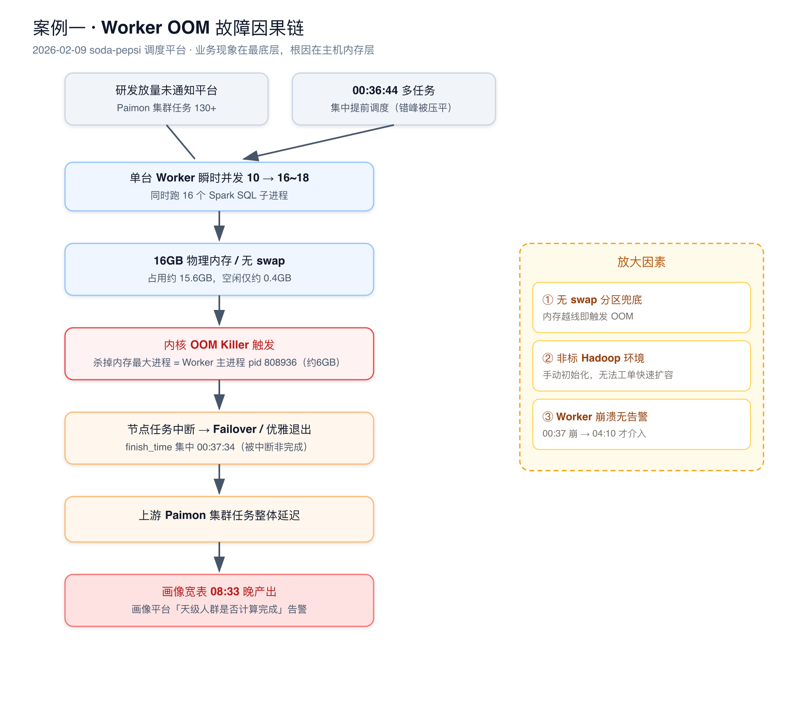
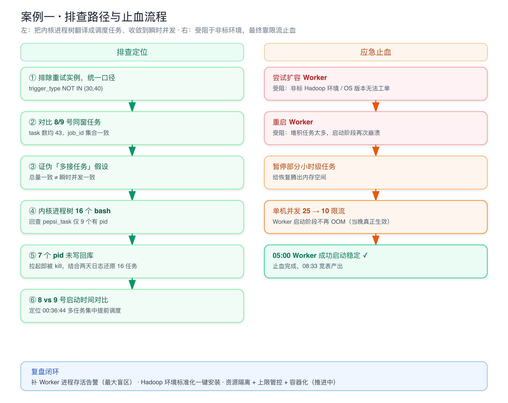

# soda-pepsi 调度平台 Worker OOM 导致画像宽表产出延迟（2026-02-09）

回答「讲一个你印象最深的 oncall」的首选案例，所属平台见 [[soda-pepsi]]。

## 一句话故障

2026-02-09 凌晨 00:37，调度平台一台 Worker 主机（10.131.24.207）因物理内存耗尽被内核 OOM Killer 杀掉 Worker 主进程，节点上一批离线任务被中断，上游 Paimon 集群任务整体延迟，最终传导到画像宽表，当天宽表产出时间晚到 08:33，触发画像平台计算定时提醒告警。

故障定级按稳定性问题处理，影响范围是数据产出时效，暂无外部业务方反馈；数据一致性校验通过（CK 表与 Hive 表数据量差异 0.4%，在 10% 阈值内）。

## 故障链路

- 业务现象层：画像宽表 08:33 才产出，比平时晚，画像平台「天级人群是否计算完成」检查在 08:15 / 08:30 两次不通过。
- 数据层：上游 Paimon 集群多个离线任务延迟产出，宽表依赖未就绪。
- 调度平台层（soda-pepsi）：承载这批任务的 Worker 主机崩溃，任务被中断后走 Failover / 优雅退出，整体后移。
- 主机 / 内核层：Worker 主机 16GB 物理内存、无 swap，凌晨并发任务数突增，内存被打满，内核触发 global OOM，杀掉内存占用最大的 Worker 主进程（pid 808936）。

这条链路是这个案例最值得讲的地方：面试时我会强调「用户看到的是宽表晚产出，但根因在三层之外的主机内存」，体现按层下钻、不被表象带偏的排查习惯。

## 时间线

- 00:37:25：Worker 主机任务数突增到 18（实际 16 个 Spark SQL 子进程在跑），多个线程申请内存失败，内核 OOM kill 掉 Worker 主进程，节点崩溃。
- 04:10：尝试扩容 Worker，发现这台机器的 Hadoop 环境是手动初始化的，不在运维 SOP 内，无法走工单安装；OS 版本偏高，也不能通过工单开机 —— 暴露出「非标环境无法快速扩容」的应急短板。
- 04:30：直接重启 Worker，但堆积任务太多，启动阶段又被打崩。
- 04:40：暂停部分小时级任务，给恢复腾出内存空间。
- 05:00：把单台 Worker 任务并发数从 25 限到 10，Worker 成功启动并稳定。
- 08:33：宽表最终产出，告警关闭。

时间线里 04:10 到 05:00 这段是应急处置的关键：先尝试扩容（受阻于非标环境）→ 重启（受阻于堆积任务）→ 限流 + 暂停部分任务（生效），最终是用「限流」而不是「扩容」止血。这正好对应复盘里「平台故障应急处理 SOP：明确限流 / 扩容的优先级」这条改进项。

## 直接原因

Worker 主机物理内存被打满，内核 OOM Killer 在 00:37:25 杀掉内存占用最大的进程，也就是 Worker 主服务进程本身（pid 808936，total-vm 约 14.1GB，anon-rss 约 5.7GB）。Worker 进程死亡后，节点上正在跑的任务被中断、走优雅退出与死亡补偿逻辑，所以库里出现一批 `finish_time = 00:37:34` 的任务，看起来像「集中完成」，其实是「集中被中断」。

## 根本原因

关键是一笔内存账：这台机器总物理内存 16GB，没有 swap 兜底。

| 进程类型 | 数量 | 单进程物理内存 | 总物理内存 | 说明 |
| --- | --- | --- | --- | --- |
| Worker 主服务 Java (808936) | 1 | 约 5.99 GB | 约 5.99 GB | 内存最大，被 OOM 杀死 |
| Spark SQL 子 Java 进程 | 16 | 0.41~0.61 GB | 约 8.8 GB | YARN Cluster 模式，单进程开销合理 |
| bash 脚本进程 | 16 | 约 0.025 GB | 约 0.4 GB | 每任务一个启动脚本 shell |
| xargs 传参进程 | 16 | 约 0.007 GB | 约 0.11 GB | 给 spark-submit 传参 |
| 系统基础进程 | 约 20 | — | 约 0.3 GB | systemd / sssd / crond 等 |
| 整机合计 | — | — | 约 15.6 GB | 空闲仅剩约 0.4GB |

三个进程大小本身都符合预期（主服务平时就要 5~6GB，单个 Spark 任务 0.5GB 是 YARN Cluster 模式的合理开销）。真正的变量只有一个：同时在跑的 Spark SQL 任务数从平时的约 10 个涨到了 16~18 个。

任务数为什么会突增，根因有两层：

- 业务侧：Paimon 集群任务总数超过 130+，研发放量未通知平台扩容，单机承载的并发被抬高。
- 调度侧：当天 00:36:44 有多个任务被「提前调度」，集中下发到同一台 Worker，把瞬时并发推到峰值，恰好压垮内存。

叠加「机器无 swap、是非标手动初始化环境无法快速扩容」两个放大因素，最终从「内存偏紧」演变成「OOM 崩溃」。

## 排查过程（这个案例的技术含量所在）

排查的核心难点是：内核 OOM 日志只给了进程树（pid / bash / java），调度平台库表里记录的是任务（task_id / job_id），要把「内核杀了哪些进程」翻译成「影响了哪些调度任务」，并证明「9 号是不是真的比 8 号多接了任务」。

口径修正，先排除重试实例。统计任务量前先用 `trigger_type` 排除重试实例（30 失败转移、40 自动重试），统一口径 `(trigger_type IS NULL OR trigger_type NOT IN (30,40))`，避免把重试任务算进并发，得出错误结论。

证伪「多接任务」假设。排除重试后，0208 与 0209 在「create_time 0:00–1:00、host=10.131.24.207」下 task 数都是 43，且两天的 distinct job_id 集合完全一致（含每个 job 的条数一致）。这说明两天是同一批作业、同一套调度，并不是 9 号多接了任务。但我特意补了一句结论：区间总量一致，不代表某一时刻的瞬时并发一致 —— 把问题从「总量」收敛到「瞬时并发」。

把内核进程树和库表任务对齐。内核日志 Tasks state 里有 16 个 bash（每任务一个 bash，再起 xargs / java）。用这 16 个 bash 的 pid 回查 `pepsi_task`（表里存的是 task 的 bash pid），只有 9 个 pid 能在表里查到，对应出 task_id / job_id；剩余 7 个 bash pid 在表里没有记录，推断是「进程已经拉起、但 Worker 在把 pid 写回库之前就被 kill」的那批任务。再结合 8 号、9 号 Worker 日志 + oom-killer 日志，把 16 个任务全部定位出来（任务名、优先级、是否环比新增）。

定位触发时刻。按分钟看 0:35–0:40 的结束情况，00:36 只有 1 条结束、00:37 有 9 条集中结束，与 OOM 时刻完全吻合，确认这 9 条就是 OOM 时正在跑、被优雅退出补偿写入 `finish_time=00:37:34` 的任务。

锁定瞬时并发来源。做了 8 号 vs 9 号同 job 的启动时间对比，发现 9 号多个任务在 00:36:44 集中提前调度（相比 8 号提前了数分钟到几十分钟）：

| Job | 8 号启动 | 9 号启动 | 差异 | 备注 |
| --- | --- | --- | --- | --- |
| job_2424 / job_8400 | 00:44:30 | 00:36:44 | 约 -7.5 分钟 | 9 号提前 |
| job_1643 | 01:22:46 | 00:36:44 | 约 -46 分钟 | 9 号提前 |
| job_2085 / job_1682 / job_721 | 01:30:31 | 00:36:44 | 约 -53 分钟 | 9 号提前 |
| job_3297 等 5 个 | 00:31:41 | 00:36:43 | 约 +5.2 分钟 | 9 号延迟 |

多个原本错峰的任务被提前压到同一分钟下发，瞬时并发抬高，叠加内存本就偏紧，触发了这次 OOM。

## 处置动作

临时止血（凌晨）：

- 限制单台 Worker 任务并发度（25 → 10），让 Worker 启动阶段不再 OOM —— 这是当晚真正生效的止血手段。
- 暂停部分小时级任务，给恢复腾内存。
- 对 Paimon 集群做紧急扩容。

短期整改（已完成）：

- Worker 升配到 16C64G、扩容 1 台，提高单机内存余量。
- 增加 Worker JVM 监控上报，补齐内存可观测。
- 修复重试任务错误进入 default 队列的问题（进行中）。

## 复盘与长期改进

未拦截根因：调度平台 Worker 进程崩溃没有报警，所以从 00:37 崩到 04:10 才介入，错过了最佳处置窗口。这是这次故障最该补的洞。

后续 todo 按优先级推进：

- P0：Worker 存活关键监控报警（已完成）；Paimon + Hadoop 环境安装标准化，把手动初始化合并成一键安装客户端，统一部署流程（已完成）；输出「平台问题排查 SOP」和「平台故障应急处理 SOP（明确限流 / 扩容优先级）」（待闭环）。
- P1：其他集群 Hadoop 客户端安装标准化；调度任务与资源管控体系建设 —— 对 CPU 任务、DataX、SeaTunnel 做资源隔离，按 CPU / 内存型任务设置使用上限，技术方案走容器化落地。
- P3：报警中台能力建设，补齐破线 SLA 告警闭环。

这组改进对应三类系统性问题：监控盲区（进程崩溃无告警）、环境非标（无法快速扩容）、资源无隔离无上限（单机可被并发打满），正好和 [[soda-pepsi]] 平台正在做的 Worker 运行时容器化方向一致。

## 面试讲法

### 三十秒版

我印象最深的一次 oncall 是调度平台的 Worker OOM。表象是画像宽表早上 8 点多才产出、比平时晚，但我按层下钻定位到根因在主机层：凌晨一台 16GB、无 swap 的 Worker 主机，同时跑的 Spark 任务从平时 10 个突增到 16 个，内存被打满，内核 OOM 直接杀了 Worker 主进程，导致上游 Paimon 任务整体延迟、传导到宽表。当晚靠限并发止血，复盘补了进程存活告警、环境标准化和资源隔离三类整改。

### 三分钟版

在三十秒版基础上补排查和处置细节。排查上有两个关键动作：一是统计任务量时先用 trigger_type 排除重试实例，避免口径错误，结果证明两天区间任务总量都是 43、job 集合一致，所以不是多接任务，而是瞬时并发突增；二是把内核 OOM 日志里的 16 个进程（bash/xargs/java）和库表里的 task pid 做对应，只有 9 个能查到，其余 7 个是「进程拉起但 pid 还没写回库就被 kill」，再结合两天日志把 16 个任务全部还原，并通过 8 号 vs 9 号启动时间对比，定位到 00:36:44 多个任务集中提前调度是瞬时并发的来源。处置上当晚扩容受阻于非标环境、重启受阻于堆积任务，最后用「单机并发 25→10 限流 + 暂停部分小时级任务」止住。

### 五分钟版

在三分钟版基础上加内存账、应急取舍和长期治理。内存账是这次的核心证据：主服务约 6GB + 16 个 Spark 子进程约 8.8GB + 其他约 0.8GB，合计约 15.6GB，机器只有 16GB 且无 swap，空闲只剩 0.4GB，所以任何一点并发抬升都会越线。应急取舍上，我会讲清楚为什么最终选限流而不是扩容 —— 扩容被非标 Hadoop 环境和 OS 版本卡住，短期不可行，限流是当时唯一能快速生效的手段，这也直接催生了「应急 SOP 要明确限流/扩容优先级」这条改进。长期治理上分三块：补 Worker 进程存活告警（这次最大的盲区是崩溃无报警）、把手动初始化环境标准化成一键安装、对不同类型任务做资源隔离和上限管控并向容器化演进。

## 面试追问树

- Q1：这次故障的直接现象是什么？为什么定位到内存？
  - Q2：你怎么确认是 OOM 而不是任务自己失败？（内核 oom-kill 日志 + finish_time 集中在 00:37:34 是被中断而非正常完成）
    - Q3：怎么证明 9 号不是比 8 号多接了任务？（排除重试后区间 task 数都是 43、job 集合一致）
      - Q4：那总量一样为什么还会 OOM？（区间总量一致≠瞬时并发一致，00:36:44 多任务提前调度）
        - Q5：内核日志里 16 个进程怎么对应到调度任务？（bash pid 回查 pepsi_task，9 个有记录、7 个 pid 未写回库）
          - Q6：当晚为什么不直接扩容？（非标 Hadoop 环境 + OS 版本无法走工单，最后靠限流止血）
            - Q7：为什么没第一时间发现？（Worker 进程崩溃没有报警，是最大盲区）
              - Q8：长期怎么根治？（进程存活告警 + 环境标准化 + 资源隔离/上限 + 容器化）

## 高频 Q&A

### 这个故障的根因到底是什么，一句话说清

机器是 16GB 无 swap 的非标环境，同时跑的 Spark 任务从平时 10 个突增到 16 个，内存被打满，内核 OOM 杀了 Worker 主进程；任务突增是因为研发放量没通知扩容，加上当天多个任务在 00:36:44 集中提前调度推高了瞬时并发。

### 你怎么排除「9 号多接了任务」这个最直觉的假设

先把口径统一成排除重试实例，再对比两天同一时间窗、同一台 host 的 task 数和 job_id 集合，结果完全一致，证明是同一批作业、同一套调度，问题不在总量而在瞬时并发分布。

### 为什么是 Worker 主进程被杀，而不是某个 Spark 任务被杀

内核 OOM Killer 默认杀 oom_score 最高、也就是内存占用最大的进程。主服务进程约 6GB，是单个进程里最大的，所以被选中。这也是为什么故障影响面大 —— 不是死一个任务，而是整台 Worker 崩了。

### finish_time 集中在 00:37:34 是不是说明任务正常完成了

不是。正常完成的 finish_time 要等线程跑完 DQC 和 finally 才上报。这批集中在 00:37:34 的，是 Worker 被 kill 后走优雅退出 / 死亡补偿逻辑写入的，本质是「集中被中断」，时间点和 OOM 时刻吻合。

### 当晚为什么不扩容，而是限流

扩容当时不可行：这台机器的 Hadoop 环境是手动初始化的、不在运维 SOP 内，无法工单安装，OS 版本也高、不能工单开机。重启又因为堆积任务太多再次被打崩。所以最终用「单机并发 25→10 + 暂停部分小时级任务」限流止血，这是当时唯一能快速生效的手段。

### 这次故障为什么没有第一时间发现

调度平台 Worker 进程崩溃当时没有报警，靠的是早上画像宽表延迟的业务告警反推，所以从 00:37 崩到 04:10 才介入。复盘第一条整改就是补 Worker 存活关键监控报警。

### 限流会不会影响任务时效

会有一定影响，但当时是可用性优先的取舍：并发降下来 Worker 才能稳定启动，任务排队执行总比整台机器崩掉、全部 Failover 重来要好。后续通过升配（16C64G）和扩容把并发上限重新抬上去，平衡时效和稳定。

### 复盘里你觉得最有价值的一条整改是什么

进程存活告警 + 应急 SOP。这次最大的代价不是 OOM 本身，而是「崩了没人知道」和「知道了不知道先扩容还是先限流」。把这两件事标准化，比单纯加内存更能降低同类故障的影响时长。

### 这个故障和你负责的 soda-pepsi 平台是什么关系

soda-pepsi 是调度控制面，Worker 是执行面。这次暴露的是执行面的资源治理短板：Worker 直接在主机上拉起 Spark 任务、没有资源隔离和上限。长期方向就是平台正在做的 Worker 运行时容器化，把任务转成 K8S Job / SparkApplication，实现任务级资源隔离。

### 如果再来一次同样的放量，现在能扛住吗

比当时强很多：Worker 已升配 16C64G 并扩容、有了 JVM 内存监控和进程存活告警、Hadoop 环境标准化后能快速扩容。但彻底根治还要靠资源隔离 + 上限管控 + 容器化落地，这部分还在推进，我不会说已经完全解决。

## 风险与边界

- 不要说「这个故障是我一个人定位 + 处置 + 整改的」。更稳妥：我深度参与了排查和复盘，凌晨应急和长期整改是和平台、运维、研发协同推进的。
- 不要把内核 OOM 机制讲成自己实现的。更稳妥：我能读懂 oom-killer 日志、把进程树和库表任务对应起来定位影响范围，内核 OOM 是 Linux 内存管理的既有机制。
- 不要说「资源隔离 / 容器化已经做完」。更稳妥：资源隔离、上限管控、容器化是复盘后立项的长期方向，目前 Worker 升配、扩容、监控、环境标准化已落地，隔离和容器化在推进中。
- 不要把「限流止血」说成最优解。更稳妥：限流是当时受非标环境约束下唯一能快速生效的手段，属于可用性优先的应急取舍，不是长期方案。
- 数字按复盘口径讲：内存账、并发数（10→16）、并发限制（25→10）、差异 0.4% 都来自复盘材料，不要再加工或夸大成百分比收益。

## 图示清单

- diagrams/01_oom_fault_chain.png：对应「故障链路」，纵向因果链 + 放大因素，讲清「现象在底层、根因在主机内存」。
- diagrams/02_oom_investigation_path.png：对应「排查过程」，左侧排查定位路径、右侧应急止血流程，体现排查方法论和应急取舍。

## 面试前检查清单

- [ ] 我能用一句话说清现象（宽表晚产出）和根因（主机 OOM）的关系。
- [ ] 我能画 / 复述 OOM 故障因果链，并说出三个放大因素。
- [ ] 我能讲清排查为什么先排除重试实例、怎么证伪「多接任务」。
- [ ] 我能解释内核进程树 16 个 bash 和库表 9 个 pid 的对应关系。
- [ ] 我能说清当晚为什么选限流而不是扩容。
- [ ] 我能区分「已落地整改」和「推进中的长期治理」，不夸大。
- [ ] 我准备了三十秒、三分钟、五分钟版本。
