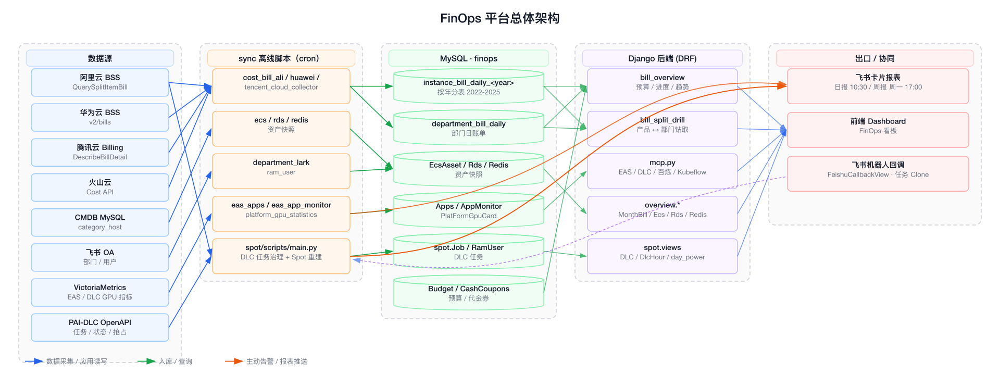
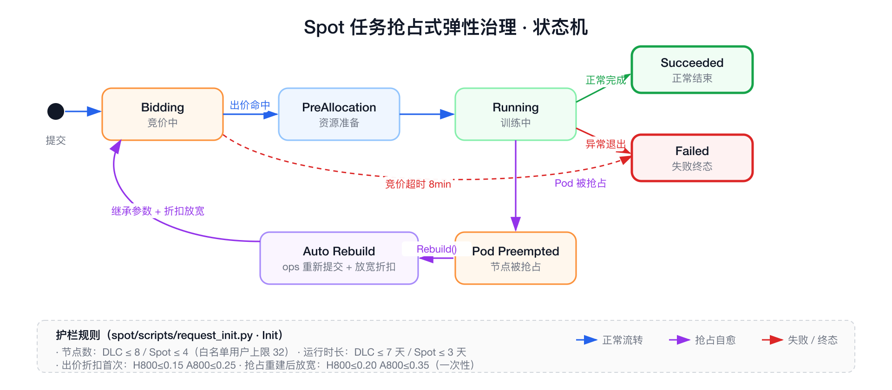
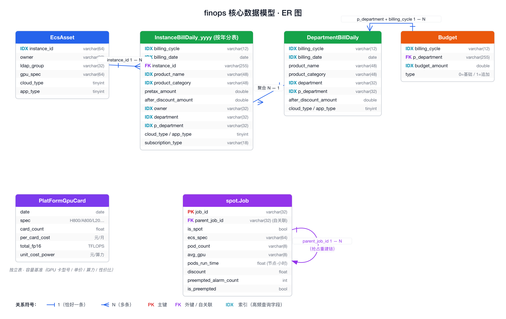

> 该文档专门用于面试讲解 finops 项目在「容量管理（Capacity Management）」上的工作。
> 项目定位：Soul 内部多云 FinOps 后台，覆盖 阿里云 / 华为云 / 腾讯云 / 火山云。
> 技术栈：Django 2.0 + DRF + MySQL（阿里云 RDS）+ Redis + uWSGI + Supervisor，离线 ETL 脚本通过 cron 拉起。

---

# 1. 90 秒开场白（背下来）

> finops 是 Soul 内部的多云成本与容量治理平台，用 Django + DRF 做后端，对接阿里 / 华为 / 腾讯 / 火山四家云。
> 它解决三个问题：**云上花了多少钱（账单聚合）、谁花的（实例-owner-部门三级分账）、怎么花得更划算（容量与利用率治理）**。
> 容量管理这一块，平台从「**有什么资源 → 用得怎么样 → 哪里有浪费 → 哪里可以降本**」四步串起来：
>
> 1. 每天落库 ECS / RDS / Redis 资产快照 + GPU 卡规格价格表，作为容量基线；
> 2. 通过 VictoriaMetrics 拉 EAS、DLC 的 GPU 利用率 / QPS / Token / Pod 副本数，作为使用强度基线；
> 3. 在 PAI-DLC 上做 Spot 抢占式任务治理：自动出价折扣校验、节点数上限校验、运行时长报警、抢占自动 rebuild；
> 4. 每天 / 每周通过飞书卡片把"GPU 空闲卡数 / 整体使用率 / 可转 Spot 的任务 / GPU+QPS 双 0 的服务"主动推给业务和运维。
>
> 整体上是一个**"账单 + 资产 + 指标"三流合一**的中后台系统，覆盖从 raw bill 采集 → 分账归属 → 利用率监控 → 容量优化 → 报表预警的完整 FinOps 闭环。

---

# 2. 总体架构（一图讲完）

---

# 3. 容量管理具体做了什么（按能力域拆 7 块）

> 面试官只问「容量管理」时，重点讲 3.2 ~ 3.5；时间够再补 3.6 ~ 3.7。

## 3.1 资源盘点（"有什么"）

* `cost.EcsAsset / RdsAsset / RedisAsset` 三张资产表，每天由 `sync/ecs.py / rds.py / redis.py` 从 CMDB（`172.16.76.190`）拉一次快照入库，记录：实例 ID、IP、规格、CPU、内存、磁盘、GPU 规格、owner、ldap_group、cloud_type、app_type、运行状态。
* `overview/views.py` 的 `EcsView / RdsView / RedisView` 按日期出**资源数 / 状态分布 / 总 CPU / 总内存 / 总存储 / 31 天日成本趋势**（`utils/overview.py:Resource.get_day_trend`）。
* `cost.PlatFormGpuCard` 维护 GPU 卡规格表：付费方式、GPU 型号（H800 / A800 / H20 / A100 / L20 / 4090 / V100 / T4 …）、显存、卡数、单卡月价、FP16 总算力、**单价/算力的性价比指标**`unit_cost_power`。
* GPU 价格基准表硬编码在 `utils/instance_prices.py`，为后续利用率成本换算提供单价（H800 11w/月、A800 5w/月、H20 3.6w/月、A100 4.67w/月、L20 1750/月 …）。

## 3.2 利用率监控（"用得怎么样"）

**EAS 在线推理服务**（`sync/eas_app_monitor.py` + `cost.AppMonitor`）每日拉 VictoriaMetrics：

| 指标 | PromQL（节选） |
| --- | --- |
| 每日总输入 / 输出 Token | `sum(increase(nv_trt_llm_custom_counter_metrics{metrics_type="input_token"}[1d] offset Nd))` |
| 单次输入 / 输出 Token | 上面 / `nv_inference_count` |
| Peak / Avg QPS | `max_over_time / avg_over_time(eas_qps_total[1d] offset Nd)` |
| Peak / Avg GPU 使用率 | `eas_gpu_util` |
| Peak / Avg Pod 数 | `eas_replicas` |
| 按量成本 / 包月成本 | 用 `eas_instance_price_prepaid/postpaid` × Pod 数 × GPU 数 折算 |

**DLC 训练任务**（`spot/scripts/computing_power_report.py:Statis`）：

* 每个任务记录 `avg_gpu / avg_cpu / pods_run_time`（节点小时数）→ 落 `spot.Job`。
* 用 `Cast('avg_gpu', FloatField())` + 排序后取 **GPU 使用率 Top 50%** 加权（按 `pods_run_time` 加权求平均），算"高质量算力使用率"。
* 配额维度（DLC 包年包月 vs Spot）/ 用户维度 / 任务维度都各出一张飞书表。

**配额级 GPU 卡盘点**（`Statis.get_gpu_power`）：

* DLC 包年包月：`NODE_GPU_ACCELERATOR_TOTAL{quotaName=~"dlc_aigc"}` 取近 24h 平均当总卡数；`_REQUEST` 取占用；差值即"GPU 空闲卡数"；`NODE_GPU_ACCELERATOR_DUTTY_UTIL` 取整体使用率。
* EAS 包年包月：`EAS_CARD_COUNT{kind="card_total"|"card_used"}` + `eas_resource_instance_gpu_util`。
* **闲置识别**：`avg_over_time(eas_gpu_util_per[48h]) == 0` AND `avg_over_time(eas_qps_total[48h]) < 0.01` → 取交集 = "GPU 和 QPS 都为 0 的服务"，每日发飞书提示下线/缩容。

## 3.3 容量约束 / 配额规则（"防超配"）

`spot/scripts/request_init.py:Init` 里固化了平台容量护栏，所有 DLC 任务创建时必须过：

| 规则 | 默认值 | 高权用户特例 |
| --- | --- | --- |
| 节点数上限 `pod_count_limit` | DLC=8 / Spot=4 | aigc-dlc=32、dingcheng=8、lunzhongwang=4 |
| 运行时长上限 `run_day_limit` | DLC=7 天 / Spot=3 天 | 超时发飞书告警，仅一次（`runtime_rule_alarm_count`） |
| Spot 出价折扣上限（首次） | 默认 0.15；H800=0.15；A800=0.25 | 抢占重建后允许放宽：H800=0.20，A800=0.35 |

违反规则的任务直接 `stop_job(job_id, region)` 拒绝运行，并飞书@到对应业务方 + ops。这是平台层的「容量节流闸」。

## 3.4 Spot 抢占式弹性治理（"省钱主战场"）

链路（`spot/scripts/main.py:Sync.get_task` + `Rebuild`）：

* **抢占识别**：`get_pods_substatus` 检查 `all_info.Pods[*].SubStatus == 'Preempted'`，且当前任务还没有子任务（防止重复重建）。
* **抢占自动 rebuild**：`Rebuild.create_rebuild` 拷贝 JobSpec、改 DisplayName 加 `_ops_rebuild_` 后缀、按 `get_discount_limit` 返回的"放宽折扣"重新提交，串成 `parent_job_id` 追溯链。
* **告警去抖**：`runtime_rule_alarm_count / status_alarm_count / preempted_alarm_count / discount_limit_alarm_count` 计数器保证每个任务每类告警最多一次。
* **可转 Spot 候选**（容量优化建议）：`get_weekly_quota_power_data_list` 计算每个 DLC（非 Spot）任务的 CPU 计算量 / GPU 计算量，**当 ≤ `8 GPU × 3 天` 且 ≤ `96 CPU × 3 天`**，就计入"可转 Spot"——周报里直接给业务方建议哪些任务可以从包月 DLC 迁到 Spot。

## 3.5 多云账单分账（"算账归口"）

容量优化的前提是能算清谁在用：

* **三级归属**：每条 `InstanceBillDaily / DepartmentBillDaily` 都带 `instance_id → owner → department / p_department`，owner 来自 `EcsAsset.owner` 或 `cbwp_tag_map`（公网带宽包硬编码归属），部门来自 `UserDepartmentLark`（飞书部门镜像）。
* **按年分表**：`utils/model_manager.py:get_record_model_for_year(year)` 用 `type()` 动态生成 `cost_instance_bill_daily_2022 / 2023 / 2024 / 2025` 子类，避免单表过大。视图层（如 `overview.MonthBill`）按年份循环切换 model 查跨年。
* **不可分账产品名单**（`utils/drill.py:unable_drill_name_list`）：短信、邮箱、号码认证、云监控、云解析、Web 应用防火墙、专有网络 VPC、阿里百炼…… 这些产品没有实例归属，统一进"未分账"桶。
* **影子账单**`ShadowInstanceBillDaily`：用于双跑校验，比如新分账规则上线前对比差异。
* **百炼 / 火山方舟 / 华为 MaaS** 这种大模型 API 计费按厂商 + product_category 路由（`cost/views/bill_model.py:MODEL_SUPPLIER_MAPPING`），并支持 CSV 月成本上传补录（`ModelMonthlyCost` + `model_monthly_cost.py`）。

## 3.6 预算 / 进度 / 趋势（"钱怎么管"）

API 集中在 `cost/views/bill_overview.py`：

* `bill_month_real_time`：当月总成本、当月预算、消耗比例、年度进度（`年累计 / (年预算 × 当前月份/12)`）。
* `bill_month_total_budget_top`：6 大模块（AI 算法 / 业务研发 / 业务算法 / 基础技术 / 大数据 / 用户增长）的当月成本 / 预算 / 进度。
* `bill_quarter_total_trend`：季度趋势（用原生 SQL `CONCAT(YEAR(...), '-Q', QUARTER(...))` 聚合）。
* `bill_month_total_analysis`：月维度的"云账单 / 短信邮件 / 研发成本 / 预算 / 余额 / 代金券"分项。
* `cost_report`：成本进度看板。

## 3.7 报表与协同（"让业务感知"）

`spot/scripts/computing_power_report.py` 起的飞书定时任务：

| 任务 | 触发时间 | 内容 |
| --- | --- | --- |
| `get_gpu_power` | 每天 10:30 | DLC / EAS 包年包月 GPU 总卡 / 空闲 / 整体使用率，备注 GPU+QPS 双 0 服务列表 |
| `get_daily_power_data_list` | 每天 10:30 | 每个 DLC / Spot 任务的算力小时、使用率、Owner、折扣、重建次数（含跳转链接） |
| `get_weekly_quota_power_data_list` | 周一 17:00 | 配额维度（DLC/Spot）周报：任务数、训练时长分布、可转 Spot 数、平均折扣、重建数 |
| `get_weekly_user_power_data_list` | 周一 17:00 | 用户维度周报：任务数、GPU 使用率、算力消耗、平均折扣 |

发送链路：`Init.send_card` → 飞书 `open-apis/bot/v2/hook/<token>` 卡片消息；`FeishuCallbackView` 处理回调（如手动 Clone 任务按钮）。

---

# 4. 数据模型速记（被问起就直接画）

---

# 5. 关键技术点 / 难点（亮点）

1. **按年分表 + 动态 ORM**：用 `type()` 在运行期生成绑定到 `cost_instance_bill_daily_<year>` 的 Django Model 子类，跨年查询逻辑放在视图层；`cost/management/commands/create_yearly_table.py` + `create_partitions(2022, 2025)` 批量建表。避免单表过亿、避开了 MySQL 原生分区的运维负担。
2. **三级归属的双向钻取**（`utils/drill.py` ~900 行）：
   * 产品 → 部门：先按 `product_name` 聚合，再 group by `p_department / department`，再下钻到 `instance_id` 看变化最大 / 趋势上行最快的实例。
   * 部门 → 产品：反向同理。
   * 内置"未分账"两级桶（`all_tag='全部'` / `none_tag='（未分账）'`）和不可分账产品白名单。
3. **抢占治理状态机**：状态字段 `start_status / end_status / running_status / bidding_status` + 4 个 alarm 计数器实现幂等告警；`parent_job_id` 串联 rebuild 链，最后一节点为终态时回填整链路时长。
4. **GPU 使用率"高质量加权"**：取 Top 50% 任务 + 按 `pods_run_time` 加权，规避偶发短任务对均值的扰动（`get_gpu_percent_peak`）。
5. **闲置识别布尔交集**：`GPU=0 服务集合 ∩ QPS<0.01 服务集合` 才算闲置，避免单一指标误杀（推理流量低但批处理仍占 GPU 的情况）。
6. **多云抽象**：cloud_type 枚举（1=阿里、2=华为、3=腾讯、4=火山）和 amount 三口径（pretax / after_discount / pretax_gross）让所有视图自动多云通用；`utils/cloud_app_data.get_cloud_app_queryset` 是统一切片器。
7. **可转 Spot 的算力阈值**：用"3 天 × 8 GPU = 576 GPU·h"和"3 天 × 96 CPU"做硬阈值识别，避免推荐风险大的长训练。
8. **价格 × 利用率 → 隐式成本预测**：EAS 用 `eas_instance_price_prepaid` 单价 + 监控里的 avg_pod_count 反推按量 / 包月成本，落 `AppMonitor.gpu_amount_postpaid/prepaid`，给业务做"包月还是按量"决策依据。

---

# 6. 数据规模 & 部署（被问 scale 时回答）

| 维度 | 量级 |
| --- | --- |
| 数据来源云厂商 | 4（阿里 / 华为 / 腾讯 / 火山） |
| 账单分表 | 按年，已就位 2022–2025 |
| `InstanceBillDaily` 索引 | billing_cycle / billing_date / product_name / product_category / owner / department / p_department / pretax_amount，8 个 |
| sync 离线脚本 | 27 个，cron 调度 |
| Spot 治理任务并发 | `main.py` 起 5 线程拉两个 workspace（966 / 60874）所有 DLC 任务 |
| 报表频次 | 日报 10:30、周报周一 17:00，每次最多重试 10 次 |
| 部署 | 自研二进制部署器 `deploy_update`（PyInstaller 28MB），supervisor 拉起 uWSGI，目标目录 `/opt/app/finops` |

---

# 7. 高频面试问题 + STAR 回答模板

> 面试场景：你是新接手 / 二开者，所以可以坦率说"项目不是我从零做的，但我接手后做了……"

## Q1：「你们的 FinOps 平台容量管理怎么做的？」

* **S（Situation）**：公司用 4 家云、AI 训练场景多，月成本 8 位数，预算下沉到模块；研发起任务靠 PAI-DLC 包年包月配额，但配额满了之后业务没法 self-service，运维 case-by-case 救火。
* **T（Task）**：用一套平台同时做到「资源盘点 + 利用率可视 + 抢占式弹性 + 主动告警」，让浪费可见、扩容有据、超配可拦。
* **A（Action）**：
    1. 资产侧每天落 ECS / RDS / Redis 快照 + GPU 卡价/算力表，建立容量基线；
    2. 指标侧从 VictoriaMetrics 拉 EAS / DLC 的 GPU 使用率、QPS、Token、Pod 数；
    3. 治理侧给 PAI-DLC 加三道护栏（节点数 / 运行时长 / 出价折扣）+ 抢占自动 rebuild + 飞书告警去抖；
    4. 推荐侧每周自动算"可转 Spot 任务"和"GPU+QPS 双 0 服务"两类降本候选，飞书卡片@业务和 ops。
* **R（Result）**：从被动救火变成主动经营。具体收益数字以你接手期间的实际为准，建议引用 1-2 个：例如 "Spot 折扣稳定在 15%-25% 之间，节省 X%"、"识别并下线了 N 个 GPU+QPS 双 0 的 EAS 服务"、"新增容量需求评审多了一份'你这个任务能转 Spot'的客观依据"。

## Q2：「按年分表为什么不用 MySQL 原生分区？」

* 阿里云 RDS 跨大版本时分区表迁移坑较多，DDL 慢；
* Django ORM 对原生分区不友好，跨年聚合一样要写 raw SQL；
* 用 `type()` 动态生成子类同样隔离物理表，对 ORM 透明，**视图层一行 `get_record_model_for_year(year)` 就能切表**，新增年份只要 `create_partitions` 一行；
* 业务上账单查询 95% 是"当年 + 上一年"，跨年仅在年趋势接口出现，可以显式循环成本不大。

## Q3：「Spot 抢占自动 rebuild 怎么避免死循环？」

* `parent_job_id` 串联整链，rebuild 出来的子任务带 `_ops_rebuild_` 后缀；
* `get_intervene` 在判定需要重建前会检查：①父任务下是否已有更新的子任务；②抢占发生时间是否在合理窗口（超过 `wait_time*6=30 分钟` 不再处理，避免历史数据触发重复 rebuild）；③只在终态外的运行中状态触发；
* 折扣放宽是**一次性**的：`is_preempted` 为 True 时才把 H800/A800 的折扣上限从 15%/25% 放宽到 20%/35%，再被抢占就不再放宽，由人工介入。

## Q4：「闲置识别为什么用 GPU=0 ∩ QPS<0.01，不是 OR？」

* 推理服务有两类常见场景：①GPU 已 idle 但有少量长连接探活流量；②GPU 在跑批量预处理但没有 HTTP 流量。任一指标单独看都会误杀。
* 用交集 = "明确既无算力使用、又无业务流量"，准确率优先于召回率，避免把业务方的灰度服务/预热实例下线。
* 触发的是飞书卡片告警，最终下线由业务方点头，平台只做候选发现。

## Q5：「平台对低利用率任务怎么处理？」

* 不直接 kill，而是在周报「可转 Spot」一栏给候选名单 → 业务方自己评估。
* 阈值 `≤ 8 GPU × 3 天 + ≤ 96 CPU × 3 天` 是结合 PAI Spot 资源池容量定的——既保证大概率能竞到价，又不至于把高优长训练塞进 Spot 被反复抢占。
* 配合 GPU 使用率 Top 50% 加权均值出"GPU 使用率"列，业务一眼能看出 idle 的训练任务。

## Q6：「成本预测 / 容量规划这块呢？」

* 直接的预测在 `utils/estimate_cost.py:Estimate`：用当月已发生的 `pretax_amount / after_discount_amount`，按已过天数线性外推到全月，并扣除负数（退款 / 误扣）实例 ID 防污染均值。
* 容量规划层面靠 `cost.PlatFormGpuCard.unit_cost_power = 总价 / FP16 总算力`，给采购选型（H800 vs A800 vs H20 vs L20）做单位算力成本对比；以及 `bill_quarter_total_trend` 看季度趋势预测下个季度池子。

## Q7：「这个项目最大的痛点 / 你最想改的是什么？」（坦率题）

* DEBUG=True、DB 密码 / AK / SK 全部硬编码在 settings.py 和 sync 脚本里 → 应改成配置中心或 K8s Secret；
* Django 2.0.8 + DRF 3.8 + Celery 3.1 已 EOL，安全和性能都跟不上；
* 离线脚本靠 cron + supervisor 调度，没有任务编排和重试观测，建议迁 Airflow / 自研调度；
* 资产 / 账单 / 指标三流的 join 都在视图层做内存聚合，部门多时容易慢，可下沉到物化视图或预计算表（已有 `view_all_years_data` 视图雏形）；
* 飞书卡片消息没有交互闭环（按钮 Clone 任务的代码注释了），是改进点。

---

# 8. 一句话讲透这个项目（最后兜底）

> finops 平台用「**资产快照 + 多云账单 + 利用率指标**」三流合一，把容量管理做成了"**有什么 → 用得怎样 → 哪里浪费 → 怎么省**"四步闭环：
> 用按年分表的账单表归账到部门，用 PAI-DLC 抢占治理 + Spot 推荐降低 AI 训练成本，用 EAS 闲置识别防止"GPU 在那儿空转"，用飞书日报/周报让业务方自己看到自己的浪费。
