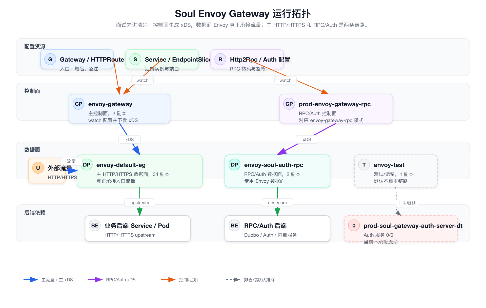
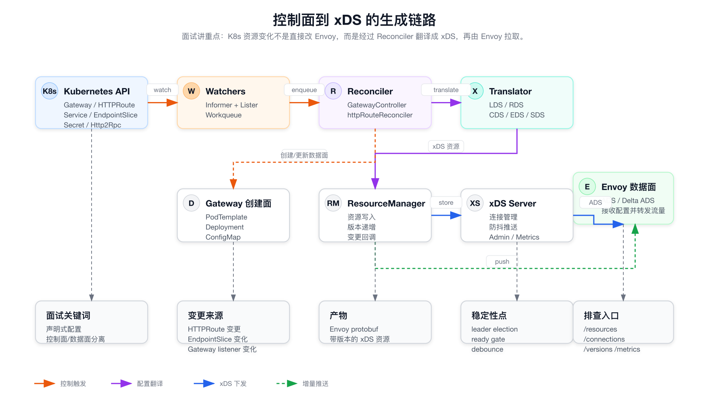
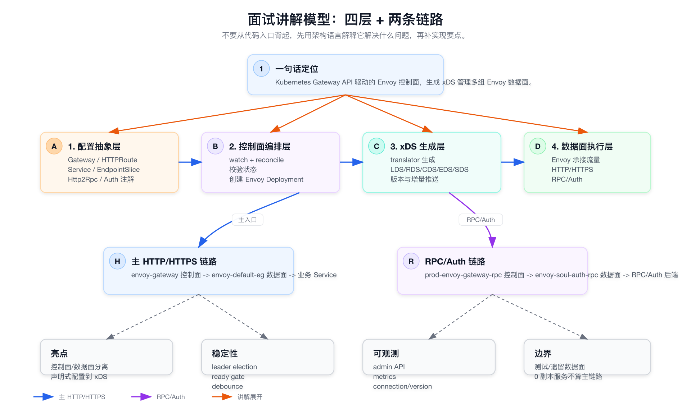

本文按当前仓库代码和运行资源梳理，目标是帮助快速理解这个项目的模块边界、运行链路和面试表达。准备面试时先看图，不要从代码目录开始背。

# 面试版先看图

## 图 1：当前运行拓扑

这张图先回答“谁是控制面，谁是真正承接流量的数据面”。



面试里可以先这样讲：

- `envoy-gateway` 是主控制面，watch Gateway / HTTPRoute / Service / EndpointSlice 等资源，生成 xDS。
- `envoy-default-eg` 是主 HTTP/HTTPS 数据面，真正承接入口流量。
- RPC/Auth 是另一条链路：`prod-envoy-gateway-rpc` 控制面下发配置给 `envoy-soul-auth-rpc` 数据面。
- `envoy-test` 和 0/0 的 `prod-soul-gateway-auth-server-dt` 不要默认算主链路。

## 图 2：控制面如何生成 xDS

这张图回答“配置变更怎么变成 Envoy 配置”。



核心表达：

- K8s 资源变化先进入 informer / workqueue。
- Reconciler 做校验、状态更新、数据面创建，并调用 translator。
- Translator 生成 LDS / RDS / CDS / EDS / SDS。
- ResourceManager 管资源、版本和变更回调，xDS Server 再通过 ADS / Delta ADS 给 Envoy。

## 图 3：面试讲解模型

这张图用于组织回答，避免陷入代码细节。



90 秒版本：

> 这是一个基于 Kubernetes Gateway API 的 Envoy 控制面。它把 Gateway、HTTPRoute、Service、EndpointSlice 以及内部的 Http2Rpc/Auth 配置，经过 watch 和 reconcile 翻译成 Envoy xDS 资源，再通过自研 xDS server 下发给多组 Envoy 数据面。主 HTTP/HTTPS 流量走 `envoy-gateway -> envoy-default-eg`，RPC/Auth 流量走 `prod-envoy-gateway-rpc -> envoy-soul-auth-rpc`。项目的关键点是控制面和数据面分离、声明式配置到 xDS 的转换、以及 leader election、ready gate、debounce、admin/metrics 这些稳定性和可观测设计。

后面的章节是为了深入追代码、定位文件和排查问题；面试前优先掌握上面三张图。

# 1. 项目定位

这是 Soul 内部定制的 Envoy Gateway 控制面，核心职责是：

- 监听 Kubernetes Gateway API、Service、EndpointSlice、Secret、Ingress 以及自定义 `Http2Rpc` CRD。
- 将这些资源翻译成 Envoy xDS 资源，包括 Listener、RouteConfiguration、Cluster、ClusterLoadAssignment、Secret 等。
- 通过自研 xDS server 对 Envoy 暴露 ADS / Delta ADS gRPC 服务。
- 管理或辅助管理 Envoy 网关实例、关停流程、指标暴露和扩展插件。
- 支持 Soul 特有能力，例如微服务网关、HTTP 到 Dubbo 转码、Soul Auth、限流、Wasm 扩展、Ingress 兼容等。

Go module 是：

```text
code.soulapp-inc.cn/arch/gateway
```

主入口有三个：

| 入口 | 作用 |
| --- | --- |
| `cmd/server` | 主控制面进程，部署为 `envoy-gateway` 或 `envoy-gateway-rpc`。 |
| `cmd/proxy` | xDS 代理进程，从上游 xDS 拉 Delta ADS，再推给本地 xDS server。 |
| `cmd/shutdown` | Envoy 优雅退出辅助进程，被 Pod `preStop` 调用。 |

# 2. 顶层目录职责

| 目录 | 职责 |
| --- | --- |
| `api/config/v1alpha1` | `EnvoyGateway`、`EnvoyProxy` 配置 API 和默认值。 |
| `api/http2rpcs/v1` | Soul 自定义 `Http2Rpc` CRD 类型，用于 HTTP 到 Dubbo 转码配置。 |
| `api/http2rpcs/contrib` | Dubbo transcoder Envoy 扩展 proto / 生成代码。 |
| `api/v1` | 来自 Contour/Envoy Gateway 风格的辅助类型，例如 rate limit descriptor、TLS、tracing、HTTPProxy 类型片段。 |
| `cmd/server` | 控制面主进程入口，启动 provider runner 和 xDS runner。 |
| `cmd/proxy` | xDS proxy 入口，同时包含 Envoy stats 暴露和 shutdown manager 接入。 |
| `cmd/shutdown` | 独立 shutdown manager，可作为 sidecar 镜像运行。 |
| `pkg/provider/kubernetes` | Kubernetes provider，监听资源并驱动 xDS 资源生成。 |
| `pkg/provider/kubernetes/watch` | 各类 informer / lister / workqueue 封装。 |
| `pkg/xds/translator` | Gateway/HTTPRoute/Service 等中间信息到 Envoy xDS protobuf 的翻译层。 |
| `pkg/xds/server` | 自研 xDS server，包含资源存储、版本管理、连接管理、防抖推送、SotW/Delta xDS、admin API 和 metrics。 |
| `pkg/xds/proxy` | xDS proxy：消费上游 Delta ADS，写入本地 xDS server，再服务下游 Envoy。 |
| `pkg/proxy/envoy` | Envoy admin API、stats 过滤、进程启动和优雅关停工具。 |
| `pkg/infrastructure` | 通用基础设施管理抽象，当前主链路更多由 Gateway controller 直接基于 PodTemplate 创建 Envoy Deployment/ConfigMap。 |
| `pkg/status` | GatewayClass / Gateway / HTTPRoute 状态更新辅助。 |
| `pkg/leadership` | leader election 通知封装，leader 当选后启动控制器和 xDS。 |
| `pkg/common` | 全局运行时开关，例如微服务网关判断、HostRewrite 配置。 |
| `deploy` | 控制面、Envoy、shutdown 镜像和 Kubernetes 部署模板。 |
| `extensions` | Wasm / C++ / JS 扩展插件和示例，当前 translator 会引用 `/etc/envoy-extensions/*.wasm`。 |
| `examples` | Gateway、route、TLS、rate limit 等示例 YAML。 |
| `docs` | 已有专题文档，例如 xDS server 架构、debug、websocket、clickhouse。 |

# 3. 主控制面数据流

主路径从 `cmd/server/main.go` 开始：

```text
cmd/server
  -> pkg/provider/runner
    -> pkg/provider/kubernetes.New()
      -> controller-runtime manager
      -> leader notifier
        -> GatewayClass controller
        -> Gateway controller
        -> HTTPRoute controller
        -> xDS runner / xDS server
```

运行后整体数据流是：

```text
Kubernetes API
  Gateway / HTTPRoute / Ingress / Service / EndpointSlice / Secret / Http2Rpc
        |
        v
pkg/provider/kubernetes/watch
        |
        v
GatewayController + httpRouteReconciler
        |
        v
pkg/xds/translator
        |
        v
ResourceManager.PushResources()
        |
        v
pkg/xds/server
        |
        v
Envoy ADS / Delta ADS client
```

几个关键点：

- `cmd/server` 默认监听 xDS gRPC `18000`，controller-runtime health probe 默认 `8081`，xDS admin/metrics 默认 `9090`。
- `version == "dev"` 时会关闭 leader election；生产构建脚本会通过 `-ldflags "-X main.version=<commit>"` 写入版本。
- `GATEWAY_DEPLOY` 包含 `envoy-gateway-rpc` 时，认为当前进程是微服务网关控制面，会启用 `HasFilterExtAuthz` 和 `HasHttp2RpcTranscode`。
- xDS gRPC listener 不是 `Server.Start()` 后立刻监听，而是等 HTTPRoute/Gateway 初始同步完成并调用 `xdsRunner.NotifyReady()` 后才真正 `Listen`。

## 3.1 当前运行资源视角

从当前线上资源看，需要把控制面和数据面分开理解：

| 资源 | 角色 | 说明 |
| --- | --- | --- |
| `envoy-gateway` | 主控制面 | 2 副本，负责 watch Gateway / HTTPRoute / Policy 等配置资源，并向主数据面下发 xDS。 |
| `envoy-default-eg` | 主 HTTP/HTTPS 数据面 | 34 副本，真正承接主入口 HTTP/HTTPS 流量。 |
| `prod-envoy-gateway-rpc` | RPC 控制面 | RPC/Auth 网关控制器形态，和仓库里的 `envoy-gateway-rpc` / `GATEWAY_DEPLOY=envoy-gateway-rpc` 模式对应。 |
| `envoy-soul-auth-rpc` | RPC/Auth 数据面 | 2 副本，专用 Envoy 数据面，用于 RPC/Auth 相关流量。 |
| `envoy-test` | 测试/遗留数据面 | 1 副本，不应默认纳入主链路分析。 |
| `prod-soul-gateway-auth-server-dt` | Auth 服务 | 0/0，当前不承接流量；排查 Auth 链路时不要默认把它当作在线依赖。 |

因此主 HTTP/HTTPS 链路优先按下面理解：

```text
Gateway / HTTPRoute / Service / EndpointSlice
  -> envoy-gateway 控制面
  -> xDS
  -> envoy-default-eg 数据面
  -> 后端 Service / Pod
```

RPC/Auth 相关链路则优先按下面理解：

```text
Gateway / HTTPRoute / Http2Rpc / Auth 配置
  -> prod-envoy-gateway-rpc 控制面
  -> xDS
  -> envoy-soul-auth-rpc 数据面
  -> RPC/Auth 后端
```

做线上排查时，先确认问题流量落在哪个数据面，再反查对应控制面；不要把 `envoy-test` 或 0 副本的 `prod-soul-gateway-auth-server-dt` 直接算进默认主链路。

# 4. Kubernetes Provider 内部关系

## 4.1 GatewayController

文件：`pkg/provider/kubernetes/gateway.go`

职责：

- 监听 `envoy-gateway-system` namespace 下的 Gateway。
- 如果对应 Envoy Deployment 不存在，则从 PodTemplate 创建 Deployment。
- 同步创建或更新同名 ConfigMap。
- 依据运行模式选择模板：
  - 普通网关：`envoy` 或 Gateway annotation `envoy-gateway/template` 指定的模板。
  - 微服务网关：`envoy-rpc`。
- 创建 Deployment 时把 `ENVOY_NODE_CLUSTER` 设置为 gateway name 去掉 `envoy-` 前缀后的值。

关系：

```text
Gateway
  -> PodTemplate(envoy/envoy-rpc/envoy1-35...)
  -> Deployment(<gateway-name>)
  -> ConfigMap(<gateway-name>)
  -> Envoy pod
```

## 4.2 httpRouteReconciler

文件：`pkg/provider/kubernetes/httproute.go`

这是控制面最核心的 reconciler，监听：

- `HTTPRoute`
- `Ingress`
- `Service`
- `EndpointSlice`
- `Gateway`
- `Http2Rpc`

主要职责：

- `Ingress` 兼容：带网关注解的 Ingress 会被转换成 HTTPRoute。
- `HTTPRoute` 校验和状态更新：域名、path、backend service、parent gateway 等。
- 根据 HTTPRoute backend 生成 CDS/EDS。
- 根据 Gateway listener 生成 LDS，并根据 TLS Secret 生成 SDS Secret。
- 根据 HTTPRoute 生成 RDS RouteConfiguration 和 VirtualHost。
- 维护 service 到 route 的索引，EndpointSlice 变化时只刷新相关 route 的 EDS。
- `Http2Rpc` 变化时，根据 label `envoy-gateway/httproute` 找到目标 HTTPRoute 并重新入队。
- 首次同步完成后调用 `xdsRunner.NotifyReady()`，允许 xDS server 开始接受 Envoy 连接。

关键生成关系：

```text
HTTPRoute backendRef
  -> NotifyClusterWithEds()
    -> translator.BuildXdsEdsClusterDefault()
    -> translator.BuildXdsEdsEndpoints()
    -> ResourceManager.PushAllResources(CDS + EDS)

HTTPRoute rules
  -> NotifyRouteConfiguration()
    -> translator.MakeRouteConfiguration()
    -> translator.RoutesMap

Gateway listeners
  -> NotifyHttpListener()
    -> translator.MakeHTTPListener()
    -> ResourceManager.PushResources(LDS)

TLS listener certificateRefs
  -> Kubernetes Secret
    -> translator.DownstreamTlsSni.ToSecret()
    -> ResourceManager.PushResources(SDS)
```

## 4.3 Watchers

目录：`pkg/provider/kubernetes/watch`

每个 watcher 基本封装一组 informer、lister、client 和 workqueue：

| Watcher | 资源 |
| --- | --- |
| `GatewayWatcher` | Gateway API Gateway |
| `GatewayClassWatcher` | GatewayClass |
| `HTTPRouteWatcher` | Gateway API HTTPRoute |
| `IngressWatcher` | networking.k8s.io Ingress |
| `ServiceWatcher` | core Service |
| `EndpointSliceWatcher` | discovery.k8s.io EndpointSlice |
| `Http2RpcWatcher` | Soul `Http2Rpc` CRD |

启动时会先检查 EndpointSlice 权限，权限不足直接失败，避免运行后 EDS 不准。

# 5. xDS Translator

目录：`pkg/xds/translator`

translator 是从业务/控制面对象到 Envoy protobuf 的集中转换层。

| 文件 | 主要能力 |
| --- | --- |
| `listener.go` | 生成 HTTP/HTTPS Listener、FilterChain、SNI TLS filter chain。 |
| `listener_httpconnectionmanager.go` | HCM 相关配置。 |
| `listener_http_filiters.go` | HTTP filter 链，包含 Wasm、global ratelimit、local ratelimit、grpc stats、fault、cors、router。 |
| `route.go` | RouteConfiguration、VirtualHost、RouteAction、header/path rewrite、retry、timeout、websocket、gRPC 路由。 |
| `route_map.go` | 全局 `RoutesMap`，按 gateway 聚合 route，再切片成 listener 使用的 RDS。 |
| `cluster.go` | EDS cluster、STRICT_DNS cluster、熔断、健康检查、HTTP/1/HTTP/2 upstream options、slow start。 |
| `endpoint.go` | EndpointSlice 结果到 ClusterLoadAssignment。 |
| `tls.go` | 下游/上游 TLS context、Secret 名称和证书处理。 |
| `ratelimit*.go` | 全局/本地限流配置、route-level descriptor。 |
| `dubbotrans_filter.go` | `Http2Rpc` 到 Dubbo transcoder per-route config。 |
| `authz_filter.go` | Soul Auth ext_authz filter 和 per-route override。 |
| `wasm_filter.go` | Wasm filter typed config。 |
| `passthrough/egress/listener_tcp` | TCP、passthrough、egress 相关能力。 |

当前默认 HTTP filter 链顺序大致是：

```text
RealIP Wasm
-> global ratelimit
-> local ratelimit
-> grpc stats
-> fault
-> cors
-> router
```

微服务网关会走 `MakeFilterChainOnDubboApi()`，并结合 `Http2Rpc` 和 Soul Auth 能力。

# 6. xDS Server

目录：`pkg/xds/server`

这是项目的控制面核心之一，不使用 go-control-plane snapshot cache 作为主存储，而是自定义了资源存储、版本和推送逻辑。

核心组件：

| 组件 | 文件 | 职责 |
| --- | --- | --- |
| `Server` | `server.go` | 封装 gRPC xDS server、admin server、ready gate、TLS、health service。 |
| `XdsServer` | `xds_server.go` | 实现 SotW xDS stream、连接事件、请求处理和推送分发。 |
| `DeltaXdsServer` | `delta_xds.go` | 实现 Delta ADS stream、订阅资源和 ACK/NACK 处理。 |
| `ResourceManager` | `resource_manager.go` | 按 irKey 和 resource type 读写资源。 |
| `ResourcePush` | `resource_push.go` | 序列化资源、写存储、版本递增、触发变更回调。 |
| `VersionManager` | `version_manager.go` | 维护 `{RFC3339}/{递增数字}` 格式版本。 |
| `ConnectionManager` | `connection_manager.go` | 记录连接、node id、irKey、订阅资源、版本状态。 |
| `Debouncer` | `debounce.go` | 合并短时间内的同类推送，默认 100ms after / 1s max。 |
| `admin` | `admin/*` | `GET /resources`、`/connections`、`/versions`、`/server_info`、`/health`、`/metrics`。 |
| `store` | `store/*` | Store 抽象及 memory/redis 实现。 |

资源 key 规则：

```text
{irKey}/{shortType}/{resourceName}
{irKey}/{shortType}/_version
{irKey}/{shortType}/_version_str
```

这里的 `irKey` 在主控制面里基本就是 gateway 名称；在 xDS 连接侧由 `node.Cluster` 得到，如果为空则 fallback 到 `node.Id`。

当前代码里的默认存储是 `memory.NewStore()`，底层用 Pebble 的内存文件系统。Redis store 已存在，但 `xds/server.NewServer()` 当前默认路径没有按 `REDIS_ADDR` 自动切到 Redis；旧注释和部分 docs 里提到 Redis 时需要结合当前代码核对。

# 7. xDS Proxy 模式

入口：`cmd/proxy`  
核心：`pkg/xds/proxy`

它的定位不是 Kubernetes controller，而是 xDS 中继：

```text
上游 xDS Server
  -> Delta ADS stream
  -> pkg/xds/proxy/upstream.Client + StreamHandler
  -> XdsProxy.pushToLocal()
  -> 本地 pkg/xds/server
  -> 下游 Envoy
```

特点：

- `NewXdsProxy(upstreamAddr, irKey, localPort)` 会创建本地 xDS server。
- upstream 侧使用 Delta ADS 订阅 Cluster、Endpoint、Listener、Route、Secret、Runtime、ExtensionConfig、RateLimitConfig 等资源。
- 收到上游 `DeltaDiscoveryResponse` 后：
  - `RemovedResources` 调本地 `DeleteResources()`。
  - `Resources` 调本地 `PushDeltaResources()`。
- 收到 Listener 后认为 proxy ready。
- `cmd/proxy` 还会通过 `pkg/proxy/envoy/stats` 把 Envoy admin `/stats/prometheus` 过滤后暴露在 `15008`。

读代码时注意：当前 `cmd/proxy/main.go` 和 `cmd/proxy/setup/xdsproxy.go` 的 `WaitGroup` 使用方式看起来会让 shutdown manager 启动路径被阻塞，作为生产入口前建议单独确认。

# 8. Envoy 关停和指标辅助

有两条相关路径：

## 8.1 `cmd/shutdown`

独立二进制，Deployment 模板里作为 sidecar 使用。它监听 `/healthz` 和 `/shutdown`，`preStop` 请求 `/shutdown` 后：

- 调 Envoy admin `/healthcheck/fail` 或 drain 相关接口。
- 等待活跃连接数低于阈值。
- 写 `./ok` 文件后返回 200，让 kubelet 继续终止流程。

环境变量：

| 变量 | 作用 |
| --- | --- |
| `periodSeconds` | 检查间隔，默认 `5s`。 |
| `delaySeconds` | drain 前等待，默认 `5s`。 |
| `timeoutSeconds` | Envoy admin 查询超时，默认 `5s`。 |
| `minOpenConnections` | 允许剩余连接数，默认 `0`。 |

## 8.2 `pkg/proxy/envoy`

这部分来自 Istio/Envoy agent 风格：

- `admin`：封装 Envoy admin API。
- `shutdown`：通过 Envoy admin drain 并等待活跃连接归零。
- `stats`：过滤 Envoy prometheus stats，减少无用指标。
- `proxy`：封装启动 Envoy binary 的参数和进程生命周期。

# 9. 部署物关系

`deploy` 目录里主要有三类东西：

| 文件/目录 | 作用 |
| --- | --- |
| `controller.yaml` | 普通 `envoy-gateway` 控制面 Deployment + headless Service。 |
| `controller-msgateway.yaml` | 微服务网关 `envoy-gateway-rpc` 控制面 Deployment + Service。 |
| `template.yaml` | 普通 Envoy PodTemplate 和 `envoy` ConfigMap。 |
| `template-msgateway.yaml` | 微服务网关 Envoy PodTemplate 和 `envoy-rpc` ConfigMap。 |
| `default-gateway.yaml` | 默认 Gateway 示例，annotation 可指定 `envoy1-35` 模板。 |
| `configmap.yaml` | `EnvoyGateway` 配置和 TLS Secret。注意该文件包含证书数据，提交/传播前需按内部规范确认。 |
| `crd.yaml`、`gatewayapi-*.yaml`、`http2rpc-crd.yaml` | CRD 定义。 |
| `envoy1.24`、`envoy1.28`、`envoy1.35` | Envoy 基础镜像构建目录。 |
| `shutdown` | shutdown sidecar 镜像构建目录。 |

普通网关 Envoy bootstrap 里使用 Delta gRPC ADS：

```text
Envoy -> xds_cluster -> envoy-gateway:18000
```

微服务网关模板里 xDS 地址是：

```text
Envoy -> xds_cluster -> envoy-gateway-rpc:18000
```

Envoy 镜像目录 `deploy/envoy1.35` 会 clone `arch/envoy-extensions` 到 `/etc/envoy-extensions`，translator 生成的 Wasm filter 会从这里加载。

# 10. 关键环境变量和注解

| 名称 | 位置 | 作用 |
| --- | --- | --- |
| `GATEWAY_DEPLOY` | `cmd/server` / `pkg/common` | 判断是否微服务网关；影响 filter、Http2Rpc watcher、leader election id。 |
| `ENVOY_GATEWAY_NAMESPACE` | deploy / infra | 控制面所在 namespace，默认 `envoy-gateway-system`。 |
| `ENVOY_NODE_ID` | Envoy PodTemplate | Envoy service node，通常来自 pod name。 |
| `ENVOY_NODE_CLUSTER` | GatewayController 创建 Deployment 时设置 | Envoy node cluster，也就是 xDS resource isolation key。 |
| `route_timeout` | `pkg/provider/kubernetes/kubernetes.go` | HTTPRoute 默认 timeout 覆盖。 |
| `ENABLE_RATELIMIT` | `httproute_ratelimit.go` | 设置为 `false` 禁用 route annotation local rate limit。 |
| `GATEWAY_REPLICAS` | `ratelimit_config.go` | local ratelimit 按副本数拆 token bucket。 |
| `SOUL_AUTH_SERVER` | `authz_filter.go` | 覆盖 ext_authz cluster 名称前缀。 |
| `HostRewriteConfiguration` | `pkg/common` / `filterchain.go` | HostRewriteHeader Wasm 配置来源。 |

常用注解：

| 注解 | 作用 |
| --- | --- |
| `envoy-gateway/template` | Gateway 使用的 PodTemplate 名称。 |
| `envoy-gateway/cluster-rewrite` | HTTPRoute weighted cluster 场景下的 cluster rewrite。 |
| `envoy-gateway/upgrade-websocket` | 开启 websocket upgrade。 |
| `envoy-gateway/origin-service-port` | gRPC/domain 端口补充。 |
| `envoy-gateway/retryOn` | 值为 `default` 时使用默认重试策略。 |
| `envoy-gateway/timeout` | route timeout。 |
| `envoy-gateway/ratelimit` | JSON 格式 local rate limit 配置。 |
| `envoy-gateway/rpc-destination-name` | HTTPRoute 绑定 RPC destination。 |
| `envoy-gateway/rpc-transcode-name` | 标识 HTTP 到 RPC 转码网关。 |
| `envoy-gateway/soul-auth-config` | Soul Auth per-route 配置。 |

# 11. 推荐阅读顺序

如果目标是尽快熟悉项目，建议按下面顺序看：

1. `cmd/server/main.go`：先确认进程启动、flag、环境变量和 provider runner。
2. `pkg/provider/runner/runner.go`：确认当前只支持 Kubernetes provider。
3. `pkg/provider/kubernetes/kubernetes.go`：看 manager、leader、controller、xDS runner 如何串起来。
4. `pkg/provider/kubernetes/httproute.go`：这是最核心文件，重点看 `watch()`、`runWorker()`、`ReconileHTTProutes()`、`NotifyRouteConfiguration()`、`NotifyClusterWithEds()`、`NotifyHttpListener()`。
5. `pkg/provider/kubernetes/gateway.go`：看 Gateway 如何创建 Envoy Deployment/ConfigMap。
6. `pkg/xds/translator/route.go`、`listener.go`、`cluster.go`、`endpoint.go`：看 xDS 资源具体长什么样。
7. `pkg/xds/server/resource_manager.go`、`resource_push.go`、`xds_server.go`、`delta_xds.go`：看资源如何存、如何版本化、如何推给 Envoy。
8. `deploy/template.yaml` 和 `deploy/controller.yaml`：把代码生成的 xDS 与真实 Envoy bootstrap 对上。
9. 需要理解微服务网关时，再看 `api/http2rpcs/v1/types.go`、`pkg/xds/translator/dubbotrans_filter.go`、`deploy/template-msgateway.yaml`。
10. 需要理解代理/多级 xDS 时，再看 `cmd/proxy` 和 `pkg/xds/proxy`。

# 12. 当前代码注意点

- `GatewayClass` reconciler 代码存在，但当前 `newGatewayClassController()` 里 controller-runtime watch 注册是注释状态；实际控制主链路主要靠 Gateway/HTTPRoute 自己的 informer。
- `pkg/xds/server` 多处注释写 Redis-based，但当前默认 store 是内存 Pebble；Redis store 实现存在，是否启用需要看后续 wiring。
- `pkg/infrastructure` 是一套通用 infra manager，但当前 `cmd/server` 主链路里 Envoy Deployment/ConfigMap 创建主要由 `GatewayController.create()` 直接完成。
- EndpointSlice 是当前 EDS 的唯一数据来源；找不到 EndpointSlice 时不会降级到 Endpoints。
- HTTPRoute 删除目前主要从 `translator.RoutesMap` 删除 route，注释里仍有 `todo delete rds / eds / vhost`，删除链路需要结合实际行为验证。
- `cmd/proxy` 的 WaitGroup 顺序可能导致 shutdown manager 启动时机异常，使用该入口前建议先修正或实测。
- `deploy/configmap.yaml` 包含 TLS Secret 数据；作为文档或示例传播时要注意内部安全规范。
