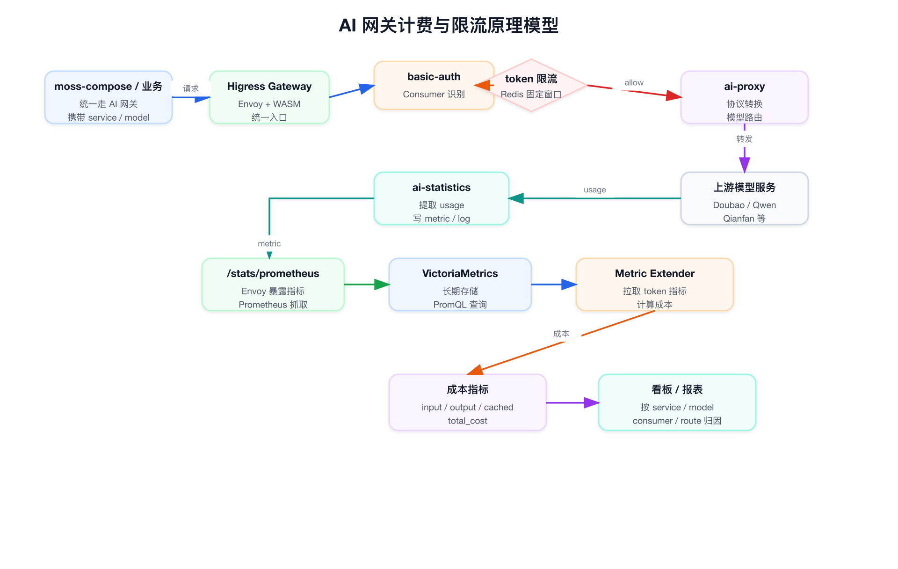
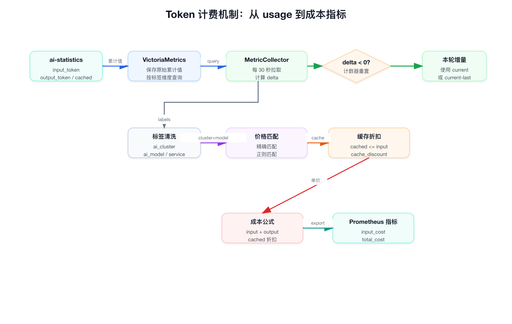
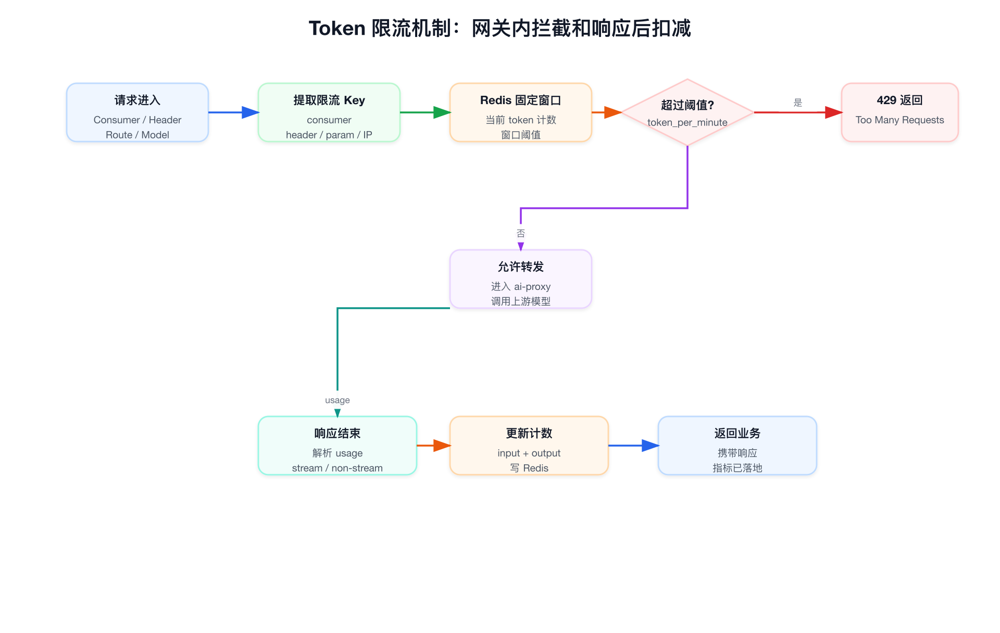
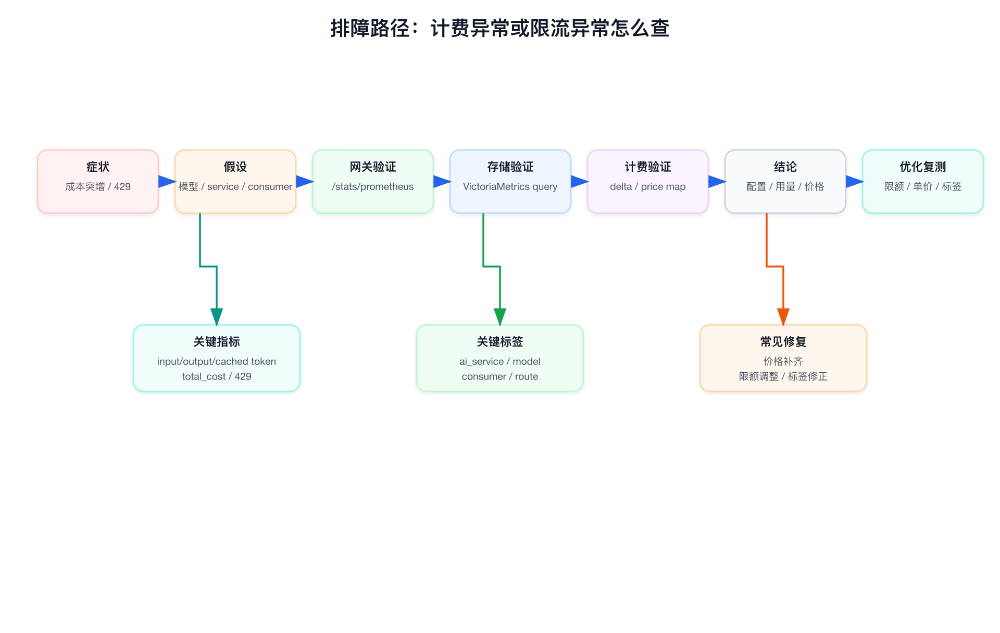
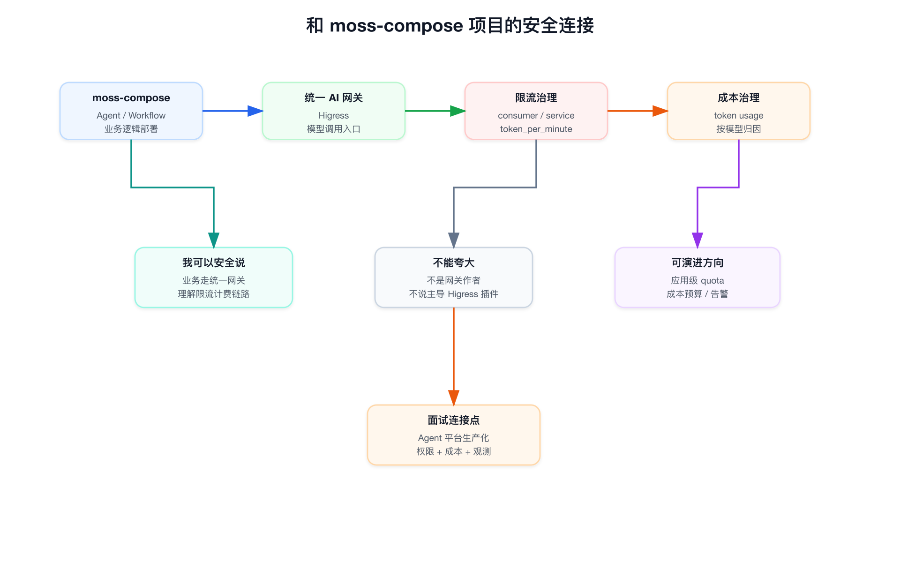

# 面试定位卡

- **技术点**：AI 网关的模型调用限流、Token 统计和成本归因
- **所属领域**：
  - Agent 应用平台生产化
  - AI Gateway / Higress / Envoy / WASM
  - 模型 Provider 治理
  - Prometheus / VictoriaMetrics / 成本指标扩展
- **面试价值**：
  - 百炼这类平台不只考 Agent 编排，也会考模型调用入口、用量控制、成本归因和租户治理。
  - moss-compose 如果只讲 Agent、Workflow、RAG、MCP，会缺少企业级平台最容易追问的“谁在用、用了多少、超了怎么办、费用怎么算”。
- **常见考法**：
  - 为什么 Agent 平台不能让业务直接调模型 API。
  - Token 限流和 QPS 限流有什么不同。
  - Streaming 响应下怎么统计 token 和成本。
  - 计费为什么可以异步，限流为什么必须在线。
  - 模型、应用、团队、consumer、service 这些标签怎么做成本归因。
- **适合挂钩项目**：
  - moss-compose：业务侧 Agent / Workflow 模型调用统一走 AI 网关。
  - SAE / SAI / 可观测平台：从平台工程视角解释网关、指标、限流、归因和排障。
- **不适合夸大的地方**：
  - 不说自己主导开发 Higress AI 网关或 WASM 插件。
  - 不说自己负责公司模型计费系统全链路。
  - 可以说“业务逻辑部署和 Agent 平台接入统一 AI 网关，我理解并能解释限流、统计、计费和观测链路”。

# 三十秒回答

Agent 应用平台离不开统一 AI 网关，因为模型调用不是普通 HTTP 调用，它同时涉及 API Key 管理、模型路由、Token 用量、成本归因、调用限流、错误重试和可观测。

Soul 这边模型调用收敛在基于 Higress 的 AI 网关上，在线链路通过 WASM 插件做认证、Token 限流、模型代理和 usage 统计，离线或旁路链路再从 VictoriaMetrics 拉取 input、output、cached token 指标，按模型价格表计算成本指标。

我在 moss-compose 里更安全的表达是：业务侧 Agent / Workflow 的模型调用统一接入这层网关，我不是网关插件作者，但理解这套机制为什么对 Agent 平台生产化关键。限流解决调用失控和资源保护，计费解决团队、应用、模型维度的成本透明。

# 为什么需要它

- **没有统一网关之前的问题**：
  - 各业务直接配置模型 API Key、base_url 和模型名，调用入口分散。
  - 每个业务自己做重试、错误处理、Token 统计和成本估算，口径不统一。
  - Agent / Workflow 可能一次用户请求触发多次模型调用，成本和流量容易失控。
  - 平台无法按应用、团队、consumer、service、model 追踪到底谁用了多少。
- **AI 网关解决方式**：
  - 把模型调用入口收敛到 Higress。
  - 在线插件链路做认证、Token 限流、模型代理、协议转换和 usage 统计。
  - 指标链路把 token 指标暴露到 Prometheus / VictoriaMetrics。
  - 扩展服务根据 token 增量和模型价格表生成成本指标。
- **它引入的新问题**：
  - 计费准确性依赖模型 usage、指标采集、标签归因和价格表。
  - 限流配置需要平衡保护和可用性，尤其是大上下文、长输出和流式响应。
  - 标签维度太少会归因不清，标签维度太多会带来指标基数压力。
- **必须关注的场景**：
  - Agent 平台多租户接入。
  - 业务批量跑 Prompt、RAG 评测、Workflow 自动化任务。
  - 模型切换、模型价格变化、缓存 Token 折扣变化。
  - 某个应用突然成本飙升或频繁 429。

# 核心概念表

- **AI 网关**：
  - 统一模型调用入口。
  - 在这里做鉴权、路由、协议转换、限流、统计和观测。
- **Higress / Envoy**：
  - 网关数据面基础。
  - Envoy 暴露 `/stats/prometheus`，Higress 通过 WASM 插件扩展 AI 能力。
- **basic-auth 插件**：
  - 负责请求认证。
  - 认证成功后会标识调用方 consumer，为后续限流和归因提供维度。
- **ai-token-ratelimit 插件**：
  - 基于 Redis 做分布式 Token 限流。
  - 支持 header、param、consumer、cookie、IP 等限流维度。
  - 超限返回 429。
- **ai-proxy 插件**：
  - 做 AI 代理核心逻辑。
  - 包括模型映射、OpenAI 协议标准化、上游转发、流式和非流式响应处理。
- **ai-statistics 插件**：
  - 统计 duration、token usage、首包延迟、HTTP 状态码和 trace 信息。
  - 为后续指标和成本归因提供数据基础。
- **Token 指标**：
  - input token、output token、cached token。
  - 是成本计算和容量控制的核心口径。
- **成本指标扩展服务**：
  - 从 VictoriaMetrics 查询 token 累计值。
  - 计算增量，再按模型价格表输出 input_cost、output_cost、cached_cost、total_cost。

# 原理模型



- **在线请求链路**：
  - moss-compose 或业务服务发起模型调用。
  - 请求先进入 Higress AI 网关。
  - basic-auth 识别调用方。
  - ai-token-ratelimit 查询 Redis 判断 token 限额。
  - ai-proxy 转换协议、选择模型、转发到上游模型服务。
  - ai-statistics 解析响应 usage，记录 token、latency、status、trace。
- **指标采集链路**：
  - Envoy 通过 `/stats/prometheus` 暴露指标。
  - 指标带上 `ai_route`、`ai_cluster`、`ai_model`、`ai_consumer`、`ai_service` 等标签。
  - VictoriaMetrics 存储网关侧累计 token 指标。
- **成本计算链路**：
  - `ai-gateway-extend-metric` 每 30 秒查询 VictoriaMetrics。
  - 对 input、output、cached token 计算本批次增量。
  - 按 `ai_cluster` 和 `ai_model` 查价格表。
  - 输出成本类 Prometheus 指标，供看板、报表或告警使用。

# 关键机制

## 计费机制



- **计费不是直接在网关请求线程里做复杂计算**：
  - 网关在线链路主要负责采集 usage 和暴露指标。
  - 成本扩展服务异步拉取累计 token 指标，再计算增量和成本。
  - 这样不会把价格表、报表逻辑和在线调用强耦合。
- **核心指标口径**：
  - `route_upstream_model_consumer_service_metric_input_token`
  - `route_upstream_model_consumer_service_metric_output_token`
  - `route_upstream_model_consumer_service_metric_cached_token`
- **成本输出口径**：
  - input token 总量。
  - output token 总量。
  - cached token 总量。
  - cached cost。
  - input cost。
  - output cost。
  - total cost。
- **增量计算方式**：
  - VictoriaMetrics 中的 token 通常是累计值。
  - 扩展服务保存上一次看到的值。
  - 本次值减去上次值，就是这一轮新增 token。
  - 如果 delta 小于 0，说明可能发生计数器重置，代码会把当前值当作增量。
- **价格匹配方式**：
  - 从 `ai_cluster` 中用正则提取 `llm-xxx` 里的 `xxx` 作为价格配置 cluster。
  - 再用 `ai_model` 匹配模型单价。
  - 先精确匹配，再正则匹配。
  - 没匹配到时默认价格是 0，这对防止错误计费保守，但会带来漏计风险。
- **缓存 Token 计费**：
  - cached token 按 input 单价乘以缓存折扣。
  - input 实际成本等于非缓存 input 原价成本加缓存 input 折扣成本。
  - 如果 cached token 大于 input token，代码会把 cached token capped 到 input token，避免异常数据把成本算穿。

## 限流机制



- **限流发生在在线链路**：
  - 请求进入网关后，先识别调用方和限流 key。
  - ai-token-ratelimit 查询 Redis 当前 token 消耗。
  - 如果超过阈值，直接返回 429。
  - 如果未超过阈值，继续转发到 ai-proxy 和上游模型。
- **为什么是 Token 限流，不只是 QPS 限流**：
  - 同样一次请求，短 Prompt 和超长 Prompt 的模型成本完全不同。
  - 同样一个 QPS，大上下文和长输出会放大上游压力和费用。
  - Agent / Workflow 里一次用户输入可能触发多轮模型调用，Token 更接近真实资源消耗。
- **Redis 的作用**：
  - 多网关实例之间共享限流状态。
  - 支持分布式固定窗口限流。
  - 适合按 consumer、header、route、service 等维度做统一控制。
- **Streaming 的难点**：
  - 精确 output token 往往要等响应结束或 usage 出现后才知道。
  - 所以限流通常是“前置检查 + 响应后更新消耗”。
  - 这种机制能保护大部分场景，但可能存在短时间超发，需要合理设置窗口和阈值。

## 标签归因机制

- **网关侧标签来源**：
  - Envoy bootstrap 中配置了 `stats_tags`，从 `wasmcustom...` 指标名中提取 AI 标签。
  - 关键标签包括 `ai_route`、`ai_cluster`、`ai_model`、`ai_consumer`、`ai_service`。
- **扩展服务侧标签清洗**：
  - 只保留成本归因需要的标签。
  - 把 `instance` 改成 `gateway_instance`。
  - 把 `cluster` 改成 `gateway_cluster`。
  - 把 `pod` 或 `kubernetes_pod_name` 改成 `gateway_pod`。
  - 缺失标签填 `unknown`。
- **面试表达重点**：
  - 标签是计费系统的“账本维度”。
  - 没有稳定标签，成本只能算总量，不能回答哪个模型、哪个业务、哪个 consumer、哪个 route 导致成本变化。

# 横向对比

- **直接业务调用模型 API**：
  - 优点是接入快。
  - 问题是 API Key、成本、限流、错误处理、观测都分散。
  - 适合 demo 或小规模试验，不适合企业内部多团队 Agent 平台。
- **业务侧 SDK 内置限流和计费**：
  - 优点是业务可以按自己的逻辑细调。
  - 问题是每个业务重复实现，口径不一致，也难以做全局预算和全局治理。
  - 适合单业务深度定制，不适合平台统一治理。
- **统一 AI 网关**：
  - 优点是入口统一、鉴权统一、限流统一、模型路由统一、指标统一。
  - 问题是网关成为关键路径，配置错误会影响面更大。
  - 适合 moss-compose、百炼这类 Agent 应用平台。
- **离线日志计费**：
  - 优点是对在线链路侵入低。
  - 问题是延迟更高，数据准确性依赖日志完整性和解析能力。
  - 更适合账单补偿和离线审计，不适合实时预算控制。
- **在线强计费扣减**：
  - 优点是预算控制强，可以实时拒绝。
  - 问题是复杂度高，对高并发和 streaming 场景要求更高。
  - 适合强预算、强租户隔离场景，但需要更完整的余额、预扣、回滚和补偿机制。

# 典型业务场景

- **Agent 应用生产化**：
  - 一个 Agent 可能包含 Prompt、RAG、工具调用、多轮模型决策。
  - 平台需要知道一次用户请求背后消耗了多少 token，哪个模型贵，哪个工具链路触发了大输出。
- **Workflow 批量任务**：
  - Workflow 可能定时批量跑总结、分类、抽取、评测。
  - 如果没有 token 限流和成本指标，任务量一放大就容易拖垮模型配额或产生异常成本。
- **RAG 问答平台**：
  - 召回内容变长会直接推高 input token。
  - 需要把检索参数、上下文长度、模型选择和成本变化关联起来看。
- **多模型 Provider 管理**：
  - 同一个平台可能接 OpenAI 兼容协议、Ark、Qwen、Doubao、Qianfan 或内部模型。
  - 统一网关可以屏蔽调用差异，但成本归因必须保留模型和上游标签。
- **预算和告警**：
  - 当 `total_cost` 按 service、consumer、model 维度突增时，可以触发告警。
  - 进一步定位是调用量增加、模型切换、Prompt 变长、RAG 召回变多，还是 cached token 比例下降。

# 排障路径



## 成本突然变成 0

- 先看网关指标是否存在：

```bash
curl -s "${GATEWAY_STATS}/stats/prometheus" | grep -E "route_upstream_model_consumer_service_metric_(input|output|cached)_token"
```

- 再看 VictoriaMetrics 是否能查到当前 cluster 的 token 指标：

```bash
curl -G "${VM_URL}/api/v1/query" --data-urlencode 'query=route_upstream_model_consumer_service_metric_input_token{cluster="test-sae-ack"}'
```

- 然后看扩展服务是否输出成本指标：

```bash
curl -s "${EXTEND_METRIC}/metrics" | grep -E "route_upstream_model_consumer_service_metric_(input|output|total)_cost"
```

- 如果 token 有但 cost 为 0，重点查：
  - `ai_cluster` 是否符合 `llm-xxx` 命名约定。
  - `ai_model` 是否能在价格表精确匹配或正则匹配。
  - 标签是否被清洗成 `unknown`。
  - price map 是否漏了新模型。

## 成本突然升高

- 先按标签拆解：
  - 哪个 `ai_service` 上升。
  - 哪个 `ai_consumer` 上升。
  - 哪个 `ai_model` 上升。
  - 哪个 `ai_route` 上升。
- 再看原因：
  - input token 增加：Prompt、RAG 召回、上下文窗口可能变长。
  - output token 增加：回答长度、系统 Prompt、生成约束可能变化。
  - cached token 下降：缓存命中变差，导致 input 实际成本上升。
  - model 变化：切到了更贵模型。
- 最后做修复：
  - 限制上下文长度。
  - 调整 RAG topK 和切片策略。
  - 给高成本应用单独设置 token quota。
  - 补充模型价格配置和告警阈值。

## 429 突然增多

- 先判断是业务调用量增加还是限流阈值过低。
- 检查 ai-token-ratelimit 配置：
  - `token_per_minute` 是否合理。
  - 限流维度是 consumer、header、route 还是全局。
  - Redis 是否健康，是否存在计数异常。
- 区分两类问题：
  - 单个业务高峰触发 429：需要应用级 quota 或任务削峰。
  - 大面积 429：可能是全局阈值、Redis、网关配置或上游模型配额问题。

## 指标缺失

- 检查 Envoy `/stats/prometheus` 是否可访问。
- 检查 Prometheus scrape 注解是否正确。
- 检查 `proxyStatsMatcher` 是否包含 WASM 指标。
- 检查 VictoriaMetrics 查询条件里的 cluster 是否和实际标签一致。
- 检查扩展服务日志是否出现查询失败、标签缺失或 price map miss。

# 风险、边界和误区

- **不要把限流和计费混为一谈**：
  - 限流是在线控制，必须快速判断并在必要时拒绝。
  - 计费是成本归因，可以异步，但要保证指标口径和标签稳定。
- **不要只做 QPS 限流**：
  - 模型资源消耗主要跟 token 有关。
  - QPS 只能控制请求数量，不能控制上下文长度和输出长度。
- **不要忽略 streaming**：
  - streaming 输出过程中 token 是逐步产生的。
  - 精确 usage 可能在响应末尾才出现。
  - 需要接受“前置检查 + 后置更新”的一致性边界。
- **不要让价格表长期落后模型配置**：
  - 新模型如果没有价格配置，当前实现会回落到 0。
  - 这对避免误扣费保守，但会让成本看板低估。
- **不要把 `unknown` 标签当成正常状态**：
  - `unknown` 可以避免指标写入失败。
  - 但大量 `unknown` 说明归因链路已经断了。
- **不要无限增加标签**：
  - 标签越多，Prometheus / VictoriaMetrics 基数压力越大。
  - 成本归因要保留必要维度，不要把 request_id、user_id 这类高基数字段直接打进核心指标。
- **不要夸大项目边界**：
  - moss-compose 的安全说法是“业务侧统一接入 AI 网关，理解计费限流链路”。
  - 不说自己实现了 Higress 插件、Redis 限流算法或公司账单系统。

# 和项目的安全连接



- **我能说的连接**：
  - moss-compose 作为 Agent 应用平台，业务逻辑部署后模型调用统一走 Soul 的 AI 网关。
  - Agent / Workflow / RAG 的模型调用都天然会消耗 token，因此平台必须能接入统一限流和成本口径。
  - 我参与的是 moss-compose 前期私有化和企业适配，能从业务接入侧解释为什么需要网关、调用方身份、模型配置、成本和观测。
- **我不夸大的边界**：
  - AI 网关本身的 Higress 插件不是我主导开发。
  - 计费扩展服务不是我主导设计。
  - 我不会把网关内核能力包装成 moss-compose 项目成果。
- **可以自然展开的面试点**：
  - Agent 平台为什么需要模型网关。
  - 业务调用怎么带上 service、consumer、model 等归因维度。
  - 如何避免一个 Workflow 批处理任务打爆模型预算。
  - 如何从 token、latency、error、trace、cost 排查一次 Agent 调用。
  - 如果百炼要做企业级私有化，成本、限流、审计和可观测是必选项。

# 面试追问树

- **如果问：为什么不用业务自己限流？**
  - 业务自己限流只能保护单个服务，不能做跨业务、跨应用、跨模型的全局治理。
  - 模型调用还涉及 API Key、模型路由、usage 统计和统一成本归因，放在网关更合理。
- **如果追问：Token 限流怎么做？**
  - 先识别调用方和限流 key。
  - 用 Redis 维护分布式窗口计数。
  - 请求前判断是否超过 token 阈值。
  - 响应后根据 usage 更新 token 消耗。
  - streaming 场景要接受后置更新带来的短时间误差。
- **如果追问：计费为什么不直接在网关做？**
  - 网关是在线关键路径，不适合塞入复杂价格表、报表和历史状态逻辑。
  - 更好的方式是网关输出稳定 token 指标，异步扩展服务计算成本指标。
  - 在线侧要轻，计费侧要准，二者通过指标和标签解耦。
- **如果追问：如何保证成本准确？**
  - 模型响应 usage 要准确。
  - 指标采集不能丢。
  - 标签要稳定。
  - 价格表要及时更新。
  - 计数器 reset、抓取间隔和 cached token 异常要有处理。
- **如果追问：怎么做多租户归因？**
  - 至少要有 service、consumer、route、model、cluster。
  - 如果要到团队或应用维度，需要业务侧在调用时把 app/team 信息映射到稳定标签或网关可识别 header。
  - 不能直接把高基数字段放进 Prometheus 标签。
- **如果追问：百炼这种平台会怎么做？**
  - 平台层应该把 Agent 应用、Workflow、知识库、工具和模型调用统一纳入租户治理。
  - AI 网关负责模型入口治理。
  - 控制面负责应用、空间、权限、模型配置和预算策略。
  - 观测面负责 trace、token、latency、error 和 cost。

# 高频 Q&A

## Q：Agent 平台里为什么模型调用一定要统一网关？

A：因为 Agent 平台不是单次模型 API 调用。一次用户请求可能触发多轮 LLM、RAG、工具调用和 Workflow 节点。如果让业务各自直连模型，API Key、限流、成本、审计、错误处理都会分散，平台无法回答哪个应用用了多少、哪个模型成本高、哪个租户触发了 429。统一网关把模型调用变成可治理的平台资源。

## Q：Token 限流和 QPS 限流的区别是什么？

A：QPS 控制请求数量，Token 限流控制真实模型资源消耗。一个 1K token 请求和一个 100K token 请求，对上游压力和费用差异很大。Agent / Workflow 里尤其明显，因为一次用户请求可能扩展成多次模型调用，所以 Token 限流比单纯 QPS 更接近成本和容量。

## Q：这套计费链路为什么要经过 VictoriaMetrics？

A：网关在线链路负责把 token usage 变成指标，VictoriaMetrics 负责存储累计指标，计费扩展服务再拉取这些指标算增量和成本。这样在线网关不需要直接维护复杂账单状态，也不会因为价格表计算影响模型调用延迟。

## Q：cached token 是怎么计费的？

A：cached token 属于 input token 的一部分，但价格通常有折扣。代码里是把 cached 部分按 input 单价乘缓存折扣，非 cached input 按原价，二者加起来得到 input 实际成本。为了处理异常数据，如果 cached token 大于 input token，会把 cached token capped 到 input token。

## Q：模型价格变了怎么办？

A：需要更新价格表，并注意价格生效时间。当前扩展服务按采集时的价格表计算增量成本，如果价格表漏了新模型，会回落到 0 成本。面试里可以补一句：生产上更完整的账单系统通常还需要价格版本和生效时间，避免历史成本被新价格重算。

## Q：限流出现误差怎么办？

A：Token 限流很难做到绝对实时准确，尤其是 streaming 响应，真实 output token 要到响应后才能知道。工程上常见做法是请求前基于已有消耗做检查，响应后按 usage 更新计数，再通过较小窗口、合理预估、单请求最大 token、预算告警来降低误差。

## Q：如果业务说它没有超量但被 429，怎么排查？

A：先看 429 是全局还是单业务。然后查限流 key 是 consumer、service、route 还是 header，确认业务请求打到哪个维度；再查 Redis 计数、token_per_minute 配置、窗口时间和实际 input/output token。最后看是否是 Workflow 批量任务、重试风暴或多个实例共享同一个 consumer 导致的叠加。

# 三档背诵版

## 十秒版

Agent 平台必须有统一 AI 网关，因为模型调用要统一做鉴权、限流、模型路由、Token 统计和成本归因。Soul 这边是 Higress 插件做在线限流和 usage 统计，再由扩展服务从 VictoriaMetrics 拉 token 指标计算成本。

## 一分钟版

moss-compose 这类 Agent 应用平台里，模型调用不是简单 API 访问。一次 Agent 或 Workflow 调用可能触发多次模型请求，所以必须有统一入口做治理。Soul 的 AI 网关基于 Higress，插件链路里 basic-auth 识别调用方，ai-token-ratelimit 基于 Redis 做 Token 限流，ai-proxy 做模型代理和协议标准化，ai-statistics 记录 token、延迟、状态码和 trace。成本侧不是在网关请求线程里直接算，而是把 token 指标暴露给 Prometheus / VictoriaMetrics，再由 ai-gateway-extend-metric 按模型价格表计算 input、output、cached 和 total cost。我的项目表达边界是业务侧统一接入这层网关，理解这套限流和计费机制，不把网关插件说成自己开发。

## 三分钟版

如果面试官问 Agent 平台的模型计费和限流，我会先拆成在线控制和异步归因两部分。在线控制发生在 Higress 网关，网关通过 WASM 插件完成认证、Token 限流、模型代理和 usage 统计。Token 限流比 QPS 更贴近模型资源，因为长上下文、长输出和多轮 Agent 调用都会放大成本。限流状态放 Redis，支持分布式网关实例共享，超限直接返回 429。

计费归因走指标链路。Envoy 暴露 `/stats/prometheus`，指标里通过 stats tag 抽出 route、cluster、model、consumer、service 等标签。VictoriaMetrics 存储 input、output、cached token 累计值。扩展服务定时查询这些累计值，计算本轮 delta，再根据 `ai_cluster` 和 `ai_model` 匹配价格表，输出 input_cost、output_cost、cached_cost、total_cost。cached token 按 input 单价乘折扣计算，异常情况下 cached 大于 input 会被 capped。

和 moss-compose 的关系是，moss-compose 作为 Agent 应用平台承载业务逻辑和应用编排，模型调用统一走 AI 网关。我能安全表达的是自己理解并接入这套模型调用治理链路，知道如何从 token、cost、429、model、service、consumer 维度排查问题，但不会把 Higress 插件或公司账单系统说成自己主导开发。

# 面试前检查清单

- 能说清楚“限流在线、计费异步”的区别。
- 能说清楚 basic-auth、ai-token-ratelimit、ai-proxy、ai-statistics 各自职责。
- 能说清楚 input、output、cached token 的成本公式。
- 能说清楚为什么 default price 为 0 有漏计风险。
- 能说清楚 Redis 固定窗口 Token 限流的优点和误差。
- 能说清楚 streaming usage 的统计难点。
- 能说清楚标签归因为什么比单纯总成本更重要。
- 能说清楚 moss-compose 项目中自己的边界，不夸大网关开发职责。

# 图示清单

- `01_ai_gateway_billing_ratelimit_principle.png`：AI 网关计费与限流总链路。
- `02_ai_gateway_billing_mechanism.png`：Token 计费和成本扩展机制。
- `03_ai_gateway_rate_limit_mechanism.png`：Token 限流在线机制。
- `04_ai_gateway_troubleshooting.png`：成本异常和限流异常排障路径。
- `05_ai_gateway_project_connection.png`：和 moss-compose 项目的安全连接。

# 代码证据索引

- [ai_proxy_flow_diagram.md](/opt/coding/code.soulapp-inc.cn/arch/higress-gateway/ai_proxy_flow_diagram.md:5)：Higress AI 代理插件链路，包括 basic-auth、ai-token-ratelimit、ai-proxy、ai-statistics。
- [ai_proxy_flow_diagram.md](/opt/coding/code.soulapp-inc.cn/arch/higress-gateway/ai_proxy_flow_diagram.md:69)：ai-token-ratelimit 的 Redis 分布式限流、限流维度和固定窗口说明。
- [ai_proxy_flow_diagram.md](/opt/coding/code.soulapp-inc.cn/arch/higress-gateway/ai_proxy_flow_diagram.md:115)：ai-statistics 统计 token usage、首包延迟、状态码和 trace。
- [envoy_bootstrap_tmpl.json.tpl](/opt/coding/code.soulapp-inc.cn/arch/higress-gateway/deploy/higress-gateway/envoy_bootstrap_tmpl.json.tpl:63)：Envoy `stats_tags` 从 WASM 指标名中提取 AI 归因标签。
- [envoy_bootstrap_tmpl.json.tpl](/opt/coding/code.soulapp-inc.cn/arch/higress-gateway/deploy/higress-gateway/envoy_bootstrap_tmpl.json.tpl:199)：Prometheus stats cluster 和 `/stats/prometheus` 路由。
- [local-higress.yaml](/opt/coding/code.soulapp-inc.cn/arch/higress-gateway/deploy/local-higress.yaml:113)：access log 中输出 `wasm.ai_log`。
- [local-higress.yaml](/opt/coding/code.soulapp-inc.cn/arch/higress-gateway/deploy/local-higress.yaml:121)：`proxyStatsMatcher` 包含全部 stats。
- [local-higress.yaml](/opt/coding/code.soulapp-inc.cn/arch/higress-gateway/deploy/local-higress.yaml:977)：Prometheus scrape 注解使用 `/stats/prometheus` 和 15020 端口。
- [config.py](/opt/coding/code.soulapp-inc.cn/arch/ai-gateway-extend-metric/src/config.py:6)：成本扩展服务配置，包括 VictoriaMetrics 地址、采集周期和 cluster。
- [config.py](/opt/coding/code.soulapp-inc.cn/arch/ai-gateway-extend-metric/src/config.py:22)：token 和 cost 指标名称、归因标签配置。
- [metric_collector.py](/opt/coding/code.soulapp-inc.cn/arch/ai-gateway-extend-metric/src/core/metric_collector.py:25)：Prometheus Counter 初始化和指标输出。
- [metric_collector.py](/opt/coding/code.soulapp-inc.cn/arch/ai-gateway-extend-metric/src/core/metric_collector.py:83)：按 token 类型、cluster、model 计算成本。
- [metric_collector.py](/opt/coding/code.soulapp-inc.cn/arch/ai-gateway-extend-metric/src/core/metric_collector.py:109)：考虑 cached token 折扣的 input 成本计算。
- [metric_collector.py](/opt/coding/code.soulapp-inc.cn/arch/ai-gateway-extend-metric/src/core/metric_collector.py:143)：标签过滤、重命名和缺失标签补 `unknown`。
- [metric_collector.py](/opt/coding/code.soulapp-inc.cn/arch/ai-gateway-extend-metric/src/core/metric_collector.py:193)：累计指标增量计算和计数器 reset 处理。
- [metric_collector.py](/opt/coding/code.soulapp-inc.cn/arch/ai-gateway-extend-metric/src/core/metric_collector.py:252)：按批次计算 output、cached、input、total cost。
- [metric_collector.py](/opt/coding/code.soulapp-inc.cn/arch/ai-gateway-extend-metric/src/core/metric_collector.py:339)：查询 VictoriaMetrics 中 input、output、cached token 指标。
- [metric_collector.py](/opt/coding/code.soulapp-inc.cn/arch/ai-gateway-extend-metric/src/core/metric_collector.py:372)：采集循环按配置周期运行。
- [price_config.py](/opt/coding/code.soulapp-inc.cn/arch/ai-gateway-extend-metric/src/utils/price_config.py:9)：模型价格配置表。
- [price_config.py](/opt/coding/code.soulapp-inc.cn/arch/ai-gateway-extend-metric/src/utils/price_config.py:83)：价格获取逻辑，先精确匹配，再正则匹配，最后默认 0。
- [app.py](/opt/coding/code.soulapp-inc.cn/arch/ai-gateway-extend-metric/src/app.py:21)：服务启动时创建后台指标采集任务。
- [app.py](/opt/coding/code.soulapp-inc.cn/arch/ai-gateway-extend-metric/src/app.py:28)：`/metrics` 暴露 Prometheus 指标。
- [prometheus_query_client.py](/opt/coding/code.soulapp-inc.cn/arch/ai-gateway-extend-metric/src/core/prometheus_query_client.py:16)：通过 `/api/v1/query` 查询 Prometheus / VictoriaMetrics。
